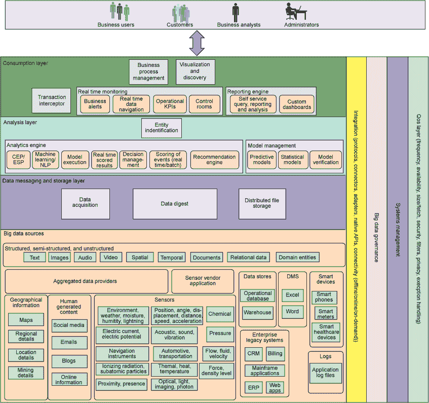

# 理解大数据解决方案的架构层

> 原文：[`developer.ibm.com/zh/articles/bd-archpatterns3/`](https://developer.ibm.com/zh/articles/bd-archpatterns3/)

## 概述

这个 “大数据架构和模式” 系列的 [第 2 部分](http://www.ibm.com/developerworks/cn/data/library/bd-archpatterns2/index.html) 介绍了一种评估大数据解决方案可行性的基于维度的方法。如果您已经使用上一篇文章中的问题和提示分析了自己的情况，并且已经决定开始构建新的（或更新现有的）大数据解决方案，那么下一步就是识别定义项目的大数据解决方案所需的组件。

## 大数据解决方案的逻辑层

逻辑层提供了一种组织您的组件的方式。这些层提供了一种方法来组织执行特定功能的组件。这些层只是逻辑层；这并不意味着支持每层的功能在独立的机器或独立的进程上运行。大数据解决方案通常由以下逻辑层组成：

1.  大数据来源
2.  数据改动 (massaging) 和存储层
3.  分析层
4.  使用层

5.  **大数据来源：** 考虑来自所有渠道的，所有可用于分析的数据。要求组织中的数据科学家阐明执行您需要的分析类型所需的数据。数据的格式和起源各不相同：

    *   **格式** — 结构化、半结构化或非结构化。
    *   **速度和数据量** — 数据到达的速度和传送它的速率因数据源不同而不同。
    *   **收集点** — 收集数据的位置，直接或通过数据提供程序，实时或以批量模式收集数据。数据可能来自某个主要来源，比如天气条件，也有可能来自一个辅助来源，比如媒体赞助的天气频道。
    *   **数据源的位置** — 数据源可能位于企业内或外部。识别您具有有限访问权的数据，因为对数据的访问会影响可用于分析的数据范围。
6.  **数据改动和存储层：** 此层负责从数据源获取数据，并在必要时，将它转换为适合数据分析方式的格式。例如，可能需要转换一幅图，才能将它存储在 Hadoop Distributed File System (HDFS) 存储或关系数据库管理系统 (RDBMS) 仓库中，以供进一步处理。合规性制度和治理策略要求为不同的数据类型提供合适的存储。
7.  **分析层：** 分析层读取数据改动和存储层整理 (digest) 的数据。在某些情况下，分析层直接从数据源访问数据。设计分析层需要认真地进行事先筹划和规划。必须制定如何管理以下任务的决策：

    *   生成想要的分析
    *   从数据中获取洞察
    *   找到所需的实体
    *   定位可提供这些实体的数据的数据源
    *   理解执行分析需要哪些算法和工具。
8.  **使用层：** 此层使用了分析层所提供的输出。使用者可以是可视化应用程序、人类、业务流程或服务。可视化分析层的结果可能具有挑战。有时，看看类似市场中的竞争对手是如何做的会有所帮助。

每一层包含多种组件类型，下面将会介绍这些类型。

##### 图 1.逻辑和垂直层的组件

### 大数据来源

此层包含所有必要的数据源，提供了解决业务问题所需的洞察。数据是结构化、半结构化和非结构化的数据，而且来自许多来源：

*   **企业遗留系统** — 这些系统是企业应用程序，执行业务需要的分析并获取需要的洞察：

    *   客户关系管理系统
    *   结算操作
    *   大型机应用程序
    *   企业资源规划
    *   Web 应用程序开发

    Web 应用程序和其他数据来源扩充了企业拥有的数据。这些应用程序可使用自定义的协议和机制来公开数据。

*   **数据管理系统 (DMS)** — 数据管理系统存储逻辑数据、流程、策略和各种其他类型的文档：

    *   Microsoft® Excel® 电子表格
    *   Microsoft Word 文档

    这些文档可以转换为可用于分析的结构化数据。文档数据可公开为领域实体，或者数据改动和存储层可将它转换为领域实体。

*   **数据存储** — 数据存储包含企业数据仓库、操作数据库和事务数据库。此数据通常是结构化数据，可直接使用或轻松地转换来满足需求。这些数据不一定存储在分布式文件系统中，具体依赖于所处的上下文。
*   **智慧设备** — 智慧设备能够捕获、处理和传输使用最广泛的协议和格式的信息。这方面的示例包括智能电话、仪表和医疗设备。这些设备可用于执行各种类型的分析。绝大多数智慧设备都会执行实时分析，但从智慧设备传来的信息也可批量分析。
*   **聚合的数据提供程序** — 这些提供程序拥有或获取数据，并以复杂的格式和所需的频率通过特定的过滤器公开它。每天都会产生海量的数据，它们具有不同的格式，以不同的速度生成，而且通过各种数据提供程序、传感器和现有企业提供。
*   **其他数据源** — 有许多数据来自自动化的来源：

    *   *地理信息：* *地图* 地区详细信息 *位置详细信息* 矿井详细信息
    *   *人类生成的内容：* *社交媒体* 电子邮件 *博客* 在线信息
    *   *传感器数据：* *环境：天气、降雨量、湿度、光线* 电气：电流、能源潜力等 *导航装置* 电离辐射、亚原子粒子等 *靠近、存在等* 位置、角度、位移、距离、速度、加速度 *声音、声震动等* 汽车、运输等 *热量、热度、温度* 光学、光、成像、见光度 *化学* 压力 *流动、流体、速度* 力、密度级别等 *来自传感器供应商的其他数据

### 数据改动和存储层

因为传入的数据可能具有不同的特征，所以数据改动和存储层中的组件必须能够以各种频率、格式、大小和在各种通信渠道上读取数据：

*   **数据获取** — 从各种数据源获取数据，并将其发送到数据整理组件或存储在指定的位置中。此组件必须足够智能，能够选择是否和在何处存储传入的数据。它必须能够确定数据在存储前是否应改动，或者数据是否可直接发送到业务分析层。
*   **数据整理** — 负责将数据修改为需要的格式，以实现分析用途。此组件可拥有简单的转换逻辑或复杂的统计算法来转换源数据。分析引擎将会确定所需的特定的数据格式。主要的挑战是容纳非结构化数据格式，比如图像、音频、视频和其他二进制格式。
*   **分布式数据存储** — 负责存储来自数据源的数据。通常，这一层中提供了多个数据存储选项，比如分布式文件存储 (DFS)、云、结构化数据源、NoSQL 等。

### 分析层

这是从数据中提取业务洞察的层：

*   **分析层实体识别** — 负责识别和填充上下文实体。这是一个复杂的任务，需要高效的高性能流程。数据整理组件应为这个实体识别组件提供补充，将数据修改为需要的格式。分析引擎将需要上下文实体来执行分析。
*   **分析引擎** — 使用其他组件（具体来讲，包括实体鉴别、模型管理和分析算法）来处理和执行分析。分析引擎可具有支持并行处理的各种不同的工作流、算法和工具。
*   **模型管理** — 负责维护各种统计模型，验证和检验这些模型，通过持续培训模型来提高准确性。然后，模型管理组件会推广这些模型，它们可供实体识别或分析引擎组件使用。

### 使用层

这一层使用了从分析应用程序获取的业务洞察。分析的结果由组织内的各个用户和组织外部的实体（比如客户、供应商、合作伙伴和提供商）使用。此洞察可用于针对客户提供产品营销信息。例如，借助从分析中获取的洞察，公司可以使用客户偏好数据和位置感知，在客户经过通道或店铺时向他们提供个性化的营销信息。

该洞察可用于检测欺诈，实时拦截交易，并将它们与使用已存储在企业中的数据构建的视图进行关联。在欺诈性交易发生时，可以告知客户可能存在欺诈，以便及时采取更正操作。

此外，可以根据在数据改动层完成的分析来触发业务流程。可以启动自动化的步骤 — 例如，如果客户接受了一条可自动触发的营销信息，则需要创建一个新订单，如果客户报告了欺诈，那么可以触发对信用卡使用的阻止。

分析的输出也可由推荐引擎使用，该引擎可将客户与他们喜欢的产品相匹配。推荐引擎分析可用的信息，并提供个性化且实时的推荐。

使用层还为内部用户提供了理解、找到和导航企业内外的链锁信息的能力。对于内部使用者，为业务用户构建报告和仪表板的能力使得利益相关者能够制定精明的决策并设计恰当的战略。为了提高操作有效性，可以从数据中生成实时业务警告，而且可以监视操作性的关键绩效指标：

*   **交易拦截器** — 此组件可实时拦截高容量交易，将它们转换为一种容易被分析层理解的实时格式，以便在传入数据上执行实时分析。事务拦截器应能够集成并处理来自各种来源的数据，比如传感器、智能仪表、麦克风、摄像头、GPS 设备、ATM 和图像扫描仪。可以使用各种类型的适配器和 API 来连接到数据源。也可以使用各种加速器来简化开发，比如实时优化和流分析，视频分析，银行、保险、零售、电信和公共运输领域的加速器，社交媒体分析，以及情绪分析。
*   **业务流程管理流程** — 来自分析层的洞察可供业务流程执行语言 (BPEL) 流程、API 或其他业务流程使用，通过自动化上游和下游 IT 应用程序、人员和流程的功能，进一步获取业务价值。
*   **实时监视** — 可以使用从分析中得出的数据来生成实时警告。可以将警告发送给感兴趣的使用者和设备，比如智能电话和平板电脑。可以使用从分析组件生成的数据洞察，定义并监视关键绩效指标，以便确定操作有效性。实时数据可从各种来源以仪表板的形式向业务用户公开，以便监视系统的健康或度量营销活动的有效性。
*   **报告引擎** — 生成与传统商业智能报告类似的报告的能力至关重要。用户可基于从分析层中得到的洞察，创建临时报告、计划的报告或自助查询和分析。
*   **推荐引擎** — 基于来自分析层的分析结果，推荐引擎可向购物者提供实时的、相关的和个性化的推荐，提高电子商务交易中的转换率和每个订单的平均价值。该引擎实时处理可用信息并动态地响应每个用户，响应基于用户的实时活动、存储在 CRM 系统中的注册客户信息，以及非注册客户的社交概况。
*   **可视化和发现** — 数据可跨企业内外的各种联邦的数据源进行导航。数据可能具有不同的内容和格式，所有数据（结构化、半结构化和非结构化）可组合来进行可视化并提供给用户。此能力使得组织能够将其传统的企业内容（包含在企业内容管理系统和数据仓库中）与新的社交内容（例如 tweet 和博客文章）组合到单个用户界面中。

## 垂直层

影响逻辑层（大数据来源、数据改动和存储、分析和使用层）的所有组件的各方面都包含在垂直层中：

*   信息集成
*   大数据治理
*   系统管理
*   服务质量

### 信息集成

大数据应用程序从各种数据起源、提供程序和数据源获取数据，并存储在 HDFS、NoSQL 和 MongoDB 等数据存储系统中。这个垂直层可供各种组件使用（例如数据获取、数据整理、模型管理和交易拦截器），负责连接到各种数据源。集成将具有不同特征（例如协议和连接性）的数据源的信息，需要高质量的连接器和适配器。可以使用加速器连接到大多数已知和广泛使用的来源。这些加速器包括社交媒体适配器和天气数据适配器。各种组件还可以使用这一层在大数据存储中存储信息，从大数据存储中检索信息，以便处理这些信息。大多数大数据存储都提供了服务和 API 来存储和检索该信息。

### 大数据治理

数据治理涉及到定义指南来帮助企业制定有关数据的正确决策。大数据治理有助于处理企业内或从外部来源传入的数据的复杂性、量和种类。在将数据传入企业进行处理、存储、分析和清除或归档时，需要强有力的指南和流程来监视、构建、存储和保护数据。

除了正常的数据治理考虑因素之外，大数据治理还包含其他因素：

*   管理各种格式的大量数据。
*   持续培训和管理必要的统计模型，以便对非结构化数据和分析进行预处理。请记住，设置处理非结构化数据时的重要一步。
*   为外部数据设置有关其保留和使用的策略和合规性制度。
*   定义数据归档和清除策略。
*   创建如何跨各种系统复制数据的策略。
*   设置数据加密策略。

### 服务质量层

此层复杂定义数据质量、围绕隐私和安全性的策略、数据频率、每次抓取的数据大小和数据过滤器：

*   **数据质量**

    *   完整地识别所有必要的数据元素
    *   以可接受的新鲜度提供数据的时间轴
    *   依照数据准确性规则来验证数据的准确性
    *   采用一种通用语言（数据元组满足使用简单业务语言所表达的需求）
    *   依据数据一致性规则验证来自多个系统的数据一致性
    *   在满足数据规范和信息架构指南基础上的技术符合性
*   **围绕隐私和安全的策略**

    需要策略来保护敏感数据。从外部机构和提供程序获取的数据可能包含敏感数据（比如 Facebook 用户的联系信息或产品定价信息）。数据可以来源于不同的地区和国家，但必须进行相应的处理。必须制定有关数据屏蔽和这类数据的存储的决策。考虑以下数据访问策略：

    *   数据可用性
    *   数据关键性
    *   数据真实性
    *   数据共享和发布
    *   数据存储和保留，包括能否存储外部数据等问题。如果能够存储数据，数据可存储多长时间？可存储何种类型的数据？
    *   数据提供程序约束（政策、技术和地区）
    *   社交媒体使用条款（参见 参考资料 ）
*   **数据频率**

    提供新鲜数据的频率是多少？它是按需、连续还是离线的？

*   **抓取的数据大小**

    此属性有助于定义可抓取的数据以及每次抓取后可使用的数据大小。

*   **过滤器**

    标准过滤器会删除不想要的数据和数据中的干扰数据，仅留下分析所需的数据。

### 系统管理

系统管理对大数据至关重要，因为它涉及到跨企业集群和边界的许多系统。对整个大数据生态系统的健康的监视包括：

*   管理系统日志、虚拟机、应用程序和其他设备
*   关联各种日志，帮助调查和监视具体情形
*   监视实时警告和通知
*   使用显示各种参数的实时仪表板
*   引用有关系统的报告和详细分析
*   设定和遵守服务水平协议
*   管理存储和容量
*   归档和管理归档检索
*   执行系统恢复、集群管理和网络管理
*   策略管理

## 结束语

对开发人员而言，层提供了一种对大数据解决方案必须执行的功能进行分类的途径，为组织建议必需执行这些功能所需的代码。但是，对于想要从大数据获取洞察的业务用户，考虑大数据需求和范围通常会有所帮助。原子模式解决了访问、处理、存储和使用大数据的机制，为业务用户提供了一种解决需求和范围的途径。下一篇文章将介绍用于此用途的原子模式。

本文翻译自：[Understanding the architectural layers of a big data solution](https://developer.ibm.com/articles/bd-archpatterns3/)（2014-09-15）