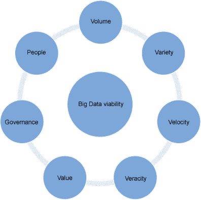

# 如何知道一个大数据解决方案是否适合您的组织

> 原文：[`developer.ibm.com/zh/articles/bd-archpatterns2/`](https://developer.ibm.com/zh/articles/bd-archpatterns2/)

## 简介

在确定投资大数据解决方案之前，评估可用于分析的数据；通过分析这些数据而获得的洞察；以及可用于定义、设计、创建和部署大数据平台的资源。询问正确的问题是一个不错的起点。使用本文中的问题将指导您完成调查。答案将揭示该数据和您尝试解决的问题的更多特征。

尽管组织一般情况对需要分析的数据类型有一些模糊的理解，但具体的细节很可能并不清晰。毕竟，数据可能具有之前未发现的模式的关键，一旦识别了一种模式，对额外分析的需求就会变得很明显。要帮助揭示这些 *未知* 的未知信息，首先需要实现一些基本用例，在此过程中，可以收集以前不可用的数据。构建数据存储库并收集更多数据后，数据科学家就能够更好地确定关键的数据，更好地构建将生成更多洞察的预测和统计模型。

组织可能也已知道它有哪些信息是不知道的。要解决这些 **已知的未知** ，组织首先必须与数据科学家合作，识别外部或第三方数据源，实现一些依赖于此外部数据的用例。

本文首先尝试回答大多数 CIO 在实施大数据举措之前通常会提出的问题，然后，本文将重点介绍一种将帮助评估大数据解决方案对组织的可行性的基于维度的方法。

## 我的大数据问题是否需要大数据解决方案？

大数据，曾几何时似乎很少出现，组织多半会选择以增量方式实现大数据解决方案。不是每个分析和报告需求都需要大数据解决方案。如果对于对大型数据集或来自多个数据源的临时报告执行并行处理的项目，那么可能没有必要使用大数据解决方案。

随着大数据技术的到来，组织会问自己：“大数据是否是我的业务问题的正确解决方案，或者它是否为我提供了业务机会？”大数据中是否隐藏着业务机会？以下是我从 CIO 那里听到的一些典型问题：

*   如果我使用大数据技术，可能会获得何种洞察和业务价值：可通过大数据技术获取何种洞察？
*   它是否可以扩充我我当前的环境能否扩展？
*   我如何评估扩展我当前的环境的成本是多少？或采用新解决方案的成本是多少？
*   对我现有的对数据的治理和控制：对现有的 IT 治理有何影响？
*   我能否增量地实现大数据解决方案？
*   我需要掌握哪些人员：是否已有恰当的技能并调整了合适的人员来理解和分析构建和维护大数据解决方案的需求？
*   我是否拥有可用于获取洞察的现有数据？能否用于提供业务洞察？
*   来自各种来源的数据复杂性是否在增长？大数据解决方案对我有帮助吗？

## 维度可帮助评估大数据解决方案的可行性

为了回答这些问题，本文提出了一种依据下图中所示的维度来评估大数据解决方案的可行性的结构化方法。

##### 图 1.评估大数据解决方案的可行性时要考虑的维度

*   来自可通过分析数据获得的洞察的业务价值
*   针对新数据来源和数据使用方式的治理考虑因素
*   拥有相关技能和赞助商的承诺的人员
*   捕获的数据量
*   各种各样的数据源、数据类型和数据格式
*   生成数据的速度，需要对它执行操作的速度，或者它更改的速度
*   数据的真实性，或者数据的不确定性和可信赖性

对于每个维度，我们都给出了一些关键问题。依据业务上下文，为每个维度分配一个权重和优先级。评估会因业务案例和组织的不同而有所不同。您可以考虑在与相关的业务和 IT 利益相关者召开的一系列研讨会中探讨这些问题。

## 业务价值：可通过大数据技术获取何种洞察？

许多组织想知道，他们在寻找的业务洞察能否通过大数据解决方案解决。没有权威的指南能够用来定义可从大数据获取的洞察。具体场景需要由组织识别，而且这些场景在不断演变。在确定和识别在实现后会给企业带来重大价值的业务用例和场景的过程中，数据科学家起着至关重要的作用。

数据科学家必须能够理解关键绩效指标，对数据应用统计算法和复杂算法来获得一个用例列表。用例因行业和业务不同而有所不同。研究市场竞争对手的行动、发挥作用的市场力量，以及客户在寻找什么，会很有帮助。下表给出了来自各行各业的用例示例。

电子商务和在线零售

*   电子零售商（比如 eBay）在不断创建针对性产品来提高客户终生价值 (CLV)；提供一致的跨渠道客户体验；从销售、营销和其他来源收获客户线索；并持续优化后端流程。
*   推荐引擎：通过基于对交叉销售的预测分析来推荐补充性产品，增加平均订单大小。
*   跨渠道分析：销售属性、平均订单价值和终生价值（例如多少店内购买活动源自特定的推荐、广告或促销）。
*   事件分析：那一系列步骤（黄金路线）得到了想要的结果（例如产品购买或注册）？
*   “恰当时机的恰当产品” 和 “下一款最佳产品”：结合部署预测模型和推荐引擎，得到自动化的下一款最佳产品和跨多个交互渠道的经调整的交互。

零售和专注于客户

*   推销和市场篮分析
*   营销活动管理和客户忠诚度计划
*   供应链管理和分析
*   基于事件和行为的目标
*   市场和用户细分
*   预测分析：在将产品放在货架上之前，零售商希望预测可能对购买者至关重要的一些因素

金融服务

*   合规性和监管报告
*   风险分析和管理
*   欺诈检测和安全分析
*   CRM 和客户忠诚度计划
*   信用风险、评分和分析
*   高速套利交易
*   交易监管
*   异常交易模式分析

欺诈检测

欺诈管理可预测给定交易或客户帐户遇到欺诈的可能性，帮助提高客户带来的利润。解决方案将会实时分析交易，生成立即行动建议，这对阻止第三方欺诈、第一方欺诈和帐户特权的蓄意滥用至关重要。解决方案通常设计用于跨多个行业检测和阻止各种各样的欺诈和风险类型，这些类型包括：

*   信用卡和借记卡欺诈
*   存款帐户欺诈
*   技术欺诈和坏账
*   医疗欺诈
*   医疗补助计划和医疗保险欺诈
*   财产和灾害保险欺诈
*   工伤赔偿欺诈
*   保险欺诈

Web 和数字媒体

*   我们目前处理的许多数据是增多的社交媒体和数字营销的直接后果。客户生成一连串可挖掘并投入使用的 “数据废气”。
*   大规模单击流分析
*   广告投放、分析、预测和优化
*   滥用和单击欺诈预防
*   社交图分析和概要细分
*   营销活动管理和忠诚度计划

公共领域

*   欺诈检测
*   威胁检查
*   网络安全
*   合规性和监管分析
*   能耗和碳排放管理

健康和生命科学

*   健康保险欺诈检测
*   营销活动和销售计划优化
*   品牌管理
*   患者护理质量和程序分析
*   医疗设备和药物供应链管理
*   药品发现和开发分析

电信

*   收入保障和价格优化
*   客户流失预防
*   营销活动管理和客户忠诚度
*   呼叫详细记录 (CDR) 分析
*   网络性能和优化
*   移动用户位置分析

公用事业

公用事业公司运行大型、昂贵、复杂的系统来发电。每个电网包含监视电压、电流、频率和其他重要操作特征的复杂传感器。效率意味着密切关注从传感器传来的所有数据。公用事业公司现在正利用 Hadoop 集群来分析分析发电（供应）和电力消耗（需求）数据。 智慧仪表的采用导致前所未有的数据流汹涌而来。大多数公用事业公司都未做好充分准备在开启仪表后分析该数据。

媒体

在有线行业，大型有线运营商（比如 Time Warner、Comcast 和 Cox Communications）每天都可以使用大数据来分析机顶盒数据。可以利用此数据来调整广告或促销活动。

杂项

*   Mashup：移动用户位置和精度目标
*   机器生成的数据
*   在线约会：一个领先的在线约会服务使用复杂的分析来度量各个成员之间的兼容性，以便建议匹配的商品
*   在线游戏
*   飞机和汽车的预测性维护

潜在的客户正在社交网络和评论站点上生成大量新数据。在企业内，随着客户切换到在线渠道来执行业务和与公司交互，交易数据和 Web 日志与日俱增。

##### 确定数据的优先级

首先为企业内存在的数据创建一个清单。识别内部系统和应用程序中存在的数据以及从第三方传入的数据。如果业务问题可使用现有数据解决，那么有可能不需要使用来自外部来源的数据。

请考虑构建一个大数据解决方案的成本，并权衡它与带给业务部门的新洞察的价值。

在有关现有客户的归档数据的上下文中分析此新数据时，业务人员将获得对新业务机会的洞察。

主要满足以下条件，大数据可提供可行的解决方案：

*   从数据中开发的洞察所生成的价值，值得在大数据解决方案中投入的资本成本
*   面向客户的场景可证明来自洞察的潜在价值

评估通过大数据解决方案获取的业务价值时，请考虑您当前的环境是否可扩展并权衡此投资的成本。

### 我当前的环境能否扩展？

询问以下问题，确定您能否扩充现有的数据仓库平台？

*   当前的数据集是否非常大，是否达到了 TB 或 PB 数量级？
*   现有的仓库环境是否包含生成或获取的 *所有* 数据的存储库？
*   是否有大量冷数据或人们很少接触的数据未分析，可以通过分析这些数据获得业务洞察？
*   您是否需要丢弃数据，因为无法存储或处理它？
*   您是否希望能够在复杂且大量的数据上执行数据探索？
*   您是否希望能够对非操作数据执行分析？
*   您是否有兴趣使用数据执行传统和新类型的分析？
*   您是否试图延迟对现有数据仓库的升级？
*   您是否在寻求途径降低执行分析的总体成本？

如果任何这些问题的答案是 “是”，那么您就可以探索扩充现有数据仓库环境的方式。

### 扩展我当前的环境的成本是多少？

扩展现有数据仓库平台或 IT 环境与实现大数据解决方案的成本和可行性取决于：

*   现有工具和技术
*   现有系统的可伸缩性
*   现有环境的处理能力
*   现有平台的存储能力
*   执行的治理和策略
*   现有 IT 应用程序的异构性
*   组织中存在的技术和业务技能。

它还依赖于将从新数据来源收集的数据量、业务用例的复杂性、处理的分析复杂性，以及获取数据和拥有恰当技能集的人员的成本。现有的资源池能否开发新的大数据技能，或者是否可从外部雇佣拥有稀缺技能的人员？

请注意，大数据举措会对其他正在实施的项目产生影响。从新的来源获取数据具有很高的成本。您首先应当识别系统和应用程序内部存在的数据，以及目前收到的第三方数据，这一点很重要。如果业务问题可以使用现有数据解决，那么有可能不需要使用来自外部来源的数据。

在生成新工具和应用程序之前，请评估组织的应用程序组合。例如，一个普通的 Hadoop 平台可能无法满足您的需求，您可能必须购买专业的工具。或者相对而言，Hadoop 的商业版本对当前用例而言可能很昂贵，但可能需要用作长期投资来支持一个战略性的大数据平台。考虑大数据工具和技术需要的基础架构、硬件、软件和维护的成本。

## 对数据的治理和控制：对现有的 IT 治理有何影响？

在决定是否实现一个大数据平台时，组织可能会查看新数据源和新的数据元素类型，而这些信息当前的所有权尚未明确定义。一些行业制度会约束组织获取和使用的数据。例如，在医疗行业，通过访问患者数据来从中获取洞察是否合法？类似的规则约束着所有行业。除了 IT 治理问题之外，组织的业务流程可能也需要重新定义和修改，让组织能够获取、存储和访问外部数据。

请在您的情况的上下文中考虑以下治理相关问题：

*   **安全性和隐私** — 为了与当地法规一致，解决方案可以访问哪些数据？可以存储哪些数据？哪些数据应在移动过程中加密？静止数据呢？谁可以查看原始数据和洞察？
*   **数据的标准化** — 是否有标准约束数据？数据是否具有专用的格式？是否有部分数据为非标准格式？
*   **数据可用的时段** — 数据在一个允许及时采取操作的时段是否可用？
*   **数据的所有权** — 谁拥有该数据？解决方案是否拥有适当的访问权和权限来使用数据？
*   **允许的用法：** 允许如何使用该数据？

## 我能否增量地实现大数据解决方案？

大数据解决方案可以采用增量方式实现。明确地定义业务问题的范围，并以可度量的方式设置预期的业务收入提升，这样做会很有帮助。

对于基础业务案例，请仔细列出问题的范围和解决方案带来的预期收益。如果该范围太小，业务收益将无法实现，如果范围太大，获得资金和在恰当的期限内完成项目就会很有挑战性。在项目的第一次迭代中定义核心功能，以便能够轻松地赢得利益相关者的信任。

## 人员：是否已有恰当的技能并调整了合适的人员？

需要特定的技能来理解和分析需求，并维护大数据解决方案。这些技能包括行业知识、领域专长，以及有关大数据工具和技术的技术知识。拥有建模、统计、分析和数学方面的专业经验的数据科学家，是任何大数据举措成功的关键。

在实施一个新的大数据项目之前，确保已安排了合适的人员：

*   您是否获得利益相关者和其他愿意投资该项目的业务赞助者的支持？
*   是否拥有熟悉该领域、能分析大量数据、而且能识别从数据生成有意义且有用的洞察的途径的数据科学家？

## 是否拥有可用于获取洞察的现有数据？

所有组织都拥有大量未用于获取业务洞察的数据。这些数据包括日志文件、错误文件和来自应用程序的操作数据。不要忽略此数据，它是宝贵信息的潜在来源。

## 数据复杂性是否在增长？

查找数据复杂性增长的线索，尤其是在数据量、种类、速度和真实性方面。

### 数据量是否已增长？

如果满足以下条件，您可能希望考虑大数据解决方案：

*   数据大小达到 PB 和 EB 级，而且在不久的将来，它们可能增长到 ZB 级别。
*   这一数据量给使用传统方法（比如关系数据库引擎）存储、搜索、共享、分析和可视化数据带来的技术和经济挑战。
*   数据处理目前可使用可用硬件上的大规模并行处理能力。

### 数据种类是否已增多？

如果满足以下条件，各种各样的数据可能都需要大数据解决方案：

*   数据内容和结构无法预期或预测。
*   数据格式各不相同，包括结构化、半结构化和非结构化数据。
*   用户和机器能够以任何格式生成数据，例如：Microsoft® Word 文件、Microsoft Excel® 电子表格、Microsoft PowerPoint 演示文稿、PDF 文件、社交媒体、Web 和软件日志、电子邮件、来自相机的照片和视频、信息感知的移动设备、空中感知技术、基因组和医疗记录。
*   以前没有为了获得洞察而被挖掘的数据来源不断地在产生新的数据类型。
*   领域实体在不同的上下文中具有不同的含义。

### 数据的速度是否已增长或改变？

考虑您的数据是否：

*   在快速更改，必须立即响应
*   拥有过多的传统技术和方法，它们不再足以实时处理传入的数据

### 您的数据是否值得信赖？

如果满足以下条件，那么请考虑使用大数据解决方案：

*   数据的真实性或准确性未知。
*   数据包含模糊不清的信息。
*   不清楚数据是否完整。

如果数据的量、种类、速度或真实性具有合理的复杂性，那么有可能会适合地采用大数据解决方案。对于更复杂的数据，需要评估与实现大数据解决方案关联的任何风险。对于不太复杂的数据，则应该评估传统的解决方案。

## 是否所有大数据都存在大数据问题？

不是所有大数据情形都需要大数据解决方案。请在市场中寻找线索。竞争对手在做什么？哪些市场力量在发挥作用？客户想要什么？

使用本文中的问题，帮助确定大数据解决方案是否适合于您的业务情形和您需要的业务洞察。如果认为是时候实施大数据项目了，请阅读下一篇文章，其中会介绍如何定义一个逻辑架构，而且将会确定您的大数据解决方案需要的关键组件。

本文翻译自：[How to know if a big data solution is right for your organization](https://developer.ibm.com/articles/bd-archpatterns2/)（2014-09-04）