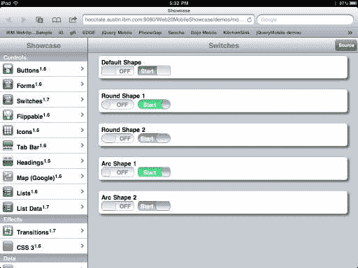
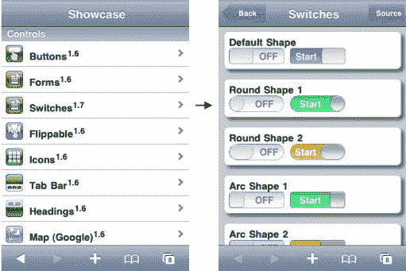
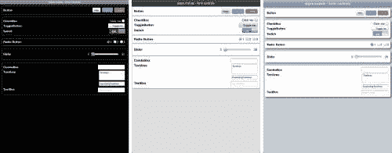
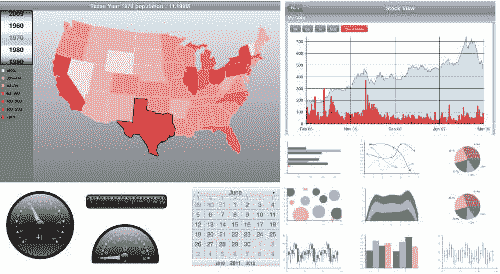

# 移动 Web 的用户界面设计

> 原文：[`developer.ibm.com/zh/articles/wa-interface/`](https://developer.ibm.com/zh/articles/wa-interface/)

## 简介

在创新者试图探索新的可能性的同时，新兴技术也在经历快速变化的时期。各个替代解决方案开始争夺注意力和市场占有率。移动用户界面（UI）技术目前处于这一革命性阶段的中期。手机和平板电脑不管是使用 Apple 的 iOS （iPhone、iPod Touch 和 iPad）、Google 的 Android 架构、Blackberry 的操作系统、HP 的 webOS 还是 Windows® Phone 7 移动操作系统，都提供各种不同的 UI 设计方法。

UI 多样化是有意设计的。平台必须有自己的独到之处才能占领市场。在 Android 平台上，运营商和设备供应商必须创造更多的多样性使其产品区别与竞争对手。 虽然产品多样性对竞争力的提高是很有必要的，但这也给为这些设备创建应用程序和网站的开发人员和设计人员带来了挑战。为了创建能在多种设备类型上良好运行的应用程序，开发团队需要：

*   精通各种开发技术
*   熟悉大量且频繁变化的设备的功能
*   了解不同 UI 风格惯例和标准
*   拥有多种编程以及跨平台移植经验
*   丰富的多设备和多平台测试经验

移动 Web 技术提供一种更具成本效益的方法来开发用于各种设备平台的应用程序。移动 UI 开发人员可使用最新开发的 JavaScript 库，例如 Dojo Mobile、jQuery Mobile 和 Sencha Touch，实现 “一次编写，随处运行”。开发人员无需学习各个平台的不同框架，或者重新开发应用程序，或者将应用程序移植到各个支持平台。用户也会受益于 Web 应用程序的零安装性质，他们可以一直使用最新的应用程序版本，无需在线应用程序商店安装升级。应用程序部署人员也会从中获益，不再担心需要为在同一应用程序不同版本上运行的用户提供支持。

然而，设计高质量的移动 Web 应用程序本身有一系列困难。首先从本质上来说，移动用户界面是一个全新的用户交互模型，拥有：

*   更小形状
*   触摸界面
*   加速传感器
*   导向意识
*   无处不在的动画
*   物理行为模拟

其次，由于 Web UI 要在所有设备上运行，不考虑其大小、规格以及功能，与设计传统桌面 Web 应用程序相比，设计人员必须考虑更多的变数。

本文将会探讨 *设计* 移动 Web UI 的考虑因素和最佳实践。虽然较少涉及实现细节，但本文偶尔会提及 HTML5 和 Dojo Toolkit 移动 UI 组件。出于必要性，这里将对本机移动应用程序设计进行一些讨论，但是重点还是跨平台设计。根据相对市场占有率，本文重点放在 iOS、Android 和 Blackberry 用户期望上。

## 显示尺寸

小巧使得设备可在任意地方 *使用* ，但是也与很多 *可用性* 方面背道而驰。小型的屏幕限制了那些以易于阅读方式显示的信息。在设计时，文本和图像可以快速消耗掉有限的屏幕空间，导致内容和用户交互之间的失衡。

智能手机比较小，平板电脑属于上网本到笔记本的范畴。许多供应商都同时提供这两种类型的设备，各种显示尺寸都有，如图 1 所示。移动 Web 应用程序设计必须能够处理各种屏幕大小的显示，在低端设备上不会出现挤压，在高端设备不会出现拉伸。

##### 图 1\. 移动设备显示屏相对尺寸

## 输入

许多流行的移动设备使用触摸和手势输入。虽然触摸输入更为直观，但是相对准确性较差。与传统安装应用程序或者 Web 应用程序的鼠标、指针输入相比，触摸的目标（如按钮）必须比较大，且间隔比较宽。

在手机上，由于受到屏幕尺寸的限制，加上交互目标较大，导致在各个面板上只有较少的控制。相对于鼠标指针图标，手指和手可能会掩盖一大半 UI 屏幕。

因为 Web 应用程序与生俱来就有跨平台功能，所以必须考虑到不同设备的输入特性。某些移动设备有物理键盘，而某些只有虚拟键盘，有的两者兼有。一些 Blackberry 设备使用触摸板来完成指向、选择和拖拽。Blackberry 和 Android 设备都有一些用于执行各种导航活动的专用物理按钮，只是排列顺序不同。

## 操作系统的多样性

因操作系统不同而导致的最重要的三个 UI 设计区别是：导航设计、控制实现和视觉风格。

### 导航

iOS 使用手势和小部件，使用户在各视图之间移动。边框的主屏幕按钮也用于关闭应用程序和退出文件夹。Android 使用手势、小部件和硬件按钮（主屏键、返回键、菜单键和搜索键），而 Blackberry 使用手势、小部件和硬件按钮（菜单键和退出键）。输入方法因设备型号和服务供应商的不同而不同，这就使情况变得更加复杂。这一问题在 Android 设备上更为严重，因为对于各个服务供应商和设备制造商，虚拟键盘的布局和边框按钮从左到右的顺序都各不相同。

### 控制实现

iOS 严重依赖软件的 UI 控制功能，例如，虚拟按钮。用户通过触摸与小部件交互，只有一个例外是退出应用程序或者文件夹。相较之下，Android 和 Blackberry 设备均提供物理按钮，用于导航回前一视图以及打开选项菜单。在 iOS 设备上，这些活动由按钮执行。

通常，iOS 应用程序将返回和上下文菜单活动分配给选项卡行按钮。按照惯例，在 iPhone 和 iPod Touch 上，选项卡按钮被置于视图的底部，这样用户就可以轻松地用拇指触摸。由于不同的原因，Android 设计风格习惯上将选项卡按钮放在靠近屏幕顶部的位置；如果放置在屏幕底部，会造成无意的物理按钮按压。

### 视觉风格

每个平台都会通过色彩主题、图标风格、标志、小部件绘制来定义自己的视觉风格。使用平台视觉主题不仅仅是为了美观。平台主题建立了用户期望，即应用程序中的用户交互要符合平台惯例。

## 性能

虽然 JavaScript 的性能在不断改进，但移动设备仍然面临性能挑战。与笔记本和台式计算机系统相比，它们使用的处理器没有那么强大，却要和较低的网络带宽抗争。

## 多设备使用

一般来说，大部分智能手机用户只用一个手机。另一方面，许多人在多种设备上使用同一应用程序。一个用户可能在 iPod Touch、Blackberry 手机、Android 平板电脑以及运行 Microsoft Windows 的笔记本上访问同一应用程序。 就用户而言，设备类型本质上就是同一内容空间的不同查看器。

多平台、多设备设计由于设备类型之间的差异而变得复杂。智能手机擅长在任意时间地点进行简短交互，完成集中目标。个人计算机擅长在相对固定的场所进行繁复的交互，处理复杂的信息，在各个任务间切换。平板电脑交互介于智能手机和笔记本之间。

多设备设计需要深思熟虑，在下面这些竞争性需求方面做出不可避免的妥协：

*   充分利用每种设备的功能
*   有效地解决各种设备的局限
*   在所有设备上提供相似的用户体验

为了提供良好的用户体验，智能手机上的 Web 应用程序往往需要支持与台式计算机相当的各种功能。在手机上显示时，您可能需要删除部分在台式计算机上可行的功能，或者添加一些在移动环境下可用的功能。很难断定复杂 Web 应用程序中的哪些功能在移动设备上显示不是很重要。

这没有诀窍可言。您必须在可能用到某个应用程序的设备环境下，仔细地了解和验证各个功能的使用情况，然后将功能与设备匹配。表 1 概述了移动和台式设备用户体验的不同。

##### 表 1\. 移动和台式用户体验区别

| 移动设备 | 台式设备 |
| --- | --- |
| 简洁集中的交互。 *发微博或短消息。* | 单一任务的持续交互。 *撰写备忘。* |
| 设备上有更多干扰中断。 *在智能手机上查收邮件时接到电话。* | 较少的干扰中断。 *在笔记本上查收邮件时使用手机接听电话。* |
| 频繁改变环境。 *空中旅行时（上飞机、下飞机等）使用手机。* | 很少改变环境。 *在台式计算机上使用电子数据表应用程序。* |
| 趋向于事务性交互。 *查看天气预报。* | 支持非事务性交互。 *撰写报告。* |
| 浏览多于交互。 *翻阅照片。* | 浏览和交互对半。 *编辑假日照片集。* |
| 页面加载更具破坏性。 *移动 Web 浏览体验。* | 页面加载破坏性较小。 *桌面 Web 浏览体验。* |
| 体验简单 *阅读电子书。* | 更能承受复杂性。 *使用文字处理程序。* |
| 相对较差的响应时间。 *地图升级。* | 良好的响应时间。 *高度身临其境的游戏。* |
| 更强的社交性。 *电话、短信、全球社交、共享应用程序的相对重要性。* | 较弱的社交性。 *办公效率应用的相对重要性。* |

首先，为多设备使用场景进行设计时，用户数据在用户访问应用程序的所有设备上共享是很重要的。在提供相同内容的定制“视图”时，需要考虑到应用程序的设备类型实例。

## 移动 Web UI 最佳实践

目前为止，我们已讨论了移动 Web 的使用挑战，包括多平台应用程序的几个考虑。本文其余内容将探讨设计移动 Web UI 的最佳实践。

## 使用一个工具包

从严谨的面向开发的角度来说，库、工具和框架可以减少工作量。使用标准 UI 组件库可以节省大量的开发和测试时间，这些时间可以用于低级的设计、编码、处理浏览器差异、测试、调试和维护。通过确保常用控件外观和行为与预期一样，高质量的 UI 组件库还可以改善使用的便利性。

Dojo Toolkit 1.5 版本介绍了基本的移动 UI 功能。1.6 版和 1.7 测试版包括本机应用程序上的代表性 UI 控制功能和交互。面向 Web 2.0 和移动设备的 WebSphere® Application Server Feature Pack 包含了 Dojo Toolkit 1.7，以及若干有用的应用程序服务和图示可视化功能。

## 响应设计

移动 Web 应用程序主要的设计挑战是：如何为一个显示在不同屏幕上（从几英寸的方块，大到平板电脑、笔记本，甚至使用更大显示器的设备）的应用程序创建积极的用户体验？ *响应 Web* 就是设计原则，以及一系列试图解决这一问题的技术。

响应 Web 设计的目标是使每个网站或者 Web 应用程序看起来好像是为其所在的设备和浏览器专门设计的。或许，”响应 Web”更应该被称为 “更具响应性的 web”，因为 Web 往往需要解决非最大化浏览器以及各种尺寸和分辨率的显示器上的内容显示问题。移动设备尺寸更小，更具多样性，因而这个问题更为突出。

响应 Web 实现依赖于使用 CSS、媒体查询以及 JavaScript 来根据设备调整内容显示。 媒体查询 是 CSS3 的子规范，使您能够将不同风格的页面与不同媒体或者显示特征结合起来。例如，根据设备屏幕的高度、宽度、宽高比以及分辨率来选择一个风格页面。

本文不详细讨论如何实现响应设计。在 响应 Web 设计：它是什么以及如何使用 和 关于响应设计的 List Apart 中会对若干技术进行描述。本文其余部分将提供几个常用设计方法的概述。

### 响应布局

复杂布局往往在较大的显示器上运行良好，但在智能手机上无法使用。相反，阅读和导航极为简单的内容布局看起来很无趣，当基板面充足时甚至是极度无聊的。许多手持设备可以不断变化方向。设计良好的响应内容自动调整其布局来适应设备的尺寸和方向。

当设备屏幕和分辨率太小而难以支持多列时，一个方法就是将多列布局重新格式化为单一列布局。如图 2 和图 3 所示。

iPad 应用程序有时会利用常见的“左边导航栏 – 右边内容栏”模式，如下所示。这在较大的屏幕上显示良好，但是不适用于较小的，手机大小的设备。

##### 图 2\. iPad 上固定的分屏

在这种情况下，移动 Web 应用程序可以设计为左边的导航列表单独显示在一个视图，而内容显示在第二个视图（图 3）。您可以使用 Dojo 工具移动小部件 FixedSplitter 和 FixedSplitterPane 来实现这一方法。

##### 图 3\. iPhone 上固定的分屏

选项卡行是响应设计的另一个关注点。如上所述，iOS 设备将选项卡行置于视图底部，而 Android 设备将其放在视图顶部。Safari 移动 Web 浏览器遵循 iOS 惯例，将浏览器导航控件放置在视图底部的选项卡行，如图 4 所示。Web 应用程序遵循选项卡在底部的惯例也会产生问题，因为浏览器和应用程序选项卡行会重叠。解决方案很简单。在移动 Web 应用程序的 HTML 头文件中放置 `meta` 标签 `<meta name="apple-mobile-web-app-capable" content="yes" />` ，这样，当用户将一个应用程序链接添加到主屏幕时，就会抑制浏览器工件，如图 4 的 b 部分所示。

##### 图 4\. 选项卡行在 iOS 和 Android 中的位置

为了避免类似问题，并且遵循合适的 Android 应用程序准则，Web 应用程序应该使用媒体查询，将选项卡行放置在 Android 设备顶部视图下方（图 4，b 和 d）。

### 响应小部件

因为设备所用的物理控件不同，软件按钮在 Android 和 Blackberry 设备上会与物理按钮重复，所以在这些设备上查看 Web 应用程序时，应将其隐藏。

小部件的尺寸是另一个要考虑的因素。因为显示因分辨率（每英寸的像素）不同而不同，所以移动 UI 设计准则往往以物理大小单位进行表示。建议最小触摸目标尺寸在 7 毫米到 10 毫米的正方形之间（这些尺寸就是从 iPad 2 的 36 – 52 像素正方形，到 iPhone 的 Retina 显示的 90 – 128 像素正方形）。目标之间的最小空间应为 1 – 2 毫米。

### 响应内容

有时，只是重新组织页面上的内容不足以应对显示尺寸的变化范围。您不应该期待将每个应用程序硬塞进 2×3 英寸大小的长方形中，它们还能保持可用性。使用模式在小型和大型设备上往往是不同的。小型设备最适用于简短的、专注的交互；大型设备适用于较长的、更为繁复的交互。例如，您手机上的天气预报应用程序可能只包含敏感地理位置的当前和未来的情况。同一应用程序的桌面 Web 版本可能提供更多内容，当前和其他地区的天气历史，天气事件的文章或者视频，等等。

通过有选择地只显示最重要的内容，或者使用链接将次要场景移动到另一页面，文本内容可以按比例缩小。

图像可以在大型和小型设备上响应式地缩放。有许多方法可以实现这一目标。最简单的方法就是允许图像自行缩放，但这样可能会影响性能。当大型图像缩小时，用户会很难看清重要的细节。一个替代方法就是在移动设备上提供极小的图像，通过触摸进行放大，在台式计算机浏览器上全尺寸显示。在其他情况下，创建多个图像也是可行的，这样可以只显示重要功能，并且有选择地显示接近目标设备分辨率的图像。

### 视觉的一致性

各个主要的设备平台都有自己的视觉信号，它们是由颜色面板、图标风格，以及印刷格式定义的。为某一设备设计的应用程序在其他供应商的设备上看起来格格不入。从视觉风格和交互上对应用程序进行调整，使其适应显示设备，这样会很大程度上满足用户在其设备上有一致性体验的期望。

`dojox.mobile.deviceTheme` （Dojo 1.7 测试版）模块支持的平台主题如图 5 所示。您可以使用这一模块自动检测设备类型，并为目标设备设置合适的主题。

##### 图 5\. Android、Blackberry 和 iOS 的 Dojox 移动主题

### 交互的一致性

响应设计涉及的不仅仅是处理显示差别。设计还必须根据目标设备是否使用物理按钮（例如，返回键、主屏键以及选项键）来对应功能，考虑如何隐藏和显示虚拟按钮使其更易于响应。设备浏览器会处理其他设备间的交互差异。

## 重复利用设计实现最佳用户体验

采用 UI 设计模式更便于使用，原因有两个。

*   从定义上，模式是常用设计问题经过证明的解决方案。部分模式是通过正式使用测试得到验证的，而其它则是通过设计的 “自然选择” 得到验证的。假以时日，不可用的设计将会被抛弃，而良好的设计则被效仿。
*   因为模式是常用的设计实践，所以它们为用户所熟悉。基于模式的 UI 往往无需用户学习。

在网络上有一些移动 UI 模式的网站； pttrns 和 Mary Sheibley 的 Mobile-Patterns 是最全面的。这两个网站都提供了常用设计风格的实例。虽然这些模式库没有提供设计准则，但它们可以作为设计灵感，帮助您设计利用其他应用程序用户体验的 UI。

## 让用户选择

除了可移动性之外，移动设备和传统的计算机设备还有两个差别，即点击的准确度和打字的便利性。对于这两种情况，传统的计算机界面都优于移动设备界面。触摸输入界面触觉反馈较差，精确度也较低。无论使用小型的物理键盘还是虚拟键盘，与全尺寸计算机键盘的性能相比，移动设备上的打字速度和精确度都比较差。当设备使用虚拟键盘时，打字将是一种破坏性操作 — 键盘的出现使大部分视图变得模糊。

建议：

*   如果可能，让用户进行选项选择，而不是要求他们输入文本。
*   为用户提供足够大的触摸交互目标（例如，10 毫米的正方形）。
*   当需要选项过大或者键盘输入不可避免，提供自动完成或者选择清单过滤，尽量减少打字输入。
*   运用 HTML5 丰富的输入类型功能，为输入（文本、数字、电话、日期、时间，或者 URL）提供优化的虚拟键盘，避免用户手动切换键盘来获取不常用的字。

## 与主页保持紧密联系

小巧的显示和粗大的手指就意味着导航元素和内容必须争夺移动设备屏幕上的空间。因此，内容和导航往往必须显示在不同视图。深次层的导航就显得很单调，而且浪费用户内存。

与移动设备设计的许多方面类似，导航应该尽可能简洁。如果可能，导航应保持二或三层，并保证有一个方便的方法返回到应用程序的“主”视图。在 iOS 设备上，这很可能意味着在部分视图上需要提供虚拟主屏按钮和返回按钮。通过 Android 设备访问时，这些按钮不必显示，因为 Android 提供了物理的返回按钮和主屏按钮。

## 向用户说明如何使用

移动设备解决小型屏幕尺寸的一个方法就是支持手势交互。例如，无需拖动滚动条控件功能，用户可以用手指在页面上滑动，实现纵向或者横向滚动。滚动条控件可以减小到最小尺寸，或者做成临时可视的位置指示器，因为可视控件图形（例如上/下按钮和滚动条”拇指”功能）已经不再需要了。在同一视图中可以有不同操作的多个手势可用，而不需要有任何可视的控件功能占据空间（例如，用手指收缩来开/关缩放，向右/左滑动来翻页，向上/下滑动来滚动，以及用点按来关闭）。

手势节省屏幕空间的同时，也是需要代价的。仅仅提供手势控件，那么用户可能不知道什么活动是可用的。补救方法就是通过视觉线索提供暗示，称之为 *情景支持* ，来引导用户如何与视图交互。这些可视情景支持的确耗费了一些空间，但是它们的使用频率远低于作为触摸目标的控件。

可视情景支持的一个简单的例子就是在清单项中的 “>”，它表示视图跟随点触变化。其他许多情景支持都是基于物理对象的实际环境的。例如，Apple 的 iBook 使用一个物理的书籍象征来表示翻页手势。Spinner 小部件用自己的图形提供可视的情景支持。在这种情况下，拇指和滚轴控件的视觉隐喻表明上和下来拖拽以改变数值。

## 多用图形

移动 UI 通常多采用图形。图形设计引人注目的应用程序往往比纯文本的应用程序更受青睐。这不仅仅是因为美感，而且设计精良，图形丰富的 UI 往往还提供许多实践获益。良好图形设计能轻松地和用户交流，并引起用户的兴趣。正如之前所述，丰富的可视控件情景支持可以更高效地“告诉”用户如何与设备交互。比起数据的文字或者表格描述，这些信息更容易获取据统计，统计可视化往往能够提供更多更容易获取的信息。

如图 6 所示，Dojo 工具 1.7 版本提供许多丰富的图形和可视化小部件，它们已经被优化用于移动 Web 应用程序。

##### 图 6\. Dojo 图形和可视化小部件

## 避免移动 Web UI 设计陷阱

在设计您的移动 Web UI 时，请避免以下常见的陷阱。

*   **不加改动**: 移动 Web 浏览器会显示许多未经修改的 Web 应用程序。无论哪个尝试过在智能手机上使用未修改的 Web 应用程序的人，都知道这只能让人非常失望或者恼火。复杂的 Web 应用程序不适用于手机，因为手机屏幕小、触摸交互不准确，且网络带宽不够。
*   **忽略性能**: 较差的性能几乎不被用户所容许，特别是有替代应用程序时。

保持本机移动应用程序尽可能简单对 Web 应用程序来说特别有用。较大图像、页面加载以及其他服务器获取都会影响性能，并会让用户注意到响应间隔。

*   **依赖于帮助**: 如之前所述，在目标清晰的简短交互中倾向于使用移动应用程序。这类使用意味着用户不愿学习如何与设备交互。

应用程序的使用应该非常直观不需要帮助。这对所有 UI 来说都是必须的，但是与帮助内容的交互在用户看来就是他们与目标之间的额外任务。当移动 Web 应用程序足够直观时，就不再需要帮助 UI 和帮助内容了，这样就减少了下载到设备的代码和内容。

*   **误用创造性**: 在移动应用程序设计上，引入新的交互技术、独特的图标，以及可视的处理时需要特别注意。用户会理解那些在外观和行为上与他们使用过的其他应用程序类似的应用程序。非必需的创新交互和样式会增加用户需要帮助的可能性。
*   **忽略浏览器的交互**: 从定义上来看，移动 Web 应用程序在移动 Web 浏览器上运行。与桌面 Web 一样，浏览器会在 Web 应用程序中显示额外用户界面层。和桌面 Web 程序类似，当用户对应用程序内以及浏览器中的导航控件同时具有访问权限时，就会出现导航问题。如果可能，在 koisk 模式下运行您的应用程序，并在应用程序内提供所有需要的导航。

## 结束语

通过开发和部署移动 Web 技术，有关为多设备平台开发本机应用程序的许多问题都是可以避免的。然而，解决移动设备和移动 Web 应用程序所特有的设计问题能够保证使用的方便性。

设计移动 Web 应用程序时，如果考虑到平板电脑，必须对小设备规格和各种设备尺寸给予更多关注。由于移动平台设备的供应商和运营商所造成的 UI 差异，设计必须适应各个平台的特性。Dojo 1.7 中可用的标准化控件和本机设备主题，使得移动 Web 应用程序的设计和开发更为简单。

本文翻译自：[User interface design for the mobile web](https://developer.ibm.com/articles/wa-interface/)（2011-07-26）