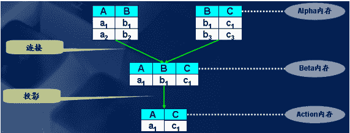
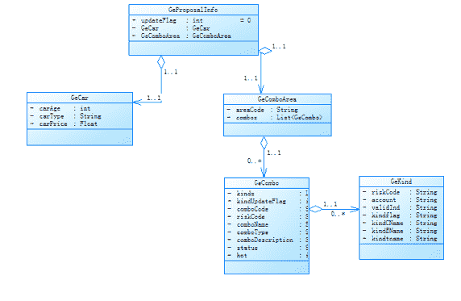
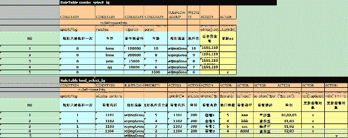
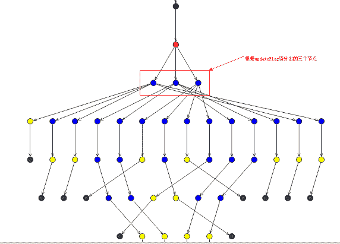

# 开源规则流引擎实践

> 原文：[`developer.ibm.com/zh/articles/os-drools/`](https://developer.ibm.com/zh/articles/os-drools/)

## 前言

在很多企业的 IT 业务系统中，经常会有大量的业务规则配置，而且随着企业管理者的决策变化，这些业务规则也会随之发生更改。为了适应这样的需求，我们的 IT 业务系统应该能快速且低成本的更新。适应这样的需求，一般的作法是将业务规则的配置单独拿出来，使之与业务系统保持低耦合。目前，实现这样的功能的程序，已经被开发成为规则引擎。

规则引擎是一种推理引擎，它是根据已有的事实，从规则知识库中匹配规则，并处理存在冲突的规则，执行最后筛选通过的规则。因此，规则引擎是人工智能（AI）研究领域的一部分，具有一定的选择判断性、人工智能性和富含知识性。目前，比较流行的规则引擎有商业规则引擎 iLog 和开源规则引擎 drools。本文将对开源规则引擎 drools 做详细介绍，并通过分析一个在汽车保险行业中的实际应用案例，让读者对开源规则流引擎有一个更深刻的理解。

## 基于 rete 算法的规则引擎

在 AI 领域，产生式系统是一个很重要的理论，产生式推理分为正向推理和逆向推理产生式，其规则的一般形式是：IF 条件 THEN 操作。rete 算法是实现产生式系统中正向推理的高效模式匹配算法，通过形成一个 rete 网络进行模式匹配，利用基于规则的系统的时间冗余性和结构相似性特征 [8]，提高系统模式匹配效率。本文将介绍的 Drools 引擎就是利用 rete 算法对规则进行分析，形成 rete 网络，对模式进行匹配。

### 算法研究

#### rete 算法概述

Rete 算法最初是由卡内基梅隆大学的 Charles L.Forgy 博士在 1974 年发表的论文中所阐述的算法 , 该算法提供了专家系统的一个高效实现。自 Rete 算法提出以后 , 它就被用到一些大型的规则系统中 , 像 ILog、Jess、JBoss Rules 等都是基于 RETE 算法的规则引擎^([7])。

Rete 在拉丁语中译为 “net”，即网络。Rete 匹配算法是一种进行大量模式集合和大量对象集合间比较的高效方法，通过网络筛选的方法找出所有匹配各个模式的对象和规则。

其核心思想是将分离的匹配项根据内容动态构造匹配树，以达到显著降低计算量的效果。Rete 算法可以被分为两个部分：规则编译和规则执行^([7])。当 Rete 算法进行事实的断言时，包含三个阶段：匹配、选择和执行，称做 match-select-act cycle。

#### rete 算法相关概念

Rete 算法规则相关的概念有如下几个：

Fact：已经存在的事实，它是指对象之间及对象属性之间的多元关系，为简单起见，事实用一个三元组来表示：（标识符 ^ 属性 值）^([1])，例如如下事实：

```
w1:(B1 ^ on B2) w6:(B2 ^color blue)
w2:(B1 ^ on B3) w7:(B3 ^left-of B4)
w3:(B1 ^ color red) w8:(B3 ^on table)
w4:(B2 ^on table) w9:(B3 ^color red)
w5:(B2 ^left-of B3) 
```

Rule：规则，包含条件和行为两部分，条件部分又叫左手元（LHS），行为部分又叫右手元（RHS）。条件部分可以有多条条件，并且可以用 and 或 or 连接 [1]。其一般形式如下：

```
(name-of-this-production
 LHS /*one or more conditions*/
 -->
 RHS /*one or more actions*/
 )
例如，下面的例子：
 (find-stack-of-two-blocks-to-the-left-of-a-red-block
 (^on)
 (^left-of)
 (^color red)
 -->
 ...RHS...
 )
 Patten：模式，也就是规则的条件部分，是已知事实的泛化形式，是未实例化的多元关系 [1]。比如，前面的那条规则的条件部分：
 (^on)
 (^left-of)
 (^color red)
 Rete 网络的概念 [1][9][10]如下： 
```

RootNode：Rete 网络的根节点，所有对象通过 Root 节点进入网络。

ObjectTypeNode：对象类型节点，保证所传入的对象只会进入自己类型所在的网络，提高了工作效率。

AlphaNode：Alpha 节点是规则的条件部分的一个模式，一个对象只有和本节点匹配成功后，才能继续向下传播。

JoinNode：用作连接（jion）操作的节点，相当于 and，相当于数据库的表连接操作，属于 betaNode 类型的节点。BetaNode 节点用于比较两个对象和它们的字段。两个对象可能是相同或不同的类型。我们将这两个输入称为左和右。BetaNode 的左输入通常是一组对象的数组。BetaNode 具有记忆功能。左边的输入被称为 Beta Memory，会记住所有到达过的语义。右边的输入成为 Alpha Memory，会记住所有到达过的对象。

NotNode：根据右边输入对左边输入的对象数组进行过滤，两个 NotNode 可以完成 “exists” 检查。

LeftInputAdapterNodes：将单个对象转化成对象数组。

Terminal Nodes 被用来表明一条规则已经匹配了它的所有条件（conditions）。

图 1 展示的是一个简单的 rete 网络：

##### 图 1\. RETE 网络


#### 创建 rete 网络

Rete 算法的编译结果是创建了规则集对应的 Rete 网络 , 它是一个事实可以在其中流动的图。创建 rete 网络的过程^([1])如下： 1) 创建根节点； 2) 加入一条规则 1 (Alpha 节点从 1 开始，Beta 节点从 2 开始 )； a. 取出规则中的一个模式 1，检查模式中的参数类型，如果是新类型，则加入一个类型节点； b. 检查模式 1 对应的 Alpha 节点是否已存在，如果存在则记录下节点位置，如果没有则将模式 1 作为一个 Alpha 节点加入到网络中，同时根据 Alpha 节点的模式建立 Alpha 内存表； c. 重复 b 直到所有的模式处理完毕； d. 组合 Beta 节点，按照如下方式： Beta(2) 左输入节点为 Alpha(1)，右输入节点为 Alpha(2) Beta(i) 左输入节点为 Beta(i-1)，右输入节点为 Alpha(i) i>2 并将两个父节点的内存表内联成为自己的内存表； e. 重复 d 直到所有的 Beta 节点处理完毕； f. 将动作（Then 部分）封装成叶节点（Action 节点）作为 Beta(n) 的输出节点； 3) 重复 2) 直到所有规则处理完毕； 执行完上述步骤，建立的 rete 网络如下图 2 (a 图为含有 3 个规则的 rete 网络，b 图为含有一个规则的 rete 网络 )：

##### 图 2\. beta-network and alpha-network


上图（a 图和 b 图），他们的左边的部分都是 beta-network, 右边都是 alpha-network, 圆圈是 join-node。右边的 alpha-network 是根据事实库和规则条件构建的，其中除 alpha-network 节点的节点都是根据每一条规则条件的模式 , 从事实库中 match 过来的，即在编译构建网络的过程中静态建立的。只要事实库是稳定的，RETE 算法的执行效率应该是非常高的，其原因就是已经通过静态的编译，构建了 alpha-network。左边的 beta-network 表现出了 rules 的内容，其中 p1,p2,p3 共享了许多 BetaMemory 和 join-node, 这样能加快匹配速度。

#### Rete 算法的匹配过程

匹配过程如下： 1) 对于每个事实，通过 select 操作进行过滤，使事实沿着 rete 网达到合适的 alpha 节点。2) 对于收到的每一个事实的 alpha 节点，用 Project( 投影操作 ) 将那些适当的变量绑定分离出来。使各个新的变量绑定集沿 rete 网到达适当的 bete 节点。3) 对于收到新的变量绑定的 beta 节点，使用 Project 操作产生新的绑定集，使这些新的变量绑定沿 rete 网络至下一个 beta 节点以至最后的 Project。4) 对于每条规则，用 project 操作将结论实例化所需的绑定分离出来。

如果把 rete 算法类比到关系型数据库操作，则事实集合就是一个关系，每条规则就是一个查询，再将每个事实绑定到每个模式上的操作看作一个 Select 操作，记一条规则为 P，规则中的模式为 c1,c2,…,ci, Select 操作的结果记为 r(ci), 则规则 P 的匹配即为 r(c1)◇r(c2)◇…◇(rci)。其中◇表示关系的连接（Join）操作。

Rete 网络的连接（Join）和投影 (Project) 和对数据库的操作形象对比如图 3 所示：

##### 图 3\. join and project



#### Rete 算法的特点、不足和建议 Rete 算法有如下特点

a． Rete 算法是一种启发式算法，不同规则之间往往含有相同的模式，因此在 beta-network 中可以共享 BetaMemory 和 betanode。如果某个 betanode 被 N 条规则共享，则算法在此节点上效率会提高 N 倍。

b. Rete 算法由于采用 AlphaMemory 和 BetaMemory 来存储事实，当事实集合变化不大时，保存在 alpha 和 beta 节点中的状态不需要太多变化，避免了大量的重复计算，提高了匹配效率。

c. 从 Rete 网络可以看出，Rete 匹配速度与规则数目无关，这是因为事实只有满足本节点才会继续向下沿网络传递。

Rete 算法的不足：

a. 事实的删除与事实的添加顺序相同, 除了要执行与事实添加相同的计算外, 还需要执行查找, 开销很高 [3]。

b. RETE 算法使用了β存储区存储已计算的中间结果, 以牺牲空间换取时间, 从而加快系统的速度。然而β存储区根据规则的条件与事实的数目而成指数级增长, 所以当规则与事实很多时, 会耗尽系统资源 [3]。

针对 Rete 算法的特点和不足，在应用或者开发基于 Rete 算法的规则引擎时，提出如下建议：

a. 容易变化的规则尽量置后匹配，可以减少规则的变化带来规则库的变化。

b. 约束性较为通用或较强的模式尽量置前匹配，可以避免不必要的匹配。

c. 针对 Rete 算法内存开销大和事实增加删除影响效率的问题，技术上应该在 alpha 内存和 beata 内存中，只存储指向内存的指针，并对指针建里索引（可用 hash 表或者非平衡二叉树）。

d. Rete 算法 JoinNode 可以扩展为 AndJoinNode 和 OrJoinNode，两种节点可以再进行组合 [5]。

### 基于 Rete 算法的 drools 开源规则引擎

#### Drools 规则引擎简介

Drools 具有一个易于访问企业策略、易于调整以及易于管理的开源业务[规则引擎](http://baike.baidu.com/view/1636209.htm) ，符合业内标准，速度快、效率高。业务分析师或审核人员可以利用它轻松查看业务规则，从而检验已编码的规则是否执行了所需的业务规则。其前身是 Codehaus 的一个开源项目叫 Drools，最近被纳入 JBoss 门下，更名为 JBoss Rules，成为了 JBoss 应用服务器的规则引擎。

Drools 被分为两个主要的部分：编译和运行时。编译是将规则描述文件按 ANTLR 3 语法进行解析，对语法进行正确性的检查，然后产生一种中间结构 “descr”，descr 用 AST 来描述规则。目前，Drools 支持四种规则描述文件，分别是：drl 文件、 xls 文件、brl 文件和 dsl 文件，其中，常用的描述文件是 drl 文件和 xls 文件，而 xls 文件更易于维护，更直观，更为被业务人员所理解。运行时是将 `AST` 传到 `PackageBuilder` ，由 `PackagBuilder` 来产生 `RuleBase，` 它包含了一个或多个 Package 对象。

Drools 的语法规则将在实践中介绍，下面分析 drools 的原理。

#### Drools 规则引擎原理

Drools 中的 Rete 算法被称为 ReteOO，表示 Drools 为面向对象系统（Object Oriented systems）增强并优化了 Rete 算法。

在 Drools 中，规则被存 放在 Production Memory（规则库）中，推理机要匹配的 facts（事实）被存在 Working Memory（工作内存）中。当时事实被插入到工作内存中后，规则引擎会把事实和规则库里的模式进行匹配，对于匹配成功的规则再由 Agenda 负责具体执行推理算法中被激发规则的结论部分，同时 Agenda 通过冲突决策策略管理这些冲突规则的执行顺序，Drools 中规则冲突决策策略有：(1) 优先级策略 (2) 复杂度优先策略 (3) 简单性优先策略 (4) 广度策略 (5) 深度策略 (6) 装载序号策略 (7) 随机策略^([5][6])。

##### 图 4\. Drools 的原理示意图


## 应用实践

### 需求描述

在汽车保险行业中，每个地区都会有自己的车险投保规则，而且这些投保规则会经常变动，为适应这样的业务需求，可以采用 drools 开源规则引擎。 在本文介绍的例子中，具体业务需求是：应用应该能够根据前台传入的车辆信息和地区信息，从车辆和套餐的关系配置中匹配这辆车可用的套餐；然后，根据从套餐配置中获取套餐信息，套餐信息中包含了该套餐可用的险别（如车损险、乘客责任和盗抢险诸如之类的称之为险别）；最后从险别配置中获取险别信息。

### 需求分析

由于每个地区的规则不一样，所以要对规则进行分组，每个地区的车辆和套餐的关系配置和套餐配置要分别在不同的文件中，而险别是不变信息，各个地区用同一个险别配置。车辆和套餐的关系配置放在一个 RuelTable 中，套餐配置放在另一个 RuelTable 中，这两个 RuelTable 在用一个 xls 文件中描述即可。

这样配置后，每次引擎先根据地区代码执行相应的规则文件；进入规则文件后，再根据车辆信息过滤套餐找出适合这辆车的套餐，然后更新传入的对象，这时会重新匹配规则（已经匹配过的不应该再匹配，后面代码中会介绍）；然后再匹配套餐，匹配后，更新对象；最后进入险别对应的文件匹配险别。

### 代码实践

首先，建立 Drools BRMS 应用。Drools BRMS 是一个管理和编译规则和规则流的 Web 应用程序，可以部署在大部分的支持 J2SE 1.5 的 Web 容器下，如 Tomcat6。Drools BRMS 架构体系分为三大部分，第一部分是 UI 层，提供了一个基于 Ajax 技术的业务规则编辑、管理工具。第二部分是规则文件仓库层，将规则文件统一保持在文件系统或关系数据库。最后一个是 Drools 的核心引擎，用来对用户提交的规则文件进行验证、编译和部署。开发人员通过规则文件的编辑部署，生成了包含 rule 的 package 对象，这是引擎可直接操作的内存对象。BRMS 通过一个 URL 提供对这个对象的 HTTP 访问。第三方可以通过 Agent 相关 API 来访问这个 URL，程序自动下载这个 Package 对象就直接可以在规则引擎运行，得到规则执行的结果。

然后，将 BOM(Business Object Model 业务规则引擎所要操作的对象 )、规则流文件（图 2-2 所对应的文件）和规则文件（图 2-3 和图 2-4 所对应的文件）上传到 BRMS 中。下面对各个文件进行介绍。

图 5 描述的是 BOM 对象，分别是 GeProposalInfo、GeCar、GeComboArea、GeCombo 和 GeKind，他们的关系从图中可以很明显的看出，这里不再赘述。

##### 图 5\. BOM 类



图 6 中，开始节点是表示流程的开始。在 diverge 分枝节点处按 GeComboArea 里的 AreaCode 属性值有四个分枝，这四个分枝按优先级只要有一个满足条件就继续向下执行。diverge 分枝节点有 And、Xor 和 Or 三种类型，其含义分别是执行所有分枝、执行按优先级首先符合条件的分枝、执行所有符合条件的分枝。RuleTask 规则任务节点对应的是这个 RuleGroup 规则组里的规则。执行完地区层次的规则后，进入 converge 聚合节点，此节点等待分枝节点中任何一个节点执行完毕后执行。converge 分枝节点有 And、Xor、n-of-m 和 Discriminator 四种类型，其含义分别是等待所有分枝执行完毕、按优先级只等待一个分枝执行完、等待一个分枝执行完，但每个分枝执行完后会导致继续等待下一个分枝执行和等待在 m 个分枝中有 n 个分枝执行完毕。规则任务节点 Rule_Kind 是执行 Rule_Kind 规则组里的规则。结束节点标志着规则流执行完毕。

##### 图 6\. 规则流


图 7 和图 8 分别是 beijing.xls 和 kind.xls 的截图。在决策表中，不同作用的表格用不同颜色区分。在黑色区中，有一个 RuleTable 关键词，它表示本决策表从这开始，解析的时候也就是从这按从上到下和从左到右的顺序开始解析，其后是表名称。CONDITION 是表明此列为条件的关键词。和并列中 pi:GeProposalInfo 的意思是从 workmemory 中选取类型为 GeProposalInfo 的一个对象赋值给 pi。car.carType matches “.*$param.* ”的含义是查看 pi 中对象 car 中的 carType 属性值是否包含此列单元格中的值。“.*$param.* ”为正则表达式，$param 为对单元格中值的引用。Matches 是一个操作。RULEFLOW-GROUP 是对规则分组的关键字，它和规则任务节点对应。PRIORITY 设置规则执行优先级，数值越大越先被执行。ACTION 是规则的行为部分，可以在单元格中写 java 代码。另外，单元格中有内容表示执行匹配或执行 java 代码，没有内容表示什么都不做，跳过。

##### 图 7\. 规则表定义一



##### 图 8\. 规则表定义二


图 9 是 beijing.xls 和 kind.xls 里的规则生成的 rete 网络。在编写规则中，我们采用了本文的建议 a（将容易变化的规则尽量放后）和 b（将强约束条件放前），这样产生的 rete 网络匹配效率会更高。如图 2-5 中，在红色节点（类型节点）下会有对 updateFlag 的三个分枝，updateFlag 是强约束条件且不会变化太大，仅在此节点上，匹配效率就提高了三分之一。

##### 图 9\. 生成的 Rete 网络



最后，我们对我们的应用程序端的调用做一下阐述。

**第一步：创建规则库**

```
KnowledgeBase kbase = readKnowledgeBase();
 readKnowledgeBase 方法必须是单例方法，其内容如下：
 创建 kbuilder 对象（用来编译规则的对象）
 KnowledgeBuilder kbuilder = KnowledgeBuilderFactory.newKnowledgeBuilder();
    Brms 应用程序上规则包（也就是规则库）所在 url 地址 String urlString = "http://localhost:8080/drools-5.1.1guvnor/org.drools.guvnor.Guvnor/package/combo";
        URL url = new URL(urlString);
        UrlResource urlResource = (UrlResource)ResourceFactory.newUrlResource(url);
 只要设置采用基本授权就可登录 Brms
        urlResource.setBasicAuthentication("enabled");
 将已经编译好的规则包加入 kbuilder 对象，此处加入的是 pkg 类型
        kbuilder.add(urlResource, ResourceType.PKG);
 创建 KnowledgeAgent（ruleaget 类是不稳定或实验中的代理类）代理，它负责维护与 brms 里的规则保持版本一致性
        KnowledgeAgent kagent = KnowledgeAgentFactory.newKnowledgeAgent("combo");
        KnowledgeBase kbase = kagent.getKnowledgeBase();
 将规则包加入规则库
        kbase.addKnowledgePackages(kbuilder.getKnowledgePackages());
        return kbase; 
```

**第二步：创建 workmemory 并插入对象**

```
创建 workmemory 对象 ksession
 StatefulKnowledgeSession ksession = kbase.newStatefulKnowledgeSession();
 设置初始值
        GeComboArea ca = new GeComboArea();
        ca.setAreaCode("010");
        GeCar c=new GeCar();
        c.setCarAge(9);
        c.setCarPrice(15000);
        c.setCarType("华晨 bmw11 年款");
        GeProposalInfo pi=new GeProposalInfo();
        pi.setCar(c);
        pi.setComboArea(ca);
 将 pi 插入 workmemory 中，此时会构建 rete 网络
        ksession.insert(pi); 
```

**第三步：执行规则流和规则**

```
激活规则流
 ksession.startProcess("com.sample.ruleflow");
 激活规则
        ksession.fireAllRules(); 
```

**第四步：释放资源**

```
ksession.dispose(); 
```

## 结束语

本文通过深入剖析 rete 算法和基于 rete 算法的规则引擎，发现了算法中存在的问题，提出了算法改进的意见，同时也阐述了在应用规则引擎时应该注意的问题，并通过实例对规则引擎进行了实践。