# IBM SPSS Statistics 与用户自定义 Python 模块的集成及分析

> 原文：[`developer.ibm.com/zh/articles/1405-ba-spss-statistics-integration/`](https://developer.ibm.com/zh/articles/1405-ba-spss-statistics-integration/)

## 背景介绍

近年来，商业分析（Business Analytics，BA）软件逐渐成为企业增强洞察力的利器。其中，IBM SPSS Statistics 是统计分析领域中久享盛名的应用软件。企业在实际运营中，已根据不同的业务需求，开发或购买了满足自身需求的商业数据整合方案，并期待与 Statistics 进行集成，以便更高效、准确的分析数据，提取数据中隐含的信息。

Statistics 不仅为用户提供了丰富的统计算法来帮助用户分析数据，而且也提供了非常灵活的编程接口，供外部用户将自定义的功能模块与 Statistics 集成。用户可以通过自定义模块对 Statistics 进行功能扩展。借助 Statistics，用户自定义模块可以获得更加完整、有意义的输入数据。

Statistics 16.0（及以上）为用户提供了的可编程插件（Programmability plug-ins）包括 Python plug-in、R plug-in 和 Microsoft .NET plug-in。其中，Python 语法简洁而清晰、具有丰富强大的类库，并且其能够很轻松的与其他语言实现的模块集成在一起。所以，本文将使用 Python 功能模块作为演示。

### Customer Dialog 简介

Statistics 在编程插件的基础上提供了 Extension Command 机制使用户能够以 Statistics 内部语法命令（syntax command） 的形式来包装使用编程插件开发出来的功能模块。Customer Dialog 为 Extension Command 提供了相应的用户界面。

Customer Dialog 允许用户创建符合 Statistics 界面风格的对话窗口，以及创建自定义的 Statistics 内置统计程序。对话窗口作为该统计程序的用户界面，可接受并传递基于用户输入的参数，并调用相应的内置统计程序。通过 Customer Dialog Builder，用户可以

1.  创建自定义的对话过程，调用内置统计程序。
2.  为一组扩展命令集创建用户界面。扩展命令是指，用户自定义的、由 Python 或 R 实现的 SPSS Statistics 命令。
3.  保存创建完成的 Customer Dialog，并将其安装至 Statistics 中。

### Statistics Syntax 和 Python plug-in 简介

SPSS Statistics 具备强大的数据处理和分析功能，除了提供友好、灵活的 UI 操作界面外，Statistics 为其所有的功能设计了相应的命令，即 Statistics 的语法 Syntax。除此之外，Syntax 具有高级编程的功能，可以完成比 UI 所提供的功能更为复杂的数据分析工作。SPSS Statistics 内核是基于命令驱动的，Syntax 是其灵魂。用户在 UI 界面的所有操作，均会被转换成 Syntax 命令传递至内核执行。详见下图。

##### 图 1\. Statistics 执行过程

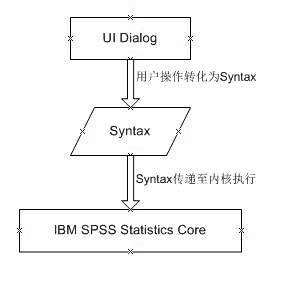

Python plug-in 和 Statistics 产品的交互方式很灵活。用户既可以在自定义的 Python 代码中引入 SPSS 模块，运用 Statistics 完成数据的读取、处理、分析、输出任务，也可以在 Syntax 中直接加入 Python 代码块（BEGIN PROGRAM PYTHON-END PROGRAM）来控制 Syntax 工作流。本文采用了后一种方式。如：

##### 图 2\. Python Plug-in 程序段 1


使用 Python Plug-in 的好处是，可以动态的创建 string 字符串以及 Syntax 命令。

## 集成方法论述

由上节讨论可知，我们可以利用 Statistics 中的 Python Plug-in 对自定义 Python 模块进行集成，包括：利用 Customer Dialog 设计满足用户习惯的 UI 交互界面；编写内置统计程序；与 Statistics 进行集成。

本文设计的 Python 功能模块实现了一种客户分群方法。其依据大量的客户属性数据和消费数据，将客户分组，属于同一组的客户具有极大的相似性，可以采用相同的商业策略；不同组的客户具有极大的差异性，保证组与组之间的差别最大化，以便采取不同的商业策略，获得最大的商业利润。

### UI 界面设计及参数传递

本节将讨论 UI 界面的布局以及 UI 参数传递。在设计 UI 界面前，我们首先应该明确，Python 功能模块所需的输入参数，这些参数将出现在 UI 界面上。同时，若模块功能较为复杂，可以添加子对话过程实现特定的功能。该功能模块的输入包括：数据文件、控制文件以及最大分组数。输出为客户分群结果文件，包括用户的基本信息以及所属的群组号。子对话的功能为客户分群结果上传至数据库。

运行 Utilities -> Customer Dialog Builder，出现 Customer Dialog 编辑界面。通过拖拽控件的方式，用户可以快捷地对界面进行编辑，并且指定相应控件的属性。

##### 图 3\. Customer Dialog 1- 主对话框界面

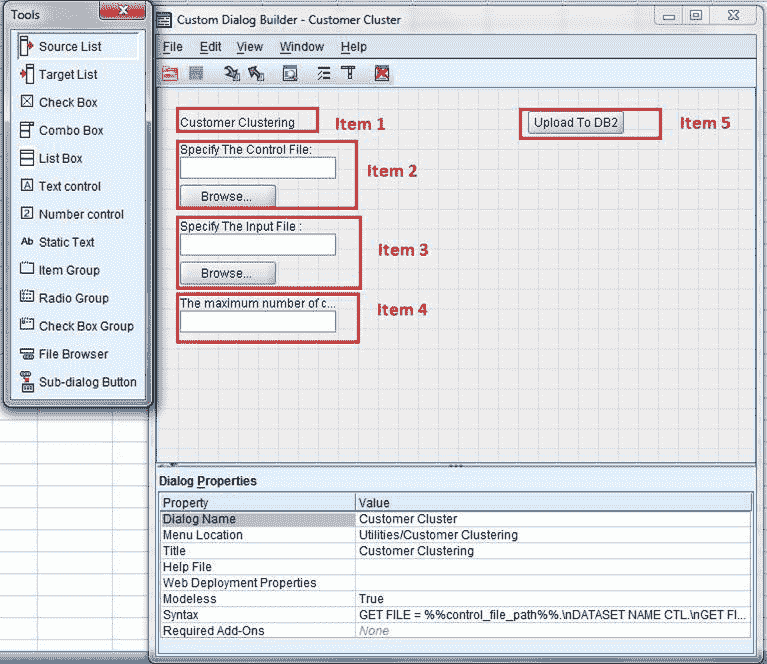

图中，该 dialog 有 5 个控件。Item 1 为该对话窗口的标题，将显示在该窗口的标题栏中；Item 2、Item 3 以及 Item 4 用于用户输入 Python 功能模块参数 , 分别为控制文件路径，数据文件路径以及最大分组数；Item 5 为该对话窗口的子对话窗口，用于实现特定子功能。本文中设计的子功能是将 Python 模块的执行结果上传至数据库中。Item 5 的 UI 界面如下图。

##### 图 4\. Customer Dialog 2 – 子对话框界面

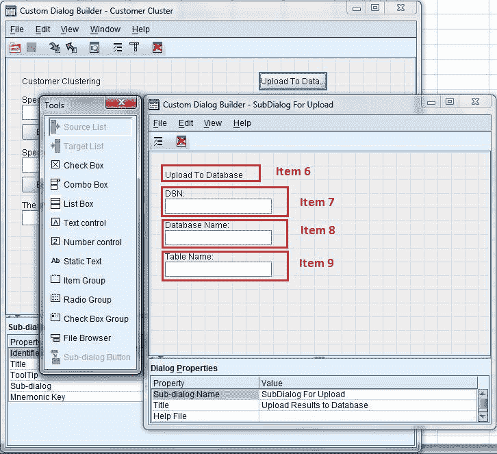

图 4 中 Item 6 为子对话框的标题，Item 7、Item8 以及 Item9 用于输入上传数据库所需参数，分别为 DSN 名称、数据库名称，以及待建的数据表名。

以 Item 2 为例，我们演示如何传递参数。下图为 Item 2 的属性。

##### 图 5\. Customer Dialog 3 – 控件属性

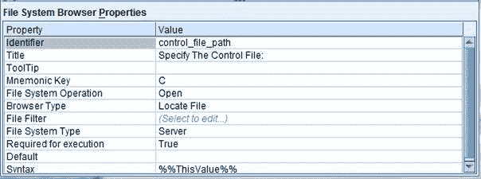

其中，属性 “Identifier” 用于传递参数，如图中的 “control_file_path”。它记录用户的输入值，在 Python 程序中，以 “%%” 标记对读出该输入值，传递给 Syntax 和 Python 程序。传递过程如下图所示。

##### 图 6\. Python Plug-in 程序段 2 – Python Plug-in 参数传递


编辑好 UI 界面后，将其保存为 customer dialog package file(.spd) 文件，本文中为 CustomerClustering.spd。使用 “Preview” 功能，对界面进行预览。

##### 图 7\. Customer Dialog 4 – Preview 1


图 7 红框部分是子对话窗口按钮，用户点击该按钮将出现子对话框，如下图所示。

##### 图 8\. Customer Dialog 5 – Preview 2

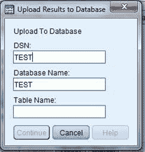

在设计子对话窗口控件属性时，我们为 “DSN” 以及 “Database Name” 设置了默认值 “TEST”。

### 集成 Python 功能模块

本文涉及到的自定义 Python 模块主要实现两类功能。一类是客户分群，是用嵌入了 Python 程序的 Syntax 实现 (CustomerClustering.sps) ；另一类是分群结果上传至数据库，是用 Python 脚本实现 (UploadtoDatabase.py)。我们利用 Customer Dialog 里的 Syntax Template 将 UI 参数与 Python 程序进行关联。

1.  **集成客户分群功能**

在集成该功能时，本文选择了 Statistics 提供的 “INSERT” 命令。我们通过用户从 UI 界面的输入 control_file_path、input_file_path 获得待操作的数据集，通过 max_clusters_ui 获取到命令文件运行所需参数，并将该参数赋值给变量 max_clusters。max_clusters 为命令文件中定义的全局变量 , 以实现参数传递。最后，我们利用 spss.Submit( ) 函数执行该命令。至此，内置统计程序在运行时，可以调用指定的命令文件，并将运行时参数传递给该命令文件。具体实现如下图所示。

##### 图 9\. 集成客户分群功能

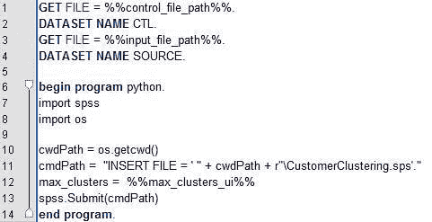

1.  **集成数据库上传功能**

出于安全性考虑，我们将 UploadtoDatabase.py 文件编辑为二进制的 UploadtoDatabase.pyc 文件以避免暴露源代码，所以图中 “import UploadtoDatabase” 所引入的实际为 .pyc 文件。这里，在引入 .pyc 文件时，需要指定所引入文件的路径，即 “sys.path.append(‘C:\Integration\PythonScript\’)” 所示。dsn，db_name 和 db_tablename 为用户通过 UI 界面传递的数据库信息。调用方法如下。

##### 图 10\. 集成数据库上传功能

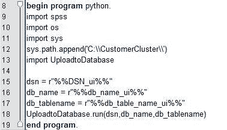

图中 UploadtoDatabase 中 run 函数的声明和实现方式如下：

##### 图 11\. Python Script 主函数定义

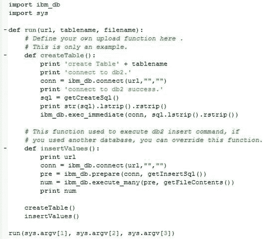

### 保存 Python 功能模块运行结果

我们可以将 Python 功能模块的运行结果保存为指定格式文件，或上传至数据库。使用 Syntax “SAVE TRANSLATE OUTFILE”命令可将运行结果保存为指定格式的文件。其中，数据集 RESULT 为 Python 功能模块的输出数据集，output_result_file 为待保存文件的文件名。我们首先设置操作的主数据集是 RESULT，然后使用 spss.Submit( ) 函数执行保存输出结果命令，就可以将 RESULT 数据集保存为指定格式的文件。具体命令如下。

##### 图 12\. 文件保存程序段


本例中，我们将 RESULT 数据集分别保存为 .csv 文件以及 .sav 文件。除此之外，我们还可以利用 ODBC 连接将输出数据集 RESULT 上传至数据库，为此，我们需要在系统中设定 DSN（Data Source Name）。DSN 为 ODBC 指定了某一数据源和相对应的 ODBC 驱动程序。接着，使用 Syntax “SAVE TRANSLATE ”命令实现上传数据库功能，具体命令如下。

##### 清单 1\. 数据库上传程序段

```
 begin program python.
 import spss
 import spssaux

 DSN = r"%%DSN%%"
 db_name=r"%%DBName%%"
 table_name=r"%%TableName%%"
 spss.Submit("dataset active RESULTS . \n")
 spss.Submit("execute . \n")

 varcount=spss.GetVariableCount()
 data_str = spss.GetVariableName(0)
 if spss.GetVariableType(0) > 0:
    data_type_str=spss.GetVariableName(0)+' '+'varchar'
 else:
    data_type_str=spss.GetVariableName(0)+' '+ 'double'

 for i in range(1,varcount):
    data_str = data_str +', '+ spss.GetVariableName(i)
    data_type_str = data_type_str +',
'+spss.GetVariableName(i)
    if spss.GetVariableType(i) > 0:
        data_type_str = ' '+data_type_str+' ' +'varchar'
    else:
        data_type_str = ' '+data_type_str+' ' + 'double'
 print DSN,db_name,table_name

 commands="""
     SAVE TRANSLATE /TYPE=ODBC
 /CONNECT='DSN="""+DSN+""";UID= ;PWD=,3;DBALIAS="""+db_name+
""";'
  /ENCRYPTED
  /MISSING=IGNORE
  /SQL='CREATE TABLE """+table_name+"""
 ("""+data_type_str+""" )'
  /REPLACE
  /TABLE='SPSS_TEMP'
  /KEEP=All
  /SQL='INSERT INTO """+table_name+""" ("""+data_str+""")
 SELECT """+data_str+""" FROM SPSS_TEMP'
  /SQL='DROP TABLE SPSS_TEMP'."""
 print commands
 spss.Submit(commands)
 end program. 
```

我们首先取得数据集 RESULT 中各数据值及其类型，根据这些数据信息用 SQL 命令在数据库中创建数据表，该表的表名是由用户通过 UI 界面指定的。

### 与 Statistics 进行集成

在 Customer Dialog 中设计完 UI 界面，把 UI 界面与上述的 Python 程序进行关联后，我们需要在 Statistics 中安装该 Customer Dialog，便于用户通过 UI 来使用我们自定义的 Python 功能模块。安装方式如图。

##### 图 13\. 安装 Customer Dialog 1

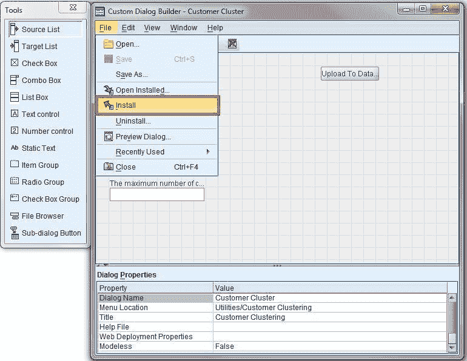

如图所示，在 Customer Dialog Builder 界面选择 File -> Install，选择保存好的对话框文件（CustomerClustering.spd）并指定安装位置本例中我们把创建的名为 Customer Clustering 的功能安装 至 Utilities 菜单下。安装完成结果如下所示。

##### 图 14\. 安装 Customer Dialog 2


如图所示，Statistics 的菜单栏 Utilities 下，出现了我们自定义的功能模块 Customer Clustering。

## 自定义 Python 模块运行演示及结果分析

本节分为两部分，讨论如何利用 Statistics 对自定义 Python 功能模块进行数据预处理以及对该功能模块的执行结果进行分析。

### 数据预处理

在大多数数据分析中，原始数据不适合直接使用，而需要进行预处理才能满足需求。比如，将多个小分类值组合为一个大分类值，或将一个连续变量转换成分类变量，这可以使得分析结果更易理解。本文需要把连续型变量”销售额”定义为一组分类变量，如：高、中、低，从而提高了数据的易用性。同时会使用 Statistics 的 Visual Binning 对功能模块输入数据进行预处理。

下面是处理过程。输入数据文件如下所示：

##### 图 15\. 输入文件演示


如图所示，我们需要对三类销售额进行分类，分别为 “SALES_RETAIL”、“SALES_ONLINE” 以及 “SALES_TOTAL”。我们以 “SLAES_RETAIL” 为例，其余两个变量处理过程与其类似。

在 Statistics 工具栏中，选择 Transform -> Visual Binning，出现 Visual Binning 对话框，选中 “SALES_RETAIL”，如下图所示。

##### 图 16\. Visual Binning 1


选择 “Continue”，指定新变量名 B_SALES_RETAIL。在 “Grid” 栏设置分类点（bin cut point）。这里，我们依据业务含义，选择了 9 个分类点，并点击 Make Lable 按钮，Statistics 会自动为分类变量生成标签。

##### 图 17\. Visual Binning 2


如图所示，我们把原始的 “SALES_RETAIL” 变量分为了 10 类，由图示可知，连续型变量 “SALES_RETAIL” 的值，将会分别落入分类类型 “B_SALES_RETAIL” 的 10 个分类值中。运行结果部分展示如下图所示。

##### 图 18\. Visual Binning 3

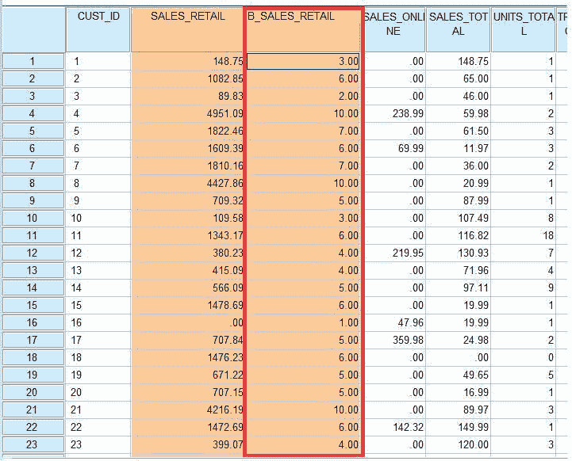

### 示例 Python 模块集成结果演示

原始数据的经过预处理后，已经满足了本文用户自定义功能模块的数据要求。现在，用户可以直接进入 Utilities->Customer Clustering，来调用自定义的方法并获得结果。

运行 Statistics 工具栏 Utilities -> Customer Clustering ，出现自定义对话框。

##### 图 19\. 集成结果演示 1


如图所示，输入所需参数，红框部分为我们数据预处理 Visual Binning 后的输入文件，用户规定最大分组为 8，则共有 9 个客户分群，分别为 0 至 8。点击 “OK” 运行，运行结果保存为 .csv 文件和 .sav 文件。除此之外，我们还可以将执行结果上传至数据库。点击 “Upload to Database”，出现如下子对话框。

##### 图 20\. 集成结果演示 2

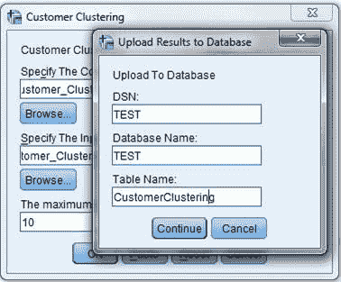

如图所示，输入上传数据库所需参数，表 “CustomerClustering” 用于存储客户分群结果。

输出结果文件如下图所示。

##### 图 21\. 集成结果演示 3

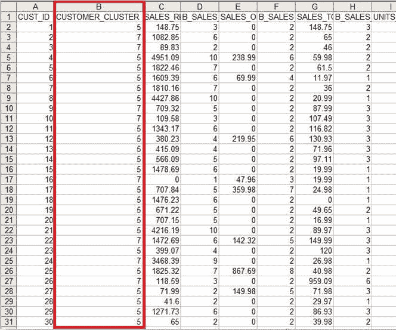

其中，“CUSTOMER_CLUSTER” 为客户的分组信息，如 Customer ID 分别为 1 的客户，属于分组 5。数据库上传结果如下所示。

##### 图 22\. 集成结果演示 4

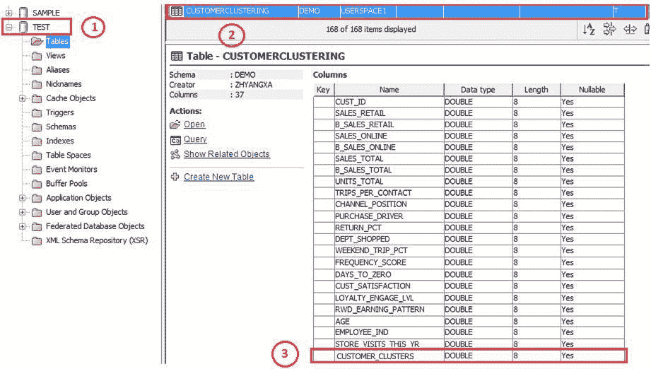

由图可知，我们在指定数据库 TEST 中，创建了表 CUSTOMERCLUSTERING，红框 3 中为 CUSTOMERCLUSTER 属性，其包含了客户所属分组信息。

### 示例 Python 模块集成结果分析

为了更加清楚的了解客户分群情况，我们可以利用 Statistics 中的 Frequencies 方法对其进行分析。分析结果如下。

表 1\. 统计结果


由表 1 可知，输出结果中，针对客户分组”CUSTOMER_CLUSTER”共有 50000 条有效的客户记录，其中中位数为分组 4，说明大部分的客户都集中在前半部分的分组当中（分组 1 至分组 4），分组 1 拥有最多的客户。表 1 只能提供给我们大概的统计结果，业务含义较少，详细统计信息如下。

表 2\. 统计结果明细

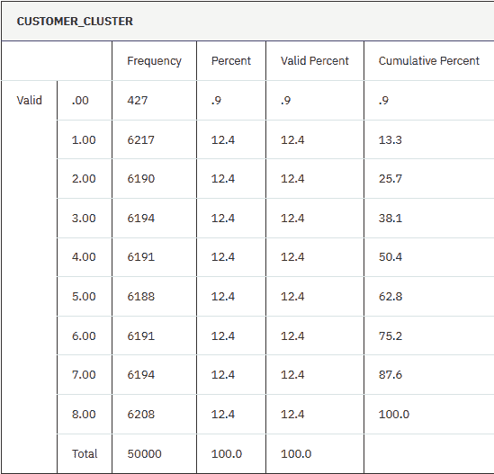

由表 2 可知，分组 0 拥有最少的客户数 427，分组 1 拥有最多的客户数 6217，并且客户较为均匀的分布在分组 1 至分组 8。客户分布情况图如下。

##### 图 23\. 客户分组图示


上图是对客户分群情况更为直观的展示，分组 1 至分组 8 拥有较多的客户，且分布较均匀。针对分组 0，由于其人数较少，业务优先级较低，我们可以对该组客户采用一般的销售策略。而对于分组 1 至分组 8，由于其人数较多，业务优先级较高，我们需要对该组客户进行进一步的分析，以便采取更加准确的销售策略，提升客户的忠诚度，减少客户流失。

## 结束语

本文介绍了用户自定义 Python 功能模块与 IBM SPSS Statistics 集成的方法，并对集成结果进行了演示与分析。通过本文，读者可以了解，如何设计满足用户习惯的 UI 交互界面，如何编写内置统计程序，以及如何与 Statistics 进行集成。

## 相关主题

*   学习 [SPSS Statistics Tutorial](https://www.ibm.com/support/knowledgecenter?origURL=api/redirect/spssstat/v20r0m0/index.jsp) 查看 Customer Dialog 属性及 Syntax 命令使用方法。
*   学习 developer [Information Management 技术主题](https://developer.ibm.com/zh/technologies/data-management/)
*   查看 [SPSS Statistics Plug-Ins](https://www.ibm.com/support/knowledgecenter?origURL=api/redirect/spssstat/v20r0m0/index.jsp)，获得集成插件。