# 洞察关联分析与预测建模

> 原文：[`developer.ibm.com/zh/articles/ba-spss-statistics1/`](https://developer.ibm.com/zh/articles/ba-spss-statistics1/)

## 1.简介

本文提出的智能容量规划管理解决方案旨在帮助企业更精准有效地匹配测试和生产环境，寻找各种性能指标的潜在关联关系，分析业务负载对容量的影响，建立预测模型进行实时验证。使企业科学地实施容量改革，合理地规划与配置资源，大量地节约企业成本，提高资源的可用性与可持续性。

## 2\. 应用背景

### 解决的问题

1）大型企业的 IT 系统对每一次应用程序的升级都会预先在其测试环境上进行测试。如何保证测试的有效性？如何通过测试的结果推测其在生产环境上的表现？

2）随着资源使用的增长，CPU，内存，硬盘，I/O 等资源互相影响并存在潜在关联。如何洞察其关联来指导企业做出合理的容量规划？

3）伴随业务扩展，企业生产环境的负载日益增加。 如何帮助企业通过对未来业务量和用户量的增长预测而做出相应的容量预估？

4）如何提供自动化、自适应的建模过程与预测分析，为企业用户打造针对个性化场景自动建立、自动调整的预测模型来降低使用复杂度？ 如何保证预测分析的有效性和准确性？

**商业价值**

1）避免过多地投入测试资源，最大化测试资源价值，实现测试与生产的资源整合。

2）优化企业数据中心资源利用率，各项资源合理配比，提供更精准的性能分析和容量规划方案以节约成本。

3）合理预测业务增长，提高企业对未来业务的洞察力，帮助企业制定更完备的容量预估和应急方案。

4）提升业务可持续性与用户体验，为企业提供基于源数据的自动化选型、建模、调整、验证的全生命周期解决方案。

### 数据准备

### 2.1 数据描述

应用某网站在新业务上线前，通过测试环境的测试结果预测其生产环境上线后的资源利用率场景。

从小范围入手，首先针对一台服务器，选取相关指标数据进行关联分析与预测建模的研究。例如在众多的服务器中，选取其中的一台 web 服务器（192.168.119.9），对该台服务器在 9 月 22 日 21:00~22:00 的 Access log 文件与 nmon 文件进行量化分析。

Access log 文件被保存成 IBM SPSS Statistics 的 SAV 格式的存储文件，如图 1 所示，其中包含以下字段：日期 date，时间 time（采集单位：分钟），访问 Server 的 IP 地址 server_ip，存储资源 Source 的 IP 地址 source_ip。

##### 图 1.nmon 文件变量视图

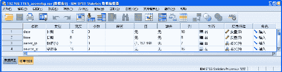

nmon 文件被保存成 IBM SPSS Statistics 的 SAV 格式的存储文件，如图 2 所示，其中包含以下字段：日期 date，时间 time（采集单位：分钟），用户 cpu 利用率 cpu_User ( 单位 :%) ，系统 cpu 利用率 cpu_Sys( 单位 :%) ，等待 cpu 利用率 cpu_Wait ( 单位 :%) ，空闲 cpu 利用率 cpu_Idel ( 单位 :%) ，请求类型 request_params( 如：/emall/SNGetIsUserLogonView)，返回类型 from_params( 如：`http://search.suning.com/emall/strd.do?ci=247504&cityId=9264`)，响应长度 response_len，响应时间 response_time。

##### 图 2.nmon 文件变量视图

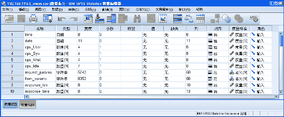

### 2.2 数据预处理

本文选取用户对 Server 的 IP 访问频率 frequency_User 与用户 cpu 利用率 cpu_User 进行关联分析，需要将以上两个数据文件的信息合并为一个新的数据文件。合并后的文件被保存成 IBM SPSS Statistics 的 SAV 格式的存储文件，如图 3 所示，其中包含以下字段：日期 date，时间 time（采集单位：分钟），用户 cpu 利用率 cpu_User ( 单位 :%)，用户对 Server 的 IP 访问频率 frequency_User。

##### 图 3\. 合并文件变量视图

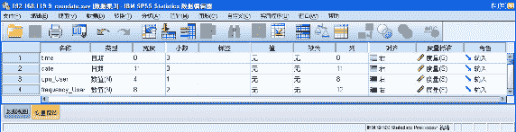

## 3\. IBM SPSS Statistics 使用过程

### 3.1 关联分析

选取一台服务器中，用户对 Server 的 IP 访问频率 frequency_User 与用户 cpu 利用率 cpu_User 进行关联分析。首先，通过相关系数 r，判断 frequency_User 与 cpu_User 是否线性相关。若线性相关，则可得出关联关系的结果。若不线性相关，则利用回归判断两组变量是否具有其他非线性关联关系。关联关系分析流程图，如下图 4 所示。

##### 图 4\. 关联分析流程图

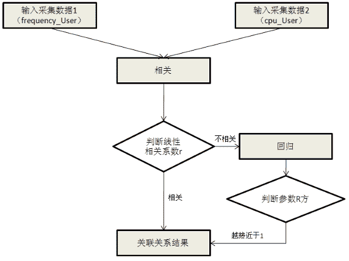

**3.1.1 相关**

1） 相关分析步骤

打开 IBM SPSS Statistics，在菜单中选择：分析 > 相关 > 双变量，就进入“双变量”模块方法界面，如图 5 所示。

##### 图 5\. 相关分析界面

在“双变量相关”对话框中，选择 frequency_User 与 cpu_User 进入“变量”框，再在“相关系数”框中选择相关系数的类型，共有三种：Pearson 为通常所指的相关系数（r），Kendell ‘ s tau-b 为非参数资料的相关系数，Spearman 为非正态分布资料的 Pearson 相关系数替代值，本文选用 Pearson 项；在“显著性检验”框中可选相关系数的单侧（One-tailed）或双侧（Two-tailed）检验，本文选双侧检验，如图 6 所示。

##### 图 6\. 选择变量与参数类型

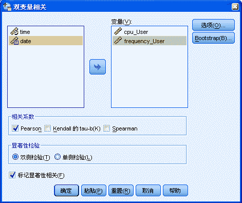

点击“选项”按钮弹出“双变量相关性：选项”对话框，可设置相关统计量，如图 7 所示。本文设置 frequency_User 与 cpu_User 输出“均数与标准差”以及“交叉乘积的标准差与协方差”，点击“继续”按钮返回“双变量相关”对话框。

##### 图 7\. 双变量相关性选项

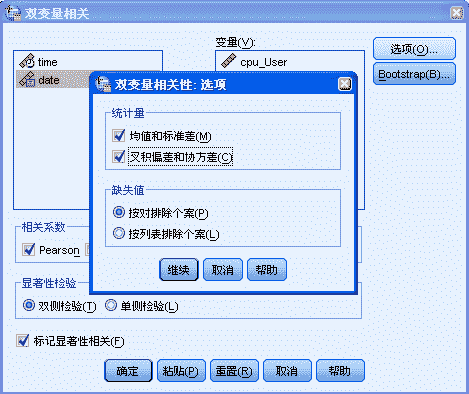

2）结果描述

根据相关分析的结果，cpu_User 的均值为 2.373%，标准差为 0.1148。frequency_User 的均值为 6251.3333，标准差为 250.36649，如图 8 所示。

##### 图 8\. 描述性统计量

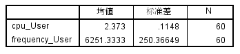

frequency_User 与 cpu_User 两两对应的相关系数及其双侧检验的概率，交叉乘积的标准差、协方差，如图 9 所示。

##### 图 9\. 相关性

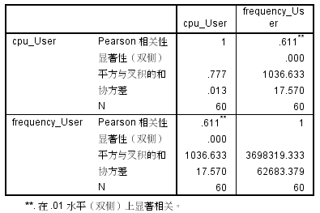

其中，Pearson 相关性的值为通常所指的相关系数 r。相关系数较好地度量了两变量间的线性相关程度，相关系数 r 属于 [-1,+1]。若 0<r 1 ≤ 1，表明变量之间存在正相关关系；若 -1 r<0，表明变量之间存在负相关关系。r ＝ 完全正相关；r ＝－1：完全负相关；这两种情况说明变量之间存在函数关系。r 0：无线性关系。|r|>0.8：强相关；|r|<0.3：弱相关，可视为不相关 。

为了判断 frequency_User 与 cpu_User 的相关性，需要对相关系数 r 进行假设检验。首先，假设总体相关性为零，即 H0 为两总体无显著的线性相关关系。其次，计算相应的统计量，并得到对应的相伴概率值 Sig.，如果 Sig. 小于或等于指定的显著性水平，则拒绝 H0，认为两总体存在显著的线性相关关系；否则，不能拒绝 H0，以为两总体不存在显著的线性相关关系。 frequency_User 与 cpu_User 两两对应的 Sig. 为 0, 显著性水平为 0.01。则 Sig. 小于指定的显著性水平，则拒绝 H0，认为 frequency_User 与 cpu_User 间存在显著的线性相关关系。 但是，本文的 Pearson 相关性的值为 0.611，还需利用回归分析进一步研究两种变量之间的函数关系。

**3.1.2 回归**

1）回归分析步骤

打开 IBM SPSS Statistics，在菜单中选择：分析 > 回归 > 曲线估计，就进入“曲线估计”模块方法界面，如图 10 所示。

##### 图 10\. 曲线估计界面

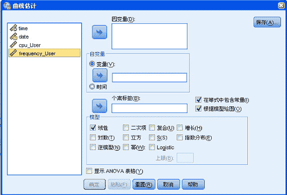

在”曲线估计”对话框中，选择 cpu_User 为因变量，frequency_User 为自变量，建立多种关联模型，如图 11 所示。

##### 图 11\. 建立多种关联模型

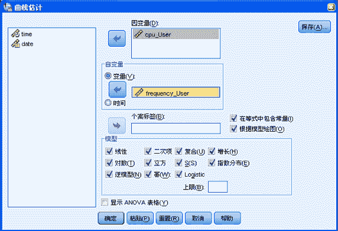

此过程可建立以下关联模型：

线性：拟合直线方程（实际上与 Linear 过程的二元直线回归相同，即 Y = b[0]+ b[1]X）；

二次：拟合二次方程（Y = b[0]+ b[1]X+b[2]X²）；

复合：拟合复合曲线模型（Y = b[0]× b[1]^x）；

增长：拟合等比级数曲线模型（Y = e^((b0+b1X))）；

对数：拟合对数方程（Y = b[0]+ b[1]lnX） ；

立方：拟合三次方程（Y = b[0]+ b[1]X+ b[2]X²+ b[3]X³）；

S：拟合 S 形曲线（Y = e^((b0+b1/X))）；

指数分布：拟合指数方程（Y = b0 e^(b1X)）；

逆模型：数据按 Y = b[0]+ b[1]/X 进行变换；

幂：拟合乘幂曲线模型（Y = b0X^(b1)）；

Logistic：拟合 Logistic 曲线模型（Y =（1/u + b[0]× b[1]^x）^(-1)）。

2）结果描述

根据关联分析的拟合结果，选取最优的函数结果，如图 12 所示。R 方称为方程的确定系数，取值范围在 0~1 之间，越接近 1，表明方程的变量对 y 的解释能力越强。本文中最优的拟合结果为二次模型和三次模型。其中，三次模型的参数 b3=0，即可认为是一个二次模型。那么，cpu_User 与 frequency_User 的函数关系式为：Y = b[0]+ b[1]X+b[2]X²。

##### 图 12\. 模型汇总和参数估计值

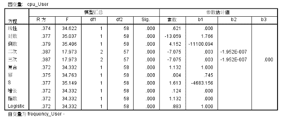

模型的曲线拟合结果，如图 13 所示。其中，横坐标代表用户访问频率 frequency_User，纵坐标代表 cpu 利用率 cpu_User（单位：%）。

##### 图 13\. 模型的曲线拟合结果

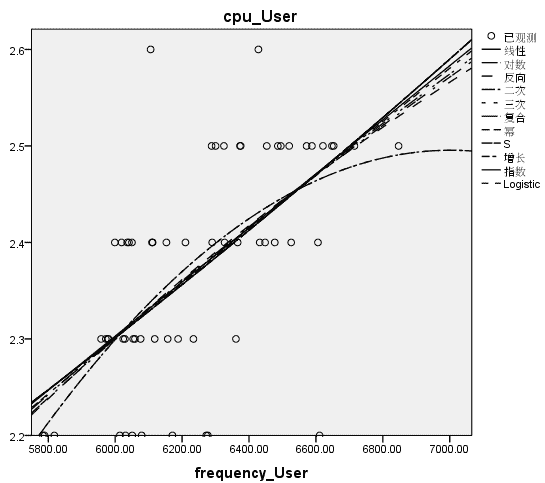

### 3.2 预测建模

本文选取 cpu 利用率中的 cpu_User 建立预测模型。首先，筛选出最优预测模型。利用专家预测模型进行建模，原因是专家预测模型中包含了指数平滑预测模型和 ARIMA 预测模型，用户可直接获取最优的预测模型。其次，模型参数调整。调整指数平滑预测模型与 ARIMA 预测模型的参数。最后，根据预测结果，判断用户的满意度。若用户满意预测结果，则选取此模型为最优模型；若用户不满意预测结果，则将专家预测模型、指数平滑预测模型、ARIMA 预测模型的所有参数提供给用户，允许用户进行预测模型选择及参数调整，不断循环以上步骤，直到用户对预测结果满意为止。预测模型的建模流程图，如图 14 所示。

##### 图 14\. 预测模型的建模流程图

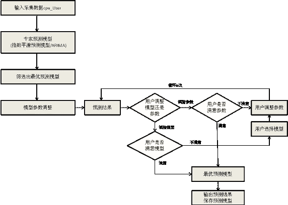

**3.2.1 筛选出最优预测模型**

1) 建模步骤

打开 IBM SPSS Statistics，在菜单中选择：分析 > 预测 > 创建模型，就进入”时间序列建模器”模块方法界面，如图 15 所示。在“时间序列建模器”对话框中，选择 cpu_User 为因变量，建立多种预测模型。

##### 图 15\. 时间序列建模器

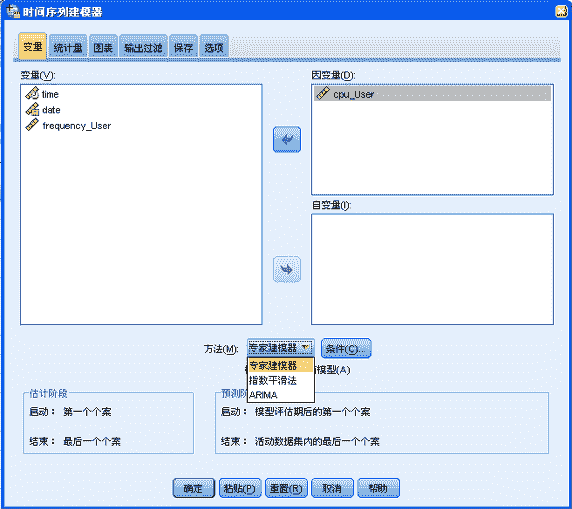

在“统计量”标签中选择输出的拟合度量指标，例如：R 方，均方根误差，平均绝对误差百分比。在“图表”标签中选择每张图显示的内容为：观察值，预测值和拟合值。在“保存”标签中，一方面，设置保存预测模型的预测结果在 SAV 文件中；另一方面，将预测模型保存为 xml 格式，当有新的数据需要预测时，可直接使用此保存结果，不用重新构造模型，如图 16 所示。在“选项”标签中指定未来希望预测到的时间点，例如本文有 1 至 60 分钟的观测值，指定预测值为 63 分钟，即可获得 61 至 63 分钟的预测值。

##### 图 16\. 保存预测模型

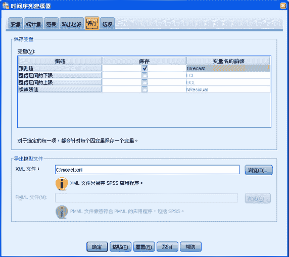

2）结果描述

根据拟合结果，选取最优的 ARIMA 预测模型进行建模，如图 17 所示。

##### 图 17\. 模型描述

输出的拟合度量指标，例如：R 方，均方根误差，平均绝对误差百分比，如图 18 所示。选取指标 R 方，均方根误差（RMSE），平均绝对误差百分比（MAPE）对预测结果进行评价。

##### 图 18\. 模型统计量

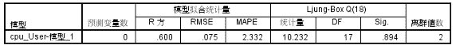

cpu_User 的观察值，预测值和拟合值，如图 19 所示。其中，横坐标代表时间（间隔：分钟），纵坐标代表 cpu 利用率 cpu_User（单位：%）。

##### 图 19\. 预测模型的预测结果

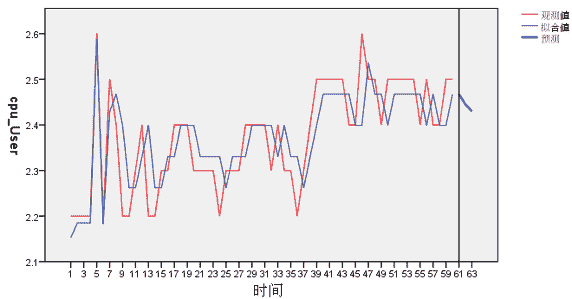

**3.2.2 模型参数调整**

在“时间序列建模器”对话框中，点击“条件”按钮。进入“时间序列建模器：指数平滑条件”。指数平滑模型可分为：简单、Holt 线性趋势、Brown 线性趋势、阻尼趋势、简单季节性、Winters 可加性、Winters 相乘性，如图 20 所示。可设置不同类型进行预测建模。

##### 图 20\. 指数平滑预测模型的分类

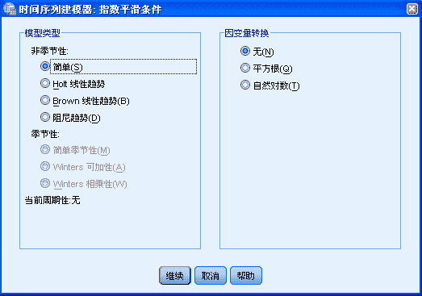

在“时间序列建模器”对话框中，点击“条件”按钮。进入“时间序列建模器：ARIMA 条件”。 ARIMA（p，d，q）称为差分自回归移动平均模型，AR 是自回归 , p 为自回归项 ; MA 为移动平均，q 为移动平均项数，d 为时间序列成为平稳时所做的差分次数。 p,d,q 取值范围一般均为 [0,2]，如图 21 所示。可设置不同的参数值进行预测建模。

##### 图 21.ARIMA 预测模型的分类

## 4\. 结束语

随着用户使用量的不断扩大，智能容量规划管理解决方案通过使用 IBM SPSS Statistics 中的分析功能，一方面，精确的分析出了资源与用户增长间的关联关系，利用关联关系来指导企业做出可靠的容量分析；另一方面，合理预测业务发展趋势，提高企业对未来业务的洞察力，帮助企业制定更完备的容量预估和应急方案。

## 相关主题

*   通过 [IBM SPSS Statistics 信息中心](https://www.ibm.com/support/knowledgecenter?origURL=api/redirect/spssstat/v20r0m0/index.jsp), 了解 IBM SPSS Statistics 产品的详细信息。