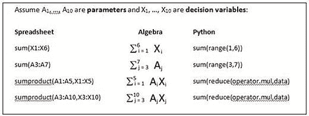
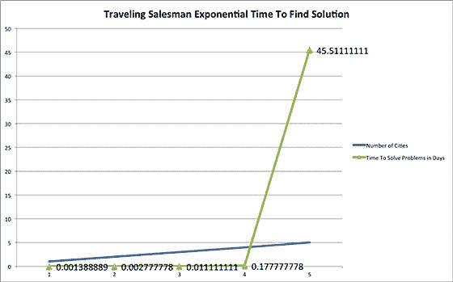

# 使用 Pyomo 解决复杂的问题

> 原文：[`developer.ibm.com/zh/articles/cl-optimizepythoncloud1/`](https://developer.ibm.com/zh/articles/cl-optimizepythoncloud1/)

## 简介

建模是一种解决复杂问题的强大方法。依据图书*Modeling Languages in Mathematical Optimization*（参阅参考资料）的叙述，模型用于：

*   解释现象
*   进行预测
*   评估关键因素
*   识别极限
*   分析折衷方法

在业界，Microsoft® Excel 等电子表格软件常常是建模问题的首要选择。现在，电子表格通常非常直观，但它们在解决大型问题上存在着局限性。如果您是开发人员，那么您可能会发现编写脚本来解决建模问题会更有效，因为您可以轻松地将脚本集成到其他系统中。本文将介绍使用 Pyomo 库在 Python 应用中实现线性优化的基础知识。

## 入门

首先要安装 Pyomo。Pyomo 是 Coopr 的一个中心组件，而 Coopr 是 Python 软件包的集合。您可以下载 [coopr_install 脚本](https://software.sandia.gov)，在使用 Python 解释器运行它时，它会创建一个 Python 虚拟环境。

创建一个名为 “coopr” 的相对目录：

```
noahs-MacBook-Air% python coopr_install 
```

使用下面的命令启动 Pyomo，这会将该相对目录和它的可执行文件放在您的路径中：

```
noahs-MacBook-Air% source coopr/bin/activate 
```

使用 Pyomo “`--help`” 命令获取使用 pyomo 的帮助：

```
(coopr)noahs-MacBook-Air% pyomo --help 
```

您需要一个编译器来使用虚拟 Python 环境构建器 (virtualenv) 和 Pyomo。在 OS X 上，使用 XCode Developer Tools 命令行工具。在 Linux 上，使用 GNU Compiler Collection (GCC)。初始化这个虚拟环境后，可通过以下两种方式之一使用 Pyomo 解决问题：

*   使用 Pyomo 命令行工具：

    ```
    (coopr)noahs-MacBook-Air% pyomo my_problem.py --solver=glpk 
    ```

*   或者，将初始化代码嵌入您的脚本中，通过 Python 解释器运行它：

##### 在一个脚本中调用 Pyomo

```
 #This is an optional code path that allows the script to be run outside of
  #pyomo command-line.  For example:  python wyndor.py
  if __name__ == '__main__':

      #This replicates what the pyomo command-line tools does
      from coopr.opt import SolverFactory
      opt = SolverFactory("glpk")
      instance = model.create()
      results = opt.solve(instance)
      #sends results to stdout
      results.write() 
```

Pyomo 假设您至少安装了一个解算器 (solver)。GNU Linear Programming Kit (glpk) 是默认的解算器。请参阅您希望使用的解算器的安装说明。然后确保 Pyomo 能够在它的路径上找到此解算器。

## 建模策略

可通过两种方式使用 Pyomo 创建数据模型：抽象方式和具体方式。二者的关键区别在于是否将模型与数据分开。

*   在抽象模型中，模型与数据是分开的。
*   在具体模型中，是在模型本身中定义数据的。例如，在使用具体模型的 Pyomo 脚本中，所有内容都是在单个脚本文件中定义的。对于更简单的问题，尤其是教学问题，这可能是一种很高效的方法。但在另一方面，更大的问题通常是拥有更大的数据集，这使得将数据和处理该数据所需的代码嵌入同一个脚本中变得不切实际。

从总体上讲，Pyomo 模型由变量（variables）、目标（objectives）和约束（constraints）组成。

*   变量是在优化期间计算的值。
*   目标是获取数据和变量的 Python 函数，它要么是最大值，要么是最小值。
*   约束是定义表达式来限制变量可使用的值的一种方式。

在创建 Pyomo 模型时，需要了解表示代数表达式的 Python 方法。下面的摘要简单对比了电子表格、代数和 Python 中的表达式：

##### 图 1\. 符号对比表



## Pyomo 应用程序示例：Wyndor

为了演示使用 Pyomo 时的一个简单的线性优化问题，我们以图书 *Introduction to Management Science* 中的一个产品组合问题为例（参阅参考资料）。Wyndor 工厂负责生产门窗，它的三个厂房有不同的营业时间，可以生产门或窗。要确定如何最大程度地提高有限生产时间内的可用利润，可以编写以下脚本。该脚本包含三个主要部分：模型、目标和约束。

*   模型（一个具体模型）实例化问题的数据，比如厂房的营业时间。
*   目标（可以是最大值或最小值）是最大的利润。
*   约束使用了一个 CapacityRule 函数，该函数使用一种称为*列表推导式*的 Python 语言来编写。

以下是 Wyndor 优化问题的脚本：

##### Wyndor Pyomo 基本示例

```
"""Wyndor model from Hillier and Hillier *Introduction to Management Science*

One way to do it...
Original Author dlw
Modified ndg

To run this you need pyomo and the glpk solver installed, and need to be
inside of the virtual environment.
When these dependencies are installed you can solve this way (glpk is default):

    pyomo wyndor.py

"""

#Explicit importing makes it more clear what a user needs to define
#versus what is included within the pyomo library
from coopr.pyomo import (ConcreteModel, Objective, Var, NonNegativeReals,
                              maximize, Constraint)

Products = ['Doors', 'Windows']
ProfitRate = {'Doors':300, 'Windows':500}
Plants = ['Door Fab', 'Window Fab', 'Assembly']
HoursAvailable = {'Door Fab':4, 'Window Fab':12, 'Assembly':18}
HoursPerUnit = {('Doors','Door Fab'):1, ('Windows', 'Window Fab'):2,
                ('Doors','Assembly'):3, ('Windows', 'Assembly'):2,
                ('Windows', 'Door Fab'):0, ('Doors', 'Window Fab'):0}

#Concrete Model
model = ConcreteModel()
#Decision Variables
model.WeeklyProd = Var(Products, within=NonNegativeReals)

#Objective
model.obj = Objective(expr=
            sum(ProfitRate[i] * model.WeeklyProd[i] for i in Products),
            sense = maximize)

def CapacityRule(model, p):
    """User Defined Capacity Rule

    Accepts a pyomo Concrete Model as the first positional argument,
    and and a plant index as a second positional argument
    """

    return sum(HoursPerUnit[i,p] * model.WeeklyProd[i] for i in Products)
      <= HoursAvailable[p]

This statement is what Pyomo needs to generate one constraint for each plant
model.Capacity = Constraint(Plants, rule = CapacityRule)

#This is an optional code path that allows the script to be run outside of
#pyomo command-line.  For example:  python wyndor.py
if __name__ == '__main__':

    #This replicates what the pyomo command-line tools does
    from coopr.opt import SolverFactory
    opt = SolverFactory("glpk")
    instance = model.create()
    results = opt.solve(instance)
    #sends results to stdout
    results.write() 
```

让我们运行以下脚本：

```
(coopr)noahs-MacBook-Air% pyomo wyndor.py 
```

Pyomo 返回以下输出，该输出显示了一个可行的解决方案（可实现 3,600 美元的利润）：

##### 一个可实现 3,600 美元的利润的可行解决方案

```
(coopr)noahs-MacBook-Air% pyomo wyndor.py
[    0.00] Setting up Pyomo environment
[    0.00] Applying Pyomo preprocessing actions
[    0.00] Creating model
[    0.00] Applying solver
[    0.01] Processing results
    Number of solutions: 1
    Solution Information
      Gap: 0.0
      Status: feasible
      Function Value: 3600.0
    Solver results file: results.json
[    0.02] Applying Pyomo postprocessing actions
[    0.02] Pyomo Finished 
```

我们看看您应生产的产品的比率。为此，对输出文件 results.json 运行 `cat`。结果如下：

```
"Variable": {
                "WeeklyProd[Doors]": {
                    "Id": 0,
                    "Value": 2.0
                },
                "WeeklyProd[Windows]": {
                    "Id": 1,
                    "Value": 6.0 
```

在输出中，可以看到生产 6 个窗子和 2 个门会得到 3,600 美元的最大利润。

解决该脚本的另一种方法是使用 Python，这得益于所添加的条件语句。这会在脚本内调用 Pyomo，而不是使用 Pyomo 调用脚本。

## 启发式优化：贪婪的随机流动推销员

Bill Cook 编写的图书 *In Pursuit of the Traveling Salesman: Mathematics at the Limits of Computation* 中包含一个优秀的问题示例，该问题并不总是像线性程序一样得到良好扩展。这个问题就是流动推销员问题或 TSP：在给定一个城市列表的情况下，找出仅访问每个城市一次并且最后回到最初的城市的最短路线。随着城市数量的增多，在最坏情况下，解决流动推销员问题的时间会呈指数级增长。

图 2 中的图表模拟了解决每种可能的路线所需的时间，假设只需几秒即可解决几个城市的问题。如您所见，在您的有生之年解决这个问题很快就会变得行不通。

##### 图 2\. 流动推销员问题的解决时间呈指数级增长



您需要另一种方法来查找*良好的*结果。通常，通过运行模拟，然后获取这些模拟的最佳结果，可以实现*良好*但不一定最佳的解决方案。此方法的一个示例如下面的 Python 代码所示。随机选择一个开始城市，然后*贪婪地*选择下一个具有最短距离的城市。这种模拟然后可运行多次，然后将得到这些模拟中的最短路径。

##### 贪婪最短距离选择

```
noahs-MacBook-Air% python tsp_greedy_random_start.py 20
Running simulation 20 times
Shortest Distance: 128
Optimal Route: [
 ('PCG', 'GPS', 1),
 ('GPS', 'URS', 1),
 ('URS', 'WFC', 0),
 ('WFC', 'MCK', 2),
 ('MCK', 'SFO', 16),
 ('SFO', 'ORCL', 20),
 ('ORCL', 'HPQ', 12),
 ('HPQ', 'GOOG', 6),
 ('GOOG', 'AAPL', 11),
 ('AAPL', 'INTC', 8),
 ('INTC', 'CSCO', 6),
 ('CSCO', 'EBAY', 0),
 ('EBAY', 'SWY', 32),
 ('SWY', 'CVX', 13)
] 
```

##### TSP 贪婪随机起点

```
#!/usr/bin/env python
"""
Traveling salesman solution with random start and greedy path selection
You can select how many iterations to run by doing the following:

python tsp_greedy_random_start.py 20 #runs 20 times

"""

import sys
from random import choice
import numpy as np
from routes import values

dt = np.dtype([('city_start', 'S10'), ('city_end', 'S10'), ('distance', int)])
data_set = np.array(values,dtype=dt)

def all_cities(mdarray):
    """Takes a multi-dimensional array in this format and finds unique cities

    array([["A", "A"],
    ["A", "B"]])

    """
    cities = {}
    city_set = set(data_set['city_end'])
    for city in city_set:
        cities[city] = ""
    return cities

def randomize_city_start(all_cities):
    """Returns a randomized city to start trip"""

    return choice(all_cities)

def get_shortest_route(routes):
    """Sort the list by distance and return shortest distance route"""

    route = sorted(routes, key=lambda dist: dist[2]).pop(0)
    return route

def greedy_path():
    """Select the next path to travel based on the shortest, nearest path"""

    itinerary = []
    cities = all_cities(data_set)
    starting_city = randomize_city_start(cities.keys())
    #print "starting_city: %s" % starting_city
    cities_visited = {}
    #we want to iterate through all cities once
    count = 1
    while True:
        possible_routes = []
        distance = []
        #print "starting city: %s" % starting_city
        for path in data_set:
            if starting_city in path['city_start']:
                #we can't go to cities we have already visited
                if path['city_end'] in cities_visited:
                    continue
                else:
                    #print "path: ", path
                    possible_routes.append(path)

        if not possible_routes:
            break
        #append this to itinerary
        route = get_shortest_route(possible_routes)
        #print "Route(%s): %s " % (count, route)
        count += 1
        itinerary.append(route)
        #add this city to the visited city list
        cities_visited[route[0]] = count
        #print "cities_visited: %s " % cities_visited
        #reset the starting_city to the next city
        starting_city = route[1]
        #print "itinerary: %s" % itinerary

    return itinerary

def get_total_distance(complete_itinerary):

    distance = sum(z for x,y,z in complete_itinerary)
    return distance

def lowest_simulation(num):

    routes = {}
    for i in range(num):
        itinerary = greedy_path()
        distance = get_total_distance(itinerary)
        routes[distance] = itinerary
    shortest_distance = min(routes.keys())
    route = routes[shortest_distance]
    return shortest_distance, route

def main():
    """runs everything"""

    if len(sys.argv) == 2:
        iterations = int(sys.argv[1])
        print "Running simulation %s times" % iterations
        distance, route = lowest_simulation(iterations)
        print "Shortest Distance: %s" % distance
        print "Optimal Route: %s" % route
    else:
        #print "All Routes: %s" % data_set
        itinerary = greedy_path()
        print "itinerary: %s" % itinerary
        print "Distance: %s" % get_total_distance(itinerary)

if __name__ == '__main__':
   main() 
```

上述 TSP 脚本使用了一个 NumPy 多维数组作为数据来源。如果希望运行此示例，则需要安装 NumPy（参阅参考资料）。该数组是在一个名为 routes.py 的文件中定义的。以下是可能的路线。

##### 包含城市间路线的 NumPy 多维数组

```
values = [
("AAPL", "CSCO", 14),
("AAPL", "CVX", 44),
("AAPL", "EBAY", 14),
("AAPL", "GOOG", 14),
("AAPL", "GPS", 59),
("AAPL", "HPQ", 14),
("AAPL", "INTC", 8),
("AAPL", "MCK", 60),
("AAPL", "ORCL", 26),
("AAPL", "PCG", 59),
("AAPL", "SFO", 46),
("AAPL", "SWY", 37),
("AAPL", "URS", 60),
("AAPL", "WFC", 60),

("CSCO","AAPL" ,14),
("CSCO", "CVX", 43),
("CSCO", "EBAY",0),
("CSCO", "GOOG",21),
("CSCO", "GPS",67),
("CSCO", "HPQ",26),
("CSCO", "INTC",6),
("CSCO", "MCK",68),
("CSCO", "ORCL",37),
("CSCO", "PCG",68),
("CSCO", "SFO",57),
("CSCO", "SWY",32),
("CSCO", "URS",68),
("CSCO", "WFC",68),

("CVX","AAPL" ,44),
("CVX", "CSCO",43),
("CVX", "EBAY",43),
("CVX", "GOOG",36),
("CVX", "GPS",43),
("CVX", "HPQ",40),
("CVX", "INTC",41),
("CVX", "MCK",46),
("CVX", "ORCL",39),
("CVX", "PCG",44),
("CVX", "SFO",45),
("CVX", "SWY",13),
("CVX", "URS",44),
("CVX", "WFC",44),

("EBAY","AAPL" ,14),
("EBAY", "CSCO",0),
("EBAY", "CVX",43),
("EBAY", "GOOG",21),
("EBAY", "GPS",67),
("EBAY", "HPQ",26),
("EBAY", "INTC",6),
("EBAY", "MCK",68),
("EBAY", "ORCL",37),
("EBAY", "PCG",68),
("EBAY", "SFO",57),
("EBAY", "SWY",32),
("EBAY", "URS",68),
("EBAY", "WFC",68),

("GOOG","AAPL",11),
("GOOG", "CSCO",21),
("GOOG", "CVX",36),
("GOOG", "EBAY",21),
("GOOG", "GPS",48),
("GOOG", "HPQ",6),
("GOOG", "INTC",15),
("GOOG", "MCK",49),
("GOOG", "ORCL",16),
("GOOG", "PCG",48),
("GOOG", "SFO",36),
("GOOG", "SWY",32),
("GOOG", "URS",49),
("GOOG", "WFC",49),

("GPS","AAPL" ,59),
("GPS", "CSCO",67),
("GPS", "CVX",43),
("GPS", "EBAY",67),
("GPS", "GOOG",48),
("GPS", "HPQ",45),
("GPS", "INTC",62),
("GPS", "MCK",03),
("GPS", "ORCL",34),
("GPS", "PCG",01),
("GPS", "SFO",18),
("GPS", "SWY",53),
("GPS", "URS",01),
("GPS", "WFC",01),

("HPQ","AAPL" ,14),
("HPQ", "CSCO",26),
("HPQ", "CVX",40),
("HPQ", "EBAY",26),
("HPQ", "GOOG",6),
("HPQ", "GPS",45),
("HPQ", "INTC",20),
("HPQ", "MCK",46),
("HPQ", "ORCL",12),
("HPQ", "PCG",46),
("HPQ", "SFO",32),
("HPQ", "SWY",37),
("HPQ", "URS",46),
("HPQ", "WFC",46),

("INTC","AAPL",8),
("INTC","CSCO",6),
("INTC", "CVX",41),
("INTC", "EBAY",6),
("INTC", "GOOG",15),
("INTC", "GPS",62),
("INTC", "HPQ",20),
("INTC", "MCK",63),
("INTC", "ORCL",31),
("INTC", "PCG",62),
("INTC", "SFO",51),
("INTC", "SWY",32),
("INTC", "URS",63),
("INTC", "WFC",63),

("MCK", "AAPL",60),
("MCK", "CSCO",68),
("MCK", "CVX",46),
("MCK", "EBAY",68),
("MCK", "GOOG",49),
("MCK", "GPS",03),
("MCK", "HPQ",46),
("MCK", "INTC",63),
("MCK", "ORCL",34),
("MCK", "PCG",3),
("MCK", "SFO",16),
("MCK", "SWY",56),
("MCK", "URS",3),
("MCK", "WFC",2),

("ORCL", "AAPL",22),
("ORCL", "CSCO",37),
("ORCL", "CVX",39),
("ORCL", "EBAY",37),
("ORCL", "GOOG",16),
("ORCL", "GPS",34),
("ORCL", "HPQ",12),
("ORCL", "INTC",31),
("ORCL", "MCK",34),
("ORCL", "PCG",35),
("ORCL", "SFO",20),
("ORCL", "SWY",40),
("ORCL", "URS",35),
("ORCL", "WFC",35),

("PCG", "AAPL",59),
("PCG", "CSCO",68),
("PCG", "CVX",44),
("PCG", "EBAY",68),
("PCG", "GOOG",48),
("PCG", "GPS",01),
("PCG", "HPQ",46),
("PCG", "INTC",62),
("PCG", "MCK",03),
("PCG", "ORCL",35),
("PCG", "SFO",18),
("PCG", "SWY",54),
("PCG", "URS",01),
("PCG", "WFC",01),

("SFO", "AAPL",46),
("SFO", "CSCO",57),
("SFO", "CVX",45),
("SFO", "EBAY",57),
("SFO", "GOOG",36),
("SFO", "GPS",18),
("SFO", "HPQ",32),
("SFO", "INTC",51),
("SFO", "MCK",16),
("SFO", "ORCL",20),
("SFO", "PCG",18),
("SFO", "SWY",52),
("SFO", "URS",18),
("SFO", "WFC",18),

("SWY", "AAPL",37),
("SWY", "CSCO",32),
("SWY", "CVX",13),
("SWY", "EBAY",32),
("SWY", "GOOG",32),
("SWY", "GPS",53),
("SWY", "HPQ",37),
("SWY", "INTC",32),
("SWY", "MCK",56),
("SWY", "ORCL",40),
("SWY", "PCG",54),
("SWY", "SFO",52),
("SWY", "URS",54),
("SWY", "WFC",54),

("URS", "AAPL",60),
("URS", "CSCO",68),
("URS", "CVX",44),
("URS", "EBAY",68),
("URS", "GOOG",49),
("URS", "GPS",01),
("URS", "HPQ",46),
("URS", "INTC",63),
("URS", "MCK",03),
("URS", "ORCL",35),
("URS", "PCG",01),
("URS", "SFO",18),
("URS", "SWY",54),
("URS", "WFC",0),

("WFC", "AAPL",60),
("WFC", "CSCO",68),
("WFC", "CVX",44),
("WFC", "EBAY",68),
("WFC", "GOOG",49),
("WFC", "GPS",01),
("WFC", "HPQ",46),
("WFC", "INTC",63),
("WFC", "MCK",02),
("WFC", "ORCL",35),
("WFC", "PCG",01),
("WFC", "SFO",18),
("WFC", "SWY",54),
("WFC", "URS",0),

] 
```

## 结束语

本文介绍了使用 Pyomo 和 Python 执行优化的基础知识。这些知识应足以让您开始自己的优化工作。在本系列的后面两篇文章中，我将提供一些更详细的示例，介绍构建更大的程序和处理扩展问题的一些实用方面。

### 致谢

特别感谢 David L. Woodruff 对本文的审阅。

本文翻译自：[Linear optimization in Python, Part 1: Solve complex problems in the cloud with Pyomo](https://developer.ibm.com/articles/cl-optimizepythoncloud1/)（2013-02-05）