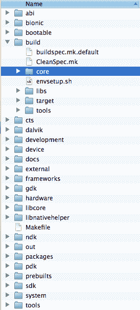
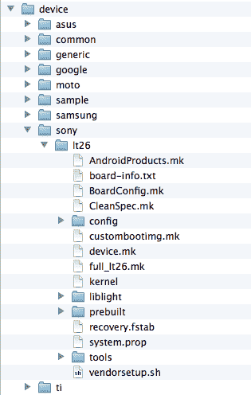
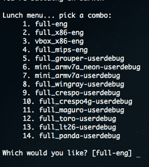
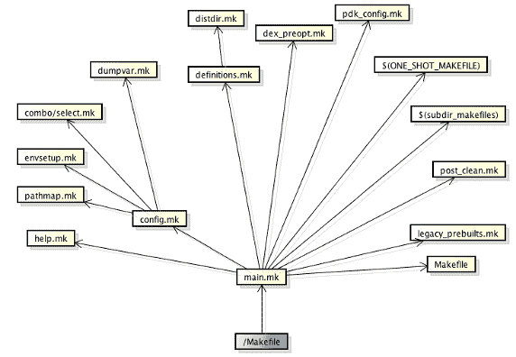
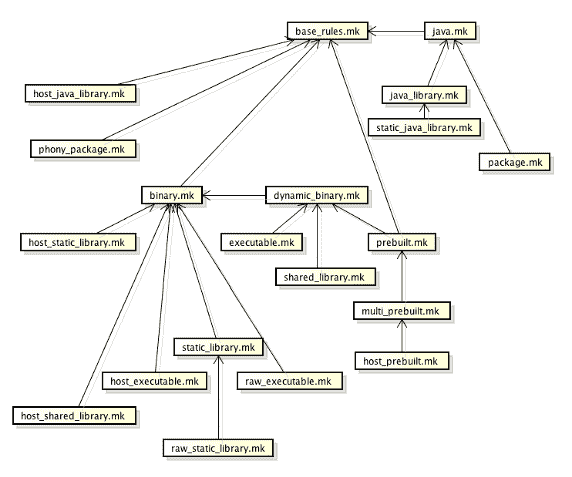
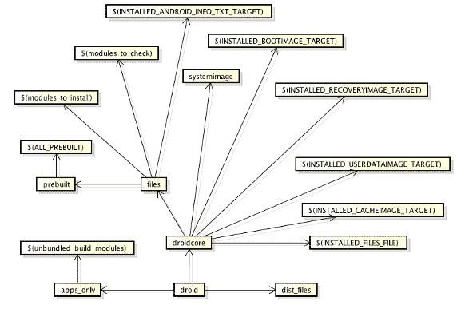

# 理解 Android Build 系统

> 原文：[`developer.ibm.com/zh/articles/os-cn-android-build/`](https://developer.ibm.com/zh/articles/os-cn-android-build/)

## 前言

Android Build 系统是 Android 源码的一部分。关于如何获取 Android 源码，请参照 [Android Source 官方网站](http://source.android.com/source/downloading.html) 。

Android Build 系统用来编译 Android 系统，Android SDK 以及相关文档。该系统主要由 Make 文件，Shell 脚本以及 Python 脚本组成，其中最主要的是 Make 文件。

众所周知，Android 是一个开源的操作系统。Android 的源码中包含了大量的开源项目以及许多的模块。不同产商的不同设备对于 Android 系统的定制都是不一样的。

如何将这些项目和模块的编译统一管理起来，如何能够在不同的操作系统上进行编译，如何在编译时能够支持面向不同的硬件设备，不同的编译类型，且还要提供面向各个产商的定制扩展，是非常有难度的。

但 Android Build 系统很好的解决了这些问题，这里面有很多值得我们开发人员学习的地方。

对于 Android 平台开发人员来说，本文可以帮助你熟悉你每天接触到的构建环境。

对于其他开发人员来说，本文可以作为一个 GNU Make 的使用案例，学习这些成功案例，可以提升我们的开发经验。

## 概述

Build 系统中最主要的处理逻辑都在 Make 文件中，而其他的脚本文件只是起到一些辅助作用，由于篇幅所限，本文只探讨 Make 文件中的内容。

整个 Build 系统中的 Make 文件可以分为三类：

第一类是 Build 系统核心文件，此类文件定义了整个 Build 系统的框架，而其他所有 Make 文件都是在这个框架的基础上编写出来的。

图 1 是 Android 源码树的目录结构，Build 系统核心文件全部位于 /build/core（本文所提到的所有路径都是以 Android 源码树作为背景的，”/”指的是源码树的根目录，与文件系统无关）目录下。

##### 图 1\. Android 源码树的目录结构



第二类是针对某个产品（一个产品可能是某个型号的手机或者平板电脑）的 Make 文件，这些文件通常位于 device 目录下，该目录下又以公司名以及产品名分为两级目录，图 2 是 device 目录下子目录的结构。对于一个产品的定义通常需要一组文件，这些文件共同构成了对于这个产品的定义。例如，/device/sony/it26 目录下的文件共同构成了对于 Sony LT26 型号手机的定义。

##### 图 2\. device 目录下子目录的结构



第三类是针对某个模块（关于模块后文会详细讨论）的 Make 文件。整个系统中，包含了大量的模块，每个模块都有一个专门的 Make 文件，这类文件的名称统一为”Android.mk”，该文件中定义了如何编译当前模块。Build 系统会在整个源码树中扫描名称为”Android.mk”的文件并根据其中的内容执行模块的编译。

## 编译 Android 系统

### 执行编译

Android 系统的编译环境目前只支持 Ubuntu 以及 Mac OS 两种操作系统。关于编译环境的构建方法请参见以下路径： [`source.android.com/source/initializing.html`](http://source.android.com/source/initializing.html)

在完成编译环境的准备工作以及获取到完整的 Android 源码之后，想要编译出整个 Android 系统非常的容易：

打开控制台之后转到 Android 源码的根目录，然后执行如清单 1 所示的三条命令即可（ `"$"` 是命令提示符，不是命令的一部分。）：

完整的编译时间依赖于编译主机的配置，在笔者的 Macbook Pro（OS X 10.8.2, i7 2G CPU，8G RAM, 120G SSD）上使用 8 个 Job 同时编译共需要一个半小时左右的时间。

##### 清单 1\. 编译 Android 系统

```
$ source build/envsetup.sh
 $ lunch full-eng
 $ make -j8 
```

这三行命令的说明如下：

第一行命令”source build/envsetup.sh”引入了 `build/envsetup.sh` 脚本。该脚本的作用是初始化编译环境，并引入一些辅助的 Shell 函数，这其中就包括第二步使用 lunch 函数。

除此之外，该文件中还定义了其他一些常用的函数，它们如表 1 所示：

##### 表 1\. build/envsetup.sh 中定义的常用函数

| 名称 | 说明 |
| --- | --- |
| **croot** | 切换到源码树的根目录 |
| **m** | 在源码树的根目录执行 make |
| **mm** | Build 当前目录下的模块 |
| **mmm** | Build 指定目录下的模块 |
| **cgrep** | 在所有 C/C++ 文件上执行 grep |
| **jgrep** | 在所有 Java 文件上执行 grep |
| **resgrep** | 在所有 res/*.xml 文件上执行 grep |
| **godir** | 转到包含某个文件的目录路径 |
| **printconfig** | 显示当前 Build 的配置信息 |
| **add_lunch_combo** | 在 lunch 函数的菜单中添加一个条目 |

第二行命令”lunch full-eng”是调用 lunch 函数，并指定参数为”full-eng”。lunch 函数的参数用来指定此次编译的目标设备以及编译类型。在这里，这两个值分别是”full”和”eng”。”full”是 Android 源码中已经定义好的一种产品，是为模拟器而设置的。而编译类型会影响最终系统中包含的模块，关于编译类型将在表 7 中详细讲解。

如果调用 lunch 函数的时候没有指定参数，那么该函数将输出列表以供选择，该列表类似图 3 中的内容（列表的内容会根据当前 Build 系统中包含的产品配置而不同，具体参见后文”添加新的产品”），此时可以通过输入编号或者名称进行选择。

##### 图 3\. lunch 函数的输出



第三行命令”make -j8”才真正开始执行编译。make 的参数”-j”指定了同时编译的 Job 数量，这是个整数，该值通常是编译主机 CPU 支持的并发线程总数的 1 倍或 2 倍（例如：在一个 4 核，每个核支持两个线程的 CPU 上，可以使用 make -j8 或 make -j16）。在调用 make 命令时，如果没有指定任何目标，则将使用默认的名称为”droid”目标，该目标会编译出完整的 Android 系统镜像。

### Build 结果的目录结构

所有的编译产物都将位于 /out 目录下，该目录下主要有以下几个子目录：

*   /out/host/：该目录下包含了针对主机的 Android 开发工具的产物。即 SDK 中的各种工具，例如：emulator，adb，aapt 等。
*   /out/target/common/：该目录下包含了针对设备的共通的编译产物，主要是 Java 应用代码和 Java 库。
*   /out/target/product/< *product_name* >/：包含了针对特定设备的编译结果以及平台相关的 C/C++ 库和二进制文件。其中， *<product_name></product_name>*是具体目标设备的名称。
*   /out/dist/：包含了为多种分发而准备的包，通过”`make dist`target_ ”将文件拷贝到该目录，默认的编译目标不会产生该目录。

### Build 生成的镜像文件

Build 的产物中最重要的是三个镜像文件，它们都位于 /out/target/product/< *product_name* >/ 目录下。

这三个文件是：

*   system.img：包含了 Android OS 的系统文件，库，可执行文件以及预置的应用程序，将被挂载为根分区。
*   ramdisk.img：在启动时将被 Linux 内核挂载为只读分区，它包含了 /init 文件和一些配置文件。它用来挂载其他系统镜像并启动 init 进程。
*   userdata.img：将被挂载为 /data，包含了应用程序相关的数据以及和用户相关的数据。

## Make 文件说明

整个 Build 系统的入口文件是源码树根目录下名称为”Makefile”的文件，当在源代码根目录上调用 make 命令时，make 命令首先将读取该文件。

Makefile 文件的内容只有一行：”`include build/core/main.mk` ”。该行代码的作用很明显：包含 build/core/main.mk 文件。在 main.mk 文件中又会包含其他的文件，其他文件中又会包含更多的文件，这样就引入了整个 Build 系统。

这些 Make 文件间的包含关系是相当复杂的，图 3 描述了这种关系，该图中黄色标记的文件（且除了 `$` 开头的文件）都位于 build/core/ 目录下。

##### 图 4\. 主要的 Make 文件及其包含关系



表 2 总结了图 4 中提到的这些文件的作用：

##### 表 2\. 主要的 Make 文件的说明

| 文件名 | 说明 |
| --- | --- |
| **main.mk** | 最主要的 Make 文件，该文件中首先将对编译环境进行检查，同时引入其他的 Make 文件。另外，该文件中还定义了几个最主要的 Make 目标，例如 droid，sdk，等（参见后文”Make 目标说明”）。 |
| **help.mk** | 包含了名称为 help 的 Make 目标的定义，该目标将列出主要的 Make 目标及其说明。 |
| **pathmap.mk** | 将许多头文件的路径通过名值对的方式定义为映射表，并提供 include-path-for 函数来获取。例如，通过 `$(call include-path-for, frameworks-native)` 便可以获取到 framework 本地代码需要的头文件路径。 |
| **envsetup.mk** | 配置 Build 系统需要的环境变量，例如：TARGET_PRODUCT，TARGET_BUILD_VARIANT，HOST_OS，HOST_ARCH 等。 当前编译的主机平台信息（例如操作系统，CPU 类型等信息）就是在这个文件中确定的。 另外，该文件中还指定了各种编译结果的输出路径。 |
| **combo/select.mk** | 根据当前编译器的平台选择平台相关的 Make 文件。 |
| **dumpvar.mk** | 在 Build 开始之前，显示此次 Build 的配置信息。 |
| **config.mk** | 整个 Build 系统的配置文件，最重要的 Make 文件之一。该文件中主要包含以下内容：1\. 定义了许多的常量来负责不同类型模块的编译。2.定义编译器参数以及常见文件后缀，例如 .zip,.jar.apk。 3\. 根据 BoardConfig.mk 文件，配置产品相关的参数。 4\. 设置一些常用工具的路径，例如 flex，e2fsck，dx。 |
| **definitions.mk** | 最重要的 Make 文件之一，在其中定义了大量的函数。这些函数都是 Build 系统的其他文件将用到的。例如：my-dir，all-subdir-makefiles，find-subdir-files，sign-package 等，关于这些函数的说明请参见每个函数的代码注释。 |
| **distdir.mk** | 针对 dist 目标的定义。dist 目标用来拷贝文件到指定路径。 |
| **dex_preopt.mk** | 针对启动 jar 包的预先优化。 |
| **pdk_config.mk** | 顾名思义，针对 pdk（Platform Developement Kit）的配置文件。 |
| **`${ONE_SHOT_MAKEFILE}`** | ONE_SHOT_MAKEFILE 是一个变量，当使用”mm”编译某个目录下的模块时，此变量的值即为当前指定路径下的 Make 文件的路径。 |
| **`${subdir_makefiles}`** | 各个模块的 Android.mk 文件的集合，这个集合是通过 Python 脚本扫描得到的。 |
| **post_clean.mk** | 在前一次 Build 的基础上检查当前 Build 的配置，并执行必要清理工作。 |
| **legacy_prebuilts.mk** | 该文件中只定义了 GRANDFATHERED_ALL_PREBUILT 变量。 |
| **Makefile** | 被 main.mk 包含，该文件中的内容是辅助 main.mk 的一些额外内容。 |

Android 源码中包含了许多的模块，模块的类型有很多种，例如：Java 库，C/C++ 库，APK 应用，以及可执行文件等 。并且，Java 或者 C/C++ 库还可以分为静态的或者动态的，库或可执行文件既可能是针对设备（本文的”设备”指的是 Android 系统将被安装的设备，例如某个型号的手机或平板）的也可能是针对主机（本文的”主机”指的是开发 Android 系统的机器，例如装有 Ubuntu 操作系统的 PC 机或装有 MacOS 的 iMac 或 Macbook）的。不同类型的模块的编译步骤和方法是不一样，为了能够一致且方便的执行各种类型模块的编译，在 config.mk 中定义了许多的常量，这其中的每个常量描述了一种类型模块的编译方式，这些常量有：

*   BUILD_HOST_STATIC_LIBRARY
*   BUILD_HOST_SHARED_LIBRARY
*   BUILD_STATIC_LIBRARY
*   BUILD_SHARED_LIBRARY
*   BUILD_EXECUTABLE
*   BUILD_HOST_EXECUTABLE
*   BUILD_PACKAGE
*   BUILD_PREBUILT
*   BUILD_MULTI_PREBUILT
*   BUILD_HOST_PREBUILT
*   BUILD_JAVA_LIBRARY
*   BUILD_STATIC_JAVA_LIBRARY
*   BUILD_HOST_JAVA_LIBRARY

通过名称大概就可以猜出每个变量所对应的模块类型。（在模块的 Android.mk 文件中，只要包含进这里对应的常量便可以执行相应类型模块的编译。对于 Android.mk 文件的编写请参见后文：”添加新的模块”。）

这些常量的值都是另外一个 Make 文件的路径，详细的编译方式都是在对应的 Make 文件中定义的。这些常量和 Make 文件的是一一对应的，对应规则也很简单：常量的名称是 Make 文件的文件名除去后缀全部改为大写然后加上”BUILD_”作为前缀。例如常量 BUILD_HOST_PREBUILT 的值对应的文件就是 host_prebuilt.mk。

这些 Make 文件的说明如表 3 所示：

##### 表 3\. 各种模块的编译方式的定义文件

| 文件名 | 说明 |
| --- | --- |
| **host_static_library.mk** | 定义了如何编译主机上的静态库。 |
| **host_shared_library.mk** | 定义了如何编译主机上的共享库。 |
| **static_library.mk** | 定义了如何编译设备上的静态库。 |
| **shared_library.mk** | 定义了如何编译设备上的共享库。 |
| **executable.mk** | 定义了如何编译设备上的可执行文件。 |
| **host_executable.mk** | 定义了如何编译主机上的可执行文件。 |
| **package.mk** | 定义了如何编译 APK 文件。 |
| **prebuilt.mk** | 定义了如何处理一个已经编译好的文件 ( 例如 Jar 包 )。 |
| **multi_prebuilt.mk** | 定义了如何处理一个或多个已编译文件，该文件的实现依赖 prebuilt.mk。 |
| **host_prebuilt.mk** | 处理一个或多个主机上使用的已编译文件，该文件的实现依赖 multi_prebuilt.mk。 |
| **java_library.mk** | 定义了如何编译设备上的共享 Java 库。 |
| **static_java_library.mk** | 定义了如何编译设备上的静态 Java 库。 |
| **host_java_library.mk** | 定义了如何编译主机上的共享 Java 库。 |

不同类型的模块的编译过程会有一些相同的步骤，例如：编译一个 Java 库和编译一个 APK 文件都需要定义如何编译 Java 文件。因此，表 3 中的这些 Make 文件的定义中会包含一些共同的代码逻辑。为了减少代码冗余，需要将共同的代码复用起来，复用的方式是将共同代码放到专门的文件中，然后在其他文件中包含这些文件的方式来实现的。这些包含关系如图 5 所示。由于篇幅关系，这里就不再对其他文件做详细描述（其实这些文件从文件名称中就可以大致猜出其作用）。

##### 图 5\. 模块的编译方式定义文件的包含关系



## Make 目标说明

### make /make droid

如果在源码树的根目录直接调用”make”命令而不指定任何目标，则会选择默认目标：”droid”（在 main.mk 中定义）。因此，这和执行”make droid”效果是一样的。

droid 目标将编译出整个系统的镜像。从源代码到编译出系统镜像，整个编译过程非常复杂。这个过程并不是在 droid 一个目标中定义的，而是 droid 目标会依赖许多其他的目标，这些目标的互相配合导致了整个系统的编译。

图 6 描述了 droid 目标所依赖的其他目标：

##### 图 6\. droid 目标所依赖的其他 Make 目标



图 6 中这些目标的说明如表 4 所示：

##### 表 4\. droid 所依赖的其他 Make 目标的说明

| 名称 | 说明 |
| --- | --- |
| **apps_only** | 该目标将编译出当前配置下不包含 user，userdebug，eng 标签（关于标签，请参见后文”添加新的模块”）的应用程序。 |
| **droidcore** | 该目标仅仅是所依赖的几个目标的组合，其本身不做更多的处理。 |
| **dist_files** | 该目标用来拷贝文件到 /out/dist 目录。 |
| **files** | 该目标仅仅是所依赖的几个目标的组合，其本身不做更多的处理。 |
| **prebuilt** | 该目标依赖于 `$(ALL_PREBUILT)` ， `$(ALL_PREBUILT)` 的作用就是处理所有已编译好的文件。 |
| **`$(modules_to_install)`** | modules_to_install 变量包含了当前配置下所有会被安装的模块（一个模块是否会被安装依赖于该产品的配置文件，模块的标签等信息），因此该目标将导致所有会被安装的模块的编译。 |
| **`$(modules_to_check)`** | 该目标用来确保我们定义的构建模块是没有冗余的。 |
| **`$(INSTALLED_ANDROID_INFO_TXT_TARGET)`** | 该目标会生成一个关于当前 Build 配置的设备信息的文件，该文件的生成路径是：out/target/product/< *product_name* >/android-info.txt |
| **systemimage** | 生成 system.img。 |
| **`$(INSTALLED_BOOTIMAGE_TARGET)`** | 生成 boot.img。 |
| **`$(INSTALLED_RECOVERYIMAGE_TARGET)`** | 生成 recovery.img。 |
| **`$(INSTALLED_USERDATAIMAGE_TARGET)`** | 生成 userdata.img。 |
| **`$(INSTALLED_CACHEIMAGE_TARGET)`** | 生成 cache.img。 |
| **`$(INSTALLED_FILES_FILE)`** | 该目标会生成 out/target/product/< *product_name* >/ installed-files.txt 文件，该文件中内容是当前系统镜像中已经安装的文件列表。 |

### 其他目标

Build 系统中包含的其他一些 Make 目标说明如表 5 所示：

##### 表 5\. 其他主要 Make 目标

| Make 目标 | 说明 |
| --- | --- |
| **make clean** | 执行清理，等同于：rm -rf out/。 |
| **make sdk** | 编译出 Android 的 SDK。 |
| **make clean-sdk** | 清理 SDK 的编译产物。 |
| **make update-api** | 更新 API。在 framework API 改动之后，需要首先执行该命令来更新 API，公开的 API 记录在 frameworks/base/api 目录下。 |
| **make dist** | 执行 Build，并将 MAKECMDGOALS 变量定义的输出文件拷贝到 /out/dist 目录。 |
| **make all** | 编译所有内容，不管当前产品的定义中是否会包含。 |
| **make help** | 帮助信息，显示主要的 make 目标。 |
| **make snod** | 从已经编译出的包快速重建系统镜像。 |
| **make libandroid_runtime** | 编译所有 JNI framework 内容。 |
| **make framework** | 编译所有 Java framework 内容。 |
| **make services** | 编译系统服务和相关内容。 |
| **make<local_target></local_target>** | 编译一个指定的模块，local_target 为模块的名称。 |
| **make clean-<local_target></local_target>** | 清理一个指定模块的编译结果。 |
| **make dump-products** | 显示所有产品的编译配置信息，例如：产品名，产品支持的地区语言，产品中会包含的模块等信息。 |
| **make PRODUCT-xxx-yyy** | 编译某个指定的产品。 |
| **make bootimage** | 生成 boot.img |
| **make recoveryimage** | 生成 recovery.img |
| **make userdataimage** | 生成 userdata.img |
| **make cacheimage** | 生成 cache.img |

## 在 Build 系统中添加新的内容

### 添加新的产品

当我们要开发一款新的 Android 产品的时候，我们首先就需要在 Build 系统中添加对于该产品的定义。

在 Android Build 系统中对产品定义的文件通常位于 device 目录下（另外还有一个可以定义产品的目录是 vender 目录，这是个历史遗留目录，Google 已经建议不要在该目录中进行定义，而应当选择 device 目录）。device 目录下根据公司名以及产品名分为二级目录，这一点我们在概述中已经提到过。

通常，对于一个产品的定义通常至少会包括四个文件：AndroidProducts.mk，产品版本定义文件，BoardConfig.mk 以及 verndorsetup.sh。下面我们来详细说明这几个文件。

*   AndroidProducts.mk：该文文件中的内容很简单，其中只需要定义一个变量，名称为”PRODUCT_MAKEFILES”，该变量的值为产品版本定义文件名的列表，例如：

```
PRODUCT_MAKEFILES := \
 $(LOCAL_DIR)/full_stingray.mk \
 $(LOCAL_DIR)/stingray_emu.mk \
 $(LOCAL_DIR)/generic_stingray.mk 
```

*   产品版本定义文件：顾名思义，该文件中包含了对于特定产品版本的定义。该文件可能不只一个，因为同一个产品可能会有多种版本（例如，面向中国地区一个版本，面向美国地区一个版本）。该文件中可以定义的变量以及含义说明如表 6 所示：

##### 表 6\. 产品版本定义文件中的变量及其说明

| 常量 | 说明 |
| --- | --- |
| **PRODUCT_NAME** | 最终用户将看到的完整产品名，会出现在”关于手机”信息中。 |
| **PRODUCT_MODEL** | 产品的型号，这也是最终用户将看到的。 |
| **PRODUCT_LOCALES** | 该产品支持的地区，以空格分格，例如：en_GB de_DE es_ES fr_CA。 |
| **PRODUCT_PACKAGES** | 该产品版本中包含的 APK 应用程序，以空格分格，例如：Calendar Contacts。 |
| **PRODUCT_DEVICE** | 该产品的工业设计的名称。 |
| **PRODUCT_MANUFACTURER** | 制造商的名称。 |
| **PRODUCT_BRAND** | 该产品专门定义的商标（如果有的话）。 |
| **PRODUCT_PROPERTY_OVERRIDES** | 对于商品属性的定义。 |
| **PRODUCT_COPY_FILES** | 编译该产品时需要拷贝的文件，以”源路径 : 目标路径”的形式。 |
| **PRODUCT_OTA_PUBLIC_KEYS** | 对于该产品的 OTA 公开 key 的列表。 |
| **PRODUCT_POLICY** | 产品使用的策略。 |
| **PRODUCT_PACKAGE_OVERLAYS** | 指出是否要使用默认的资源或添加产品特定定义来覆盖。 |
| **PRODUCT_CONTRIBUTORS_FILE** | HTML 文件，其中包含项目的贡献者。 |
| **PRODUCT_TAGS** | 该产品的标签，以空格分格。 |

通常情况下，我们并不需要定义所有这些变量。Build 系统的已经预先定义好了一些组合，它们都位于 /build/target/product 下，每个文件定义了一个组合，我们只要继承这些预置的定义，然后再覆盖自己想要的变量定义即可。例如：

```
# 继承 full_base.mk 文件中的定义
 $(call inherit-product, $(SRC_TARGET_DIR)/product/full_base.mk)
 # 覆盖其中已经定义的一些变量
 PRODUCT_NAME := full_lt26
 PRODUCT_DEVICE := lt26
 PRODUCT_BRAND := Android
 PRODUCT_MODEL := Full Android on LT26 
```

*   BoardConfig.mk：该文件用来配置硬件主板，它其中定义的都是设备底层的硬件特性。例如：该设备的主板相关信息，Wifi 相关信息，还有 bootloader，内核，radioimage 等信息。对于该文件的示例，请参看 Android 源码树已经有的文件。
*   vendorsetup.sh：该文件中作用是通过 add_lunch_combo 函数在 lunch 函数中添加一个菜单选项。该函数的参数是产品名称加上编译类型，中间以”-”连接，例如：add_lunch_combo full_lt26-userdebug。/build/envsetup.sh 会扫描所有 device 和 vender 二 级目 录下的名称 为”vendorsetup.sh”文件，并根据其中的内容来确定 lunch 函数的 菜单选项。

在配置了以上的文件之后，便可以编译出我们新添加的设备的系统镜像了。

首先，调用”`source build/envsetup.sh` ”该命令的输出中会看到 Build 系统已经引入了刚刚添加的 vendorsetup.sh 文件。

然后再调用”lunch”函数，该函数输出的列表中将包含新添加的 vendorsetup.sh 中添加的条目。然后通过编号或名称选择即可。

最后，调用”make -j8”来执行编译即可。

### 添加新的模块

关于”模块”的说明在上文中已经提到过，这里不再赘述。

在源码树中，一个模块的所有文件通常都位于同一个文件夹中。为了将当前模块添加到整个 Build 系统中，每个模块都需要一个专门的 Make 文件，该文件的名称为”Android.mk”。Build 系统会扫描名称为”Android.mk”的文件，并根据该文件中内容编译出相应的产物。

需要注意的是：在 Android Build 系统中，编译是以模块（而不是文件）作为单位的，每个模块都有一个唯一的名称，一个模块的依赖对象只能是另外一个模块，而不能是其他类型的对象。对于已经编译好的二进制库，如果要用来被当作是依赖对象，那么应当将这些已经编译好的库作为单独的模块。对于这些已经编译好的库使用 BUILD_PREBUILT 或 BUILD_MULTI_PREBUILT。例如：当编译某个 Java 库需要依赖一些 Jar 包时，并不能直接指定 Jar 包的路径作为依赖，而必须首先将这些 Jar 包定义为一个模块，然后在编译 Java 库的时候通过模块的名称来依赖这些 Jar 包。

下面，我们就来讲解 Android.mk 文件的编写：

Android.mk 文件通常以以下两行代码作为开头：

```
LOCAL_PATH := $(call my-dir)
 include $(CLEAR_VARS) 
```

这两行代码的作用是：

1.  设置当前模块的编译路径为当前文件夹路径。
2.  清理（可能由其他模块设置过的）编译环境中用到的变量。

为了方便模块的编译，Build 系统设置了很多的编译环境变量。要编译一个模块，只要在编译之前根据需要设置这些变量然后执行编译即可。它们包括：

*   LOCAL_SRC_FILES：当前模块包含的所有源代码文件。
*   LOCAL_MODULE：当前模块的名称，这个名称应当是唯一的，模块间的依赖关系就是通过这个名称来引用的。
*   LOCAL_C_INCLUDES：C 或 C++ 语言需要的头文件的路径。
*   LOCAL_STATIC_LIBRARIES：当前模块在静态链接时需要的库的名称。
*   LOCAL_SHARED_LIBRARIES：当前模块在运行时依赖的动态库的名称。
*   LOCAL_CFLAGS：提供给 C/C++ 编译器的额外编译参数。
*   LOCAL_JAVA_LIBRARIES：当前模块依赖的 Java 共享库。
*   LOCAL_STATIC_JAVA_LIBRARIES：当前模块依赖的 Java 静态库。
*   LOCAL_PACKAGE_NAME：当前 APK 应用的名称。
*   LOCAL_CERTIFICATE：签署当前应用的证书名称。
*   LOCAL_MODULE_TAGS：当前模块所包含的标签，一个模块可以包含多个标签。标签的值可能是 debug, eng, user，development 或者 optional。其中，optional 是默认标签。标签是提供给编译类型使用的。不同的编译类型会安装包含不同标签的模块，关于编译类型的说明如表 7 所示：

##### 表 7\. 编译类型的说明

| 名称 | 说明 |
| --- | --- |
| **eng** | 默认类型，该编译类型适用于开发阶段。 当选择这种类型时，编译结果将：1\. 安装包含 eng, debug, user，development 标签的模块 2\. 安装所有没有标签的非 APK 模块 3\. 安装所有产品定义文件中指定的 APK 模块 |
| **user** | 该编译类型适合用于最终发布阶段。 当选择这种类型时，编译结果将：1.安装所有带有 user 标签的模块 2\. 安装所有没有标签的非 APK 模块 3\. 安装所有产品定义文件中指定的 APK 模块，APK 模块的标签将被忽略 |
| **userdebug** | 该编译类型适合用于 debug 阶段。 该类型和 user 一样，除了：1\. 会安装包含 debug 标签的模块 2\. 编译出的系统具有 root 访问权限 |

表 3 中的文件已经定义好了各种类型模块的编译方式。所以要执行编译，只需要引入表 3 中对应的 Make 文件即可（通过常量的方式）。例如，要编译一个 APK 文件，只需要在 Android.mk 文件中，加入”`include $(BUILD_PACKAGE)`

除此以外，Build 系统中还定义了一些便捷的函数以便在 Android.mk 中使用，包括：

*   `$(call my-dir)` ：获取当前文件夹路径。
*   `$(call all-java-files-under, <src>)` ：获取指定目录下的所有 Java 文件。
*   `$(call all-c-files-under, <src>)` ：获取指定目录下的所有 C 语言文件。
*   `$(call all-Iaidl-files-under, <src>)` ：获取指定目录下的所有 AIDL 文件。
*   `$(call all-makefiles-under, <folder>)` ：获取指定目录下的所有 Make 文件。
*   `$(call intermediates-dir-for, <class>, <app_name>, <host or target>, <common?> )` ：获取 Build 输出的目标文件夹路径。

清单 2 和清单 3 分别是编译 APK 文件和编译 Java 静态库的 Make 文件示例：

##### 清单 2\. 编译一个 APK 文件

```
LOCAL_PATH := $(call my-dir)
  include $(CLEAR_VARS)
  # 获取所有子目录中的 Java 文件
  LOCAL_SRC_FILES := $(call all-subdir-java-files)
  # 当前模块依赖的静态 Java 库，如果有多个以空格分隔
  LOCAL_STATIC_JAVA_LIBRARIES := static-library
  # 当前模块的名称
  LOCAL_PACKAGE_NAME := LocalPackage
  # 编译 APK 文件
  include $(BUILD_PACKAGE) 
```

##### 清单 3\. 编译一个 Java 的静态库

```
LOCAL_PATH := $(call my-dir)
  include $(CLEAR_VARS)

  # 获取所有子目录中的 Java 文件
  LOCAL_SRC_FILES := $(call all-subdir-java-files)

  # 当前模块依赖的动态 Java 库名称
  LOCAL_JAVA_LIBRARIES := android.test.runner

  # 当前模块的名称
  LOCAL_MODULE := sample

  # 将当前模块编译成一个静态的 Java 库
  include $(BUILD_STATIC_JAVA_LIBRARY) 
```

## 结束语

整个 Build 系统包含了非常多的内容，由于篇幅所限，本文只能介绍其中最主要内容。

由于 Build 系统本身也是在随着 Android 平台不断的开发过程中，所以不同的版本其中的内容和定义可能会发生变化。网络上关于该部分的资料很零碎，并且很多资料中的一些内容已经过时不再适用，再加上缺少官方文档，所以该部分的学习存在一定的难度。

这就要求我们要有很强的代码阅读能力，毕竟代码是不会说谎的。 要知道，对于我们这些开发人员来说，源代码就是我们最忠实的朋友。 Use the Source,Luke!