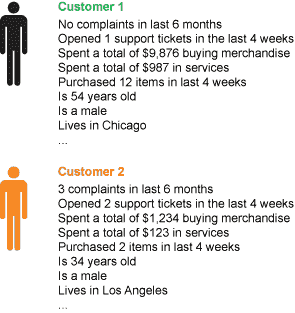

# 什么是预测分析？

> 原文：[`developer.ibm.com/zh/articles/ba-predictive-analytics1/`](https://developer.ibm.com/zh/articles/ba-predictive-analytics1/)

## 关于本系列

本文是有关预测分析的 4 部分系列文章中的第 1 部分。第 1 部分对预测分析进行了总体概述。第 2 部分将重点介绍预测建模技术，这些技术是构成预测分析的核心内容的数学算法。第 3 部分将介绍这些技术的实际应用并描述预测解决方案的构建过程。最后，第 4 部分将重点介绍预测分析的部署，也就是将预测解决方案投入使用的过程。

## 分析简介

如今，我们生活在一个不断扩大的数据海洋中。为了在其中安全地徜徉，我们使用分析。没有分析，我们就会淹没其中，无法真正了解发生了什么或将会发生什么。在本文中，我们重点介绍从分析获取的知识，这些知识可分为描述性或预测性两类。描述性分析使我们能够知道过去发生了什么，而预测性分析专注于接下来将发生什么。

我们对了解过去的事件的需求催生了一门新学科，我们现在称之为 *商业智能* 。该学科使我们能够基于从历史数据获取的统计信息来制定决策。例如：

1.  由于过去 6 个星期内的裁员，有多少客户已流失或脱离？
2.  由于过去 3 个月中存在的欺诈，损失了多少钱？
3.  创建支持票的频率有多高？
4.  客户位于何处（可能使用谷歌地图显示）？

描述性分析对基于事实（而不是感觉）而制定合理的业务决策大有帮助。但是描述性分析还不足够。在我们如今生活的社会中，至关重要的是决策必需高度准确且可重复。为此，公司正在使用预测分析来真正地探索未来，并在此过程中定义合理的业务决策和流程。

作为一门学科， *预测分析* 已存在了几十年。作为学术界中多年来的一个热门主题，随着从人员（例如从在线交易和社交网络）和传感器（例如从 GPS 移动设备）采集的数据量以及经济高效的处理能力（无论是基于云还是基于 Hadoop）的增长，预测分析在行业中的相关性也在不断增长。

## 数据驱动的知识与专家知识

一想起知识以及我们对知识的传递和使用就觉得趣味无穷。在传统上，我们依靠领域专家来帮助我们最有效地利用特定流程。专家知识基于经验，所有公司每天都使用专家知识来影响日常运营。因为我们可将专家知识转换为一组业务规则，所以构建了基于决策的系统来自动应用从人类专家获取的知识。IBM ILOG 是一个将专家知识转换为一组可立即应用的 IF-THEN 语句的系统的绝佳示例。

另一方面，顾名思义，数据驱动的知识基于数据（通常是大量数据）。几十年前诞生了一系列统计技术，意欲揭示人眼通常看不到的数据模式。考虑到我们如今捕获的数据量越来越大，这些技术经证明对从数据中提取价值，使流程可重复和准确不可或缺。

电影 *点球成金* 很好地体现了这一事实。在该影片中，一些经验丰富的招聘代理人提供了有关应吸引哪些选手加入团队的第一手知识和直觉。这与数据驱动的方法形成了鲜明的对比，在数据驱动的方法中会从每个选手的可用数据中提取知识，然后依据该知识组建一个团队。尽管 *点球成金* 优先选择了一种类型的知识，但在大多数情况下，我们确实应结合使用专家知识和数据驱动的知识。

分析能够生成合理的统计信息、预测和分数。但是，需要由一个基于规则的系统来确定使用所有这些数据驱动的知识做什么。例如，我们可使用一系列规则，依据一个预测模型获得的输出来触发业务决策。例如，如果有一个模型用于预测客户流失或脱离的风险，那么我们可以部署已知能减轻流失率的规则来代替依据不同的风险级别定义特定的业务决策。因此，如果风险很高，我们可为客户的下一次购买提供 20% 的折扣，但如果风险非常高，我们则可提供 50% 的折扣。

## 什么是预测模型？

预测模型简单来讲是一个数学函数，它能够获悉一组输入数据变量（通常绑定到一个记录）与一个响应或目标变量之间的映射关系。

我们将这种学习称为 *监督式学习* ，因为在培训期间，数据会提供给一个具有输入数据和期望输出或结果的预测模型。培训会反复进行，直到该模型获悉了给定输入与期望输出之间的映射关系为止。使用监督式学习的预测模型示例包括反向神经网络、支持矢量机和决策树。预测模型也可使用非监督式学习。在这种情况下，仅为预测模型提供输入数据。然后，预测模型的任务是确定不同的输入数据记录彼此之间的关联。集群是最常用的预测模型类型，使用的是非监督式学习。

例如，试想一下您希望创建一个预测模型，该模型将能够确定您的哪位客户最可能流失（为这些人提供 20% 还是 50% 的折扣？）。首先返回到历史数据中，搜索可用于构建一个模型来实现此目标的特性。通过查看数据库，您能够为现有客户和已流失的过去的客户编制一个裁员相关特性的列表。该列表可能包含前 6 个月的投诉数量、前 4 个星期中公开的支持票数量、客户花钱购买商品或服务（在线或在店内）的频率和所花的金额，以及年龄、性别和人口统计等一般信息。 两个客户及其各自的输入特性 显示了两个这样的客户和所获取的其中每位客户的特性。客户 1 是一个现有客户且似乎很满意。但是客户 2 已流失。

##### 图 1.两个客户及其各自的输入特性

在监督式学习场景类型中，如 在培训期间向一个预测模型提供由输入特性和结果组成的客户数据 中所示，您在培训期间将所有客户数据提供给一项预测技术。在此情况下，输入就包括您为每位客户准备的所有特性（满意度相关特性、人口统计等）以及相关结果。该结果向预测模型表明，数据记录代表一位已流失还是未流失的客户。这里的理由是该模型能够学习两个群体（现有的满意客户和已脱离的客户）之间的区别或模式。

##### 图 2.在培训期间向一个预测模型提供由输入特性和结果组成的客户数据

构建预测模型之后，我们需要进行验证。验证尝试回答的问题有两个：”预测模型有效吗？” 和如果有效，”预测模型有多准确？” 如果第一个问题的答案是 *有效* 且第二个问题的答案是 *高度准确* ，那么您就知道该模型有效，且能够很好地推广。您现在需要做的事就是使该模型可用于执行。为此，预测模型需要进行操作部署。所幸，有一个名为 PMML（Predictive Model Markup Language，预测模型标记语言）的标准使预测模型能够在不同系统之间轻松迁移。借助 PMML，我们可使用 IBM SPSS Statistics 等应用程序构建和验证一个预测模型，然后再将该模型保存为一个 PMML 文件。这样，我们可将该模型直接上传到一个评分引擎（比如 Zementis ADAPA 引擎）以供实时使用。有关 PMML 和这里描述的技术的更多信息，请参阅 参考资料 。

部署之后，我们可使用流失模型监视所有现有的客户活动。良好的预测模型能够归纳其知识来计算流失风险，甚至对于以前未遇到过的客户也是如此。 图 3 显示了为我们的流失模型提供这样一位客户的数据（表示为客户 3）。如果该模型认识到一位特定的客户正在出现一种流失模式，它将相应地增加风险或输出，直到您制定了一项业务决策来解决这个问题为止。当该特定客户再次对您的产品和服务满意时，风险就会减小，这是因为没有再检测到该流失模式。

##### 图 3.当进行操作部署时，新创建的流失模型用于对新客户和现有客户评分，以计算每位客户的流失风险分数。如果检测到高流失风险，可采取措施来减轻该风险。

## 良好数据的重要性

在命名本节内容时，我的第一个念头是将它称为 “数据的重要性”，因为没有数据，就没有分析，就此而言也就没有预测分析。在作为数据挖掘科学家的职业生涯中，我看到许多出于好意的业务人员在为其公司寻找预测分析解决方案。尽管他们知道预测分析可帮助提高其利润，但苦于所拥有的数据不够。也就是说，没有足够的数据可供数据科学家实际培训一个有意义的模型。在大数据时代，您可能对这一情况发生的频率感到惊讶。因为某些预测模型能够学习和推广，所以会获取成千上万条记录。根据我们上面的示例，100 多条包含过去流失的客户数据的记录可能并不够。如果没有将足够的数据用于培训，模型可能无法学习，更糟的是，模型可能出现过度拟合。这意味着模型在培训期间学习给定数据的所有信息，但是无法将该知识推广到新数据上。简单来讲就是无法预测。

如果有足够的数据，下一个问题就是数据有多好。这是因为，数据的质量直接反映出模型的质量。说得婉转一点：无用输入，无用输出！

多年以前，我和我的团队接到一项任务，就是构建一个模型来预测某个制造流程会成功还是失败。该制造流程的完成花了大约 8 小时且使用了大量资源。只有在完成后，公司的质量保证工程师才能够确定制造过程中是否出错。如果出错，整个批次必须废弃，并从头开始一个新的流程。这里的理念是，我们可查看过去获得的变好和变坏的各个批次的所有流程阶段的数据。然后，我们可培训一个模型，以在流程的早期阶段检测事情何时开始变遭。尽管这个想法令人兴奋，但我们从未实际构建过任何模型。在数据分析期间，我们发现数据是损坏的，或者更糟的是缺少一些关键的制造阶段。更重要的是，我们无法找到结果，或者能够使我们将好批次与坏批次分开的信息。这意味着我们将无法使用监督式学习技术。而且，输入数据的重要部分的缺失危及了非监督式技术的使用。

数据本身不会转换为预测性的值。但好数据可以做到。

## 预测分析的应用

当第一次学习预测分析时，我收到了 Duda、Hart 和 Stock 编写的一本名为 *Pattern Classification* 的图书（参见 参考资料 ）。这本书现在被视为是这一领域的经典参考文献。作者在书中围绕一个鱼品加工厂构建了一个模式分类系统。在这个工厂中，他们使用一个预测解决方案，依据鳞片的长度和密度将运来的鱼分类为鲑鱼或黑鲈。在 2010 年，我在圣何塞的 Rules Fest Conference 上做了一次有关预测分析的演讲。在这个题为 “Follow your Rules, but listen to your Data” 的演讲中（参见 参考资料 ），我使用了同一个示例来向专注于规则的观众展示了如何使用预测分析解决此类问题，以及如何结合使用预测分析与业务规则来改善决策制定。我的想法显然是以一种与 Duda、Hart 和 Stock 类似的方式使用该示例。也就是说，作为如何构建和应用一个预测解决方案，并让观众将该模型推广到其他应用的一般示例。在本文中，我使用了客户流失。不管怎样，您会将目前获得的知识推广到大量新应用中，我将在下面介绍预测分析将我们的世界转换为智慧地球的更多方式。

预测分析在多年以来极其成功的一种应用是欺诈检测。当您每次刷信用卡或在线使用时，都有可能对您的交易进行实时分析来检测出受到欺诈的可能性。根据能感知到的风险，许多机构实现了一组甚至可能拒绝高风险交易的业务规则。这是预测分析在对抗犯罪的过程中的最终目标，也就是从源头预防犯罪的发生。

在之前为 developerWorks 撰写的一篇文章中，我列出了预测分析在医疗保险行业的一些重要应用。医疗保险欺诈肯定位于欺诈列表顶端，但使用预测分析可以实现有效的预防性治疗。通过知道哪些患者具有发生某种疾病的更高风险，我们可制定预防措施来减轻风险，并最终挽救生命。近来，预测分析已是一次高知名度医疗竞赛上关注的焦点，其中历史索赔数据用于减少再次入院次数（参见 参考资料 ）。

此外，公司使用预测分析推荐产品和服务。目前，我们已发展为从最喜爱的店铺和商家来预测优秀的影片、图书和歌曲推荐。出于同样的原因，我们还根据电子邮件、在线帖子和搜索等内容遇到了越来越适合我们的品味和偏好的营销活动。

其他应用专注于从传感器获取的数据。例如，我们可使用 GPS 移动设备数据来预测交通状况。随着这些系统变得越来越精确，我们将能够使用它们来修改我们的出行选择。例如，我们可在预计公路完全被汽车堵塞时乘坐火车。

此外，报告桥梁和建筑物等结构，以及能量转换器、水泵和气泵、闸门和阀门的当前状态的小型且经济高效的传感器的存在，也支持使用预测分析来维护和更改材料或流程，以预防发生欺诈和事故。通过支持构建预测维护模型，使用来自传感器的数据是帮助确保安全的一种明确方式。2010 年墨西哥湾的溢油灾难和 2007 年 I-35W 密西西比河大桥的坍塌，仅是可在部署了传感器和预测维护模型后能够预防的重大事故的两个示例。

## 结束语

在从人员和传感器收集的不断扩大的数据海洋中，预测分析为公司和个人提供了不可或缺的导航工具，从而使他们成功实现目标。预测分析通过预测即将发生的事情，以便人们可以做出适当的应对，从而保持最准确、安全、可重复、可盈利且高效的发展。

预测分析的使用已彻底变革了我们与环境交互的方式。随着数据量的增加和质量改进，以及辅以经济高效的处理能力的可用性，预测分析必定会比目前更加流行。如果您已发现了一些计划使用预测分析解决的问题，您肯定会同意做出这种预测相当容易。

本文翻译自：[What is predictive analytics?](https://developer.ibm.com/articles/ba-predictive-analytics1/)（2013-02-26）