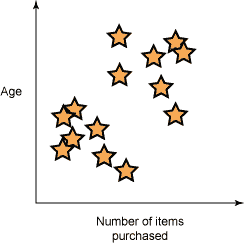
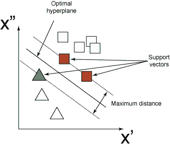
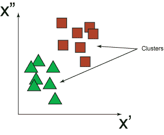
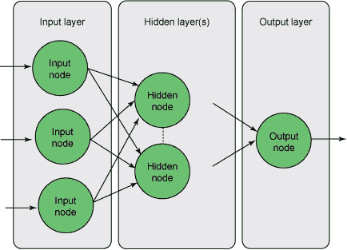
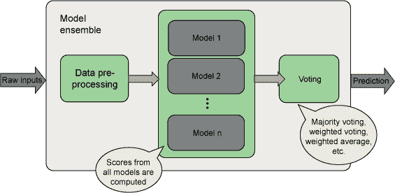
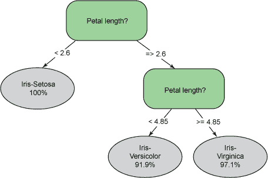

# 预测建模技术

> 原文：[`developer.ibm.com/zh/articles/ba-predictive-analytics2/`](https://developer.ibm.com/zh/articles/ba-predictive-analytics2/)

## 简介

在整个社会范围内，数据正在呈现指数级增长。IBM 指出，如今 90% 的数据都是在过去两年内产生的。幸运的是，有许多预测建模技术都可用于将这些数据转换为洞察和价值，这些技术包括神经网络 (NN)、集群、支持向量机 (SVM) 和关联规则。这些技术是通过学习大量历史数据中隐含的模式来实现这一点的。完成学习后，将生成一个预测模型。对模型进行验证后，就意味着该模型能够归纳所学习的知识并将归纳结果应用到新的情景中。由于预测建模技术可以学习过去并根据学习结果预测未来，因此可用于解决各种问题，如推荐系统、欺诈和滥用检测，以及疾病和事故预防。”大数据” 技术和经济高效的处理功能的出现正在将数据驱动的预测性技术扩展到不同行业中。在这个过程中，精妙的数学应用正在帮助越来越多的企业实现企业数据的真正潜力。

世界各地的公司和个人正在使用预测分析从通过人员和传感器获得的历史数据中提取价值。人员数据包括结构化客户交易（例如，来自在线采购）或从社交媒体获得的非结构化数据。另一方面，传感器数据来自各种用于监视道路、桥梁、楼宇、机器、电网以及大气和气候的设备。在本文中，我们将重点介绍预测建模技术。这些技术都是一些数学算法，用于 “学习” 所有这些数据中隐含的模式。

构建完一个预测模型并进行验证后，该模型将能够对从历史数据中学到的知识进行概括并用于预测未来。例如，通过这种方法可以根据人员数据预测客户流失或背离的风险，或者根据传感器数据预测机器故障的风险。诸如此类的模型可以通过实现某种回归函数来计算评分或风险。预测模型还可用于实现分类函数，这种函数将产生一个类别或分类。

不管使用何种模型类型，有一点是肯定的：不管我们去哪里和干什么，预测模型已经能够对我们的经验进行归纳。根据人们对某种特定疾病的敏感性，预测模型还可帮助医疗供应商设计和实现预防性的救护措施。

## 预测模型的诞生

只要将数据用于培训某种预测建模技术，都会生成预测模型。更正式的解释是 “数据 + 预测建模技术 = 模型”。

预测模型就是将数据与数学应用结合在一起，其中，对数据的学习可以转换为一组输入数据字段与某个响应或目标变量之间的映射函数。

要构建一个预测模型，首先需要整理将要用于培训的数据集。要实现这个目的，举例而言，需要将一组表示某位客户的输入字段汇集为一条记录。该记录可能包含某些特性，如年龄、性别、邮政编码、最近六个月购买的商品数和退货的商品数，同时还包括一个目标变量，用于通知我们该客户在过去是否流失。然后，可以将一个客户记录通过数学方法描述为多维特性空间内的一个向量，这是因为需要使用多个特性来定义类型客户的对象。当将所有客户记录汇总到一块时，将成为包含数百万条记录的数据集。 图 1 显示了一些输入向量或客户对象的二维表示（使用 “年龄” 和 “购买的商品数” 特性）。

##### 图 1.输入向量的二维表示，每个向量或客户对象使用一个黄色星星表示

预测建模技术允许构建准确的预测模型，前提是有足够的数据可用并且数据质量良好。无论预测技术有多么高超，但不良数据总会产生不好的模型。因此可以这样说：”无用输入导致无用输出”。

## 常见的预测建模技术

如今，有多种预测技术可用于构建模型。不同的系统和供应商支持不同的技术，但是大约有 6 种技术受到大多数商业或开源模型构建环境的支持。尽管有些技术专门解决特定的一类问题，但是还有些技术是通用的，可用于广泛的应用程序。例如，支持向量机 (SVM) 就是其中一种。

SVM 将输入数据映射到一个更高的维度空间，在该空间中将构建一个用于分离数据的 “最优超平面”。在这个超平面的每个面上将构建两个并行超平面。 2 显示了一个示例，在该示例中使用一个最优超平面分离了两个数据类别（三角形和正方形）。最优分离超面可以最大化两个并行超平面之间的距离。这两个超平面之间的距离越大，模型的准确度就越高。两个并行超平面中定义最大距离的平面上的数据点称为支持向量。

##### 图 2.分离数据和支持向量的最优超平面的二维视图

尽管数学原理不尽相同，但是 SVM，以及 NN 和逻辑回归模型都是非常强大的泛型技术，可以生成有点类似的效果。决策树是另一种泛型预测建模技术，因其能够解释输出背后的基本原理而脱颖而出。由于使用简单、易于理解，因此决策树是最常用的预测建模技术。

另一方面，当目标或响应变量不重要或不可用时，集群技术则是一种比较流行的技术。顾名思义，集群技术能够根据输入数据的相似性对其进行分群。在 图 3 显示的示例中，输入数据被分为两个集群。第一个集群中的数据使用绿色三角形描述，第二个集群中的数据则使用红色方块描述。

##### 图 3.将一组输入数据分为两个集群的二维视图：绿色三角形和红色方块

如果目标变量或相似性度量并不重要，但是输入内容之间的关联很重要，那么可以使用一种称为关联规则的技术来进行查找。例如，可以使用关联规则发现哪些人同时购买了纸尿片、牛奶和啤酒。

尽管所有预测技术各有优缺点，但模型的精确度很大程度上取决于原始输入数据和用于培训预测模型的各种特性。如上所述，模型构建涉及大量数据分析和消息传递工作。通常，需要从数百个可用的原始数据字段中选择一个数据子集，然后需要对字段进行预处理后再呈现给预测建模技术。使用这种方式时，实现出色的预测模型的秘诀取决于良好的消息传递和用于培训模型的技术。这并不代表预测技术无关紧要。如果采用了不恰当的技术，或者选用了不合适的输入参数，那么再好的数据也于事无补。

例如，NN 可以有多种形式。选择合适的网络结构对于构建良好的预测模型十分重要。如 图 4 所示，前馈 NN 由一个输入层和一个输出层组成，在输入层中，考虑使用多少个输入字段和特性，就会出现多少个节点。如果存在一个回归函数，那么输出层则由一个表示预测字段的单一节点组成。但是，在输入层和输出层之间，神经网络可以配置任意数量的隐含层和节点。问题是，如果您选择为 NN 分配非常少的隐藏节点，那么可能无法获悉输入字段和目标之间的映射函数。如果分配太多的隐含节点，那么将会出现过剩，也就是说，NN 将获悉全部的输入数据，但是无法预测未来事件。

##### 图 4.带有输入、隐含和输出层的前馈神经网络

集群技术要求在培训之前提供集群的数量。对于这种情况，如果集群的数量很小，那么模型可能会丢失输入数据中的重要差异，这是因为集群必须将不同的数据存储在一起。另一方面，如果集群数量十分庞大，那么可能会错失一些重要的相似信息。在 图 3 所示的示例中，集群的数量设置为 3（而不是 2），这将创建一个额外的集群，但可能掩盖数据（黄色三角形或紫色正方形）的真实性质。

同时使用不同的建模技术也可令预测模型受益。这是因为许多模型可以结合在一起，这种方法称为模型组合（ 图 5 ）。通过这种方式，组合后的结果将可以利用不同模型和技术所固有的各种优势。

##### 图 5.模型组合的图形表示：计算所有模型的分数，并通过投票机制或平均值确定最终的预测结果

## 监督式与非监督式学习

SVM、决策树、NN 和回归模型使用了监督式学习 (supervised learning) 来创建输入数据字段集和目标变量之间的映射函数。获得的学习结果随后充当教师的角色，监督学生的学习情况。当学生犯错时，教师为其提供正确的答案，期望学生能够最终学习到正确的知识。例如，当提供了一组特定的输入时，学生的输出将与目标匹配。

例如，考虑培训一个 NN（如 图 4 所示），用来预测由于人员缩减而导致的客户流失或背离。首先，我们将一组输入数据字段划分在一起，这些字段表示过去流失的一名特定客户。这组数据字段可能包括年龄、性别和与满意度有关的特性（如投诉次数）。这名客户现在表示为一组数据字段和客户流失结果，这些内容随后呈现给 NN 以供学习。这些数据可能会呈现多次，直到 NN 能够学习输入数据和目标之间的关系为止。然而，并不是只有这一名客户。该客户是众多客户中的一员。将对所有客户（包括已流失客户和未流失客户）重复这一过程。要了解两个潜在结果之间的差别，NN 需要为流失客户和未流失客户创建一个抽象表示。

一种用于前馈 NN 的著名学习算法称为反向传播 (back-propagation)。这种算法允许通过网络将错误或目标和输出之间的差异向后传播，随后使用网络调整链接网络节点的突触权重 (synapse weight)。通过这种方式，网络将能够学习当前的任务（虽然进度非常小）。但是如果缺乏目标，那么这个过程将不具备可行性。

非监督式学习 (Unsupervised learning) 不需要教师或目标。集群技术就属于这一范畴。如 图 3 所示，数据点根据其相似程度被简单地划分在一起。如果出现客户流失，集群技术可以将不同集群指定为流失客户和非流失客户，即使结果在模型培训期间不可用也是如此。

## 黑箱分析法

黑箱一词用于识别某些无法解释其推理的预测建模技术。尽管功能十分强大，但诸如 NN 和 SVM 之类的技术都属于这一范畴。考虑我们的高度准确的 NN 模型，培训该模型是为了区别非流失客户与流失客户。如果输出表明某个客户极有可能流失，那么该模型将无法向我们解释原因。这就产生了一个重要的问题：预测模型是否应当能够解释其推理？答案可能是 “视情况而定”。如果预测模型产生的风险用于触发某个不利的行为，那么通常希望提供原因，在某些情况下甚至必须要求进行解释。例如，当风险评分用于拒绝贷款申请或信用卡交易时。

对于要求提供解释的情况，您需要考虑使用一种能够清晰指出决策理由的预测建模技术。记分卡就非常适合这种情况。记分卡基于回归模型，是金融业常用的一种风险评估技术。通过使用记分卡，输入记录中的所有数据字段都与特定的原因代码相关联。在处理期间，将根据一个基线风险评分对数据字段进行加权。当找出对最终输出影响最大的字段后，与字段相关的原因代码将与输出一起返回。

和记分卡一样，决策树也十分易于解释和理解。在一个决策树中，整个决策过程使用一组可读的条件表示，即一组规则。当一组条件被评估为真时，即可达到决策树中的一个叶节点。 图 6 显示了一个决策树的图形表示，根据花瓣长度将鸢尾属植物划分为三个不同的类。目标类分别为：Iris-Setosa、Iris-Virginica 和 Iris-Versicolor。有关鸢尾属植物数据集的更多信息，请参阅 Asuncion A. & Newman D.J. (2007) 撰写的 UCI 机器学习库。欧文分校认证机构：美国加州大学信息与计算机科学学院（参见 参考资料 ）。注意，这个决策树可以使用一组规则表示。例如，要找出 Iris-Setosa 植物，规则可以简单表述为：”如果花瓣长度小于 2.6，那么该植物为 Iris-Setosa 的可能性为 1。”

##### 图 6.用于对鸢尾属植物分类的简单决策树。可能的类别包括：Iris-Setosa、Iris-Versicolor 和 Iris-Virginica

尽管难以解释使用黑箱建模技术生成决策的推理，然而这些模型本身应当易于理解。幸运的是，现在使用预测模型标记语言 (PMML) 可以很简单地表示数据预处理和预测模型。PMML 是所有顶级分析公司用来创建和使用预测解决方案的事实标准。就其本身而言，PMML 允许使用一个单一的标准格式表示本文提到的所有预测技术。一旦将预测模型表示为一个 PMML 文件后，就可以立即将该模型从科研人员的开发计算机上移到操作环境中，并在那里投入使用。这样，新的模型或任何对现有模型的更新都可以立即得到部署。作为一项所有人都可以理解的开放标准，PMML 不仅用作模型开发和部署系统之间的桥梁，还成为沟通公司内部分析流程涉及到的所有人员的桥梁。通过这种方式，PMML 确保实现透明性并可以传播知识和最佳实践。有关 PMML 的更多信息，请参见 参考资料 。

## 结束语

在不断扩大的数据海洋中，分析可以帮助我们在其中安全地航行。从人员和传感器收集的历史数据正在改变我们的世界，因为这些数据可用来构建可以利用过去预测未来的模型。事实上，这些所谓的预测模型是将数学技术应用于数据的产物。

NN、SVM、决策树、线性和逻辑回归、集群、关联规则和记分卡是数据科学家目前最常用的预测建模技术，这些技术用于发现数据中隐含的模式。尽管这些技术能够对数据进行学习和归纳，但是它们需要大量的历史数据，不仅如此，它们还常常会消耗大量处理能力。因此，预测解决方案之所以能够在现如今的所有行业中蓬勃发展，主要得益于以下几个原因：1) 来自人员和传感器的大数据技术；2) 经济高效的处理平台，如基于云和基于 Hadoop 的平台；3) PMML，一个完善且成熟的开放标准，用于表示完整的预测解决方案。这三个因素结合起来生成了功能强大的模型，可以立即为任何规模的企业制定决策。

事实上，数据科学家正在致力于使用整个社会中收集到的数据构建预测解决方案。再结合巧妙的分析技术，这些数据为我们实现更加智能的世界提供了潜能，从而在这个世界中，可以真正地预防（而不仅仅是预测）犯罪、疾病和事故。

本文翻译自：[Predictive modeling techniques](https://developer.ibm.com/articles/ba-predictive-analytics2/)（2013-02-26）