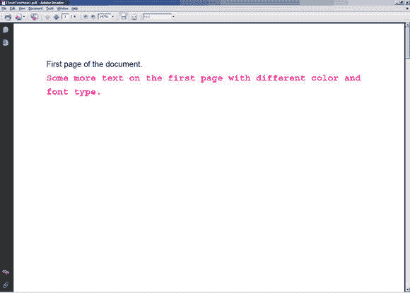
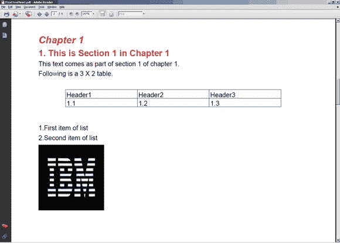
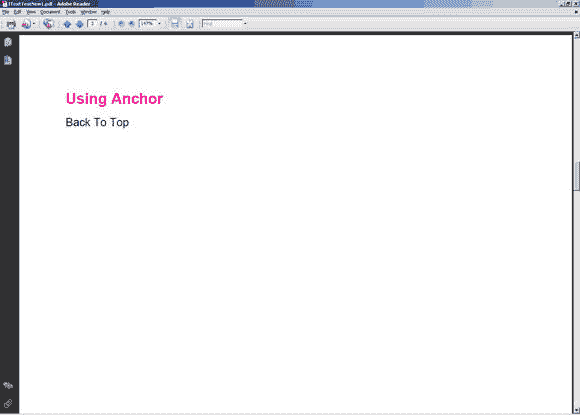

# 从 Java 应用程序动态生成 PDF 文件

> 原文：[`developer.ibm.com/zh/articles/os-javapdf/`](https://developer.ibm.com/zh/articles/os-javapdf/)

许多应用程序都要求动态生成 PDF 文档。这些应用程序涵盖从生成客户对帐单并通过电子邮件交付的银行到购买特定的图书章节并以 PDF 格式接收这些图书章节的读者。这个列表不胜枚举。在本文中，我们将使用 iText Java 库生成 PDF 文档。我们将向您演示一个样例应用程序，以便您可自行完成它并能更好地理解它。

## 熟悉 iText V5.3.0 版

iText 是一个可从 `http://itextpdf.com/` 免费获取的 Java 库（请参见 参考资料 ）。iText 库非常强大，且支持生成 HTML、RTF 和 XML 文档，还支持生成 PDF 文档。您可以选择各种各样的字体来用于文档中。另外，iText 的结构允许您使用相同代码生成上面提及的任何类型的文档。

iText 库包含使用各种字体生成 PDF 文本、在 PDF 文档中生成表格、向页面中添加水印等的类。iText 还提供了其他许多特性。在一篇文章中无法演示所有这些特性。我们将介绍生成 PDF 所需的基本知识。有关更多详细信息，请参阅供应商提供的文档（参见 参考资料 ）。

我们将使用 Eclipse 开发我们的样例应用程序。作为一个开源 IDE，Eclipse 可免费获取且非常强大。您可立即下载 Eclipse（参见 参考资料 ）。

## iText API：详细了解

com.itextpdf.text.Document 是用于生成 PDF 文档的主要类。这是第一个需要实例化的类。创建文档之后，您需要一个编写器来向其中写入信息。com.itextpdf.text.pdf.PdfWriter 是一个 PDF 编写器。下面提供了其他一些常用的类：

*   **com.itextpdf.text.Paragraph** ：此类表示一个缩进的段落。
*   **com.itextpdf.text.Chapter** ：此类表示 PDF 文档中的一章。使用 `Paragraph` 作为标题、 `int` 作为章节编号来创建该类。
*   **com.itextpdf.text.Font** ：此类包含一种字体的所有规范，比如字体集、字号、样式和颜色。各种字体都在此类中声明为静态常量。
*   **com.itextpdf.text.List** ：此类表示一个列表，反过来，该列表又包含许多 `ListItems` 。
*   **com.itextpdf.text.pdf.PDFPTable** ：这是一个表格，可放在一个绝对位置上，也可作为类 Table 添加到文档中。
*   **com.itextpdf.text.Anchor** ：一个 Anchor 可能是一个引用，或是一个引用的目标。

## 在 Eclipse 中下载和配置 iText

作为一个纯 Java 库，iText 以 JAR 文件的形式提供（参见 参考资料 ）。下载该库之后（假设下载到路径 C:\temp），使用以下步骤在 Eclipse 环境中配置 iText 库：

1.  在 Eclipse 中创建一个名为 iText 的新 Java 项目。
2.  右键单击 Package Explorer 视图中的 iText 项目，选择 **Properties** 。
3.  单击 **Java Build Path** 。在 Libraries 选项卡上，单击 **Add External JARs** 。
4.  找到 C:\temp 目录并选择此目录中的 itext-5.3.0.jar。
5.  单击 **OK** 。

iText 现在已配置，Eclipse 已准备好创建 Java 应用程序来生成动态的 PDF 文档。

## 样例应用程序

还有什么能比您亲自创建的一个有效样例能更好地演示任何技术呢？现在您已拥有所需的工具 (Eclipse IDE) 和库 (iText library)，我们已准备好设计和开发一个有效的样例程序。

首先创建一个简单的 PDF 文档，该文档包含一些基本元素，比如纯文本、具有非默认字体的彩色文本、表格、列表、章、节等。此应用程序的用途是让您熟悉使用 iText 库的方式。有许多类为您执行了与 PDF 文档生成相关的大量工作。本文不可能介绍所有这些类。iText 的 javadocs 是有关如何使用这些类的一个不错的信息来源。接下来我们开始编码。

第一步是创建一个文档。文档是一个 PDF 文档的所有元素的容器。

##### 清单 1\. 实例化文档对象

```
Document document = new Document(PageSize.A4, 50, 50, 50, 50); 
```

第一个参数是页面大小。接下来的几个参数分别是左边距、右边距、上边距和下边距。此文档的类型还未定义。它依赖于您创建的编写器类型。对于我们的样例，我们选择 com.itextpdf.text.pdf.PdfWriter。其他编写器包括 HtmlWriter、RtfWriter、XmlWriter 等。它们的名称说明了它们的实际用途。

##### 清单 2\. 创建 PdfWriter 对象

```
PdfWriter writer = PdfWriter.getInstance(document, \

new FileOutputStream("C:\\ITextTest.pdf"));

document.open(); 
```

第一个参数是文档对象的引用，第二个参数是输出将写入的文件的绝对名称。接下来，我们打开文档开始编写。

现在，我们将在文档的第一页上添加一些文本。任何文本都借助 com.itextpdf.text.Paragraph 来进行添加。您可使用您的文本以及字体、颜色、字号等默认设置创建一个默认段落。否则，您可提供自己的字体。 在本文中，我们还将讨论 PDF 文档的定位符（链接）。在此 PDF 中，我们使用 backToTop 作为链接。当单击 backToTop 链接时，它会将您带到文档的第一页。您需要将该文本设置为第一页的定位目标。让我们看看如何将定位目标和字体设置到所添加的段落中。

##### 清单 3\. 创建段落对象

```
Anchor anchorTarget = new Anchor("First page of the document.");
      anchorTarget.setName("BackToTop");
      Paragraph paragraph1 = new Paragraph();

      paragraph1.setSpacingBefore(50);

      paragraph1.add(anchorTarget);
      document.add(paragraph1);

document.add(new Paragraph("Some more text on the \

first page with different color and font type.",

FontFactory.getFont(FontFactory.COURIER, 14, Font.BOLD,    new CMYKColor(0, 255, 0, 0)))); 
```

图 1 显示了 清单 3 中的代码的样例输出。要关闭文档，将 `document.close();` 添加到清单 3 中的代码末尾。

##### 图 1\. 清单 3 中的代码的样例输出


您刚才看到了如何将纯文本添加到 PDF 文档中。接下来，我们需要向文档中添加一些复杂的元素。首先创建一个新章。章是一种特殊的节，它从一个新页开始且默认会显示一个编号。

##### 清单 4\. 创建章对象

```
Paragraph title1 = new Paragraph("Chapter 1",

   FontFactory.getFont(FontFactory.HELVETICA,

   18, Font.BOLDITALIC, new CMYKColor(0, 255, 255,17)));

Chapter chapter1 = new Chapter(title1, 1);

chapter1.setNumberDepth(0); 
```

在 清单 4 中的代码中，我们创建了一个新的章对象 `chapter1` ，它的标题为 “This is Chapter 1”。将编号深度设置为 **0** ，这样就不会在页面上显示章编号。

节是章的子元素。在 清单 5 中的代码中，我们创建一个标题为 “This is Section 1 in Chapter 1” 的节。要在此节下添加一些文本，我们创建了另一个段落对象 `someSectionText` ，并将它添加到节对象中。

##### 清单 5\. 创建节对象

```
Paragraph title11 = new Paragraph("This is Section 1 in Chapter 1",

       FontFactory.getFont(FontFactory.HELVETICA, 16, Font.BOLD,

       new CMYKColor(0, 255, 255,17)));

Section section1 = chapter1.addSection(title11);

Paragraph someSectionText = new Paragraph("This

text comes as part of section 1 of chapter 1.");

section1.add(someSectionText);

someSectionText = new Paragraph("Following is a 3 X 2 table.");

section1.add(someSectionText); 
```

在添加表格之前，让我们看看该文档的外观。添加以下两行代码以关闭 图 2 中的文档。然后编译和执行程序，以生成 PDF 文档： `document.add(chapter1);document.close();` 。

##### 图 2\. 章的样例输出


接下来，我们创建一个表格对象。一个表格包含一个行和列的矩阵。一行中的一个单元格可占据多于一列。类似地，一列中的一个单元格可占据多于一行。

##### 清单 6\. 创建表格对象

```
PdfPTable t = new PdfPTable(3);

      t.setSpacingBefore(25);

      t.setSpacingAfter(25);

      PdfPCell c1 = new PdfPCell(new Phrase("Header1"));

      t.addCell(c1);

      PdfPCell c2 = new PdfPCell(new Phrase("Header2"));

      t.addCell(c2);

      PdfPCell c3 = new PdfPCell(new Phrase("Header3"));

      t.addCell(c3);

      t.addCell("1.1");

      t.addCell("1.2");

      t.addCell("1.3");

      section1.add(t); 
```

在 清单 6 中的代码中，我们创建了一个 PDFPTable 对象 `t` ，它包含 3 列且在不断地添加行。接下来，我们创建 3 个 PDFPcell 对象，每个对象包含不同的文本。我们不断地将它们添加到表格中。它们会添加到第一行中，从第一列开始，移动到同一行中的下一列。该行完成后，将下一个单元格添加到下一行的第一列中。也可通过提供单元格的文本来将它添加到表格中，比如 `t.addCell("1.1");` 。最后，将表格对象添加到节对象中。

最后，让我们看看如何将一个列表添加到 PDF 文档中。列表包含多个 `ListItem` 。一个列表可带有编号，也可不带编号。将第一个参数作为 *true* 传送，表明您希望创建带编号的列表。

##### 清单 7\. 创建列表对象

```
List l = new List(true, false, 10);

l.add(new ListItem("First item of list"));

l.add(new ListItem("Second item of list"));

section1.add(l); 
```

我们已将所有内容都添加到 `chapter1` 对象中。现在我们将一个图像添加到该 Java 对象中。我们可使用以下一个 Image 方法缩放图像：

*   scaleAbsolute()
*   scaleAbsoluteWidth()
*   scaleAbsoluteHeight()
*   scalePercentage()
*   scaleToFit()

在 清单 8 中，我们使用了 scaleAbsolute。然后将图像对象添加到 Section 中。

##### 清单 8\. 将 Image 添加到主 Document 中

```
Image image2 = Image.getInstance("IBMLogo.bmp");

      image2.scaleAbsolute(120f, 120f);

      section1.add(image2); 
```

iText 中的 com.itextpdf.text.Anchor 类表示一个外部网站或文档内部的一个链接。定位符（链接）可像网页中的一个链接一样单击。要添加定位符，我们需要创建一个新定位符并将引用设置为 清单 3 中创建的 Anchor 目标。然后将定位符添加到节中，并将该节添加到文档中。

##### 清单 9\. 将定位符添加到主文档中

```
Paragraph title2 = new Paragraph("Using Anchor",

        FontFactory.getFont(FontFactory.HELVETICA, 16, Font.BOLD,

        new CMYKColor(0, 255, 0, 0)));

section1.add(title2);

title2.setSpacingBefore(5000);

Anchor anchor2 = new Anchor("Back To Top");

anchor2.setReference("#BackToTop");

section1.add(anchor2); 
```

没有需要添加到 `chapter1` 中的元素后，就该是将 `chapter1` 添加到主 `document` 中的时候了。在这里，当我们完成样例应用程序后，也将关闭文档对象。

##### 清单 10\. 将一章添加到主文档中

```
document.add(chapter1);

document.close(); 
```

## 运行样例应用程序

1.  下载样例应用程序 j-itextsample.jar（参见示例代码 ）。
2.  将 j-itextsample.jar 解压到一个目录中，举例而言，如果将它解压到 C:\temp 中，这会将源代码和类文件放在 C:\temp\com\itext\test 中。
3.  打开一个命令提示符，并将目录更改为 C:\temp。
4.  在此命令提示符上设置您的系统的类路径。将 `C:\temp\itext-5.3.0.jar` 包含在系统的类路径中。在 Windows® 上，执行命令 `set classpath=C:\temp\itext-5.3.0.jar;%classpath%` 。
5.  使用命令 `java com.itext.test.ITextTest` 运行应用程序。

该程序将在 C:\ 中生成 ITextTest.pdf 文档。 图 3 显示了 PDF 文档的第一页的屏幕截图。

##### 图 3\. PDF 文档的屏幕截图



图 4 显示了 PDF 文档中的第一章和它的节、文本、表格、列表和图像的屏幕截图。

##### 图 4\. PDF 文档的屏幕截图



图 5 显示了 PDF 文档中的 Anchor 链接的屏幕截图。

##### 图 5\. PDF 文档的屏幕截图



## 结束语

您已了解了生成 PDF 所涉及的一些基本元素。iText 的美妙之处在于，您可在不同类型的编写器中使用同一个元素的语法。另外，您可将编写器的输出重定向到控制台（对于 XML 和 HTML 编写器）、servlet 的输出流（对于对 PDF 文档的 Web 请求的响应）或任何其他类型的输出流。在响应相同、但响应类型各不相同（PDF、RTF、HTML 或 XML）的情形中，iText 也可派上用场。iText 允许您创建水印，加密文档以及其他输出细节。

## 下载示例代码

[os-javapdf-itextsample.jar](http://download.boulder.ibm.com/ibmdl/pub/software/dw/opensource/os-javapdf-itextsample.jar)