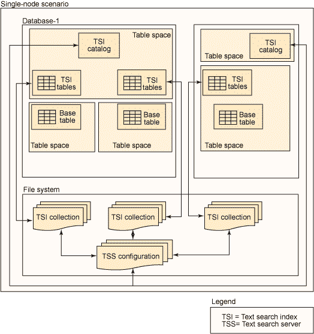
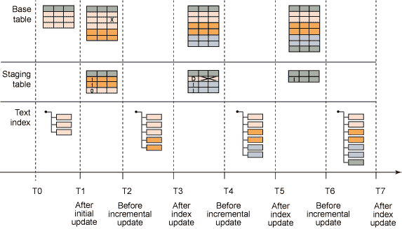

# 规划文本索引备份时的考虑事项

> 原文：[`developer.ibm.com/zh/articles/dm-1202db2textsearch/`](https://developer.ibm.com/zh/articles/dm-1202db2textsearch/)

| 免费下载： IBM® DB2® Express-C 9.7.2 免费版 或者 DB2® 9.7 for Linux®, UNIX®, and Windows® 试用版 |
| --- |
| 下载更多的 [IBM 软件试用版](http://www.ibm.com/developerworks/cn/downloads/) ，并加入 [IBM 软件下载与技术交流群组](https://www.ibm.com/developerworks/mydeveloperworks/groups/service/html/communityview?communityUuid=38997896-bb16-451a-aa97-189a27a3cd5a/?lang=zh) ，参与在线交流。 |

## 简介

文本搜索索引与数据库表紧密相连，但是通过文件系统上的文本搜索服务器进程来管理的。文本搜索服务器进程的运行独立于数据库服务器，因此文本搜索索引未包含在 DB2 备份和还原操作中。除了具有非常小的文本搜索索引的场景（这类场景可在还原数据库后轻松且迅速地重新创建），有必要手动同步 DB2 备份和文本搜索索引备份，以便能够在需要执行还原操作时获得一致的状态。如下图所示，这样一种同步需要考虑多种类型的数据。

##### 基本的单节点场景



涉及到以下对象：

*   数据库

    *   基础表：拥有文本搜索索引的数据库表。
    *   文本搜索索引表：文本搜索索引的临时表和事件表。
    *   文本搜索索引目录：DB2 Text Search 的管理表，包含文本搜索解决方案和每个文本搜索索引的元数据。
*   文件系统

    *   文本搜索索引集合：包含一个文本搜索索引的索引数据的文件（名称添加了实例和数据库名称作为前缀）；每个集合位于一个专用的目录中并由多个部分组成。
    *   TSS-Configuration：（已选择）…/db2tss/config 的内容

        *ciedem.dat：包含计划程序数据（每个数据库实例）* systemSettings.xml：列出现有的集合（每个数据库实例） *同义词字典* 配置文件

db2tss/logs 中的日志文件用于提供信息。它们不是系统恢复所必需的。基础表、文本搜索索引目录表和文本搜索索引管理表的分布在选择性备份和还原场景中关系最密切。

## 备份选项

DB2 提供了多种备份方法：

*   完整备份（在线或离线）
*   增量备份，包含子上一次完整备份以来的所有更改
*   Delta 备份，包含子上一次备份（任何类型）以来的所有更改
*   日志，包含子上一次备份以来执行的事务（从完整在线备份还原需要使用日志）

DB2 Backup 包含文本搜索索引目录数据和文本搜索索引管理数据。但是，实际的文本搜索索引集合内容未包含在内。文本搜索索引集合备份依赖于文件备份机制。例如，可以备份属于某个文本搜索索引集合的所有文件，或者仅备份具有最新时间戳的文件。请注意，文本搜索服务器没有提供在线备份选项来控制文本搜索索引的并行活动。因此，它必须明确确保在索引备份期间文本搜索索引上没有发生写操作。在一次备份中必须同步以下数据：

*   每个索引

    *   DB2

        *拥有文本搜索索引的数据库表* 文本搜索索引的临时表

        ```
         **备注：** 事件表包含历史数据，它们的内容对在恢复场景中同步基础表和文本搜索索引不是很重要，只需解决以前的文档错误即可。 
        ```

    *   文件系统

        *文本搜索索引的集合数据* 文本搜索索引元数据

*   每个数据库

    *   包含 DB2 Text Search 的元数据的目录表

        **备注：** 在还原操作后可能存在命令锁，必须明确删除这些锁才能继续执行常规处理

*   每个实例

    *   文件系统

        *计划程序数据* 文本搜索服务器元数据

对于集成的数据库和文本搜索索引备份解决方案，离线备份的优势在于：无需考虑涉及文本搜索数据的并行活动的争用方面。另一方面，在线备份的同步可能更复杂，但宕机时间更短。以下各节将介绍示例过程并讨论这些选项的细节。

### 离线备份的基本备份过程

使用以下步骤，通过 DB2 Text Search 索引备份数据库：

1.  获得 DB2 Text Search 索引的最新的文本搜索索引位置列表： `db2 "select indschema, indname, collectiondirectory, collectionnameprefix from sysibmts.tsindexes"` 。如果没有定义具体的位置，该集合将位于数据库实例路径中的默认位置处。
2.  确保没有 DB2 Text Search `UPDATE INDEX` 命令在运行。如果有必要，请执行以下操作：

    *   禁用计划的更新
    *   在文本搜索索引事件表中检查更新完成消息

    **备注：** 如果索引更新中断，所有未提交的工作将丢失，必须重复进行更新。这包括文本搜索服务器已提交工作，但数据库未处理完更新的情况。

3.  停止 DB2 Text Search 服务。如果数据库实例包含多个启用了文本搜索的数据库，请确保在停止文本搜索服务器之前，阻止了此实例中所有这类数据库中的文本搜索索引更新： `db2ts stop for text` 。参阅单独讨论如何减少宕机时间的章节。
4.  备份

    *   数据库

        *有关数据库备份方法和标准的进一步信息，请参阅 DB2 Information Center for Linux, UNIX, and Windows。

    *   第 1 步中使用您首选的文件备份方法所确定的文本搜索索引位置。

        *明确包含任何同义词词典，如果不在 the db2tss/config 目录中。

    *   配置目录

        *UNIX： `<instancedir> /sqllib/db2tss/config`* Windows： `<instancedatadir>\db2tss\config` ；默认位置为 C:\Documents and Settings\All Users\Application Data\IBM\DB2\DB2COPY1\DB2\db2tss\config

配置数据可在添加、调整或删除文本搜索索引时更改，或者通过 Configuration Tool 以变更的形式完成更改。 *可选：文本搜索服务器日志目录（仅用于保留历史，而与文本搜索索引数据无关）

```
 * UNIX： `<instancedir>/sqllib/db2tss/log`
    * Windows： `< instancedatadir >\db2tss\log` 
```

5.重新启动 DB2 Text Search 服务： `db2ts start for text`

上面的过程依赖于一个组合的数据库和文本搜索索引备份。但是，每次更新后都备份文本搜索索引的做法通常是行不通的，因此，有必要采取进一步的步骤，在增量更新后实现同步。

## 合并增量更新

文本搜索索引使用一个异步更新流程更新。在处理来自基础表的数据的初始更新之后，所有后续更改都会捕获到一个临时表中，并使用一个增量更新进行处理。临时表会通过 DB2 备份命令与基础表一起备份。下图演示了一些场景，其中的数据库备份和文本搜索索引备份可以是同步的，或者在不同时间执行。

##### 使用更新更改基础表和临时表



如图 2 所示，没有进一步的同步措施，如果向一个文本搜索索引应用了文本搜索索引更新而没有相应的文本搜索索引备份，增量更新可能导致还原场景中的不一致。例如，如果数据库备份和文本搜索索引备份在 T0 完成，另一个数据库备份在 T4 完成，那么在 T2 执行的文本搜索索引更新会删除临时表条目，而且只有在 T3 之后完成的新更改可用。一个希望到达 T5 且具有前滚的还原将失去以前处理的条目。以下选项可用于处理这样一种场景：

1.  仅还原而没有前滚，并确保数据库和文本搜索索引备份是匹配的
2.  在每次文本搜索索引更新之后立即备份文本搜索索引
3.  在运行索引更新之前保存临时表内容，或者创建一个影像临时表来保留已应用到文本搜索索引的临时条目，直到文本索引已备份。

就像选项 1 中一样，要求仅执行还原操作，无需使用数据库事务日志，这会严格限制恢复场景的选项。因此，这里不会进一步考虑使用它。

在每个文本搜索索引更新中包含一个文本搜索索引备份，这是一个适合小型索引或低频率更新的选项，例如，如果文本搜索索引一天仅更新一次，则可能在文本搜索索引更新完成时立即备份它。

对于高频率增量更新或大型文本搜索索引文件大小，常常无法在每次更新时立即备份文本搜索索引。相反，需要采取一种方法来同步基础表和它的文本搜索索引。类似的方法是将临时表内容附加到一个文件中，并在必要时重新加载文件内容。该副本必须在每次索引更新时备份，并可在下一次索引备份时清除。另一个选项是创建一个影像临时表来保留已处理的条目，直到不再需要它们。例如，在当前更新流程从临时表删除已处理的条目时，文本搜索索引的临时表上的一个删除触发器会将这些条目复制到影像表中。如果需要执行一次还原，影像表的内容会添加回临时表中，下一次增量索引更新将再次处理这些条目。影像表可在每次备份文本搜索索引之后清除。

## 备份场景

### 在线备份

`online` 选项控制备份表是否可用于某些更新。在线数据库备份可能导致与一个文本搜索索引更新发生争用。但是，这种争用与其他具有长期运行的任务的数据库应用程序没什么不同。争用场景中会发生什么？

1.  在线备份会锁定文本搜索索引更新所需的一个表。在这种情况下，文本搜索索引更新会失败并必须重新启动。
2.  在线备份成功完成并备份了临时表内容的一部分，这部分内容然后会在文本搜索索引更新中删除。在这种情况下，还原此状态将导致重新执行以前处理过的文本搜索索引更新（即影响仅限于更长的处理时间）。在重新处理一个删除的文档时，可能会发生与丢失文档相关的文档错误，这些错误可忽略。
3.  由于与并行索引更新发生某种访问争用，在线备份会失败。尽管这很少见，但为了减少争用数据库资源访问权限的风险和后续失败，请避免并行计划在线数据库备份和文本搜索索引更新。

### 选择性备份

对于 9.5 和 9.7 中支持的未分区的全文本搜索设置，如果指定明确的表空间，则会在与基础数据表相同的表空间中创建文本搜索索引的临时表和事件表。如果需要对表空间执行选择性备份（或在以后还原），那么确保一起备份了基础表和临时表很重要。这暗示着，如果多个临时表位于同一个表空间中，则必须备份所有相关的基础表。例如，如果 BaseTable1 在 TableSpace1 中，BaseTable2 在 TableSpace2 中，并且 TextIndex1（在 BaseTable1 上）和 Textindex2（在 BaseTable2 上）的临时表在 TableSpace3 上，那么所有 3 个表空间都必须一起备份。

另一个方面是文本搜索索引目录，该目录默认情况下位于 Userspace1 表空间中。要避免错误匹配，则有必要在创建或丢弃文本搜索索引之后使用非选择性备份（完整、增量或 delta 备份）。选择性还原还可能导致文本搜索索引目录包含文本搜索索引的元数据情况，但选择性还原不包含相应的管理表。如果一个文本搜索索引被丢弃，但选择性还原还原这个文本搜索索引的管理表，它们将持久化。出于这些原因，如果文本搜索索引受到了映像，不建议采用选择性备份或还原。

## 恢复场景

### 基本恢复过程

对于基本的恢复过程，可使用以下步骤来还原数据库和文本搜索索引：

1.  确保没有运行任何 DB2 Text Search 管理命令。
2.  停止 DB2 Text Search 服务： `db2ts stop for text` 。
3.  将数据库和文本搜索索引位置（文本搜索索引和元数据）的备份还原到以前的路径。
4.  重新启动 DB2 Text Search 服务： `db2ts start for text` 。

如果匹配的数据库和文本搜索索引备份可用，则适合使用此基本过程。以下是其他常见恢复场景的一些考虑因素。

### 具有前向恢复的还原

基础表的更改捕获在文本搜索索引的临时表中。临时表的内容反映了还未应用到文本搜索索引的更改。如果临时表与基础表一起备份，并且在以后与基础表一起还原，那么基础表和临时表包含前滚恢复点的最新内容。在下一次索引更新后，文本搜索索引仅在以下情况匹配基础表内容：

*   在数据库备份操作和前滚恢复点之间没有应用索引更新
*   或者在索引更新后执行了一次新的文本搜索索引备份，并且使用了前滚恢复点之前的最新备份

用于恢复的文本搜索索引备份的时间戳必须在最新的文本搜索索引更新之后，或者如果一个影像临时表可用，必须包含影像临时表中的条目涵盖的所有区间并位于前滚恢复点之前。

不要使用具有比前滚恢复点更新的时间戳的文本搜索索引备份。在这种情况下，文本搜索索引可能包含在数据库中没有匹配值的数据，或者可能丢失还原到基础表的数据。这些条目将不会在下一次索引更新时更新，因为不再有相应的临时表条目，即使使用了影像表。

### 没有前向恢复的还原

与具有前向恢复的更一般的场景的区别仅在恢复点本身上。否则，相同的基本原则适用于基础表、临时表和文本搜索索引之间的关系。

### 从增量备份或 delta 备份还原

增量备份所花的时间比完整备份少，是一种常用的数据库备份功能。如果文本搜索索引在每次文本搜索索引更新后备份：

*   应用完整数据库备份
*   应用增量 (delta) 数据库备份
*   从具有在上次增量数据库备份之前的最新时间戳的索引备份还原文本搜索索引
*   运行索引更新

如果在上次完整备份与增量备份之间对文本搜索索引应用了索引更新，那么触发文本搜索索引更新的临时表条目将丢失。对于这种场景，可使用之前讨论的一致性选项。

### 还原到目标数据库

不支持将具有活动文本搜索索引的数据库还原到一个不同的目标数据库，因为一个一致状态的依赖关系会为任何文本搜索索引位置使用相同数据库实例名称、相同的数据库名称、相同的文本搜索服务器配置和相同的文件系统结构。其他情况会导致不一致性。例如：

*   如果启用了目标数据库并存在索引，现有的目录数据可能会被过度写入，以至于现有的文本搜索索引无法访问或不可用。
*   如果文本搜索索引位置受到了影响，则需要使用文本搜索索引目录更新。
*   集合的文件名由实例名称、数据库名称和集合名称构成。如果数据库名称更改，那么尝试访问该集合就会丢失相应的文件。

### 恢复示例

从文本搜索索引的角度讲，恢复场景中最重要的是同步 3 个参与者的数据库表、临时表和文本搜索索引。使用图 3 中的插图，以下是一些典型场景。

##### 示例备份时间轴


在 T1、T4、T5 和 T7 应用了一个数据库备份，在 T1、T3 和 T7 应用了一个文本搜索索引备份。数据库事务会持续发生。请注意，数据库备份是否是增量备份并不重要，重要的是使用（或不使用）事务日志。还原到时间轴：

*   T1 — 数据库和文本搜索索引更新匹配，文本搜索索引是最新的，无需向文本搜索索引应用任何更改。
*   T2 — 临时表捕获到了必须应用到基础表的更改。结合使用 T1 处能前滚恢复到 T2 的数据库备份和 T1 处的文本搜索索引备份，仅需要一个文本搜索索引更新即可匹配数据库和文本搜索索引内容。
*   T3 — 来自 T3 的文本索引备份必须与来自 T1 的数据库备份结合使用，包括前滚恢复到 T3 以实现一致的状态。
*   T4 — 临时表包含将在 T3 处执行的文本索引备份更新到时间轴 T4 所需的更改。
*   T5 — 必须保存 T3 和 T5 之间的临时表更改，才能实现一种一致的状态。
*   T6 — 与 T5 相同，因为对临时表的其他更改可通过 T5 处的数据库备份和将事务日志前滚到 T6 来获得。

## 多个数据库的场景

为每个数据库实例分配一个 Text Search 服务器。如果一个实例包含多个启用的数据库，那么将面临另外两个挑战：

*   如何处理实例级配置数据
*   如何尽量减少由于备份操作导致的宕机时间

### 实例级配置数据

如果数据与文本搜索服务器配置一起备份，并在以后与此配置数据一起还原，那么可能发生以下场景：

*   在备份和还原之间没有应用任何文本搜索服务器配置更改。
*   更改了文本搜索索引的计划。
*   丢弃或创建一个文本搜索索引。
*   使用 ConfigurationTool 更改了文本搜索服务器配置。

要最大程度地减少不一致性，请保留最新的文本搜索服务器配置。这将确保实例中其他启用的数据库不会受到影响。但是，需要采取相应的步骤，针对还原的数据库调整文本搜索服务器配置：

1.  删除 db2tss/config 中的文件 ciedem.dat。计划程序文件将使用启用的数据库中定义的计划自动重新创建。
2.  如果在备份和还原之间丢弃了一个文本搜索索引，新还原的数据库中的文本搜索目录数据将包含一个目录条目，而没有相应的文本搜索索引集合。丢弃文本搜索索引。
3.  如果在备份和还原之间创建了一个文本搜索索引，新还原的数据库中的文本搜索目录数据将丢失此索引的条目，但文本搜索索引集合仍存在于文本搜索服务器上。可以使用清除命令删除孤立的集合。

## 尽量减少备份的文本服务器宕机时间

成功的文本搜索索引备份的关键是，预防文本搜索索引上的不想要的操作。一个选项是关闭与实例关联的文本搜索服务器，像示例备份过程中指示的一样。但是，此选项意味着可能很长的宕机时间（尤其是在文本搜索服务器用于多个数据库时），可能导致文本搜索服务器无法关闭。

关闭文本搜索服务器的主要原因是预防对文本搜索索引文件的访问冲突。如果目标是备份特定的文本搜索索引，并且如果服务器可确保没有其他操作持有文本索引文件，则可以避免关闭服务器。避免执行手动管理任务（手动重组、添加同义词等）并确保没有为此文本索引运行文本搜索索引更新。使用 `ALTER INDEX` 命令将频率设置为 NONE 以删除计划，检查命令锁以确保没有索引更新正在执行。

## 结束语

为包含数据库和文件系统对象的文本索引规划一个全面的备份解决方案，对在恢复场景中实现一致的系统至关重要。请记住：

*   文本搜索索引未包含在数据库备份中。
*   至少在每个完整数据库备份中为文本搜索索引使用文件系统备份。
*   预防在任何索引备份期间对文本索引执行并发写入访问。
*   在每次更新后备份文本搜索索引，或者保存临时表内容的一个副本，直到下一个索引备份完成。

## Download

[Sample_Backup.zip](http://public.dhe.ibm.com/software/dw/data/dm-1202db2textsearch/Sample_Backup.zip): 简单的备份/还原示例

本文翻译自：[What to consider when planning text index backups](https://developer.ibm.com/articles/dm-1202db2textsearch/)（2012-03-26）