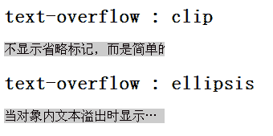
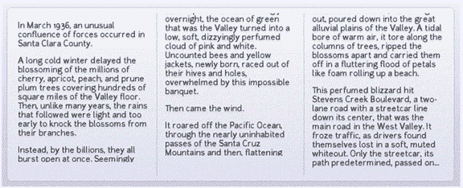
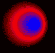
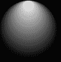
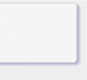
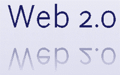

# 深入了解 CSS3 新特性

> 原文：[`developer.ibm.com/zh/articles/1202-zhouxiang-css3/`](https://developer.ibm.com/zh/articles/1202-zhouxiang-css3/)

## 简介

CSS 即层叠样式表（Cascading Stylesheet）。Web 开发中采用 CSS 技术，可以有效地控制页面的布局、字体、颜色、背景和其它效果。只需要一些简单的修改，就可以改变网页的外观和格式。CSS3 是 CSS 的升级版本，这套新标准提供了更加丰富且实用的规范，如：盒子模型、列表模块、超链接方式、语言模块、背景和边框、文字特效、多栏布局等等，目前有很多浏览器已经相继支持这项升级的规范，如：Firefox、Chrome、Safari、Opera 等等。在 Web 开发中采用 CSS3 技术将会显著的美化我们的应用程序，提高用户体验，同时也能极大的提高程序的性能。本文将重点介绍一些比较绚丽且实用 CSS3 新特性。

## CSS3 选择器（Selector）

写过 CSS 的人应该对 CSS 选择器不陌生，我们所定义的 CSS 属性之所以能应用到相应的节点上，就是因为 CSS 选择器模式。参考下述代码：

##### 清单 1\. CSS 选择器案例

```
Body > .mainTabContainer  div  > span[5]{
 Border: 1px solod red;
 Background-color: white;
 Cursor: pointer;
 } 
```

此处的 CSS 选择器即：”body > .mainTabContainer div span[5]” 代表这这样一条路径：

1.  “body”标签直接子元素里 class 属性值为”mainTabContainer”的所有元素 A

2.  A 的后代元素（descendant）里标签为 div 的所有元素 B

3.  B 的直接子元素中的第 5 个标签为 span 的元素 C

这个 C 元素（可能为多个）即为选择器定位到的元素，如上的 CSS 属性也会全部应用到 C 元素上。

以上为 CSS2 及之前版本所提供的主要定位方式。现在，CSS3 提供了更多更加方便快捷的选择器：

##### 清单 2\. CSS3 选择器案例

```
Body > .mainTabContainer  tbody:nth-child(even){
 Background-color: white;
 }

 Body > .mainTabContainer  tr:nth-child(odd){
 Background-color: black;
 }

 :not(.textinput){
 Font-size: 12px;
      }

      Div:first-child{
      Border-color: red;
      } 
```

如上所示，我们列举了一些 CSS3 的选择器，在我们日常的开发中可能会经常用到，这些新的 CSS3 特性解决了很多我们之前需要用 JavaScript 脚本才能解决的问题。

tbody: nth-child(even), nth-child(odd)：此处他们分别代表了表格（tbody）下面的偶数行和奇数行（tr），这种样式非常适用于表格，让人能非常清楚的看到表格的行与行之间的差别，让用户易于浏览。

: not(.textinput)：这里即表示所有 class 不是”textinput”的节点。

div:first-child：这里表示所有 div 节点下面的第一个直接子节点。

除此之外，还有很多新添加的选择器：

```
E:nth-last-child(n)
 E:nth-of-type(n)
 E:nth-last-of-type(n)
 E:last-child
 E:first-of-type
 E:only-child
 E:only-of-type
 E:empty
 E:checked
 E:enabled
 E:disabled
 E::selection
 E:not(s) 
```

这里不一一介绍。学会利用这些新特性可以极大程度的减少我们的无畏代码，并且大幅度的提高程序的性能。

## @Font-face 特性

Font-face 可以用来加载字体样式，而且它还能够加载服务器端的字体文件，让客户端显示客户端所没有安装的字体。

先来看一个客户端字体简单的案例：

##### 清单 3\. Font-face 客户端字体案例

```
<p><font face="arial">arial courier verdana</font></p> 
```

我们可以通过这种方式直接加载字体样式，因为这些字体（arial）已经安装在客户端了。清单 3 这种写法的作用等同于清单 4：

##### 清单 4\. 字体基本写法

```
<p><font style="font-family: arial">arial courier verdana</font></p> 
```

相信这种写法大家应该再熟悉不过了。

接下来我们看看如何使用服务端字体，即：未在客户端安装的字体样式。

参看如下代码：

##### 清单 5\. Font-face 服务端字体案例

```
@font-face {
 font-family: BorderWeb;
 src:url(BORDERW0.eot);
 }
 @font-face {
 font-family: Runic;
 src:url(RUNICMT0.eot);
 }

 .border { FONT-SIZE: 35px; COLOR: black; FONT-FAMILY: "BorderWeb" }
 .event { FONT-SIZE: 110px; COLOR: black; FONT-FAMILY: "Runic" } 
```

清单 5 中声明的两个服务端字体，其字体源指向”BORDERW0.eot”和”RUNICMT0.eot”文件，并分别冠以”BorderWeb”和”Runic”的字体名称。声明之后，我们就可以在页面中使用了：” FONT-FAMILY: “BorderWeb” ” 和 ” FONT-FAMILY: “Runic” ”。

这种做法使得我们在开发中如果需要使用一些特殊字体，而又不确定客户端是否已安装时，便可以使用这种方式。

## Word-wrap & Text-overflow 样式

### Word-wrap

先来看看 word-wrap 属性，参考下述代码：

##### 清单 6\. word-wrap 案例

```
<div style="width:300px; border:1px solid #999999; overflow: hidden">
 wordwrapbreakwordwordwrapbreakwordwordwrapbreakwordwordwrapbreakword
 </div>

 <div style="width:300px; border:1px solid #999999; word-wrap:break-word;">
 wordwrapbreakwordwordwrapbreakwordwordwrapbreakwordwordwrapbreakword
 </div> 
```

比较上述两段代码，加入了”word-wrap: break-word”，设置或检索当当前行超过指定容器的边界时是否断开转行，文字此时已被打散。所以可见如下的差别：

##### 图 1\. 没有 break-word


##### 图 2\. 有 break-word


### Text-overflow

知道了 word-wrap 的原理，我们再来看看 text-overflow，其实它与 word-wrap 是协同工作的，word-wrap 设置或检索当当前行超过指定容器的边界时是否断开转行，而 text-overflow 则设置或检索当当前行超过指定容器的边界时如何显示，见如下示例：

##### 清单 7\. Text-overflow 案例

```
.clip{text-overflow:clip; overflow:hidden; white-space:nowrap;
   width:200px;background:#ccc;}
 .ellipsis{text-overflow:ellipsis; overflow:hidden; white-space:nowrap;
   width:200px; background:#ccc;}

 <div class="clip">
  不显示省略标记，而是简单的裁切条
 </div>

 <div class="ellipsis">
  当对象内文本溢出时显示省略标记
 </div> 
```

如清单 7 所示，这里我们均使用”overflow: hidden”，对于”text-overflow”属性，有”clip”和”ellipsis”两种可供选择。见图 3 的效果图。

##### 图 3\. Text-overflow 效果图



这里我们可以看到，ellipsis 的显示方式比较人性化，clip 方式比较传统，我们可以依据需求进行选择。

## 文字渲染（Text-decoration）

CSS3 里面开始支持对文字的更深层次的渲染，我们来看看下面的例子：

##### 清单 8\. Text-decoration 案例

```
div {
 -webkit-text-fill-color: black;
 -webkit-text-stroke-color: red;
 -webkit-text-stroke-width: 2.75px;
 } 
```

这里我们主要以 webkit 内核浏览器为例，清单 8 的代码效果如图 4：

##### 图 4\. Text-decoration 效果图


Text-fill-color: 文字内部填充颜色

Text-stroke-color: 文字边界填充颜色

Text-stroke-width: 文字边界宽度

## CSS3 的多列布局（multi-column layout）

CSS3 现在已经可以做简单的布局处理了，这个 CSS3 新特性又一次的减少了我们的 JavaScript 代码量，参考如下代码：

##### 清单 9\. CSS3 多列布局

```
.multi_column_style{
 -webkit-column-count: 3;
 -webkit-column-rule: 1px solid #bbb;
 -webkit-column-gap: 2em;
 }

 <div class="multi_column_style">
 .................
 .................
 </div> 
```

这里我们还是以 webkit 内核浏览器为例：

Column-count：表示布局几列。

Column-rule：表示列与列之间的间隔条的样式

Column-gap：表示列于列之间的间隔

清单 9 的代码效果图如图 5：

##### 图 5\. 多列布局效果图



## 边框和颜色（color, border）

关于颜色，CSS3 已经提供透明度的支持了：

##### 清单 10\. 颜色的透明度

```
color: rgba(255, 0, 0, 0.75);
 background: rgba(0, 0, 255, 0.75); 
```

这里的”rgba”属性中的”a”代表透明度，也就是这里的”0.75”，同时 CSS3 还支持 HSL 颜色声明方式及其透明度：

##### 清单 11\. HSL 的透明度

```
color: hsla( 112, 72%, 33%, 0.68); 
```

对于 border，CSS3 提供了圆角的支持：

##### 清单 12\. 圆角案例

```
border-radius: 15px; 
```

参见下面圆角效果：

##### Figure xxx. Requires a heading


## CSS3 的渐变效果（Gradient）

### 线性渐变

左上（0% 0%）到右上（0% 100%）即从左到右水平渐变：

##### 清单 13\. 左到右的渐变

```
background-image:-webkit-gradient(linear,0% 0%,100% 0%,from(#2A8BBE),to(#FE280E)); 
```

这里 linear 表示线性渐变，从左到右，由蓝色（#2A8BBE）到红色（#FE280E）的渐变。效果图如下：

##### 图 6\. 简单线性渐变效果图


同理，也可以有从上到下，任何颜色间的渐变转换：

##### 图 7\. 各种不同线性渐变效果图


还有复杂一点的渐变，如：水平渐变，33% 处为绿色，66% 处为橙色：

##### 清单 14\. 复杂线性渐变

```
background-image:-webkit-gradient(linear,0% 0%,100% 0%,from(#2A8BBE),
        color-stop(0.33,#AAD010),color-stop(0.33,#FF7F00),to(#FE280E)); 
```

这里的”color-stop”为拐点，可见效果图：

##### 图 8\. 复杂线性渐变效果图


### 径向渐变

接下来我们要介绍径向渐变（radial），这不是从一个点到一个点的渐变，而从一个圆到一个圆的渐变。不是放射渐变而是径向渐变。来看一个例子：

##### 清单 15\. 径向渐变（目标圆半径为 0）

```
backgroud:
 -webkit-gradient(radial,50 50,50,50 50,0,from(black),color-stop(0.5,red),to(blue)); 
```

前面”50,50,50”是起始圆的圆心坐标和半径，”50,50,0”蓝色是目标圆的圆心坐标和半径，”color-stop(0.5,red)”是断点的位置和色彩。这里需要说明一下，和放射由内至外不一样，径向渐变刚好相反，是由外到内的渐变。清单 15 标识的是两个同心圆，外圆半径为 50px，内圆半径为 0，那么就是从黑色到红色再到蓝色的正圆形渐变。下面就是这段代码的效果：

##### 图 9\. 径向渐变（目标圆半径为 0）效果图


如果我们给目标源一个大于 0 半径，您会看到另外一个效果：

##### 清单 16\. 径向渐变（目标圆半径非 0）

```
backgroud:
 -webkit-gradient(radial,50 50,50,50 50,10,from(black),color-stop(0.5,red),to(blue)); 
```

这里我们给目标圆半径为 10，效果图如下：

##### 图 10\. 径向渐变（目标圆半径非 0）


您可以看到，会有一个半径为 10 的纯蓝的圆在最中间，这就是设置目标圆半径的效果。

现在我再改变一下，不再是同心圆了，内圆圆心向右 20px 偏移。

##### 清单 17\. 径向渐变（目标圆圆心偏移）

```
backgroud:
 -webkit-gradient(radial,50 50,50,70 50,10,from(black),color-stop(0.5,red),to(blue)); 
```

这里我们给目标圆半径还是 10，但是圆心偏移为”70，50”（起始圆圆心为”50，50”）效果图如下：

##### 图 11\. 径向渐变（目标圆圆心偏移）



想必您明白原理了，我们可以做一个来自顶部的漫射光，类似于开了盏灯：

##### 清单 18\. 径向渐变（漫射光）

```
backgroud:-webkit-gradient(radial,50 50,50,50 1,0,from(black),to(white)); 
```

其效果如下：

##### 图 12\. 径向渐变（漫射光）



## CSS3 的阴影（Shadow）和反射（Reflect）效果

首先来说说阴影效果，阴影效果既可用于普通元素，也可用于文字，参考如下代码：

##### 清单 19\. 元素和文字的阴影

```
.class1{
 text-shadow:5px 2px 6px rgba(64, 64, 64, 0.5);
 }

 .class2{
 box-shadow:3px 3px 3px rgba(0, 64, 128, 0.3);
 } 
```

设置很简单，对于文字阴影：表示 X 轴方向阴影向右 5px,Y 轴方向阴影向下 2px, 而阴影模糊半径 6px，颜色为 rgba(64, 64, 64, 0.5)。其中偏移量可以为负值，负值则反方向。元素阴影也类似。参考一下效果图：

##### 图 13\. 元素和文字的阴影效果图



[图 13\. 元素和文字的阴影效果图](https://developer.ibm.com/developer/default/articles/1202-zhouxiang-css3/images/image032.gif)

接下来我们再来谈谈反射，他看起来像水中的倒影，其设置也很简单，参考如下代码：

##### 清单 20\. 反射

```
.classReflect{
 -webkit-box-reflect: below 10px
 -webkit-gradient(linear, left top, left bottom, from(transparent),
      to(rgba(255, 255, 255, 0.51)));
 } 
```

设置也很简单，大家主要关注”-webkit-box-reflect: below 10px”，他表示反射在元素下方 10px 的地方，再配上渐变效果，可见效果图如下：

##### 图 14\. 反射效果图



## CSS3 的背景效果

CSS3 多出了几种关于背景（background）的属性，我们这里会简单介绍一下：

首先：”Background Clip”，该属确定背景画区，有以下几种可能的属性：

*   background-clip: border-box; 背景从 border 开始显示 ;

*   background-clip: padding-box; 背景从 padding 开始显示 ;

*   background-clip: content-box; 背景显 content 区域开始显示 ;

*   background-clip: no-clip; 默认属性，等同于 border-box;

通常情况，我们的背景都是覆盖整个元素的，现在 CSS3 让您可以设置是否一定要这样做。这里您可以设定背景颜色或图片的覆盖范围。

其次：”Background Origin”，用于确定背景的位置，它通常与 background-position 联合使用，您可以从 border、padding、content 来计算 background-position（就像 background-clip）。

*   background-origin: border-box; 从 border. 开始计算 background-position;

*   background-origin: padding-box; 从 padding. 开始计算 background-position;

*   background-origin: content-box; 从 content. 开始计算 background-position;

还有，”Background Size”，常用来调整背景图片的大小，注意别和 clip 弄混，这个主要用于设定图片本身。有以下可能的属性：

*   background-size: contain; 缩小图片以适合元素（维持像素长宽比）

*   background-size: cover; 扩展元素以填补元素（维持像素长宽比）

*   background-size: 100px 100px; 缩小图片至指定的大小 .

*   background-size: 50% 100%; 缩小图片至指定的大小，百分比是相对包 含元素的尺寸 .

最后，”Background Break”属性，CSS3 中，元素可以被分成几个独立的盒子（如使内联元素 span 跨越多行），background-break 属性用来控制背景怎样在这些不同的盒子中显示。

*   background-break: continuous; 默认值。忽略盒之间的距离（也就是像元 素没有分成多个盒子，依然是一个整体一 样）

*   background-break: bounding-box; 把盒之间的距离计算在内；

*   background-break: each-box; 为每个盒子单独重绘背景。

这种属性让您可以设定复杂元素的背景属性。

最为重要的一点，CSS3 中支持多背景图片，参考如下代码：

##### 清单 21\. 多背景图片

```
div {
 background: url(src/zippy-plus.png) 10px center no-repeat,
  url(src/gray_lines_bg.png) 10px center repeat-x;
 } 
```

此为同一元素两个背景的案例，其中一个重复显示，一个不重复。参考一下效果图：

##### 图 15\. 多背景图片


## CSS3 的盒子模型

盒子模型为开发者提供了一种非常灵活的布局方式，但是支持这一特性的浏览器并不多，目前只有 webkit 内核的新版本 safari 和 chrome 以及 gecko 内核的新版本 firefox。

下面我们来介绍一下他是如何工作的，参考如下代码：

##### 清单 22\. CSS3 盒子模型

```
<div class="boxcontainer">
            <div class="item">
                1
            </div>
            <div class="item">
                2
            </div>
            <div class="item">
                3
            </div>
            <div class="item flex">
                4
            </div>
        </div> 
```

默认情况下，如果”boxcontainer”和”item”两个 class 里面没有特殊属性的话，由于 div 是块状元素，所以他的排列应该是这样的：

##### 图 16\. CSS3 盒子模型效果图


下面，我们加入相关 CSS3 盒子模型属性：

##### 清单 23\. CSS3 盒子模型（水平排列）

```
.boxcontainer {
                width: 1000px;
                display: -webkit-box;
                display: -moz-box;
                -webkit-box-orient: horizontal;
                -moz-box-orient: horizontal;
            }

            .item {
                background: #357c96;
                font-weight: bold;
                margin: 2px;
                padding: 20px;
                color: #fff;
                font-family: Arial, sans-serif;
            } 
```

注意这里的”display: -webkit-box; display: -moz-box;”，它针对 webkit 和 gecko 浏览器定义了该元素的盒子模型。注意这里的”-webkit-box-orient: horizontal;”，他表示水平排列的盒子模型。此时，我们会看到如下效果：

##### 图 17\. CSS3 盒子模型（水平排列）效果图


细心的读者会看到，”盒子”的右侧多出来了很大一块，这是怎么回事呢？让我们再来看一个比较有特点的属性：”flex”， 参考如下代码：

##### 清单 24\. CSS3 盒子模型（flex）

```
<div class="boxcontainer">
            <div class="item">
                1
            </div>
            <div class="item">
                2
            </div>
            <div class="item">
                3
            </div>
            <div class="item flex">
                4
            </div>
        </div>

 .flex {
     -webkit-box-flex: 1;
     -moz-box-flex: 1;
 } 
```

您看到什么区别了没？在第四个”item 元素”那里多了一个”flex”属性，直接来看看效果吧：

##### 图 18\. CSS3 盒子模型（flex）效果图


第四个”item 元素”填满了整个区域，这就是”flex”属性的作用。如果我们调整一下”box-flex”的属性值，并加入更多的元素，见如下代码：

##### 清单 25\. CSS3 盒子模型（flex 进阶）

```
<div class="boxcontainer">
            <div class="item">
                1
            </div>
            <div class="item">
                2
            </div>
            <div class="item flex2">
                3
            </div>
            <div class="item flex">
                4
            </div>
        </div>

 .flex {
     -webkit-box-flex: 1;
     -moz-box-flex: 1;
 }

 .flex2 {
     -webkit-box-flex: 2;
     -moz-box-flex: 2;
 } 
```

我们把倒数第二个元素（元素 3）也加上”box-flex”属性，并将其值设为 2，可见其效果图如下：

##### 图 19\. CSS3 盒子模型（flex 进阶）效果图


由此可见，元素 3 和元素 4 按比例”2:1”的方式填充外层”容器”的余下区域，这就是”box-flex”属性的进阶应用。

还有，”box-direction”可以用来翻转这四个盒子的排序，”box-ordinal-group”可以用来改变每个盒子的位置：一个盒子的 box-ordinal-group 属性值越高，就排在越后面。盒子的对方方式可以用”box-align”和”box-pack”来设定。

## CSS3 的 Transitions, Transforms 和 Animation

### Transitions

先说说 Transition，Transition 有下面些具体属性：

transition-property：用于指定过渡的性质，比如 transition-property:backgrond 就是指 backgound 参与这个过渡

transition-duration：用于指定这个过渡的持续时间

transition-delay：用于制定延迟过渡的时间

transition-timing-function：用于指定过渡类型，有 ease | linear | ease-in | ease-out | ease-in-out | cubic-bezier

可能您觉得摸不着头脑，其实很简单，我们用一个例子说明，参看一下如下代码：

##### 清单 26\. CSS3 的 Transition

```
<div id="transDiv" class="transStart"> transition </div>

 .transStart {
    background-color: white;
    -webkit-transition: background-color 0.3s linear;
    -moz-transition: background-color 0.3s linear;
    -o-transition: background-color 0.3s linear;
    transition: background-color 0.3s linear;
 }
 .transEnd {
    background-color: red;
 } 
```

这里他说明的是，这里 id 为”transDiv”的 div，当它的初始”background-color”属性变化时（被 JavaScript 修改），会呈现出一种变化效果，持续时间为 0.3 秒，效果为均匀变换（linear）。如：该 div 的 class 属性由”transStart”改为”transEnd”，其背景会由白（white）渐变到红（red）。

### Transform

再来看看 Transform，其实就是指拉伸，压缩，旋转，偏移等等一些图形学里面的基本变换。见如下代码：

##### 清单 27\. CSS3 的 Transform

```
.skew {
 -webkit-transform: skew(50deg);
 }

 .scale {
 -webkit-transform: scale(2, 0.5);
 }

 .rotate {
 -webkit-transform: rotate(30deg);
 }

 .translate {
 -webkit-transform: translate(50px, 50px);
 }

 .all_in_one_transform {
 -webkit-transform: skew(20deg) scale(1.1, 1.1) rotate(40deg) translate(10px, 15px);
 } 
```

“skew”是倾斜，”scale”是缩放，”rotate”是旋转，”translate”是平移。最后需要说明一点，transform 支持综合变换。可见其效果图如下：

##### 图 20\. CSS3 的 Transform 效果图


现在您应该明白 Transform 的作用了吧。结合我们之前谈到的 Transition，将它们两者结合起来，会产生类似旋转，缩放等等的效果，绝对能令人耳目一新。

### Animation

最后，我们来说说 Animation 吧。它可以说开辟了 CSS 的新纪元，让 CSS 脱离了”静止”这一约定俗成的前提。以 webkit 为例，见如下代码：

##### 清单 28\. CSS3 的 Animation

```
@-webkit-keyframes anim1 {
    0% {
        Opacity: 0;
 Font-size: 12px;
    }
    100% {
        Opacity: 1;
 Font-size: 24px;
    }
 }
 .anim1Div {
    -webkit-animation-name: anim1 ;
    -webkit-animation-duration: 1.5s;
    -webkit-animation-iteration-count: 4;
    -webkit-animation-direction: alternate;
    -webkit-animation-timing-function: ease-in-out;
 } 
```

首先，定义动画的内容，如清单 28 所示，定义动画”anim1”，变化方式为由”透明”（opacity: 0）变到”不透明”（opacity: 1），同时，内部字体大小由”12px”变到”24px”。然后，再来定义 animation 的变化参数，其中，”duration”表示动画持续时间，”iteration-count”表示动画重复次数，direction 表示动画执行完一次后方向的变化方式（如第一次从右向左，第二次则从左向右），最后，”timing-function”表示变化的模式。

其实，CSS3 动画几乎支持所有的 style 变化，可以定义各种各样的动画效果以满足我们用户体验的需要。

这里，我们介绍了 CSS3 的主要的新特性，这些特性在 Chrome 和 Safari 中基本都是支持的，Firefox 支持其中的一部分，IE 和 Opera 支持的较少。读者们可以根据集体情况有选择的使用。

## 结束语

本文介绍了 Web 开发中关于 CSS3 的一些内容，由浅入深的逐步引出 CSS3 的各种相关属性。基于各个 CSS3 属性的原理，通过实际的源代码介绍各个 CSS3 新特性的特点，使用方式以及使用中需要注意的地方。在每个新特性的代码示例后面，通过示例图，给 Web 开发人员一种比较直观的视觉感受。在 Web2.0 越来越流行的今天，熟练掌握并能很好的运用 CSS3 的一些特性会给我们的项目带来前所未有的用户体验效果。