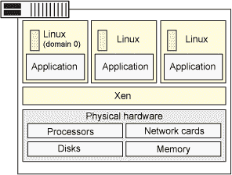

# 深入剖析 Xen 虚拟机管理程序

> 原文：[`developer.ibm.com/zh/articles/cl-hypervisorcompare-xen/`](https://developer.ibm.com/zh/articles/cl-hypervisorcompare-xen/)

##### 关于本系列

本系列文章首先介绍虚拟机管理程序类型和系统虚拟化的背景知识，然后介绍 5 个虚拟机管理程序的功能、它们的部署流程，以及您可能遇到的管理问题。

*   [简介](http://www.ibm.com/developerworks/cn/cloud/library/cl-hypervisorcompare/)
*   PowerVM
*   [VMware ESX Server](http://www.ibm.com/developerworks/cn/cloud/library/cl-hypervisorcompare-vmwareesx/)
*   Xen
*   [KVM](http://www.ibm.com/developerworks/cn/cloud/library/cl-hypervisorcompare-kvm/)
*   [z/VM](http://www.ibm.com/developerworks/cn/cloud/library/cl-hypervisorcompare-zvm/)

可以使用本系列文章作为理解虚拟机管理程序在云中的虚拟化过程中所扮演的角色的一个简单起点，或者您可以参阅本系列的各篇文章，帮助您确定哪个虚拟机管理程序最能满足您的云计算需求。

## 预备知识

Xen 是一种类型 1 虚拟机管理程序，它创建系统资源的逻辑池，使许多虚拟机可共享相同的物理资源。

Xen 是一个直接在系统硬件上运行的虚拟机管理程序。Xen 在系统硬件与虚拟机之间插入一个虚拟化层，将系统硬件转换为一个逻辑计算资源池，Xen 可将其中的资源动态地分配给任何操作系统或应用程序。在虚拟机中运行的操作系统能够与虚拟资源交互，就好象它们是物理资源一样。

图 1 显示了一个运行虚拟机的 Xen 系统。

##### 图 1\. Xen 架构

Xen 运行 3 个虚拟机。每个虚拟机与其他虚拟机都独自运行一个 Guest 操作系统和应用程序，同时共享相同的物理资源。

## 功能

以下是 Xen 架构的关键概念：

*   完整虚拟化。
*   Xen 可运行多个 Guest OS，每个 OS 在其自己的 VM 上运行。
*   无需驱动程序，许多出色的功能在 Xen 后台程序 xend 中进行。

### 完整虚拟化

大部分虚拟机管理程序基于*完整虚拟化*，这意味着它们向虚拟机完整地模拟所有硬件设备。Guest 操作系统不需要任何修改，它们的行为就好象它们每一个都可以独占访问整个系统。

##### 半虚拟化

半虚拟化是一种虚拟化技术，它向虚拟机提供一个软件接口，这个软件接口类似但不等同于底层硬件的接口。这个经过修改的接口用于减少 Guest 操作系统执行某些操作所花费的时间，相对于非虚拟化的环境，这些操作在虚拟环境中的运行困难得多。

有一些专门定义的“挂钩”允许 Guest 和宿主请求和接受这些困难的任务，这些任务也可以在虚拟域中执行，但执行性能更低。

完整虚拟化常常具有性能缺陷，因为完整的模拟通常需要虚拟机管理程序的更多处理资源（和更多开销）。Xen 基于*半虚拟化*，它要求修改 Guest 操作系统来支持 Xen 操作环境。但是，用户空间应用程序和库不需要修改。

出于以下原因，必须进行操作系统修改：

*   为了使 Xen 能够将操作系统设置为最高特权的软件。
*   为了使 Xen 能够使用更有效的接口（比如虚拟块设备和虚拟网络接口）来模拟设备，这会提高性能。

### Xen 可运行多个 Guest OS，每个 OS 在自己的 VM 上运行

Xen 可运行多个 Guest 操作系统，每个操作系统在自己的虚拟机或域中运行。在首次安装 Xen 时，它会自动创建第一个域 Domain 0（或 dom0）。

Domain 0 是管理域，负责管理系统。它执行构建其他域（或虚拟机）、管理每个虚拟机的虚拟设备，暂停虚拟机、恢复虚拟机和迁移虚拟机等任务。Domain 0 运行一个 Guest 操作系统，负责管理硬件设备。

### 无需驱动程序，许多出色的功能即可在 Xen 后台程序中执行

Xen 后台程序 xend 是一个 Python 程序，在 dom0 中运行。它是一个中央控制点，管理在 Xen 虚拟机管理程序上运行的所有虚拟机的虚拟资源。大部分命令解析、验证和排序操作是在 Xend 的用户空间中执行，不是在驱动程序中执行。

IBM 服务器支持 Xen 的 SUSE Linux Enterprise Edition (SLES) 10 版本，后者支持以下配置：

*   每个处理器 4 个虚拟机，每个物理系统最多 64 个虚拟机。
*   SLES 10 Guest 操作系统（仅半虚拟化）。

## 部署虚拟化

要部署 Xen 虚拟化，请执行以下步骤：

*   在系统上安装 Xen。
*   创建和配置虚拟机（这包括 Guest 操作系统）。

使用以下一种方法安装 Xen 软件：

*   **交互式安装：**使用此方法直接将 Xen 软件安装在 Xen 服务器上的专用虚拟机上。这个专用的虚拟机在安装过程中称为客户端计算机。
*   **从 CommCell 控制台安装：**使用此方法将 Xen 软件远程安装在 Xen 服务器上的专用虚拟机上。

有关部署虚拟化的更多信息，请参阅参考资料。

## 管理您的虚拟机

有一些可用的虚拟机管理器，包括：

*   **开源管理器：**

    *   OpenXenManager，Citrix 的 XenServer XenCenter 的一个开源克隆，管理 XCP 和 Citrix 的 XenServer。
    *   Xen Cloud Control System (XCCS) 是优秀的 Xen Cloud Platform 云计算系统的一个轻量型前端程序包。
    *   Zentific，一个基于 Web 的管理接口，用于有效控制在 Xen 虚拟机管理程序上运行的虚拟机。
*   **商业管理器：**

    *   Convirture：ConVirt 是一个集中化管理解决方案，允许您配置、监控和管理您的 Xen 部署的完整生命周期。
    *   Citrix XenCenter 是一个 Windows 原生的图形用户界面，用于管理 Citrix XenServer 和 XCP。
    *   Versiera 是一种基于 Web 的 Internet 技术，设计用于安全地管理和监控云环境和企业，支持 Linux、FreeBSD、OpenBSD、NetBSD、OS X、Windows、Solaris、OpenWRT 和 DD-WRT。

## 选择 Xen

优点：

*   Xen 服务器构建于开源的 Xen 虚拟机管理程序之上，结合使用半虚拟化和硬件协助的虚拟化。OS 与虚拟化平台之间的这种协作支持开发一个较简单的虚拟机管理程序来提供高度优化的性能。
*   Xen 提供了复杂的工作负载平衡功能，可捕获 CPU、内存、磁盘 I/O 和网络 I/O 数据，它提供了两种优化模式：一种针对性能，另一种针对密度。
*   Xen 服务器利用一种名为 Citrix Storage Link 的独特的存储集成功能。使用 Citrix Storage Link，系统管理员可直接利用来自 HP、Dell Equal Logic、NetApp、EMC 等公司的存储产品。
*   Xen 服务器包含多核处理器支持、实时迁移、物理服务器到虚拟机转换 (P2V) 和虚拟到虚拟转换 (V2V) 工具，集中化的多服务器管理、实时性能监控，以及 Windows 和 Linux 的快速性能。

缺点：

*   Xen 会占用相对较大的空间，且依赖于 dom0 中的 Linux。
*   Xen 依靠第三方解决方案来管理硬件设备驱动程序、存储、备份和恢复，以及容错。
*   任何具有高 I/O 速率的操作或任何会吞噬资源的操作会使 Xen 陷入困境，使其他 VM 缺乏资源。
*   Xen 的集成可能存在问题，它可能逐渐成为您的 Linux 内核上的负担。
*   XenServer 5 缺少 802.1Q 虚拟局域网 (VLAN) 中继；因为出于安全考虑，它没有提供目录服务集成、基于角色的访问控制、安全日志记录和审计或管理操作。

本文翻译自：[Dive into the Xen hypervisor](http://www.ibm.com/developerworks/cloud/library/cl-hypervisorcompare-xen)（2011-09-24）