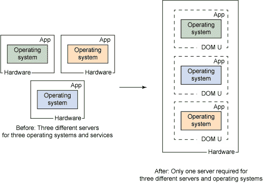
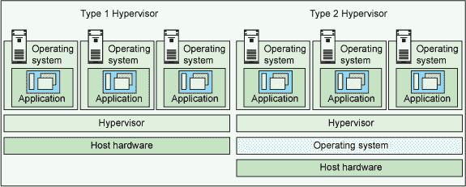

# 了解虚拟机管理程序、系统虚拟化和它在云环境中的工作原理

> 原文：[`developer.ibm.com/zh/articles/cl-hypervisorcompare/`](https://developer.ibm.com/zh/articles/cl-hypervisorcompare/)

虚拟化通过将您公司的物理资源视为资源池，改进了 IT 资源利用率，可从资源池中动态分配虚拟资源。

##### 关于本系列

本系列文章首先介绍虚拟机管理程序类型和系统虚拟化的背景知识，然后介绍 5 个虚拟机管理程序的功能、它们的部署流程，以及您可能遇到的管理问题。

*   简介
*   [PowerVM](https://www.ibm.com/developerworks/cn/cloud/library/cl-hypervisorcompare-powervm/)
*   [VMware ESX Server](https://www.ibm.com/developerworks/cn/cloud/library/cl-hypervisorcompare-vmwareesx/)
*   [Xen](https://www.ibm.com/developerworks/cn/cloud/library/cl-hypervisorcompare-xen/)
*   [KVM](https://www.ibm.com/developerworks/cn/cloud/library/cl-hypervisorcompare-kvm/)
*   [z/VM](https://www.ibm.com/developerworks/cn/cloud/library/cl-hypervisorcompare-zvm/)

将本系列作为理解虚拟机管理程序在云中的虚拟化过程中所扮演的角色的一个简单的起点，或者您可以参阅本系列的各篇文章，帮助您确定哪个虚拟机管理程序最能满足您的云需求。

虚拟化涉及到思考方式从物理到逻辑的转变，将 IT 资源视为逻辑资源，而不是独立的物理资源。在您环境中使用虚拟化，您能够将处理器、存储和网络等资源整合到虚拟环境中，该环境提供了以下优势：

*   通过整合减少了硬件成本。
*   优化工作负载。
*   IT 灵活性和响应能力。

*虚拟化*是为实际资源创建灵活的替代资源的过程。替代资源具有与它们的实际资源相同的功能和外部接口，但在尺寸、性能和成本等属性上不同。这些替代资源称为*虚拟资源*，它们的用户通常不知道存在替代关系。

向物理硬件资源应用虚拟化的方式通常为，将多个物理资源组合到共享池中，用户可从该池中收到虚拟资源。通过虚拟化，您可以使一个物理资源看起来像多个虚拟资源。

而且，虚拟资源可能拥有在其底层物理资源中不可用的功能或特性。

系统虚拟化在一个物理系统中创建许多虚拟系统。虚拟系统是使用虚拟资源的独立的操作环境。在 IBM® 系统上运行的虚拟系统常常被视为逻辑分区或虚拟机。系统虚拟化常常通过虚拟机管理程序技术来实现。

*虚拟机管理程序*是可虚拟化系统资源的软件或固件组件

##### 图 1\. 虚拟化，思考方式从物理到逻辑的转变

现在让我们看看虚拟机管理程序的类型。

## 虚拟机管理程序概述

有两种类型的虚拟机管理程序：

*   类型 1 虚拟机管理程序
*   类型 2 虚拟机管理程序

类型 1 虚拟机管理程序直接在系统硬件上运行。类型 2 虚拟机管理程序在提供 I/O 设备支持和内存管理等虚拟化服务的宿主操作系统上运行。图 2 显示了类型 1 和类型 2 虚拟机管理程序的区别。

##### 图 2\. 类型 1 和 2 虚拟机管理程序之间的区别

本系列中介绍的虚拟机管理程序支持各种硬件平台和各种云环境：

*   **PowerVM：** IBM POWER5、POWER6 和 POWER7 服务器的一项功能，IBM i、AIX® 和 Linux® 提供了对它的支持。IBM SmartCloud Enterprise 支持 PowerVM。
*   **VMware ESX Server：** 一种 “裸机” 嵌入式虚拟机管理程序，VMware ESX 的企业软件虚拟机管理程序直接在服务器硬件上运行，无需额外的底层操作系统。IBM SmartCloud Enterprise 支持它。
*   **Xen：** 一种针对 IA-32、x86-64、Itanium 和 ARM 架构的虚拟机监控器，Xen 允许几个 Guest 操作系统同时在相同的计算机硬件上执行。Xen 系统的结构将 Xen 虚拟机管理程序用作最低和最大特权层。
*   **KVM：** 一种针对 Linux 内核的虚拟化基础架构，KVM 支持具有硬件虚拟化扩展的处理器上的原生虚拟化。最初，它支持 x86 处理器，但现在支持广泛的处理器和 Guest 操作系统，包括 Linux、BSD、Solaris、Windows® 、Haiku、ReactOS 和 AROS Research Operating System 的许多变体（甚至还有一个可使用 KVM 运行 Mac OS X 的修改的 qemu 版本）。
*   **z/VM：** 最新版的 IBM 虚拟机操作系统，z/VM 在 IBM 的 zSeries 上运行，可用于支持大量（数千个）Linux 虚拟机。

所有这些虚拟机管理程序都受 IBM 硬件支持。

各个链接中的文章详细介绍了使用相应虚拟机管理程序部署和管理虚拟系统的特性、功能和方法。

## 选择正确的虚拟机管理程序

确定哪个虚拟机管理程序满足您需要的一种最佳方式是，对比它们的性能指标。这些指标包括 CPU 开销、最大宿主数量和 Guest 内存量，以及对虚拟机处理器的支持。

但是，不能单单根据指标来确定您的选择。除了虚拟机管理程序的功能，您还必须验证每个虚拟机管理程序所支持的 Guest 操作系统。

如果您正在您的服务网络中运行各种不同的系统，您必须选择支持您当前运行的操作系统的虚拟机管理程序。如果您运行一个基于 Windows 或 Linux 的同构网络，那么对较少数量 Guest 操作系统的支持可能适合您的需要。

所有虚拟机管理程序都不尽相同，但它们都提供了类似的功能。理解它们拥有的功能，以及它们分别支持的 Guest 操作系统，是任何硬件虚拟化虚拟机管理程序选择流程的一个必不可少的方面。将此数据与您组织的需求相匹配，将是您所制定的决策的核心。（要开始此流程，请查看关于本系列。）

在选择合适的虚拟机管理程序之前，应该检查以下因素。

### 虚拟机性能

虚拟系统应该满足或超过对应的物理资源的性能，至少相对于每个服务器内的应用程序而言。高于此基准的任何性能都有利。

理想情况下，您希望每个虚拟机管理程序动态优化资源，以最大化每个虚拟机的性能。问题是您愿意花多少成本来完成此优化？您项目的规模或任务关键性通常决定了这种优化的价值。

### 内存管理

是否拥有硬件级内存虚拟化的支持。VM Guest 和虚拟机管理程序中的内存过量使用和大页面表支持是首选的功能，内存页面共享可能是您希望考虑的一个可选的附加功能。

### 高可用性

每家主流供应商都拥有自己的高可用性解决方案，它们实现该方案的方式可能差别迥异，从非常复杂到极其简单的方法。同时理解每种系统的灾难防御和灾难恢复方法至关重要。您绝不应该在未完全了解已有的保护和恢复机制之前，将任何虚拟机上线。

### 实时迁移

实时迁移对于用户非常重要，再结合对跨不同平台进行实时迁移的支持和同时实时迁移两个或更多 VM 的能力，您需要仔细考虑各个虚拟机管理程序在这方面提供了什么功能。

### 网络、存储和安全

在网络方面，虚拟机管理程序应该支持网络接口卡 (NIC) 组群 (teaming) 和负载平衡、单播隔离以及支持标准 (802.1Q) 虚拟局域网 (VLAN) 中继。

每个虚拟机管理程序也应该支持 iSCSI 和光纤联网的存储，支持一些具有针对工具和 API、Fibre Channel over Ethernet (FCoE) 以及虚拟磁盘多虚拟机管理程序兼容性的选项的企业数据保护软件。

### 管理功能

是否拥有简单网络管理协议 (SNMP) trap 功能、集成其他管理软件以及管理服务器的容错功能等管理功能。这些功能对于虚拟机管理程序具有宝贵的价值。

### 一些建议……

现在我还不希望影响您的虚拟机管理程序选择（毕竟，您的需要和需求是独一无二的），但是根据我为基于云的工作负载实现虚拟机管理程序的经验，以下是一些一般建议：

*   对于基于 UNIX® 的工作负载、包含以性能为最主要需求的大量事务的业务关键型应用程序，PowerVM 虚拟机管理程序能够处理这种类型的负载。
*   如果您在 System X（适用于 Windows 和 Linux 的 x86 服务器）上运行业务关键型应用程序，VMware ESX 可以很好地运行。
*   如果您的应用程序对于业务不是特别重要，您可以尝试 KVM 或 Xen（它们的启动成本也相对低廉一些）。

您甚至可以尝试一些免费的 VM，比如 Xen 和 KVM。

## 结束语

IT 管理人员越来越多地寻求虚拟化技术，通过提高效率、灵活性和响应能力来降低 IT 成本。随着虚拟化变得更加普遍，虚拟化基础架构能够以最有效的方式解决企业数据中心所面临的挑战和问题，这至关重要。

任何寻求在数据中心内得到大量采用的虚拟化基础架构都应该提供多个重要的企业就绪功能的最佳组合：

*   成熟性，
*   易于部署，
*   可管理性和自动化，
*   支持和可维护性，
*   性能，
*   可伸缩性，
*   可靠性、可用性和可服务性
*   安全性

本文介绍了系统虚拟化和虚拟机管理程序的概念，演示了虚拟机管理程序在系统虚拟化中扮演的角色，提供了在选择虚拟机管理程序来支持您的云虚拟化需求时要考虑的一些主要问题。

本文翻译自：[Learn about hypervisors, system virtualization, and how it works in a cloud environment](https://developer.ibm.com/articles/cl-hypervisorcompare/)（2011-09-24）