# 使用 JavaFX 快速创建应用程序

> 原文：[`developer.ibm.com/zh/articles/wa-javafxapp/`](https://developer.ibm.com/zh/articles/wa-javafxapp/)

## 概述

JavaFX 是一个基于 Java 的平台，用于构建可以在桌面和移动模拟器上运行的富互联网应用程序（Rich Internet Applications，RIA）。使用 JavaFX 构建的应用程序是基于 Java 字节码的，因此可以运行在任何带有 Java 运行时环境的桌面和任何装有 Java2 ME 的移动设备上。JavaFX 使 GUI 变得十分简单；它使用声明性语法并提供动画支持。

在本文中，学习如何开始使用 JavaFX 来构建 RIA。下载和安装 JavaFX SDK、安装 JavaFX Eclipse 插件、通过创建样例应用程序探索 JavaFX 的基本功能。

下载 本文中使用的 Login Application 和 Animated Circle 示例的源代码。

## 安装

按照下列步骤下载和安装 JavaFX SDK 和 JavaFX Eclipse 插件。

1.  [下载最新版 JavaFX](https://www.oracle.com/technetwork/java/javafx/downloads/index.html) ，一个用于 Windows 的 SDK 安装文件，扩展名为 “.exe”。下载完成之后，双击 “.exe” 运行安装文件。
2.  完成安装向导中的步骤。

    Windows 的默认安装路径是 C:\Program Files\JavaFX\javafx-sdk-version。

3.  启动 Eclipse IDE。提供一个工作区名，比如 C:/workspace/jfx_projects。
4.  选择 **Help > Install New Software** 。
5.  在弹出的安装对话框中单击 **Add** 。
6.  如图 1 所示，在 Name 中输入 `JavaFX Plugin Site` 、在 Location 中输入 `http://javafx.com/downloads/eclipse-plugin/` 作为插件的安装路径。

    图 1\. 添加 JavaFX Plug-in Site 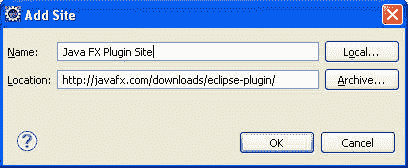

    单击 **OK** 。

7.  检查需要安装的 JavaFX 特性，如图 2 所示。

    图 2\. 检查应安装的 JavaFX 特性 

    单击 **Next** 。

8.  JavaFX 特性版本在 Install Details 对话框中显示，单击 **Next** 。
9.  接受许可协议条款，然后单击 **Finish** 。
10.  成功安装插件后，出现提示时重启 Eclipse 工作台。

如果您是在非默认路径下安装 JavaFX SDK，需要提示设置 JAVAFX_HOME 变量，如图 3 所示。您可能也需要创建一个名为 JAVAFX_HOME 的类路径变量，如果 Eclipse 插件安装时没有创建的话，并将其指向 JavaFX 安装路径。

图 3\. 设置 JAVAFX_HOME 类路径变量 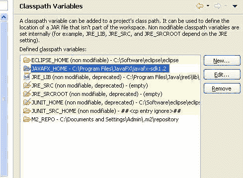

## 创建一个 Login 应用程序

在本小节，构建一个样例 JavaFX 应用程序来依据用户密码验证用户，如果他们提供了所需的信息，可以允许登录系统。授权成功完成之后，用户将可以看到一个 Welcome 屏幕。如果授权不成功，在 Eclipse Console 视图中将出现一个消息提供失败详情。您可以使用 JavaFX 的 Swing 组件来构建登录界面。您可以 下载 源代码构建 Login 应用程序。

1.  创建一个新 JavaFX 项目。单击 **File > New > Project > JavaFX > JavaFX project** ，如图 4 所示。

    图 4\. 创建一个新 JavaFX 项目 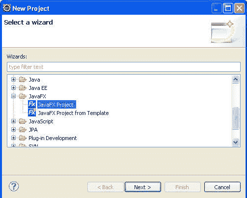

    单击 **Next** 。

2.  输入 `LoginApp` 作为项目名。选择 **Desktop** 配置文件。这些选项在图 5 中显示。

    图 5\. 配置 JavaFX 项目 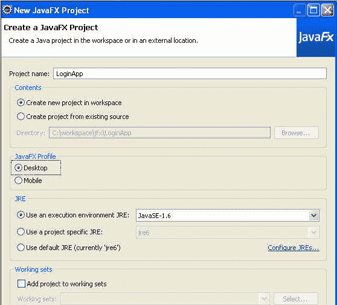

    单击 **Finish** 。

3.  在 LoginApp 项目中创建一个名为 com.sample.login 的包。
4.  右键单击该包并选择 **New > Empty JavaFX Script** 。
5.  输入名称 `Main` ，然后单击 **Finish** 。
6.  您需要为您的示例应用程序声明几个变量，如清单 1 所示，您需要一个名为 `login` 的布尔变量，来维护用户的登录状态（无论最后一次登录是否成功）。声明字符串变量 `username` 来保存用户输入的用户名。还有一个硬编码的系统用户 `test` ， 它只能登录我们的应用程序。

    清单 1\. 全局变量声明

    ```
    var login = false;
    var userName = "";
    var systemUser = "test"; 
    ```

7.  在 Snippets 窗口，选择 **Applications** 选项卡来进行扩展。

8.  选择 **Stage** 对象并将其拖拽到源编辑器，如图 6 所示。Stage 是最高级别的容器，用于保存用户界面 JavaFX 对象。

    图 6\. 将 Stage 对象拖拽到编辑器中 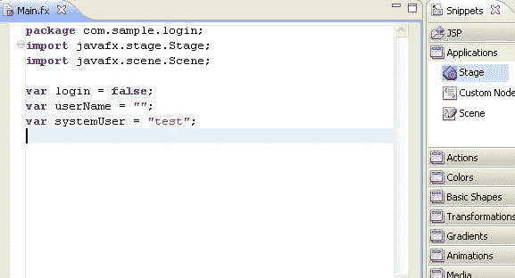

9.  通过输入 `Login App` 编辑将要显示的标题，如 图 7 所示。高度和宽度都设置为 `300` 。

    图 7\. 配置 Stage 对象 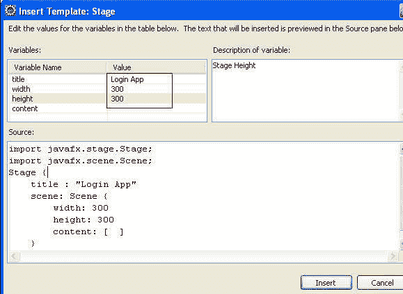

    单击 **Insert** ，为 Stage 添加一个 `Scene` 元素。 `Scene` 元素像一个绘画平台或表面，用于显示图形化元素。它有一个 `content` 变量，保存子元素。

10.  用一个导入语句向 `Scene` 添加一个 `javafx.scene.Group` 元素，如清单 2 所示。该组看起来像您所创建的其余组件的一个容器。

    清单 2\. 导入 group 类

    ```
    import javafx.scene.Group; 
    ```

11.  向 content 元素添加 `group` 元素，如清单 3 所示。

    清单 3\. 在 content 中添加 group

    ```
    content: [
             Group {

             }
    ] 
    ```

12.  开始向父元素组中添加子控件。首先，通过导入 `SwingLabel` 添加一个标签，如清单 4 所示。

    清单 4\. 导入 SwingLabel 类

    ```
    import javafx.ext.swing.SwingLabel; 
    ```

    向组的 `content` 元素中添加下列代码，如清单 5 所示。

    清单 5\. 向 group 中添加 SwingLabel

    ```
    content : [

              SwingLabel {
                     text : "User Name :";

              }
    ] 
    ```

13.  添加一个文本字段控件，用来接收用户输入，导入 `SwingTextField` 类，如清单 6 所示。

    清单 6\. 变量声明

    ```
    import javafx.ext.swing.SwingTextField; 
    ```

    在添加的文本字段中突出显示代码，如清单 7 所示。

    清单 7\. 向 group 中添加 SwingTextField

    ```
    SwingLabel {
              text : "User Name :";

             },
    SwingTextField {
              text : bind userName with inverse;
              columns : 10;
              editable : true;
              layoutX : 30;
              layoutY : 20;
              borderless : false;
              selectOnFocus : true;

                 } 
    ```

14.  添加一个调用操作来验证输入的用户名的按钮。如果用户名和系统用户匹配，那么用户成功登录系统。使用清单 8 中的导入语句导入 JavaFX `SwingButton` 。

    清单 8\. 导入 SwingButton 类

    ```
    import javafx.ext.swing.SwingButton; 
    ```

    添加清单 9 所示的代码，来包含位于 Text 字段下方的按钮。

    清单 9\. 向组中添加 SwingButton

    ```
    SwingButton{
             translateX: 50
             translateY: 50
             text: "Submit"
             action: function(){
              if((userName != systemUser)) {
                  println("Invalid UserName");
              }
              login = (userName == systemUser);
             }
            } 
    ```

15.  清单 9 中的 `action` 功能检查输入的 `userName` 是否和系统用户名一致。如果不是，示例打印出错误消息，否则，结果被存储在登录布尔变量中。

    到目前为止，您已经解决了登录时出错的状况。您需要使用登录变量就可直接成功登录。这需要一个 `if-else` 语句。添加 `if-else` 子句，并在 `else` 子句中先添加一个空的组，其中带有一个 content 对象。添加高亮显示的代码，如清单 10 所示。

    清单 10\. 添加 `if-else` 子句

    ```
    content: bind if(not login)Group {
                            content: [
                            SwingLabel{
                            text: "User Name:"
                            },
                            SwingTextField {
                            text : bind userName with inverse;
                            columns : 10;
                            editable : true;
                            layoutX : 30;
                            layoutY : 20;
                    },
                    SwingButton{
                          translateX: 50
                          translateY: 50
                          text: "Submit"
                          action: function(){
                                if((userName != systemUser)) {
                                      println("Invalid UserName");
                                }
                                login = (userName == systemUser);
                          }
                    }
                  ]
                 }
                  else Group{
                             content: [

                             ]

                  } 
    ```

16.  最后，添加一些文本来显示成功登录消息，并添加一个退出按钮，使用户可以返回到登录界面。导入 `Text` 类，如清单 11 所示。

    清单 11\. 导入 `Text` 类

    ```
    import javafx.scene.text.Text; 
    ```

    将清单 12 所示的代码添加到您之前添加的 `else` 子句组元素的 content 的正文中。

    清单 12\. 将 Text 类和 SwingButton 添加到 else 组中

    ```
    Text {
           x: 10 y: 30
           content: "You have successfully logged in."
          },
    SwingButton{
         translateX: 10
         translateY: 50
         text: "Log out"
         action: function(){
         userName = "";
         login = false;
         }
     } 
    ```

完整代码如清单 13 所示。

清单 13\. LoginApp 示例代码

```
package com.sample.login;
import javafx.stage.Stage;
import javafx.scene.Scene;
import javafx.scene.Group;
import javafx.scene.text.Text;

import javafx.ext.swing.SwingLabel;
import javafx.ext.swing.SwingTextField;
import javafx.ext.swing.SwingButton;

var login = false;
var userName = "";
var systemUser = "test";
Stage {
    title : "Login App"
    scene: Scene {
        width: 300
        height: 300
        content: bind if(not login) Group{
                          content: [
                             SwingLabel{
                                 text: "User Name:"
                             },

                             SwingTextField {
                                 text : bind userName with inverse;
                                 columns : 10;
                                 editable : true;
                                 layoutX : 30;
                                 layoutY : 20;

                             },
                             SwingButton{
                                 translateX: 50
                                 translateY: 50
                                 text: "Submit"
                                 action: function(){
                                     if((userName != systemUser)) {
                                            println("Invalid UserName");

                                 }
                                 login = (userName == systemUser);
                                 }
                            }

                         ]
                     }
                     else Group{
                         content: [

                     Text {
                                   x: 10 y: 30
                                   content: "You have successfully logged in."
                                },
                                SwingButton{
                                   translateX: 10
                                   translateY: 50
                                   text: "Log out"
                                   action: function(){
                                    userName = "";
                                    login = false;
                                     }
                                }

                         ]
                  }
                 }
} 
```

## 运行应用程序

在这一小节中，您将测试示例 Login 应用程序。保存到目前为止所做的修改。

1.  右键单击 Main.fx 文件，并选择 **Run As > JavaFX application** 。保持默认配置设置并单击 **Run** 。打开一个新窗口，其中含有 Login Application，如图 8 所示。

    图 8\. Login Application 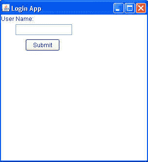

2.  输入 `abc` 然后单击 **Submit** 。登录失败，因此您可以看到在控制台上记录的错误信息。
3.  输入 `test` 然后单击 **Submit** 。系统接受这个用户名，登录成功，如图 9 所示。

    图 9\. 成功登录

    

## 创建一个应用程序在一个移动模拟器上运行

上面创建的 LoginApp 使用 Desktop 配置文件。本小节中创建一个应用程序，使用一个 Mobile 配置文件并在移动模拟器上运行。本例探索如何创建动画图形。您还将呈现一个圆形区域，其不透明度在不同时间段不断变化。

1.  创建一个新 JavaFX 项目。单击 **File > New > Project > JavaFX > JavaFX project** 。
2.  输入 Project 名 `AnimatedCircle` ，如图 10 所示。选择 **Mobile** 配置文件。

    图 10\. Login Application 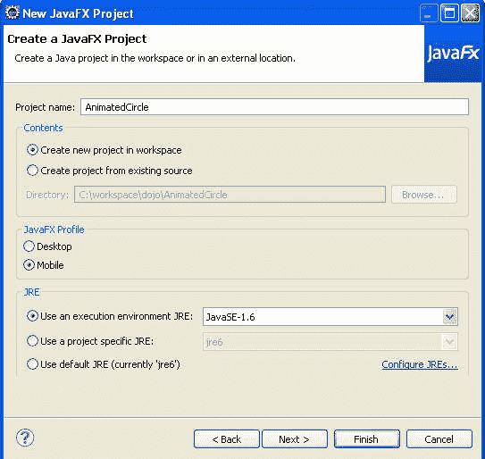

    单击 **Finish** 。

3.  创建一个名为 com.sample.animation 的包。
4.  创建一个新的空 JavaFX Script。在包上单击右键并选择 **New > Empty JavaFX Script** 。
5.  输入 `Main` 作为 Name，单击 **Finish** 。
6.  在 Snippets 窗口，选择 **Applications** 选项卡将其展开。
7.  选择 **Stage** 对象，并将其拖拽到源编辑器。
8.  输入 `Animated Circle` 作为 Title。其余保持原来的默认设置，然后单击 **Insert** 。
9.  在 Snippets 窗口，选择 **Basic Shapes** 选项卡将其展开。
10.  选择 **Circle** 元素，并将其拖拽到 `content[]` 元素内的源编辑器中。在 Insert Template 对话框中输入 `Color.BLUE` 作为 `fill` 属性，如图 11 所示。

    图 11\. 添加一个 Circle 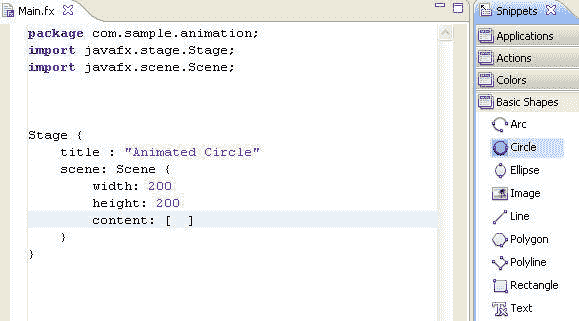

    单击 **Insert**.

11.  向 Circle 中添加一个 Linear Gradient，您可以指定两个或者更多的渐变颜色。在 Snippets 窗口中，单击 **Gradients** 选项卡将其展开。
12.  从填充值中删除 Color.BLUE，然后选择 **Linear Gradient** 对象并将其拖拽到源编辑器，如图 12 所示。

    图 12\. 向 Circle 添加一个 Linear Gradient 模式 

13.  现在，运行应用程序来查看迄今为止所开发的内容，保存修改。在 Main.fx 文件上单击右键并选择 **Run As > JavaFX Application** 。移动模拟器窗口将会出现，显示一个带有线性渐变的圆形区域，如图 13 所示。

    图 13\. Animated Circle App 运行在一个移动模拟器上 

### 添加动画支持

向圆形区域中添加动画支持，该示例在不同时间间隔简要介绍如何修改圆形区域的不透明度。您需要一个包含 KeyFrames 的 TimeLine。这个示例有两个关键帧：一个修改圆形区域的不透明度，每 5 秒钟从 0.0 改为 0.5，另一个每 10 秒从 0.5 改为 1.0。

1.  通过添加清单 14 中的代码，定义一个名为 `opacity` 的变量。

    清单 14\. 声明全局变量 opacity

    ```
    var opacity = 1.0; 
    ```

2.  为圆形区域添加一个区域变量，并将其绑定到全局变量，如清单 15 所示。

    清单 15\. 将一个全局变量绑定到 circle 的属性 opacity 中

    ```
    Circle {
          opacity : bind opacity;
          centerX: 100,
          centerY: 100,
          radius: 40, 
    ```

3.  添加 `TimeLine` 元素。在 Snippets 窗口中，选择 **Animations** 选项卡将其展开。将 `TimeLine` 元素拖拽到编辑器上。从 Insert Template 对话框输入 `5s` 作为时间值，如图 14 所示。

    图 14\. 添加一个 TimeLine 

    单击 **Insert** 。

    图 15 展示了将 TimeLine 拖拽到编辑器之后生成的代码。 图 15\. 添加的 TimeLine

    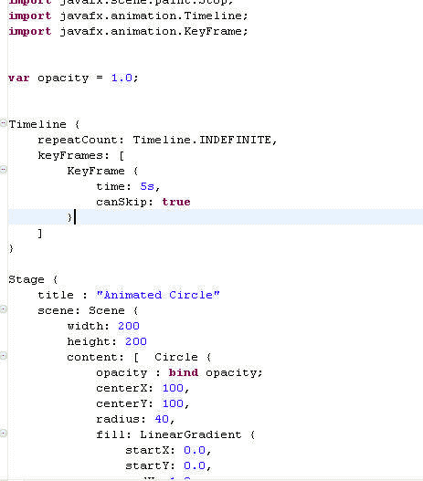

4.  从 KeyFrame 对象中的 **Animations** 选项卡中将 `Values` 元素拖拽到 `canSkip` 属性之后。在 Insert Template 对话框中，输入 `opacity` 作为变量值，如图 16 所示。

    图 16\. 将 Values 添加到 KeyFrame 

    单击 **Insert** 。在图 17 所示的已生成代码中，将不透明度值修改为 `0.5` 。

    图 17\. 带有添加的 Values 的 KeyFrame 

5.  在图 17 示例中 KeyFrame 下方，添加另一个 `KeyFrame` ，有一个 10 秒的时间变量和一个不透明度修改为 1.0 的 `Values` 元素。代码看起来如图 18 所示。

    图 18\. 有两个关键帧的 Timeline 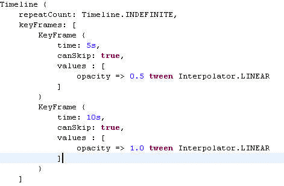

6.  最后，播放时间线。添加 `.play()` ，如图 19 所示。

    图 19\. 播放的 TimeLine 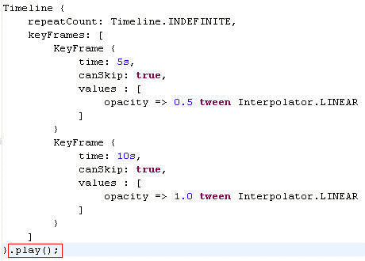

7.  再次运行应用程序查看正在运行的动态圆形区域。

## 结束语

在本文中，您了解了 JavaFX 及如何使用它来快速构建 GUI 应用程序。本文示例展示了如何使用 Swing 组件构建表单，还研究了如何开发图形化应用程序以及向其中添加动画支持。