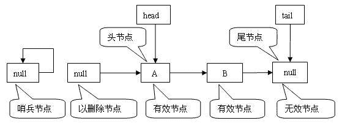
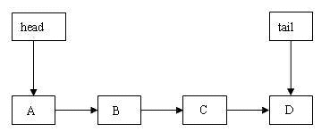
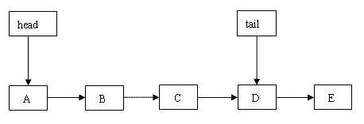
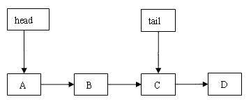
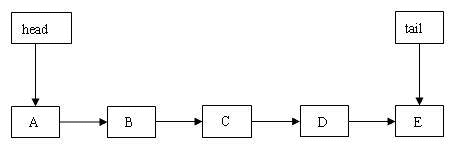
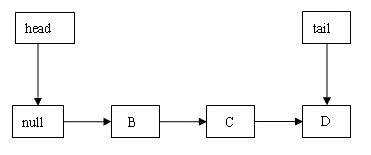
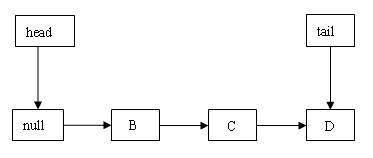
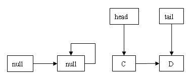

# 非阻塞算法在并发容器中的实现

> 原文：[`developer.ibm.com/zh/articles/j-lo-concurrent/`](https://developer.ibm.com/zh/articles/j-lo-concurrent/)

## 简介

非阻塞算法在更细粒度的层面协调争用，它比传统的锁有更高的并发性。随着非阻塞算法在 Java 中的应用越来越广泛，java.concurrent 包中用非阻塞算法实现的并发容器也越来越多，ConcurrentLinkedQueue 就是其中的一个重要成员。鉴于 ConcurrentLinkedQueue 的非阻塞算法实现在并发容器中具有代表性，本文将结合 JDK Update23 的源代码来分析它在当前的实现。由于非阻塞算法本身比较复杂，阅读本文的读者需要对 CAS 原子指令和非阻塞同步机制有所了解。本文分为两部分，第一部分主要是对非阻塞算法相关理论知识的简介，第二部分结合 ConcurrentLinkedQueue 的源代码，来探索非阻塞算法的具体实现。希望通过本文，能够有助于读者理解非阻塞算法在并发容器中的工作原理与具体实现机制。

## 非阻塞算法相关技术简介

为了便于读者更好的理解本文，首先让我们来对非阻塞算法相关的理论知识做个简单的了解，更详细的论述请参阅文中提及的相关参考文献。

### Java 的多线程同步机制

在现代的多处理器系统中，提高程序的并行执行能力是有效利用 CPU 资源的关键。为了有效协调多线程间的并发访问，必须采用适当的同步机制来协调竞争。当前常用的多线程同步机制可以分为下面三种类型：

*   volatile 变量：轻量级多线程同步机制，不会引起上下文切换和线程调度。仅提供内存可见性保证，不提供原子性。
*   CAS 原子指令：轻量级多线程同步机制，不会引起上下文切换和线程调度。它同时提供内存可见性和原子化更新保证。
*   内部锁和显式锁：重量级多线程同步机制，可能会引起上下文切换和线程调度，它同时提供内存可见性和原子性。

### 多处理器系统对并发的支持

现代的多处理器系统大多提供了特殊的指令来管理对共享数据的并发访问，这些指令能实现原子化的读 – 改 – 写操作。现代典型的多处理器系统通常支持两种同步原语（机器级别的原子指令）：CAS 和 LL/SC。Intel，AMD 和 SPARC 的多处理器系统支持”比较并交换”（compare-and-swap，CAS）指令。IBM PowerPC，Alpha AXP，MISP 和 ARM 的多处理器系统支持”加载链接 / 存储条件”（load-linked/store-conditional，LL/SC）指令。

JDK 为 concurrent.atomic 包中的原子类提供了 compareAndSet() 方法，compareAndSet() 方法使用上面这些机器级别的原子指令来原子化的更新值。java. concurrent 包中的这些原子类，为用非阻塞算法实现并发容器打下了基础。

关于 CAS 原子指令，感兴趣的读者可以参阅参考文献 1 的 15.2 章和参考文献 3 的附录 B8。关于 CAS 原子指令在不同多处理器上的有关细节，可以参阅参考文献 4 的”Multiprocessors”部分。

### 非阻塞算法

一个线程的失败和挂起不会引起其他些线程的失败和挂起，这样的算法称为非阻塞算法。非阻塞算法通过使用底层机器级别的原子指令来取代锁，从而保证数据在并发访问下的一致性。

从 Amdahl 定律我们可以知道，要想提高并发性，就应该尽量使串行部分达到最大程度的并行；也就是说： **最小化串行代码的粒度是提高并发性能的关键。**

与锁相比，非阻塞算法在更细粒度（机器级别的原子指令）的层面协调多线程间的竞争。它使得多个线程在竞争相同资源时不会发生阻塞，它的并发性与锁相比有了质的提高；同时也大大减少了线程调度的开销。同时， **由于几乎所有的同步原语都只能对单个变量进行操作，这个限制导致非阻塞算法的设计和实现非常复杂。**

关于非阻塞算法，感兴趣的读者可以参阅参考文献 1 的 15.4 章。关于 Amdahl 定律，感兴趣的读者可以参阅参考文献 1 的 11.2 章和参考文献 3 的 1.5 章。

## 非阻塞算法实现简述

### 基于非阻塞算法实现的并发容器

在探索 ConcurrentLinkedQueue 非阻塞算法的具体实现机制之前，首先让我们来了解一下 JDK 中基于非阻塞算法实现的并发容器。在 JDKUpdate23 的 util.concurrent 包中，基于非阻塞算法实现的并发容器包括：ConcurrentLinkedQueue，SynchronousQueue，Exchanger 和 ConcurrentSkipListMap。ConcurrentLinkedQueue 是一个基于链接节点的无界线程安全队列，本文接下来将结合 JDK 源代码，来探索它的非阻塞算法的具体实现机制。SynchronousQueue 是一个没有容量的阻塞队列，它使用 **双重数据结构** 来实现非阻塞算法。Exchanger 是一个能对元素进行配对和交换的交换器。它使用 **消除** 技术来实现非阻塞算法 *。* ConcurrentSkipListMap 是一个可以根据 Key 进行排序的可伸缩的并发 Map。

关于双重数据结构，感兴趣的读者可以参阅参考文献 3 的 10.7 章，关于消除技术，感兴趣的读者可以参阅参考文献 3 的第十一章。

### ConcurrentLinkedQueue 的非阻塞算法简述

本文接下来将在分析 ConcurrentLinkedQueue 源代码实现的过程中，穿插讲解非阻塞算法的具体实现。为了便于读者理解本文，首先让我们对它的实现机制做个全局性的简述。ConcurrentLinkedQueue 的非阻塞算法实现可概括为下面 5 点：

1.  使用 CAS 原子指令来处理对数据的并发访问，这是非阻塞算法得以实现的基础。
2.  **head/tail 并非总是指向队列的头 / 尾节点，也就是说允许队列处于不一致状态。** 这个特性把入队 / 出队时，原本需要一起原子化执行的两个步骤分离开来，从而缩小了入队 / 出队时需要原子化更新值的范围到唯一变量。这是非阻塞算法得以实现的关键。
3.  由于队列有时会处于不一致状态。为此，ConcurrentLinkedQueue 使用三个不变式来维护非阻塞算法的正确性。
4.  以批处理方式来更新 head/tail，从整体上减少入队 / 出队操作的开销。
5.  为了有利于垃圾收集，队列使用特有的 head 更新机制；为了确保从已删除节点向后遍历，可到达所有的非删除节点，队列使用了特有的向后推进策略。

ConcurrentLinkedQueue 有机整合了上述 5 点来实现非阻塞算法。由于三个不变式会从全局来约束非阻塞算法，所以在开始分析源代码之前，让我们首先来了解它。

## 不变式

在后面的源代码分析中，我们将会看到队列有时会处于不一致状态。为此，ConcurrentLinkedQueue 使用三个不变式 ( 基本不变式，head 的不变式和 tail 的不变式 )，来约束队列中方法的执行。通过这三个不变式来维护非阻塞算法的正确性。

不变式：并发对象需要一直保持的特性。不变式是并发对象的各个方法之间必须遵守的”契约”，每个方法在调用前和调用后都必须保持不变式。采用不变式，就可以隔离的分析每个方法，而不用考虑它们之间所有可能的交互。

### 基本不变式

在执行方法之前和之后，队列必须要保持的不变式：

*   当入队插入新节点之后，队列中有一个 next 域为 null 的（最后）节点。
*   从 head 开始遍历队列，可以访问所有 item 域不为 null 的节点。

### head 的不变式和可变式

在执行方法之前和之后，head 必须保持的不变式：

*   所有”活着”的节点（指未删除节点），都能从 head 通过调用 succ() 方法遍历可达。
*   head 不能为 null。
*   head 节点的 next 域不能引用到自身。

在执行方法之前和之后，head 的可变式：

*   head 节点的 item 域可能为 null，也可能不为 null。
*   允许 tail 滞后（lag behind）于 head，也就是说：从 head 开始遍历队列，不一定能到达 tail。

### tail 的不变式和可变式

在执行方法之前和之后，tail 必须保持的不变式：

*   通过 tail 调用 succ() 方法，最后节点总是可达的。
*   tail 不能为 null。

在执行方法之前和之后，tail 的可变式：

*   tail 节点的 item 域可能为 null，也可能不为 null。
*   允许 tail 滞后于 head，也就是说：从 head 开始遍历队列，不一定能到达 tail。
*   tail 节点的 next 域可以引用到自身。

在接下来的源代码分析中，在初始化 ConcurrentLinkedQueue 之后及调用入队 / 出队方法之前和之后，我们都会参照上面三个不变式来分析它们的正确性。

## 节点类实现及队列初始化

### 节点类定义

ConcurrentLinkedQueue 是用节点链接成的链表来实现的。首先，让我们来看看节点类的源代码：

##### 清单 1\. 节点类

```
private static class Node<E> {
        private volatile  E item;           // 声明为 volatile 型
        private volatile  Node<E> next;    // 声明为 volatile 型

        Node(E item) {                       // 创建新节点
            lazySetItem(item);              // 惰性设置 item 域的值
         }

        E getItem() {
            return item;
        }

        boolean casItem(E cmp, E val) {   // 使用 CAS 指令设置 item 域的值
            return UNSAFE.compareAndSwapObject(this, itemOffset, cmp, val);
        }

        void setItem(E val) {  // 使用"volatile 写”的方式，设置 item 域的值
             item = val;
        }
        voidlazySetItem(E val) { //惰性设置 item 域的值
                 UNSAFE.putOrderedObject(this, itemOffset, val);
        }

        void lazySetNext(Node<E> val) {    // 惰性设置 next 域的值
            UNSAFE.putOrderedObject(this, nextOffset, val);
        }

        Node<E> getNext() {
            return next;
        }

                                                      //CAS 设置 next 域的值
        boolean casNext(Node<E> cmp, Node<E> val) {
            return UNSAFE.compareAndSwapObject(this, nextOffset, cmp, val);
        }

        private static final sun.misc.Unsafe UNSAFE=     // 域更新器
        sun.misc.Unsafe.getUnsafe();
        private static final long nextOffset=              //next 域的偏移量
        objectFieldOffset(UNSAFE, "next", Node.class);
        private static final long itemOffset=              //item 域的偏移量
        objectFieldOffset(UNSAFE, "item", Node.class);

    } 
```

在 ConcurrentLinkedQueue 的实际应用中，会频繁分配大量生命周期短暂的节点对象。为了降低开销，Node 类的 item 域和 next 域被声明为普通的 volatile 类型。它们通过原子引用域更新器（AtomicReferenceFieldUpdater），使用反射来更新。关于原子引用域更新器，感兴趣的读者可以参阅参考文献 1 的 15.4.3。

### 节点类型说明

为了便于读者理解本文，下面对文中涉及的不同类型的节点集中做个定义：

*   有效节点：从 head 向后遍历可达的节点当中，item 域不为 null 的节点。
*   无效节点：从 head 向后遍历可达的节点当中，item 域为 null 的节点。
*   以删除节点：从 head 向后遍历不可达的节点。
*   哨兵节点：链接到自身的节点（哨兵节点同时也是以删除节点）。
*   头节点：队列中的第一个有效节点（如果有的话）。
*   尾节点：队列中 next 域为 null 的节点（可以是无效节点）。

下面是不同类型节点的示意图：

##### 图 1\. 不同类型节点示意图



对比 head 的不变式和 tail 的不变式可以看出，head 只能指向有效节点和无效节点，而 tail 可以指向任意节点，包括以删除节点和哨兵节点。在 ConcurrentLinkedQueue 中，入队时只能把新节点链接到尾节点的后面，出队时只能删除头节点。

### 队列初始化

接下来让我们来看看 ConcurrentLinkedQueue 初始化过程的源代码实现：

##### 清单 2\. 初始化

```
// 创建一个 item 域为 null，next 域为 null 的伪节点
 private transient volatile Node<E> head = new Node<E>(null);

 private transient volatile Node<E> tail = head;

 public ConcurrentLinkedQueue() {} 
```

当初始化一个 ConcurrentLinkedQueue 对象时，会创建一个 item 域为 null 和 next 域为 null 的伪节点，并让 head 和 tail 指向这个伪节点。下面是队列初始化之后的结构示意图：

##### 图 2\. 初始化状态结构图


从上图我们可以看出，处于初始化状态的队列满足三个不变式。

## 批处理更新，更新 head 及向后推进

### 批处理更新 head/tail

为了尽量减少执行 CAS 原子指令的次数，执行入队 / 出队操作时 , ConcurrentLinkedQueue 并不总是更新 head/tail。只有从 head/tail 到头 / 尾节点之间的”距离”达到变量 HOPS 指定的阀值，入队 / 出队操作才会更新它们。下面这行源代码定义了 HOPS 这个变量：

##### 清单 3.HOPS 变量

```
// 更新 head/tail 的阀值
private static final int HOPS = 1; 
```

以批处理方式更新减少了更新 head/tail 的次数（减少了执行 CAS 原子指令的次数），但额外的增加了遍历队列，寻找头 / 尾节点的开销（增加了读 volatile 变量的开销）。在当前大多数的处理器系统中，volatile 读操作的开销非常低，几乎和非 volatile 变量的读操作一样（见参考文献 2）。而执行一条 CAS 原子指令要消耗比普通加载或存储指令多得多的时钟周期。因为 CAS 原子指令的执行包含了内存屏障（关于内存屏障，感兴趣的读者可以参阅参考文献 4 的 Memory barriers 一章），防止乱序执行以及对各种编译器优化的抑制。因此以批处理方式更新 head/tail，从整体上减少了入队 / 出队操作的开销。

### head 更新

为了有利于垃圾收集，ConcurrentLinkedQueue 在更新 head 指向新头结点后，会把旧头节点设置为哨兵节点。下面是更新 head 的源代码：

##### 清单 4\. 更新 head

```
final void updateHead(Node<E> h, Node<E> p) {
         // 如果两个节点不相同，尝试用 CAS 指令原子更新 head 指向新头节点
         if (h != p && casHead(h, p))
             // 惰性设置旧头结点为哨兵节点
             h.lazySetNext (h);
         } 
```

下面通过一个示意图来理解已删除节点在队列中的状态：

##### 图 3\. 已删除节点状态示意图


在上图中，假设开始时 head 指向 A 节点，然后连续执行了 4 次出队操作，删除 A，B，C，D 4 个节点。在出队 B 节点时，head 与头结点之间的距离达到变量 HOPS 指定的阀值。这触发执行 updateHead（）方法：首先设置 head 指向 C 节点，然后设置 B 节点的 next 域指向自身。同样，在出队 D 节点时，重复同样的过程。由于 B 和 D 节点断开了以删除节点与队列的链接，这将有利于虚拟机回收这些以删除节点占用的内存空间。

### 向后推进

由于 tail 可以指向任意节点，所以从 tail 向后遍历寻找尾节点的过程中，可能会遇到哨兵节点。此时 succ() 方法会直接跳转到 head 指向的节点继续遍历。下面是 succ() 方法的源代码：

##### 清单 5\. 向后推进

```
final Node<E> succ(Node<E> p) {
    Node<E> next = p.getNext();

 // 如果 p 节点的 next 域链接到自身（p 节点是哨兵节点）
 // 就跳转到 head，从 head 开始继续遍历
         // 否则向后推进到下一个节点
         return (p == next) ? head : next;
     } 
```

从上面的源代码我们可以看出，如果向后推进过程中遇到哨兵节点，就跳转到 head，从 head 开始继续遍历；否则，就推进到下一个节点。

下面通过一个示意图来理解跳转动作的的执行过程：

##### 图 4\. 跳转动作示意图


上图的队列当前处于 tail 滞后于 head 状态。假设现在执行入队操作，需要从 tail 开始向后遍历找到队列的尾节点。tail 开始时指向 A 节点，执行 succ() 方法向后推进到 B 节点。在 B 节点执行 succ() 方法时，由于 B 节点链接到自身，所以跳转到 head 指向的 E 节点继续遍历。下面对滞后与跳转做个总结：

*   如上图所示，如果 head 落在 tail 的后面，队列就处于 tail 滞后于 head 状态。
*   如果 tail 滞后于 head，从 tail 向后遍历过程中就会发生跳转动作。
*   跳转动作确保从已删除节点向后遍历，可以到达所有的未删除节点。

## 入队操作

在 ConcurrentLinkedQueue 中，插入新节点时，不用考虑尾节点是否为有效节点，直接把新节点插入到尾节点的后面即可。由于 tail 可以指向任意节点，所以入队时必须先通过 tail 找到尾节点，然后才能执行插入操作。如果插入不成功（说明其他线程已经抢先插入了一个新的节点）就继续向后推进。重复上述迭代过程，直到插入成功为止。下面是入队方法的源代码：

##### 清单 6\. 插入新节点

```
public boolean offer(E e) {
        if (e == null) throw new NullPointerException();
        Node<E> n = new Node<E>(e);     // 创建新节点
        retry:
        for (;;) {
            Node<E> t = tail;
            Node<E> p = t;
            for (int hops = 0; ; hops++) {
                Node<E> next = succ(p);          //A
                if (next != null) {                    //B
                    if (hops > HOPS&& t != tail)    //B1
                        continue retry;                 //B2
                    p = next;                           //B3
                } else if (p.casNext(null, n)) {        //C
                    if (hops >= HOPS)         //C1
                        casTail(t, n);                  //C2
                    return true;                        //C3
                } else {                                //D
                    p = succ(p);                        //D1
                }
            }
        }
 } 
```

### 插入新节点的源代码分析

`offer() 方法使用非阻塞算法惯用的"循环尝试”的方式来执行：` 如果因其他线程干扰而 `失败就重新尝试，直到成功为止。下面是关键代码的解释：`

*A* ： 找到 tail 的下一个节点 next。

*B* ： 如果 next 不为 null。

B1：如果已经至少越过了两个节点，且 tail 被修改 (tail 被修改，说明其他线程向队列添加了新的节点，且更新 tail 成功 )。

B2：跳出内外两层循环，重新开始迭代（因为 tail 刚刚被其他线程更新了）。

B3：向后推进到下一个节点。

*C* ： 如果当前节点为尾节点，使用 CAS 原子指令设置尾节点的 next 域指向新节点。

C1：如果已经至少越过了一个节点（此时，tail 至少滞后尾节点两个节点）。

C2：使用 CAS 原子指令更新 tail 指向这个新插入的节点。

C3：新节点以插入队列，不管更新 tail 是否成功，退出方法。

*D* ： 如果向队尾插入新节点不成功（其他线程已经抢先在队尾插入了一个新节点）。

D1：向后推进到下一个节点。

队列的入队方法包含两个步骤：添加新节点和更新 tail 指向这个新节点。这两个步骤分别对应代码分析的 C 和 C2。从代码中我们可以看到，这两个步骤都是用 CAS 原子指令来完成的。由于 ConcurrentLinkedQueue 允许队列处于不一致状态，所以这里的 C 和 C2 这两个步骤不必一起原子的执行。在 C 处添加新节点后，只有当 tail 与新添加节点之间的距离达到了 HOPS 指定的阀值，才会执行 C2 来更新 tail。

### tail 在队列中的位置分析

根据 tail 的不变式和可变式，在执行入队操作前，tail 在队列中的位置共有三种可能：

1.  tail 指向尾节点。
2.  tail 节点指向非尾节点。
3.  tail 滞后于 head。

下面分别分析这三种情形，首先让我们看看第一种情形的示意图：

##### 图 5.tail 指向尾节点



开始时，tail 指向 D 节点，首先寻找 D 节点的后继节点。由于 D 的后继节点为 null，所以插入新节点到 D 节点的后面。如果插入成功就退出方法；如果插入失败（说明其他线程刚刚插入了一个新节点），就向后推进到新插入的节点，然后重新开始迭代。下图是插入成功后的示意图：

##### 图 6.tail 指向尾节点，插入新节点成功



在上图中，由于 tail 滞后于尾节点的节点数还没有达到 HOPS 指定的阈值，所以 tail 没有被更新。

下面，让我们看看第二种情形的结构示意图：

##### 图 7.tail 指向非尾节点



开始时，tail 指向 C 节点。首先找到 C 的后继节点 D，然后向后推进到节点 D，后面代码执行路径与上面的”tail 指向尾节点 *”* 的代码执行路径相同。下图是插入成功后的结构示意图：

##### 图 8.tail 指向非尾节点，插入新节点成功



上图中的 tail 更新了位置。因为在添加 E 节点后，tail 滞后的节点数达到了 HOPS 指定的阈值。这触发执行更新 tail 的 CAS 操作。

最后，让我们看看第三种情形的结构示意图：

##### 图 9.tail 滞后于 head


开始时，tail 指向 A 节点。首先找到 A 的后继节点 B，然后向后推进到节点 B。由于 B 是哨兵节点，产生跳转动作，跳过 C 节点，从 head 指向的 D 节点开始继续向后遍历。后面的代码执行路径与”tail 指向非尾节点”相同。下面是成功插入一个新节点后的结构示意图：

##### 图 10.tail 滞后于 head，插入新节点成功


上图的 tail 更新了位置，因为 tail 滞后的节点数达到了 HOPS 指定的阈值，这触发执行更新 tail 的 CAS 操作。

从上面插入新节点后的三个结构示意图我们可以看出，执行入队操作后的队列依然满足三个不变式。

## 出队操作

在 ConcurrentLinkedQueue 中，出队操作从队列的头部删除第一个有效节点。根据 head 的不变式和可变式，head 可以指向无效节点，所以出队前必须先检查 head 是否指向有效节点。如果指向无效节点就要向后推进，直到找到第一个有效节点，然后再执行出队操作。下面是出队方法的源代码：

##### 清单 7\. 删除队列头节点

```
public E poll() {
        Node<E> h = head;
        Node<E> p = h;
        for (int hops = 0; ; hops++) {
            E item = p.getItem();                                    //A
            if (item != null && p.casItem(item, null)) {     //B
                if (hops >= HOPS) {                        //C
                    Node<E> q = p.getNext();                   //C1
                    updateHead(h, (q != null) ? q : p);              //C2
                }
                return item;                                         //D
            }
            Node<E> next = succ(p);                            //E
            if (next == null) {                                      //F
                updateHead(h, p);                                    //G
                break;                                               //H
            }
            p = next;                                                //I
        }
        return null;
    } 
```

### 删除头结点的代码分析

`和 offer() 方法一样，poll() 方法也使用"循环尝试”的方式来执行。` 下面是对关键代码的解释：

A：获得当前节点 p 的 item 域的值。

B：如果当前节点是有效节点，且成功设置这个节点为无效节点。

C：如果迭代过程已经越过了不小于 1 个节点。

C1：取得后继结点 q。

C2：如果 q 不为 null，设置 head 指向后继节点 q；否则设置 head 指向当前节点 p（此时队列为空，只有一个伪节点 p）。

D：返回被移除节点 item 域的值。

E：向后推进到下一个节点 next（因为当前节点 p 是一个无效节点）。

F：如果 next 为 null。

G：设置 head 指向 p 节点（此时队列为空，只有一个伪节点 p）。

H：退出循环。

I：推进到下一个节点。

队列的出队方法包含两个步骤：删除头节点和更新 head 指向新头节点。这两个步骤分别对应代码分析的 B 和 C2。这里对头节点的删除使用了一个小技巧：设置头节点的 item 域为 null，即删除了它（虽然这个节点还在队列中，但它以是无效节点）。在代码中我们可以看到，这两个步骤都使用 CAS 原子指令来完成。由于 ConcurrentLinkedQueue 允许队列处于不一致状态，所以这里的 B 和 C2 这两个步骤不必一起原子的执行。在 B 处删除头节点后，只有当 head 与新头节点之间的距离达到了 HOPS 指定的阀值，才会执行 C2 来更新 head。

### head 在队列中的位置分析

根据 head 的不变式和可变式，在执行出队操作前，head 在队列中的位置共有两种可能：

1.  head 指向有效节点。
2.  head 指向无效节点。

下面，让我们首先来看第一种情形的结构示意图：

##### 图 11.head 指向有效节点


出队时，首先取得 head 指向的 A 节点的 item 域的值，然后通过 CAS 设置 A 节点 item 域的值为 null。如果成功，由于此时越过的节点数为 0，所以直接返回 A 节点 item 域原有的值。如果不成功，说明其他线程已经抢先删除了该节点，此时向后推进到 B 节点。重复这个过程，直到成功删除一个节点；如果遍历完队列也没有删除成功，则返回 null。下面是成功删除后的结构示意图：

##### 图 12\. 成功删除 head 指向的有效节点



在上图中，虽然 A 节点被设置成无效节点，但 head 依然指向它，因为删除操作越过的节点数还没有达到 HOPS 指定的阀值。

接下来，让我们来看看第二种情形的结构示意图：

##### 图 13.head 指向无效节点



首先获得 head 指向节点的 item 域的值，由于为 null，所以向后推进到 B 节点。获得 B 节点 item 域的值后，通过 CAS 设置该值为 null。如果成功，由于已经达到 HOPS 指定的阀值，触发执行 head 更新。如果不成功（说明其他线程已经抢先删除了 B 节点），继续向后推进到 C 节点。重复这个过程，直到删除一个有效节点。如果遍历完队列也没有删除成功，则返回 null。下图是成功删除后的结构示意图：

##### 图 14.head 指向无效节点，成功删除



从上图我们可以看到，在执行删除操作过程中，head 越过的节点数达到阀值，触发执行 head 的更新，使它指向 C 节点。

从上面删除头节点后的两个结构示意图可以看出，执行出队操作后的队列依然满足三个不变式。

## 总结

ConcurrentLinkedQueue 的非阻塞算法实现非常精巧，也非常复杂。它使用 CAS 原子指令来处理对数据的并发访问。同时，它允许队列处于不一致状态。这个特性分离了入队 / 出队操作中包含的两个需要一起原子执行的步骤，从而有效的缩小了入队 / 出队时的原子化（更新值的）范围为唯一变量。由于队列可能处于不一致状态，为此 ConcurrentLinkedQueue 使用三个不变式来维护非阻塞算法的正确性。

虽然我们不用自己去实现如此复杂的并发数据结构，但知晓它的工作原理与实现机制对于我们更好的使用它将很有帮助。