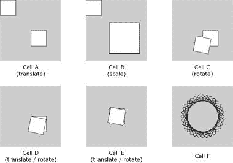
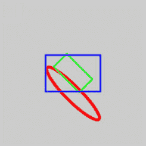
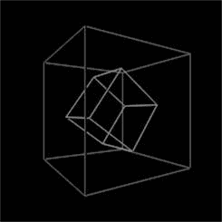
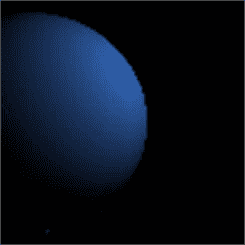

# 2D、3D、物理和网络

> 原文：[`developer.ibm.com/zh/articles/os-datavis3/`](https://developer.ibm.com/zh/articles/os-datavis3/)

[用 Processing 进行数据可视化，第 1 部分：语言和环境简介](http://www.ibm.com/developerworks/cn/opensource/os-datavis/) 和 [用 Processing 进行数据可视化，第 2 部分：使用接口、对象、图像和应用程序的中间数据可视化](http://www.ibm.com/developerworks/cn/opensource/os-datavis2/) 介绍了 Processing 语言的许多功能，包括基本的 2D 图像处理和文本到图像处理。本文是这一系列文章的终结篇，将介绍 Processing 是如何处理 3D 图形、光线和网络。网络部分介绍了一种方法，能够为您的 Processing 应用程序提供一些有用的可视化数据。

让我们从实现这些特性的一些转换和各种 Processing 功能开始。

## 转换

如果您开发过图形应用程序，您可能会熟悉实现诸如平移、缩放和放转等所需要的线性代数和矩阵运算。Processing 提供了简化运算的函数，如通过一个函数调用而隐藏在底层的矩阵数学。

### 坐标系统转换

转换是直接修改坐标系统，这样左上角会发生偏移。在这个转换中为显示窗口的新运算定义偏移量是一个额外的操作。例如，清单 1 所示代码使用 `rect` 函数绘制了一个正方形，然后使用 `translate` 修改坐标系统。 `translate` 函数之后绘制的任何形状都会加上这个偏移量；所以在这里， `rect` 函数实际上在坐标 100, 100, 150, 150 上创建一个正方形，如图 1 的单元格 A 所示。

##### 清单 1\. 使用 `translate()` 修改坐标系统

```
size(200, 200);

rect(0, 0, 50, 50);

translate(100, 100);

rect(0, 0, 50, 50); 
```

### 缩放

`scale` 函数，顾名思义，是实现放大绘图操作。例如，如果您请求缩放 2.0，那么您的对象将比原始图像增大 200％（各个方向）。清单 2 说明了这个概念，其结果输出如图 1 的单元格 B 所示。

##### 清单 2\. 使用 `scale()` 放大绘图操作

```
size(200, 200);

rect(0, 0, 50, 50);

translate(75, 75);
scale(2.0);

rect(0, 0, 50, 50); 
```

### 旋转

`rotate` 函数会以左上角（坐标 0,0）为原点旋转图形。因此，旋转一个图形实际上并不是放置已有图形。清单 3 显示了对一个正方形执行的旋转操作。您首先要画出正方形，然后再指定该显示窗口后面绘制图形的旋转操作。其结果如图 1 的单元格 C 所示。

##### 清单 3\. 使用 `rotate()` 旋转一个对象

```
size(200, 200);

rect(100, 100, 50, 50);

rotate(PI/16);
rect(100, 100, 50, 50); 
```

如果您希望旋转已有的对象，那么您需要更新这个对象对应的坐标系统。要做到这一点，您需要使用 `translate` 函数来调整坐标系统，然后重新绘制您要旋转的正方形（通过修改 *x* 和 *y* 坐标），如清单 4 所示。其结果如图 1 的单元格 D 所示。

##### 清单 4\. 使用 `translate()` 和 `rotate()`

```
size(200, 200);

rect(100, 100, 50, 50);

translate(100, 100);
rotate(PI/16);
rect(0, 0, 50, 50); 
```

清单 4 所示代码实现不是将现有对象以中心为原点进行旋转，而是以其左上角为原点进行旋转。您可以通过定义对象的绘制方式来旋转您的正方形。矩形的默认绘制模式是 `CORNERS` ，这表示左上角是由 `rect` 的 *x* 和 *y* 参数定义的。如果您将模式修改为 `CENTER` （其中 `rect` 的 *x* 和 *y* 参数定义的是中心），那么您就能够绘制正方形并以其中心为原点进行旋转。这个操作的代码如清单 5 所示，而结果如图 1 的单元格 E 所示。

##### 清单 5\. 在中心上使用 `translate()` 和 `rotate()`

```
size(200, 200);
rectMode(CENTER);

rect(100, 100, 50, 50);

translate(100, 100);
rotate(PI/16);
rect(0, 0, 50, 50); 
```

现在，应用这些概念来创建一个 Spirograph 图像复原。在这个例子中，您会以中心为原点旋转一个正方形，但不填充这个正方形。这个正方形会以中心为原点旋转 16 次，其结果如图 1 的单元格 F 所示（通过清单 6 所示的简单应用程序）。

##### 清单 6\. 更有意思的转换和旋转

```
size(200, 200);
rectMode(CENTER);
noFill();
translate(100, 100);

for (int i = 1 ; i < 16 ; i++) {
  rotate( (PI/16)*i );
  rect(0, 0, 100, 100);
} 
```

Processing 隐藏了矩阵运算的复杂性，而提供了一些简单的函数集，它们可以实现有用的图形操作，如缩放和旋转。

##### 图 1\. 清单 1 至 6 代码所实现的图像处理结果



### 管理转换

在介绍了基本的转换方法之后，让我们来了解另一个在绘制多个转换和对象时很有用的主题。我们知道当一个转换函数被调用时，后续创建的形状就会根据该转换进行绘制。我们还可以定义额外的转换，并将它们应用到由之前操作所定义的当前矩阵集中。例如，在另一个 `translate` 环境中调用 `translate` 意味着第二个 `translate` 是基于第一个 `translate` 的坐标系统，而非原有坐标系统。您可以通过调用 `pushMatrix` 保存内部的坐标矩阵，然后使用 `popMatrix` 恢复它们。由于这些函数都使用堆栈语法，所以您可以对形状应用层次转换，并在后面将它们删除，以恢复原有矩阵。

作为示例，清单 7 显示的是 `pushMatrix` 和 `popMatrix` 。在进行一些初始化之后，您可以将当前的坐标矩阵压入堆栈。然后，您可以使用 `translate` 创建一个位于显示器中央的新坐标系统。接下来，旋转和恢复这个矩阵；然后，使用 `translate` 设置与当前坐标系统的偏移量（这是从之前旋转和转换的矩阵应用的），并绘制一个红色椭圆。从堆栈中取出坐标，绘制一个绿色矩形，以便删除之前的转换和缩放。再取出一次，并绘制一个蓝色矩形（它不再包含旋转转换）。然后，取出原始矩阵并绘制一个灰色正方形。这个模式支持按层次排列的转换，一个转换在另一个之上，同时支持将显示的其他对象恢复到之前使用的矩阵上。注意，清单 7 所示的缩进仅仅为了增加可读性，不是必需的。

##### 直接处理矩阵

如果您需要直接处理矩阵，那么您可以使用 `printMatrix` 来查看当前矩阵，使用 `applyMatrix` 与用户定义值相乘，还可以使用 `resetMatrix` 将当前矩阵重置为已知矩阵。

##### 清单 7\. 保存和恢复矩阵

```
size(200, 200);
rectMode(CENTER);
noFill();
smooth();
strokeWeight(2);
colorMode(RGB, 100);

pushMatrix();

  translate(100, 100);
  pushMatrix();

    rotate(PI/4);
    pushMatrix();

      translate(20, 20);
      scale(2.0);
      stroke(255, 0, 0); // Red
      ellipse(0, 0, 50, 10);

    popMatrix();
    stroke(0, 255, 0); // Green
    rect(0, 0, 50, 25);

  popMatrix();
  stroke(0, 0, 255); // Blue
  rect(0, 0, 75, 50);

popMatrix();
stroke(128, 128, 128); // Gray
rect(0, 0, 50, 50); 
```

清单 7 所示代码的结果如图 2 所示。

##### 图 2\. 演示 `pushMatrix` 和 `popMatrix`



3

## D 图形

现在，让我们通过了解 Processing 所提供的 3D API，将（2D 平面）可视化扩展到第三维。请浏览 参考资料 以更深入地了解 API 详细用法。

清单 8 所示例子是一个简单的 3D 程序，它使用 `box` 函数在显示窗口中创建一个对象。顾名思义， `box` 函数会在显示界面中创建一个立方体（如图所示，各维尺寸相同）。只需要给 `box` 指定几个参数（长、宽和高）就能够创建长方体。

这里只有一种新元素，即 `rotate` 函数。这些函数允许您按一个指定轴旋转。第一个立方体是围绕 *y* 轴旋转，而第二个立方体则围绕 *x* 轴旋转。旋转的参数是由特定轴上鼠标位置确定的。先读取鼠标值，然后映射（通过 `map` 函数）到旋转范围 *-PI* 至 *PI* 。

##### 清单 8\. 基于鼠标的简单 3D 旋转示例

```
void setup() {
  size(200, 200, P3D);
  noFill();
  smooth();
}

void draw() {
  background(0);

  translate(width/2, height/2, -(width/2));
  rotateY(map(mouseX, 0, width, -PI, PI));
  stroke(100);
  box(150);

  rotateX(map(mouseY, 0, height, -PI, PI));
  stroke(150);
  box(75);
} 
```

清单 8 的输出（至少是它的静态位置）如图 3 所示。

##### 图 3\. 清单 8 的静态输出



我们还可以添加一些光线，而 Processing 提供了一组函数，它们可以简化这个操作。我这里先通过另一个 3D 对象创建方法来演示其中一个函数，然后再讨论其他函数。与 `box` 函数相似，您可以使用 `sphere` 在显示窗口中创建一个 3D 球体。 `sphere` 的参数表示了球体的半径。

清单 9 演示了 `pointLight` 函数。这个函数创建了一个光源，这个光源是由 `pointLight` 的后面三个参数所定义的（即它在空间中的位置）。前三个参数定义了光线的颜色。

##### 清单 9\. 球体和光线

```
size(100, 100, P3D);
background(0);
noStroke();
pointLight(50, 100, 180, 80, 20, 40);
translate(20, 50, 0);
sphere(40); 
```

如图 4 所示的是清单 9 中的 Processing 应用程序的简单输出。

##### 图 4\. pointLight 的演示



`pointLight` 函数提供了一个更简单的光线函数（而不是 `ambientLight` ），但是 Processing 支持对光线进行更多控制。 `spotLight` 函数可以更多地控制聚光灯。例如，除了位置、方向和光线颜色，它还能够控制 `spotlight` 锥角和锥体离心值。 `directionalLight` 函数支持将光线聚焦到一个特定方向，并支持更多基于光线方向和角度变化的自然光。

Processing 提供了更复杂的使用顶点创建对象的方法。形状可以用这种方法创建，并能够对它们进行修改。请参考 参考资料 中关于 Processing 这个方面的更详细介绍。

## 物理

前面的 3D 示例使用的是静态模型，但是如果您希望使用一些投射物理运动，那么您可以将这个例子扩展到实际应用中。清单 10 提供了一个被投射出去的简单立方体模拟。运动学方程的概念超出了本文的讨论范围，但是您可以从 参考资料 中找到更多信息。

`setup` 函数创建显示窗口，并初始化了立方体的开始位置（起点）。在绘图中，您可以使用 `background` 来清除显示，然后计算发射方向的余弦值。接下来，指定时间变量，您就能够计算显示窗口中立方体的位置及其三维尺寸。只添加一些有意思的效果，使立方体基于 *x* 和 *y* 轴旋转不同的角度。

您可以使用 `pointLight` 函数创建两个光源。左边是蓝光；右边是红光。然后您可以将 3D 空间中立方体的当前位置输出到控制台上进行调试。

最后，将显示立方体。一开始将当前的矩阵集保存到堆栈中，然后调用 `translate` 修改您的立方体的位移。这样做使您能够将 *x* 移到窗口右边，将 *y* 轴倒置（因为在 Processing 的坐标系统中 *y* 轴是向下的），最后 *z* 轴指向外（同样也是倒置的）。我们知道在 Processing 的坐标系统中， *x* 轴是向右的， *y* 轴是向下的，而 *-z* 是向外的。最后，应用您的 *x* 和 *y* 旋转，显示您的立方体，并取出当前的矩阵集。

##### 清单 10\. 使用 Processing 模拟投射

```
float x, y, z;          // Current Position
float velocity = 120.0; // Muzzle velocity;
float alpha = 30.0;     // Angle from y-axis
float gamma = 60.0;     // Angle from x-axis
float g = 9.8;          // Acceleration due to gravity (m/s²)
float time = 0.0;
float dt = 0.1;
float rotX = 0.0, rotY = 0.0;

void setup() {
  size(300, 400, P3D);
  smooth();
  x = 0.0; y = 0.0; z = 0.0;
}

void draw() {
  float b, Lx, Ly, Lz;
  time += dt;

  background(0);

  // Calculate cosines for the cannon orientation (static)
  b = cos((90.0-alpha) * 3.14/180.0);
  Lx = b * cos(gamma * 3.14/180.0);
  Ly = cos(alpha * 3.14/180.0);
  Lz = b * sin(gamma * 3.14/180.0);

  // Calculate the position of the box at the given time
  x = velocity * Lx * time;
  y = (cos(alpha*3.14/180.0)) + (velocity * Ly * time) -
    (0.5 * g * time * time);
  z = velocity * Lz * time;

  // Rotate the box around the x- and y-axis.
  rotX += PI/256.0;
  rotY += PI/128.0;

  // Create two light sources (one blue and one red)
  pointLight(0, 100, 255, 0, 0, 0);
  pointLight(255, 0, 0, 400, 400, 0);

  println("x " + x + " y " + y + " z " + z );

  // Place the box in the display
  pushMatrix();
  translate(100, 400-y, -z);
  rotateX(rotX); rotateY(rotY);
  box(90);
  popMatrix();
} 
```

通过这些代码，您就实现了一个旋转投射的简单模拟。这个模拟的时间步长如图 5 所示，但是实际的可视化会更加有趣。

##### 图 5\. 清单 10 的位置输出


## 网络

在 Processing 中开发网络应用程序与 Ruby 和 Python 在处理标准 C 语言 API（Berkeley Socket API）方面是很相似的。网络功能是在一个库中实现的，并且包含两个用于应用程序开发的类。第一个是 `Server` 类，您可以用它来创建服务器；第二个是 `Client` 类，您可以用它来创建客户端。另外您还可以使用一些事件方法来帮助实现应用程序开发。例如，服务器事件是一个回调函数，它是在新的客户端连接服务器时调用的。而客户端事件则是一个当服务器向客户端发送数据时调用的回调函数。

清单 11 显示了一个与对等 Web 服务器通信的客户端，它的目的是识别服务器软件。这是直接使用 HTTP `HEAD` 实现的，它会返回客户端的元数据信息。例如，客户端一般会发送一个 HTTP `GET` 请求到 Web 服务器上下载一个文件。 `HEAD` 请求会返回空的 HTTP 消息体，但是会返回所请求文件的元数据信息（如，大小等）。这是收集您感兴趣信息的一个最简单方法。

清单 11 首先创建了一个新的客户端类。您需要定义希望连接的服务器和商品（这里使用的是 IBM 的 Web 服务器端口）。当您连接上 Web 服务器之后，就可以使用 `write` 方法发送 HTTP 请求。通过 `draw` 方法，我们可以检查是否有字节可供读取；如果有，我们可以将它们保存到一个数组中。然后，您可以在 HTTP 响应中搜索服务器类型域中的数组（它类似于 `Server: Apache` ）。当您找到服务器域时，就可以处理下一个令牌，它就是服务器字符串了（在这个例子中是 `IBM_HTTP_Server` ）。

##### 清单 11\. 一个简单的客户端网络编程例子

```
import processing.net.*;
Client myClient;
String inString;

void setup() {
  myClient = new Client( this, "www.ibm.com", 80);
  myClient.write("HEAD / HTTP/1.0\n\n");
}

void draw() {
  if (myClient.available() > 0) {
    inString = myClient.readString();
    String[] tokens = splitTokens(inString, ":\n ");
    for (int i = 0 ; i < tokens.length-1 ; i++) {
      if (tokens[i].equals("Server")) println(tokens[i+1]);
    }
  }
} 
```

`Server` 类提供了类似的方法，包括 `disconnect` （可以断开一个特定的客户端）和 `stop` （可以断开所有客户端并停止服务器）。请查看 Processing 的参考文档（见 参考资料 ）以便更详细地了解这个 API。

## 创建一个混合网络

我们来看另一个网络编程示例，可以从互联网获取数据，然后显示这些数据。为了理解这个例子。您需要使用本文所介绍的其他概念来将 Web 服务的数据可视化。您将使用 Socket 客户端调用 Yahoo! Traffic REST API，提取一个指定位置的流量信息（见清单 12）。在您连接上远程服务器之后（包括 `Client` 类的部分初始化），您就可以编写您的请求。这是一个 REST 请求，它指定了您希望连接的服务（Yahoo! 的 MapsService），以及您感兴趣的位置信息（Sunnyvale, Calif.）。当您的请求完成之后，您就可以创建显示和加载字体了。

`draw` 函数有两部分代码。第一部分是接收 HTTP 响应（这是首先出现的）。在这一部分，您会即时接收到字符，然后将分析当前结果以搜索到 `Title` （实际上是 `<Title>` ，但是您已经将括号作为标记的一部分）。当发现 `Title` 时，下一个字符串就是流量事件的标题了。

如果已经接收（您是可以判断的，因为它的长度是大于 0 的）到流量事件字符串，那么下一步就是显示它。和前面的 3D 例子一样，您可以在输出中应用缩放和旋转，使它更加生动。其结果是产生一个不停地缓慢旋转的字符串。

##### 清单 12.提取流量事件数据的简单客户端

```
import processing.net.*;
Client myClient;
String input="";
String displayString="";
float myScale=1.0, myRatioX = 0.0, myRatioY = 0.0;

void setup() {
  myClient = new Client(this, "local.yahooapis.com", 80);
  myClient.write("GET /MapsService/V1/trafficData"+
      "?appid=YdnDemo&city=Sunnyvale&state=CA HTTP/1.1\n");
  myClient.write("Accept: text/html, text/xml\n");
  myClient.write("Host: mtjones.com\n\n");

  size(900, 300, P3D);
  PFont font = loadFont("AbadiMT-Condensed-48.vlw");
  textFont(font, 48);
  frameRate(20);
  smooth();
}

void draw()
{
  background(100);

  if (myClient.available() > 0) {
    input += myClient.readString();

    String tokens[] = splitTokens(input, "<>\n");

    for (int i = 0 ; i < tokens.length ; i++) {
      if (tokens[i].equals("Title")) {
        displayString = tokens[i+1];
      }
    }

  }

  if ((displayString.length() > 0) && (myScale > 0)) {

    myRatioX += (PI/300);
    myRatioY += (PI/460);
    myScale -= 0.005;

    scale(myScale);
    pushMatrix();
    translate( 50, height/2, 0);
    rotateX(myRatioX);
    rotateY(myRatioY);
    rotateZ(myRatioY/4);
    text(displayString, 0, 0);
    popMatrix();
  }

} 
```

清单 12 的结果如图 6 所示。这个图像在 23 帧内完成，所以马上开始移动。

##### 图 6\. 清单 12 的输出


## 展望未来

Processing 不仅是非常好的可视化语言和环境，也是使用开源技术实现的一个好例子。Processing 不仅可被工程师和科学家用来实现数据可视化，也可以被艺术家和那些对学习编程和可视化设计感兴趣的人使用。