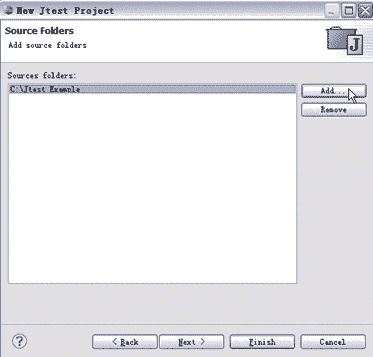
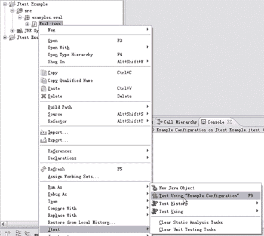
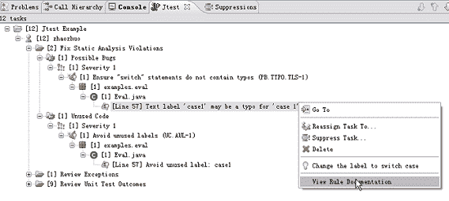
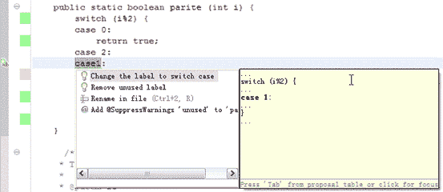
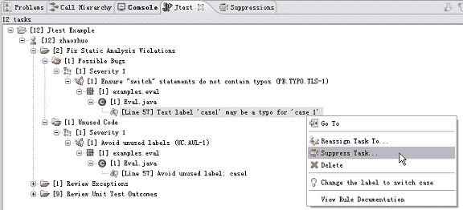
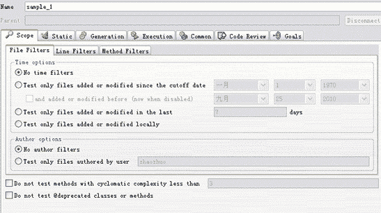
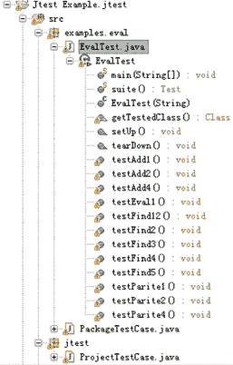
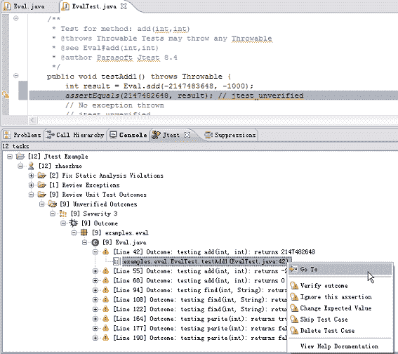

# 使用 Jtest：一款优秀的 Java 代码优化和测试工具

> 原文：[`developer.ibm.com/zh/articles/j-lo-jtest/`](https://developer.ibm.com/zh/articles/j-lo-jtest/)

## Jtest 简介

Jtest 是 Parasoft 公司推出的一款针对 Java 语言的自动化代码优化和测试工具，它通过自动化实现对 Java 应用程序的单元测试和编码规范校验，从而提高代码的可靠性以及 Java 软件开发团队的开发效率。

### 主要功能

**静态代码分析：**

静态代码分析是指不运行源程序，仅通过分析源程序的语法、结构、接口等来检查程序正确性，找出代码隐藏的缺陷之处。

Jtest 的静态代码分析功能能够按照其内置的超过 800 条的 Java 编码规范自动检查并纠正这些隐蔽且难以修复的编码错误。同时，还支持用户自定义编码规则，帮助用户预防一些特殊用法的错误。

**自动化单元测试：**

Jtest 能自动建立测试环境，自动生成测试用例以及测试驱动程序和桩函数，自动执行白盒、黑盒和回归测试。

*   白盒测试：

Jtest 能够自动建立测试驱动程序和桩函数，当被测方法需要调用还不存在或无法访问的函数时，Jtest 则调用桩函数并返回桩函数提供的值。这种方式保证了 Jtest 能够运行任何代码分支，从而使得单元测试能够在一个不依赖被测单元外部因素的基础上完全自动化地进行。

*   黑盒测试：

Jtest 能够根据代码中定义的方法入口参数，自动生成大量黑盒测试用例，极大程度上节约黑盒测试成本。

*   回归测试：

Jtest 在首次测试一个或一组类时自动保存所有的测试输入和设置，当需要执行回归测试时，只需选择测试项目，即可重复执行原有的白盒和黑盒测试。

### 优势

优化开发资源——自动化诊断并修改超过 80% 的编码问题，使得开发团队能够显著减少在逐行检查和调试代码上花费的时间。

提高测试效率——自动化生成单元测试驱动程序、桩和测试用例，节省测试成本，并对大型团队测试文件共享提供支持。

## 使用 Jtest 进行代码优化和测试

### Jtest 试用版获取

登陆 Jtest 主页 `http://www.parasoft.com/jsp/products/home.jsp?product=Jtest`，点击 EVALUATION 按钮，注册用户并登陆，在表单中选择要试用的产品和安装平台，提交表单。随后您将会收到 Parasoft 公司的邮件以及 Jtest 软件试用版申请表格，填写个人具体信息之后您将获得试用期为 3 个月的 Jtest 软件试用版。

### 基于 Eclipse 安装 Jtest 插件

首先下载 Eclipse，并完成本地安装。下载 Jtest Eclipse 插件安装程序，双击运行，并提供已有的 Eclipse 安装路径。本文选择 jtest_win32_eclipse_plugin_8.4.20.exe 版本安装程序。

### 运行 Jtest

**创建项目实例**

使用 Jtest 进行代码优化，开发人员既可以创建全新的 Java 项目，也可以通过下面两种方式创建 Jtest 项目，并导入现有 Java 代码：

1.  file>new>Project>Jtest>Create Project Detecting Existing Layout。

    这种方式允许开发测试人员将已有的代码层次结构导入到工作空间中。如图 1，假设已有本地项目 C:\Example，可以选择将其全部或者部分层次结构导入到当前工作空间中。

##### 图 1\. 将已有代码结构导入项目


1.  file>new>Project>Jtest>Create Project Specifying Source Folders。

    这种方式允许开发测试人员自定义代码层次结构。用户可以通过图 2 中的对话框，根据需求，任意添加或删除文件夹，组成新建项目的代码结构。

##### 图 2\. 自定义代码结构



在本文中，作者将创建全新的 Java 实例项目 Jtest Example，在此项目中的 src 文件夹中创建包 example.eval，并在该包中新建 Java 文件 Eval.java。以下为 Eval.java 的示例代码，此示例也将作为后文中讲解 Jtest 功能的演示代码。

##### 清单 1\. Eval.java 的示例代码

```
 package examples.eval;
    public class Eval
    {
     /**
    * 接收 int 类型输入 i，判断其奇偶性
    * @param i
    * @return boolean.
    * 如果 i 为偶数，返回 true, 如果 i 为奇数，返回 false
    *
    */
    public static boolean parite (int i) {
       switch (i%2) {
       case 0:
       return true;
       case 2:
       case1:
       return false;
       case -1:
       return false;
       }
    return false;
    }

     /*** 计算输入参数 i1 和 i2 的和
    * @param i1
    * @param i2
    * @ 返回 i1+i2
    */
    public static int add (int i1, int i2) {
           return i1 + i2;
       }

    /**
    * 获取字符串 s 的第 i 个字符
    * @param i
    * @param s
    * @ 返回字符串 s 的第 i 个字符
    */
    public char find(int i,String s) {
    return s.charAt(i);
    }
    } 
```

项目创建完成后，点击 Window-> Open Perspective -> Other，选择 Jtest 视图查看已经创建的项目，以及运行 Jtest 进行代码检查和单元测试的结果。

**代码规范检查**

Jtest 不仅为用户提供了基于其内置 Java 编码规范的代码检查，还提供了基于用户自定义的 Java 编码规范的代码检查。同时，Jtest 还支持自动修复代码规范错误和访问代码规范描述信息等功能。下面将针对以上几种功能为您进行详细的阐述：

*   运行 Java 编码规范检查

此处以前文中建立的项目 Jtest Example 为例，演示如何对 Java 代码进行编码规范检查。

如图 3 中，选择 Jtest->Test Using Default Configuration 运行编码规范检查。Default Configuration 是 Jtest 内置的默认检查配置，用户也可以在 Test Configuration 对话框中更改 Jtest 默认检查配置或创建用户自定义检查配置，关于如何修改代码检查配置及自定义编码规范，本章最后将会为读者详细介绍。

##### 图 3\. 运行默认编码规范检查



图 4 中是对 Eval.java 执行代码规范检查的结果。默认情况下，执行代码规范检查时，单元测试也会一并触发。其中选项卡上方的红叉表示在对应检查项中发现了错误或警告。在 Static 选项卡中，我们可以看到此次执行检查过程中，被检查的文件个数，运行失败的次数，违反代码规范的个数 ( 在本例中发现了 2 个）以及此次检查耗时等信息。此外，在 Generation 与 Execution 选项卡中，显示了单元测试的相关信息。通过点击左下方的 Report 按钮，开发人员可以将此次检查结果报告导出到本地。

##### 图 4\. 代码规范检查结果


检查执行完毕后，可以通过打开 Jtask 窗口中的树形结构查看更详细的检查结果。在该树形结构中，Fix Static Analysis Violations 节点记录了所有到被检查代码中违反编码规范的缺陷。在本例中，共检查到两条违反编码规范缺陷。如图 5 中，选中一条违反编码规范记录，点击右键选择 View Rule Documentation，可查看相应代码的编码规范描述信息。

##### 图 5\. 代码规范检查详细结果



*   自动修复代码规范错误

以第一条代码规范错误为例，双击”[Line: 57] Text label ‘case1’ may be typo for ‘case 1”节点，代码编辑器中会自动定位并高亮显示错误代码。点击代码左侧黄色图标，Jtest 会弹出对于当前错误的建议修改方案，选择 Change the label to switch case，Jtest 会自动修复当前代码错误，即将代码中的字段：”case1”自动修改为”case 1”。自动修复错误后，代码左侧的黄色图标会消失，Jtask 窗口中的错误信息也会被删除。

##### 图 6\. 自动修复代码规范错误



另外，Jtest 还支持开发人员对特定错误的报告信息的忽略和删除。当开发人员希望忽略当前违反编码规范错误时，可打开 Jtask 窗口，选中一条违反编码规范记录，点击右键，选择 Suppress Task。

##### 图 7\. 忽略编码规范错误



在弹出的 Reason for the suppression 对话框中填写忽略原因，点击 OK。当开发人员希望取消 Suppression 时，可以在 Suppression 窗口中将该 Suppression 删除。

*   用户自定义 Java 编码规范检查

Jtest 不仅支持基于其默认的代码检查配置进行静态代码检查，同时还支持用户定制代码检查配置甚至自定义编码规则，这一功能使得开发人员可以基于不同场景定制所需要的编码规范。

在菜单栏中选择 Jtest->Test Configurations，打开 Test Configurations 对话框。右键单击 User Defined，选择 New，在 Test Configurations 右侧面板上的 Name 文本框中填写新的名称，如”sample_1”。

##### 图 8\. 用户自定义代码检查配置面板



右侧面板为配置方案的创建者提供了如下几类选项卡：Scope，Static，Generation，Execution，Common，Code Review，Goals。其中开发人员可以根据需求，定制选项卡中的详细配置。在 Static 选项卡中，Jtest 为用户提供了代码检查规范的定制。用户可以在 Rule Tree 中勾选需要的 Jtest 内置代码规范，同时也可以使用 Import 导入功能或者 RuleWizard 功能创建自定义编码规则。

下图 9 中为 Rule Tree 中关于 Unused Code 编码规范的默认定义片段。当规则制定者选中了 Avoid empty static initializers 选项后，Jtest 则会在静态代码检查中判断被检测代码中是否存在空的静态变量初始化，若有，则报告错误。

##### 图 9\. Rule Tree 片断


**自动创建和执行单元测试**

Jtest 能够自动建立测试环境，生成测试用例，测试驱动程序和桩函数，执行白盒、黑盒和回归测试。下面本文将依次介绍使用 Jtest 进行白盒测试，黑盒测试和回归测试。

*   白盒测试

在白盒测试中，Jtest 自动检查未捕获的运行时异常，生成运行时异常报告。此处仍以 Eval.java 为例，右键选择 Jtest->Test Using Default Configuration 后，可以看到 Jtest 自动生成了新的项目 Jtest Example.jtest。在该测试项目中，Jtest 为 Eval.java 类自动生成的测试用例类 EvalTest.java，并 Jtest 针对 Eval.java 中的三个方法 add，find，parite 分别构造了一组测试用例。图 10 为 EvalTest.java 的结构。

##### 图 10\. EvalTest.java 代码结构



打开 Jtask 窗口，选择 Review Exceptions 节点，查看白盒测试发现的所有未捕捉的运行时异常。以第一条为例，双击”[Line: 106] java.lang.StringIndexOutOfBoundsException: String index out of range: 1”节点，代码编辑器中会自动定位相应代码。

##### 图 11\. 查看未捕捉运行时异常


点击代码编辑器左侧黄色图标，打开 Jtest 对该未捕捉的运行时异常的修改建议，手工进行修复。

##### 图 12\. 修复未捕捉运行时异常


*   黑盒测试

在黑盒测试过程中，Jtest 为被测类的方法生成大量测试输入参数，自动为每一组输入参数确定预期的输出结果，并以 JUnit 断言形式添加到生成的测试用例代码中。

对 Eval.java 执行 Jtest->Test Using Default Configuration 后，在 Jtask 窗口中的 Review Unit Test Outcomes 节点中查看黑盒测试结果。开发人员可通过对某一测试结果右键单击 Go To 查看 Jtest 生成的测试用例中相应代码及 JUnit 断言。

##### 图 13\. 查看黑盒测试结果



以 testAdd1() 为例，该方法测试了 -2147483648 与 -1000 的和，并将预期结果设置为 2147482648。因此开发人员只需要判断实际输出是否为 Jtest 的预设结果。若预设正确，可通过点击 Verify outcome 可验证预期输出结果；若预设错误，可点击 Change Expected Value 更改预期结果。

##### 图 14\. 验证预期结果（ 查看大图 ）


*   回归测试

当 Jtest 第一次运行单元测试时，它会创建一个关于当前被测试类及测试参数的快照。当一个被测试类修改了，可以重新运行测试用例来检查是否出现错误。

当需要对 Eval.java 类进行执行回归测试时，用户可以打开 Jtest Example.jtest 工程，重新运行 EvalTest。假设我们将 Eval.java 类 startsWith 方法中的 73 行处的”i1 + i2”改为”i1 + i2 + i2”，再次运行测试用例，在回归测试结果中可以发现，Jtest 报告了新错误”Review Assertion Failures”。

##### 图 15\. 查看回归测试结果


这个错误表明 Jtest 探测到被测类在此次测试与上一次测试之间一段时间内被修改过，开发测试人员可根据需求判断是否保持该更新。

### Jtest 其他特性

**检查内存泄漏**

执行单元测试时，Jtest 会自动检测内存泄漏。如果测试结束时内存仍然没有被释放，Jtest 将会报告内存泄漏错误。

在菜单栏中选择 Jtest->Test Configurations，打开 User Defined，选择当前使用的测试方案配置，如”Example Configuration”，在右侧面板上的 Execution->Options 选项卡中激活 detect memory leaks 选项，点击 Apply。

**查看测试覆盖信息**

Jtest 能够实时跟踪测试覆盖率，随后在覆盖率窗口中图形化显示当前被执行测试的代码的覆盖率信息。

选择 Jtest->Test Configurations，打开 User Defined，选择当前使用的测试方案配置，如”Example Configuration”，在右侧面板上的 Execution->Options 选项卡中激活 Report executable line coverage 选项，并根据具体需求选择其子选项，点击 Apply。

开发或测试人员可以在代码编辑器中打开被测类文件，当代码对应的编辑器左侧为绿色，则表示该行代码已经被覆盖；红色则表示该行代码尚未被覆盖；无色则表示该行代码不能被执行。图 16 中 Eval.java 类中的 return false 语句不能被覆盖。同时，Coverage 窗口也显示了被测类及其方法的覆盖率统计，图中对于 Eval.java 的测试覆盖率达到了 88%。

##### 图 16\. 查看测试覆盖率


## 总结

本文分别从工作原理，主要功能和具体使用几个方面介绍了一款优秀的 Java 代码优化和测试工具 Jtest。Jtest 通过单元测试和代码规范检查，以自动化的方式，实现了代码基本错误的预防和优化。使用 Jtest 能够帮助软件开发和测试人员有效减少软件开发和维护的时间成本，提高软件的质量。