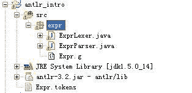
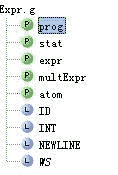
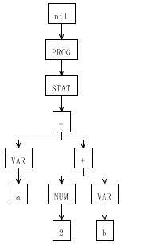
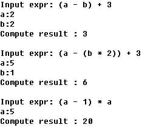
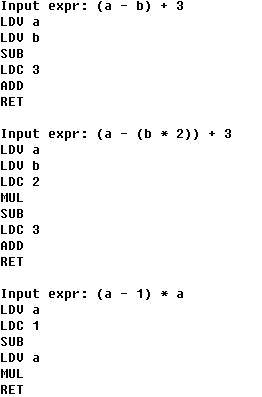

# 使用 Antlr 开发领域语言

> 原文：[`developer.ibm.com/zh/articles/j-lo-antlr/`](https://developer.ibm.com/zh/articles/j-lo-antlr/)

## Antlr 简介

1.  ANTLR 语言识别的一个工具 (ANother Tool for Language Recognition) 是一种语言工具，它提供了一个框架，可以通过包含 Java, C++, 或 C# 动作（action）的语法描述来构造语言识别器，编译器和解释器。 计算机语言的解析已经变成了一种非常普遍的工作，在这方面的理论和工具经过近 40 年的发展已经相当成熟，使用 Antlr 等识别工具来识别，解析，构造编译器比手工编程更加容易，同时开发的程序也更易于维护。
2.  语言识别的工具有很多种，比如大名鼎鼎的 Lex 和 YACC，Linux 中有他们的开源版本，分别是 Flex 和 Bison。在 Java 社区里，除了 Antlr 外，语言识别工具还有 JavaCC 和 SableCC 等。
3.  和大多数语言识别工具一样，Antlr 使用上下文无关文法描述语言。最新的 Antlr 是一个基于 `LL(*)` 的语言识别器。在 Antlr 中通过解析用户自定义的上下文无关文法，自动生成词法分析器 (Lexer)、语法分析器 (Parser) 和树分析器 (Tree Parser)。

## Antlr 能做什么

### 编程语言处理

识别和处理编程语言是 Antlr 的首要任务，编程语言的处理是一项繁重复杂的任务，为了简化处理，一般的编译技术都将语言处理工作分为前端和后端两个部分。其中前端包括词法分析、语法分析、语义分析、中间代码生成等若干步骤，后端包括目标代码生成和代码优化等步骤。

Antlr 致力于解决编译前端的所有工作。使用 Anltr 的语法可以定义目标语言的词法记号和语法规则，Antlr 自动生成目标语言的词法分析器和语法分析器；此外，如果在语法规则中指定抽象语法树的规则，在生成语法分析器的同时，Antlr 还能够生成抽象语法树；最终使用树分析器遍历抽象语法树，完成语义分析和中间代码生成。整个工作在 Anltr 强大的支持下，将变得非常轻松和愉快。

### 文本处理

当需要文本处理时，首先想到的是正则表达式，使用 Anltr 的词法分析器生成器，可以很容易的完成正则表达式能够完成的所有工作；除此之外使用 Anltr 还可以完成一些正则表达式难以完成的工作，比如识别左括号和右括号的成对匹配等。

## Antlr 的安装

1.  Antlr 本身是使用 Java 开发的，在使用 Antlr 之前必须先安装 JRE(Java Runtime Environment )。Antlr 需要 Java 1.4 或者 1.4 以上版本。然后我们在 [Antlr 的主页](http://www.antlr.org/download.html) 上下载 Antlr 的 Jar 包 antlr-3.2.jar，最新的 Jar 包可能已经升级。把 Jar 添加到 CLASSPATH 环境变量之后，即可使用 Anltr。在 window 中，修改 CLASSPATH 为

    ```
    CLASSPATH = %CLASSPATH%; C:/ antlr-3.2.jar 
    ```

2.  至此已经可以运行 Anltr, 使用的方法为 java org.antlr.Tool XXX.g, 其中 XXX.g 是我们依据 Antlr 的语法规则编写的文法文件。

3.  除了 Anltr 运行环境之外，还有一个辅助 Antlr 开发的工具 Antlrworks，在 [Antlr 的主页](http://www.antlr.org/) 上下载另一个 Jar 包 Antlrworks-1.4.jar。在 window 中，修改 CLASSPATH 为

```
CLASSPATH = %CLASSPATH%; C:/ Antlrworks-1.4.jar 
```

运行 java org.antlr.works.IDE，然后在 Antlrworks 的 GUI 中新建或者打开文法文件。使用 Antlrworks 可以可视化显示文法，并可以对语法分析树和抽象语法树可视化。

## 表达式定义

### 文法定义

我们定义一个最简单的领域语言，从一个简单的完成算术运算的例子出发，详细说明 Antlr 的使用。首先我们需要创建一个 Antlr 的文法文件， 一般以 .g 为文件名后缀，命名为 Expr.g 。

在这个文法文件中根据 Antlr 的语法规则来定义算术表达式的文法，文件的头部是 grammar 关键字，定义文法的名字：

```
grammar Expr; 
```

为了简单起见，假设我们的自定义语言只能输入一个算术表达式。从而整个程序有一个语句构成，语句有表达式或者换行符构成。如清单 1 所示：

##### 清单 1\. 程序和语句

```
prog: stat
 ;
 stat: expr
      |NEWLINE
 ; 
```

在 Anltr 中，算法的优先级需要通过文法规则的嵌套定义来体现，加减法的优先级低于乘除法，表达式 expr 的定义由乘除法表达式 multExpr 和加减法算符 (‘+’|’-‘) 构成；同理，括号的优先级高于乘除法，乘除法表达式 multExpr 通过原子操作数 atom 和乘除法算符 (‘*’|’/’) 构成。整个表达的定义如清单 2 所示：

##### 清单 2\. 表达式

```
Expr : multExpr (('+'|'-') multExpr)*
 ;
 multExpr : atom (('*'|'/') atom)*
 ;
 atom:  '(' expr ')'
       | INT
    | ID
 ; 
```

最后需要考虑的词法的定义，在 Antlr 中语法定义和词法定义通过规则的第一个字符来区别， 规定语法定义符号的第一个字母小写，而词法定义符号的第一个字母大写。算术表达式中用到了 4 类记号 ( 在 Antlr 中被称为 Token)，分别是标识符 ID，表示一个变量；常量 INT，表示一个常数；换行符 NEWLINE 和空格 WS，空格字符在语言处理时将被跳过，skip() 是词法分析器类的一个方法。如清单 3 所示：

##### 清单 3\. 记号定义

```
ID : ('a'..'z' |'A'..'Z')+ ;
 INT : '0'..'9' + ;
 NEWLINE:'\r' ? '\n' ;
 WS : (' ' |'\t' |'\n' |'\r' )+ {skip();} ; 
```

Antlr 支持多种目标语言，可以把生成的分析器生成为 Java，C#，C，Python，JavaScript 等多种语言，默认目标语言为 Java，通过 options {language=?;} 来改变目标语言。我们的例子中目标语言为 Java。

### 运行 Antlr

完成文法定义之后，即可以运行 Antlr，为我们生成需要的词法分析器和语法分析器。在命令行运行以下下命令，如清单 4 所示：

##### 清单 4\. 运行 Antlr

```
java  org.antlr.Tool  c:/
antlr_intro\src\expr\Expr.g 
```

`成功运行` Antlr `之后，将为我们生成 3 个文件，` Expr.tokens `、` ExprLexer.java `和` ExprParser.java `。其中` Expr.tokens `为文法中用到的各种符号做了数字化编号，我们可以不关注这个文件。` ExprLexer `是` Antlr `生成的词法分析器，` ExprParser `是` Antlr 生成的语法分析器，如图 1 所示。

##### 图 1\. Antlr 生成结果



### 表达式验证

基于 Antlr 生成的词法分析器和语法分析器后，可以基于它们来验证我们的输入的表达式是否合法。我们需要调用 Antlr 的 API 完成以下 Java 程序，如清单 5 所示：

##### 清单 5\. 调用分析器

```
public static void run(String expr) throws Exception {
 ANTLRStringStream in = new ANTLRStringStream(expr);
 ExprLexer lexer = new ExprLexer(in);
     CommonTokenStream tokens = new CommonTokenStream(lexer);
     ExprParser parser = new ExprParser(tokens);
     parser.prog();
 } 
```

对每一个输入的字符串，我们构造一个 ANTLRStringStream 流 in，用 in 构造词法分析器 lexer，词法分析的作用是产生记号，用词法分析器 lexer 构造一个记号流 tokens，然后再使用 tokens 构造语法分析器 parser，至此已经完成词法分析和语法分析的准备工作。最终调用语法分析器的规则 prog，完成对表达式的验证。详细的 Java 程序参考样例代码中的 Test.java。

当输入合法的的表达式时，分析器没有任何输出，表示语言被分析器接受；当输入的表达式违反文法规则时，比如”a + (b * 3”，分析器输出 line 0:-1 mismatched input ‘<eof>‘ expecting ‘)’；提示期待一个右括号却遇到了结束符号。如图 2 所示：</eof>

##### 图 2\. 表达式验证结果


### 文法可视化

使用 Antlrworks 打开 Expr.g，Antlrworks 对每一个文法定义都做了可视化显示。整体的文法定义如图 3：

##### 图 3\. 文法定义的可视化



其中语法规则和词法记号的定义都有对应的图形表示方式。比如语法规则 atom 的图示形式如图 4 所示：

##### 图 4\. 语法规则 atom 的可视化


词法记号 ID 的图示形式如图 5 所示：

##### 图 5\. 词法记号 ID 的可视化


使用 Antlrworks 还可以对语法分析树可视化，在 Antlrworks 的 GUI 窗口中，点击 Run ->Debug, 在 Input Text 窗口中输入 a+(2 + b)，Start Rule 选择 prog, 然后完成调试，可以看到 a+(2 + b) 时的语法分析树，如图 6 所示：

##### 图 6\. a+(2+b) 的语法分析树


## 表达式求值

### 抽象语法树

截至目前使用 Anltr 生成的词法分析器和语法分析器，除了校验表述式输入合法性之外，没有更多的用处。如果需要对表达式做进一步的处理，对表达式的运算结果求值，使用 Antlr 可以有两种选择，第一，直接在我们之前的 Expr 文法中嵌入动作，加入 Java 代码片段；第二，使用 Antlr 的抽象语法树语法，在语法分析的同时将用户输入转换成中间表示方式：抽象语法树，后续在遍历语法树的同时完成计算。

第二种方法在结构上更为清晰，便于开发和维护，我们使用第二种方法完成表达式的求值。首先来建立抽象语法树，Antlr 中建立抽象语法树只需在原来文法的基础上加上建树语法即可。改写我们的 Expr 文法，在每一个语法规则后，加上相应的抽象语法树语法。清单 6，展示了程序和语句规则对应的抽象语法树节点。其 ^ 符用于指示树的根节点，PROG 和 STAT 是我们引入的占位符号，仅仅是一个字符串，用于区别不同的节点。

##### 清单 6\. 程序和语句的抽象语法树节点

```
prog : stat -> ^(PROG stat);
 stat : expr EOF  -> ^(STAT expr) 
```

除了可以使用占位符做根节点外，算符也可以直接作为根节点，如清单 7 所示，加减乘除 4 个算符分别作为抽象语法树的根节点来建立树。

##### 清单 7\. 表达式的抽象语法树节点

```
expr : multExpr (('+'|'-')^ multExpr)*
 ;
 multExpr : atom (('*'|'/')^ atom)*
 ;
 atom :   '(' expr ')' -> expr
       | INT -> ^(NUM INT)
       | ID  -> ^(VAR ID)
 ; 
```

再次使用 Antlrworks 打开 Expr.g，在调试窗口输入表达式 a+(2 + b)，完成调试可以看到 a+(2 + b) 对应的抽象语法树如图 7 所示。整个表达式是一个 PROG，PROG 中包含了一个 STAT，而 STAT 是由一棵表达式构成的。

##### 图 7\. a+(2+b) 的抽象语法树



### 解释器

抽象语法树建立之后，可以使用 Antlr 的树分析器来构造表达式的解释器。树分析器的语法和前面的表达式文法有所区别，创建一个 Eval.g 文件，文件的头部通过 tree grammar 来标识这是一个树分析器。

```
tree grammar Eval; 
```

之后对抽象语法树节点逐一加入语义动作，完成最终的解释执行。树分析器会深度优先遍历抽象语法树，当 PROG 节点返回时，完成整个计算，输出计算结果。STAT 拥有一个返回值，它的值取决于表达式的值。如清单 8 所示：

##### 清单 8\. 程序和语句的解释

```
prog : ^(PROG s=stat) {System.out.println("Compute result : " + s.value);};
 stat returns[Integer value]
 : ^(STAT e=expr) {$value = e.value;}
 ; 
```

表达式同样拥有返回值，算术运算的求值只需用左子节点的值和右子节点的值完成对应的运算即可；叶子节点 atom，如果输入是一个常量，直接求出常量代表的值；如果输入是一个变量，简单起见，我们用一个随机数来为其赋值，如清单 9 所示。实际应用中，可以替换为从数据库中或者从文件中读入变量的值。

##### 清单 9\. 表达式的解释

```
expr returns[Integer value]
 :    ^('+' e1=expr e2=expr) {$value = e1.value + e2.value;}
     | ^('-' e1=expr e2=expr) {$value = e1.value - e2.value;}
   | ^('*' e1=expr e2=expr) {$value = e1.value * e2.value;}
 | ^('/' e1=expr e2=expr) {$value = e1.value / e2.value;}
     | a=atom {$value = a.value;}
 ;
 atom returns[Integer value]
 :     ^(NUM i=INT) {$value = Integer.parseInt(i.getText());}
      |  ^(VAR v=ID){ Random rand = new Random(); $value = rand.nextInt(10);}
 ; 
```

完成 Eval.g 的编辑之后，再次运行 Antlr.

```
java org.antlr.Tool c:/ antlr_intro\src\intepreter\Eval.g 
```

Antlr 生成了树分析器 Eval.java。使用 Antlr 的 API 完成以下 java 代码，如清单 10 所示。至此完成了对输入表达式的解释求值。

##### 清单 10\. 调用解释器

```
public static void run(String expr) throws Exception {
     ANTLRStringStream in = new ANTLRStringStream(expr);
     ExprLexer lexer = new ExprLexer(in);
     CommonTokenStream tokens = new CommonTokenStream(lexer);
     ExprParser parser = new ExprParser(tokens);
     ExprParser.prog_return ret = parser.prog();
     CommonTree t = (CommonTree)ret.getTree();
     CommonTreeNodeStream nodes = new CommonTreeNodeStream(t);
     nodes.setTokenStream(tokens);
     Eval e_walker = new Eval(nodes);
     e_walker.prog();
 } 
```

解释器执行结果如图 8 所示：

##### 图 8\. 解释的输出结果



### 编译器

编译执行和解释执行相比，需要依赖于特定的目标机器，而解释执行不需要。表达式求值的语义不是十分复杂，在这里我们假设有一台这样机器，它用堆栈进行运算，支持以下 7 种指令，如表 1 所示：

##### 表 1\. 抽象机的 7 条指令

| **指令** | **说明** | **操作数个数** | **语义** |
| --- | --- | --- | --- |
| LDV | Load Variable | 1 | 变量入栈 |
| LDC | Load Constant | 1 | 常量入栈 |
| ADD | Add | 0 | 栈顶两个元素出栈，求和后入栈 |
| SUB | Subtract | 0 | 栈顶两个元素出栈，求差后入栈 |
| MUL | Multiply | 0 | 栈顶两个元素出栈，求积后入栈 |
| DIV | Divide | 0 | 栈顶两个元素出栈，求商后入栈 |
| RET | Return | 0 | 栈顶一个元素出栈，计算结束 |

和之前的解释器类似，创建一个 Compiler.g 树分析器文件，其中各个表达式的编译方案如清单 11 所示：

##### 清单 11\. 表达式的编译

```
prog : ^(PROG s=stat) {System.out.println("RET");};
 stat
 : ^(STAT e=expr)
 ;
 expr
 :     ^('+' e1=expr e2=expr) {System.out.println("ADD");}
     | ^('-' e1=expr e2=expr) {System.out.println("SUB");}
    | ^('*' e1=expr e2=expr) {System.out.println("MUL");}
     | ^('/' e1=expr e2=expr) {System.out.println("DIV");}
     | a=atom
 ;
 atom
 :      ^(NUM i=INT) {System.out.println("LDC "+i.getText());}
      |  ^(VAR v=ID)  {System.out.println("LDV "+v.getText());}
 ; 
```

完成 Compiler.g 的编辑之后，再次运行 Antlr.

`java org.antlr.Tool c:/ antlr_intro\src\Compiler\Compiler.g`

Antlr 生成了树分析器 Compiler.java。 `使用` Antlr `的 API 完成以下` java `代码，如清单 12 所示` 。至此完成了把表达式编译为抽象机的指令。

##### 清单 12\. 调用编译器

```
public static void run(String expr) throws Exception {
     ANTLRStringStream in = new ANTLRStringStream(expr);
     ExprLexer lexer = new ExprLexer(in);
     CommonTokenStream tokens = new CommonTokenStream(lexer);
     ExprParser parser = new ExprParser(tokens);
     ExprParser.prog_return ret = parser.prog();
     CommonTree t = (CommonTree)ret.getTree();
     CommonTreeNodeStream nodes = new CommonTreeNodeStream(t);
     nodes.setTokenStream(tokens);
     Compiler c_walker = new Compiler(nodes);
     c_walker.prog();
 } 
```

编译的输出结果如图 9 所示：

##### 图 9\. 编译器的输出结果



## 结束语

本文用算术表达式作为例子，全面展示 Antlr 的使用方法，Antlrworks 的使用方法，以及 Antlr 三大主要功能，词法分析器、语法分析器和树分析器。当你需要开发一种语言时，可以考虑使用 Antlr 作为你的助手。