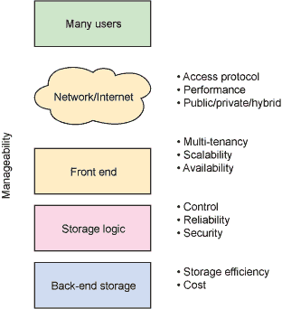
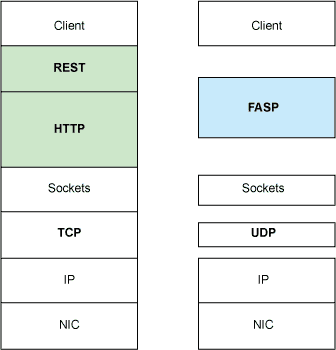
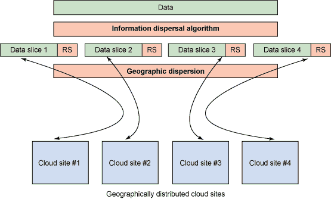

# 云存储基础架构剖析

> 原文：[`developer.ibm.com/zh/articles/cl-cloudstorage/`](https://developer.ibm.com/zh/articles/cl-cloudstorage/)

以目前数据增长的速度来看，云存储越来越流行不足为奇。增长速度最快的数据是归档数据，鉴于很多因素它是云存储的理想之选，这些因素包括成本、访问频率、保护和可用性。但是并非所有云存储都是相同的。一家提供商可能主要关注于成本，而另一家提供商关注于可用性或性能。没有一个架构具有单一侧重点，但是一个架构实现给定特征的程度定义了其市场和适当的使用模型。

##### 常用缩略词

*   API：应用程序编程接口
*   FTP：文件传输协议
*   HTTP：超文本传输协议
*   HTTPS: 通过安全套接字层的 HTTP
*   JFS: 日志文件系统
*   NFS：网络文件系统
*   NIC：网络接口卡
*   RAID：独立磁盘冗余阵列
*   REST：具象状态传输
*   SAN：存储区域网络
*   SCSI：小型计算机系统接口
*   SLA：服务级别协议
*   TCP：传输控制协议
*   UDP：用户数据报协议
*   WAN：广域网

不从效用角度谈论架构是很难的。我的意思是，通过各种特征度量一个架构，包括成本、性能、远程访问，等等。因此，我首先定义一组可度量云存储模型的标准，然后探究云存储架构内的一些有趣的实现。

首先，我们讨论一个通用的云存储架构，设置上下文以供后面探究独特的架构特性。

## 通用架构

云存储架构主要关乎以一个高度可扩展和多租户的方式按需交付存储。通用（参见 图 1\. 通用的云存储架构）的云存储架构包含一个导出 API 以访问存储的前端。在传统的存储系统中，这个 API 是 SCSI 协议；但是在云环境中，这些协议在演化。在那里您可以找到 Web 服务前端、基于文件的前端，甚至更多传统前端（比如 Internet SCSI 或 iSCSI）。在前端后面是一个中间件层，我将它称作*存储逻辑*。该层通过传统的数据放置算法（考虑地理布局）实现各种功能，比如复制和数据简缩。最后，后端实现对数据的物理存储。这可能是一个实现特定功能的内部协议或物理磁盘的一个传统后端。

##### 图 1\. 通用的云存储架构

从图 1 中，您可以看到当前云存储架构的一些特征。注意，没有特征在特定层中是独有的，而是充当本文探讨的特定主题的指导。这些特征的定义见表 1\. 云存储特征。

##### 表 1\. 云存储特征

| 特征 | 说明 |
| --- | --- |
| 可管理性 | 以最少的资源管理系统的能力 |
| 访问方法 | 公开云存储所用的协议 |
| 性能 | 根据宽带和延迟衡量的性能 |
| 多租户 | 支持多个用户（或承租者） |
| 可扩展性 | 通过扩展满足更高要求或以得体的方式加载的能力 |
| 数据可用性 | 对一个系统的正常运行时间的衡量 |
| 控制 | 控制系统的能力 — 特别是为成本、性能或其他特征进行配置 |
| 存储效率 | 度量如何高效使用原始存储 |
| 成本 | 度量存储成本（通常以美元每 GB 为单位） |

### 可管理性

云存储的一个重点是成本。如果客户可以购买并在本地管理存储，而不是在云中租赁它，那么云存储市场就会消失。但是成本可划分为两个高级类别：物理存储生态系统本身的成本和管理它的成本。管理成本是隐式的，但却是总体成本的一个长期组成部分。为此，云存储必须能在很大程度上进行自我管理。引入新存储（其中系统通过自动自我配置来容纳它）的能力和在出现错误时查找和自我修复的能力很重要。在未来，诸如自主计算这样的概念将在云存储架构中起到关键的作用。

### 访问方法

云存储与传统存储之间最显著的差异之一是其访问方法（参见图 2\. 云存储访问方法）。大部分提供商实现多个访问方法，但是 Web 服务 APIs 是常见的。许多 APIs 是基于 REST 原则实现的，即在 HTTP 之上开发（使用 HTTP 进行传输）的一种基于对象的方案。REST APIs 是无状态的，因此可以简单而有效地予以提供。许多云存储提供商实现 REST APIs，包括 Amazon Simple Storage Service (Amazon S3)、Windows Azure™ 和 Mezeo Cloud Storage Platform。

Web 服务 APIs 的一个问题是，它们需要与应用程序集成，以利用云存储。因此，对云存储也使用常见的访问方法来提供即时集成。例如，NFS/Common Internet File System (CIFS) 或 FTP 等基于文件的协议，iSCSI 等基于块的协议。Nirvanix、Zetta 和 Cleversafe 等云存储提供商提供这些访问方法。

尽管上面提到的协议是最常用的，但也有适合云存储的其他协议。最有趣的其中一个是基于 Web 的分布式创作与版本控制（WebDAV）。WebDAV 也基于 HTTP，且将 Web 作为一种可读写的资源加以启用。WebDAV 的提供商包括 Zetta 和 Cleversafe 等。

##### 图 2\. 云存储访问方法

您还可以寻找支持多协议访问的解决方案。例如，IBM® Smart Business Storage Cloud 从同一存储虚拟化架构同时启用基于文件（NFS 和 CIFS）的协议和基于 SAN 的协议。

### 性能

性能表现为很多方面，但是在用户与远程云存储提供商之间移动数据的能力是云存储最大的挑战。问题就是 TCP，它同时也是互联网的主力。TCP 基于数据包确认从对等端点控制数据流。数据包丢失或延迟到达情况下将启用阻塞控制，进一步限制性能以避免更多全局网络问题。TCP 适用于通过全局 Internet 启用小量数据，但不适用于会增加往返时间（RTT）的大型数据移动。

通过 Aspera Software，Amazon 解决了这个问题，方法就是从程式中删除 TCP。且开发了一个称为 *Fast and Secure Protocol* (FASP™) 的新协议，以在大型 RTT 和严重数据包丢失情况下加速批量数据移动。关键是 UDP 的使用，它是 TCP 的缔约方传输协议。UDP 允许主机管理阻塞，将这个方面推进到 FASP 的应用层协议中（参见图 3\. Aspera Software 上的 Fast and Secure Protocol）。

##### 图 3\. Aspera Software 上的 Fast and Secure Protocol

通过标准（非加速）NICs、FASP 有效使用应用程序可用带宽，并移除传统的批量数据传输模式的基本瓶颈。 参考资料部分提供在传统 WAN、洲际传输和有损卫星链接中 FASP 性能相关的一些有趣统计信息。

### 多租户

云存储架构的一个关键特征称为*多租户*。这只是表示存储由多个用户（或多个“承租者”）使用。多租户应用于云存储堆栈的多个层，从应用层（其中存储名称空间在用户之间是隔离的）到存储层（其中可以为特定用户或用户类隔离物理存储）。多租户甚至适用于连接用户与存储的网络基础架构，向特定用户保证服务质量和优化带宽。

### 可扩展性

您可以从多个方面看待可扩展性，但正是云存储的随需视图使其最具吸引力。扩展存储需求（向上和向下）可改善用户成本，提高云存储提供商的复杂性。

不仅要为存储本身提供可扩展性（功能扩展），而且必须为存储带宽提供可扩展性（负载扩展）。云存储的另一个关键特性是数据的地理分布（地理可扩展性），支持经由一组云存储数据中心（通过迁移）使数据最接近于用户。对于只读数据，也可以进行复制和分布（使用内容传递网络完成）。这如图 4\. 云存储的可扩展性所示。

##### 图 4\. 云存储的可扩展性

在内部，一个云存储架构必须能够扩展。服务器和存储必须能够在不影响用户的情况下重新调整大小。正如在可管理性部分所讨论的，自主计算是云存储架构所必需的。

### 可用性

如果一个云存储供应商有用户的数据，它必须能够应求将该数据提供给用户。鉴于网络中断、用户错误和其他情况，这很难以一种可靠而确定的方式予以提供。

有一些有趣而新颖的方案可用于解决可用性，比如信息传播。一家提供私有云存储的公司 Cleversafe（稍后介绍）使用 Information Dispersal Algorithm (IDA) 来在发生物理故障和网络中断的情况下实现更高的可用性。IDA 是由 Michael Rabin 最初为电信系统而创建的一种算法，它支持使用 Reed-Solomon 代码对数据进行切片处理，以便在数据丢失的情况下实现数据重建。此外，IDA 允许您配置数据切片的数量，这样一来，可以为一个可接纳故障将数据对象分割成 4 个切片，对 8 个可接纳故障分割成 20 个切片。与 RAID 类似，IDA 支持通过原始数据的子集重建数据，含有一定数量的代码错误开销（依赖于可接纳故障的数量）。这如图 5\. Cleversafe 用于最大化数据可用性的方法所示。

##### 图 5\. Cleversafe 用于最大化数据可用性的方法

有了为数据切片的能力以及 cauchy Reed-Solomon 纠错码，就可以将切片分发到地理上分散的站点进行存储。对于大量切片（*p*）和大量可接纳故障（*m*），最终开销是 *p*/(*p* –*m*)。因此在图 5\. Cleversafe 用于最大化数据可用性的方法中，*p* = 4 且 *m* = 1 的存储系统的开销是 is 33%。

IDA 的缺点在于，它是处理密集型的，无硬件加速。复制是另一个有用的技术，且由各个云存储提供商实现。尽管复制技术引入了大量开销（100%），但可以简单而高效地提供它。

### 控制

一名客户控制和管理其数据存储方式及其相关成本的能力很重要。许多云存储提供商实施控制，使用户对其成本有更大的控制权。

Amazon 实现 Reduced Redundancy Storage (RRS)，为用户提供最小化总存储成本的一种方式。数据是在 Amazon S3 基础架构内复制的，但使用 RRS，数据复制次数较少，且存在丢失数据的可能性。这适用于可重新创建的或在其他地方有副本的数据。Nirvanix 还提供基于策略的复制来对如何以及在何处存储数据提供更细粒度的控制。

### 效率

存储效率是云存储基础架构的一个重要特征，特别是将重点放在总成本上。下一部分专门介绍成本，但是该特征更多地是关于对可用资源的高效使用，而非成本。

要使一个存储系统更高效，必须存储更多数据。一个常见的解决方案就是数据简缩，即通过减少源数据来降低物理空间需求。实现这一点的两种方法包括*压缩* — 通过使用不同的表示编码数据来缩减数据 — 和*重复数据删除* — 移除可能存在的相同的数据副本。虽然两种方法都有用，但压缩方法涉及到处理（重新编码数据进出基础架构），而重复数据删除方法涉及到计算数据签名以搜索副本。

### 成本

云存储最显著的特征之一是通过使用降低成本的能力。这包括购置存储的成本、驱动存储的成本、修复存储的成本（当驱动器出现故障时）以及管理存储的成本。在从这个角度（包括 SLAs 和增加存储效率）看待云存储时，云存储在某些使用模型中会很有用。

云存储解决方案内的一个有趣的使用高峰由一个名为 Backblaze 的公司提供（参见 参考资料 了解详情）。Backblaze 着手于为云存储产品构建廉价存储。一个 Backblaze POD（存储架）在一个 4U 机箱中具有 67TB 的数据包，价格不到 8,000 美元。这个数据包含有一个 4U 机箱、一个主板、4GB 的 DRAM、4 个 SATA 控制器、45 个 1.5TB SATA 硬盘和两个电源。在主板上，Backblaze 运行 Linux® （以 JFS 作为文件系统）且以 GbE NICs 作为前端，使用 HTTPS 和 Apache Tomcat。Backblaze 的软件包括重复数据删除、加密功能和用于数据保护的 RAID6。Backblaze 对其 POD 的描述（详细介绍如何构建您自己的 POD）向您展示公司可以将存储成本降低多大幅度，使云存储成为一个可行且经济高效的选择。

## 云存储模型

到目前为止，我主要谈讨了云存储提供商，但是还有云存储模型可支持用户控制其数据。云存储演化为三个类别，其中一个支持合并两个类别，以提供一个经济高效而安全的选择。

本文大部分讨论了公共云存储提供商，它们将云存储基础架构作为可出租商品予以提供（从长期或短期存储和基础架构内使用的网络带宽角度来讲）。私有云使用公共云存储的概念，但是以可安全嵌入到用户防火墙内的形式。最后，混合云存储支持合并这两个模型，通过策略定义哪些数据必须私下维护，哪些可在公共云内得到安全维护（参见图 6\. 云存储模型）。

##### 图 6\. 云存储模型

云存储模型如图 6 所示。典型的公共云存储供应商包括 Amazon 和 Nirvanix（将存储作为服务提供）。典型的私有云存储提供商包括 IBM、Parascale 和 Cleversafe（为内部云构建软件和/或硬件）。最后，混合云提供商包括 Nirvanix 和 Egnyte 等。

## 前景展望

云存储是云存储模型中的一个有趣进化，它重新定义我们在企业内构建、访问和管理存储的方式。尽管云存储目前主要是一种消费技术，它在迅速向企业质量方向演化。混合云存储模型将使企业能够在一个本地数据中心内维护其机密数据，同时委托更少的机密数据到云中，以实现成本节约和地域保护。查看 参考资料 获取有关云存储提供商和独特技术的信息的链接。

本文翻译自：[Anatomy of a cloud storage infrastructure](https://developer.ibm.com/articles/cl-cloudstorage/)（2010-12-01）