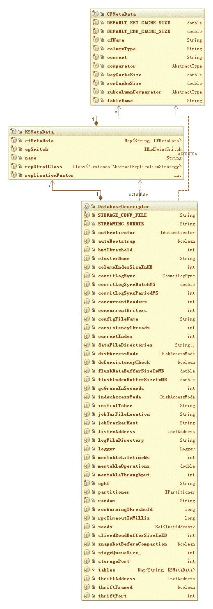
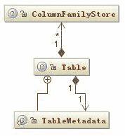
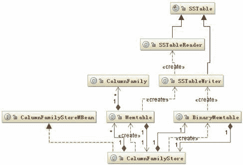
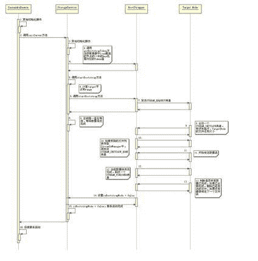
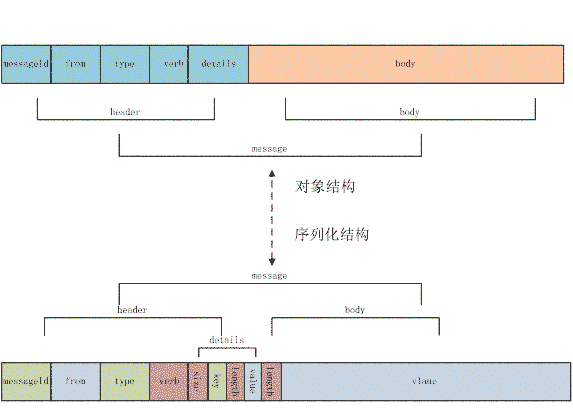
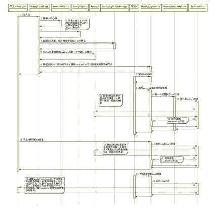
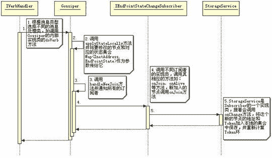

# Cassandra 分布式数据库详解：配置、启动与集群

> 原文：[`developer.ibm.com/zh/articles/os-cn-cassandraxu1/`](https://developer.ibm.com/zh/articles/os-cn-cassandraxu1/)

## Cassandra 的配置详解

了解一个软件的配置项的意义是使用这个软件的前提，这里详细介绍 Cassandra 的配置文件（storage-config.xml）中各个配置项的意义，这其中包含有很多配置参数，我们可以对其进行调整以达到理想的性能。为了节省篇幅这里没有列出 storage-config.xml 文件的内容，你可以对照着这个文件看下面的内容。

### ClusterName

Cluster Name 代表一个族的标识，它通常代表一个集群。这个配置项在 Cassandra 没有存储数据时就必须指定，当 Cassandra 第一次启动后，它就会被写到 Cassandra 的系统表中，如果你要修改 Cluster Name 必须要删除 Cassandra 中数据。

### AutoBootstrap

这个配置项看起来十分简单，但是如果你对 Cassandra 没有深入了解的话，恐怕不知道当你改变这个配置项时 Cassandra 可能会发生什么？

我们知道 Cassandra 集群是通过维护一个自适应的 Token 环来达到集群中的节点的自治理，它们不仅要保证每台机器的状态的同步和一致性还要保证它们之间 Token 分布的合理性，通过重新划分 Token 来达到每台机器的负载的均衡性。

那这个配置项与 Token 和负载又有何关联性？其实表面上看起来这个配置项是当这个节点启动时是否自动加入集群。但是，当你设置成 False 时它是不是就不加入集群呢？显然不是，这还要看你有没有配置 seeds，如果你配置了其它 seed，那么它仍然会去加入集群。

那么到底有何区别，通过分析其启动代码发现，这个配置项不仅跟 seed 配置项有关而且和 Cassandra 是否是第一次启动也有关。Cassandra 的启动规则大慨如下：

1.  当 AutoBootstrap 设为 FALSE，第一次启动时 Cassandra 会在系统表中记录 AutoBootstrap=TRUE，以表示这是由系统自动设置的，其实这个只是作为一个标志来判断你以后的启动情况。
2.  当 AutoBootstrap 设为 TRUE，第一次启动，Cassandra 会判断当前节点有没有被配置成 seed 节点，也就是在本机 ip 有没有在 seeds 中。如果在 seeds 中，Cassandra 的启动情况和 1 是一样的。
3.  当 AutoBootstrap 设为 TRUE，第一次启动，并且没有配置为 seed，Cassandra 将会有一个漫长的启动过程，当然这个时间的长短和你的当前的集群的数据量有很大的关系。这时 Cassandra 将会根据当前集群的负载，来动态调整它们的均衡。调整均衡的方式就是根据当前的 Token 环分配一个合适的 Token 给这个节点，并将这个符合这个 Token 的数据传给它。

从以上分析可以看出，AutoBootstrap 设置的主要目的是是否调整当前集群中的负载均衡。这其实还有一个很重要的问题就是，如果按照第一种情况启动，如果没有指定 Token，这个节点的 Token 将会是随机生成的，那么问题就来了，当这个随机生成是 Token 加入集群的 Token 环时，Cassandra 如何保证 Token 和 Token 所对应的数据的一致性，这个问题将在后面说明。

### Keyspaces

Cassandra 中 Keyspace 相当于关系数据库中的表空间的概念，可以理解为操作表的一个容器，它下面可以定义多个 ColumnFamily，这个 ColumnFamily 就相当于表了，它是存储数据的实体。

ColumnFamily 中几个属性的意义如下：

*   ColumnType。列的类型，有两种：Standard 和 Super，分别是标准列和超列，超列的含义是列还有一个父列。
*   CompareWith。表示的是列的排序规则，可以根据不同的数据类型进行排序如 TimeUUIDType，可以根据插入的时间排序
*   CompareSubcolumnsWith。子列的排序规则与 CompareWith 类似
*   RowsCached。查询时缓存的数据量，可以是多少条，也可以是百分比，如 10% 就是缓存 10% 的数据量，这个对查询性能影响很大，如果命中率高的话，可以显著提高查询效率。
*   KeysCached。缓存 ColumnFamily 中的 key，这个 key 就是对应到 Index.db 中的数据，如果没有在 RowsCached 中命中，那么就要到每个 SSTable 中查询，这时必然要查询 key，如果在 KeysCached 能命中就不需要到 Index.db 中查询了，省去了 IO 操作。

Cassandra 是一个 Key/Value 系统，从它的存储的逻辑结构来看分为：Keyspace、Key、ColumnFamily、Super Column 以及 Column 几个部分。很明显我们能看出每一对 Key/Value 都有一个寄生的容器，所以它实际上是由一个个 Map 容器构成的。这个容器结构可以用图 1 和图 2 来表示：

##### 图 1\. 标准的 Column 结构图


##### 图 2\. 含有 Super Column 的结构图


### ReplicaPlacementStrategy

定义数据复制策略，默认是 org.apache.cassandra.locator.RackUnawareStrategy，数据复制到其它节点没有特别的规定。org.apache.cassandra.locator.RackAwareStrategy 是将节点分为不同的 Rack，这种方式不管是存数据还是查数据，都从不同的 Rack 的节点取数据或写数据。org.apache.cassandra.locator.DatacenterShardStategy 又将节点划分为不同的 Data Center，让数据放在不同数据中心，从而保证数据的安全性，例如可以按机房划分 Data Center，从而避免一个机房出现故障，会影响整个集群。

### ReplicationFactor

定义数据要保存几个备份，结合 ReplicaPlacementStrategy 可以把数据放在不同的地方。

### EndPointSnitch

org.apache.cassandra.locator.EndPointSnitch 可以根据当前的网络情况选择更好的节点路由，一般默认即可。

### Authenticator

这个配置项可以控制数据访问的安全性，可以在 access.properties 和 passwd.properties 设置用户和密码。

### Partitioner

控制数据的分布规则，org.apache.cassandra.dht.RandomPartitioner 是随机分布，Cassandra 控制数据在不同的节点是通过 key 的来划分的，这个方式是将 key 进行 MD5 Hash，从而形成随机分布的 Token，然后根据这个 Token 将数据分布到不同的节点上。

org.apache.cassandra.dht.OrderPreservingPartitioner 是取 key 的 Ascii 字符来划分的，因此我们可以根据 key 来主动控制数据的分布，例如我们可以给 key 加一个前缀，相同前缀的 key 分布在同一个节点中。

### InitialToken

给节点分配一个初始 Token，当节点第一次启动后这个 Token 就被写在系统表中。结合 Partitioner 就可以控制数据的分布。这个配置项可以让我们能调整集群的负载均衡。

### CommitLogDirectory、DataFileDirectories

这两个配置项是设置 CommitLog 和 SSTable 存储的目录。

### Seeds

关于 Seeds 节点的配置有这样几个疑问：

1.  是不是集群中的所有节点都要配置在 seed 中。
2.  本机需不需要配置在 seed 中。

关于第二个问题在前面中已经说明了，是否配置就决定是否作为 seed 节点来启动。关于第一个问题，答案是否定的，因为即使你把集群中的所有节点都配置在 seed 中，当 Cassandra 在启动时它也不会往每个 seed 发送心跳信息，而是随机选择一个节点与其同步集群中的其他所有节点状态。几个回合后这个节点同样能够获取集群中所有的节点的列表。这就是集群自治理的优点，只要能发现其中一个节点就能发现全部节点。

### ListenAddress

ListenAddress 这个配置是用来监听集群中其它节点与本节点交换状态信息和数据的地址。需要注意的是当你配置为本机的 ip 地址没有问题，不配置通常也没问题，但是如果你没有配置或者配置成主机名，而你又把你的主机名绑定到 127.0.0.1 时，这时将会导致本节点不能加入到集群中，因为它接受不到其他节点过来的任何信息，防止出错直接绑定本机 ip 最好。

### ThriftAddress

监听 Client 的连接请求，不设或者配置成 0.0.0.0，监听所有地址的请求。

### RowWarningThresholdInMB

当 Cassandra 压缩时，如果一个 row 超出了配置的大小时打印 warn 日志，没有任何其它作用。

### SlicedBufferSizeInKB 和 ColumnIndexSizeInKB

分别是用来配置，根据 Slice 和 Column Name 来查询时 Cassandra 缓存数据的大小，当查询范围较小时可以适当设置大一点以提高命中率。

### FlushDataBufferSizeInMB 和 FlushIndexBufferSizeInMB

这两个配置项是设置 Cassandra 在将内存中的数据写到磁盘时一次写入的缓存量，适当提高这个两个值可以提高 Cassandra 的写性能。

### MemtableThroughputInMB、MemtableOperationsInMillions 和 MemtableFlushAfterMinutes

MemtableOperationsInMillions 是定义当前 Keyspace 对应的数据在内存中的缓存大小，Cassandra 默认是 64M，也就是当写到 Cassandra 的数据达到 64M 时，Cassandra 会将内存的数据写到本地磁盘中。

MemtableOperationsInMillions 是定义当前这个 Memtable 中所持有数据对象的个数，真实的个数是 MemtableOperationsInMillions*1024*1024。当超出这个数值时 Memtable 同样会被写到磁盘中。

MemtableFlushAfterMinutes 的作用是，当前两个条件都长时间不满足时，Memtable 中数据会一直不会写到磁盘，这也不合适，所以设置了一个时间限制，当超过这个时间长度时 Memtable 中的数据也会被写到磁盘中。

所以 Memtable 中的数据何时被写到写到磁盘是由这三个值决定，任何一个条件满足都会写到磁盘。

### ConcurrentReads 和 ConcurrentWrites

这两个是定义 Cassandra 用来处理 read 和 write 的线程池中线程的个数，根据当前的测试结果，读写的性能大慨是 1:10，适当的设置这两个值不仅要根据读写的性能，还要参考当前机器的处理性能。当机器的 load 很高，但是 cpu 的利用率却很低时，很明显是由于连接数过多，Cassandra 的已经处理不过来都处于等待状态。这样就可以适当增加读写的线程数，同样如果当读的请求大于写的请求时，也应该适当增加读的线程数，反之亦然。

### CommitLogSync、CommitLogSyncPeriodInMS 和 CommitLogSyncBatchWindowInMS

我们知道 Cassandra 是先写到 CommitLog 中再写到 Memtable 和磁盘中。如果每写一条数据都要写一次到磁盘那样性能将会大打折扣。Cassandra 为了提高写 CommitLog 的性能提供了两种写的方式。

1.  Periodic。周期性的把 CommitLog 数据写到磁盘中，这个时间周期由 CommitLogSyncPeriodInMS 指定，默认是 10000MS, 如果是这种方式，可想而知 Cassandra 并不能完全保证写到 Cassandra 的数据不会丢失，最坏的情况就是在这个时间段的数据会被丢失，但是 Cassandra 的解释是通过数据的多个备份，来能提高安全性。但是如果是单机存储数据，最坏的情况仍然会丢失 10000MS 时间段写入的数据。可以说这种方式写 CommitLog 是完全的异步的方式。
2.  Batch。这种方式是等待数据被写到磁盘中才会返回，与前面相比安全性会得到保证，它能保证 100% 数据的正确性。但也并不是每写一条数据都立即写到磁盘中，而是有一个延迟时间，这个延迟时间就是由 CommitLogSyncBatchWindowInMS 指定的，也就是写一条数据到 CommitLog 的最大时间是 CommitLogSyncBatchWindowInMS 指定的时间，理想的时间范围是 0.1~10MS 之间。这个时间既要平衡客户端的相应时间也要考虑服务器写数据到磁盘的性能。

这两种方式各有好处，如果数据是存储在有多个备份的集群中，第一种情况下，丢数据的情况几乎为零，但是性能肯定会比第二种要好很多。如果是单机情况下，要保证数据的安全性第二种较合适。

### GCGraceSeconds

这个配置项不是 Java 中的 gc 回收内存，但是其功能类似于 jvm 中 gc，它也是回收已经没有被关联的数据，例如已经被标识为删除的数据，Cassandra 处理数据有点奇怪，即使数据被标识为删除，但是只要是没有超过 GCGraceSeconds 的时间这个数据仍然是存在的，也就是可以定制数据的实效时间，超出这个时间数据将会被回收。

## Cassandra 启动过程

### Cassandra 的功能模块

按照我的理解我将 Cassandra 的功能模块划分为三个部分：

1.  客户端协议解析。目前这个版本 Cassandra 支持两个客户端 avro 和 thrift，使用的较多的是后者，它们都是通过 socket 协议作为网络层协议，然后再包装一层应用层协议，这个应用层协议的包装和解析都是由它们的客户端和相应的服务端模块来完成的。这样设计的目的是解决多种多样的客户端的连接方式，既可以是短连接也可以是长连接。既可以是 Java 程序调用也可以是 PHP 调用或者多种其它编程语言都可以调用。
2.  集群 Gossip 协议。集群中节点之间相互通信是通过 Gossip 协议来完成的，它的实现都在 org.apache.cassandra.gms.Gossiper 类中。它的主要作用就是每个节点向集群中的其它节点发送心跳，心跳携带的信息是本身这个节点持有的其它节点的状态信息包括本节点的状态，如果发现两边的状态信息不是不一致，则会用最新的状态信息替换，同时通过心跳来判断某个节点是否还在线，把这种状态变化通知感兴趣的事件监听者，以做出相应的修改，包括新增节点、节点死去、节点复活等。除了维护节点状态信息外，还需做另外一些事，如集群之间的数据的转移，这些数据包括：读取的数据、写入的数据、状态检查的数据、修复的数据等等。
3.  数据的存储。数据的存储包括，内存中数据的组织形式，它又包括 CommitLog 和 Memtable。磁盘的数据组织方式，它又包括 date、filter 和 index 的数据。

其它剩下的就是如何读取和操作这些数据了，可以用下图来描述 Cassandra 是如何工作的：

##### 图 3\. Cassandra 的工作模型


### Cassandra 的启动过程

这里将详细介绍 Cassandra 的启动过程。Cassandra 的启动过程大慨分为下面几个阶段：

#### storage-config.xml 配置文件的解析

配置文件的读取和解析都是在 org.apache.cassandra.config.DatabaseDescriptor 类中完成的，这个类的作用非常简单，就是读取配置文件中各个配置项所定义的值，经过简单的验证，符合条件就将其值赋给 DatabaseDescriptor 的私有静态常量。值得注意的是关于 Keyspace 的解析，按照 ColumnFamily 的配置信息构建成 org.apache.cassandra.config.CFMetaData 对象，最后把这些所有 ColumnFamily 放入 Keyspace 的 HashMap 对象 org.apache.cassandra.config.KSMetaData 中，每个 Keyspace 就是一个 Table。这些信息都是作为基本的元信息，可以通过 DatabaseDescriptor 类直接获取。DatabaseDescriptor 类相关的类结构如下图 4 所示：

##### 图 4\. DatabaseDescriptor 类相关的类结构



#### 创建每个 Table 的实例

创建 Table 的实例将完成：1）获取该 Table 的元信息 TableMatedate。2）创建改 Table 下每个 ColumnFamily 的存储操作对象 ColumnFamilyStore。3）启动定时程序，检查该 ColumnFamily 的 Memtable 设置的 MemtableFlushAfterMinutes 是否已经过期，过期立即写到磁盘。与 Table 相关的类如图 5 所示：

##### 图 5\. Table 相关的类图



一个 Keyspace 对应一个 Table，一个 Table 持有多个 ColumnFamilyStore，而一个 ColumnFamily 对应一个 ColumnFamilyStore。Table 并没有直接持有 ColumnFamily 的引用而是持有 ColumnFamilyStore，这是因为 ColumnFamilyStore 类中不仅定义了对 ColumnFamily 的各种操作而且它还持有 ColumnFamily 在各种状态下数据对象的引用，所以持有了 ColumnFamilyStore 就可以操作任何与 ColumnFamily 相关的数据了。与 ColumnFamilyStore 相关的类如图 6 所示

##### 图 6\. ColumnFamilyStore 相关的类



#### CommitLog 日志恢复

这里主要完成这几个操作，发现是否有没有被写到磁盘的数据，恢复这个数据，构建新的日志文件。CommitLog 日志文件的恢复策略是，在头文件中发现没有被序列化的最新的

ColumnFamily Id，然后取出这个这个被序列化 RowMutation 对象的起始地址，反序列化成为 RowMutation 对象，后面的操作和新添一条数据的流程是一样的，如果这个 RowMutation 对象中的数据被成功写到磁盘中，那么会在 CommitLog 去掉已经被持久化的 ColumnFamily Id。关于 CommitLog 日志文件的存储格式以及数据如何写到 CommitLog 文件中，将在后面第三部分详细介绍。

启动存储服务

这里是启动过程中最重要的一步。这里将会启动一系列服务，主要包括如下步骤。

1.  创建 StorageMetadata。StorageMetadata 将包含三个关键信息：本节点的 Token、当前 generation 以及 ClusterName，Cassandra 判断如果是第一次启动，Cassandra 将会创建三列分别存储这些信息并将它们存在在系统表的 LocationInfo ColumnFamily 中，key 是”L”。如果不是第一次启动将会更新这三个值。这里的 Token 是判断用户是否指定，如果指定了使用用户指定的，否则随机生成一个 Token。但是这个 Token 有可能在后面被修改。这三个信息被存在 StorageService 类的 storageMetadata_ 属性中，以便后面随时调用。
2.  GCInspector.instance.start 服务。主要是统计统计当前系统中资源的使用情况，将这个信息记录到日志文件中，这个可以作为系统的监控日志使用。
3.  启动消息监听服务。这个消息监听服务就是监听整个集群中其它节点发送到本节点的所有消息，Cassandra 会根据每个消息的类型，做出相应的反应。关于消息的处理将在后面详细介绍。
4.  StorageLoadBalancer.instance.startBroadcasting 服务。这个服务是每个一段时间会收集当前这个节点所存的数据总量，也就是节点的 load 数据。把这个数据更新到本节点的 ApplicationState 中，然后就可以通过这个 state 来和其它节点交换信息。这个 load 信息在数据的存储和新节点加入的时候，会有参考价值。
5.  启动 Gossiper 服务。在启动 Gossiper 服务之前，将 StorageService 注册为观察者，一旦节点的某些状态发生变化，而这些状态是 StorageService 感兴趣的，StorageService 的 onChange 方法就会触发。Gossiper 服务就是一个定时程序，它会向本节点加入一个 HeartBeatState 对象，这个对象标识了当前节点是 Live 的，并且记录当前心跳的 generation 和 version。这个 StorageMetadata 和前面的 StorageMetadata 存储的 generation 是一致的，version 是从 0 开始的。这个定时程序每隔一秒钟随机向 seed 中定义的节点发送一个消息，而这个消息是保持集群中节点状态一致的唯一途径。这个消息如何同步，将在后面详细介绍。
6.  判断启动模式。是否是 AutoBootstrap 模式启动，又是如何判断的，以及应作出那些相应的操作，在前面的第一部分中已有介绍，这里不再赘述。这里主要说一下，当是 Bootstrap 模式启动时，Cassandra 都做了那些事情。这一步很重要，因为它关系到后面的很多操作，对 Cassandra 的性能也会有影响。

这个过程如下：

1.  通过之前的消息同步获取集群中所有节点的 load 信息
2.  找出 load 最大的节点的 ip 地址
3.  向这个节点发送消息，获取其一半 key 范围所对应的 Token，这个 Token 是前半部分值。
4.  将这个 Token 写到本地节点
5.  本地节点会根据这个 Token 计算以及集群中的 Token 环，计算这个 Token 应该分摊集群中数据的一个范围（range）这个环应该就是，最大 load 节点的一半 key 的所对应的 range。
6.  向这个 range 所在的节点请求数据。发送 STREAM-STAGE 类型的消息，要经过 STREAM_REQUEST、STREAM_INITIATE、STREAM_INITIATE_DONE、STREAM_FINISHED 几次握手，最终才将正确的数据传输到本节点。
7.  数据传输完成时设置 SystemTable.setBootstrapped(true) 标记 Bootstrap 已经启动，这个标记的目的是防止再次重启时，Cassandra 仍然会执行相同的操作。

这个过程可以用下面的时序图来描述：

##### 图 7\. StorageService 服务启动时序图



以上是 AutoBootstrap 模式启动，如果是以非 AutoBootstrap 模式启动，那么启动将会非常简单，这个过程如下：

1.  检查配置项 InitialToken 有没有指定，如果指定了初始 Token，使用用户指定的 Token，否则将根据 Partitioner 配置项指定的数据分配策略生成一个默认的 Token，并把它写到系统表中。
2.  更新 generation=generation+1 到系统表中
3.  设置 SystemTable.setBootstrapped(true)，标记启动方式，防止用户再修改 AutoBootstrap 的启动模式。

## Cassandra 集群中的节点状态的同步策略

我们知道 Cassandra 集群中节点是通过自治理来对外提供服务的，它不像 Hadoop 这种 Master/Slave 形式的集群结构，会有一个主服务节点来管理所有节点中的原信息和对外提供服务的负载均衡。这种方式管理集群中的节点逻辑上比较简单也很方便，但是也有其弱点，那就是这个 Master 容易形成瓶颈，其稳定性也是一种挑战。而 Cassandra 的集群管理方式就是一种自适应的管理方式，集群中的节点没有 Master、Slave 之分，它们都是平等的，每个节点都可以单独对外提供服务，某个节点 Crash 也不会影响到其它节点。但是一旦某个节点的状态发生变化，整个集群中的所有节点都要知道，并且都会执行预先设定好的应对方案，这会造成节点间要发送大量的消息交换各自状态，这样也增加了集群中状态和数据一致性的复杂度，但是优点是它是一个高度自治的组织，健壮性比较好。

### 消息交换

那么 Cassandra 是如何做到这么高度自治的呢？这个问题的关键就是它们如何同步各自的状态信息，同步消息的前提是它们有一种约定的消息交换机制。这个机制就是 Gossip 协议，Cassandra 就是通过 Gossip 协议相互交换消息。

前面在 Cassandra 服务启动时提到了 Gossiper 服务的启动，一旦 Cassandra 启动成功，Gossiper 服务就是一直执行下去，它是一个定时程序。这个服务的代码在 org.apache.cassandra.gms.Gossiper 类中，下面是定时程序执行的关键代码如清单 1 所示：

##### 清单 1\. Gossiper.GossipTimerTask.run

```
public void run(){
   synchronized( Gossiper.instance ){
       endPointStateMap_.get(localEndPoint_).getHeartBeatState().updateHeartBeat();
       List<GossipDigest> gDigests = new ArrayList<GossipDigest>();
       Gossiper.instance.makeRandomGossipDigest(gDigests);
       if ( gDigests.size() > 0 ){
          Message message = makeGossipDigestSynMessage(gDigests);
          boolean gossipedToSeed = doGossipToLiveMember(message);
          doGossipToUnreachableMember(message);
          if (!gossipedToSeed || liveEndpoints_.size() < seeds_.size())
                       doGossipToSeed(message);
                        doStatusCheck();
          }
       }
 } 
```

Cassandra 通过向其它节点发送心跳来证明自己仍然是活着的，心跳里面包含有当前的 generation，用来表示有的节点是不是死了又复活的。

本地节点所保存的所有其它节点的状态信息都被放在了 GossipDigest 集合中。一个 GossipDigest 对象将包含这个节点的 generation、maxVersion 和节点地址。接着将会组装一个 Syn 消息（关于 Cassandra 中的消息格式将在后面介绍），同步一次状态信息 Cassandra 要进行三次会话，这三次会话分别是 Syn、Ack 和 Ack2。当组装成 Syn 消息后 Cassandra 将随机在当前活着的节点列表中选择一个向其发送消息。

Cassandra 中的消息格式如下：

1.  header：消息头 org.apache.cassandra.net.Header，消息头中包含五个属性：消息编号（messageId）、发送方地址（from）、消息类型（type）、所要做的动作（verb）和一个 map 结构（details）
2.  body：消息内容，是一个 byte 数组，用来存放序列化的消息主体。

可以用下面的图 8 更形象的表示：

##### 图 8\. message 消息结构



当组装成一个 message 后，再将这个消息按照 Gossip 协议组装成一个 pocket 发送到目的地址。关于这个 pocket 数据包的结构如下：

1.  header：包头，4 bytes。前两个是 serializer type；第三个是是否压缩包，默认是否；最后一个 byte 表示是否是 streaming mode。
2.  body：包体，message 的序列化字节数据。

这个 pocket 的序列化字节结构如下：

##### 图 9\. 通信协议包的结构


当另外一个节点接受到 Syn 消息后，反序列化 message 的 byte 数组，它会取出这个消息的 verb 执行相应的动作，Syn 的 verb 就是解析出发送节点传过来的节点的状态信息与本地节点的状态信息进行比对，看哪边的状态信息更新，如果发送方更新，将这个更新的状态所对应的节点加入请求列表，如果本地更新，则将本地的状态再回传给发送方。回送的消息是 Ack，当发送方接受到这个 Ack 消息后，将接受方的状态信息更新的本地对应的节点。再将接收方请求的节点列表的状态发送给接受方，这个消息是 Ack2，接受方法接受到这个 Ack2 消息后将请求的节点的状态更新到本地，这样一次状态同步就完成了。

不管是发送方还是接受方每当节点的状态发生变化时都将通知感兴趣的观察者做出相应的反应。消息同步所涉及到的类由下面图 10 的关系图表示：

##### 图 10\. 节点状态同步相关类结构图


节点的状态同步操作有点复杂，如果前面描述的还不是很清楚的话，再结合下面的时序图，你就会更加明白了，如图 11 所示：

##### 图 11\. 节点状态同步时序图



上图中省去了一部分重复的消息，还有节点是如何更新状态也没有在图中反映出来，这些部分在后面还有介绍，这里也无法完整的描述出来。

### 状态更新

前面提到了消息的交换，它的目的就是可以根据交换的信息更新各自的状态。Cassandra 更新状态是通过观察者设计模式来完成的，订阅者被注册在 Gossiper 的集合中，当交换的消息中的节点的状态和本地节点不一致时，这时就会更新本地状态，更改本地状态本身并没有太大的意义，有意义的是状态发生变化这个动作，这个动作发生时，就会通知订阅者来完成这个状态发生变化后应该做出那些相应的改动，例如，发现某个节点已经不在集群中时，那么对这个节点应该要在本地保存的 Live 节点列表中移去，防止还会有数据发送到这个无法到达的节点。和状态相关的类如下：

##### 图 12\. 更新状态相关的类


从上图可以看出节点的状态信息由 ApplicationState 表示，并保存在 EndPointState 的集合中。状态的修改将会通知 IendPointStateChangeSubscriber，继而再更新 Subscriber 的具体实现类修改相应的状态。

下面是新节点加入的时序图，如图 13 所示：

##### 图 13\. 新加入节点的时序图



上图基本描述了 Cassandra 更新状态的过程，需要说明的点是，Cassandra 为何要更新节点的状态，这实际上就是关于 Cassandra 对集群中节点的管理，它不是集中管理的方式，所以每个节点都必须保存集群中所有其它节点的最新状态，所以将本节点所持有的其它节点的状态与另外一个节点交换，这样做有一个好处就是，并不需要和某个节点通信就能从其它节点获取它的状态信息，这样就加快了获取状态的时间，同时也减少了集群中节点交换信息的频度。另外，节点状态信息的交换的根本还是为了控制集群中 Cassandra 所维护的一个 Token 环，这个 Token 是 Cassandra 集群管理的基础。因为数据的存储和数据流动都在这个 Token 环上进行，一旦环上的节点发生变化，Cassandra 就要马上调整这个 Token 环，只有这样才能始终保持整个集群正确运行。

到底哪些状态信息对整个集群是重要的，这个在 TokenMetadata 类中，它主要记录了当前这个集群中，哪些节点是 live 的哪些节点现在已经不可用了，哪些节点可能正在启动，以及每个节点它们的 Token 是多少。而这些信息都是为了能够精确控制集群中的那个 Token 环。只要每个集群中每个节点所保存的是同一个 Token 环，整个集群中的节点的状态就是同步的，反之，集群中节点的状态就没有同步。

当然 Cassandra 用这种集群管理方式有其优点，但也存在一些缺点。例如现在部分使用者在大规模集群（上千台服务器）的使用中发现不太稳定，这个跟 gossip 协议的本身也有关，所以这是 Cassandra 社区要致力解决的问题。

## 结束语

本文从配置文件开始介绍了 、，以及 Cassandra 是如何管理集群的。实际上 Cassandra 的启动和集群的管理是连在一起的，启动过程中的很多步骤都是集群管理的一部分，如节点以 AutoBootstrap 方式启动，在启动过程中就涉及到数据的重新分配，这个分配的过程正是在动态调整集群中 Token 环的过程。所以当你掌握了 Cassandra 是如何动态调整这个 Token 环，你也就掌握了 Cassandra 的集群是如何管理的了。[下一篇](https://www.ibm.com/developerworks/cn/opensource/os-cn-cassandraxu2/index.html)将详细介绍 Cassandra 内部是如何组织数据和操作数据。