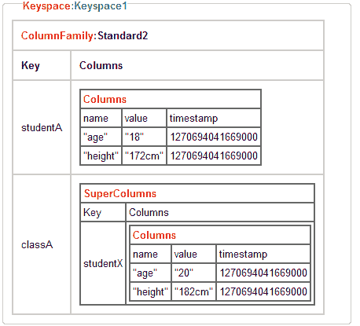
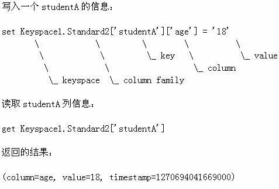

# 分布式 Key-Value 存储系统：Cassandra 入门

> 原文：[`developer.ibm.com/zh/articles/os-cn-cassandra/`](https://developer.ibm.com/zh/articles/os-cn-cassandra/)

## Cassandra 的数据存储结构

Cassandra 的数据模型是基于列族（Column Family）的四维或五维模型。它借鉴了 Amazon 的 Dynamo 和 Google’s BigTable 的数据结构和功能特点，采用 Memtable 和 SSTable 的方式进行存储。在 Cassandra 写入数据之前，需要先记录日志 (CommitLog)，然后数据开始写入到 Column Family 对应的 Memtable 中，Memtable 是一种按照 key 排序数据的内存结构，在满足一定条件时，再把 Memtable 的数据批量的刷新到磁盘上，存储为 SSTable 。

##### 图 1\. Cassandra 的数据模型图



### Cassandra 的数据模型的基本概念

*   Cluster : Cassandra 的节点实例，它可以包含多个 Keyspace
*   Keyspace : 用于存放 ColumnFamily 的容器，相当于关系数据库中的 Schema 或 database3\. ColumnFamily : 用于存放 Column 的容器，类似关系数据库中的 table 的概念 4\. SuperColumn ：它是一个特列殊的 Column, 它的 Value 值可以包函多个 Column5\. Columns：Cassandra 的最基本单位。由 name , value , timestamp 组成

下面是关于数据模型实例分析

##### 图 2\. 数据模型实例分析



## Cassandra 节点的安装和配置

### 获取 Cassandra

```
# wget  http://labs.renren.com/apache-mirror/cassandra/0.6.0/apache-
 cassandra-0.6.0-rc1-bin.tar.gz
 # tar -zxvf apache-cassandra-0.6.0-rc1-bin.tar.gz
 # mv  apache-cassandra-0.6.0-rc1 cassandra
 # ls Cassandra 
```

##### Cassandra 的目录说明

| bin | 存放与 Cassandra 操作的相关脚本 |
| --- | --- |
| conf | 存放配置文件的目录 |
| interface | Cassandra 的 Thrift 接口定义文件，可以用于生成各种编程语言的接口代码 |
| Javadoc | 源代码的 javadoc |
| lib | Cassandra 运行时所需的 jar 包 |

### 配制 Cassandra 节点的数据存储目录和日志目录

修改配制文件 storage-conf.xml：

##### 默认的内容

```
<CommitLogDirectory>/var/lib/cassandra/commitlog</CommitLogDirectory>
     <DataFileDirectories>
 <DataFileDirectory>/var/lib/cassandra/data</DataFileDirectory>
     </DataFileDirectories> 
```

##### 配置后的内容

```
 <CommitLogDirectory>/data3/db/lib/cassandra/commitlog</CommitLogDirectory>
     <DataFileDirectories>
 <DataFileDirectory>/data3/db/lib/cassandra/data</DataFileDirectory>
     </DataFileDirectories> 
```

修改日志配制文件 log4j.properties：

##### log4j.properties 配置

```
# 日志路径
 #log4j.appender.R.File=/var/log/cassandra/system.log
 # 配置后的日志路径 :
 log4j.appender.R.File=/data3/db/log/cassandra/system.log 
```

创建文件存放数据和日志的目录

```
# mkdir – p /data3/db/lib/cassandra
 # mkdir – p /data3/db/log/Cassandra 
```

### 配制完成后，启动 Cassandra

```
# bin/Cassandra 
```

显示信息

```
INFO 09:29:12,888 Starting up server gossip
 INFO 09:29:12,992 Binding thrift service to localhost/127.0.0.1:9160 
```

看到这两行启动回显信息时，说明 Cassandra 已启动成功。

### 连接到 Cassandra 并添加、获取数据

Cassandra 的 bin 目录已自带了命令行连接工具 cassandra-cli，可使用它连接到 Cassandra，并添加、读取数据。

##### 连接到 Cassandra，并添加、读取数据

```
# bin/cassandra-cli --host localhost --port 9160
 Connected to: "Test Cluster" on localhost/9160
 Welcome to cassandra CLI.
 Type 'help' or '?' for help. Type 'quit' or 'exit' to quit.
 cassandra>
 cassandra> set Keyspace1.Standard2['studentA']['age'] = '18'
 Value inserted
 cassandra> get Keyspace1.Standard2['studentA']
 => (column=age, value=18, timestamp=1272357045192000)
 Returned 1 results 
```

### 停止 Cassandra 服务

##### 查出 Cassandra 的 pid:16328

```
# ps -ef | grep cassandra
 # kill 16328 
```

### Cassandra 配制文件 storage-conf.xml 相关配制介绍

##### 清单 1\. storage-conf.xml 节点配制说明清单

```
<!-- 集群时显示的节点名称 -->
 <ClusterName>Test Cluster</ClusterName>
 <!-- 节点启动时，是否自动加入到集群中，默认为 false -->
 <AutoBootstrap>false</AutoBootstrap>
 <!-- 集群的节点配制 -->
 <Seeds>
 <Seed>127.0.0.1</Seed>
 </Seeds>
 <!-- 节点之间通迅的监听地址 -->
 <ListenAddress>localhost</ListenAddress>
 <!--
      基于 Thrift 的 cassandra 客户端监听地址，
集群时设为：0.0.0.0 表示侦听所有客户端 , 默认为：localhost
 -->
 <ThriftAddress>localhost</ThriftAddress>
 <!-- 客户端连接的端口 -->
 <ThriftPort>9160</ThriftPort>
 <!--
   FlushDataBufferSizeInMB   将 memtables 上的数据写入在 Disk 上，
超过设定好的限制大小时 ( 默认 32M)，则将数据写入磁盘，
   FlushIndexBufferSizeInMB  超过设定的时长（默认 8 分钟）后，
将 memtables 由的数据写入磁盘中
 -->
 <FlushDataBufferSizeInMB>32</FlushDataBufferSizeInMB>
 <FlushIndexBufferSizeInMB>8</FlushIndexBufferSizeInMB>
 <!--
 节点之间的日志记录同步模式。
 默认：periodic, 对应配制 CommitLogSyncPeriodInMS
 启动 batch 时，则对应的配制 CommitLogSyncBatchWindowInMS
 -->
 <CommitLogSync>periodic</CommitLogSync>
 <!--     默认为每 10 秒同步一次日志记录 -->
 <CommitLogSyncPeriodInMS>10000</CommitLogSyncPeriodInMS>
 <!--
 <CommitLogSyncBatchWindowInMS>1</CommitLogSyncBatchWindowInMS> --> 
```

## 常用编程语言使用 Cassandra 来存储数据

在使用 Cassandra 时，通常情况下都需要使用第三方插件 Thrift 来生成与 Cassandra 相关的库文件, 您可以在 [`incubator.apache.org/thrift`](http://incubator.apache.org/thrift) 下载此插件，并学习它的使用方法。以下是分别在 Java、PHP、Python、C#、Ruby 五种常用编程语言中使用 Cassandra：

### Java 程序使用 Cassandra

把 libthrift-r917130.jar，apache-cassandra-0.6.0-rc1.jar 加入到 Eclipse 的编译路径中。

建立数据库连接：使用 libthrift-r917130.jar 的 TTransport 的 open 方法建立起与 Cassandra 服务端 (IP:192.168.10.2 端口：9160) 的连接。

数据库操作：使用 Cassandra.Client 创建一个客户端实例。调用 Client 实例的 insert 方法写入数据，通过 get 方法获取数据。

关闭数据库连接：使用 TTransport 的 close 方法断开与 Cassandra 服务端的连接。

##### 清单 2\. Java 连接 Cassandra，写入并读取数据。

```
package com.test.cassandra;|
 import java.io.UnsupportedEncodingException;
 import org.apache.thrift.transport.TTransport;
 import org.apache.thrift.transport.TSocket;
 import org.apache.thrift.protocol.TProtocol;
 import org.apache.thrift.protocol.TBinaryProtocol;
 import org.apache.thrift.TException;
 import org.apache.cassandra.thrift.Cassandra;
 import org.apache.cassandra.thrift.Column;
 import org.apache.cassandra.thrift.ColumnOrSuperColumn;
 import org.apache.cassandra.thrift.ColumnPath;
 import org.apache.cassandra.thrift.ConsistencyLevel;
 import org.apache.cassandra.thrift.InvalidRequestException;
 import org.apache.cassandra.thrift.NotFoundException;
 import org.apache.cassandra.thrift.TimedOutException;
 import org.apache.cassandra.thrift.UnavailableException;
 /*
 * 使 Java 客户端连接 Cassandra 并进行读写操作
 * @author jimmy
 * @date 2010-04-10
 */
 public class JCassandraClient{
 public static void main(String[] args) throws InvalidRequestException,
 NotFoundException, UnavailableException, TimedOutException,
 TException, UnsupportedEncodingException {

 // 建立数据库连接
 TTransport tr = new TSocket("192.168.10.2", 9160);
 TProtocol proto = new TBinaryProtocol(tr);
 Cassandra.Client client = new Cassandra.Client(proto);
 tr.open();
 String keyspace = "Keyspace1";
 String cf = "Standard2";
 String key = "studentA";
 // 插入数据
 long timestamp = System.currentTimeMillis();
 ColumnPath path = new ColumnPath(cf);
 path.setColumn("age".getBytes("UTF-8"));
 client.insert(keyspace,key,path,"18".getBytes("UTF-8"),
 timestamp,ConsistencyLevel.ONE);
 path.setColumn("height".getBytes("UTF-8"));
 client.insert(keyspace,key,path,"172cm".getBytes("UTF-8"),
 timestamp,ConsistencyLevel.ONE);
 // 读取数据
 path.setColumn("height".getBytes("UTF-8"));
 ColumnOrSuperColumn cc = client.get(keyspace, key, path, ConsistencyLevel.ONE);
 Column c = cc.getColumn();
 String v = new String(c.value, "UTF-8");
        // 关闭数据库连接
 tr.close();
 }
 } 
```

### PHP 程序使用 Cassandra

在 PHP 代码中使用 Cassandra，需要借助 Thrift 来生成需要的 PHP 文件，通过使用 thrift –gen php interface/cassandra.thrift 生成所需要的 PHP 文件，生成的 PHP 文件中提供了与 Cassandra 建立连接、读写数据时所需要的函数。

##### 清单 3\. PHP 连接 Cassandra，写入并读取数据。

```
<?php
 $GLOBALS['THRIFT_ROOT'] = '/usr/share/php/Thrift';
 require_once
 $GLOBALS['THRIFT_ROOT'].'/packages/cassandra/Cassandra.php';
 require_once
 $GLOBALS['THRIFT_ROOT'].'/packages/cassandra/cassandra_types.php';
 require_once $GLOBALS['THRIFT_ROOT'].'/transport/TSocket.php';
 require_once $GLOBALS['THRIFT_ROOT'].'/protocol/TBinaryProtocol.php';
 require_once
 $GLOBALS['THRIFT_ROOT'].'/transport/TFramedTransport.php';
 require_once
 $GLOBALS['THRIFT_ROOT'].'/transport/TBufferedTransport.php';
 try {
 // 建立 Cassandra 连接
 $socket = new TSocket('192.168.10.2', 9160);
 $transport = new TBufferedTransport($socket, 1024, 1024);
 $protocol = new TBinaryProtocolAccelerated($transport);
 $client = new CassandraClient($protocol);
 $transport->open();
 $keyspace = 'Keyspace1';
 $keyUser = "studentA";
 $columnPath = new cassandra_ColumnPath();
 $columnPath->column_family = 'Standard1';
 $columnPath->super_column = null;
 $columnPath->column = 'age';
 $consistency_level = cassandra_ConsistencyLevel::ZERO;
 $timestamp = time();
 $value = "18";
 // 写入数据
 $client->insert($keyspace, $keyUser, $columnPath, $value,
                            $timestamp, $consistency_level);
 $columnParent = new cassandra_ColumnParent();
 $columnParent->column_family = "Standard1";
 $columnParent->super_column = NULL;
 $sliceRange = new cassandra_SliceRange();
 $sliceRange->start = "";
 $sliceRange->finish = "";
 $predicate = new cassandra_SlicePredicate();
 list() = $predicate->column_names;
 $predicate->slice_range = $sliceRange;
 $consistency_level = cassandra_ConsistencyLevel::ONE;
 $keyUser = studentA;
 // 查询数据
 $result = $client->get_slice($keyspace, $keyUser, $columnParent,
             $predicate, $consistency_level);
 // 关闭连接
 $transport->close();
 } catch (TException $tx) {
 }?> 
```

### Python 程序使用 Cassandra

在 Python 中使用 Cassandra 需要 Thrift 来生成第三方 Python 库，生成方式： thrift –gen py interface/cassandra.thrift, 然后在 Python 代码中引入所需的 Python 库，生成的 Python 库提供了与 Cassandra 建立连接、读写数据时所需要的方法。

##### 清单 4\. Python 连接 Cassandra，写入并读取数据。

```
from thrift import Thrift
 from thrift.transport import TTransport
 from thrift.transport import TSocket
 from thrift.protocol.TBinaryProtocol import
 TBinaryProtocolAccelerated
 from cassandra import Cassandra
 from cassandra.ttypes import *
 import time
 import pprint
 def main():
 socket = TSocket.TSocket("192.168.10.2", 9160)
 transport = TTransport.TBufferedTransport(socket)
 protocol = TBinaryProtocol.TBinaryProtocolAccelerated(transport)
 client = Cassandra.Client(protocol)
 pp = pprint.PrettyPrinter(indent=2)
 keyspace = "Keyspace1"
 column_path = ColumnPath(column_family="Standard1", column="age")
 key = "studentA"
 value = "18 "
 timestamp = time.time()
 try:
 # 打开数据库连接
 transport.open()
 # 写入数据
 client.insert(keyspace,key,column_path,
 value,timestamp,ConsistencyLevel.ZERO)
 # 查询数据
 column_parent = ColumnParent(column_family="Standard1")
 slice_range = SliceRange(start="", finish="")
 predicate = SlicePredicate(slice_range=slice_range)
 result = client.get_slice(keyspace,key,column_parent,
 predicate,ConsistencyLevel.ONE)
 pp.pprint(result)
 except Thrift.TException, tx:
 print 'Thrift: %s' % tx.message
 finally:
 # 关闭连接
 transport.close()
 if __name__ == '__main__':
 main() 
```

### C# 使用 Cassandra

在 C# 中使用 Cassandra 需要 Thrift.exe 来生成动态链接库，使用 ./thrift.exe –gen csharp interface/cassandra.thrift 生成所需要的 DLL 文件，生成的 DLL 提供了与 Cassandra 建立连接，读写数据等所需的类和方法，在编程环境中引入生成的 DLL，即可使用。

##### 清单 5\. C# 连接 Cassandra，写入并读取数据。

```
namespace CshareCassandra{
 using System;
 using System.Collections.Generic;
 using System.Diagnostics;
 using Apache.Cassandra;
 using Thrift.Protocol;
 using Thrift.Transport;
 class CassandraClient{
 static void Main(string[] args){
 // 建立数据库连接
 TTransport transport = new TSocket("192.168.10.2", 9160);
 TProtocol protocol = new TBinaryProtocol(transport);
 Cassandra.Client client = new Cassandra.Client(protocol);
 transport.Open();
 System.Text.Encoding utf8Encoding = System.Text.Encoding.UTF8;
 long timeStamp = DateTime.Now.Millisecond;
 ColumnPath nameColumnPath = new ColumnPath(){
 Column_family = "Standard1",
 Column = utf8Encoding.GetBytes("age")};
   // 写入数据
 client.insert("Keyspace1","studentA",nameColumnPath,
 utf8Encoding.GetBytes("18"),timeStamp, ConsistencyLevel.ONE);
 // 读取数据
 ColumnOrSuperColumn returnedColumn = client.get("Keyspace1",
            "studentA", nameColumnPath, ConsistencyLevel.ONE);
        Console.WriteLine("Keyspace1/Standard1: age: {0}, value: {1}",
                     utf8Encoding.GetString(returnedColumn.Column.Name),
                     utf8Encoding.GetString(returnedColumn.Column.Value));
 // 关闭连接
 transport.Close();
 }
 }} 
```

### Ruby 使用 Cassandra

在 Ruby 中使用 Cassandra 需要先安装 gem，安装命令：gem install cassandra

安装完成后，打开 Ruby 的 irb 开始使用 Cassandra。

##### 清单 6\. Ruby 连接 Cassandra，写入并读取数据

```
> require 'rubygems'
 > require 'cassandra'
 # 建立数据库连接
 > cdb = Cassandra.new('Keyspace1',"192.168.10.1:9160", :retries => 3)
 # 写入数据
 > cdb.insert(:Standard1, 'studentA', {'age' => '18'})
 # 读取数据
 > cdb.get(:Standard1, :studentA)
 # 关闭连接
 > cdb.disconnect 
```

## 搭建 Cassandra 集群环境

Cassandra 的集群是没有中心节点的，各个节点的地位完全相同，节点之间是通过 gossip 的协议来维护集群的状态。

##### 以下是两台安装了 Linux 系统的服务器，且初步设置了 Cassandra 环境和启用了端口 7000,9160:

| 服务器名 | 端口 | IP 地址 |
| --- | --- | --- |
| ServiceA | 7000,9160 | 192.168.10.3 |
| ServiceB | 7000,9160 | 192.168.10.2 |

### 配制服务器 ServiceA、ServiceB 的 storage-conf.xml 文件

##### ServiceA 的配置

```
<Seeds>
 <Seed>192.168.10.3</Seed>
 </Seeds>
 <ListenAddress>192.168.10.2</ListenAddress>
 <ThriftAddress>0.0.0.0</ThriftAddress> 
```

##### ServiceB 的配置

```
<Seeds>
 <Seed>192.168.10.3</Seed>
 <Seed>192.168.10.2</Seed>
 </Seeds>
 <ListenAddress>192.168.10.2</ListenAddress>
 <ThriftAddress>0.0.0.0</ThriftAddress> 
```

配制完成后，分别启动 ServiceA 和 ServiceB 上的 Cassandra 服务。

查看 ServiceA 和 ServiceB 是否集群成功，可使用 Cassandra 自带的客户端命令

```
bin/nodetool --host 192.168.10.2 ring 
```

##### 集群成功则会返回以下类似信息：

```
Address Status Load Range Ring
                                       106218876142754404016344802054916108445
 192.168.10.2  Up         2.55 KB       31730917190839729088079827277059909532     |<--|
 192.168.10.3  Up         3.26 KB       106218876142754404016344802054916108445    |-->| 
```

### 使用 Cassandra 命令行工具进行集群测试

从 ServiceB 连接到 ServiceA，可使用命令：

```
cassandra-cli -host 192.168.10.3 -port 9160 
```

##### 集群测试一

```
写入集群数据
 ServiceA 连接到 ServiceA:

 # set Keyspace1.Standard2['studentAA']['A2A'] = 'a2a'

 ServiceB 连接到 ServiceA:

 # set Keyspace1.Standard2['studentBA']['B2A'] = 'b2a'

 ServiceA 连接到 ServiceB:
 # set Keyspace1.Standard2['studentAB']['A2B'] = 'a2b' 
```

获取集群数据：

```
ServiceA 连接到 ServiceA :
 # get Keyspace1.Standard2['studentAA'],
   get Keyspace1.Standard2['studentBA'],
    get Keyspace1.Standard2['studentAB']

 ServiceB 连接到 ServiceA :
 # get Keyspace1.Standard2['studentAA'],
    get Keyspace1.Standard2['studentBA'],
    get Keyspace1.Standard2['studentAB']

 ServiceA 连接到 ServiceB :
 # get Keyspace1.Standard2['studentAA'],
  get Keyspace1.Standard2['studentBA'],
  get Keyspace1.Standard2['studentAB'] 
```

##### 集群测试二

ServiceA 停止 Cassandra 服务，ServiceA 连接到 ServiceB 并写入数据

```
# set Keyspace1.Standard2['studentAR']['A2R'] = 'a2R' 
```

启动 ServiceA，并链接到 ServiceA 本身，读取刚才在 ServiceB 写入的数据

```
# bin/cassandra-cli -host 192.168.10.3 -port 9160
 # get Keyspace1.Standard2['studentAR'] 
```

## 结束语

以上我们介绍了 Cassandra 的数据模型、节点安装和配置、常用编程语言中使用 Cassandra 以及 Cassandra 的集群和测试。Cassandra 是一个高性能的 P2P 去中心化的非关系型数据库，可以分布式进行读写操作。在系统运行时可以随意的添加或删降字段，是 SNS 应用的理想数据库。

## 下载示例代码

[Cassandra-Demo.rar](http://www.ibm.com/developerworks/cn/opensource/os-cn-cassandra/Cassandra-Demo.rar)