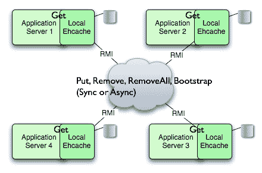
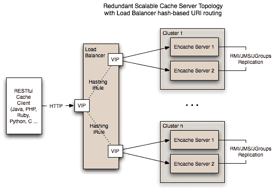

# 深入探讨在集群环境中使用 EhCache 缓存系统

> 原文：[`developer.ibm.com/zh/articles/j-lo-ehcache/`](https://developer.ibm.com/zh/articles/j-lo-ehcache/)

## EhCache 缓存系统简介

EhCache 是一个纯 Java 的进程内缓存框架，具有快速、精干等特点，是 Hibernate 中默认的 CacheProvider。

下图是 EhCache 在应用程序中的位置：

##### 图 1\. EhCache 应用架构图


EhCache 的主要特性有：

1.  快速；
2.  简单；
3.  多种缓存策略；
4.  缓存数据有两级：内存和磁盘，因此无需担心容量问题；
5.  缓存数据会在虚拟机重启的过程中写入磁盘；
6.  可以通过 RMI、可插入 API 等方式进行分布式缓存；
7.  具有缓存和缓存管理器的侦听接口；
8.  支持多缓存管理器实例，以及一个实例的多个缓存区域；
9.  提供 Hibernate 的缓存实现；
10.  等等…

由于 EhCache 是进程中的缓存系统，一旦将应用部署在集群环境中，每一个节点维护各自的缓存数据，当某个节点对缓存数据进行更新，这些更新的数据无法在其它节点中共享，这不仅会降低节点运行的效率，而且会导致数据不同步的情况发生。例如某个网站采用 A、B 两个节点作为集群部署，当 A 节点的缓存更新后，而 B 节点缓存尚未更新就可能出现用户在浏览页面的时候，一会是更新后的数据，一会是尚未更新的数据，尽管我们也可以通过 Session Sticky 技术来将用户锁定在某个节点上，但对于一些交互性比较强或者是非 Web 方式的系统来说，Session Sticky 显然不太适合。所以就需要用到 EhCache 的集群解决方案。

EhCache 从 1.7 版本开始，支持五种集群方案，分别是：

*   Terracotta
*   RMI
*   JMS
*   JGroups
*   EhCache Server

本文主要介绍其中的三种最为常用集群方式，分别是 RMI、JGroups 以及 EhCache Server 。

## RMI 集群模式

RMI 是 Java 的一种远程方法调用技术，是一种点对点的基于 Java 对象的通讯方式。EhCache 从 1.2 版本开始就支持 RMI 方式的缓存集群。在集群环境中 EhCache 所有缓存对象的键和值都必须是可序列化的，也就是必须实现 java.io.Serializable 接口，这点在其它集群方式下也是需要遵守的。

下图是 RMI 集群模式的结构图：

##### 图 2\. RMI 集群模式结构图



采用 RMI 集群模式时，集群中的每个节点都是对等关系，并不存在主节点或者从节点的概念，因此节点间必须有一个机制能够互相认识对方，必须知道其它节点的信息，包括主机地址、端口号等。EhCache 提供两种节点的发现方式：手工配置和自动发现。手工配置方式要求在每个节点中配置其它所有节点的连接信息，一旦集群中的节点发生变化时，需要对缓存进行重新配置。

由于 RMI 是 Java 中内置支持的技术，因此使用 RMI 集群模式时，无需引入其它的 Jar 包，EhCache 本身就带有支持 RMI 集群的功能。使用 RMI 集群模式需要在 ehcache.xml 配置文件中定义 cacheManagerPeerProviderFactory 节点。假设集群中有两个节点，分别对应的 RMI 绑定信息是：

| 节点 | n/a | n/a | n/a |
| --- | --- | --- | --- |
| 节点 1 | 192.168.0.11 | 4567 | /oschina_cache |
| 节点 2 | 192.168.0.12 | 4567 | /oschina_cache |
| 节点 3 | 192.168.0.13 | 4567 | /oschina_cache |

那么对应的手工配置信息如下：

```
<cacheManagerPeerProviderFactory
    class="net.sf.ehcache.distribution.RMICacheManagerPeerProviderFactory"
    properties="hostName=localhost,
    port=4567,
    socketTimeoutMillis=2000,
    peerDiscovery=manual,
    rmiUrls=//192.168.0.12:4567/oschina_cache|//192.168.0.13:4567/oschina_cache"
/> 
```

其它节点配置类似，只需把 rmiUrls 中的两个 IP 地址换成另外两个节点对应的 IP 地址即可。

接下来在需要进行缓存数据复制的区域（Region）上配置如下即可：

```
<cache name="sampleCache2"
    maxElementsInMemory="10"
    eternal="false"
    timeToIdleSeconds="100"
    timeToLiveSeconds="100"
    overflowToDisk="false">
    <cacheEventListenerFactory
        class="net.sf.ehcache.distribution.RMICacheReplicatorFactory"
        properties="replicateAsynchronously=true,
    replicatePuts=true,
    replicateUpdates=true,
        replicateUpdatesViaCopy=false,
    replicateRemovals=true "/>
</cache> 
```

具体每个参数代表的意义请参考 EhCache 的手册，此处不再详细说明。

EhCache 的 RMI 集群模式还有另外一种节点发现方式，就是通过多播（ multicast ）来维护集群中的所有有效节点。这也是最为简单而且灵活的方式，与手工模式不同的是，每个节点上的配置信息都相同，大大方便了节点的部署，避免人为的错漏出现。

在上述三个节点的例子中，配置如下：

```
<cacheManagerPeerProviderFactory
    class="net.sf.ehcache.distribution.RMICacheManagerPeerProviderFactory"
    properties="peerDiscovery=automatic, multicastGroupAddress=230.0.0.1,
    multicastGroupPort=4446, timeToLive=32"
/> 
```

其中需要指定节点发现模式 peerDiscovery 值为 automatic 自动；同时组播地址可以指定 D 类 IP 地址空间，范围从 224.0.1.0 到 238.255.255.255 中的任何一个地址。

## JGroups 集群模式

EhCache 从 1.5\. 版本开始增加了 JGroups 的分布式集群模式。与 RMI 方式相比较， JGroups 提供了一个非常灵活的协议栈、可靠的单播和多播消息传输，主要的缺点是配置复杂以及一些协议栈对第三方包的依赖。

JGroups 也提供了基于 TCP 的单播 ( Unicast ) 和基于 UDP 的多播 ( Multicast ) ，对应 RMI 的手工配置和自动发现。使用单播方式需要指定其它节点的主机地址和端口，下面是两个节点，并使用了单播方式的配置：

```
<cacheManagerPeerProviderFactory
    class="net.sf.ehcache.distribution.jgroups.JGroupsCacheManagerPeerProviderFactory"
    properties="connect=TCP(start_port=7800):
        TCPPING(initial_hosts=host1[7800],host2[7800];port_range=10;timeout=3000;
        num_initial_members=3;up_thread=true;down_thread=true):
        VERIFY_SUSPECT(timeout=1500;down_thread=false;up_thread=false):
        pbcast.NAKACK(down_thread=true;up_thread=true;gc_lag=100;
    retransmit_timeout=3000):
        pbcast.GMS(join_timeout=5000;join_retry_timeout=2000;shun=false;
        print_local_addr=false;down_thread=true;up_thread=true)"
propertySeparator="::" /> 
```

使用多播方式配置如下：

```
<cacheManagerPeerProviderFactory
    class="net.sf.ehcache.distribution.jgroups.JGroupsCacheManagerPeerProviderFactory"
    properties="connect=UDP(mcast_addr=231.12.21.132;mcast_port=45566;):PING:
    MERGE2:FD_SOCK:VERIFY_SUSPECT:pbcast.NAKACK:UNICAST:pbcast.STABLE:FRAG:pbcast.GMS"
    propertySeparator="::"
/> 
```

从上面的配置来看，JGroups 的配置要比 RMI 复杂得多，但也提供更多的微调参数，有助于提升缓存数据复制的性能。详细的 JGroups 配置参数的具体意义可参考 JGroups 的配置手册。

JGroups 方式对应缓存节点的配置信息如下：

```
<cache name="sampleCache2"
    maxElementsInMemory="10"
    eternal="false"
    timeToIdleSeconds="100"
    timeToLiveSeconds="100"
    overflowToDisk="false">
    <cacheEventListenerFactory
        class="net.sf.ehcache.distribution.jgroups.JGroupsCacheReplicatorFactory"
        properties="replicateAsynchronously=true, replicatePuts=true,
        replicateUpdates=true, replicateUpdatesViaCopy=false, replicateRemovals=true" />
</cache> 
```

### 使用组播方式的注意事项

使用 JGroups 需要引入 JGroups 的 Jar 包以及 EhCache 对 JGroups 的封装包 ehcache-jgroupsreplication-xxx.jar 。

在一些启用了 IPv6 的电脑中，经常启动的时候报如下错误信息：

java.lang.RuntimeException: the type of the stack (IPv6) and the user supplied addresses (IPv4) don’t match: /231.12.21.132.

解决的办法是增加 JVM 参数：-Djava.net.preferIPv4Stack=true。如果是 Tomcat 服务器，可在 catalina.bat 或者 catalina.sh 中增加如下环境变量即可：

```
SET CATALINA_OPTS=-Djava.net.preferIPv4Stack=true 
```

经过实际测试发现，集群方式下的缓存数据都可以在 1 秒钟之内完成到其节点的复制。

## EhCache Server

与前面介绍的两种集群方案不同的是， EhCache Server 是一个独立的缓存服务器，其内部使用 EhCache 做为缓存系统，可利用前面提到的两种方式进行内部集群。对外提供编程语言无关的基于 HTTP 的 RESTful 或者是 SOAP 的数据缓存操作接口。

下面是 EhCache Server 提供的对缓存数据进行操作的方法：

**OPTIONS /{cache}}**

获取某个缓存的可用操作的信息。

**HEAD /{cache}/{element}**

获取缓存中某个元素的 HTTP 头信息，例如：

```
curl --head  http://localhost:8080/ehcache/rest/sampleCache2/2 
```

EhCache Server 返回的信息如下：

```
HTTP/1.1 200 OK
X-Powered-By: Servlet/2.5
Server: GlassFish/v3
Last-Modified: Sun, 27 Jul 2008 08:08:49 GMT
ETag: "1217146129490"
Content-Type: text/plain; charset=iso-8859-1
Content-Length: 157
Date: Sun, 27 Jul 2008 08:17:09 GMT 
```

**GET /{cache}/{element}**

读取缓存中某个数据的值。

**PUT /{cache}/{element}**

写缓存。

由于这些操作都是基于 HTTP 协议的，因此你可以在任何一种编程语言中使用它，例如 Perl、PHP 和 Ruby 等等。

下图是 EhCache Server 在应用中的架构：

##### 图 3\. EhCache Server 应用架构图



EhCache Server 同时也提供强大的安全机制、监控功能。在数据存储方面，最大的 Ehcache 单实例在内存中可以缓存 20GB。最大的磁盘可以缓存 100GB。通过将节点整合在一起，这样缓存数据就可以跨越节点，以此获得更大的容量。将缓存 20GB 的 50 个节点整合在一起就是 1TB 了。

## 结束语

以上我们介绍了三种 EhCache 的集群方案，除了第三种跨编程语言的方案外，EhCache 的集群对应用程序的代码编写都是透明的，程序人员无需考虑缓存数据是如何复制到其它节点上。既保持了代码的轻量级，同时又支持庞大的数据集群。EhCache 可谓是深入人心。

2009 年年中，Terracotta 宣布收购 EhCache 产品。Terracotta 公司的产品 Terracotta 是一个 JVM 级的开源群集框架，提供 HTTP Session 复制、分布式缓存、POJO 群集、跨越集群的 JVM 来实现分布式应用程序协调。最近 EhCache 主要的改进都集中在跟 Terracotta 框架的集成上，这是一个真正意义上的企业级缓存解决方案。