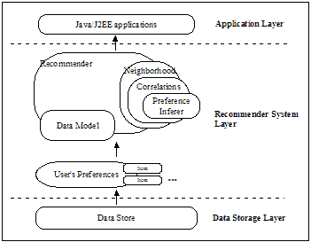

# 基于 Apache Mahout 构建社会化推荐引擎

> 原文：[`developer.ibm.com/zh/articles/j-lo-mahout/`](https://developer.ibm.com/zh/articles/j-lo-mahout/)

## 推荐引擎简介

推荐引擎利用特殊的信息过滤（IF，Information Filtering）技术，将不同的内容（例如电影、音乐、书籍、新闻、图片、网页等）推荐给可能感兴趣的用户。通常情况下，推荐引擎的实现是通过将用户的个人喜好与特定的参考特征进行比较，并试图预测用户对一些未评分项目的喜好程度。参考特征的选取可能是从项目本身的信息中提取的，或是基于用户所在的社会或社团环境。

根据如何抽取参考特征，我们可以将推荐引擎分为以下四大类：

*   基于内容的推荐引擎：它将计算得到并推荐给用户一些与该用户已选择过的项目相似的内容。例如，当你在网上购书时，你总是购买与历史相关的书籍，那么基于内容的推荐引擎就会给你推荐一些热门的历史方面的书籍。
*   基于协同过滤的推荐引擎：它将推荐给用户一些与该用户品味相似的其他用户喜欢的内容。例如，当你在网上买衣服时，基于协同过滤的推荐引擎会根据你的历史购买记录或是浏览记录，分析出你的穿衣品位，并找到与你品味相似的一些用户，将他们浏览和购买的衣服推荐给你。
*   基于关联规则的推荐引擎：它将推荐给用户一些采用关联规则发现算法计算出的内容。关联规则的发现算法有很多，如 Apriori、AprioriTid、DHP、FP-tree 等。
*   混合推荐引擎：结合以上各种，得到一个更加全面的推荐效果。

随着互联网上数据和内容的不断增长，人们越来越重视推荐引擎在互联网应用中的作用。可想而知，由于互联网上的数据过多，用户很难找到自己想要的信息，通过提供搜索功能来解决这个问题是远远不够的。推荐引擎可以通过分析用户的行为来预测用户的喜好，使用户能更容易找到他们潜在需要的信息。这里以电子商务应用中的推荐引擎为例来说明推荐引擎在互联网应用中的重要性。

电子商务推荐系统 (E-Commence Recommendation System) 向客户提供商品信息和购买建议，模拟销售人员帮助客户完成购买过程。智能推荐系统的作用可以概括为：将电子商务网站的浏览者转变为购买者 ，提高电子商务网站的交叉销售能力，提高客户对电子商务网站的忠诚度。

电子商务推荐系统的界面表现形式有以下几种：

*   浏览：客户提出对特定商品的查询要求，推荐引擎根据查询要求返回高质量的推荐；
*   相似商品：推荐引擎根据客户购物篮中的商品和客户可能感兴趣的商品推荐与它们类似的商品；
*   Email：推荐系统通过电子邮件的方式通知客户可能感兴趣的商品信息；
*   评论：推荐系统向客户提供其他客户对相应产品的评论信息。

## Apache Mahout 简介

Apache Mahout 是 Apache Software Foundation（ASF） 旗下的一个开源项目，提供一些可扩展的机器学习领域经典算法的实现，旨在帮助开发人员更加方便快捷地创建智能应用程序。经典算法包括聚类、分类、协同过滤、进化编程等等，并且，在 Mahout 的最近版本中还加入了对 Apache Hadoop 的支持，使这些算法可以更高效的运行在云计算环境中。

## Taste 简介

Taste 是 Apache Mahout 提供的一个协同过滤算法的高效实现，它是一个基于 Java 实现的可扩展的，高效的推荐引擎。Taste 既实现了最基本的基于用户的和基于内容的推荐算法，同时也提供了扩展接口，使用户可以方便的定义和实现自己的推荐算法。同时，Taste 不仅仅只适用于 Java 应用程序，它可以作为内部服务器的一个组件以 HTTP 和 Web Service 的形式向外界提供推荐的逻辑。Taste 的设计使它能满足企业对推荐引擎在性能、灵活性和可扩展性等方面的要求。

### Taste 工作原理

##### 图 1\. Taste 的主要组件图



Taste 由以下五个主要的组件组成：

*   DataModel：DataModel 是用户喜好信息的抽象接口，它的具体实现支持从任意类型的数据源抽取用户喜好信息。Taste 默认提供 JDBCDataModel 和 FileDataModel，分别支持从数据库和文件中读取用户的喜好信息。
*   UserSimilarity 和 ItemSimilarity：UserSimilarity 用于定义两个用户间的相似度，它是基于协同过滤的推荐引擎的核心部分，可以用来计算用户的”邻居”，这里我们将与当前用户口味相似的用户称为他的邻居。ItemSimilarity 类似的，计算内容之间的相似度。
*   UserNeighborhood：用于基于用户相似度的推荐方法中，推荐的内容是基于找到与当前用户喜好相似的”邻居用户”的方式产生的。UserNeighborhood 定义了确定邻居用户的方法，具体实现一般是基于 UserSimilarity 计算得到的。
*   Recommender：Recommender 是推荐引擎的抽象接口，Taste 中的核心组件。程序中，为它提供一个 DataModel，它可以计算出对不同用户的推荐内容。实际应用中，主要使用它的实现类 GenericUserBasedRecommender 或者 GenericItemBasedRecommender，分别实现基于用户相似度的推荐引擎或者基于内容的推荐引擎。

### Taste 的安装与简单的 Demo 实现

**安装 Taste 的软件需求：**

*   如果需要 build 源代码或者例子，需要 Apache Ant 1.5+ 或 Apache Maven 2.0.10+。
*   Taste 应用程序需要 [Servlet 2.3+](http://java.sun.com/products/servlet/index.jsp) 容器，例如 [Jakarta Tomcat](http://jakarta.apache.org/tomcat/) 。
*   Taste 中的 MySQLJDBCDataModel 实现需要 [MySQL 4.x+](http://www.mysql.com/products/mysql/) 数据库。

**安装 Taste 并运行 Demo：**

1.  从 SVN 或是下载压缩包得到 Apache Mahout 的发布版本：

    *   从 [SVN](http://svn.apache.org/repos/asf/lucene/mahout/trunk) 获得；
    *   下载 [压缩包](https://mahout.apache.org/) ；
2.  从 Grouplens 下载数据源： [“1 Million MovieLens Dataset”](http://www.grouplens.org/) 。
3.  解压数据源压缩包，将 movie.dat 和 ratings.dat 拷贝到 Mahout 安装目录下的 taste-web/src/ main/resources/org/apache/mahout/cf/taste/example/grouplens 目录下。
4.  回到在 core 目录下，运行”mvn install”，将 Mahout core 安装在本地库中。
5.  进入 taste-web, 拷贝 ../examples/target/grouplens.jar 到 taste-web/lib 目录
6.  编辑 taste-web/recommender.properties，将 recommender.class 设置为 org.apache.mahout. cf.taste.example.grouplens.GroupLensRecommender。
7.  在 Mahout 的安装目录下，运行”mvn package”。
8.  运行”mvn jetty:run-war”。这里需要将 Maven 的最大内存设置为 1024M，MAVEN_OPTS=-Xmx1024M。如果需要在 Tomcat 下运行，可以在执行”mvn package”后，将 taste-web/target 目录下生成的 war 包拷贝到 Tomcat 的 webapp 下，同时也需要将 Java 的最大内存设置为 1024M，JAVA_OPTS=-Xmx1024M，然后启动 Tomcat。
9.  访问 `http://localhost:8080/[your_app]/RecommenderServlet?userID=1`，得到系统为编号为 1 的用户的推荐内容。参看图 2，Taste demo 运行结果界面，每一行第一项是推荐引擎预测的评分，第二项是电影的编号。
10.  同时，Taste 还提供 Web 服务访问接口，通过以下 URL 访问：

    `http://localhost:8080/[your_app]/RecommenderService.jws`

    WSDL 文件： `http://localhost:8080/[your_app]/RecommenderService.jws?wsdl`

    也可以通过简单的 HTTP 请求调用这个 Web 服务：

    `http://localhost:8080/[your_app]/RecommenderService.jws? method=recommend&userID=1&howMany=10`

##### 图 2\. Taste Demo 运行结果界面


## 使用 Taste 构建推荐引擎实例 – 电影推荐引擎

根据上面的步骤，我们可以得到一个简单的推荐引擎 demo 环境，下面介绍如何使用 Taste 方便地构建自定义的推荐引擎。

### 抽取 Taste 工具包

直接使用 Mahout 的项目环境进行编码，需要使用 Ant 或者 Maven 进行编译，整个过程比较复杂，这里我们将构建推荐引擎所需要的工具包从 Mahout 工程中抽取出来，从而方便的构建自定义的推荐引擎。

在 Eclipse 中创建 Web 应用的工程 MovieSite，将 demo 时生成的推荐引擎 Web 应用的 war 包解压缩，将 lib 下的 jar 文件拷贝到 MovieSite 的 lib 目录下。这样我们就可以方便的编写自己的推荐引擎。

##### 图 3\. MovieSite 工程中引用的 jar 文件


### 数据建模

这里我们想要编写一个电影推荐引擎，第一步需要对数据进行建模，分析应用中涉及的主要实体以及实体间的关系，从而设计数据库存储，程序中的类，以及推荐引擎的 DataModel。

##### 图 4 电影和用户信息数据模型


数据模型中存在以下实体：

*   Movie：表示电影，包含电影的基本信息：编号、名称、发布时间、类型等等。
*   User：表示用户，包含用户的基本信息：编号、姓名、邮件等等。
*   Movie Reference：表示某个用户对某个电影的喜好程度，包含用户编号、电影编号、用户的评分以及评分的时间。
*   Movie Similarity：表示两个电影的相似度（这里的相似度是双向的），包括两个电影编号、电影的相似度。两个电影的相似度可以通过电影的基本信息计算得到。

下面我们就基于这个数据模型设计数据库的存储以及推荐引擎的 DataModel。

第 1 步，创建 MySQL 数据库存储电影和用户的信息，用户的喜好信息以及电影的相似度。

##### 清单 1\. 创建数据库 SQL

```
 CREATE DATABASE movie;
    USE movie;
    CREATE TABLE movies (  // 保存电影相关的信息。
       id INTEGER NOT NULL AUTO_INCREMENT,
       name varchar(100) NOT NULL,
       published_year varchar(4) default NULL,
       type varchar(100) default NULL,
    --    ...more movie information...
       PRIMARY KEY (id)
    );

    CREATE TABLE users (  // 保存用户信息
       id INTEGER NOT NULL AUTO_INCREMENT,
       name varchar(50) NOT NULL,
       email varchar(100) default NULL,
    --    ...more user information...
       PRIMARY KEY (id)
    );

    CREATE TABLE movie_preferences (  // 保存用户对电影的评分，即喜好程度
       userID INTEGER NOT NULL,
       movieID INTEGER NOT NULL,
       preference INTEGER NOT NULL DEFAULT 0,
       timestamp INTEGER not null default 0,
       FOREIGN KEY (userID) REFERENCES users(id) ON DELETE CASCADE,
       FOREIGN KEY (movieID) REFERENCES movies(id) ON DELETE CASCADE
    );

    CREATE TABLE movie_similarity (   // 保存电影和电影的相似程度
       movieID1 INTEGER NOT NULL,
       movieID2 INTEGER NOT NULL,
       similarity DOUBLE NOT NULL DEFAULT 0,
       FOREIGN KEY (movieID1) REFERENCES movies(id) ON DELETE CASCADE,
       FOREIGN KEY (movieID2) REFERENCES movies(id) ON DELETE CASCADE
    );

    CREATE INDEX movie_preferences_index1 ON movie_preferences ( userID , movieID );
    CREATE INDEX movie_preferences_index2 ON movie_preferences ( userID );
    CREATE INDEX movie_preferences_index3 ON movie_preferences ( movieID ); 
```

在实际应用中，我们需要将应用中的实例数据写入到数据库中。作为例子，这里将从 GroupLen 下载的数据源写入数据库。

第 2 步，设计实现推荐引擎的 DataModel。

由于上面采用数据库存储用户的喜好信息，这里需要基于数据库的推荐引擎实现。这里扩展 MySQLJDBCDataModel 实现电影推荐引擎的 DataModel 实例。

##### 清单 2\. Taste DataModel 的实现

```
 public class MovieDataModel extends MySQLJDBCDataModel {

       // 保存用户对电影的评分的数据库表名
       public final static String PERFERENCETABLE = "movie_preferences";
       public final static String USERID_COLUMN = "userID";   // 表中用户标识的列名
       public final static String ITEMID_COLUMN = "movieID";  // 表中电影标识的列名
       public final static String PERFERENCE_COLUMN = "preference";  // 表中评分的列名

       public MovieDataModel(String dataSourceName) throws TasteException {
           super(lookupDataSource(dataSourceName), PERFERENCETABLE, USERID_COLUMN,
               ITEMID_COLUMN, PERFERENCE_COLUMN);
       }

       public MovieDataModel() {
           //DBUtil.getDataSource() 将返回应用的数据源
           // 此应用是 J2EE 应用，所以这里会采用 JDNI 的方式创建数据库链接。
           super(DBUtil.getDataSource(), PERFERENCETABLE, USERID_COLUMN,
               ITEMID_COLUMN, PERFERENCE_COLUMN);
       }
    } 
```

### 推荐引擎实现

前面介绍了数据建模和 DataModel 的实现，下面来详细介绍推荐引擎的实现。如前面介绍的，Taste 既实现了最基本的基于用户的和基于内容的推荐算法，同时也提供了扩展接口，使用户可以方便的定义和实现自己的推荐算法。下面详细介绍如何扩展 Taste 的推荐引擎接口，实现基于用户相似度的推荐引擎，基于内容相似度的推荐引擎，以及 Slope One 的推荐引擎。Slope One 是一种非常快速简单的基于项目的推荐方法，需要使用用户的评分信息。

##### 清单 3\. 基于用户相似度的推荐实现

```
public class UserBasedRecommender implements Recommender {

    private final Recommender recommender;

    public UserBasedRecommender() throws IOException, TasteException {
        this(new MovieDataModel());
    }

    public UserBasedRecommender(DataModel model) throws TasteException {

        UserSimilarity userSimilarity = new PearsonCorrelationSimilarity(model);
        userSimilarity.setPreferenceInferrer(new AveragingPreferenceInferrer(model));

        UserNeighborhood neighborhood =
            new NearestNUserNeighborhood(3, userSimilarity, model);
        recommender = new CachingRecommender(
            new GenericUserBasedRecommender(model, neighborhood, userSimilarity));
    }

    // 对外提供的推荐的接口，参数为用户标识和推荐项的个数
    public List<RecommendedItem> recommend(long userID, int howMany)
        throws TasteException {
        return recommender.recommend(userID, howMany);
    }

    public List<RecommendedItem> recommend(long userID, int howMany,
        Rescorer<Long> rescorer) throws TasteException {
        return recommender.recommend(userID, howMany, rescorer);
    }

    // 以下方法都是实现 Recommender 的接口
    public float estimatePreference(long userID, long itemID) throws TasteException {
        return recommender.estimatePreference(userID, itemID);
    }

    public void setPreference(long userID, long itemID, float value)
        throws TasteException {
        recommender.setPreference(userID, itemID, value);
    }

    public void removePreference(long userID, long itemID) throws TasteException {
        recommender.removePreference(userID, itemID);
    }

    public DataModel getDataModel() {
        return recommender.getDataModel();
    }

    public void refresh(Collection<Refreshable> alreadyRefreshed) {
        recommender.refresh(alreadyRefreshed);
    }

    public String toString() {
        return "UserBasedRecommender[recommender:" + recommender + ']';
    }
 } 
```

从上面的代码示例清单 3 可以看出，实现一个推荐引擎需要实现 Recommender 接口，它一般是对于某种 Taste 提供的推荐引擎的扩展，这是对 GenericUserBasedRecommender 进行的扩展，其中最重要的方法就是实例化推荐引擎的构造方法，一般其中涉及以下步骤：

*   基于 DataModel，计算用户的相似度，这里采用 PearsonCorrelation 算法。
*   为用户相似度设置相似度推理方法，这里采用了 AveragingPreferenceInferrer。
*   基于用户相似度计算用户的”邻居”，这里将与该用户最近距离为 3 的用户设置为该用户的”邻居”。
*   使用以上得到的用户相似度对象和邻居用户的计算方法对象创建一个 GenericUserBasedRecommender 的实例。一般情况下，这时都采用 CachingRecommender 为 RecommendationItem 进行缓存，从而提高访问速度。

##### 清单 4\. 基于内容相似度的推荐实现

```
public class ItemBasedRecommender implements Recommender {

    private final Recommender recommender;

    public ItemBasedRecommender() throws IOException, TasteException {
        this(new MovieDataModel());
    }

    public ItemBasedRecommender(DataModel dataModel) throws TasteException {

        Collection<GenericItemSimilarity.ItemItemSimilarity> correlations =
            MovieSimilarityTable.getAllMovieSimilarities();
        ItemSimilarity itemSimilarity = new GenericItemSimilarity(correlations);
        recommender = new CachingRecommender(new EmbededItemBasedRecommender(
            new GenericItemBasedRecommender(dataModel, itemSimilarity)));
    }

    public List<RecommendedItem> recommend(long userID, int howMany)
        throws TasteException {
        return recommender.recommend(userID, howMany);
    }

     .........

    //EmbededItemBasedRecommender 类的定义
    private static final class EmbededItemBasedRecommender implements Recommender {

        // 包含一个 GenericItemBasedRecommender 实例；
        private final GenericItemBasedRecommender recommender;

        private EmbededItemBasedRecommender(GenericItemBasedRecommender recommender) {
            this.recommender = recommender;
        }

        public List<RecommendedItem> recommend(long userID,  int howMany,
            Rescorer<Long> rescorer)
            throws TasteException {
            FastIDSet itemIDs = recommender.getDataModel().getItemIDsFromUser(userID);
            return recommender.mostSimilarItems(itemIDs.toArray(), howMany, null);
        }

    ........

 } 
```

从上面的代码示例清单 4 可以看出，与上一个实现类似它是对 GenericItemBasedRecommender 的扩展，它的构造方法涉及以下步骤：

1.  为了提高推荐引擎的实时响应速度，这里需要对电影信息的预处理，将电影的相似度提前计算好存储在数据库中的 movie_similarity 表中，然后从数据库中读取所有的电影的相似度，用于创建 ItemItemSimilarity 的集合。
2.  基于 ItemItemSimilarity 的集合生成一个内容相似度 ItemSimilarity。
3.  创建一个 EmbededItemBasedRecommender 实例，它是一个内部类，包含一个 GenericItemBasedRecommender 实例，它的 recommend 方法中，先从 DataModel 中得到该用户评分的电影列表，然后调用 GenericItemBasedRecommender 中的 mostSimilarItems 方法计算出最相似的电影推荐给用户。

##### 清单 5\. SlopeOne Recommeder 的实现

```
public final class MovieRecommender implements Recommender {

    private final Recommender recommender;

    public MovieRecommender() throws IOException, TasteException {
        this(new MovieDataModel());
    }

    public MovieRecommender(DataModel dataModel) throws TasteException {
        // 创建一个 SlopeOneRecommender 的实例
        recommender = new CachingRecommender(new SlopeOneRecommender(dataModel));
    }

    // 对外提供的推荐的接口，参数为用户标识和推荐项的个数
    public List<RecommendedItem> recommend(long userID, int howMany)
        throws TasteException {
        return recommender.recommend(userID, howMany);
    }

     ........

 } 
```

Slope One 是一种非常快速简单的基于项目的推荐方法，它只需要使用用户的评分信息。具体的实现，只需要在我们的推荐引擎中包含一个 SlopeOneRecommender 的实例。

### 推荐引擎 API 设计与实现

完成了推荐引擎的设计与实现，下面我们需要设计一些 REST API，向外暴露推荐功能。为了提高推荐引擎的处理效率，这里采用 Singleton 模式实现一个推荐引擎的单例 MovieRecommenderSingleton。在 Servlet 启动的时候初始化推荐引擎的单例，以后每次调用推荐方法。

##### 清单 6\. Servlet 的实现

```
public class MovieRecommenderServlet extends HttpServlet {

     private static final int NUM_TOP_PREFERENCES = 20;
    private static final int DEFAULT_HOW_MANY = 20;

    private Recommender recommender;

    @Override
    public void init(ServletConfig config) throws ServletException {
        super.init(config);

         // 从 web.xml 中读取需要创建的推荐引擎类名
        /*
         * <servlet>
         *      <servlet-name>movie-recommender</servlet-name>
         *      <display-name>Movie Recommender</display-name>
         *      <description>Movie recommender servlet</description>
         *      <servlet-class>
         *      com.ibm.taste.example.movie.servlet.MovieRecommenderServlet
         *  </servlet-class>
         *      <init-param>
         *          <param-name>recommender-class</param-name>
         *          <param-value>
         *          com.ibm.taste.example.movie.recommender.UserBasedRecommender
         *      </param-value>
         *      </init-param>
         *      <load-on-startup>1</load-on-startup>
         * </servlet>
         */
        String recommenderClassName = config.getInitParameter("recommender-class");
        if (recommenderClassName == null) {
            throw new ServletException(
                "Servlet init-param \"recommender-class\" is not defined");
        }

         try {
            MovieRecommenderSingleton.initializeIfNeeded(recommenderClassName);
        } catch (TasteException te) {
            throw new ServletException(te);
        }
        recommender = MovieRecommenderSingleton.getInstance().getRecommender();
    }

    @Override
    public void doGet(HttpServletRequest request,
        HttpServletResponse response) throws ServletException {
         //Parameters.USER_ID = "userID"
        String userIDString = request.getParameter(Parameters.USER_ID);
        if (userIDString == null) {
            throw new ServletException("userID was not specified");
        }
        long userID = Long.parseLong(userIDString);
        String howManyString = request.getParameter(Parameters.COUNT);
        //Parameters.COUNT = "count"
        int howMany = howManyString == null ? DEFAULT_HOW_MANY :
            Integer.parseInt(howManyString);
        String format = request.getParameter(Parameters.FORMAT);
        //Parameters.FORMAT = "format"
        if (format == null) {
            format = "json";
        }

        try {
            // 为指定用户计算推荐的电影
            List<RecommendedItem> items = recommender.recommend(userID, howMany);
            // 加载电影的相关信息，RecommendMovieList 是保存了一组推荐电影的相关信息和
            // 引擎计算得到的他们的 ranking
            RecommendMovieList movieList = new RecommendMovieList(items);
            if ("text".equals(format)) {
                writePlainText(response, movieList);
            } else if ("json".equals(format)) {
                writeJSON(response, movieList);
            } else {
                throw new ServletException("Bad format parameter: " + format);
            }
        } catch (TasteException te) {
            throw new ServletException(te);
        } catch (IOException ioe) {
            throw new ServletException(ioe);
        }

    }
    //details please refer to the src code
 } 
```

以上完成了电影推荐引擎服务器端的编程，下面我们使用 FireFox 的插件 Poster 测试一下 HTTP 请求，查看推荐引擎的返回结果。对任意一个用户，推荐引擎应该基于一定的规则计算得到一组电影以及预计的评分，为了有更好的用户体验，引擎在拿到推荐电影序号的列表后，从电影信息数据库中查询得到电影的相关信息，包括电影的名称，发表时间以及类型等信息。这里我们采用 JSON 作为推荐引擎的响应格式。

##### 图 4\. 用 Poster 测试 Servlet 的结果（ 查看大图 ）


### 用户界面展示

实现一个推荐引擎的最后一步就是编写客户端代码，为电影推荐引擎提供一个友好的用户界面。下面展示一下我们为电影推荐引擎写的一个简单的用户界面：右边红色框中的是该用户已经打分的电影列表，左边蓝色框中是推荐引擎为用户推荐的电影列表。

首先，展示一下基于用户的推荐引擎的推荐结果，推荐引擎会根据用户已打分的电影找到用户的”邻居”，将”邻居”们比较喜欢的电影推荐给当前用户。

##### 图 5\. 基于用户的推荐结果（ 查看大图 ）


其次，图 6 展示了基于内容的推荐引擎的推荐结果，推荐引擎会根据用户已打分的电影找到相似的电影，推荐给当前用户。

##### 图 6\. 基于内容的推荐结果（ 查看大图 ）


最后，展示 SlopeOne 推荐引擎的推荐结果，这种推荐引擎计算速度较快，效果很好，是一种非常快速简单的基于项目的推荐方法。

##### 图 7\. SlopeOne 实现的推荐结果（ 查看大图 ）


## 结束语

目前几乎所有大型的电子商务系统，都不同程度地使用了各种形式的推荐引擎。推荐技术的使用，不仅大大的提高了用户购物的体验，增加了用户的粘着度，而且电子商务公司也由于推荐系统的应用而大大的提高了交叉销售的可能，从而大大的提高了营业额。今天，你有自己的商品推荐系统么？

借鉴于电子商务的成功经验，我们可以把推荐技术应用到其他的领域。像我们在文章中所演示的那样，你可以创建一个电影的推荐引擎。如果你是一个 blogger，那么你可以创建一个博客的推荐引擎，如果你是一个新闻提供商，你可以使用推荐技术为不同的用户推荐它可能关心的新闻，等等。

今天，你推荐了么？

## 下载示例代码

[获取示例代码](https://download.boulder.ibm.com/ibmdl/pub/software/dw/cn/java/j-lo-mahout/src.zip)