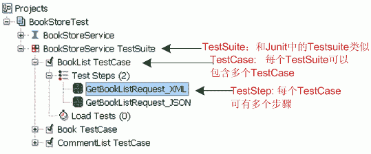
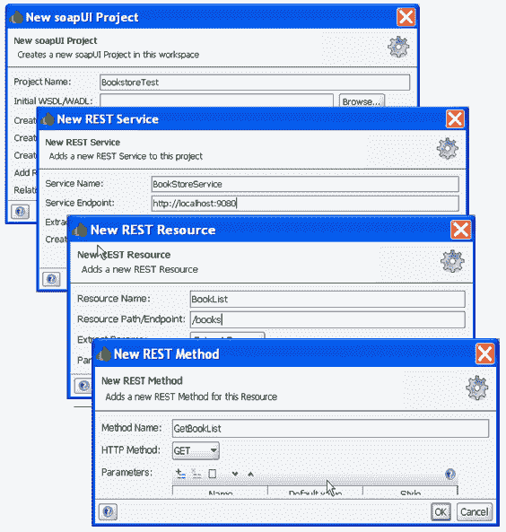
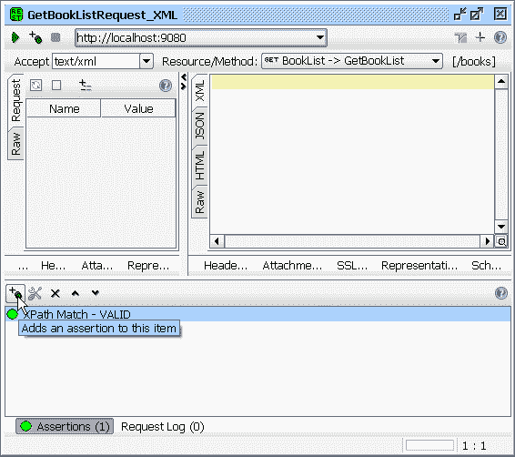
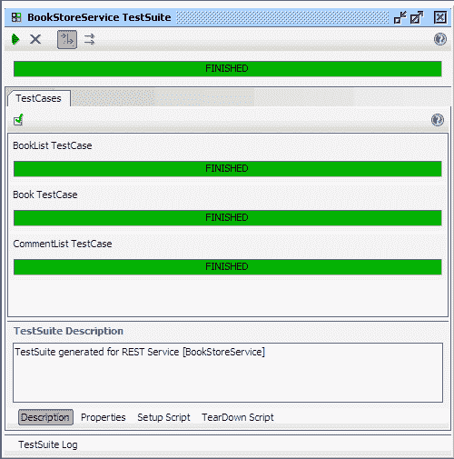
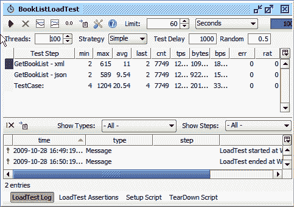
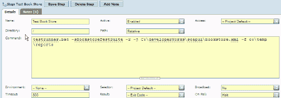

# 使用 soapUI 测试 REST 服务

> 原文：[`developer.ibm.com/zh/articles/os-cn-soapui/`](https://developer.ibm.com/zh/articles/os-cn-soapui/)

## REST 服务介绍

REST（Representational State Transfer）是 Roy Fielding 博士在 2000 年提出的一种新的软件架构风格，它以资源（resource）为核心，使用 HTTP、 URI、XML 以及 HTML 等现有流行协议和标准来完成对资源的操作及显示。 这些操作包括获取、创建、修改和删除资源，分别对应于 HTTP 协议的 GET、POST、PUT 和 DELETE 方法。REST 架构定义了以下设计准则：

*   网络中的所有事物都被抽象为资源（resource）。
*   每个资源对应一个唯一的资源标识（resource identifier）。
*   通过通用的连接器接口（generic connector interface）对资源进行操作。
*   对资源的各种操作不会改变资源标识。
*   所有的操作都是无状态的（stateless）。

REST 服务（RESTful Service）是一种基于 HTTP 和 REST 准则的轻量级 Web 服务。这类服务可以看作一系列资源（resource）的集合，服务的定义可以视为以下三个切面的组合 :

*   访问 Web Service 的 URI，如：`http://example.com/resources`。
*   Web Service 所支持的数据 MIME 类型，如：JSON, XML, YAML 等。
*   Web Service 使用 HTTP 协议支持的操作，如 GET, POST, PUT, DELETE。

相比目前流行的 Web 服务实现方案 SOAP 和 XML-RPC, REST 服务更加简洁，它可以完全通过 HTTP 协议实现，还可以利用缓存 Cache 来提高响应速度， 其性能，效率和易用性等方面均优于 SOAP 协议。 本文主要介绍如何使用 soapUI 来测试此类 Web 服务。

## soapUI 介绍

由于 Web 服务是被程序调用的， 一般不会提供界面让最终用户或测试人员直接使用，在 soapUI 等工具出现之前，测试人员不得不自己编写程序来测试它， 这就要求测试人员花费很大的精力了解底层的接口，调用关系和详细的协议，导致他们不能把注意力集中到测试中。

soapUI 的出现极大的改变了这一局面。 作为一个开源的工具，soapUI 强大的功能、易用的界面，吸引了很多用户。用户可以在 soapUI 中通过简单的操作完成复杂的测试，不需要了解底层的细节， 极大的减轻了工作量。soapUI 支持多样的测试， 例如功能测试，性能测试，回归测试等。到目前为止 soapUI 的下载量已经超过了 100 万次，成为了事实的 Web 服务测试标准和领先的 Web 服务测试工具。 它不仅仅可以测试基于 SOAP 的 Web 服务，也可以测试 REST 风格的 Web 服务，后者也是本文介绍的重点。

soapUI 基于 Java 开发，支持多个平台，安装非常简单。读者可以到 [soapUI 的官方网站](https://www.soapui.org/)下载一个安装包 ( 本文使用的是 Window 版本 3.0.1)，直接安装即可。在该安装包中，包括了一个 soapUI 所需要的 JRE1.6 版本。安装完毕以后，读者需要设置 JAVA_HOME 变量指向到相应的 JRE 目录，同时修改 PATH 变量，将 JRE1.6 的 bin 目录添加进去。

## REST 服务案例

为了避免空洞的讲解，同时为了更好的展示 soapUI 对 REST 服务的测试功能，本文假想了一个在线书店 (`http://www.example.com`) 的例子。该在线书店对外提供了一些 REST 服务让第三方的应用程序调用。 为了让读者把注意力集中在使用 soapUI 进行测试上，我们对这些 REST 服务进行了必要的简化，仅仅只包含下面 3 种功能：书籍列表，书籍详情和添加评论。这 3 个 REST 服务覆盖了层次状的 REST 资源、基本的 HTTP 操作和多种展现形式。

| 服务名称 | HTTP 操作 | 资源 URI | 资源展现 | 注释 |
| --- | --- | --- | --- | --- |
| 书籍列表 | GET | `http://www.example.com/books` | application/json，text/xml | 该 REST 服务的目的是列出在线书店中的书籍列表，参见 清单 1 和 清单 2 |
| 书籍详情 | GET | `http://www.example.com/books/<book id >` | application/json | 该 REST 服务目的是给定一个书籍 ID，返回该书籍的详细信息，参见清单 3，需要注意的是书籍详细信息是一个带有层次结构的 json 展示 |
| 添加评论 | POST | `http://www.example.com/books/<book id >/comments` | 无 , 系统仅仅返回 200 OK | 该 REST 服务的目的是对一个书籍添加评论，调用方需要 POST 类似 author=xxx&content=xxx 的数据到服务器端。 |

##### 清单 1\. 书籍列表 application/json

```
{"books": [
   {"book":    {
      "id": "1234",
      "name": "book1",
      "price": 29
   }},
   {"book":    {
      "id": "5678",
      "name": "book2",
      "price": 18
   }}
 ]} 
```

##### 清单 2\. 书籍列表 text/xml

```
<bookes>
   <book>
      <id>1234</id>
      <name>book1</name>
      <price>29.0</price>
   </book>
   <book>
      <id>5678</id>
      <name>book2</name>
      <price>18</price>
   </book>
 </bookes> 
```

##### 清单 3\. 书籍详情 application/json

```
{
   "id": "1234",
   "name": "book1",
   "description": "this is book 1",
   "author": "author1",
   "price": 29,
   "comments":    [
      {"comment":       {
         "user": "user1",
         "content": "good book"
      }},
      {"comment":       {
         "user": "user2",
         "content": "not bad"
      }}
   ]
 } 
```

## 在 soapUI 中建立测试用例

### 基本概念

在创建测试用例之前，我们先来看一看在 soapUI 中的基本概念，soapUI 把 REST 服务、资源及其操作组织为一个层次结构。如 图 1\. soapUI 中的层次结构 所示，主要包括如下层次：

*   项目定义：位于最上层 (BookStoreTest)，项目可以包含多个服务的定义。
*   REST 服务定义：服务其实是对多个 REST 资源的一个分组，在我们的例子中只有一个服务 BookStoreServie
*   REST 资源定义：具体描述该资源的名称，URI, 参数等属性
*   REST 方法定义：针对每个资源的方法 (GET,POST,PUT,DELETE 等 )，图 1 中的方法名就是 GetBookList
*   REST 操作请求定义：基于每个方法，可以有一个或多个请求操作，如 GetBookListRequest，这些请求操作才是真正被 soapUI 所调用执行的。每个请求可以设置非常丰富的信息，例如 Accept 类型，请求的 Header 信息，运行了该请求以后，就能以各种方式查看运行结果。但是这里还不能加入断言来验证结果 – 必须在建立测试用例以后才能使用。

注： 读者可以在示例代码的 bookstore-soapui-project.zip 找到完整的例子，下文中主要以该例子为基础进行讲解。读者解压 zip 文件以后，能得到一个 xml 文件，可以通过 soapUI 的 File->import project 把项目导入到自己的工作区中。

##### 图 1\. soapUI 中的层次结构


对于测试用例来讲，同样是一个层次结构：

*   TestSuite：类似于 Junit 中的测试套件，其中可以加入多个 TestCase
*   TestCase：可以包含多个 TestStep
*   TestStep：一个 TestCase 可以包含多个 TestStep,TestStep 有多种类型，它可以是上面提到一个 REST 操作请求，也可以是一个 Groovy 的脚本，还可以试一个设置属性的操作。 TestStep 甚至支持分支跳转操作：根据特定的条件，从一个 step 可以跳转到其他 step, 而不必顺序执行。

soapUI 实际上是一个平台，它支持强大的编程能力，开发或者测试人员可以利用 groovy 脚本来访问 soapUI 中的对象，在运行时修改 REST request/response, 这就提供了极大的灵活性。

##### 图 2\. TestCase 定义



### 创建测试用例

有了上面的基本概念以后，在 soapUI 中创建测试用例就比较简单了， 用户几乎可以根据自己的直觉来一步一步的完成一个测试。 图 3\. 创建一个 REST 服务 展示的就是一个建立书籍列表 REST 服务的步骤：

1.  新建一个名为 BookStoreTest 的项目

2.  在项目上点击右键，选择”New Rest Service”，在对话框中输入 Service Name(BookStoreService) 和 Endpoint(`http://localhost:9080`)

3.  在”BookstoreService”上点击右键，选择”New Resource”, 在对话框中输入 Resource Name(BookList) 和 Resource Path (/books)，点击 OK

4.  在弹出的对话框中输入 Method Name: GetBookList,HTTP Method 选择默认的 GET, 点击 OK

##### 图 3\. 创建一个 REST 服务



有了 REST 服务，就可以建立 TestCase，主要有两种方式：

*   自动生成，步骤如下：

    1.  右键点击一个 REST 服务，例如本例中的”BookStoreService”, 选择”Generate TestSuite”

    2.  在弹出的对话框中，保持默认设置， 选择”OK”

    3.  输入名称 , 例如”BookStoreService TestSuite”, 选择”OK”即可。

*   手工创建，步骤如下：

    1.  在项目”BooksStoreTest”上点击右键，选择”New TestSuite”, 在对话框中输入”BookStoreService TestSuite”

    2.  在 BookStoreService TestSuite 上点击右键， 选择”New TestCase”, 在对话框中输入”BookList TestCase”

    3.  然后在左边的导航栏中展开 BookList TestCase, 在”Test Steps”上点右键，选择 Add Step->Rest Test Request

    4.  在弹出的对话框中选择 GetBookListRequest_XML

一个完成的 TestCase 如 图 4\. REST TestCase 所示，用户可以在其中加入 Assertion 对运行结果进行验证，这也是自动化测试所必须的。

##### 图 4\. REST TestCase



### 如何使用变量

soapUI 支持使用自定义变量（Property）在 Project 中存储和共享数据。Property 是一个命名的字符串可以被 Groovy Script，Property Transfer 或者 Property-Expansion 引用， 目前所有的变量均被处理为字符串。soapUI 允许在项目的各个层次中定义变量，常用的层次包括：Project，TestSuite，TestCase，Global 等。

#### 使用 Property 编辑器定义变量

用户可以使用 soapUI 自带的 Property Editor 定义各个层次的变量。以 Project 变量为例，点击 BookStoreTest，在 Properties 面板中添加自定义变量，如下图所示：

##### 图 5\. 使用 Property 编辑器定义项目变量


#### 使用命令行指定变量。

修改 soapUI.bat 文件中的 Java 参数如下：

```
set JAVA_OPTS=%JAVA_OPTS% -Xms128m -Xmx256m -Dsoapui.properties=properties.txt 
```

其中，properties.txt 为指定的全局变量文件名字，可以通过添加如下代码到全局变量文件来设置 project/testsuite/testcase 等层次的变量：

```
soapui.properties.<shortened-name-of-object>=pathtopropertiesfile 
```

<shortened-name-of-object>为相应对象的名字。</shortened-name-of-object>

#### 使用变量

soapUI 使用如下语法引用项目中定义的变量：

```
${[scope]propertyName[#xpath-expression]} 
```

其中，scope 可以为 #Project#，#TestSuite#，#TestCase# ，#Global#，#System#，#MockService#，#Env#，[TestStep name]#。

### 验证结果

测试用例建好之后，需要向测试用例中添加 Assertions 以便验证结果的正确性。soapUI 支持 Response SLA, Script Assertion, Contains, XQuery Match, Schema Compliance, XPath Match 以及 Not Contains 等多种断言来对 response 进行判断来保证对 Web 服务高质量的测试。本文以 XPath Match 和 Script Assertion 为例来对在线书店服务返回的 XML 和 JSON 格式的 response 进行判断。

**1.** 使用 XPath Match 测试请求 GetBookListRequest_XML 返回的结果中，id 为 1234 的 book 的 price 为 29.0， response 参见 清单 2\. 书籍列表 text/xml 。

点击 TestCase 的添加 Assertions 按钮，如 图 4\. REST TestCase 所示。 在弹出的 Select Assertion 窗口中选择 XPath Match 断言，点击 OK。配置 XPath 如下图所示：

##### 图 6\. 使用 XPATH 测试 XML 格式的书籍列表


在 XPath Expression 面板中书写用于匹配 Response 的 XPath 表达式，Expected Result 面板中填写期望的值。soapUI 将使用 XPath Expression 面板中填写的 XPath 表达式与 Service 调用结果匹配， 将匹配结果与期望值比较，如果相同则测试通过，否则失败。

**2.** 使用 Script Assertion 测试请求 GetBookListRequest_JSON 返回的结果，response 参见 清单 1\. 书籍列表 application/json 。

Assertion 添加过程与 XPath Match 类似，在 Select Assertion 窗口中选择 Script Assertion，并在之后弹出的 Script Assertion 窗口中书写如下代码：

##### 清单 5\. 使用 Script Assertion 测试 JSON 格式的书籍列表

```
//assert the response header
assert messageExchange.responseHeaders["Content-Type"]=="application/json;charset=UTF-8";
assert messageExchange.responseHeaders["Cache-Control"] == "no-cache";

 //assert the repsonse body
 def booksRoot = net.sf.json.JSONSerializer.toJSON(messageExchange.responseContent);
 def books = booksRoot.get("books");

 //assert book detail
 assert books[0].get("book").get("id") == "1234";
 assert books[0].get("book").get("name") == "book1";
 assert books[0].get("book").get("price") == 29; 
```

**3.** 使用 Property 测试请求 GetBookRequest_JSON 返回的结果， response 参见 清单 3\. 书籍详情 application/json 。

在 Script Assertion 窗口中写入如下代码：

##### 清单 6\. 使用 Property 测试 JSON 格式的书籍详情

```
//get property
 def expectedID = context.expand('${#Project#book.id}');
 def expectedName =  context.expand('${#Project#book.name}');

 //assert the response header
 assert messageExchange.responseHeaders["Cache-Control"] == "no-cache";

 //assert the response body
 def bookRoot = net.sf.json.JSONSerializer.toJSON(messageExchange.responseContent);
 assert bookRoot.get("id") == expectedID;
 assert bookRoot.get("name") == expectedName;
 assert bookRoot.get("price") == 29.0; 
```

上述使用 Groovy Script 对 Service 调用结果进行验证，可用的 soapUI 对象包括 :messageExchange， context 以及 log。

*   messageExchange： 当前交互 request/response 的 MessageExchange，可以用来直接访问 message content， HTTP Headers，Attachment 等对象。
*   context： 运行当前 TestCase 的 TestRunContext 对象，具体使用方式请参见 soapUI API 文档。
*   log： 一个标准的 Log4j Logger 对象，可以用来输出日志。

依照上述步骤定义好 TestCase 并添加适当的断言之后，就可以对在线书店 REST 服务进行测试。双击 BookStoreSerive_TestSuite, 点击 Run 按钮来运行所有的 TestCase，结果如下图所示：

##### 图 7\. 运行测试用例



## 性能测试

性能测试在 soapUI 中称为 Load Test, 针对一个 soapUI 的 TestCase, 可以建立一个或多个 LoadTest, 这些 LoadTest 会自动的 把 TestCase 中的所有步骤都添加到其中， 在运行的时候，soapUI 会自动的使用多个线程来运行这些 TestStep，同时也会监控 它们的运行时间， 例如最短时间，最长时间，平均时间等等。这样用户能够很直观的看到 REST 服务的响应时间，从而对性能进行调优。

建立 LoadTest 非常简单，只需要在”Load Tests”上点击右键， 选择”New LoadTest”, 然后输入名称即可，下图是一个针对 GetBookList 的 性能测试， 可以看到有两个 TestStep : “GetBookList_xml” 和”GetBookList_json” , 100 个线程并发执行， 时间限制是 60 秒。 最后的结果是，最短时间 4 毫秒，最长时间 1204 毫秒，平均时间 20.54 毫秒。

##### 图 8\. 性能测试



性能测试还支持断言，用户可以对一个 TestStep 或 TestCase 设置运行时间要求，例如平均时间大于 2 秒就认为失败，点击 图 8\. 性能测试 中的 “LoadTest Assertions”就可以设置。 当然根据需要，用户也可以编写脚本来做一些准备工作，或者清除工作。 参见 图 8\. 性能测试 的”Setup Script”和”TearDown Script”。

## 与 BuildForge 集成

测试可以有效的保证代码的质量，但是仅仅手工的、在本机上运行的 REST 服务测试时远远不够的。实际上把测试作为软件构建的一部分，加入到持续集成中去是一个常见的敏捷开发实践，通过频繁的，自动化的测试， 可以更有效的发现缺陷，保证代码质量。

IBM Rational BuildForge 是一个管理软件构建和发布的平台 , 它提供了一个框架来自动化整个构建流程，不仅仅自动化单独的任务，可以集成多种用户现有的脚本和工具， 最大限度的保护用户投资。作为一个框架，BuildForge 几乎可以调用操作系统上的任何脚本。本文重点不在介绍 BuildForge, 假定读者对 BuildForge 已经比较熟悉， 不熟悉的读者可以查看参考资料中的相关文章。

对于 soapUI 来说，最简单的一种集成方式就是提供命令行脚本让 BuildForge 调用。在上文中 我们已经展示了通过 soapUI 的 GUI 运行 TestCase 的功能，那么 soapUI 可不可以通过命令行完成类似的功能呢？ 答案是肯定的。

soapUI 提供了一个命令行工具 testrunner.bat 来运行一个项目中的 TestSuite, 可以在 <soap_ui_home>/bin 下找到它， 它的使用非常简单，只需要设置下面的几个常用参数即可：</soap_ui_home>

*   -s 指定要运行的 TestSuite
*   -f 指定运行结果的输出目录
*   -j 生成 junit 风格的 report
*   -r 运行完成以后打印一个简单的 summary

下面这行命令就是运行 bookstore.xml 这个 soapUI 项目中的 BookstoreTestSuite, 把结果输出到 c:\temp\reports 中。

testrunner.bat -sBookstoreTestSuite -r -j C:\developerWorks\soapui\bookstore.xml -f c:\temp\reports

有了 testrunner，把 soapUI 的测试集成到 BuildForge 中就很简单了，只需要在 BuildForge 的项目中添加一个步骤，参见下图：

##### 图 9\. BuildForge 中使用 testrunner



## 结束语

从上文可以看出，soapUI 是一款强大的 Web 服务测试工具 ， 它提供了便利的 GUI 界面帮助用户对 REST 服务进行快速的测试，使用简单，学习成本很低。 它也提供了可编程能力例如变量，Groovy 脚本等， 以便让用户应对一些复杂的情况。 总而言之，有效的实际项目中使用 soapUI，可以极大的减轻工作量，提供工作效率。当然作为开源的工具， soapUI 仍然在不断的发展完善过程中，本文所能介绍的也只是它的部分功能， 感兴趣的读者可以到 soapUI 网站上获取更多资料。

## 下载示例代码

[bookstore.zip](http://public.dhe.ibm.com/software/dw/cn/opensource/os-cn-soapui/bookstore.zip)