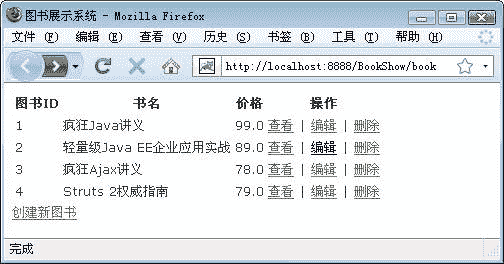
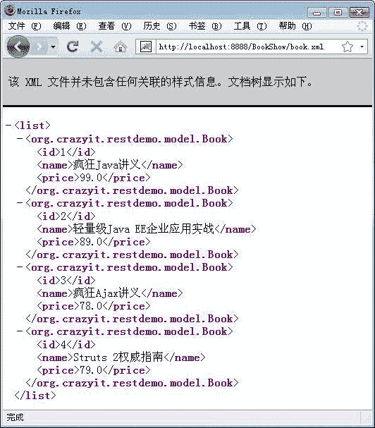
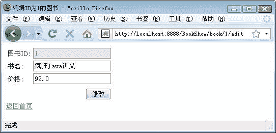

# 使用 Struts 2 开发 RESTful 服务

> 原文：[`developer.ibm.com/zh/articles/j-lo-struts2rest/`](https://developer.ibm.com/zh/articles/j-lo-struts2rest/)

## REST 简介

REST 是英文 Representational State Transfer 的缩写，这个术语由 Roy Thomas Fielding 博士在他的论文《Architectural Styles and the Design of Network-based Software Architectures》中提出。从这篇论文的标题可以看出：REST 是一种基于网络的软件架构风格。

提示：国内很多网络资料将 REST 翻译为”表述性状态转移”，不过笔者对这个翻译不太认同。因为这个专业术语无法传达 REST 的含义，读者可以先不要理会 REST 到底该如何翻译，尽量先去理解 REST 是什么？有什么用？然后再来看这个术语的翻译。关于 Roy Thomas Fielding 博士的原文参见如下地址：`http://www.ics.uci.edu/~fielding/pubs/dissertation/top.htm`。

REST 架构是针对传统 Web 应用提出的一种改进，是一种新型的分布式软件设计架构。对于异构系统如何进行整合的问题，目前主流做法都集中在使用 SOAP、WSDL 和 WS-* 规范的 Web Services。而 REST 架构实际上也是解决异构系统整合问题的一种新思路。

如果开发者在开发过程中能坚持 REST 原则，将可以得到一个使用了优质 Web 架构的系统，从而为系统提供更好的可伸缩性，并降低开发难度。关于 REST 架构的主要原则如下：

*   网络上的所有事物都可被抽象为资源（Resource）。
*   每个资源都有一个唯一的资源标识符（Resource Identifier）。
*   同一资源具有多种表现形式。
*   使用标准方法操作资源。
*   通过缓存来提高性能。
*   对资源的各种操作不会改变资源标识符。
*   所有的操作都是无状态的（Stateless）。

仅从上面几条原则来看 REST 架构，其实依然比较难以理解，下面笔者将从如下二个方面来介绍 REST。

## 资源和标识符

现在的 Web 应用上包含了大量信息，但这些信息都被隐藏在 HTML、CSS 和 JavaScript 代码中，对于普通浏览者而言，他们进入这个系统时无法知道该系统包含哪些页面；对于一个需要访问该系统资源的第三方系统而言，同样无法明白这个系统包含多少功能和信息。

从 REST 架构的角度来看，该系统里包含的所有功能和信息，都可被称为资源（Resource），REST 架构中的资源包含静态页面、JSP 和 Servlet 等，该应用暴露在网络上的所有功能和信息都可被称为资源。

除此之外，REST 架构规范了应用资源的命名方式，REST 规定对应用资源使用统一的命名方式：REST 系统中的资源必须统一命名和规划，REST 系统由使用 URI（Uniform Resource Identifier，即统一资源标识符）命名的资源组成。由于 REST 对资源使用了基于 URI 的统一命名，因此这些信息就自然地暴露出来了，从而避免 “信息地窖”的不良后果。

对于当今最常见的网络应用来说，资源标识符就是 URI，资源的使用者则根据 URI 来操作应用资源。当 URI 发生改变时，表明客户机所使用的资源发生了改变。

从资源的角度来看，当客户机操作不同的资源时，资源所在的 Web 页（将 Web 页当成虚拟的状态机来看）的状态就会发生改变、迁移（Transfer），这就是 REST 术语中 ST（State Tranfer）的由来了。

客户机为了操作不同状态的资源，则需要发送一些 Representational 的数据，这些数据包含必要的交互数据，以及描述这些数据的元数据。这就是 REST 术语中 RE（Representational）的由来了。理解了这个层次之后，至于 REST 如何翻译、或是否真正给它一个中文术语，读者可自行决定。

## 操作资源的方式

对于 REST 架构的服务器端而言，它提供的是资源，但同一资源具有多种表现形式（可通过在 HTTP Content-type 头中包含关于数据类型的元数据）。如果客户程序完全支持 HTTP 应用协议，并能正确处理 REST 架构的标准数据格式，那么它就可以与世界上任意一个 REST 风格的用户交互。这种情况不仅适用于从服务器端到客户端的数据，反之亦然——倘若从客户端传来的数据符合 REST 架构的标准数据格式，那么服务器端也可以正确处理数据，而不去关心客户端的类型。

典型情况下，REST 风格的资源能以 XHTML、XML 和 JSON 三种形式存在，其中 XML 格式的数据是 WebServices 技术的数据交换格式，而 JSON 则是另一种轻量级的数据交换格式；至于 XHTML 格式则主要由浏览器负责呈现。当服务器为所有资源提供多种表现形式之后，这些资源不仅可以被标准 Web 浏览器所使用，还可以由 JavaScript 通过 Ajax 技术调用，或者以 RPC（Remote Procedure Call）风格调用，从而变成 REST 风格的 WebServices。

REST 架构除了规定服务器提供资源的方式之外，还推荐客户端使用 HTTP 作为 Generic Connector Interface（也就是通用连接器接口），而 HTTP 则把对一个 URI 的操作限制在了 4 个之内：GET、POST、PUT 和 DELETE。通过使用通用连接器接口对资源进行操作的好处是保证系统提供的服务都是高度解耦的，从而简化了系统开发，改善了系统的交互性和可重用性。

REST 架构要求客户端的所有的操作在本质上是无状态的，即从客户到服务器的每个 Request 都必须包含理解该 Request 的所有必需信息。这种无状态性的规范提供了如下几点好处：

*   无状态性使得客户端和服务器端不必保存对方的详细信息，服务器只需要处理当前 Request，而不必了解前面 Request 的历史。
*   无状态性减少了服务器从局部错误中恢复的任务量，可以非常方便地实现 Fail Over 技术，从而很容易地将服务器组件部署在集群内。
*   无状态性使得服务器端不必在多个 Request 中保存状态，从而可以更容易地释放资源。
*   无状态性无需服务组件保存 Request 状态，因此可让服务器充分利用 Pool 技术来提高稳定性和性能。

当然，无状态性会使得服务器不再保存 Request 的状态数据，因此需要在一系列 Request 中发送重复数据，从而提高了系统的通信成本。为了改善无状态性带来的性能下降，REST 架构填加了缓存约束。缓存约束允许隐式或显式地标记一个 Response 中的数据，这样就赋予了客户端缓存 Response 数据的功能，这样就可以为以后的 Request 共用缓存的数据，部分或全部的消除一些交互，增加了网络的效率。但是用于客户端缓存了信息，也就同时增加了客户端与服务器数据不一致的可能，从而降低了可靠性。

## Struts 2 的 REST 支持

##### 约定优于配置

Convention 这个单词的翻译过来就是”约定”的意思。有 Ruby On Rails 开发经验的读者知道 Rails 有一条重要原则：约定优于配置。Rails 开发者只需要按约定开发 ActiveRecord、ActiveController 即可，无需进行配置。很明显，Struts 2 的 Convention 插件借鉴了 Rails 的创意，甚至连插件的名称都借鉴了”约定优于配置”原则。

从 Struts 2.1 开始，Struts 2 改为使用 Convention 插件来支持零配置。Convention 插件彻底地抛弃了配置信息，不仅不需要使用 struts.xml 文件进行配置，甚至不需要使用 Annotation 进行配置。而是由 Struts 2 根据约定来自动配置。

Convention 这个单词的翻译过来就是”约定”的意思。有 Ruby On Rails 开发经验的读者知道 Rails 有一条重要原则：约定优于配置。Rails 开发者只需要按约定开发 ActiveRecord、ActiveController 即可，无需进行配置。很明显，Struts 2 的 Convention 插件借鉴了 Rails 的创意，甚至连插件的名称都借鉴了”约定优于配置”原则。

由于 Struts 2 的 Convention 插件的主要特点是”约定优于配置”，当我们已经习惯了 Struts 2 的基本开发方法之后，如果希望改为使用 Convention 插件也非常容易，我们只要放弃 Stuts 2.1 应用原有的配置文件，改为按 Convention 插件的约定来定义 Action 即可。

以 Convention 插件为基础，Struts 2.1 又新增了 REST 插件，允许 Struts 2 应用对外提供 REST 服务。REST 插件也无需使用 XML 进行配置管理。Struts 2.1 通过 REST 插件完全可以提供让人和机器客户端共同使用的资源，并支持 Ruby On Rails 风格的 URL。

## RestActionMapper 简介

从本质上来看，Struts 2 依然是一个 MVC 框架，最初设计 Struts 2 时并没有按 REST 架构进行设计，因此 Struts 2 本质上并不是一个 REST 框架。由于 Struts 2 提供了良好的可扩展性，因此允许通过 REST 插件将其扩展成支持 REST 的框架。REST 插件的核心是 RestActionMapper，它负责将 Rails 风格的 URL 转换为传统请求的 URL。

用 WinRAR 打开 struts2-rest-plugin-2.1.6 文件，看到该文件里包含一个 struts-plugin.xml 文件，该文件中包含如下一行：

```
<!-- 定义支持 REST 的 ActionMapper -->
<bean type="org.apache.struts2.dispatcher.mapper.ActionMapper"
  name="rest" class="org.apache.struts2.rest.RestActionMapper" /> 
```

通过查看 RestActionMapper 的 API 说明，我们发现它可接受如下几个参数：

*   struts.mapper.idParameterName：用于设置 ID 请求参数的参数名，该属性值默认是 id。
*   struts.mapper.indexMethodName：设置不带 id 请求参数的 GET 请求调用 Action 的哪个方法。该属性值默认是 index。
*   struts.mapper.getMethodName：设置带 id 请求参数的 GET 请求调用 Action 的哪个方法。该属性值默认是 show。
*   struts.mapper.postMethodName：设置不带 id 请求参数的 POST 请求调用 Action 的哪个方法。该属性值默认是 create。
*   struts.mapper.putMethodName：设置带 id 请求参数的 PUT 请求调用 Action 的哪个方法。该属性值默认是 update。
*   struts.mapper.deleteMethodName：设置带 id 请求参数的 DELETE 请求调用 Action 的哪个方法。该属性值默认是 destroy。
*   struts.mapper.editMethodName：设置带 id 请求参数、且指定操作 edit 资源的 GET 请求调用 Action 的哪个方法。该属性值默认是 edit。
*   struts.mapper.newMethodName：设置不带 id 请求参数、且指定操作 edit 资源的 GET 请求调用 Action 的哪个方法。该属性值默认是 editNew。

在 RestActionMapper 的方法列表中，我们看到 setIdParameterName、setIndexMethodName、setGetMethodName、setPostMethodName、setPutMethodName、setDeleteMethodName、setEditMethodName、setNewMethodName 等方法，这些方法对应为上面列出的方法提供 setter 支持。

通常情况下，我们没有必要改变 RestActionMapper 的参数，直接使用这些参数的默认值就可支持 Rails 风格的 REST。根据前面介绍可以看出：支持 REST 风格的 Action 至少包含如下 7 个方法：

*   index：处理不带 id 请求参数的 GET 请求。
*   show：处理带 id 请求参数的 GET 请求。
*   create：处理不带 id 请求参数的 POST 请求。
*   update：处理带 id 请求参数的 PUT 请求。
*   destroy：处理带 id 请求参数的 DELETE 请求。
*   edit：处理带 id 请求参数，且指定操作 edit 资源的 GET 请求。
*   editNew：处理不带 id 请求参数，且指定操作 edit 资源的 GET 请求。

如果请求需要向服务器发送 id 请求参数，直接将请求参数的值附加在 URL 中即可。表 1 显示了 RestActionMapper 对不同 HTTP 请求的处理结果。

##### 表 1\. RestActionMapper 对 HTTP 请求的处理

| HTTP 方法 | URI | 调用 Action 的方法 | 请求参数 |
| --- | --- | --- | --- |
| GET | /book | index | 无 |
| POST | /book | create | 无 |
| PUT | /book/2 | update | id=2 |
| DELETE | /book/2 | destroy | id=2 |
| GET | /book/2 | show | id=2 |
| GET | /book/2/edit | edit | id=2 |
| GET | /book/new | editNew | 无 |

不幸地是，标准 HTML 语言目前根本不支持 PUT 和 DELETE 两个操作，为了弥补这种不足，REST 插件允许开发者提交请求时额外增加一个 _method 请求参数，该参数值可以为 PUT 或 DELETE，用于模拟 HTTP 协议的 PUT 和 DELETE 操作。

## 为 Struts 2 应用安装 REST 插件

安装 REST 插件非常简单，只需按如下步骤进行即可：

1.  将 Struts 2 项目下 struts2-convention-plugin-2.1.6.jar、struts2-rest-plugin-2.1.6.jar 两个 JAR 包复制到 Web 应用的 WEB-INF\lib 路径下。
2.  由于 Struts 2 的 REST 插件还需要将提供 XML、JSON 格式的数据，因此还需要将 xstream-1.2.2.jar、json-lib-2.1.jar、ezmorph-1.0.3.jar 以及 Jakarta-Common 相关 JAR 包复制到 Web 应用的 WEB-INF/lib 路径下。
3.  通过 struts.xml、struts.properties 或 web.xml 改变 struts.convention.default.parent.package 常量的值，让支持 REST 风格的 Action 所在的包默认继承 rest-default，而不是继承默认的 convention-default 父包。

对于第三个步骤而言，开发者完全可以不设置该常量，如果开发者不设置该常量，则意味着开发者必须通过 Annotation 为每个 Action 类设置父包。

## 实现支持 REST 的 Action 类

在实现支持 REST 的 Action 之前，我们先为系统提供一个 Model 类：Book，该 Book 类非常简单，代码如下：

```
public class Book
{
    private Integer id;
    private String name;
    private double price;
    // 无参数的构造器
    public Book(){}
    //id 属性的 setter 和 getter 方法
    public void setId(Integer id)
    {
        this.id = id;
    }
    public Integer getId()
    {
        return this.id;
    }
    // 省略 name 和 price 的 setter 和 getter 方法
    ...
} 
```

除了提供上面的 Book 类之外，我们还为该 Book 类提供一个业务逻辑组件：BookService。为了简单起见，BookService 类不再依赖 DAO 组件访问数据库，而是直接操作内存中的 Book 数组——简单地说，本系统中状态是瞬态的，没有持久化保存，应用运行过程中这些状态一直存在，但一旦重启该应用，则系统状态丢失。下面是 BookService 类的代码：

```
public class BookService
{
    private static Map<Integer , Book> books
        = new HashMap<Integer , Book>();
    // 保留下本图书的 ID
    private static int nextId = 5;
    // 以内存中的数据模拟数据库的持久存储
    static {
        books.put(1 , new Book(1
            , "疯狂 Java 讲义" , 99));
        books.put(2 , new Book(2
            , "轻量级 Java EE 企业应用实战" , 89));
        books.put(3 , new Book(3
            , "疯狂 Ajax 讲义", 78));
        books.put(4 , new Book(4
            , "Struts 2 权威指南" , 79));
    }

    // 根据 ID 获取
    public Book get(int id)
    {
        return books.get(id);
    }

    // 获取系统中全部图书
    public List<Book> getAll()
    {
        return new ArrayList<Book>(books.values());
    }

    // 更新已有的图书或保存新图书
    public void saveOrUpdate(Book book)
    {
        // 如果试图保存的图书的 ID 为 null，表明是保存新的图书
        if (book.getId() == null)
        {
            // 为新的图书分配 ID。
            book.setId(nextId++);
        }
        // 将保存 book
        books.put(book.getId() , book);
    }

    // 删除图书
    public void remove(int id)
    {
        books.remove(id);
    }
} 
```

从上面粗体字代码可以看出，BookService 提供了 4 个方法，用于实现对 Book 对象的 CRUD 操作。

下面开始定义支持 REST 的 Action 类了，这个 Action 类与前面介绍 Struts 2 的普通 Action 存在一些差异——因为该 Action 不再用 execute() 方法来处理用户请求，而是使用前面介绍的 7 个标准方法来处理用户请求。除此之外，该 Action 总是需要处理 id 请求参数，因此必须提供 id 请求参数，并为之提供对应的 setter 和 getter 方法。

因为本系统已经提供了 Book Model 类，并且为了更好的模拟 Rails 中 ActiveController（Controller）直接访问 ActiveRecord（Model）的方式，本系统采用了 ModelDriven 的开发方式，下面是本系统中支持 REST 的 Action 类的代码。

```
// 定义返回 success 时重定向到 book Action
 @Results(@Result(name="success"
    , type="redirectAction"
    , params = {"actionName" , "book"}))
 public class BookController extends ActionSupport
    implements ModelDriven<Object>
 {
    // 封装 id 请求参数的属性
    private int id;
    private Book model = new Book();
    private List<Book> list;
    // 定义业务逻辑组件
    private BookService bookService = new BookService();
    // 获取 id 请求参数的方法
    public void setId(int id)
    {
        this.id = id;
        // 取得方法时顺带初始化 model 对象
        if (id > 0)
        {
            this.model = bookService.get(id);
        }
    }
    public int getId()
    {
        return this.id;
    }
    // 处理不带 id 参数的 GET 请求
    // 进入首页
    public HttpHeaders index()
    {
        list = bookService.getAll();
        return new DefaultHttpHeaders("index")
            .disableCaching();
    }
    // 处理不带 id 参数的 GET 请求
    // 进入添加新图书。
    public String editNew()
    {
        // 创建一个新图书
        model = new Book();
        return "editNew";
    }
    // 处理不带 id 参数的 POST 请求
    // 保存新图书
    public HttpHeaders create()
    {
        // 保存图书
        bookService.saveOrUpdate(model);
        addActionMessage("添加图书成功");
        return new DefaultHttpHeaders("success")
            .setLocationId(model.getId());
    }
    // 处理带 id 参数的 GET 请求
    // 显示指定图书
    public HttpHeaders show()
    {
        return new DefaultHttpHeaders("show");
    }
    // 处理带 id 参数、且指定操作 edit 资源的 GET 请求
    // 进入编辑页面 (book-edit.jsp)
    public String edit()
    {
        return "edit";
    }
    // 处理带 id 参数的 PUT 请求
    // 修改图书
    public String update()
    {
        bookService.saveOrUpdate(model);
        addActionMessage("图书编辑成功！");
        return "success";
    }
    // 处理带 id 参数，且指定操作 deleteConfirm 资源的方法
    // 进入删除页面 (book-deleteConfirm.jsp)
    public String deleteConfirm()
    {
        return "deleteConfirm";
    }
    // 处理带 id 参数的 DELETE 请求
    // 删除图书
    public String destroy()
    {
        bookService.remove(id);
        addActionMessage("成功删除 ID 为" + id + "的图书！");
        return "success";
    }
    // 实现 ModelDriven 接口必须实现的 getModel 方法
    public Object getModel()
    {
        return (list != null ? list : model);
    }
 } 
```

上面 Action 代码中粗体字代码定义了 7 个方法，这 7 个方法正是前面提到的标准方法。除此之外，该 Action 里还包含一个额外的 deleteConfirm() 方法，这个方法用于处理带 id 参数、且指定操作 deleteConfirm 资源的 GET 请求。也就是说，当用户请求 /book/1/deleteConfirm 时，该请求将由该方法负责处理。实际上，RestActionMapper 不仅可以将对 /book/1/edit 的请求映射到 Book 控制器的 edit() 方法，而 1 将作为 id 请求参数。实际上，它可以将任意 /book/1/xxx 的请求映射到 Book 控制器的 xxx() 方法，而 1 是请求参数。上面 Action 类使用了 @Results 进行修饰，这表明当 Action 的任何方法返回”success”逻辑视图时，系统将重定向到 book.action。

可能有读者会对 index()、create()、show() 三个方法的返回值感到疑惑：它们不再直接返回普通字符串作为逻辑视图名字，而是返回一个以字符串为参数的 DefaultHttpHeaders 对象？其实读者不必对 DefaultHttpHeaders 感到疑惑，其实 DefaultHttpHeaders 只是普通字符串的加强形式，用于 REST 对处理结果进行更多额外的控制。当 Action 类的处理方法返回字符串作为逻辑视图时，Struts 2 只能将其当成一个简单的视图名，仅能根据该视图名映射到实际视图资源，仅此而已。如果使用 DefaultHttpHeaders 作为逻辑视图，DefaultHttpHeaders 除了可以包含普通字符串作为逻辑视图名之外，还可以额外增加更多的控制数据，从而可以增强对 Response 的控制。关于 HttpHeaders 和 DefaultHttpHeaders 的介绍请参考 REST 插件的 API。

还有一点需要指出，上面的 BookController 控制器实现类的类名并不以 Action 结尾，而是以 Controller 结尾，因此我们可以在 struts.xml 文件中配置如下常量：

```
<!--  指定控制器类的后缀为 Controller -->
 <constant name="struts.convention.action.suffix"
    value="Controller"/>
本应用里的 struts.xml 文件如下：
程序清单：codes\12\12.6\BookShow\WEB-INF\src\struts.xml
 <?xml version="1.0" encoding="GBK" ?>
 <!-- 指定 Struts 2 配置文件的 DTD 信息 -->
 <!DOCTYPE struts PUBLIC
    "-//Apache Software Foundation//DTD Struts Configuration 2.1//EN"
    "http://struts.apache.org/dtds/struts-2.1.dtd">
 <!-- 指定 Struts 2 配置文件的根元素 -->
 <struts>
    <constant name="struts.i18n.encoding" value="GBK"/>
    <!--  指定控制器类的后缀为 Controller -->
    <constant name="struts.convention.action.suffix"
        value="Controller"/>
    <constant name="struts.convention.action.mapAllMatches"
        value="true"/>
    <!-- 指定 Action 所在包继承的父包 -->
    <constant name="struts.convention.default.parent.package"
        value="rest-default"/>
 </struts> 
```

## 实现视图层

定义了上面 Action 之后，接下来应该为这些 Action 提供视图页面了，根据 Convention 插件的约定，所有视图页面都应该放在 WEB-INF\content 目录下，例如当用户向 /book.action 发送请求时，该请求将由 BookController 的 index() 方法进行处理，该方法处理结束后返回”index”字符串，也就是将会使用 WEIN-INF\content\book-index.jsp 页面作为视图资源。下面是 book-index.jsp 页面的代码：

```
<%@ page contentType="text/html; charset=GBK" language="java" errorPage="" %>
 <%@taglib prefix="s" uri="/struts-tags" %>
 <!DOCTYPE html PUBLIC "-//W3C//DTD XHTML 1.0 Transitional//EN"
    "http://www.w3.org/TR/xhtml1/DTD/xhtml1-transitional.dtd">
 <html xmlns="http://www.w3.org/1999/xhtml">
 <head>
    <title> 图书展示系统 </title>
    <link href="<%=request.getContextPath() %>/css/demo.css"
        rel="stylesheet" type="text/css" />
 </head>
 <body>
 <s:actionmessage />
 <table>
    <tr>
        <th> 图书 ID</th>
        <th> 书名 </th>
        <th> 价格 </th>
        <th> 操作 </th>
    </tr>
    <s:iterator value="model">
    <tr>
        <td><s:property value="id"/></td>
        <td>${name}</td>
        <td>${price}</td>
        <td><a href="book/${id}"> 查看 </a> |
        <a href="book/${id}/edit"> 编辑 </a> |
        <a href="book/${id}/deleteConfirm"> 删除 </a></td>
    </tr>
    </s:iterator>
 </table>
 <a href="<%=request.getContextPath() %>/book/new"> 创建新图书 </a>
 </body>
 </html> 
```

上面 JSP 页面非常简单，它负责迭代输出 Action 里包含的集合数据，向该应用 book.action 发送请求将看到如图 1 所示页面。

##### 图 1 使用 Struts 2 开发的 REST 服务



Struts 2 的 REST 插件支持一种资源具有多少表示形式，当浏览者向 book.xml 发送请求将可以看到如图 2 所示页面。

##### 图 2 REST 服务的 XML 形式



从图 2 可以看出，该页面正是 Action 所包含的全部数据，当使用 XML 显示时 REST 插件将会负责把这些数据转换成 XML 文档。

除此之外，REST 插件还提供了 JSON 格式的显示方式，当开发者向 book.json 发送请求将看到如图 3 所示页面。

##### 图 3 REST 服务的 JSON 形式


Struts 2 的 REST 插件默认支持 XHTML、XML 和 JSON 三种形式的数据。

当浏览者单击页面右边的”编辑”链接，将会向 book/idVal/edit 发送请求，这是一个包含 ID 请求参数、且指定操作 edit 资源的请求，因此将由 BookController 的 edit() 方法负责处理，处理结束后进入 book-edit.jsp 页面。浏览器里将看到如图 4 所示页面。

##### 图 4 编辑指定图书



该页面单击”修改”按钮时需要修改图书信息，也就是需要使用 PUT 操作，但由于 HTML 不支持 PUT 操作，因此需要为该表单页增加一个额外的请求参数：_method，该请求参数的值为 put。该表单页的代码如下：

```
<%@ page contentType="text/html; charset=GBK" language="java" errorPage="" %>
 <%@taglib prefix="s" uri="/struts-tags" %>
 <!DOCTYPE html PUBLIC "-//W3C//DTD XHTML 1.0 Transitional//EN"
    "http://www.w3.org/TR/xhtml1/DTD/xhtml1-transitional.dtd">
 <html xmlns="http://www.w3.org/1999/xhtml">
 <head>
    <title> 编辑 ID 为 <s:property value="id"/> 的图书 </title>
    <link href="<%=request.getContextPath() %>/css/demo.css"
        rel="stylesheet" type="text/css" />
 </head>
 <body>
 <s:form method="post"
    action="%{#request.contextPath}/book/%{id}">
 <!-- 增加 _method 请求参数，参数值为 put 用于模拟 PUT 操作 -->
 <s:hidden name="_method" value="put" />
 <table>
    <s:textfield name="id" label="图书 ID" disabled="true"/>
    <s:textfield name="name" label="书名"/>
    <s:textfield name="price" label="价格" />
    <tr>
        <td colspan="2">
            <s:submit value="修改"/>
        </td>
 </table>
 </s:form>
 <a href="<%=request.getContextPath() %>/book"> 返回首页 </a>
 </body>
 </html> 
```

该表单将提交给 BookController 的 update() 方法处理，update() 方法将负责修改系统里指定 ID 对应的图书信息。

与之类似的是，当请求需要执行 DELETE 操作时，一样需要增加名为 _method 的请求参数，并将该请求参数值设置为 delete。