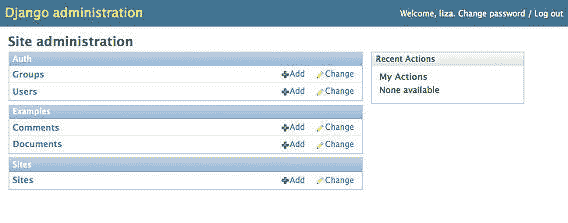
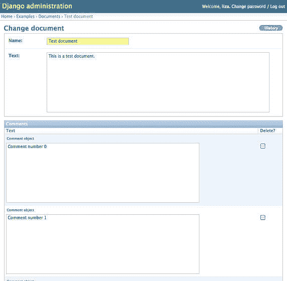
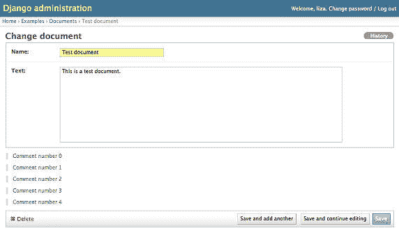

# 利用 Django admin 完成更多任务

> 原文：[`developer.ibm.com/zh/articles/os-django-admin/`](https://developer.ibm.com/zh/articles/os-django-admin/)

## Django admin

Django 为未来的开发人员提供了许多功能：一个成熟的标准库，一个活跃的用户社区，以及 Python 语言的所有好处。虽然其他 Web 框架也声称能提供同样的内容，但 Django 的独特之处在于它内置了管理应用程序 —— *admin*。

admin 提供了开箱即用的高级 Create-Read-Update-Delete (CRUD) 功能，减少了重复工作所需的时间。这是许多 Web 应用程序的关键所在，程序员可以在开发时快速浏览他们的数据库模型；非技术最终用户可以在部署时使用 admin 添加和编辑站点内容。

在现实中，总需要执行某些定制操作。关于 admin 外观的基本情况，Django 文档提供许多指南，Django 自身也包含了一些简单的方法用来改写 admin 行为的子集。如果您需要更多功能怎么办呢？从哪里开始着手呢？本文将指导您如何进行一些高级 adimin 定制。

## admin 快速浏览

大多数 Django 开发人员都很熟悉 admin 的默认功能。让我们快速回顾一下，首先编辑顶级 urls.py 启用 admin，见清单 1。

##### 清单 1\. 在 urls.py 中启用 admin

```
from django.conf.urls.defaults import *
# Uncomment the next two lines to enable the admin:
from django.contrib import admin
admin.autodiscover()

urlpatterns = patterns('',
    # Uncomment the next line to enable the admin:
    (r'^admin/(.*)', admin.site.root),
) 
```

本文使用的软件版本: Django V1.0.2，SQLite V3，Python V2.4-2.6（Django 尚不支持 Python V3），IPython（用作样例输出。Django Object-Relational Mapper (ORM) 支持许多数据库后端，但是 SQLite 是最简单的安装方式，许多操作系统都附带 SQLite。这些样例也适用于其他后端。Django 提供一个快速方式，可以使用独立代码设置工作环境：运行 `python manage.py shell`。本文中的所有代码样例都假设已经调用了该环境。在 Django lingo 中，假设如下：这是一个名为 more_with_admin 的 Django 项目。more_with_admin 项目包含一个名为 examples 的应用程序。examples 应用程序模拟基本的类博客文档系统，这些文档中还有多个评论（或没有）。所有命令行样例都来自 *project root* —— more_with_admin 主目录。

您还需要将 `django.contrib.admin` 应用程序添加到 `settings.INSTALLED_APPS` 。

在继续下一步前，建议计划扩展 admin 的用户熟悉一下源代码。对于支持快捷键和符号链接的操作系统，创建一个指向 admin 应用程序的快捷键或符号链接会很有用。

admin 包含在 Django 包中。假如已经使用安装工具安装了 admin，则它位于 django/contrib/admin 下的 site-packages 中。以下是一个项目到 Django admin 源的符号链接样例，您可以根据操作系统和 Django 安装的位置定制，以便更轻松的复制和引用：

`$ ln -s /path/to/Python/install/site-packages/django/contrib/admin admin-source`

`admin.autodiscover()` 方法迭代设置 .INSTALLED_APPS 中的每个应用程序，并查找名为 admin.py 的文件。该文件通常位于应用程序目录的最上方，与 models.py 级别一样。

样例应用程序需要清单 2 中提供的 models.py。相应的 admin.py 如下所示。

##### 清单 2\. 该应用程序的样例 models.py

```
from django.db import models
class Document(models.Model):
    '''A Document is a blog post or wiki entry with some text content'''
    name = models.CharField(max_length=255)
    text = models.TextField()

    def __unicode__(self):
        return self.name

class Comment(models.Model):
    '''A Comment is some text about a given Document'''
    document = models.ForeignKey(Document, related_name='comments')
    text = models.TextField() 
```

现在，您可以通过运行 Django 开发服务器调用 admin：

```
python manage.py runserver 
```

admin 可从默认位置 `http://localhost:8000/admin/` 获取。登录之后，您可以看到基本的 admin 屏幕，如下所示。

##### 图 1\. 基本的 Django admin 屏幕


更改 admin.py 中的代码：与 Django 应用程序中的其他文件不同，如果使用 Django 开发 Web 服务器更改 admin.py，您可能需要手动重启服务器。 注意，您的模型现在尚不可用，因为您还没有创建 admin.py。清单 3 展示的代码让您能在 admin 中使用模型。

##### 清单 3\. 样例 admin.py

```
from django.contrib import admin
from more_with_admin.examples import models

class DocumentAdmin(admin.ModelAdmin):
    pass

class CommentAdmin(admin.ModelAdmin):
    pass

admin.site.register(models.Document, DocumentAdmin)
admin.site.register(models.Comment, CommentAdmin) 
```

现在如果您在 admin 中重载主页，您将看到可用的新模型，如下所示。

##### 图 2\. 可以支持定制模型的 Django admin



## 定制 admin 模型页面

##### admin 文件夹中的目录名称

注意，我使用模型的小写名称。这与生成 URL 时处理普通 admin 页面的方式是一致的。Django 调用支持 URL 的表格 *slugs*。如果您不确定给定的模型应该使用哪个 slug，可以在创建目录之前先浏览 admin 并留意出现在 URL 中的名称。

理解在不修改 Django 源代码的情况下如何定制 admin 的关键在于，记住 admin 像其他程序一样只是一个普通的 Django 应用程序。最重要的一点是，这意味着可以使用 Django 模版继承系统。

Django 的模版搜索顺序总是将您自己项目的模版排在其他系统之前。此外，admin 在恢复到默认情况前，会尝试搜索匹配每个模型的硬编码模版。这为轻松定制提供了一个扩展点。

首先，确保 Django 通过编辑项目的 settings.py 来查看您的模版目录。

##### 清单 4\. 编辑 settings.py 以查看模版目录

```
TEMPLATE_DIRS = (
    "/path/to/project/more_with_admin/templates",
    "/path/to/project/more_with_admin/examples/templates",
) 
```

然后在项目中创建以下目录：

```
$ mkdir templates/admin/examples/document/
$ mkdir templates/admin/examples/comment/ 
```

Django admin 的特殊行为将检查目录和应用程序名称（这里是 `examples` ），然后是模型的名称（ `document` 和 `comment` ），然后才能使用系统模版呈现该管理页面。

### 重写单个模型添加/编辑页面

admin 用来添加和编辑模型实例的页面名称是 change_form.html。首先在 `Document` 模型目录中创建一个名为 templates/admin/examples/document/change_form.html 的页面，然后将 Django 模版继承线置入其中： `` 。

现在可以进行定制了。花一些时间熟悉实际的 admin/change_form.html 的内容。它很合理地将一些可以重写的模板块组织到一起，但是有些定制可能需要大量复制模块。不过，使用基于块的模板重写总是比复制整个页面要好。

您想对添加/编辑页面执行哪种定制？对于系统中的每个 `Document` ，您应该展示 5 个最近评论的预览。

首先，创建一些样例内容。

##### 清单 5\. 使用 Django shell 创建带几个评论的样例 `Document`

```
$ python manage.py shell
In [1]: from examples import models
In [2]: d = models.Document.objects.create(name='Test document',
                                           text='This is a test document.')
In [3]: for c in range(0, 10):
   ...:     models.Comment.objects.create(text='Comment number %s' % c, document=d) 
```

现在，admin 列表页面展示一个 `Document` 。选择该 `Document` 打开默认的添加/编辑页面，如下所示。

##### 图 3\. 带有 `Document` 的默认添加/编辑页面


注意，相关评论不显示。在 admin 中显示相关模型的标准方法是使用强大的 `Inline` 类。 `Inline` 类允许 admin 用户在单个页面编辑或添加多个相关模型。要查看运行的 `inline` ，按照清单 6 编辑应用程序 admin.py。

##### 清单 6\. 向 `Document` admin 添加相关模型评论

```
from django.contrib import admin
from more_with_admin.examples import models

class CommentInline(admin.TabularInline):
    model = models.Comment

class DocumentAdmin(admin.ModelAdmin):
    inlines = [CommentInline,]

class CommentAdmin(admin.ModelAdmin):
    pass

admin.site.register(models.Document, DocumentAdmin)
admin.site.register(models.Comment, CommentAdmin) 
```

图 4 展示了添加 `TabularInline` 控件之后新的添加/编辑页面。

##### 图 4\. 将评论模型作为 `Inline` 添加之后的添加/编辑页面



这无疑非常强大，但是如果只想快速预览评论的话就没必要这样做了。

这里您可以采取两种方法。一种是使用 Django admin widget 接口编辑与 `inline` 关联的 HTML widget；Django 文档详细描述了 widget。另一种方法是直接修改添加/编辑页面。如果不希望使用任何特定于 admin 的功能，那么该方法非常有用。

如果不允许编辑评论（可能是由于用户没有足够的权限），但是 *又想* 让用户看到评论，那么可以修改 change_form.html。

### Django admin 提供的变量

要在模型实例页面添加功能，您需要了解 admin 已经可以使用什么数据。两个键变量的说明如下。

##### 表 1\. 定制 admin 模版需要的变量

| 变量 | 说明 |
| --- | --- |
| `object_id` | 这是编辑对象时需要的主键。如果要定义特定的实例页面（比如 Document），那么使用该键就够了。 |
| `content_type_id` | 如果要重写多种模型页面，使用该变量查询 `ContentTypes` 框架来获取模型的名称。更多有关内容类型的信息，请参见 参考资料 。 |

### 为 admin 页面中的内容创建模板标记

列出无法直接输入 Django 模板的相关评论查询代码。最佳的解决方案是使用模板标记。首先，创建模板标记目录 and **init**.py 文件：

```
$ mkdir examples/templatetags/
$ touch examples/templatetags/__init__.py 
```

创建一个名为 examples/templatetags/example_tags.py 的新文件，并添加以下代码。

##### 清单 7\. 根据给定 Document ID 检索评论的模板标签

```
from django import template
from examples import models

register = template.Library()

@register.inclusion_tag('comments.html')
def display_comments(document_id):
    document = models.Document.objects.get(id__exact=document_id)
    comments = models.Comment.objects.filter(document=document)[0:5]
    return { 'comments': comments } 
```

由于这是一个包含标签，您需要创建相应的模板文件：comments.html。编辑 examples/templates/comments.html 文件并输入清单 8 中的代码。

##### 清单 8\. 显示评论预览集的模板

```

<blockquote>{{ comment.text }}</blockquote>
 
```

现在可以将它添加到 admin 页面了。在 admin.py 中注释掉对 `CommentInline` 的引用，并按照清单 9 更改 change_form.html 的本地版本。

##### 清单 9\. 在添加/编辑页面包含模板标签

```





  
   
```

在使用前检查 `object_id` 的存在很重要，因为 change_form.html 还可以用来创建新实例，在这种情况下 `object_id` 不可用。 `after_field_sets` 块只是 admin 中提供的众多扩展点之一。其他请参考 change_form.html 源页面。

图 5 展示了更新后的表格。

##### 图 5\. 包含模板标记之后的添加/编辑页面



## 修改 admin 行为

模板重写只能做这么多了。如果您想更改 admin 的实际流和行为怎么办呢？修改源代码不是不可能，但是那会让您受制于更新时使用的特定 Django 版本。

### 重写 `AdminModel` 方法

默认情况下，在 admin 中单击 **Save** 将用户带回到列表页面。通常这没有问题，但是如果您想直接到 admin 外部的对象预览页面，那应该怎么办？在开发内容管理系统 (CMS) 时这种情况很常见。

##### 提供 get_absolute_url() 方法

清单 10 假设已经修改了 `Document` 以包含 `get_absolute_url()` 方法，该方法是 Django 模型指定规范表示的推荐方法。如果指定了规范表示，Django admin 还在该模型的每个页面上放置一个有用的 **View on site** 按钮。

admin 应用程序中的大部分功能都附加到 `admin.ModelAdmin` 类。这是该对象从 admin.py 中继承的类。您可以重写许多许多公开方法。类定义请查看 admin-source/options.py 中的源代码。

有两种方法可以更改 **Save** 按钮的行为：您可以重写 `admin.ModelAdmin.response_add` ，该按钮负责保存后的实际重定向；还可以重写 `admin.ModelAdmin.change_view` 。后一种方式更为简单。

##### 清单 10\. 保存事件之后重写指向用户的页面

```
class DocumentAdmin(admin.ModelAdmin):

    def change_view(self, request, object_id, extra_context=None):

        result = super(DocumentAdmin, self).change_view(request, object_id, extra_context)

        document = models.Document.objects.get(id__exact=object_id)

        if not request.POST.has_key('_addanother') and
              not request.POST.has_key('_continue'):
            result['Location'] = document.get_absolute_url()
        return result 
```

现在用户单击 **Save** 时，他们将被指向预览页面，而不是展示所有 Documents 的列表页面。

### 使用 signals 向 admin 添加功能

signals 是 Django 中较少使用的功能，它可以提高代码的模块化程度。signals 定义保存模型或加载模板的事件，无论它在哪里运行，Django 项目都可以侦听到并对它做出反应。这意味着您可以轻松的提高应用程序的行为，而无需直接修改它们。

admin 提供了一个应用程序开发人员经常想修改的功能：通过 `django.contrib.auth.models.User` 类管理用户。Django 用户往往只能添加或修改 admin，这使得这个有用的类很难定制。

想象一下，您希望每次创建一个新的 `User` 对象时，站点管理员都能收到一封电子邮件。因为 `User` 模块无法直接在项目中使用，实现该目标的唯一方法似乎是子类化 `User` 或者使用间接方法，比如创建虚拟配置文件对象进行修改。

清单 11 展示了在保存 `User` 实例时添加运行的函数有多么简单。signals 通常被添加到 models.py。

##### 清单 11\. 添加新用户时使用 Django signals 进行通知

```
from django.db import models
from django.db.models import signals
from django.contrib.auth.models import User
from django.core.mail import send_mail

class Document(models.Model):
    [...]

class Comment(models.Model):
    [...]

def notify_admin(sender, instance, created, **kwargs):
    '''Notify the administrator that a new user has been added.'''
    if created:
       subject = 'New user created'
       message = 'User %s was added' % instance.username
       from_addr = 'no-reply@example.com'
       recipient_list = ('admin@example.com',)
       send_mail(subject, message, from_addr, recipient_list)

signals.post_save.connect(notify_admin, sender=User) 
```

`post_save` signal 由 Django 提供，每次保存或创建模型时都会激活。 `connect()` 方法带有两个参数：一个回调参数（ `notify_admin` ）和 `sender` 参数，后者指定该回调只关注 `User` 模型的保存事件。

在回调中， `post_save` signal 传递发送方（模型类）、该模型的实例和提示是否刚刚创建了实例的布尔值。在本例中，如果创建了 `User` ，该方法将发送一封电子邮件；否则不执行任何操作。

有关其他 Django 提供的 signals 列表，请参见 参考资料 ，以及介绍如何编写 signals 的文档。

## 进一步修改：添加低级权限

##### 为什么 blank=True？

如果不是文本字段，很难看出 `ForeignKey` 字段应该设置为 `blank=True`。在本例中，Django admin 使用 `blank` 而不是 `null` 决定了保存模型前是否必须手动设置值。

如果您仅仅提供 `null=True`（或者干脆不设置），那么 Django admin 在保存前将强制用户手动选择一个 “added by” 值，而其实您希望该行为对于当前保存用户是默认行为。

一个常用的 Django admin 特性是它的权限系统，该系统可以扩展以包含低级权限。默认情况下，admin 可以细粒度控制角色和权限，但是这些角色仅应用于类级别：用户可以修改所有 Document 或不修改任何 Document。

往往只允许用户修改特定的对象。这常常称为 *低级* 权限，因为它们只能修改特定数据库表格行，而综合权限可以修改表格中的任何记录。样例应用程序中的情况可能是您只希望用户看到他们创建的 Document。

首先，更新 models.py 以包含创建 `Document` 的属性记录，如下所示。

##### 清单 12\. 更新 models.py 以记录创建每个 `Document` 的用户

```
from django.db import models
from django.db.models import signals
from django.contrib.auth.models import User
from django.core.mail import send_mail

class Document(models.Model):
    name = models.CharField(max_length=255)
    text = models.TextField()
    added_by = models.ForeignKey(User,
      null=True, blank=True)

    def get_absolute_url(self):
        return 'http://example.com/preview/document/%d/' % self.id

    def __unicode__(self):
        return self.name
[...] 
```

接下来，需要添加代码自动记录哪个用户创建了 `Document` 。signals 无法用于这种情况，因为 signal 没有访问用户对象。但是， `ModelAdmin` 类提供了一个方法，使用该请求和当前用户作为参数。

修改 admin.py 中的 `save_model()` 方法，如下所示。

##### 清单 13\. 重写 `DocumentAdmin` 中的方法，以在创建数据库时保存当前用户

```
from django.contrib import admin
class DocumentAdmin(admin.ModelAdmin):
    def save_model(self, request, obj, form, change):
        if getattr(obj, 'added_by', None) is None:
            obj.added_by = request.user
        obj.last_modified_by = request.user
        obj.save()

[...] 
```

如果 `added_by` 的值是 `None` ，那么这就是一个尚未保存的新记录。（您还可以检查 `change` 是否为 `false` ，这指示是否将添加记录，但是检查 `added_by` 是否为空表示是否填写添加到 admin 之外的记录）。

另一个低级权限是将文档列表限制在创建它们的用户范围内。 `ModelAdmin` 类为此提供了一个钩子程序 —— 它有一个名为 `queryset()` 的方法，该方法可以确定任何列表页面返回的默认查询集。

如清单 14 所示，重写 `queryset()` 以便将清单限制在当前用户创建的这些 Document 中。超级用户可以看到所有文档。

##### 清单 14\. 重写列表页面返回的查询集

```
from django.contrib import admin
from more_with_admin.examples import models

class DocumentAdmin(admin.ModelAdmin):

    def queryset(self, request):
        qs = super(DocumentAdmin, self).queryset(request)

        # If super-user, show all comments
        if request.user.is_superuser:
            return qs

        return qs.filter(added_by=request.user)
[...] 
```

现在，任何对 admin 中 `Document` 列表页面的查询只显示当前用户创建的文档（除非当前用户是高级用户，这种情况下将显示所有文档）。

当然，只要知道 ID，用户就可以访问编辑页面查看未授权的文档，当前对此没有任何阻止手段。真正安全的低级权限需要重写更多方法。因为 admin 用户通常都达到某种水平的信任，所以有时一些基本的权限便足以提供精简的工作流了。

## 结束语

定制 Django admin 不需要 admin 源代码知识，也不需要修改源代码。admin 可以使用普通的 Python 继承和一些 Django 特有功能（比如 signals）进行扩展。

通过创建全新管理界面定制 admin 的优点很多：

*   保证活动开发持续进行的同时，您的应用程序可以从 Django 的优势中受益。
*   admin 已经支持大部分通用用例。
*   添加到项目的外部应用程序可以自动与代码并排管理。

在 Django V1.1 中，admin 提供了两种常用的新功能：在列表页面编辑内联字段和 *admin 动作* ，后者允许一次批量更新许多项目。这两个新功能都不需要从头编写通用的功能，并且为其他定制操作提供了扩展点。