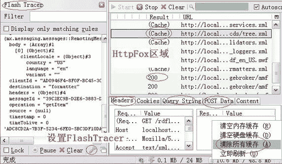
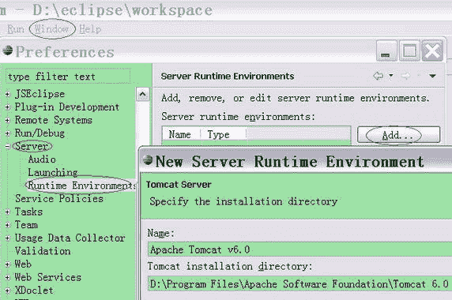
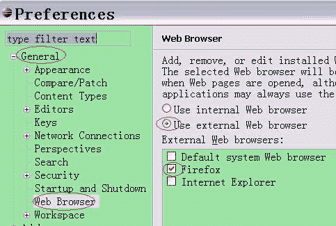
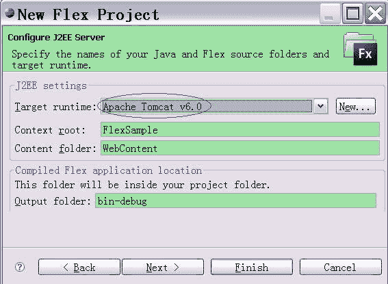
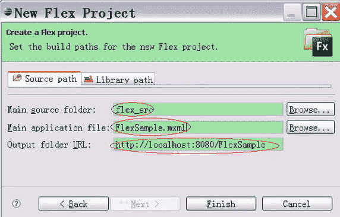
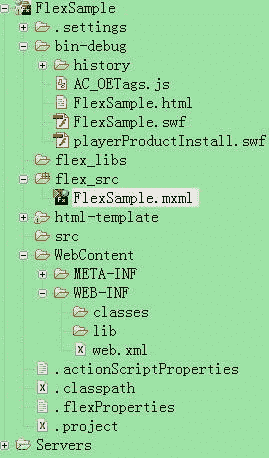
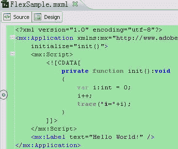
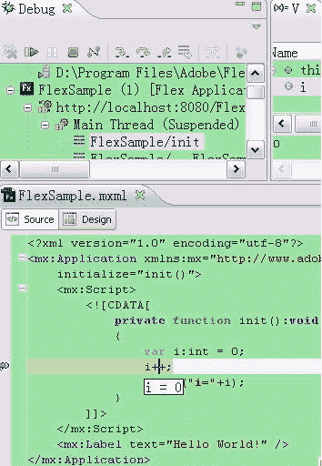
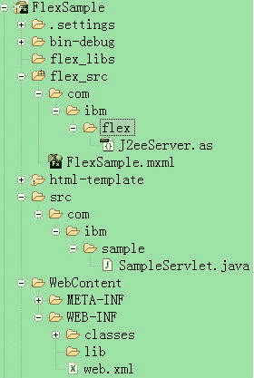

# Flex 开发入门

> 原文：[`developer.ibm.com/zh/articles/wa-lo-flexdev/`](https://developer.ibm.com/zh/articles/wa-lo-flexdev/)

## 开始之前

Flex 作为富 Internet 应用（RIA）时代的新技术代表，自从 2007 年 Adobe 公司将其开源以来，Flex 就以前所未有的速度在成长。很多公司，包括 IBM 都纷纷加入了 Flex 开发的阵营当中。很多开发人员也按捺不住 Flex 的”诱惑”而准备从事 Flex 开发。本文主要讲述 Flex 开发的基础知识，主要是关于开发环境的搭建，以及介绍简单的 Flex 项目创建、编码、调试以及部署的过程和 Flex 编程的基本知识。通过本文的学习，您将会学习如何搭建 Flex 基本的开发环境以及开发、调试和部署方面的基础知识。为您以后深入系统的学习 Flex 打下良好的基础。

要学习本文，您需要有一定的 Web 编程经验和 Eclipse FireFox 使用经验。

### 代码示例和安装要求

本文所有示例均在 Windows XP SP3 系统中测试完成。您需要一台能流畅运行 Windows XP 系统的机器，除此之外您还需要一些工具才能试用本文中的代码。所有这些工具都可以免费下载（参见 参考资源 ）：

*   Java SDK 1.5 或更高版本
*   Tomcat 6.0 或更高版本
*   Eclipse 3.3 或更高版本
*   Flex Builder 3.0 或更高版本
*   FireFox2.0 或更高版本

## 安装配置开发环境

接下来我们便迫不及待的开始吧！首先搭建我们的开发环境，为了减少因为环境不一致而引起的问题，建议读者使用与本文相同的软件版本：

*   [下载](http://java.sun.com/javase/downloads/index.jsp) 并安装 JDK( 本文使用版本为 Sun JDK 6) ；
*   [下载](http://www.eclipse.org/downloads/download.php?file=/technology/epp/downloads/release/ganymede/SR1/eclipse-jee-ganymede-SR1-win32.zip) 并解压 Eclipse( 本文使用版本为 Eclipse Ganymede J2EE 版本，含 WTP 插件 );
*   [下载](https://www.adobe.com/cfusion/tdrc/index.cfm?product=flex_eclipse) 并安装 Flex Builder Eclipse 插件版 ( 本文使用的 Flex Builder 版本为 3.0.1);
*   [下载](https://tomcat.apache.org/download-80.cgi) 并安装 Tomcat( 本文使用版本为 Tomcat6.0.18);
*   [下载](http://www.mozilla.com/en-US/firefox/all-older.html) 并安装 FireFox( 由于 Flex3.0 和一些插件的兼容性问题，本文使用 FireFox2.0.0.17)

##### 小提示

Flex Builder 提供两个版本，一个是 All in one 的版本，另外一个是 Eclipse 的插件版，All in one 的版本内置了一个 Eclipse 的基本核心，插件不全。所以我们采用单独下载 Eclipse 和安装 Flex Builder 插件版的方式。另外在安装过程中不要安装 FlashPlayer 到 IE 或者 FireFox 上。我们在接下来的步骤中将单独安装 debug 版本的 Flash Player 。

大家知道 Flex 代码编译后是一个 SWF 文件，运行在 Flash Player 中，要想看到 SWF 文件在运行时输出的一些调试信息是比较困难的。所以在安装好基本的软件之后，我们要安装一些便于我们调试 Flex 的 FireFox 插件：

下载并安装 debug 版本的 FireFox Flash Player 插件 ( 本文使用的版本为 Flash Player10)

打开 FireFox，到 FireFox 的 [扩展组件站点](https://addons.mozilla.org/zh-CN/firefox/) 上搜索并安装 HttpFox，FlashTracer，Cache Status 三个插件，如图 1 所示。

##### 图 1\. 开发调试需要的 FireFox 插件



##### 小提示

在 Debug 版本的 Flash player 和 FlashTracer 插件完成好之后，我们发现 FlashTracer 并不能正常的显示用 trace 语句输出的调试信息。为了使其能够工作，还需要先点击图 1 中的 FlashTracer 设置按钮来设置日志文件的输出路径。并且输出的日志文件路径对于 Windows XP 来说必须是 C:\Documents and Settings\Administrator\Application Data\Macromedia\Flash Player\Logs\flashlog.txt 。

在安装了 Debug 版本的 Flash Player 之后，Flash Tracer 能显示您在程序中用 trace() 语句输出的调试信息，HttpFox 插件不仅能查看 HTTP 通信的过程和数据，还能看到哪些内容是从 Cache 里面读取的。另外，Cache Status 插件可以让我们方便的管理缓存。在 Flex 开发过程中，往往需要先清除掉缓存中的内容，才能看到新改动的效果。

接下来我们打开 Flex Builder, 在菜单 **Window>Preferences>Server>Runtime Environment** 中设置我们的 Tomcat6 以及在菜单 **Window>Preferences>General>Web Browser** 中设置浏览器为外部浏览器 FireFox，如图 2 和图 3 所示：

##### 图 2\. 配置 Tomcat



##### 图 3\. 设置默认浏览器



到此为止，我们的开发环境算是彻底搭建完毕，可以看出这个过程并不算是特别简单。别急，先苦后甜，小憩一下，让我们来享受一下 Flex 开发带来的乐趣吧！

## Flex 的 Hello World ！

### 创建项目

打开 Flex Builder, 如图 4 所示，新建一个 Flex 项目：

##### 图 4\. 新建 Flex 项目


在图 5 所示设置页面中，我们选择项目类型是 Web application，关于 AIR 类型应用的基础知识可参考 developerWorks 上的另一篇文章 [《使用 Adobe AIR 和 Dojo 开发基于 Ajax 的 Mashup 应用》](http://www.ibm.com/developerworks/cn/edu/wa-dw-wa-air-mashup.html) 。 Application server type 我们以 J2EE 为例，并且不要钩选 Use remote object access service, 关于这些高级内容，我们将在后续的文章中陆续讨论。最后我们使用 Eclipse Ganymede J2EE 版本内置的 WTP(Web Tools Platform) 来创建一个后端使用 Java 前端使用 Flex 的 RIA 项目。在默认设置下，src 是 Java 代码的源代码文件夹。

##### 图 5\. 设置 Flex 项目


在后续的设置页面中，我们配置项目运行时的 J2EE server 为我们在安装配置开发环境部分中配置的 Tomcat6 如图 6 所示：

##### 图 6\. 配置运行时 J2EE Server



点击 Next，在下一个页面中一切都按照默认设置即可。如图 7 所示，Main source folder 是设置默认的 flex 代码 ( 包括 mxml 和 Action script) 的源文件夹，Main application file 是项目默认的主应用。 Out folder URL 是项目运行在我们配置的 Tomcat 上时的 URL.

##### 图 7\. 其他属性设置



一切完成之后，我们来看看项目的组成结构，如图 8 所示：flex_src 中是默认的 flex 源码位置，flex_libs 则是存放 flex 其他第三方包的默认路径。类似于 web 应用的 lib 文件夹。 src 是 java 代码位置。 WebContent 文件夹的结构和普通由 WTP 建立的 Web Project 的结构完全相同。在默认的输出路径 bin-debug 文件夹中，我们可以看出 Flex builder 自动生成的 FlexSample.mxml 文件已经被自动编译成 FlexSample.swf 文件。

##### 图 8\. Flex 项目结构



接下来，我们在新创建的项目上增加一点内容并让它运行起来：双击 FlexSample.mxml, 在其中添加一个最基本的 Flex 组件 :Label, 并且在该应用初始化的时候调用 init() 方法。我们在 init() 方法中用 trace() 语句输出调试信息。 代码如下清单 1 所示：

##### 清单 1\. FlexSample.mxml

```
<?xml version="1.0" encoding="utf-8"?>
<mx:Application
    xmlns:mx="http://www.adobe.com/2006/mxml"
    layout="absolute"
     initialize="init()">
     <mx:Script>
         <![CDATA[
             private function init():void
             {
                 var i:int = 0;
                 i++;
                 trace("i="+i);
             }
         ]]>
     </mx:Script>
    <mx:Label text="Hello World!" />
</mx:Application> 
```

### 运行、调试以及部署

现在，终于到了让我们的项目运行的时候了 ! 右键点击项目 ->Run As->Run On Server 如图 9 所示：接下来的几个页面选择默认即可，这时大家我们可以看到项目会被部署到我们配置的 Tomcat6 上去。并且 Flex Builder 会自动打开一个我们刚才配置的外部 FireFox 窗口。

##### 图 9\. 运行项目


但可能令您遗憾的是 Flex Builder 自动打开的 FireFox 窗口打开的 URL: `http://localhost:8080/FlexSample/` 却什么也没有。别着急，还剩下最后一步：

如图 10 所示：右键点击我们要运行的 FlexSample.mxml > Run As > Flex Application

##### 图 10\. 运行 mxml


如果不出意外的话，您应该会看到下面的界面，Flash Tracer 插件输出了我们用 trace() 语句输出的 debug 信息，标签的 Hello World！也被显示到了界面上。同样，打开 FireFox 的 HttpFox 插件，我们也可以看到在运行时 FlexSample.swf 被载入。

##### 图 11\. 运行后的界面


如果我们希望像调试 Java 代码那样，在运行时观察变量的值怎么办呢？首先我们像在 Java 代码中设置断点一样给我们的 Action Script 代码增加断点。如图 12 所示：

##### 图 12\. 在 Action Script 代码中设置断点



然后选择我们的 FlexSample.mxml 右键选择调试运行。如图 13 所示：

##### 图 13\. 调试方式运行 flex


然后我们随提示切换到 Flex 的调试视图，就会看到我们可以像 Java 调试模式那样轻松的调试 Flex 代码。如图 14 所示：

##### 图 14\. Flex Builder 调试视图



利用 WTP，我们可以将项目 export 成一个标准的 war file. 将导出的 war 文件放到 Tomcat 的 webapps 目录或者其他 web 服务器的相应目录下就可以当作一个标准的 web 应用来部署运行。

到此为止，我们应该庆祝一下我们已经迈入了 Flex 的大门了！我们已经编译出了我们自己的 swf 文件，并且运行在服务器上了。熟悉了这个开发过程之后，让我们乘胜前进，结合一个小例子学习一下 Flex 的编程基础知识吧！

## Flex 编程基础

### 面向对象的编程

在上面 Hello World 的例子中我们可以看出，就像在 HTML 中嵌入 JavaScript 那样，我们可以在 mxml 里面嵌入 Action Script 代码来实现业务逻辑。没错！如果您把 Flex 中 mxml 和 Action Script 的关系理解为 Html 和 JavaScript 的关系，您会忽然发现您对 Flex 变的如此熟悉！

Action Script 语言是面向对象的脚本语言，它连编写方式都和 JavaScript 非常的相似。除了可以嵌套在 mxml 里面之外，它还可以像 JavaScript 写在单独的 .js 文件里面那样写在单独的 .as 文件里面，然后在 mxml 里面引入它。

下面我们新建一个 Action Script 的类 J2eeServer.as 如清单 2 所示：

##### 清单 2\. J2eeServer.as

```
package com.ibm.flex
{
    import flash.events.EventDispatcher;
    import mx.rpc.AsyncToken;
    import mx.rpc.events.FaultEvent;
    import mx.rpc.events.ResultEvent;
    import mx.rpc.http.HTTPService;

    public class J2eeServer extends EventDispatcher
    {
        public function J2eeServer()
        {
        }

        public function sendRequest(locale:String):void
        {
            var httpObject:HTTPService = new HTTPService();
            httpObject.resultFormat = "text";
            httpObject.url =
                "http://localhost:8080/FlexSample/SampleServlet?locale="+locale;
            var responder:mx.rpc.Responder = new mx.rpc.Responder(onSuccess, onFault);
            var call:AsyncToken = httpObject.send();
            call.addResponder(responder);
        }
        private function onSuccess(event:ResultEvent):void
        {
            this.dispatchEvent(event);
        }

        private function onFault(event:FaultEvent):void
        {
            trace("communication failed!");
            this.dispatchEvent(event);
        }
    }
} 
```

在这个类定义里面，熟悉 Java 的开发人员可以看出其编码规范和 Java 非常类似。在其中我们定义了一个 sendRequest() 方法， 使用 HTTPService 对象发起一个 http 的 get 请求 , 并且对于不同的返回结果我们定义了 onSuccess() 和 onFault() 两个方法去处理。在这两个结果处理方法中，我们将事件 dispatch 出去。

### 与 Servlet 集成

在 J2eeServer.as 中，我们通过 Action Script 发出 http 请求，现在我们定义一个服务器端的 servlet 来处理该请求。如清单 3 所示：

##### 清单 3\. SampleServlet.java

```
package com.ibm.sample;

import java.io.IOException;
import java.io.PrintWriter;

import javax.servlet.ServletException;
import javax.servlet.http.HttpServlet;
import javax.servlet.http.HttpServletRequest;
import javax.servlet.http.HttpServletResponse;

public class SampleServlet extends HttpServlet {
    private static final long serialVersionUID = 1L;

    public SampleServlet() {
        super();
    }

    protected void doGet(HttpServletRequest request,
            HttpServletResponse response) throws ServletException, IOException {
        doPost(request, response);
    }

    protected void doPost(HttpServletRequest request,
            HttpServletResponse response) throws ServletException, IOException {
        String locale = request.getParameter("locale");
        response.setContentType("text/html");
        PrintWriter out = response.getWriter();
        out.println("The locale you selected is " + locale);
    }
} 
```

和普通 web 应用一样配置 web.xml, 如清单 4

##### 清单 4\. web.xml

```
<?xml version="1.0" encoding="UTF-8"?>
<web-app id="WebApp_ID" version="2.4" xmlns="http://java.sun.com/xml/ns/j2ee"
    xmlns:xsi="http://www.w3.org/2001/XMLSchema-instance"
    xsi:schemaLocation="http://java.sun.com/xml/ns/j2ee
        http://java.sun.com/xml/ns/j2ee/web-app_2_4.xsd">
    <display-name>FlexSample</display-name>
    <servlet>
        <display-name>SampleServlet</display-name>
        <servlet-name>SampleServlet</servlet-name>
        <servlet-class>com.ibm.sample.SampleServlet</servlet-class>
    </servlet>
    <servlet-mapping>
        <servlet-name>SampleServlet</servlet-name>
        <url-pattern>/SampleServlet</url-pattern>
    </servlet-mapping>
    <welcome-file-list>
        <welcome-file>FlexSample.html</welcome-file>
    </welcome-file-list>
</web-app> 
```

### 事件驱动与数据绑定

从 J2eeServer.as 中我们依稀可以看出 Flex 事件驱动的影子。的确，Flex 的业务流程大多是靠事件来驱动的。某一个方法结束后，dispatch 出去一个事件。事件的监听者监听到这个事件后就会采取相应的动作来处理事件。如清单 5 所示：我们在 init() 方法中进行了事件绑定，绑定了两个监听方法 successHandler () 和 errorHandler () 到 J2eeServer 上。当 J2eeServer 完成和服务器端 servlet 通信 dispatch 出相应的事件后，两个监听方法便会监听到相应的事件并进行处理。

Flex 的另外一个重要的特点就是支持数据绑定，在另一篇文章 [使用 Eclipse 和 JavaFX 开发 Mashup 应用](http://www.ibm.com/developerworks/cn/edu/j-dw-java-jfx-mashup.html) 中我们曾介绍了 JavaFx 的数据绑定特性，同样 Flex 也支持数据绑定。当数据源被绑定到另外一个对象的某属性上时，数据源的数据如果发生变化，开发人员不需要写额外的代码该对象的属性值就可以相应的变化。如清单 5 中所示：如果要进行数据绑定，则要先定义一个可绑定的数据源，例如我们在变量 `**private var** serverResponse:String = **""** ;` 的上面设置 [Bindable] 属性，表示其为可绑定变量。然后我们在 resultLable 中使用花括号 {`serverResponse`} 将变量 `serverResponse` 绑定到 resultLable 的 text 属性上。

##### 清单 5\. FlexSample.mxml

```
<?xml version="1.0" encoding="utf-8"?>
<mx:Application xmlns:mx="http://www.adobe.com/2006/mxml" layout="absolute"
     creationComplete="init()">
     <mx:Script>
         <![CDATA[
             import mx.rpc.events.ResultEvent;
             import mx.rpc.events.FaultEvent;
             import com.ibm.flex.J2eeServer;
             import mx.collections.ArrayCollection;

            private var jserver:J2eeServer = new J2eeServer();
            //可绑定变量
            [Bindable]
            private var serverResponse:String = "";
            //可绑定变量
            [Bindable]
            private var locales:ArrayCollection = new ArrayCollection(
                                                      [ {label:"en_us", data:"en_us"},
                                                         {label:"zh_cn", data:"zh_cn"}]);

             private function init():void
             {
                 //事件绑定
                jserver.addEventListener(ResultEvent.RESULT, successHandler);
                jserver.addEventListener(FaultEvent.FAULT, errorHandler);
             }
             private function localeComboxChangeHandler(event:Event):void
             {
                 jserver.sendRequest(localeCombox.selectedItem.data);
             }

             private function successHandler(event:ResultEvent):void
             {
                 serverResponse = event.result.toString();
                 trace(event.result);
             }
             private function errorHandler(event:FaultEvent):void
             {
                 serverResponse = event.message.toString();
                 trace(event.message);
             }
         ]]>
     </mx:Script>
     <mx:VBox>
        <mx:Label text="Select your locale:" />
        <mx:ComboBox
            id="localeCombox"
            width="160"
            dataProvider="{locales}"
            change="localeComboxChangeHandler(event)"/>
        <mx:Label
            id="resultLabel"
            text="The response from server is: {serverResponse}" />
     </mx:VBox>
</mx:Application> 
```

最终项目的文件结构如图 15 所示：

##### 图 15\. 项目文件结构图



运行项目，我们可以看到当我们改变下拉框的值的时候，会触发 localeComboxChangeHandler() 函数调用 J2eeServer 的 sendRequest() 方法将选择的 locale 值发送给服务器端的 servlet，并且在结果返回后，将从服务器端得到的 response 显示在 resultLable 上。如图 16 所示：

##### 图 16\. 项目运行结果


## 结束语

Flex 作为 RIA 的新技术，对传统 web 开发技术有继承也有发展。这篇文作为入门文，主要作用是帮助大家掌握 Flex 的开发环境、开发方式、开发调试部署的流程以及 Flex 的基本编程知识。但 Flex 除了国际化、Unit 测试、Ant 编译等传统问题之外，作为新技术 Flex 还有很多不同以往的地方，比如模块开发，RSL(Runtime Shared Libraries), Shared object、和 JavaScript 交互以及它的 MVC 框架 cairngorm，远程调用和消息传递框架 BlazeDS 等。所有这些问题都是值得我们进行后续讨论的。

### 致谢

在本文完成之际，特别感谢 IBM 中国软件开发中心 IM 开发团队我的同事们在工作和学习中给我的巨大帮助！