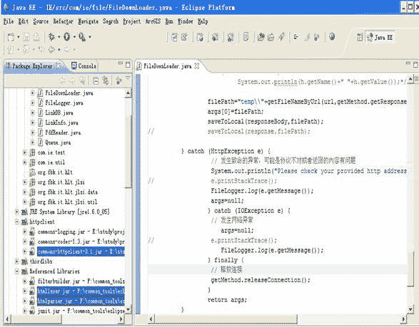
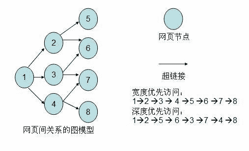
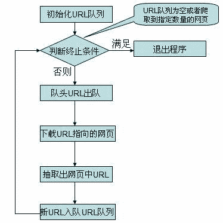

# 使用 HttpClient 和 HtmlParser 实现简易爬虫

> 原文：[`developer.ibm.com/zh/articles/os-cn-crawler/`](https://developer.ibm.com/zh/articles/os-cn-crawler/)

## 使用 HttpClient 和 HtmlParser 实现简易爬虫

这篇文章介绍了 HtmlParser 开源包和 HttpClient 开源包的使用，在此基础上实现了一个简易的网络爬虫 (Crawler)，来说明如何使用 HtmlParser 根据需要处理 Internet 上的网页，以及如何使用 HttpClient 来简化 Get 和 Post 请求操作，构建强大的网络应用程序。

## HttpClient 与 HtmlParser 简介

本小结简单的介绍一下 HttpClinet 和 HtmlParser 两个开源的项目，以及他们的网站和提供下载的地址。

### HttpClient 简介

HTTP 协议是现在的因特网最重要的协议之一。除了 WEB 浏览器之外， WEB 服务，基于网络的应用程序以及日益增长的网络计算不断扩展着 HTTP 协议的角色，使得越来越多的应用程序需要 HTTP 协议的支持。虽然 JAVA 类库 .net 包提供了基本功能，来使用 HTTP 协议访问网络资源，但是其灵活性和功能远不能满足很多应用程序的需要。而 Jakarta Commons HttpClient 组件寻求提供更为灵活，更加高效的 HTTP 协议支持，简化基于 HTTP 协议的应用程序的创建。 HttpClient 提供了很多的特性，支持最新的 HTTP 标准，可以访问 [这里](http://hc.apache.org/httpclient-3.x/) 了解更多关于 HttpClinet 的详细信息。目前有很多的开源项目都用到了 HttpClient 提供的 HTTP 功能，登陆 [网址](http://wiki.apache.org/jakarta-httpclient/HttpClientPowered) 可以查看这些项目。本文中使用 HttpClinet 提供的类库来访问和下载 Internet 上面的网页，在后续部分会详细介绍到其提供的两种请求网络资源的方法： Get 请求和 Post 请求。Apatche 提供免费的 HTTPClien t 源码和 JAR 包下载，可以在相关页面下载最新的 HttpClient 组件。笔者使用的是 HttpClient3.1。

### HtmlParser 简介

当今的 Internet 上面有数亿记的网页，越来越多应用程序将这些网页作为分析和处理的数据对象。这些网页多为半结构化的文本，有着大量的标签和嵌套的结构。当我们自己开发一些处理网页的应用程序时，会想到要开发一个单独的网页解析器，这一部分的工作必定需要付出相当的精力和时间。事实上，做为 JAVA 应用程序开发者， HtmlParser 为其提供了强大而灵活易用的开源类库，大大节省了写一个网页解析器的开销。 HtmlParser 是 [`sourceforge.net`](http://sourceforge.net/) 上活跃的一个开源项目，它提供了线性和嵌套两种方式来解析网页，主要用于 html 网页的转换(Transformation) 以及网页内容的抽取 (Extraction)。HtmlParser 有如下一些易于使用的特性：过滤器 (Filters)，访问者模式 (Visitors)，处理自定义标签以及易于使用的 JavaBeans。正如 HtmlParser 首页所说：它是一个快速，健壮以及严格测试过的组件；以它设计的简洁，程序运行的速度以及处理 Internet 上真实网页的能力吸引着越来越多的开发者。 本文中就是利用 HtmlParser 里提取网页里的链接，实现简易爬虫里的关键部分。HtmlParser 最新的版本是 HtmlParser1.6，可以登陆 [这里](http://sourceforge.net/project/showfiles.php?group_id=24399) 下载其源码、 API 参考文档以及 JAR 包。

## 开发环境的搭建

笔者所使用的开发环境是 Eclipse Europa，此开发工具可以在 [www.eclipse.org](http://www.eclipse.org/) 免费的下载；JDK 是 1.6，你也可以在[此处](http://www.oracle.com/technetwork/java/javase/downloads/index.html)下载，并且在操作系统中配置好环境变量。在 Eclipse 中创建一个 JAVA 工程，在工程的 Build Path 中导入下载的 Commons-httpClient3.1.Jar，htmllexer.jar 以及 htmlparser.jar 文件。

##### 图 1\. 开发环境搭建



## HttpClient 基本类库使用

HttpClinet 提供了几个类来支持 HTTP 访问。下面我们通过一些示例代码来熟悉和说明这些类的功能和使用。 HttpClient 提供的 HTTP 的访问主要是通过 GetMethod 类和 PostMethod 类来实现的，他们分别对应了 HTTP Get 请求与 Http Post 请求。

### GetMethod

使用 GetMethod 来访问一个 URL 对应的网页，需要如下一些步骤。

1.  生成一个 HttpClinet 对象并设置相应的参数。
2.  生成一个 GetMethod 对象并设置响应的参数。
3.  用 HttpClinet 生成的对象来执行 GetMethod 生成的 Get 方法。
4.  处理响应状态码。
5.  若响应正常，处理 HTTP 响应内容。
6.  释放连接。

清单 1 的代码展示了这些步骤，其中的注释对代码进行了较详细的说明。

##### 清单 1

```
/* 1 生成 HttpClinet 对象并设置参数*/
  HttpClient httpClient=new HttpClient();
  //设置 Http 连接超时为 5 秒
httpClient.getHttpConnectionManager().getParams().setConnectionTimeout(5000);

  /*2 生成 GetMethod 对象并设置参数*/
  GetMethod getMethod=new GetMethod(url);
  //设置 get 请求超时为 5 秒
getMethod.getParams().setParameter(HttpMethodParams.SO_TIMEOUT,5000);
  //设置请求重试处理，用的是默认的重试处理：请求三次
getMethod.getParams().setParameter(HttpMethodParams.RETRY_HANDLER,
          new DefaultHttpMethodRetryHandler());

  /*3 执行 HTTP GET 请求*/
  try{
      int statusCode = httpClient.executeMethod(getMethod);
      /*4 判断访问的状态码*/
      if (statusCode != HttpStatus.SC_OK)
      {
System.err.println("Method failed: "+ getMethod.getStatusLine());
      }

      /*5 处理 HTTP 响应内容*/
      //HTTP 响应头部信息，这里简单打印
  Header[] headers=getMethod.getResponseHeaders();
      for(Header  h:  headers)
            System.out.println(h.getName()+" "+h.getValue());*/
      //读取 HTTP 响应内容，这里简单打印网页内容
      byte[] responseBody = getMethod.getResponseBody();//读取为字节数组
System.out.println(new String(responseBody));
      //读取为 InputStream，在网页内容数据量大时候推荐使用
      InputStream response = getMethod.getResponseBodyAsStream();//
     ...
}
catch (HttpException e)
{
      // 发生致命的异常，可能是协议不对或者返回的内容有问题
          System.out.println("Please check your provided http address!");
e.printStackTrace();
     }
catch (IOException e)
  {
            // 发生网络异常
        e.printStackTrace();
     } finally {
                 /*6 .释放连接*/
            getMethod.releaseConnection();
            } 
```

这里值得注意的几个地方是：

1.  设置连接超时和请求超时，这两个超时的意义不同，需要分别设置。
2.  响应状态码的处理。
3.  返回的结果可以为字节数组，也可以为 InputStream，而后者在网页内容数据量较大的时候推荐使用。

在处理返回结果的时候可以根据自己的需要，进行相应的处理。如笔者是需要保存网页

到本地，因此就可以写一个 saveToLocaleFile(byte[] data, String filePath) 的方法，将字节数组保存成本地文件。后续的简易爬虫部分会有相应的介绍。

### PostMethod

PostMethod 方法与 GetMethod 方法的使用步骤大体相同。但是由于 PostMethod 使用的是 HTTP 的 Post 请求，因而请求参数的设置与 GetMethod 有所不同。在 GetMethod 中，请求的参数直接写在 URL 里，一般以这样形式出现：`http://hostname:port//file?name1=value1&name2=value...`。请求参数是 name，value 对。比如我想得到百度搜索”Thinking In Java”的结果网页，就可以使 GetMethod 的构造方法中的 url 为：`http://www.baidu.com/s?wd=Thinking+In+Java`。而 PostMethod 则可以模拟网页里表单提交的过程，通过设置表单里 post 请求参数的值，来动态的获得返回的网页结果。清单 2 中的代码展示了如何创建一个 Post 对象，并设置相应的请求参数。

##### 清单 2

```
PostMethod postMethod = new PostMethod("http://dict.cn/");
postMethod.setRequestBody(new NameValuePair[]{new NameValuePair("q","java")}); 
```

## HtmlParser 基本类库使用

HtmlParser 提供了强大的类库来处理 Internet 上的网页，可以实现对网页特定内容的提取和修改。下面通过几个例子来介绍 HtmlParser 的一些使用。这些例子其中的代码，有部分用在了后面介绍的简易爬虫中。以下所有的代码和方法都在在类 HtmlParser.Test.java 里，这是笔者编写的一个用来测试 HtmlParser 用法的类。

### 迭代遍历网页所有节点

网页是一个半结构化的嵌套文本文件，有类似 XML 文件的树形嵌套结构。使用 HtmlParser 可以让我们轻易的迭代遍历网页的所有节点。清单 3 展示了如何来实现这个功能。

##### 清单 3

```
// 循环访问所有节点，输出包含关键字的值节点
    public static void extractKeyWordText(String url, String keyword) {
        try {
            //生成一个解析器对象，用网页的 url 作为参数
            Parser parser = new Parser(url);
            //设置网页的编码,这里只是请求了一个 gb2312 编码网页
            parser.setEncoding("gb2312");
            //迭代所有节点, null 表示不使用 NodeFilter
            NodeList list = parser.parse(null);
            //从初始的节点列表跌倒所有的节点
            processNodeList(list, keyword);
        } catch (ParserException e) {
            e.printStackTrace();
        }
    }

    private static void processNodeList(NodeList list, String keyword) {
        //迭代开始
        SimpleNodeIterator iterator = list.elements();
        while (iterator.hasMoreNodes()) {
            Node node = iterator.nextNode();
            //得到该节点的子节点列表
            NodeList childList = node.getChildren();
            //孩子节点为空，说明是值节点
            if (null == childList)
            {
                //得到值节点的值
                String result = node.toPlainTextString();
                //若包含关键字，则简单打印出来文本
                if (result.indexOf(keyword) != -1)
                    System.out.println(result);
            } //end if
            //孩子节点不为空，继续迭代该孩子节点
            else
            {
                processNodeList(childList, keyword);
            }//end else
        }//end wile
    } 
```

上面的中有两个方法：

1.  private static void processNodeList(NodeList list, String keyword)

    该方法是用类似深度优先的方法来迭代遍历整个网页节点，将那些包含了某个关键字的值节点的值打印出来。

2.  public static void extractKeyWordText(String url, String keyword)

    该方法生成针对 String 类型的 url 变量代表的某个特定网页的解析器，调用 1 中的方法实现简单的遍历。

清单 3 的代码展示了如何迭代所有的网页，更多的工作可以在此基础上展开。比如找到某个特定的网页内部节点，其实就可以在遍历所有的节点基础上来判断，看被迭代的节点是否满足特定的需要。

### 使用 NodeFilter

NodeFilter 是一个接口，任何一个自定义的 Filter 都需要实现这个接口中的 boolean accept() 方法。如果希望迭代网页节点的时候保留当前节点，则在节点条件满足的情况下返回 true；否则返回 false。HtmlParse 里提供了很多实现了 NodeFilter 接口的类，下面就一些笔者所用到的，以及常用的 Filter 做一些介绍：

1.  对 Filter 做逻辑操作的 Fitler 有： AndFilter ， NotFilter ， OrFilter ， XorFilter 。

这些 Filter 来组合不同的 Filter，形成满足两个 Filter 逻辑关系结果的 Filter。

1.  判断节点的孩子，兄弟，以及父亲节点情况的 Filter 有： HasChildFilter HasParentFilter ， HasSiblingFilter 。
2.  判断节点本身情况的 Filter 有 HasAttributeFilter ：判读节点是否有特定属性； LinkStringFilter ：判断节点是否是具有特定模式 (pattern) url 的节点；

TagNameFilter ：判断节点是否具有特定的名字；NodeClassFilter：判读节点是否是某个 HtmlParser 定义好的 Tag 类型。在 org.htmlparser.tags 包下有对应 Html 标签的各种 Tag，例如 LinkTag，ImgeTag 等。

还有其他的一些 Filter 在这里不一一列举了，可以在 org.htmlparser.filters 下找到。

清单 4 展示了如何使用上面提到过的一些 filter 来抽取网页中的 标签里的 href 属性值， 标签里的 src 属性值，以及 标签里的 src 的属性值。

##### 清单 4

```
// 获取一个网页上所有的链接和图片链接
    public static void extracLinks(String url) {
        try {
            Parser parser = new Parser(url);
            parser.setEncoding("gb2312");
//过滤 <frame> 标签的 filter，用来提取 frame 标签里的 src 属性所、表示的链接
            NodeFilter frameFilter = new NodeFilter() {
                public boolean accept(Node node) {
                    if (node.getText().startsWith("frame src=")) {
                        return true;
                    } else {
                        return false;
                    }
                }
            };
//OrFilter 来设置过滤 <a> 标签， 标签和 <frame> 标签，三个标签是 or 的关系
     OrFilte rorFilter = new OrFilter(new NodeClassFilter(LinkTag.class), new
NodeClassFilter(ImageTag.class));
     OrFilter linkFilter = new OrFilter(orFilter, frameFilter);
    //得到所有经过过滤的标签
    NodeList list = parser.extractAllNodesThatMatch(linkFilter);
    for (int i = 0; i < list.size(); i++) {
        Node tag = list.elementAt(i);
        if (tag instanceof LinkTag)//<a> 标签
        {
            LinkTag link = (LinkTag) tag;
            String linkUrl = link.getLink();//url
            String text = link.getLinkText();//链接文字
            System.out.println(linkUrl + "**********" + text);
        }
        else if (tag instanceof ImageTag)// 标签
        {
            ImageTag image = (ImageTag) list.elementAt(i);
            System.out.print(image.getImageURL() + "********");//图片地址
            System.out.println(image.getText());//图片文字
        }
        else//<frame> 标签
        {
//提取 frame 里 src 属性的链接如 <frame src="test.html"/>
            String frame = tag.getText();
            int start = frame.indexOf("src=");
            frame = frame.substring(start);
            int end = frame.indexOf(" ");
            if (end == -1)
                end = frame.indexOf(">");
            frame = frame.substring(5, end - 1);
            System.out.println(frame);
        }
    }
} catch (ParserException e) {
            e.printStackTrace();
}
} 
```

### 简单强大的 StringBean

如果你想要网页中去掉所有的标签后剩下的文本，那就是用 StringBean 吧。以下简单的代码可以帮你解决这样的问题：

##### 清单 5\. 去掉所有的标签后剩下的文本

```
StringBean sb = new StringBean();
sb.setLinks(false);//设置结果中去点链接
sb.setURL(url);//设置你所需要滤掉网页标签的页面 url
System.out.println(sb.getStrings());//打印结果 
```

HtmlParser 提供了强大的类库来处理网页，由于本文旨在简单的介绍，因此只是将与笔者后续爬虫部分有关的关键类库进行了示例说明。感兴趣的读者可以专门来研究一下 HtmlParser 更为强大的类库。

## 简易爬虫的实现

HttpClient 提供了便利的 HTTP 协议访问，使得我们可以很容易的得到某个网页的源码并保存在本地；HtmlParser 提供了如此简便灵巧的类库，可以从网页中便捷的提取出指向其他网页的超链接。笔者结合这两个开源包，构建了一个简易的网络爬虫。

### 爬虫 (Crawler) 原理

学过数据结构的读者都知道有向图这种数据结构。如下图所示，如果将网页看成是图中的某一个节点，而将网页中指向其他网页的链接看成是这个节点指向其他节点的边，那么我们很容易将整个 Internet 上的网页建模成一个有向图。理论上，通过遍历算法遍历该图，可以访问到 Internet 上的几乎所有的网页。最简单的遍历就是宽度优先以及深度优先。以下笔者实现的简易爬虫就是使用了宽度优先的爬行策略。

##### 图 2\. 网页关系的建模图



### 简易爬虫实现流程

在看简易爬虫的实现代码之前，先介绍一下简易爬虫爬取网页的流程。

##### 图 3\. 爬虫流程图



### 各个类的源码以及说明

对应上面的流程图，简易爬虫由下面几个类组成，各个类职责如下：

Crawler.java：爬虫的主方法入口所在的类，实现爬取的主要流程。

LinkDb.java：用来保存已经访问的 url 和待爬取的 url 的类，提供 url 出对入队操作。

Queue.java： 实现了一个简单的队列，在 LinkDb.java 中使用了此类。

FileDownloader.java：用来下载 url 所指向的网页。

HtmlParserTool.java： 用来抽取出网页中的链接。

LinkFilter.java：一个接口，实现其 accept() 方法用来对抽取的链接进行过滤。

下面是各个类的源码，代码中的注释有比较详细的说明。

##### 清单 6\. Crawler.java

```
package com.ie;

import java.util.Set;
public class Crawler {
    /* 使用种子 url 初始化 URL 队列*/
    private void initCrawlerWithSeeds(String[] seeds)
    {
        for(int i=0;i<seeds.length;i++)
            LinkDB.addUnvisitedUrl(seeds[i]);
    }

    /* 爬取方法*/
    public void crawling(String[] seeds)
    {
        LinkFilter filter = new LinkFilter(){
            //提取以 http://www.twt.edu.cn 开头的链接
            public boolean accept(String url) {
                if(url.startsWith("http://www.twt.edu.cn"))
                    return true;
                else
                    return false;
            }
        };
        //初始化 URL 队列
        initCrawlerWithSeeds(seeds);
        //循环条件：待抓取的链接不空且抓取的网页不多于 1000
        while(!LinkDB.unVisitedUrlsEmpty()&&LinkDB.getVisitedUrlNum()<=1000)
        {
            //队头 URL 出对
            String visitUrl=LinkDB.unVisitedUrlDeQueue();
            if(visitUrl==null)
                continue;
            FileDownLoader downLoader=new FileDownLoader();
            //下载网页
            downLoader.downloadFile(visitUrl);
            //该 url 放入到已访问的 URL 中
            LinkDB.addVisitedUrl(visitUrl);
            //提取出下载网页中的 URL

            Set<String> links=HtmlParserTool.extracLinks(visitUrl,filter);
            //新的未访问的 URL 入队
            for(String link:links)
            {
                    LinkDB.addUnvisitedUrl(link);
            }
        }
    }
    //main 方法入口
    public static void main(String[]args)
    {
        Crawler crawler = new Crawler();
        crawler.crawling(new String[]{"http://www.twt.edu.cn"});
    }
} 
```

##### 清单 7\. LinkDb.java

```
package com.ie;

import java.util.HashSet;
import java.util.Set;

/**
 * 用来保存已经访问过 Url 和待访问的 Url 的类
 */
public class LinkDB {

    //已访问的 url 集合
    private static Set<String> visitedUrl = new HashSet<String>();
    //待访问的 url 集合
    private static Queue<String> unVisitedUrl = new Queue<String>();

    public static Queue<String> getUnVisitedUrl() {
        return unVisitedUrl;
    }

    public static void addVisitedUrl(String url) {
        visitedUrl.add(url);
    }

    public static void removeVisitedUrl(String url) {
        visitedUrl.remove(url);
    }

    public static String unVisitedUrlDeQueue() {
        return unVisitedUrl.deQueue();
    }

    // 保证每个 url 只被访问一次
    public static void addUnvisitedUrl(String url) {
        if (url != null && !url.trim().equals("")
 && !visitedUrl.contains(url)
                && !unVisitedUrl.contians(url))
            unVisitedUrl.enQueue(url);
    }

    public static int getVisitedUrlNum() {
        return visitedUrl.size();
    }

    public static boolean unVisitedUrlsEmpty() {
        return unVisitedUrl.empty();
    }
} 
```

##### 清单 8 Queue.java

```
package com.ie;

import java.util.LinkedList;
/**
 * 数据结构队列
 */
public class Queue<T> {

    private LinkedList<T> queue=new LinkedList<T>();

    public void enQueue(T t)
    {
        queue.addLast(t);
    }

    public T deQueue()
    {
        return queue.removeFirst();
    }

    public boolean isQueueEmpty()
    {
        return queue.isEmpty();
    }

    public boolean contians(T t)
    {
        return queue.contains(t);
    }

    public boolean empty()
    {
        return queue.isEmpty();
    }
} 
```

##### 清单 9\. FileDownLoader.java

```
package com.ie;

import java.io.DataOutputStream;
import java.io.File;
import java.io.FileOutputStream;
import java.io.IOException;
import org.apache.commons.httpclient.DefaultHttpMethodRetryHandler;
import org.apache.commons.httpclient.HttpClient;
import org.apache.commons.httpclient.HttpException;
import org.apache.commons.httpclient.HttpStatus;
import org.apache.commons.httpclient.methods.GetMethod;
import org.apache.commons.httpclient.params.HttpMethodParams;

public class FileDownLoader {

    /**根据 url 和网页类型生成需要保存的网页的文件名
     *去除掉 url 中非文件名字符
     */
    public  String getFileNameByUrl(String url,String contentType)
    {
        url=url.substring(7);//remove http://
        if(contentType.indexOf("html")!=-1)//text/html
        {
            url= url.replaceAll("[\\?/:*|<>\"]", "_")+".html";
            return url;
        }
        else//如 application/pdf
        {
return url.replaceAll("[\\?/:*|<>\"]", "_")+"."+ \
          contentType.substring(contentType.lastIndexOf("/")+1);
        }
    }

    /**保存网页字节数组到本地文件
     * filePath 为要保存的文件的相对地址
     */
    private void saveToLocal(byte[] data,String filePath)
    {
        try {
            DataOutputStream out=new DataOutputStream(
new FileOutputStream(new File(filePath)));
            for(int i=0;i<data.length;i++)
            out.write(data[i]);
            out.flush();
            out.close();
        } catch (IOException e) {
            e.printStackTrace();
        }
    }

    /*下载 url 指向的网页*/
    public String  downloadFile(String url)
    {
          String filePath=null;
          /* 1.生成 HttpClinet 对象并设置参数*/
          HttpClient httpClient=new HttpClient();
          //设置 Http 连接超时 5s
                httpClient.getHttpConnectionManager().getParams().
setConnectionTimeout(5000);

          /*2.生成 GetMethod 对象并设置参数*/
          GetMethod getMethod=new GetMethod(url);
          //设置 get 请求超时 5s
          getMethod.getParams().setParameter(HttpMethodParams.SO_TIMEOUT,5000);
          //设置请求重试处理
          getMethod.getParams().setParameter(HttpMethodParams.RETRY_HANDLER,
            new DefaultHttpMethodRetryHandler());

          /*3.执行 HTTP GET 请求*/
          try{
              int statusCode = httpClient.executeMethod(getMethod);
              //判断访问的状态码
              if (statusCode != HttpStatus.SC_OK)
              {
System.err.println("Method failed: "+ getMethod.getStatusLine());
                  filePath=null;
              }

              /*4.处理 HTTP 响应内容*/
 byte[] responseBody = getMethod.getResponseBody();//读取为字节数组
              //根据网页 url 生成保存时的文件名
filePath="temp\\"+getFileNameByUrl(url,
           getMethod.getResponseHeader("Content-Type").getValue());
            saveToLocal(responseBody,filePath);
          } catch (HttpException e) {
                   // 发生致命的异常，可能是协议不对或者返回的内容有问题
                   System.out.println("Please check your provided http
address!");
                   e.printStackTrace();
                  } catch (IOException e) {
                   // 发生网络异常
                   e.printStackTrace();
                  } finally {
                   // 释放连接
                   getMethod.releaseConnection();
                  }
                  return filePath;
    }
    //测试的 main 方法
    public static void main(String[]args)
    {
        FileDownLoader downLoader = new FileDownLoader();
        downLoader.downloadFile("http://www.twt.edu.cn");
    }
} 
```

##### 清单 10\. HtmlParserTool.java

```
package com.ie;

import java.util.HashSet;
import java.util.Set;

import org.htmlparser.Node;
import org.htmlparser.NodeFilter;
import org.htmlparser.Parser;
import org.htmlparser.filters.NodeClassFilter;
import org.htmlparser.filters.OrFilter;
import org.htmlparser.tags.LinkTag;
import org.htmlparser.util.NodeList;
import org.htmlparser.util.ParserException;

public class HtmlParserTool {
    // 获取一个网站上的链接,filter 用来过滤链接
    public static Set<String> extracLinks(String url,LinkFilter filter) {

        Set<String> links = new HashSet<String>();
        try {
            Parser parser = new Parser(url);
            parser.setEncoding("gb2312");
            // 过滤 <frame >标签的 filter，用来提取 frame 标签里的 src 属性所表示的链接
            NodeFilter frameFilter = new NodeFilter() {
                public boolean accept(Node node) {
                    if (node.getText().startsWith("frame src=")) {
                        return true;
                    } else {
                        return false;
                    }
                }
            };
            // OrFilter 来设置过滤 <a> 标签，和 <frame> 标签
            OrFilter linkFilter = new OrFilter(new NodeClassFilter(
                    LinkTag.class), frameFilter);
            // 得到所有经过过滤的标签
            NodeList list = parser.extractAllNodesThatMatch(linkFilter);
            for (int i = 0; i < list.size(); i++) {
                Node tag = list.elementAt(i);
                if (tag instanceof LinkTag)// <a> 标签
                {
                    LinkTag link = (LinkTag) tag;
                    String linkUrl = link.getLink();// url
                    if(filter.accept(linkUrl))
                        links.add(linkUrl);
                } else// <frame> 标签
                {
                // 提取 frame 里 src 属性的链接如 <frame src="test.html"/>
                    String frame = tag.getText();
                    int start = frame.indexOf("src=");
                    frame = frame.substring(start);
                    int end = frame.indexOf(" ");
                    if (end == -1)
                        end = frame.indexOf(">");
                    String frameUrl = frame.substring(5, end - 1);
                    if(filter.accept(frameUrl))
                        links.add(frameUrl);
                }
            }
        } catch (ParserException e) {
            e.printStackTrace();
        }
        return links;
    }
    //测试的 main 方法
    public static void main(String[]args)
    {
Set<String> links = HtmlParserTool.extracLinks(
"http://www.twt.edu.cn",new LinkFilter()
        {
            //提取以 http://www.twt.edu.cn 开头的链接
            public boolean accept(String url) {
                if(url.startsWith("http://www.twt.edu.cn"))
                    return true;
                else
                    return false;
            }

        });
        for(String link : links)
            System.out.println(link);
    }
}
清单 11 LinkFilter.java
package com.ie;

public interface LinkFilter {
    public boolean accept(String url);
} 
```

这些代码中关键的部分都在 HttpClient 和 HtmlParser 介绍中说明过了，其他部分也比较容易，请感兴趣的读者自行理解。

## 结束语

这篇文章主要是介绍与展示了如何使用开源的 HttpClinet 包和 HtmlParser 包，以及结合这两者来给出了一个简易网络爬虫程序的实现，当然这个爬虫与实际真正的爬虫还是有所差距。由于更多的目的是关注这两个开源包的运用，加上本文篇幅有限，因此，没有对这两个开源包做非常详尽的介绍。希望这篇文章能够引导读者对 HttpClient 包和 HtmlParser 产生兴趣，从而利用他们构建强大的 JAVA 网络应用程序。