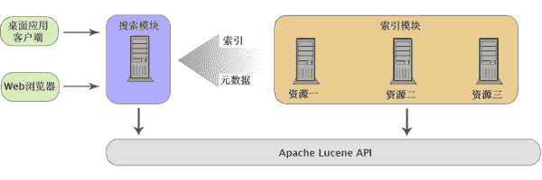

# 使用 Java 开源工具建立一个灵活的搜索引擎

> 原文：[`developer.ibm.com/zh/articles/j-lo-sefrmk/`](https://developer.ibm.com/zh/articles/j-lo-sefrmk/)

## 引言

为应用程序添加搜索能力经常是一个常见的需求。尽管已经有若干程序库提供了对搜索基础设施的支持，然而对于很多人而言，使用它们从头开始建立一个搜索引擎将是一个付出不小而且可能乏味的过程。另一方面，很多的小型应用对于搜索功能的需求和应用场景具有很大的相似性。本文试图以对多数小型应用的适用性为出发点，用 Java 语言构建一个灵活的搜索引擎框架。使用这个框架，多数情形下可以以最小的付出建立起一个搜索引擎。最理想的情况下，甚至只需要一个配置文件。特殊的情形下，可以通过灵活地对框架进行扩展满足需求。当然，如题所述，这都是借助开源工具的力量。

## 基础知识

Apache Lucene 是开发搜索类应用程序时最常用的 Java 类库，我们的框架也将基于它。为了下文更好的描述，我们需要先了解一些有关 Lucene 和搜索的基础知识。注意，本文不关注索引的文件格式、分词技术等话题。

### 什么是搜索和索引

从用户的角度来看，搜索的过程是通过关键字在某种资源中寻找特定的内容的过程。而从计算机的角度来看，实现这个过程可以有两种办法。一是对所有资源逐个与关键字匹配，返回所有满足匹配的内容；二是如同字典一样事先建立一个对应表，把关键字与资源的内容对应起来，搜索时直接查找这个表即可。显而易见，第二个办法效率要高得多。建立这个对应表事实上就是建立逆向索引（inverted index）的过程。

### Lucene 基本概念

Lucene 是 Doug Cutting 用 Java 开发的用于全文搜索的工具库。在这里，我假设读者对其已有基本的了解，我们只对一些重要的概念简要介绍。要深入了解可以参考 参考资源 中列出的相关文章和图书。下面这些是 Lucene 里比较重要的类。

*   `Document` ：索引包含多个 `Document` 。而每个 `Document` 则包含多个 `Field` 对象。 `Document` 可以是从数据库表里取出的一堆数据，可以是一个文件，也可以是一个网页等。注意，它不等同于文件系统中的文件。
*   `Field` ：一个 `Field` 有一个名称，它对应 `Document` 的一部分数据，表示文档的内容或者文档的元数据（与下文中提到的资源元数据不是一个概念）。一个 `Field` 对象有两个重要属性：Store ( 可以有 YES, NO, COMPACT 三种取值 ) 和 Index ( 可以有 TOKENIZED, UN_TOKENIZED, NO, NO_NORMS 四种取值 )
*   `Query` ：抽象了搜索时使用的语句。
*   `IndexSearcher` ：提供 `Query` 对象给它，它利用已有的索引进行搜索并返回搜索结果。
*   `Hits` ：一个容器，包含了指向 *一部分* 搜索结果的指针。

使用 Lucene 来进行编制索引的过程大致为：将输入的数据源统一为字符串或者文本流的形式，然后从数据源提取数据，创建合适的 `Field` 添加到对应数据源的 `Document` 对象之中。

## 系统概览

要建立一个通用的框架，必须对不同情况的共性进行抽象。反映到设计需要注意两点。一是要提供扩展接口；二是要尽量降低模块之间的耦合程度。我们的框架很简单地分为两个模块：索引模块和搜索模块。索引模块在不同的机器上各自进行对资源的索引，并把索引文件（事实上，下面我们会说到，还有元数据）统一传输到同一个地方（可以是在远程服务器上，也可以是在本地）。搜索模块则利用这些从多个索引模块收集到的数据完成用户的搜索请求。

图 1\. 系统架构图 展现了整体的框架。可以看到，两个模块之间相对是独立的，它们之间的关联不是通过代码，而是通过索引和元数据。在下文中，我们将会详细介绍如何基于开源工具设计和实现这两个模块。

##### 图 1\. 系统架构图



## 建立索引

可以进行索引的对象有很多，如文件、网页、RSS Feed 等。在我们的框架中，我们定义可以进行索引的 **一类** 对象为 *资源* 。从实现细节上来说，从一个资源中可以提取出多个 `Document` 对象。文件系统资源和数据库结果集资源都是资源的代表性例子。

前面提到，从资源中收集到的索引被统一传送到同一个地方，以被搜索模块所用。显然除了索引之外，搜索模块需要对资源有更多的了解，如资源的名称、搜索该资源后搜索结果的呈现格式等。这些额外的附加信息称为资源的 *元数据* 。元数据和索引数据一同被收集起来，放置到某个特定的位置。

简要地介绍过资源的概念之后，我们首先为其定义一个 `Resource` 接口。这个接口的声明如下。

##### 清单 1\. Resource 接口

```
public interface Resource {
 // RequestProcessor 对象被动地从资源中提取 Document，并返回提取的数量
 public int extractDocuments(ResourceProcessor processor);

 // 添加的 DocumentListener 将在每一个 Document 对象被提取出时被调用
 public void addDocumentListener(DocumentListener l);

 // 返回资源的元数据
 public ResourceMetaData getMetaData();
 } 
```

其中元数据包含的字段见下表。在下文中，我们还会对元数据的用途做更多的介绍。

##### 表 1\. 资源元数据包含的字段

| 属性 | 类型 | 含义 |
| --- | --- | --- |
| resourceName | String | 资源的 **唯一名称** |
| resourceDescription | String | 资源的介绍性文字 |
| hitTextPattern | String | 当文档被搜索到时，这个 pattern 规定了结果显示的格式 |
| searchableFields | String[] | 可以被搜索的字段名称 |

而 `DocumentListener` 的代码如下。

##### 清单 2\. DocumentListener 接口

```
public interface DocumentListener extends EventListener {
 public void documentExtracted(Document doc);
 } 
```

为了让索引模块能够知道所有需要被索引的资源，我们在这里使用 Spring 风格的 XML 文件配置索引模块中的所有组件，尤其是所有资源。

##### 为什么选择使用 Spring 风格的配置文件？

这主要有两个好处：

*   仅依赖于 Spring Core 和 Spring Beans 便免去了定义配置机制和解析配置文件的负担；
*   Spring 的 IoC 机制降低了框架的耦合性，并使扩展框架变得简单；

基于以上内容，我们可以大致描述出索引模块工作的过程：

1.  首先在 XML 配置的 bean 中找出所有 `Resource` 对象；
2.  对每一个调用其 `extractDocuments()` 方法，这一步除了完成对资源的索引外，还会在每次提取出一个 `Document` 对象之后，通知注册在该资源上的所有 `DocumentListener` ；
3.  接着处理资源的元数据（ `getMetaData()` 的返回值）；
4.  将缓存里的数据写入到本地磁盘或者传送给远程服务器；

在这个过程中，有两个地方值得注意。

第一，对资源可以注册 `DocumentListener` 使得我们可以在运行时刻对索引过程有更为动态的控制。举一个简单例子，对某个文章发布站点的文章进行索引时，一个很正常的要求便是发布时间更靠近当前时间的文章需要在搜索结果中排在靠前的位置。每篇文章显然对应一个 `Document` 对象，在 Lucene 中我们可以通过设置 `Document` 的 `boost` 值来对其进行加权。假设其中文章发布时间的 `Field` 的名称为 `PUB_TIME` ，那么我们可以为资源注册一个 `DocumentListener` ，当它被通知时，则检测 `PUB_TIME` 的值，根据距离当前时间的远近进行加权。

第二点很显然，在这个过程中， `extractDocuments()` 方法的实现依不同类型的资源而各异。下面我们主要讨论两种类型的资源：文件系统资源和数据库结果集资源。这两个类都实现了上面的 `接口` 。

### 文件系统资源

对文件系统资源的索引通常从一个基目录开始，递归处理每个需要进行索引的文件。该资源有一个字符串数组类型的 `excludedFiles` 属性，表示在处理文件时需要排除的文件绝对路径的正则表达式。在递归遍历文件系统树的同时，绝对路径匹配 `excludedFiles` 中任意一项的文件将不会被处理。这主要是考虑到一般我们只需要对一部分文件夹（比如排除可能存在的备份目录）中的一部分文件（如 doc, ppt 文件等）进行索引。

除了所有文件共有的文件名、文件路径、文件大小和修改时间等 Field，不同类型的文件需要有不同的处理方法。为了保留灵活性，我们使用 Strategy 模式封装对不同类型文件的处理方式。为此我们抽象出一个 `DocumentBuilder` 的接口，该接口仅定义了一个方法如下：

##### 清单 3\. DocumentBuilder 接口

```
public interface DocumentBuilder {
    Document buildDocument(InputStream is);
 } 
```

##### 什么是 Strategy 模式？

根据 Design patterns: Elements of reusable object orientated software 一书：Strategy 模式”定义一系列的算法，把它们分别封装起来，并且使它们相互可以替换。这个模式使得算法可以独立于使用它的客户而变化。”

不同的 `DocumentBuilder` （Strategy） 用于从一个输入流中读取数据，处理不同类型的文件。对于常见的文件格式来说，都有合适的开源工具帮助进行解析。在下表中我们列举一些常见文件类型的解析办法。

| 文件类型 | 常用扩展名 | 可以使用的解析办法 |
| --- | --- | --- |
| 纯文本文档 | txt | 无需类库解析 |
| RTF 文档 | rtf | 使用 `javax.swing.text.rtf.RTFEditorKit` 类 |
| Word 文档（非 OOXML 格式） | doc | Apache POI （可配合使用 POI Scratchpad） |
| PowerPoint 演示文稿（非 OOXML 格式） | xls | Apache POI （可配合使用 POI Scratchpad） |
| PDF 文档 | pdf | PDFBox（可能中文支持欠佳） |
| HTML 文档 | htm, html | JTidy, Cobra |

这里以 Word 文件为例，给出一个简单的参考实现。

##### 清单 4\. 解析纯文本内容的实现

```
// WordDocument 是 Apache POI Scratchpad 中的一个类
 Document buildDocument(InputStream is) {
    String bodyText = null;
    try {
        WordDocument wordDoc = new WordDocument(is);
        StringWriter sw = new StringWriter();
        wordDoc.writeAllText(sw);
        sw.close();
        bodyText = sw.toString();
     } catch (Exception e) {
        throw new DocumentHandlerException("Cannot extract text from a Word document", e);
     }
    if ((bodyText != null) && (bodyText.trim().length() > 0)) {
        Document doc = new Document();
        doc.add(new Field("body", bodyText, Field.Store.YES, Field.Index.TOKENIZED));
        return doc;
    }
    return null;
 } 
```

那么如何选择合适的 Strategy 来处理文件呢？ UNIX 系统下的 file(1) 工具提供了从 magicnumber 获取文件类型的功能，我们可以使用 `Runtime.exec()` 方法调用这一命令。但这需要在有 file(1) 命令的情况下，而且并不能识别出所有文件类型。在一般的情况下我们可以简单地根据扩展名来使用合适的类处理文件。扩展名和类的映射关系写在 properties 文件中。当需要添加对新的文件类型的支持时，我们只需添加一个新的实现 `DocumentBuilder` 接口的类，并在映射文件中添加一个映射关系即可。

### 数据库结果集资源

大多数应用使用数据库作为永久存储，对数据库查询结果集索引是一个常见需求。

生成一个数据库结果集资源的实例需要先提供一个查询语句，然后执行查询，得到一个结果集。这个结果集中的内容便是我们需要进行索引的对象。 `extractDocuments` 的实现便是为结果集中的每一行创建一个 `Document` 对象。和文件系统资源不同的是，数据库资源需要放入 `Document` 中的 `Field` 一般都存在在查询结果集之中。比如一个简单的文章发布站点，对其后台数据库执行查询 `SELECT ID, TITLE, CONTENT FROM ARTICLE` 返回一个有三列的结果集。对结果集的每一行都会被提取出一个 `Document` 对象，其中包含三个 `Field` ，分别对应这三列。

然而不同 `Field` 的类型是不同的。比如 `ID` 字段一般对应 `Store.YES` 和 `Index.NO` 的 `Field` ；而 `TITLE` 字段则一般对应 `Store.YES` 和 `Index.TOKENIZED` 的 `Field` 。为了解决这个问题，我们在数据库结果集资源的实现中提供一个类型为 `Properties` 的 `fieldTypeMappings` 属性，用于设置数据库字段所对应的 `Field` 的类型。对于前面的情况来说，这个属性可能会被配置成类似这样的形式：

```
ID = YES, NO
 TITLE = YES, TOKENIZED
 CONTENT = NO, TOKENIZED 
```

配合这个映射，我们便可以生成合适类型的 `Field` ，完成对结果集索引的工作。

## 收集索引

完成对资源的索引之后，还需要让索引为搜索模块所用。前面我们已经说过这里介绍的框架主要用于小型应用，考虑到复杂性，我们采取简单地将分布在各个机器上的索引汇总到一个地方的策略。

汇总索引的传输方式可以有很多方案，比如使用 FTP、HTTP、rsync 等。甚至索引模块和搜索模块可以位于同一台机器上，这种情况下只需要将索引进行本地拷贝即可。同前面类似，我们定义一个 `Transporter` 接口。

##### 清单 5\. Transporter 接口

```
public interface Transporter {
    public void transport(File file);
 } 
```

以 FTP 方式传输为例，我们使用 Commons Net 完成传输的操作。

```
public void transport(File file) throws TransportException {
    FTPClient client = new FTPClient();
    client.connect(host);
    client.login(username, password);
    client.changeWorkingDirectory(remotePath);
    transportRecursive(client, file);
    client.disconnect();
 }

 public void transportRecursive(FTPClient client, File file) {
    if (file.isFile() && file.canRead()) {
        client.storeFile(file.getName(), new FileInputStream(file));
    } else if (file.isDirectory()) {
        client.makeDirectory(file.getName());
        client.changeWorkingDirectory(file.getName());
        File[] fileList = file.listFiles();
        for (File f : fileList) {
            transportRecursive(client, f);
        }
    }
 } 
```

对其他传输方案也有各自的方案进行处理，具体使用哪个 `Transporter` 的实现被配置在 Spring 风格的索引模块配置文件中。传输的方式是灵活的。比如当需要强调安全性时，我们可以换用基于 SSL 的 FTP 进行传输。所需要做的只是开发一个使用 FTP over SSL 的 `Transporter` 实现，并在配置文件中更改 `Transporter` 的实现即可。

## 进行搜索

在做了这么多之后，我们开始接触和用户关联最为紧密的搜索模块。注意，我们的框架不包括一个搜索的 Web 前端界面。但是类似这样的界面可以在搜索模块的基础上方便地开发出来。基于已经收集好的索引进行搜索是个很简单的过程。Lucene 已经提供了功能强大的 `IndexSearcher` 及其子类。在这个部分，我们不会再介绍如何使用这些类，而是关注在前文提到过的资源元数据上。元数据从各个资源所在的文件夹中读取得到，它在搜索模块中扮演重要的角色。

### 构建一个查询

对不同资源进行搜索的查询方法并不一样。例如搜索一个论坛里的所有留言时，我们关注的一般是留言的标题、作者和内容；而当搜索一个 FTP 站点时，我们更多关注的是文件名和文件内容。另一方面，我们有时可能会使用一个查询去搜索多个资源的结果。这正是之前我们在前面所提到的元数据中 `searchableFields` 和 `resourceName` 属性的作用。前者指出一个资源中哪些字段是参与搜索的；后者则用于在搜索时确定使用哪个或者哪些索引。从技术细节来说，只有有了这些信息，我们才可以构造出可用的 `Query` 对象。

### 呈现搜索结果

当从 `IndexSearcher` 对象得到搜索结果（ `Hits` ）之后，当然我们可以直接从中获取需要的值，再格式化予以输出。但一来格式化输出搜索结果（尤其在 Web 应用中）是个很常见的需求，可能会经常变更；二来结果的呈现格式应该是由分散的资源各自定义，而不是交由搜索模块来定义。基于上面两个原因，我们的框架将使用在资源收集端配置结果输出格式的方式。这个格式由资源元数据中的 `hitTextPattern` 属性定义。该属性是一个字符串类型的值，支持两种语法

*   形如 `${field_name}` 的子字符串都会被动态替换成查询结果中各个 `Document` 内 `Field` 的值。
*   形如 `$function(...)` 的被解释为函数，括号内以逗号隔开的符号都被解释成参数，函数可以嵌套。

例如搜索”具体”返回的搜索结果中包含一个 `Document` 对象，其 `Field` 如下表：

| Field 名称 | Field 内容 |
| --- | --- |
| url | `http://example.org/article/1.html` |
| title | 示例标题 |
| content | 这里是具体的内容。 |

那么如果 `hitTextPatten` 被设置为”`<a href="${url}">${title}</a><br/>$highlight(${content}, 5, "<b>", "</b>")` ”，返回的结果经浏览器解释后可能的显示结果如下（这只是个演示链接，请不要点击）：

`http://example.org/article/1.html`

这里是 **具体**…

上面提到的 `$highlight()` 函数用于在搜索结果中取得最匹配的一段文本，并高亮显示搜索时使用的短语，其第一个参数是高亮显示的文本，第二个参数是显示的文本长度，第三和第四个参数是高亮文本时使用的前缀和后缀。

可以使用正则表达式和文本解析来实现前面所提到的语法。我们也可以使用 JavaCC 定义 `hitTextPattern` 的文法，进而生成词法分析器和语法解析器。这是更为系统并且相对而言不易出错的方法。对 JavaCC 的介绍不是本文的重点，您可以在下面的 阅读资源 中找到学习资料。

## 相关产品

下面列出的是一些与我们所提出的框架所相关或者类似的产品，您可以在学习资料中更多地了解他们。

### Apache Solr

Solr 是 Apache 的一个企业级的全文检索项目，实现了一个基于 HTTP 的搜索服务器，支持多种资源和 Web 界面管理，它同样建立在 Lucene 之上，并对 Lucene 做了很多扩展，例如支持动态字段及唯一键，对查询结果进行动态分组和过滤等。

### Google SiteSearch

使用 Google 的站点搜索功能可以方便而快捷地建立一个站内搜索引擎。但是 Google 的站点搜索基于 Google 的网络爬虫，所以无法访问受保护的站点内容或者 Intranet 上的资源。另外，Google 所支持的资源类型也是有限的，我们无法对其进行扩展。

### SearchBlox™

SearchBlox 是一个商业的搜索引擎构建框架。它本身是一个 J2EE 组件，和我们的框架类似，也支持对网页和文件系统等资源进行索引，进而进行搜索。

## 还需考虑的问题

本文介绍的思想试图利用开源的工具解决中小型应用中的常见问题。当然，作为一个框架，它还有很多不足，下面列举出一些可以进行改进的地方。

### 性能考虑

当需要进行索引的资源数目不多时，隔一定的时间进行一次完全索引不会占用很长时间。使用一台 2G 内存，Xeon 2.66G 处理器的服务器进行实际测试，发现对数据库资源的索引占用的时间很少，一千多条记录花费的时间在 1 秒到 2 秒之内。而对 1400 多个文件进行索引耗时大约十几秒。但在大型应用中，资源的容量是巨大的，如果每次都进行完整的索引，耗费的时间会很惊人。我们可以通过跳过已经索引的资源内容，删除已不存在的资源内容的索引，并进行增量索引来解决这个问题。这可能会涉及文件校验和索引删除等。

另一方面，框架可以提供查询缓存来提高查询效率。框架可以在内存中建立一级缓存，并使用如 [OSCache](https://java-source.net/open-source/cache-solutions/oscache) 或 [EHCache](http://ehcache.sourceforge.net/) 实现磁盘上的二级缓存。当索引的内容变化不频繁时，使用查询缓存更会明显地提高查询速度、降低资源消耗。

### 分布式索引

我们的框架可以将索引分布在多台机器上。搜索资源时，查询被 flood 到各个机器上从而获得搜索结果。这样可以免去传输索引到某一台中央服务器的过程。当然也可以基于实现了分布式哈希表 （DHT）的结构化 P2P 网络，配合索引复制 (Replication)，使得应用程序更为安全，可靠，有伸缩性。在 阅读资料 中给出了 一篇关于构建分布式环境下全文搜索的可行性的论文。

### 安全性

目前我们的框架并没有涉及到安全性。除了依赖资源本身的访问控制（如受保护的网页和文件系统等）之外，我们还可以从两方面增强框架本身的安全性：

1.  考虑到一个组织的搜索功能对不同用户的权限设置不一定一样，可以支持对用户角色的定义，实行对搜索模块的访问控制。
2.  在资源索引模块中实现一种机制，让资源可以限制自己暴露的内容，从而缩小索引模块的索引范围。这可以类比 robots 文件可以规定搜索引擎爬虫的行为。

## 结束语

通过上文的介绍，我们认识了一个可扩展的框架，由索引模块和搜索模块两部分组成。它可以灵活地适应不同的应用场景。如果需要更独特的需求，框架本身预留了可以扩展的接口，我们可以通过实现这些接口完成功能的定制。更重要的是这一切都是建立在开源软件的基础之上。希望本文能为您揭示开源的力量，体验用开源工具组装您自己的解决方案所带来的莫大快乐。

## 相关主题

*   [Clairv 项目](https://sourceforge.net/projects/clairv)
*   magic number 的定义
*   [查看和下载 Apache POI 项目](https://poi.apache.org)