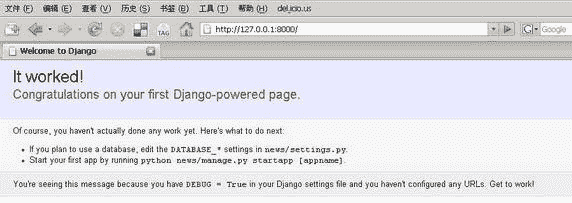
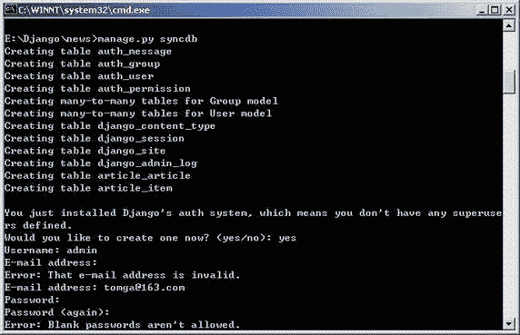
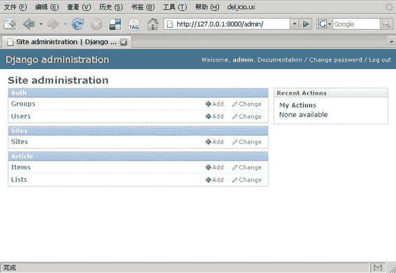
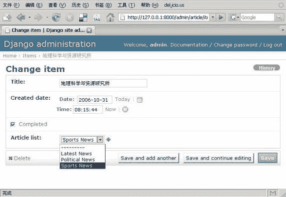

# 基于 Django 框架的敏捷 Web 开发

> 原文：[`developer.ibm.com/zh/articles/os-cn-django/`](https://developer.ibm.com/zh/articles/os-cn-django/)

## 前言

传统 Web 开发方式常常需要编写繁琐乏味的重复性代码，不仅页面表现与逻辑实现的代码混杂在一起，而且代码编写效率不高。对于开发者来说，选择一个功能强大并且操作简洁的开发框架来辅助完成繁杂的编码工作，将会对开发效率的提升起到很大帮助。幸运的是，这样的开发框架并不少见，需要做的仅是从中选出恰恰为开发者量身打造的那款 Web 框架。

自从基于 MVC 分层结构的 Web 设计理念普及以来，选择适合的开发框架无疑是项目成功的关键性因素。无论是 Struts、Spring 或是其他 Web 框架的出现，目的都是为帮助开发者把所有的编码工作打理的井井有条、赏心悦目。在动态语言领域，Python、Ruby、Groovy 等语言在 Web 开发中也逐渐发展壮大，掀起一浪接一浪的开发热潮。面对 Ruby on Rails 渐渐深入人心的宣传攻势和火热势头，更为成熟且不乏优秀程序员的 Python 社区也纷纷推出欲与之抗衡的 Web 开发框架。在对 Python 旗下的开发框架经过一番取舍比较之后，笔者选择了 Python 框架 Django 作为 Web 开发框架的首选，究其缘由，就是看中了 Django 新颖简洁的开发模式和巨大的发展潜力。

在下面的章节里，将通过一个完整的 Django 框架 Web 开发示例，详细讲解开发过程中 MVC 各层次代码编写过程中所需的各种要素与资源，通过实例体验 Django 为 Web 开发者带来的高效与便捷。

## 细说 Django

Django 是应用于 Web 开发的高级动态语言框架，最初起源于美国芝加哥的 Python 用户组，具有新闻从业背景的 Adrian Holovaty 是 Django 框架的主要开发者。在 Adrian 的带领下，Django 小组致力于为 Web 开发者贡献一款高效完美的 Python 开发框架，并且在 BSD 开放源代码协议许可下授权给开发者自由使用。

Django 拥有完善的模板机制、对象关系映射机制以及用于动态创建后台管理界面的功能，利用 Django，可以快速设计和开发具有 MVC 层次的 Web 应用。为了打消开发者选用 Django 框架时的疑虑，首先分析一下 Django 引人注目的特性。在实体映射方面，Django 的对象相关映射机制帮助开发者在 Python 类中灵活定义数据模型，并且 Django 具有功能丰富的动态数据库访问 API，可以大幅度简化书写 SQL 语句的繁杂工作。同时 Django 支持包括 Postgresql，MySql，Sqlite，Oracle 在内的多种后台数据库。Django 的 URL 分发设计的十分简洁美观，不会在链接中产生一大串杂乱且难以理解的字符。使用 Django 可扩展的内置模板，可以将模型层、控制层与页面模板完全独立开来进行编码。Django 还具有自己的 Cache 系统，如果需要，也可以根据开发者的要求嵌套其他的 Cache 框架。

## 起程前的准备

即使是对 Python 语言还不太熟悉，Django 开发的起步过程对于新手来说也并不复杂，通过使用 Django 框架完成下面的 Web 应用开发，可以在过程的每个步骤之中体会到 Django 框架赋予开发者的敏捷与自由。

在开始之前，首先要配置好 Python 和 Django 的开发环境，下面的示例将在 Windows 操作系统下进行，与 Linux/Unix 操作系统环境下的开发过程相比，仅在环境变量配置等方面略有不同。目前 Python 的最新版本是 2.5.1，在官方站点 [Python.org](http://www.Python.org) 下载安装包后搭建好 Python 的编译运行环境，接下来还需要把 Python 的安装路径添加在系统环境变量 path 里面，以便在命令行下使用 Python 进行编译及运行。

Django 目前的最新发行版本是 0.96 版，其压缩包可以在官方站点 [djangoproject.com](http://www.djangoproject.com) 下载。解压后进入 Django 目录，在命令行里执行 python setup.py install，这样 Django 就会作为第三方模块被安装在 Python 的 site-packages 目录中，然后把 Django 中 bin 目录的路径添加到环境变量 path 里面，这样在命令行里就可以方便的使用 Django 提供的各种指令。

## 开始 Django 的旅程

在下面的步骤里，将会利用 Django 框架实现一个完整小巧的 Web 应用程序。应用实例将创建实现一个新闻公告牌，用户可以从后台添加新闻分类和条目，然后在前端页面中显示新闻的统计信息。在应用的实现过程中，将会逐步介绍 Django 的开发方式及其带来的快捷体验。

为帮助开发者实现不同的功能，Django 为我们提供了众多的开发指令，大部分繁琐的操作都被 Django 集成在简洁的命令行提示符中实现。现在打开命令提示符，进入到想要创建应用的目录后键入 django-admin.py startproject news 命令，调用 Django 的控制台命令新建一个名为 news 的工程，与此同时 Django 还在新创建的 news 文件夹下生成以下四个分工不同的文件。

*   ****init**.py**

    文件**init**.py 可以向 Python 编译器表明当前文件夹下的内容是 Python 工程模块。

*   **2.manage.py**

    manage.py 是 Python 脚本文件，与 Django 的命令行工具 django-admin.py 配合，可以对建立的工程进行管理配置。

*   **settings.py**

    这是 Django 工程的配置文件，与工程相关的工程模块和数据库全局配置信息都在 settings.py 中设置。

*   **urls.py**

    文件 urls.py 负责配置 URL 的地址映射以及管理 URL 的地址格式。

当新的工程建立好之后，假如迫不及待就想知道新建工程的模样，Django 已经为你准备好一款轻量级的 Web 服务器以便在开发过程中随时测试使用。开发者只需在命令提示符下进入工程目录，键入命令 manage.py runserver，就可以启动 Web 服务器来测试新建立的工程，如果启动没有错误，将可以看到下面这样的提示信息：`Development server is running at http://127.0.0.1:8000/` 表示当前工程已经可以通过本机的 8000 端口访问。通过浏览器打开上述地址，如图 1 所示的 Django 项目初始页面将会出现在读者面前。

##### 图 1\. Django 项目初始页面



在命令行里使用 Ctrl+Break 或 Ctrl+C 的组合键可以停止 runserver 命令启动的 Web 服务器。当然，Django 自带的 Web 服务器一般只是在开发测试的过程中使用，当 Django 工程真正发布时，可以通过加载 mod_python.so 模块把 Django 应用部署在 Apache 上，以方便 Web 访问的管理和配置。

## Django 的模型定义

在工程建立好之后，接下来就可以编写 Django 的应用模块。键入命令 python manage.py startapp article，命令会在当前工程下生成一个名为 article 的模块，目录下除了标识 Python 模块的**init**.py 文件，还有额外的两个文件 models.py 和 views.py。

在传统的 Web 的开发中，很大的一部分工作量被消耗在数据库中创建需要的数据表和设置表字段上，而 Django 为此提供了轻量级的解决方案。借助 Django 内部的对象关系映射机制，可以用 Python 语言实现对数据库表中的实体进行操作，实体模型的描述需要在文件 models.py 中配置。

在当前的工程中，需要有两个 Models 模型，分别对应 List 表和 Item 表，用来存储新闻的分类和新闻的条目，每个 Item 项都会有一个外键来标记文章的归属分类。下面打开 Django 创建的 models.py 文件，按照文件注释中提示的模块添加位置，编写如下的代码：

##### 清单 1\. models.py 文件模型定义

```
class List(models.Model):
 title = models.CharField(maxlength=250, unique=True)
 def __str__(self):
   return self.title
 class Meta:
   ordering = ['title']
 class Admin:
   pass 
```

上面这段 Python 代码定义了存储新闻分类的 List 数据表，上述模型中的定义会被 Django 转换成与数据库直接交互的结构化查询语言来建立数据表，即创建一个名为 List 的表格，表格内的两个字段分别是 Django 自动生成的整型主键 id 和最大宽度为 250 个字符的 VARCHAR 类型字段 title，并且在 title 字段上定义了唯一性约束，来保证新闻分类不会有完全相同的名称。

在 List 类文件里还定义了函数**str**()，作用是返回 self 字符串表示的 title 字段。而在类 Meta 中，设置了 List 表格按照 title 字母顺序的排序方式。在类 Admin 的设置中，允许 Django 针对当前的 Models 模型自动生成 Django 超级用户的后台管理入口，关键词 pass 设定 Django 将按照默认方式生成后台管理界面。这一部分在稍后的章节可以看到，由此也可以体会到 Django 带来的独特魅力。下面再来添加新闻条目 Item 对应的 Models 模型，代码如下面所示：

##### 清单 2\. 添加新闻条目 Models 模型

```
import datetime
class Item(models.Model):
 title = models.CharField(maxlength=250)
 created_date = models.DateTimeField(default=datetime.datetime.now)
 completed = models.BooleanField(default=False)
 article_list = models.ForeignKey(List)
 def __str__(self):
   return self.title
 class Meta:
   ordering = ['-created_date', 'title']
 class Admin:
   pass 
```

Item 数据表对应的 Models 代码稍微复杂一些，但并不晦涩。代码里首先引入 datetime 类型，用于定义表示文章创建日期的 created_date 字段，并且通过 Python 的标准函数 datetime.datetime.now 返回系统当前日期来设置字段的默认值。在记录排序的 ordering 设置中，符号”-”表示按照日期的倒序进行排列，如果文章创建日期相同，则再按照 title 的字母序正序排列。

到此为止，应用中模型部分需要定义的两个数据表都已经创建完毕，下一步的工作是让 Django 部署并在数据库中生成已经写好的 Models 模型。

## Django 模块的部署

在 Django 中，与工程全局相关的设置都需要在配置文件 settings.py 中添加。笔者使用 MySQL 作为后台数据库，并且已经在 MySQL 中创建名为 django_news 的数据库。则需要在 settings.py 文件中的相应位置设定 DATABASE_ENGINE = “mysql” 以及 DATABASE_NAME = “django_news”。

这里要注意的是，如果使用 SQLite 数据库，Django 可以根据数据库的名称自动在 SQLite 中创建新的数据库，而在 MySQL、PostgreSQL 或其他的数据库中，则需要先创建与设定名称对应的数据库。在使用 MySQL 数据库时，需要额外安装 MySQL 的 Python 链接库 MySQLdb-1.2.1，这个模块可以在站点 [`sourceforge.net/projects/mysql-python/`](http://sourceforge.net/projects/mysql-python/) 下载，目前支持的 Python 版本为 2.4，所以使用 MySQL 数据库需要在 2.4 版本的 Python 环境来开发运行。

接下来的 DATABASE_USER 和 DATABASE_PASSWORD 两项内容则需要用户根据本机设置填写访问数据库的用户名和密码。如果数据库安装在其他机器上或者更改了数据库的监听端口，则还需要设置 DATABASE_HOST 地址和 DATABASE_PORT 项。笔者使用的 Mysql 数据库设置为：

```
DATABASE_USER = 'django'
DATABASE_PASSWORD = 'django_password' 
```

为了使 Django 识别开发者添加的应用模块，在 settings.py 文件的 INSTALLED_APPS 部分中，需要定义 Django 工程加载的应用列表。默认情况下，列表中已经添加了 Django 工程运行所需的部分自带模块，我们还需要把刚才编写好的应用模块 news.article 加入其中，同时添加 Django 自带的 django.contrib.admin 应用模块，修改好的代码如下所示：

##### 清单 3\. 添加所需的模块

```
INSTALLED_APPS = (
 'django.contrib.auth',
 'django.contrib.contenttypes',
 'django.contrib.sessions',
 'django.contrib.sites',
 'django.contrib.admin',
 'news.article',
) 
```

添加 admin 模块后还不能立即使用 Django 的 admin 后台管理界面，需要打开 News 工程根目录下的 urls.py 文件，将”# Uncomment this for admin:”后面的#注释去掉，使得 Django 针对管理界面的 URL 转向”(r’^admin/’, include(‘django.contrib.admin.urls’)),”可用，这样访问 admin 模块时 Django 就可以顺利解析访问地址并转向后台管理界面。

当配置文件的改动完成之后，就可以在 News 工程的命令提示符下执行 manage.py syncdb 指令。Django 会根据模型的定义自动完成 ORM 的数据库映射工作，屏蔽了底层数据库细节和 SQL 查询的编写。

展示 Django 魅力的时刻已经来临，Django 框架将让开发者开始神奇的体验。随着命令执行后的滚动提示，Django 已经根据我们刚才在 models 里定义的映射文件，自动在数据库里创建好对应的表和字段。命令执行的同时会提示用户创建”superuser”账户，来登陆 Django 自动创建好的后台管理界面对模型进行管理。指令执行时同步更新数据库表的命令提示如图 2 所示：

##### 图 2\. Django 指令执行时同步更新数据库表



维持学习动力的最好方式就是随时都可以找到一点小小的成就感，下面来看一下这些步骤完成了哪些工作。再次使用命令 manage.py runserver 来启动 Django 自带的 Web 服务器后，在浏览器中访问地址 [`127.0.0.1:8000/admin/`](http://127.0.0.1:8000/admin/) ，使用刚才创建的 superuser 用户的账号和密码登陆，如图 3 所示漂亮的 Django 后台管理界面就出现在眼前。

##### 图 3\. Django 根据模型自动生成的后台管理界面



在 admin 管理界面中，显示了应用中已经定义的各个 models 模块，当点击查看时，则会显示 models 中存在的数据库对象列表。Django 提供的后台管理界面方便用户直接更改或添加数据库字段，下面我们点击”Lists”项旁边的”Add”来添加新的新闻分类。在 title 字段中键入”Sports News”或其他你喜欢的分类后保存。然后在”Items”项中点击”Add”，填入新闻的第一个条目，每个 Item 条目都对应 List 中的一个分类项，添加 Item 的界面如图 4 所示，由于设置了表之间的关联，Django 的 Item 管理界面中会为已添加 List 分类自动生成内容的下拉选项。

##### 图 4\. 添加新闻条目的界面



Django 便捷的后台管理界面为 Web 开发人员节省了大量的时间，目前使用到的只是 Django 默认的后台管理方式，开发者还可以参考 Django 提供的用户手册对后台进行进一步的定制和个性化。

## 实现 Django 的控制层和表现层

进行到这里，Django 工程中的模型层已经处理完成，下面要做的就是如何用代码来与 models 中定义的字段进行交互，这就是 Django 中的 View 部分。与传统 MVC 分层定义略有不同的是，在 Django 中，View 的功能是对页面请求进行响应和逻辑控制，而页面内容的表示则由 Django 的 Template 模板来完成。我们可以把 Django 的 View 理解为实现各种功能的 Python 函数，View 负责接受 URL 配置文件 urls.py 中定义的 URL 转发并响应处理，当 Django 收到请求之后调用相应的 View 函数来完成功能，article 模块中的 views.py 文件代码定义如下：

##### 清单 ４. views.py 代码定义

```
from django.shortcuts import render_to_response
from news.article.models import List

def news_report(request):
 article_listing = []
 for article_list in List.objects.all():
   article_dict = {}
   article_dict['news_object'] = article_list
   article_dict['item_count'] = article_list.item_set.count()
   article_dict['items_title'] = article_list.title
   article_dict['items_complete'] = article_list.item_set.filter(completed=True).count()
   article_dict['percent_complete'] =
        int(float(article_dict['items_complete']) / article_dict['item_count'] * 100)
   article_listing.append(article_dict)
 return render_to_response('news_report.html', { 'article_listing': article_listing }) 
```

这是一段简洁的 Python 代码，让我们看看在这段代码里面 Django 的函数做了哪些工作吧：

*   List.objects.all 方法返回 news 列表中所有的记录项，Django 可以根据后台数据库转换成相应的 SQL 语句，在后台数据库中执行并返回查询结果。
*   每一条 article 文章都有 item_set 属性，代表 news 新闻条目中的每一个 item 项。如果需要设置查询条件，也可以使用 item_set.filter 方法来返回符合特定要求的 item 项。
*   render_to_response 函数返回浏览器指定的 HTML 页面，页面为 Django 的 Template 模板，负责展示被请求的页面内容。

在 view 部分的代码中，已经指定了页面显示模板为 news_report.html。其实，在 Django 工程中创建模板是一件非常方便的事情，下面要在 article 目录内创建这个模板页面，首先新建一个名为 templates 的文件夹，然后在这个模板目录里创建所需的 news_report.html 模板文件，模板的代码如下：

##### 清单 ５. news_report 模板代码

```
<html>
 <head>
   <meta http-equiv="Content-Type" content="text/html" />
   <title>新闻统计列表</title>
 </head>
 <body>
   <h1>新闻统计列表</h1>

   <ul>
        <li>新闻的分类: {{ list_dict.items_title }}</li>
     <li>新闻的数目: {{ list_dict.item_count }}</li>
     <li>已发布的新闻数目:
           {{ list_dict.items_complete }} ({{ list_dict.percent_complete }}%)</li>
   </ul>

 </body>
</html> 
```

一般来说，Django 的模板代码和普通的 HTML 代码看上去没有太大差别，只是添加了 Django 特定的模板标记，这些标记允许开发者为 Django 模板添加页面逻辑，比方说将 views.py 中 render_to_response 函数返回的数据库结果集显示在页面中，Django 特有的标签在模板页里以””作为结束。嵌入 Django 模板的变量则以”{{”作为开始并以”}}”结束。

在上面的模板代码里面，用到了标记以及。这样的标记告诉 Django 模板处理机制循环取出 news 中的 item 项输出在页面中，在 for 循环内部，通过 article_listing 的属性得到 View 中对应的数据项字段的值并显示每个 news 项的 Title 标题以及 news 中的 item 项数目。

当 Django 的 View 和 Template 都已经准备妥当，下面仅需要几步配置来告诉 Django 存储工程应用的模板位置，这需要对配置文件 setting.py 中的 TEMPLATE_DIRS 项进行设置。在本例中加入模板文件”news_report.html”的存储路径就可以让 Django 把对 View 进行处理的结果集通过指定模板返回。按照本例应用的结构，TEMPLATE_DIRS 参数的内容设置为：

```
'./article/templates', 
```

这里不要忘记 Django 需要在路径的最末尾添加一个逗号。接下来仅需要设置访问 article 时的 URL 转向地址就可以。打开 urls.py 文件，在 admin 后台管理的转向地址下一行添加如下语句：

```
(r'^report/$', 'news.article.views.news_report'), 
```

在这里语段的最末尾，也需要有逗号标记段落的结束。在这里可以看到，Django 的 URL 转发设计的非常简洁，在配置文件 urls.py 中对应于 view 的转发请求都由两部分组成，第一部分遵循正则表达式指定相匹配的 URL 地址，第二部分是对应在 View 里面处理转发请求的函数。

完成了这些步骤，就可以在命令提示符下再次启动 Django 服务器，看一下上述努力的成果了，在浏览器中打开链接 [`127.0.0.1:8000/report/`](http://127.0.0.1:8000/report/) ，将会看到新闻列表的返回界面。页面中显示了数据库中已添加所有新闻的分类统计信息。值得一提的是，Django 模板支持多层嵌套，并且每一层都可以使用 DIV+CSS 方式完成布局，可以方便的让站点页面遵循统一风格，看起来美观大方。

在上述整个过程中，对使用 Django 进行 Web 开发进行了初步的介绍。在应用中写的 Python 代码不过几十行，比较起来其他的开发语言，Django 显得非常便捷实用，最后再来回顾一下 Django 都帮助我们做了哪些工作吧：

*   通过 Django 的对象关系映射模型建立了存储新闻分类以及新闻项的两张数据表，并用 syncdb 命令同步更新到数据库。
*   借助 Django 的管理功能在应用中生成了一个漂亮实用的后台管理界面。
*   利用 Django 函数和标签编写了 view 功能模块以及显示数据结果的 Template 模板。

## 结束语

Django 开发框架的出现，让本例所有的这些工作变得简洁有序、赏心悦目。随着 Django 开发框架的不断发展，更多新的特性将逐步被添加到框架体系中来。可以不夸张的说，Django 已经从 ROR 的潜在竞争者，逐渐成长为可以与之针锋相对的 Python 框架。如果说与 Ruby 框架 ROR 的差距，或许 Django 目前最缺少的还是 ROR 那庞大的用户群体。

如果看完这篇文章，读者打算一步一步进入 Django 的精彩世界，可以在 Django 官方站点 [www.djangoproject.com](http://www.djangoproject.com) 上阅读更多的开发文档、订阅 Google Group 上的 Django 邮件讨论组，或者跟随 Django 官方的教程指南进行学习，开始一次让思想自由翱翔的旅程，相信在这个过程中收获的不仅仅是使用 Django 开发的新奇体验。

希望有更多的读者来使用 Django 框架，希望有更多的人来一起来关注 Django 的发展，甚至参与到 Django 的项目开发当中，为开源的社区贡献一份力量。期待 Django 快速发展的明天、期待 Python 实现的 Rails 框架将会有绚丽的未来！