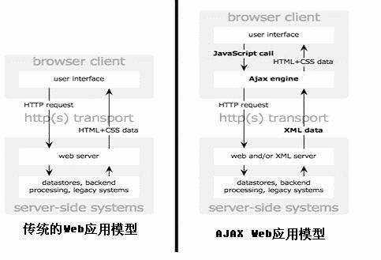
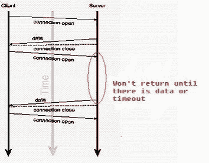

# Comet：基于 HTTP 长连接的“服务器推”技术

> 原文：[`developer.ibm.com/zh/articles/wa-lo-comet/`](https://developer.ibm.com/zh/articles/wa-lo-comet/)

传统模式的 Web 系统以客户端发出请求、服务器端响应的方式工作。这种方式并不能满足很多现实应用的需求，譬如：

*   监控系统：后台硬件热插拔、LED、温度、电压发生变化；
*   即时通信系统：其它用户登录、发送信息；
*   即时报价系统：后台数据库内容发生变化；

这些应用都需要服务器能实时地将更新的信息传送到客户端，而无须客户端发出请求。”服务器推”技术在现实应用中有一些解决方案，本文将这些解决方案分为两类：一类需要在浏览器端安装插件，基于套接口传送信息，或是使用 RMI、CORBA 进行远程调用；而另一类则无须浏览器安装任何插件、基于 HTTP 长连接。

将”服务器推”应用在 Web 程序中，首先考虑的是如何在功能有限的浏览器端接收、处理信息：

1.  客户端如何接收、处理信息，是否需要使用套接口或是使用远程调用。客户端呈现给用户的是 HTML 页面还是 Java applet 或 Flash 窗口。如果使用套接口和远程调用，怎么和 JavaScript 结合修改 HTML 的显示。
2.  客户与服务器端通信的信息格式，采取怎样的出错处理机制。
3.  客户端是否需要支持不同类型的浏览器如 IE、Firefox，是否需要同时支持 Windows 和 Linux 平台。

<h2 id=”基于客户端套接口的” 服务器推”技术>基于客户端套接口的”服务器推”技术

### Flash XMLSocket

如果 Web 应用的用户接受应用只有在安装了 Flash 播放器才能正常运行， 那么使用 Flash 的 XMLSocket 也是一个可行的方案。

这种方案实现的基础是：

1.  Flash 提供了 XMLSocket 类。
2.  JavaScript 和 Flash 的紧密结合：在 JavaScript 可以直接调用 Flash 程序提供的接口。

具体实现方法：在 HTML 页面中内嵌入一个使用了 XMLSocket 类的 Flash 程序。JavaScript 通过调用此 Flash 程序提供的套接口接口与服务器端的套接口进行通信。JavaScript 在收到服务器端以 XML 格式传送的信息后可以很容易地控制 HTML 页面的内容显示。

关于如何去构建充当了 JavaScript 与 Flash XMLSocket 桥梁的 Flash 程序，以及如何在 JavaScript 里调用 Flash 提供的接口，我们可以参考 AFLAX（Asynchronous Flash and XML）项目提供的 Socket Demo 以及 SocketJS（请参见 参考资源 ）。

Javascript 与 Flash 的紧密结合，极大增强了客户端的处理能力。从 Flash 播放器 V7.0.19 开始，已经取消了 XMLSocket 的端口必须大于 1023 的限制。Linux 平台也支持 Flash XMLSocket 方案。但此方案的缺点在于：

1.  客户端必须安装 Flash 播放器；
2.  因为 XMLSocket 没有 HTTP 隧道功能，XMLSocket 类不能自动穿过防火墙；
3.  因为是使用套接口，需要设置一个通信端口，防火墙、代理服务器也可能对非 HTTP 通道端口进行限制；

不过这种方案在一些网络聊天室，网络互动游戏中已得到广泛使用。

### Java Applet 套接口

在客户端使用 Java Applet，通过 `java.net.Socket` 或 `java.net.DatagramSocket` 或 `java.net.MulticastSocket` 建立与服务器端的套接口连接，从而实现”服务器推”。

这种方案最大的不足在于 Java applet 在收到服务器端返回的信息后，无法通过 JavaScript 去更新 HTML 页面的内容。

<h2 id=”基于-http-长连接的” 服务器推”技术>基于 HTTP 长连接的”服务器推”技术

### Comet 简介

浏览器作为 Web 应用的前台，自身的处理功能比较有限。浏览器的发展需要客户端升级软件，同时由于客户端浏览器软件的多样性，在某种意义上，也影响了浏览器新技术的推广。在 Web 应用中，浏览器的主要工作是发送请求、解析服务器返回的信息以不同的风格显示。AJAX 是浏览器技术发展的成果，通过在浏览器端发送异步请求，提高了单用户操作的响应性。但 Web 本质上是一个多用户的系统，对任何用户来说，可以认为服务器是另外一个用户。现有 AJAX 技术的发展并不能解决在一个多用户的 Web 应用中，将更新的信息实时传送给客户端，从而用户可能在”过时”的信息下进行操作。而 AJAX 的应用又使后台数据更新更加频繁成为可能。

##### 图 1\. 传统的 Web 应用模型与基于 AJAX 的模型之比较

“服务器推”是一种很早就存在的技术，以前在实现上主要是通过客户端的套接口，或是服务器端的远程调用。因为浏览器技术的发展比较缓慢，没有为”服务器推”的实现提供很好的支持，在纯浏览器的应用中很难有一个完善的方案去实现”服务器推”并用于商业程序。最近几年，因为 AJAX 技术的普及，以及把 IFrame 嵌在”htmlfile”的 ActiveX 组件中可以解决 IE 的加载显示问题，一些受欢迎的应用如 meebo，gmail+gtalk 在实现中使用了这些新技术；同时”服务器推”在现实应用中确实存在很多需求。因为这些原因，基于纯浏览器的”服务器推”技术开始受到较多关注，Alex Russell（Dojo Toolkit 的项目 Lead）称这种基于 HTTP 长连接、无须在浏览器端安装插件的”服务器推”技术为”Comet”。目前已经出现了一些成熟的 Comet 应用以及各种开源框架；一些 Web 服务器如 Jetty 也在为支持大量并发的长连接进行了很多改进。关于 Comet 技术最新的发展状况请参考关于 Comet 的 wiki。

下面将介绍两种 Comet 应用的实现模型。

### 基于 AJAX 的长轮询（long-polling）方式

如 图 1\. 传统的 Web 应用模型与基于 AJAX 的模型之比较 所示，AJAX 的出现使得 JavaScript 可以调用 XMLHttpRequest 对象发出 HTTP 请求，JavaScript 响应处理函数根据服务器返回的信息对 HTML 页面的显示进行更新。使用 AJAX 实现”服务器推”与传统的 AJAX 应用不同之处在于：

1.  服务器端会阻塞请求直到有数据传递或超时才返回。
2.  客户端 JavaScript 响应处理函数会在处理完服务器返回的信息后，再次发出请求，重新建立连接。
3.  当客户端处理接收的数据、重新建立连接时，服务器端可能有新的数据到达；这些信息会被服务器端保存直到客户端重新建立连接，客户端会一次把当前服务器端所有的信息取回。

##### 图 2\. 基于长轮询的服务器推模型

一些应用及示例如 “Meebo”, “Pushlet Chat” 都采用了这种长轮询的方式。相对于”轮询”（poll），这种长轮询方式也可以称为”拉”（pull）。因为这种方案基于 AJAX，具有以下一些优点：请求异步发出；无须安装插件；IE、Mozilla FireFox 都支持 AJAX。

在这种长轮询方式下，客户端是在 XMLHttpRequest 的 readystate 为 4（即数据传输结束）时调用回调函数，进行信息处理。当 readystate 为 4 时，数据传输结束，连接已经关闭。Mozilla Firefox 提供了对 Streaming AJAX 的支持， 即 readystate 为 3 时（数据仍在传输中），客户端可以读取数据，从而无须关闭连接，就能读取处理服务器端返回的信息。IE 在 readystate 为 3 时，不能读取服务器返回的数据，目前 IE 不支持基于 Streaming AJAX。

### 基于 Iframe 及 htmlfile 的流（streaming）方式

iframe 是很早就存在的一种 HTML 标记， 通过在 HTML 页面里嵌入一个隐蔵帧，然后将这个隐蔵帧的 SRC 属性设为对一个长连接的请求，服务器端就能源源不断地往客户端输入数据。

##### 图 3\. 基于流方式的服务器推模型

上节提到的 AJAX 方案是在 JavaScript 里处理 XMLHttpRequest 从服务器取回的数据，然后 Javascript 可以很方便的去控制 HTML 页面的显示。同样的思路用在 iframe 方案的客户端，iframe 服务器端并不返回直接显示在页面的数据，而是返回对客户端 Javascript 函数的调用，如”`` ”。服务器端将返回的数据作为客户端 JavaScript 函数的参数传递；客户端浏览器的 Javascript 引擎在收到服务器返回的 JavaScript 调用时就会去执行代码。

从 图 3 可以看到，每次数据传送不会关闭连接，连接只会在通信出现错误时，或是连接重建时关闭（一些防火墙常被设置为丢弃过长的连接， 服务器端可以设置一个超时时间， 超时后通知客户端重新建立连接，并关闭原来的连接）。

使用 iframe 请求一个长连接有一个很明显的不足之处：IE、Morzilla Firefox 下端的进度栏都会显示加载没有完成，而且 IE 上方的图标会不停的转动，表示加载正在进行。Google 的天才们使用一个称为”htmlfile”的 ActiveX 解决了在 IE 中的加载显示问题，并将这种方法用到了 gmail+gtalk 产品中。Alex Russell 在 “What else is burried down in the depth’s of Google’s amazing JavaScript?”文章中介绍了这种方法。Zeitoun 网站提供的 comet-iframe.tar.gz，封装了一个基于 iframe 和 htmlfile 的 JavaScript comet 对象，支持 IE、Mozilla Firefox 浏览器，可以作为参考。（请参见 参考资源 ）

## 使用 Comet 模型开发自己的应用

上面介绍了两种基于 HTTP 长连接的”服务器推”架构，更多描述了客户端处理长连接的技术。对于一个实际的应用而言，系统的稳定性和性能是非常重要的。将 HTTP 长连接用于实际应用，很多细节需要考虑。

### 不要在同一客户端同时使用超过两个的 HTTP 长连接

我们使用 IE 下载文件时会有这样的体验，从同一个 Web 服务器下载文件，最多只能有两个文件同时被下载。第三个文件的下载会被阻塞，直到前面下载的文件下载完毕。这是因为 HTTP 1.1 规范中规定，客户端不应该与服务器端建立超过两个的 HTTP 连接， 新的连接会被阻塞。而 IE 在实现中严格遵守了这种规定。

HTTP 1.1 对两个长连接的限制，会对使用了长连接的 Web 应用带来如下现象：在客户端如果打开超过两个的 IE 窗口去访问同一个使用了长连接的 Web 服务器，第三个 IE 窗口的 HTTP 请求被前两个窗口的长连接阻塞。

所以在开发长连接的应用时， 必须注意在使用了多个 frame 的页面中，不要为每个 frame 的页面都建立一个 HTTP 长连接，这样会阻塞其它的 HTTP 请求，在设计上考虑让多个 frame 的更新共用一个长连接。

### 服务器端的性能和可扩展性

一般 Web 服务器会为每个连接创建一个线程，如果在大型的商业应用中使用 Comet，服务器端需要维护大量并发的长连接。在这种应用背景下，服务器端需要考虑负载均衡和集群技术；或是在服务器端为长连接作一些改进。

应用和技术的发展总是带来新的需求，从而推动新技术的发展。HTTP 1.1 与 1.0 规范有一个很大的不同：1.0 规范下服务器在处理完每个 Get/Post 请求后会关闭套接口连接； 而 1.1 规范下服务器会保持这个连接，在处理两个请求的间隔时间里，这个连接处于空闲状态。 Java 1.4 引入了支持异步 IO 的 java.nio 包。当连接处于空闲时，为这个连接分配的线程资源会返还到线程池，可以供新的连接使用；当原来处于空闲的连接的客户发出新的请求，会从线程池里分配一个线程资源处理这个请求。 这种技术在连接处于空闲的机率较高、并发连接数目很多的场景下对于降低服务器的资源负载非常有效。

但是 AJAX 的应用使请求的出现变得频繁，而 Comet 则会长时间占用一个连接，上述的服务器模型在新的应用背景下会变得非常低效，线程池里有限的线程数甚至可能会阻塞新的连接。Jetty 6 Web 服务器针对 AJAX、Comet 应用的特点进行了很多创新的改进，请参考文章”AJAX，Comet and Jetty”（请参见 参考资源 ）。

### 控制信息与数据信息使用不同的 HTTP 连接

使用长连接时，存在一个很常见的场景：客户端网页需要关闭，而服务器端还处在读取数据的堵塞状态，客户端需要及时通知服务器端关闭数据连接。服务器在收到关闭请求后首先要从读取数据的阻塞状态唤醒，然后释放为这个客户端分配的资源，再关闭连接。

所以在设计上，我们需要使客户端的控制请求和数据请求使用不同的 HTTP 连接，才能使控制请求不会被阻塞。

在实现上，如果是基于 iframe 流方式的长连接，客户端页面需要使用两个 iframe，一个是控制帧，用于往服务器端发送控制请求，控制请求能很快收到响应，不会被堵塞；一个是显示帧，用于往服务器端发送长连接请求。如果是基于 AJAX 的长轮询方式，客户端可以异步地发出一个 XMLHttpRequest 请求，通知服务器端关闭数据连接。

<h3 id=”在客户和服务器之间保持” 心跳”信息>在客户和服务器之间保持”心跳”信息

在浏览器与服务器之间维持一个长连接会为通信带来一些不确定性：因为数据传输是随机的，客户端不知道何时服务器才有数据传送。服务器端需要确保当客户端不再工作时，释放为这个客户端分配的资源，防止内存泄漏。因此需要一种机制使双方知道大家都在正常运行。在实现上：

1.  服务器端在阻塞读时会设置一个时限，超时后阻塞读调用会返回，同时发给客户端没有新数据到达的心跳信息。此时如果客户端已经关闭，服务器往通道写数据会出现异常，服务器端就会及时释放为这个客户端分配的资源。
2.  如果客户端使用的是基于 AJAX 的长轮询方式；服务器端返回数据、关闭连接后，经过某个时限没有收到客户端的再次请求，会认为客户端不能正常工作，会释放为这个客户端分配、维护的资源。
3.  当服务器处理信息出现异常情况，需要发送错误信息通知客户端，同时释放资源、关闭连接。

### Pushlet – 开源 Comet 框架

Pushlet 是一个开源的 Comet 框架，在设计上有很多值得借鉴的地方，对于开发轻量级的 Comet 应用很有参考价值。

#### 观察者模型

Pushlet 使用了观察者模型：客户端发送请求，订阅感兴趣的事件；服务器端为每个客户端分配一个会话 ID 作为标记，事件源会把新产生的事件以多播的方式发送到订阅者的事件队列里。

#### 客户端 JavaScript 库

pushlet 提供了基于 AJAX 的 JavaScript 库文件用于实现长轮询方式的”服务器推”；还提供了基于 iframe 的 JavaScript 库文件用于实现流方式的”服务器推”。

JavaScript 库做了很多封装工作：

1.  定义客户端的通信状态：`STATE_ERROR`、`STATE_ABORT`、`STATE_NULL`、`STATE_READY`、`STATE_JOINED`、`STATE_LISTENING`；
2.  保存服务器分配的会话 ID，在建立连接之后的每次请求中会附上会话 ID 表明身份；
3.  提供了 `join()`、`leave()`、`subscribe()`、`unsubsribe()`、 `listen()` 等 API 供页面调用；
4.  提供了处理响应的 JavaScript 函数接口 `onData()`、`onEvent()`…

网页可以很方便地使用这两个 JavaScript 库文件封装的 API 与服务器进行通信。

#### 客户端与服务器端通信信息格式

pushlet 定义了一套客户与服务器通信的信息格式，使用 XML 格式。定义了客户端发送请求的类型：`join`、 `leave`、 `subscribe` 、 `unsubscribe`、 `listen`、`refresh`；以及响应的事件类型：`data`、`join_ack`、`listen_ack`、`refresh`、`heartbeat`、`error` 、`abort`、`subscribe_ack`、`unsubscribe_ack`。

#### 服务器端事件队列管理

pushlet 在服务器端使用 Java Servlet 实现，其数据结构的设计框架仍可适用于 PHP、C 编写的后台客户端。

Pushlet 支持客户端自己选择使用流、拉（长轮询）、轮询方式。服务器端根据客户选择的方式在读取事件队列（fetchEvents）时进行不同的处理。”轮询”模式下 `fetchEvents()` 会马上返回。”流”和”拉”模式使用阻塞的方式读事件，如果超时，会发给客户端发送一个没有新信息收到的”heartbeat”事件，如果是”拉”模式，会把”heartbeat”与”refresh”事件一起传给客户端，通知客户端重新发出请求、建立连接。

#### 客户服务器之间的会话管理

服务端在客户端发送 `join` 请求时，会为客户端分配一个会话 ID， 并传给客户端，然后客户端就通过此会话 ID 标明身份发出 `subscribe` 和 `listen` 请求。服务器端会为每个会话维护一个订阅的主题集合、事件队列。

服务器端的事件源会把新产生的事件以多播的方式发送到每个会话（即订阅者）的事件队列里。

## 结束语

本文介绍了如何在现有的技术基础上选择合适的方案开发一个”服务器推”的应用，最优的方案还是取决于应用需求的本身。相对于传统的 Web 应用， 目前开发 Comet 应用还是具有一定的挑战性。

“服务器推” 存在广泛的应用需求，为了使 Comet 模型适用于大规模的商业应用，以及方便用户构建 Comet 应用，最近几年，无论是服务器还是浏览器都出现了很多新技术，同时也出现了很多开源的 Comet 框架、协议。需求推动技术的发展，相信 Comet 的应用会变得和 AJAX 一样普及。