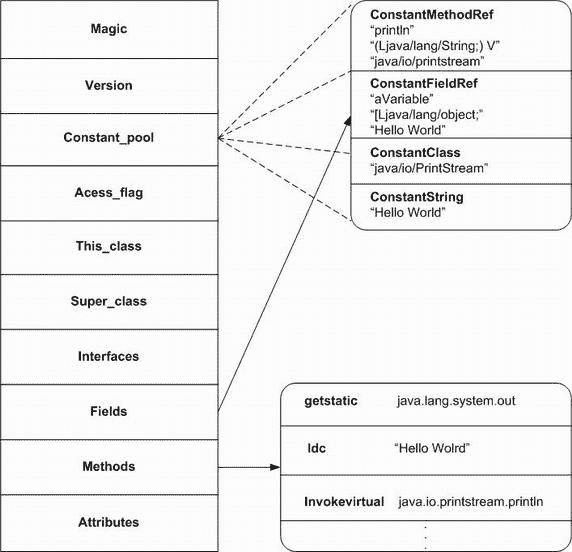
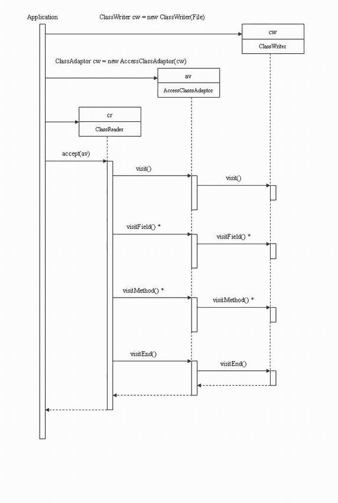

# AOP 的利器：ASM 3.0 介绍

> 原文：[`developer.ibm.com/zh/articles/j-lo-asm30/`](https://developer.ibm.com/zh/articles/j-lo-asm30/)

## 引言

### 什么是 ASM ？

ASM 是一个 Java 字节码操控框架。它能被用来动态生成类或者增强既有类的功能。ASM 可以直接产生二进制 class 文件，也可以在类被加载入 Java 虚拟机之前动态改变类行为。Java class 被存储在严格格式定义的 .class 文件里，这些类文件拥有足够的元数据来解析类中的所有元素：类名称、方法、属性以及 Java 字节码（指令）。ASM 从类文件中读入信息后，能够改变类行为，分析类信息，甚至能够根据用户要求生成新类。

与 BCEL 和 SERL 不同，ASM 提供了更为现代的编程模型。对于 ASM 来说，Java class 被描述为一棵树；使用 “Visitor” 模式遍历整个二进制结构；事件驱动的处理方式使得用户只需要关注于对其编程有意义的部分，而不必了解 Java 类文件格式的所有细节：ASM 框架提供了默认的 “response taker”处理这一切。

### 为什么要动态生成 Java 类？

动态生成 Java 类与 AOP 密切相关的。AOP 的初衷在于软件设计世界中存在这么一类代码，零散而又耦合：零散是由于一些公有的功能（诸如著名的 log 例子）分散在所有模块之中；同时改变 log 功能又会影响到所有的模块。出现这样的缺陷，很大程度上是由于传统的 面向对象编程注重以继承关系为代表的”纵向”关系，而对于拥有相同功能或者说方面 （Aspect）的模块之间的”横向”关系不能很好地表达。例如，目前有一个既有的银行管理系统，包括 Bank、Customer、Account、Invoice 等对象，现在要加入一个安全检查模块， 对已有类的所有操作之前都必须进行一次安全检查。

##### 图 1\. ASM – AOP


然而 Bank、Customer、Account、Invoice 是代表不同的事务，派生自不同的父类，很难在高层上加入关于 Security Checker 的共有功能。对于没有多继承的 Java 来说，更是如此。传统的解决方案是使用 Decorator 模式，它可以在一定程度上改善耦合，而功能仍旧是分散的 —— 每个需要 Security Checker 的类都必须要派生一个 Decorator，每个需要 Security Checker 的方法都要被包装（wrap）。下面我们以 `Account` 类为例看一下 Decorator：

首先，我们有一个 `SecurityChecker` 类，其静态方法 `checkSecurity` 执行安全检查功能：

```
public class SecurityChecker {
     public static void checkSecurity() {
         System.out.println("SecurityChecker.checkSecurity ...");
         //TODO real security check
     }
 } 
```

另一个是 `Account` 类：

```
public class Account {
     public void operation() {
         System.out.println("operation...");
         //TODO real operation
     }
 } 
```

若想对 `operation` 加入对 `SecurityCheck.checkSecurity()` 调用，标准的 Decorator 需要先定义一个 `Account` 类的接口：

```
public interface Account {
     void operation();
 } 
```

然后把原来的 `Account` 类定义为一个实现类：

```
public class AccountImpl extends Account{
     public void operation() {
         System.out.println("operation...");
         //TODO real operation
     }
 } 
```

定义一个 `Account` 类的 Decorator，并包装 `operation` 方法：

```
public class AccountWithSecurityCheck implements Account {
     private  Account account;
     public AccountWithSecurityCheck (Account account) {
         this.account = account;
     }
     public void operation() {
         SecurityChecker.checkSecurity();
         account.operation();
     }
 } 
```

在这个简单的例子里，改造一个类的一个方法还好，如果是变动整个模块，Decorator 很快就会演化成另一个噩梦。动态改变 Java 类就是要解决 AOP 的问题，提供一种得到系统支持的可编程的方法，自动化地生成或者增强 Java 代码。这种技术已经广泛应用于最新的 Java 框架内，如 Hibernate，Spring 等。

### 为什么选择 ASM ？

最直接的改造 Java 类的方法莫过于直接改写 class 文件。Java 规范详细说明了 class 文件的格式，直接编辑字节码确实可以改变 Java 类的行为。直到今天，还有一些 Java 高手们使用最原始的工具，如 UltraEdit 这样的编辑器对 class 文件动手术。是的，这是最直接的方法，但是要求使用者对 Java class 文件的格式了熟于心：小心地推算出想改造的函数相对文件首部的偏移量，同时重新计算 class 文件的校验码以通过 Java 虚拟机的安全机制。

Java 5 中提供的 Instrument 包也可以提供类似的功能：启动时往 Java 虚拟机中挂上一个用户定义的 hook 程序，可以在装入特定类的时候改变特定类的字节码，从而改变该类的行为。但是其缺点也是明显的：

*   Instrument 包是在整个虚拟机上挂了一个钩子程序，每次装入一个新类的时候，都必须执行一遍这段程序，即使这个类不需要改变。
*   直接改变字节码事实上类似于直接改写 class 文件，无论是调用 `ClassFileTransformer. transform(ClassLoader loader, String className, Class classBeingRedefined, ProtectionDomain protectionDomain, byte[] classfileBuffer)` ，还是 `Instrument.redefineClasses(ClassDefinition[] definitions)` ，都必须提供新 Java 类的字节码。也就是说，同直接改写 class 文件一样，使用 Instrument 也必须了解想改造的方法相对类首部的偏移量，才能在适当的位置上插入新的代码。

尽管 Instrument 可以改造类，但事实上，Instrument 更适用于监控和控制虚拟机的行为。

一种比较理想且流行的方法是使用 `java.lang.ref.proxy` 。我们仍旧使用上面的例子，给 `Account` 类加上 checkSecurity 功能 :

首先，Proxy 编程是面向接口的。下面我们会看到，Proxy 并不负责实例化对象，和 Decorator 模式一样，要把 `Account` 定义成一个接口，然后在 `AccountImpl` 里实现 `Account` 接口，接着实现一个 `InvocationHandler Account` 方法被调用的时候，虚拟机都会实际调用这个 `InvocationHandler` 的 `invoke` 方法：

```
class SecurityProxyInvocationHandler implements InvocationHandler {
     private Object proxyedObject;
     public SecurityProxyInvocationHandler(Object o) {
         proxyedObject = o;
     }

     public Object invoke(Object object, Method method, Object[] arguments)
         throws Throwable {
         if (object instanceof Account && method.getName().equals("opertaion")) {
             SecurityChecker.checkSecurity();
         }
         return method.invoke(proxyedObject, arguments);
     }
 } 
```

最后，在应用程序中指定 `InvocationHandler` 生成代理对象：

```
public static void main(String[] args) {
     Account account = (Account) Proxy.newProxyInstance(
         Account.class.getClassLoader(),
         new Class[] { Account.class },
         new SecurityProxyInvocationHandler(new AccountImpl())
     );
     account.function();
 } 
```

其不足之处在于：

*   Proxy 是面向接口的，所有使用 Proxy 的对象都必须定义一个接口，而且用这些对象的代码也必须是对接口编程的：Proxy 生成的对象是接口一致的而不是对象一致的：例子中 `Proxy.newProxyInstance` 生成的是实现 `Account` 接口的对象而不是 `AccountImpl` 的子类。这对于软件架构设计，尤其对于既有软件系统是有一定掣肘的。
*   Proxy 毕竟是通过反射实现的，必须在效率上付出代价：有实验数据表明，调用反射比一般的函数开销至少要大 10 倍。而且，从程序实现上可以看出，对 proxy class 的所有方法调用都要通过使用反射的 invoke 方法。因此，对于性能关键的应用，使用 proxy class 是需要精心考虑的，以避免反射成为整个应用的瓶颈。

ASM 能够通过改造既有类，直接生成需要的代码。增强的代码是硬编码在新生成的类文件内部的，没有反射带来性能上的付出。同时，ASM 与 Proxy 编程不同，不需要为增强代码而新定义一个接口，生成的代码可以覆盖原来的类，或者是原始类的子类。它是一个普通的 Java 类而不是 proxy 类，甚至可以在应用程序的类框架中拥有自己的位置，派生自己的子类。

相比于其他流行的 Java 字节码操纵工具，ASM 更小更快。ASM 具有类似于 BCEL 或者 SERP 的功能，而只有 33k 大小，而后者分别有 350k 和 150k。同时，同样类转换的负载，如果 ASM 是 60% 的话，BCEL 需要 700%，而 SERP 需要 1100% 或者更多。

ASM 已经被广泛应用于一系列 Java 项目：AspectWerkz、AspectJ、BEA WebLogic、IBM AUS、OracleBerkleyDB、Oracle TopLink、Terracotta、RIFE、EclipseME、Proactive、Speedo、Fractal、EasyBeans、BeanShell、Groovy、Jamaica、CGLIB、dynaop、Cobertura、JDBCPersistence、JiP、SonarJ、Substance L&F、Retrotranslator 等。Hibernate 和 Spring 也通过 cglib，另一个更高层一些的自动代码生成工具使用了 ASM。

## Java 类文件概述

所谓 Java 类文件，就是通常用 javac 编译器产生的 .class 文件。这些文件具有严格定义的格式。为了更好的理解 ASM，首先对 Java 类文件格式作一点简单的介绍。Java 源文件经过 javac 编译器编译之后，将会生成对应的二进制文件（如下图所示）。每个合法的 Java 类文件都具备精确的定义，而正是这种精确的定义，才使得 Java 虚拟机得以正确读取和解释所有的 Java 类文件。

##### 图 2\. ASM – Javac 流程


Java 类文件是 8 位字节的二进制流。数据项按顺序存储在 class 文件中，相邻的项之间没有间隔，这使得 class 文件变得紧凑，减少存储空间。在 Java 类文件中包含了许多大小不同的项，由于每一项的结构都有严格规定，这使得 class 文件能够从头到尾被顺利地解析。下面让我们来看一下 Java 类文件的内部结构，以便对此有个大致的认识。

例如，一个最简单的 Hello World 程序：

```
public class HelloWorld {
     public static void main(String[] args) {
         System.out.println("Hello world");
     }
 } 
```

经过 javac 编译后，得到的类文件大致是：

##### 图 3\. ASM – Java 类文件



从上图中可以看到，一个 Java 类文件大致可以归为 10 个项：

*   **Magic：** 该项存放了一个 Java 类文件的魔数（magic number）和版本信息。一个 Java 类文件的前 4 个字节被称为它的魔数。每个正确的 Java 类文件都是以 0xCAFEBABE 开头的，这样保证了 Java 虚拟机能很轻松的分辨出 Java 文件和非 Java 文件。
*   **Version：** 该项存放了 Java 类文件的版本信息，它对于一个 Java 文件具有重要的意义。因为 Java 技术一直在发展，所以类文件的格式也处在不断变化之中。类文件的版本信息让虚拟机知道如何去读取并处理该类文件。
*   **Constant Pool：** 该项存放了类中各种文字字符串、类名、方法名和接口名称、final 变量以及对外部类的引用信息等常量。虚拟机必须为每一个被装载的类维护一个常量池，常量池中存储了相应类型所用到的所有类型、字段和方法的符号引用，因此它在 Java 的动态链接中起到了核心的作用。常量池的大小平均占到了整个类大小的 60% 左右。
*   **Access_flag：** 该项指明了该文件中定义的是类还是接口（一个 class 文件中只能有一个类或接口），同时还指名了类或接口的访问标志，如 public，private, abstract 等信息。
*   **This Class：** 指向表示该类全限定名称的字符串常量的指针。
*   **Super Class：** 指向表示父类全限定名称的字符串常量的指针。
*   **Interfaces：** 一个指针数组，存放了该类或父类实现的所有接口名称的字符串常量的指针。以上三项所指向的常量，特别是前两项，在我们用 ASM 从已有类派生新类时一般需要修改：将类名称改为子类名称；将父类改为派生前的类名称；如果有必要，增加新的实现接口。
*   **Fields：** 该项对类或接口中声明的字段进行了细致的描述。需要注意的是，fields 列表中仅列出了本类或接口中的字段，并不包括从超类和父接口继承而来的字段。
*   **Methods：** 该项对类或接口中声明的方法进行了细致的描述。例如方法的名称、参数和返回值类型等。需要注意的是，methods 列表里仅存放了本类或本接口中的方法，并不包括从超类和父接口继承而来的方法。使用 ASM 进行 AOP 编程，通常是通过调整 Method 中的指令来实现的。
*   **Class attributes：** 该项存放了在该文件中类或接口所定义的属性的基本信息。

事实上，使用 ASM 动态生成类，不需要像早年的 class hacker 一样，熟知 class 文件的每一段，以及它们的功能、长度、偏移量以及编码方式。ASM 会给我们照顾好这一切的，我们只要告诉 ASM 要改动什么就可以了 —— 当然，我们首先得知道要改什么：对类文件格式了解的越多，我们就能更好地使用 ASM 这个利器。

## ASM 3.0 编程框架

ASM 通过树这种数据结构来表示复杂的字节码结构，并利用 Push 模型来对树进行遍历，在遍历过程中对字节码进行修改。所谓的 Push 模型类似于简单的 Visitor 设计模式，因为需要处理字节码结构是固定的，所以不需要专门抽象出一种 Vistable 接口，而只需要提供 Visitor 接口。所谓 Visitor 模式和 Iterator 模式有点类似，它们都被用来遍历一些复杂的数据结构。Visitor 相当于用户派出的代表，深入到算法内部，由算法安排访问行程。Visitor 代表可以更换，但对算法流程无法干涉，因此是被动的，这也是它和 Iterator 模式由用户主动调遣算法方式的最大的区别。

在 ASM 中，提供了一个 `ClassReader` 类，这个类可以直接由字节数组或由 class 文件间接的获得字节码数据，它能正确的分析字节码，构建出抽象的树在内存中表示字节码。它会调用 `accept` 方法，这个方法接受一个实现了 `ClassVisitor` 接口的对象实例作为参数，然后依次调用 `ClassVisitor` 接口的各个方法。字节码空间上的偏移被转换成 visit 事件时间上调用的先后，所谓 visit 事件是指对各种不同 visit 函数的调用， `ClassReader` 知道如何调用各种 visit 函数。在这个过程中用户无法对操作进行干涉，所以遍历的算法是确定的，用户可以做的是提供不同的 Visitor 来对字节码树进行不同的修改。 `ClassVisitor` 会产生一些子过程，比如 `visitMethod` 会返回一个实现 `MethordVisitor` 接口的实例， `visitField` 会返回一个实现 `FieldVisitor` 接口的实例，完成子过程后控制返回到父过程，继续访问下一节点。因此对于 `ClassReader` 来说，其内部顺序访问是有一定要求的。实际上用户还可以不通过 `ClassReader` 类，自行手工控制这个流程，只要按照一定的顺序，各个 visit 事件被先后正确的调用，最后就能生成可以被正确加载的字节码。当然获得更大灵活性的同时也加大了调整字节码的复杂度。

各个 `ClassVisitor` 通过职责链 （Chain-of-responsibility） 模式，可以非常简单的封装对字节码的各种修改，而无须关注字节码的字节偏移，因为这些实现细节对于用户都被隐藏了，用户要做的只是覆写相应的 visit 函数。

`ClassAdaptor` 类实现了 `ClassVisitor` 接口所定义的所有函数，当新建一个 `ClassAdaptor` 对象的时候，需要传入一个实现了 `ClassVisitor` 接口的对象，作为职责链中的下一个访问者 （Visitor），这些函数的默认实现就是简单的把调用委派给这个对象，然后依次传递下去形成职责链。当用户需要对字节码进行调整时，只需从 `ClassAdaptor` 类派生出一个子类，覆写需要修改的方法，完成相应功能后再把调用传递下去。这样，用户无需考虑字节偏移，就可以很方便的控制字节码。

每个 `ClassAdaptor` 类的派生类可以仅封装单一功能，比如删除某函数、修改字段可见性等等，然后再加入到职责链中，这样耦合更小，重用的概率也更大，但代价是产生很多小对象，而且职责链的层次太长的话也会加大系统调用的开销，用户需要在低耦合和高效率之间作出权衡。用户可以通过控制职责链中 visit 事件的过程，对类文件进行如下操作：

1.  删除类的字段、方法、指令：只需在职责链传递过程中中断委派，不访问相应的 visit 方法即可，比如删除方法时只需直接返回 `null` ，而不是返回由 `visitMethod` 方法返回的 `MethodVisitor` 对象。

    ```
    class DelLoginClassAdapter extends ClassAdapter {
         public DelLoginClassAdapter(ClassVisitor cv) {
             super(cv);
         }

         public MethodVisitor visitMethod(final int access, final String name,
             final String desc, final String signature, final String[] exceptions) {
             if (name.equals("login")) {
                 return null;
             }
             return cv.visitMethod(access, name, desc, signature, exceptions);
         }
     } 
    ```

2.  修改类、字段、方法的名字或修饰符：在职责链传递过程中替换调用参数。

    ```
    class AccessClassAdapter extends ClassAdapter {
         public AccessClassAdapter(ClassVisitor cv) {
             super(cv);
         }

         public FieldVisitor visitField(final int access, final String name,
            final String desc, final String signature, final Object value) {
            int privateAccess = Opcodes.ACC_PRIVATE;
            return cv.visitField(privateAccess, name, desc, signature, value);
        }
     } 
    ```

3.  增加新的类、方法、字段

ASM 的最终的目的是生成可以被正常装载的 class 文件，因此其框架结构为客户提供了一个生成字节码的工具类 —— `ClassWriter` 。它实现了 `ClassVisitor` 接口，而且含有一个 `toByteArray()` 函数，返回生成的字节码的字节流，将字节流写回文件即可生产调整后的 class 文件。一般它都作为职责链的终点，把所有 visit 事件的先后调用（时间上的先后），最终转换成字节码的位置的调整（空间上的前后），如下例：

```
ClassWriter  classWriter = new ClassWriter(ClassWriter.COMPUTE_MAXS);
 ClassAdaptor delLoginClassAdaptor = new DelLoginClassAdapter(classWriter);
 ClassAdaptor accessClassAdaptor = new AccessClassAdaptor(delLoginClassAdaptor);

 ClassReader classReader = new ClassReader(strFileName);
 classReader.accept(classAdapter, ClassReader.SKIP_DEBUG); 
```

综上所述，ASM 的时序图如下：

##### 图 4\. ASM – 时序图



## 使用 ASM3.0 进行 AOP 编程

我们还是用上面的例子，给 `Account` 类加上 security check 的功能。与 proxy 编程不同，ASM 不需要将 `Account` 声明成接口， `Account` 可以仍旧是一个实现类。ASM 将直接在 `Account` 类上动手术，给 `Account` 类的 `operation` 方法首部加上对 `SecurityChecker.checkSecurity` 的调用。

首先，我们将从 `ClassAdapter` 继承一个类。 `ClassAdapter` 是 ASM 框架提供的一个默认类，负责沟通 `ClassReader` 和 `ClassWriter` 。如果想要改变 `ClassReader` 处读入的类，然后从 `ClassWriter` 处输出，可以重写相应的 `ClassAdapter` 函数。这里，为了改变 `Account` 类的 `operation` 方法，我们将重写 `visitMethdod` 方法。

```
class AddSecurityCheckClassAdapter extends ClassAdapter {

    public AddSecurityCheckClassAdapter(ClassVisitor cv) {
        //Responsechain 的下一个 ClassVisitor，这里我们将传入 ClassWriter，
        // 负责改写后代码的输出
        super(cv);
    }

    // 重写 visitMethod，访问到 "operation" 方法时，
    // 给出自定义 MethodVisitor，实际改写方法内容
    public MethodVisitor visitMethod(final int access, final String name,
        final String desc, final String signature, final String[] exceptions) {
        MethodVisitor mv = cv.visitMethod(access, name, desc, signature,exceptions);
        MethodVisitor wrappedMv = mv;
        if (mv != null) {
            // 对于 "operation" 方法
            if (name.equals("operation")) {
                // 使用自定义 MethodVisitor，实际改写方法内容
                wrappedMv = new AddSecurityCheckMethodAdapter(mv);
            }
        }
        return wrappedMv;
    }
} 
```

下一步就是定义一个继承自 `MethodAdapter` 的 `AddSecurityCheckMethodAdapter` ，在”`operation` ”方法首部插入对 `SecurityChecker.checkSecurity()` 的调用。

```
class AddSecurityCheckMethodAdapter extends MethodAdapter {
     public AddSecurityCheckMethodAdapter(MethodVisitor mv) {
         super(mv);
     }

     public void visitCode() {
         visitMethodInsn(Opcodes.INVOKESTATIC, "SecurityChecker",
            "checkSecurity", "()V");
     }
 } 
```

其中， `ClassReader` 读到每个方法的首部时调用 `visitCode()` ，在这个重写方法里，我们用 `visitMethodInsn(Opcodes.INVOKESTATIC, "SecurityChecker","checkSecurity", "()V");` 插入了安全检查功能。

最后，我们将集成上面定义的 `ClassAdapter` ， `ClassReader` 和 `ClassWriter` 产生修改后的 `Account` 类文件 :

```
import java.io.File;
 import java.io.FileOutputStream;
 import org.objectweb.asm.*;

 public class Generator{
     public static void main() throws Exception {
         ClassReader cr = new ClassReader("Account");
         ClassWriter cw = new ClassWriter(ClassWriter.COMPUTE_MAXS);
         ClassAdapter classAdapter = new AddSecurityCheckClassAdapter(cw);
         cr.accept(classAdapter, ClassReader.SKIP_DEBUG);
         byte[] data = cw.toByteArray();
         File file = new File("Account.class");
         FileOutputStream fout = new FileOutputStream(file);
         fout.write(data);
         fout.close();
     }
 } 
```

执行完这段程序后，我们会得到一个新的 Account.class 文件，如果我们使用下面代码：

```
public class Main {
     public static void main(String[] args) {
         Account account = new Account();
         account.operation();
     }
 } 
```

使用这个 Account，我们会得到下面的输出：

```
SecurityChecker.checkSecurity ...
 operation... 
```

也就是说，在 `Account` 原来的 `operation` 内容执行之前，进行了 `SecurityChecker.checkSecurity()` 检查。

### 将动态生成类改造成原始类 Account 的子类

上面给出的例子是直接改造 `Account` 类本身的，从此 `Account` 类的 `operation` 方法必须进行 checkSecurity 检查。但事实上，我们有时仍希望保留原来的 `Account` 类，因此把生成类定义为原始类的子类是更符合 AOP 原则的做法。下面介绍如何将改造后的类定义为 `Account` 的子类 `Account$EnhancedByASM` 。其中主要有两项工作 :

*   改变 Class Description, 将其命名为 `Account$EnhancedByASM` ，将其父类指定为 `Account` 。
*   改变构造函数，将其中对父类构造函数的调用转换为对 `Account` 构造函数的调用。

在 `AddSecurityCheckClassAdapter` 类中，将重写 `visit` 方法：

```
public void visit(final int version, final int access, final String name,
         final String signature, final String superName,
         final String[] interfaces) {
     String enhancedName = name + "$EnhancedByASM";  // 改变类命名
     enhancedSuperName = name; // 改变父类，这里是”Account”
     super.visit(version, access, enhancedName, signature,
     enhancedSuperName, interfaces);
 } 
```

改进 `visitMethod` 方法，增加对构造函数的处理：

```
public MethodVisitor visitMethod(final int access, final String name,
     final String desc, final String signature, final String[] exceptions) {
     MethodVisitor mv = cv.visitMethod(access, name, desc, signature, exceptions);
     MethodVisitor wrappedMv = mv;
     if (mv != null) {
         if (name.equals("operation")) {
             wrappedMv = new AddSecurityCheckMethodAdapter(mv);
         } else if (name.equals("<init>")) {
             wrappedMv = new ChangeToChildConstructorMethodAdapter(mv,
                 enhancedSuperName);
         }
     }
     return wrappedMv;
 } 
```

这里 `ChangeToChildConstructorMethodAdapter` 将负责把 `Account` 的构造函数改造成其子类 `Account$EnhancedByASM` 的构造函数：

```
class ChangeToChildConstructorMethodAdapter extends MethodAdapter {
     private String superClassName;

     public ChangeToChildConstructorMethodAdapter(MethodVisitor mv,
         String superClassName) {
         super(mv);
         this.superClassName = superClassName;
     }

     public void visitMethodInsn(int opcode, String owner, String name,
         String desc) {
         // 调用父类的构造函数时
         if (opcode == Opcodes.INVOKESPECIAL && name.equals("<init>")) {
             owner = superClassName;
         }
         super.visitMethodInsn(opcode, owner, name, desc);// 改写父类为 superClassName
     }
 } 
```

最后演示一下如何在运行时产生并装入产生的 `Account$EnhancedByASM` 。 我们定义一个 `Util` 类，作为一个类工厂负责产生有安全检查的 `Account` 类：

```
public class SecureAccountGenerator {

    private static AccountGeneratorClassLoader classLoader =
        new AccountGeneratorClassLoade();

    private static Class secureAccountClass;

    public Account generateSecureAccount() throws ClassFormatError,
        InstantiationException, IllegalAccessException {
        if (null == secureAccountClass) {
            ClassReader cr = new ClassReader("Account");
            ClassWriter cw = new ClassWriter(ClassWriter.COMPUTE_MAXS);
            ClassAdapter classAdapter = new AddSecurityCheckClassAdapter(cw);
            cr.accept(classAdapter, ClassReader.SKIP_DEBUG);
            byte[] data = cw.toByteArray();
            secureAccountClass = classLoader.defineClassFromClassFile(
               "Account$EnhancedByASM",data);
        }
        return (Account) secureAccountClass.newInstance();
    }

    private static class AccountGeneratorClassLoader extends ClassLoader {
        public Class defineClassFromClassFile(String className,
            byte[] classFile) throws ClassFormatError {
            return defineClass("Account$EnhancedByASM", classFile, 0,
            classFile.length());
        }
    }
} 
```

静态方法 `SecureAccountGenerator.generateSecureAccount()` 在运行时动态生成一个加上了安全检查的 `Account` 子类。著名的 Hibernate 和 Spring 框架，就是使用这种技术实现了 AOP 的”无损注入”。

## 结束语

最后，我们比较一下 ASM 和其他实现 AOP 的底层技术：

##### 表 1\. AOP 底层技术比较

| AOP 底层技术 | 功能 | 性能 | 面向接口编程 | 编程难度 |
| --- | --- | --- | --- | --- |
| 直接改写 class 文件 | 完全控制类 | 无明显性能代价 | 不要求 | 高，要求对 class 文件结构和 Java 字节码有深刻了解 |
| JDK Instrument | 完全控制类 | 无论是否改写，每个类装入时都要执行 hook 程序 | 不要求 | 高，要求对 class 文件结构和 Java 字节码有深刻了解 |
| JDK Proxy | 只能改写 method | 反射引入性能代价 | 要求 | 低 |
| ASM | 几乎能完全控制类 | 无明显性能代价 | 不要求 | 中，能操纵需要改写部分的 Java 字节码 |