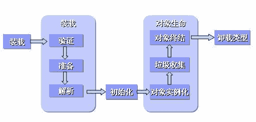

# 解析 Java 类和对象的初始化过程

> 原文：[`developer.ibm.com/zh/articles/j-lo-clobj-init/`](https://developer.ibm.com/zh/articles/j-lo-clobj-init/)

## 问题引入

近日我在调试一个枚举类型的解析器程序，该解析器是将数据库内一万多条枚举代码装载到缓存中，为了实现快速定位枚举代码和具体枚举类别的所有枚举元素，该类在装载枚举代码的同时对其采取两种策略建立内存索引。由于该类是一个公共服务类，在程序各个层面都会使用到它，因此我将它实现为一个单例类。这个类在我调整类实例化语句位置之前运行正常，但当我把该类实例化语句调整到静态初始化语句之前时，我的程序不再为我工作了。

下面是经过我简化后的示例代码：

##### 清单 1

```
package com.ccb.framework.enums;

import java.util.Collections;
import java.util.HashMap;
import java.util.Map;

public class CachingEnumResolver {
    //单态实例　一切问题皆由此行引起
    private static final CachingEnumResolver SINGLE_ENUM_RESOLVER = new
    CachingEnumResolver();
    /*MSGCODE->Category 内存索引*/
    private static Map CODE_MAP_CACHE;
    static {
        CODE_MAP_CACHE = new HashMap();
        //为了说明问题,我在这里初始化一条数据
        CODE_MAP_CACHE.put("0","北京市");
    }

    //private, for single instance
    private CachingEnumResolver() {
        //初始化加载数据  引起问题，该方法也要负点责任
        initEnums();
    }

    /**
     * 初始化所有的枚举类型
     */
    public static void initEnums() {
        // ~~~~~~~~~问题从这里开始暴露 ~~~~~~~~~~~//
        if (null == CODE_MAP_CACHE) {
            System.out.println("CODE_MAP_CACHE 为空,问题在这里开始暴露.");
            CODE_MAP_CACHE = new HashMap();
        }
        CODE_MAP_CACHE.put("1", "北京市");
        CODE_MAP_CACHE.put("2", "云南省");

        //..... other code...
    }

    public Map getCache() {
        return Collections.unmodifiableMap(CODE_MAP_CACHE);
    }

    /**
     * 获取单态实例
     *
     * @return
     */
    public static CachingEnumResolver getInstance() {
        return SINGLE_ENUM_RESOLVER;
    }

    public static void main(String[] args) {
        System.out.println(CachingEnumResolver.getInstance().getCache());
    }
} 
```

想必大家看了上面的代码后会感觉有些茫然，这个类看起来没有问题啊，这的确属于典型的饿汉式单态模式啊，怎么会有问题呢？

是的，他看起来的确没有问题，可是如果将他 run 起来时，其结果是他不会为你正确 work。运行该类，它的执行结果是：

##### 清单 2

```
CODE_MAP_CACHE 为空,问题在这里开始暴露.
{0=北京市} 
```

我的程序怎么会这样？为什么在 initEnum() 方法里 CODE_MAP_CACHE 为空？为什么我输出的 CODE_MAP_CACHE 内容只有一个元素，其它两个元素呢？？？？！！

看到这里，如果是你在调试该程序，你此刻一定觉得很奇怪，难道是我的 Jvm 有问题吗？非也！如果不是，那我的程序是怎么了？这绝对不是我想要的结果。可事实上无论怎么修改 initEnum() 方法都无济于事，起码我最初是一定不会怀疑到问题可能出在创建 CachingEnumResolver 实例这一环节上。正是因为我太相信我创建 CachingEnumResolver 实例的方法，加之对 Java 类初始化与对象实例化底层原理理解有所偏差，使我为此付出了三、四个小时–约半个工作日的大好青春。

那么问题究竟出在哪里呢？为什么会出现这样的怪事呢？在解决这个问题之前，先让我们来了解一下 JVM 的类和对象初始化的底层机制。

## 类的生命周期



上图展示的是类生命周期流向；在本文里，我只打算谈谈类的”初始化”以及”对象实例化”两个阶段。

## 类初始化

类”初始化”阶段，它是一个类或接口被首次使用的前阶段中的最后一项工作，本阶段负责为类变量赋予正确的初始值。

Java 编译器把所有的类变量初始化语句和类型的静态初始化器通通收集到 `<clinit>` 方法内，该方法只能被 Jvm 调用，专门承担初始化工作。

除接口以外，初始化一个类之前必须保证其直接超类已被初始化，并且该初始化过程是由 Jvm 保证线程安全的。另外，并非所有的类都会拥有一个 `<clinit>()` 方法，在以下条件中该类不会拥有 `<clinit>()` 方法：

*   该类既没有声明任何类变量，也没有静态初始化语句；
*   该类声明了类变量，但没有明确使用类变量初始化语句或静态初始化语句初始化；
*   该类仅包含静态 final 变量的类变量初始化语句，并且类变量初始化语句是编译时常量表达式。

## 对象初始化

在类被装载、连接和初始化，这个类就随时都可能使用了。对象实例化和初始化是就是对象生命的起始阶段的活动，在这里我们主要讨论对象的初始化工作的相关特点。

Java 编译器在编译每个类时都会为该类至少生成一个实例初始化方法–即 `<init>()` 方法。此方法与源代码中的每个构造方法相对应，如果类没有明确地声明任何构造方法，编译器则为该类生成一个默认的无参构造方法，这个默认的构造器仅仅调用父类的无参构造器，与此同时也会生成一个与默认构造方法对应的 `<init>()` 方法.

通常来说，`<init>()` 方法内包括的代码内容大概为：调用另一个 `<init>()` 方法；对实例变量初始化；与其对应的构造方法内的代码。

如果构造方法是明确地从调用同一个类中的另一个构造方法开始，那它对应的 `<init>()` 方法体内包括的内容为：一个对本类的 `<init>()` 方法的调用；对应用构造方法内的所有字节码。

如果构造方法不是通过调用自身类的其它构造方法开始，并且该对象不是 Object 对象，那 `<init>()` 法内则包括的内容为：一个对父类 `<init>()` 方法的调用；对实例变量初始化方法的字节码；最后是对应构造子的方法体字节码。

如果这个类是 Object，那么它的 `<init>()` 方法则不包括对父类 `<init>()` 方法的调用。

## 类的初始化时机

本文到目前为止，我们已经大概有了解到了类生命周期中都经历了哪些阶段，但这个类的生命周期的开始阶段–类装载又是在什么时候被触发呢？类又是何时被初始化的呢？让我们带着这三个疑问继续去寻找答案。

Java 虚拟机规范为类的初始化时机做了严格定义：”initialize on first active use”–” 在首次主动使用时初始化”。这个规则直接影响着类装载、连接和初始化类的机制–因为在类型被初始化之前它必须已经被连接，然而在连接之前又必须保证它已经被装载了。

在与初始化时机相关的类装载时机问题上，Java 虚拟机规范并没有对其做严格的定义，这就使得 JVM 在实现上可以根据自己的特点提供采用不同的装载策略。我们可以思考一下 Jboss AOP 框架的实现原理，它就是在对你的 class 文件装载环节做了手脚–插入了 AOP 的相关拦截字节码，这使得它可以对程序员做到完全透明化，哪怕你用 new 操作符创建出的对象实例也一样能被 AOP 框架拦截–与之相对应的 Spring AOP，你必须通过他的 BeanFactory 获得被 AOP 代理过的受管对象，当然 Jboss AOP 的缺点也很明显–他是和 JBOSS 服务器绑定很紧密的，你不能很轻松的移植到其它服务器上。嗯~……，说到这里有些跑题了，要知道 AOP 实现策略足可以写一本厚厚的书了，嘿嘿，就此打住。

说了这么多，类的初始化时机就是在”在首次主动使用时”，那么，哪些情形下才符合首次主动使用的要求呢？

首次主动使用的情形：

*   创建某个类的新实例时–new、反射、克隆或反序列化；
*   调用某个类的静态方法时；
*   使用某个类或接口的静态字段或对该字段赋值时（final 字段除外）；
*   调用 Java 的某些反射方法时
*   初始化某个类的子类时
*   在虚拟机启动时某个含有 `main()` 方法的那个启动类。

除了以上几种情形以外，所有其它使用 JAVA 类型的方式都是被动使用的，他们不会导致类的初始化。

## 我的问题究竟出在哪里

好了，了解了 JVM 的类初始化与对象初始化机制后，我们就有了理论基础，也就可以理性的去分析问题了。

下面让我们来看看前面清单一的 JAVA 源代码反组译出的字节码：

##### 清单 3

```
public class com.ccb.framework.enums.CachingEnumResolver extends
java.lang.Object{
static {};
  Code:
   0:    new    #2; //class CachingEnumResolver
   3:    dup
   4:    invokespecial    #14; //Method "<init>":()V  ①
   7:    putstatic    #16; //Field
   SINGLE_ENUM_RESOLVER:Lcom/ccb/framework/enums/CachingEnumResolver;
   10:    new    #18; //class HashMap              ②
   13:    dup
   14:    invokespecial    #19; //Method java/util/HashMap."<init>":()V
   17:    putstatic    #21; //Field CODE_MAP_CACHE:Ljava/util/Map;
   20:    getstatic    #21; //Field CODE_MAP_CACHE:Ljava/util/Map;
   23:    ldc    #23; //String 0
   25:    ldc    #25; //String 北京市
   27:    invokeinterface    #31,  3; //InterfaceMethod
   java/util/Map.put:(Ljava/lang/Object;Ljava/lang/Object;)Ljava/lang/Object;   ③
   32:    pop
   33:    return

private com.ccb.framework.enums.CachingEnumResolver();
  Code:
   0:    aload_0
   1:    invokespecial    #34; //Method java/lang/Object."<init>":()V
   4:    invokestatic    #37; //Method initEnums:()V                  ④
   7:    return

public static void initEnums();
  Code:
   0:    getstatic    #21; //Field CODE_MAP_CACHE:Ljava/util/Map;    ⑤
   3:    ifnonnull    24
   6:    getstatic    #44; //Field java/lang/System.out:Ljava/io/PrintStream;
   9:    ldc    #46; //String CODE_MAP_CACHE 为空,问题在这里开始暴露.
   11:    invokevirtual    #52; //Method
   java/io/PrintStream.println:(Ljava/lang/String;)V
   14:    new    #18; //class HashMap
   17:    dup
   18:    invokespecial    #19; //Method java/util/HashMap."<init>":()V      ⑥
   21:    putstatic    #21; //Field CODE_MAP_CACHE:Ljava/util/Map;
   24:    getstatic    #21; //Field CODE_MAP_CACHE:Ljava/util/Map;
   27:    ldc    #54; //String 1
   29:    ldc    #25; //String 北京市
   31:    invokeinterface    #31,  3; //InterfaceMethod
   java/util/Map.put:(Ljava/lang/Object;Ljava/lang/Object;)Ljava/lang/Object;   ⑦
   36:    pop
   37:    getstatic    #21; //Field CODE_MAP_CACHE:Ljava/util/Map;
   40:    ldc    #56; //String 2
   42:    ldc    #58; //String 云南省
   44:    invokeinterface    #31,  3; //InterfaceMethod
   java/util/Map.put:(Ljava/lang/Object;Ljava/lang/Object;)Ljava/lang/Object;    ⑧
   49:    pop
   50:    return

public java.util.Map getCache();
  Code:
   0:    getstatic    #21; //Field CODE_MAP_CACHE:Ljava/util/Map;
   3:    invokestatic    #66; //Method
   java/util/Collections.unmodifiableMap:(Ljava/util/Map;)Ljava/util/Map;
   6:    areturn

public static com.ccb.framework.enums.CachingEnumResolver getInstance();
  Code:
   0:    getstatic    #16;
   //Field SINGLE_ENUM_RESOLVER:Lcom/ccb/framework/enums/CachingEnumResolver;   ⑨
   3:    areturn
} 
```

如果上面清单 1 显示，清单内容是在 JDK1.4 环境下的字节码内容，可能这份清单对于很大部分兄弟来说确实没有多少吸引力，因为这些 JVM 指令确实不像源代码那样漂亮易懂。但它的的确确是查找和定位问题最直接的办法，我们想要的答案就在这份 JVM 指令清单里。

现在，让我们对该类从类初始化到对象实例初始化全过程分析[清单一]中的代码执行轨迹。

如前面所述，类初始化是在类真正可用时的最后一项前阶工作，该阶段负责对所有类正确的初始化值，此项工作是线程安全的，JVM 会保证多线程同步。

第１步：调用类初始化方法 `CachingEnumResolver.<clinit>()`，该方法对外界是不可见的，换句话说是 JVM 内部专用方法，`<clinit>()` 内包括了 CachingEnumResolver 内所有的具有指定初始值的类变量的初始化语句。要注意的是并非每个类都具有该方法，具体的内容在前面已有叙述。

第２步：进入 `<clinit>()` 方法内，让我们看字节码中的 “①” 行，该行与其上面两行组合起来代表 new 一个 CachingEnumResolver 对象实例，而该代码行本身是指调用 `CachingEnumResolver` 类的 `<init>（）方法。每一个 Java 类都具有一个`<init>()`方法，该方法是 Java 编译器在编译时生成的，对外界不可见，`<init>()` 方法内包括了所有具有指定初始化值的实例变量初始化语句和 java 类的构造方法内的所有语句。对象在实例化时，均通过该方法进行初始化。然而到此步，一个潜在的问题已经在此埋伏好，就等着你来犯了。</init></init>

第３步：让我们顺着执行顺序向下看，”④” 行，该行所在方法就是该类的构造器，该方法先调用父类的构造器 `<init>()` 对父对象进行初始化，然后调用 CachingEnumResolver.initEnum() 方法加载数据。

第４步：”⑤” 行，该行获取 “CODE_MAP_CACHE” 字段值，其运行时该字段值为 null。注意，问题已经开始显现了。（作为程序员的你一定是希望该字段已经被初始化过了，而事实上它还没有被初始化）。通过判断，由于该字段为 NULL，因此程序将继续执行到 “⑥” 行，将该字段实例化为 HashMap()。

第５步：在 “⑦”、”⑧” 行，其功能就是为 “CODE_MAP_CACHE” 字段填入两条数据。

第６步：退出对象初始化方法 `<init>()`，将生成的对象实例初始化给类字段 `SINGLE_ENUM_RESOLVER`。（注意，此刻该对象实例内的类变量还未初始化完全，刚才由 `<init>()` 调用 initEnum() 方法赋值的类变量 “CODE_MAP_CACHE” 是 `<clinit>()` 方法还未初始化字段，它还将在后面的类初始化过程再次被覆盖）。

第７步：继续执行 `<clinit>（）`方法内的后继代码，”②” 行，该行对 “CODE_MAP_CACHE” 字段实例化为 HashMap 实例（注意：在对象实例化时已经对该字段赋值过了，现在又重新赋值为另一个实例，此刻，”CODE_MAP_CACHE”变量所引用的实例的类变量值被覆盖，到此我们的疑问已经有了答案）。

第 8 步：类初始化完毕，同时该单态类的实例化工作也完成。

通过对上面的字节码执行过程分析，或许你已经清楚了解到导致错误的深层原因了，也或许你可能早已被上面的分析过程给弄得晕头转向了，不过也没折，虽然我也可以从源代码的角度来阐述问题，但这样不够深度，同时也会有仅为个人观点、不足可信之嫌。

## 如何解决

要解决上面代码所存在的问题很简单，那就是将 “SINGLE_ENUM_RESOLVER” 变量的初始化赋值语句转移到 getInstance() 方法中去即可。换句话说就是要避免在类还未初始化完成时从内部实例化该类或在初始化过程中引用还未初始化的字段。

## 写在最后

静下浮燥之心，仔细思量自己是否真的掌握了本文主题所引出的知识，如果您觉得您已经完全或基本掌握了，那么很好，在最后，我将前面的代码稍做下修改，请思考下面两组程序是否同样会存在问题呢？

##### 程序一

```
public class CachingEnumResolver {
    public  static Map CODE_MAP_CACHE;
    static {
        CODE_MAP_CACHE = new HashMap();
        //为了说明问题,我在这里初始化一条数据
        CODE_MAP_CACHE.put("0","北京市");
        initEnums();
    } 
```

##### 程序二

```
public class CachingEnumResolver {
        private static final CachingEnumResolver SINGLE_ENUM_RESOLVER;
        public  static Map CODE_MAP_CACHE;
        static {
            CODE_MAP_CACHE = new HashMap();
            //为了说明问题,我在这里初始化一条数据
            CODE_MAP_CACHE.put("0","北京市");
            SINGLE_ENUM_RESOLVER = new CachingEnumResolver();
            initEnums();
        } 
```

最后，一点关于 JAVA 群体的感言：时下正是各种开源框架盛行时期，Spring 更是大行其道，吸引着一大批 JEE 开发者的眼球（我也是 fans 中的一员）。然而，让我们仔细观察一下–以 Spring 群体为例，在那么多的 Spring fans 当中，有多少人去研究过 Spring 源代码？又有多少人对 Spring 设计思想有真正深入了解呢？当然，我是没有资格以这样的口吻来说事的，我只是想表明一个观点–学东西一定要”正本清源”。

献上此文，谨以共勉。