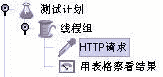
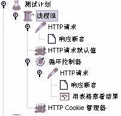
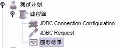
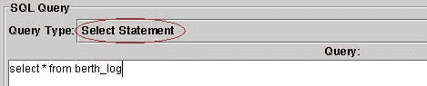
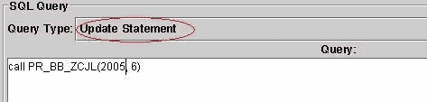
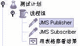
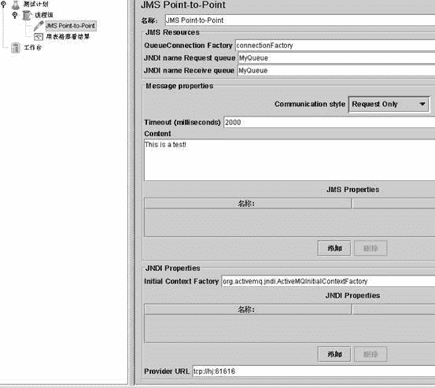

# 使用 JMeter 完成常用的压力测试

> 原文：[`developer.ibm.com/zh/articles/os-pressiontest/`](https://developer.ibm.com/zh/articles/os-pressiontest/)

讲到测试，人们脑海中首先浮现的就是针对软件正确性的测试，即常说的功能测试。但是软件仅仅只是功能正确是不够的。在实际开发中，还有其它的非功能因素也起着决定性的因素，例如软件的响应速度。影响软件响应速度的因素有很多，有些是因为算法不够高效；还有些可能受用户并发数的影响。

在众多类型的软件测试中，压力测试正是以软件响应速度为测试目标，尤其是针对在较短时间内大量并发用户的访问时，软件的抗压能力。本文以 JMeter 为例，介绍了如何使用它来完成常用的压力测试：Web 测试、数据库测试和 JMS 测试。

## 概述

JMeter 最早是为了测试 Tomcat 的前身 JServ 的执行效率而诞生的。到目前为止，它的最新版本是 2.1.1，它的测试能力也不再仅仅只局限于对于 Web 服务器的测试，而是涵盖了数据库、JMS、Web Service、LDAP 等多种对象的测试能力。在最新的 2.1.1 中，它还提供了对于 JUNIT 的测试。

JMeter 的安装非常简单，从[官方网站](http://jakarta.apache.org/jmeter/) 上下载，解压之后即可使用。运行命令在%JMETER_HOME%/bin 下，对于 Windows 用户来说，命令是 jmeter.bat。运行前请检查 JMeter 的文档，查看是否具备相关的运行条件。对于最新版（即 2.1.1），需要 JDK 的版本要求是 JDK 1.4。

JMeter 的主要测试组件总结如下：

1.  测试计划是使用 JMeter 进行测试的起点，它是其它 JMeter 测试元件的容器。

2.  线程组代表一定数量的并发用户，它可以用来模拟并发用户发送请求。实际的请求内容在 Sampler 中定义，它被线程组包含。

3.  监听器负责收集测试结果，同时也被告知了结果显示的方式。

4.  逻辑控制器可以自定义 JMeter 发送请求的行为逻辑，它与 Sampler 结合使用可以模拟复杂的请求序列。

5.  断言可以用来判断请求响应的结果是否如用户所期望的。它可以用来隔离问题域，即在确保功能正确的前提下执行压力测试。这个限制对于有效的测试是非常有用的。

6.  配置元件维护 Sampler 需要的配置信息，并根据实际的需要会修改请求的内容。

7.  前置处理器和后置处理器负责在生成请求之前和之后完成工作。前置处理器常常用来修改请求的设置，后置处理器则常常用来处理响应的数据。

8.  定时器负责定义请求之间的延迟间隔。

JMeter 的使用非常的容易，在 ONJava.com 上的文章 [Using JMeter](http://www.onjava.com/pub/a/onjava/2003/01/15/jmeter.html) 提供了一个非常好的入门。

## 常用测试

压力测试不同于功能测试，软件的正确性并不是它的测试重点。它所看重的是软件的执行效率，尤其是短时间内访问用户数爆炸性增长时软件的响应速度，压力测试往往是在功能测试之后进行的。在实际的开发过程中，软件潜在的效率瓶颈一般都是那些可能有多个用户同时访问的节点。

就目前 Java EE 的平台下开发的软件来说，这种节点通常可能是：Web 服务器、数据库服务器和 JMS 服务器。它们都是请求主要发生的地点，请求频率较其它的节点要高，而且处于请求序列的关键路径之上。如果它们效率无法提高的话，对于整个软件的效率有致命的影响。而且在这些节点上一般都会发生较大规模的数据交换，有时其中还包含有业务逻辑处理，它们正是在进行压力测试时首先需要考虑的。

本文以这三种节点为例，介绍如何使用 JMeter 来完成针对于它们的压力测试。

### Web 服务器

对于大多数的项目来说，并不会自行开发一个 Web 服务器，因此 Web 服务器压力测试的对象实际就是–发布到 Web 服务器中的软件。最简单的 Web 测试计划只需要三个 JMeter 的测试元件，如下图：



其中：

*   在线程组中定义线程数、产生线程发生的时间和测试循环次数。
*   在 http 请求中定义服务器、端口、协议和方法、请求路径等。
*   表格监听器负责收集和显示结果。

这种设置对于包含了安全机制的 web 应用是不够的，典型的 web 应用一般都会：

1.  有一个登录页，它是整个应用的入口。当用户登录之后，应用会将用户相关的安全信息放到 session 中。

2.  有一个 filter，它拦截请求，检查每个请求相关的 session 中是否包含有用户安全信息。如果没有，那么请求被重定向到登录页，要求用户提供安全信息。

在这种配置下应用上面的测试计划，那么除了登录页之外的其它请求都将因为缺少用户安全信息，而使请求实际定位到登录页。如果不加断言，那么在监听器看来所有的请求都是成功。而实际上，这些请求最终都没有到达它们应该去的地方。显然，这种测试结果不是我们所期望的。

为了成功的测试，至少有 2 种方法：

*   方法一，去掉程序的安全设置，如 filter，使得不需要用户安全信息也能访问受限内容；
*   方法二，不修改程序，使用 JMeter 提供的”Http URL 重写修饰符”或”Http Cookie 管理器”。

对于第一种方法，有其局限性：

*   需要修改程序配置，如去掉 web.xml 中关于安全 filter 的设置。需要维护多个版本的 web.xml，如压力测试和功能测试分别各自的 web.xml，增加了维护成本，而且有可能会在测试之后忘记将 web.xml 修改回来。
*   对于一些需要用户安全信息的页面无能为力，如某些业务审计操作需要用户安全信息来记录。因为缺少这样的信息，注定了测试的失败。如果解决为了这个问题进一步的修改程序，那么因为存在多个版本的程序，那么其维护难度将大大增加。

虽然，第二种方法配置难度增加了，但是它不用修改程序。而且还可将测试计划保存成文件，以便重复使用。因此，选用第二种方法是较为理想的做法。下面以一个简化的例子说明使用方法二的配置步骤。

例子由以下几个文件组成：

*   AuthorizenFilter.java，过滤器负责检验 session 中是否存在用户信息。如果没有，那么就转向到 login.jsp。它的主要方法 doFilter 内容如下：

    ```
    public void doFilter(ServletRequest request,
                         ServletResponse response,
                         FilterChain chain)
                         throws IOException, ServletException {
        HttpServletRequest req = (HttpServletRequest)request;
        HttpServletResponse res = (HttpServletResponse)response;
        HttpSession session= req.getSession();
        User user = (User)session.getAttribute("user");
        if(null == user){
            String uri= req.getRequestURI();
            //如果请求页是登录页，不转向
            if( uri.equalsIgnoreCase("/gWeb/login.jsp")){
                chain.doFilter(request, response);
            } else{
                res.sendRedirect("/gWeb/login.jsp");
            }
        }else{
            chain.doFilter(request, response);
        }
    } 
    ```

*   User.java，用户类负责记录用户的信息。为了简化，这里的登录操作只允许指定用户名和密码。主要内容如下：

    ```
    public class User {
        private String user;
        private String pwd;
        public User(String user, String pwd) {
            this.user = user;
            this.pwd = pwd;
        }
        public boolean login(){
            return user.equals("foxgem") && pwd.equals("12345678");
        }
        public String getUser() {
            return user;
        }
        public void setUser(String user) {
            this.user = user;
        }
    } 
    ```

*   Login.jsp 和 welcome.jsp。其中 login.jsp 负责生成 User 对象，并调用 User 的 login。当 login 返回为 true 时转向到 welcome.jsp。其验证部分的代码：

    ```
    <%
      if( request.getParameter("Submit") != null) {
          User ur= new User( request.getParameter("user"), request.getParameter("pwd"));
          if( ur.login()){
               session.setAttribute("user", ur);
             response.sendRedirect("/gWeb/welcome.jsp");
          } else{
             session.setAttribute( "LOGIN_ERROR_MSG",
    "无效的用户，可能原因：用户不存在或被禁用。");
             response.sendRedirect("/gWeb/index.jsp");
             return;
          }
      }
    %> 
    ```

*   web.xml，配置 filter 拦截所有访问 JSP 页面的请求：

    ```
    <filter>
        <filter-name>authorizen</filter-name>
        <filter-class>org.foxgem.jmeter.AuthorizenFilter</filter-class>
    </filter>
    <filter-mapping>
        <filter-name>authorizen</filter-name>
        <url-pattern>*.jsp</url-pattern>
    </filter-mapping> 
    ```

创建如下结构的 Web 测试计划：



其中主要测试元件说明如下：

*   http 请求默认值负责记录请求的默认值，如服务器、协议、端口等。
*   第一个 http 请求，请求 login.jsp，并附加验证所需要的参数（user=foxgem，pwd=12345678，Submit=Submit）；其包含的响应断言验证 url 中包含”welcome.jsp”，这一点可以从程序中反应。
*   第二个 http 请求，请求是 welcome.jsp；其包含的响应断言验证响应文本中包含”foxgem”，它是 welcome.jsp 页面逻辑的一部分。
*   http cookie 管理器负责管理整个测试过程中使用的 cookie，它不需要设置任何属性。
*   循环控制器设置发送第二个请求的循环次数，表格监听器负责收集和显示第二个请求的测试结果。

启动测试计划之后，执行的顺序是：首先，第一个请求登录页进行登录；成功登录之后，使用循环控制器执行第二个请求。请求 welcome.jsp 时，响应断言用来验证是否确实是 welocme.jsp 来处理请求，而不是因为其它页。在这个测试计划中需要注意的是 http cookie 管理器。正是由于它的作用，使得第二个请求能顺利的发送到 welcome.jsp 进行处理，而不是因为缺少用户安全信息转发到 login.jsp。

在这个例子中，我们并没有在程序中使用 cookie（使用的是 session），那么 http cookie 管理器怎么会起作用呢？这是因为在 servlet/jsp 规范中对于 session 的状态跟踪有 2 种方式：

*   使用 cookie，保留和传递 sessionid。它不要求程序对于 url 有什么特殊的处理，但是要求浏览器允许 cookie。在这个例子中，就是这种情形。
*   使用 url 重写，每次显式的在浏览器和服务器之间传递 sessionid。它要求程序对 url 进行编码，对浏览器没有要求。

对于第二种情形，可以使用 JMeter 前置管理器中的 http url 重写修饰符来完成。对于 Tomcat，Session 参数是 jsessionid，路径扩展使用”；”。使用 url 编码时需要注意，必须将浏览器的 cookie 功能关闭。因为 url 编码函数，如 encodeURL，会判断是否需要将 sessionid 编码到 url 中。当浏览器允许 cookie 时，就不会进行编码。

如果 cookie 而不是 session 来保存用户安全信息，那么直接使用 http cookie 管理器就行了。此时，需要将使用的 cookie 参数和值直接写到管理器中，由它负责管理。对于其它的 cookie 使用，也是如此操作。

登录问题解决之后，对于 Web 服务器的测试就没什么难点了。剩下的就是根据实际需要，灵活运用相关的测试组件搭建编写的测试计划。（当然，对于安全问题还有其它的使用情景。在使用时需要明确：JMeter 是否支持，如果支持使用哪种测试组件解决。）

### 数据库服务器

数据库服务器在大多数企业项目中是不可缺少的，对于它进行压力测试是为了找出：数据库对象是否可以有效地承受来自多个用户的访问。这些对象主要是：索引、触发器、存储过程和锁。通过对于 SQL 语句和存储过程的测试，JMeter 可以间接的反应数据库对象是否需要优化。

JMeter 使用 JDBC 发送请求，完成对于数据库的测试。一个数据库测试计划，建立如下结构即可：



其中：

*   JDBC 连接配置，负责配置数据库连接相关的信息。如：数据库 url、数据库驱动类名、用户名和密码等等。在这些配置中，”绑定到池的变量名”（Variable Name Bound to Pool）是一个非常重要的属性，这个属性会在 JDBC 请求中被引用。通过它， JDBC 请求和 JDBC 连接配置建立关联。（测试前，请将所需要的数据库驱动放到 JMeter 的 classpath 中）。
*   JDBC 请求，负责发送请求进行测试。
*   图形结果，收集显示测试结果。

在实际的项目中，至少有 2 种类型的 JDBC 请求需要关注：select 语句和存储过程。前者反应了 select 语句是否高效，以及表的索引等是否需要优化；后者则是反应存储过程的算法是否高效。它们如果效率低下，必然会带来响应上的不尽如人意。对于这两种请求，JDBC 请求的配置略有区别：

*   Select 语句

    

*   存储过程

    

如果对于 Oracle，如果测试的是函数，那么也可以使用 select 语句来进行配置，此时可以使用：select 函数(入参) from dual 形式的语句来测试，其中 dual 是 oracle 的关键字，表示哑表。对于其它厂商的数据库产品，请查找手册。

### JMS 服务器

MOM 作为消息数据交换的平台，也是影响应用执行效率的潜在环节。在 Java 程序中，是通过 JMS 与 MOM 进行交互的。作为 Java 实现的压力测试工具，JMeter 也能使用 JMS 对应用的消息交换和相关的数据处理能力进行测试。这一点应该不难理解，因为在整个测试过程中，JMeter 测试的重点应该是消息的产生者和消费者的本身能力，而不是 MOM 本身。

根据 JMS 规范，消息交换有 2 种方式：发布/订阅和点对点。JMeter 针对这两种情形，分别提供了不同的 Sampler 进行支持。以下 MOM 我们使用 ActiveMQ 3.2.1，分别描述这两种消息交换方式是如何使用 JMeter 进行测试。

#### 测试前的准备（两种情况都适用）

JMeter 虽然能使用 JMS 对 MOM 进行测试，但是它本身并没有提供 JMS 需要使用的包。因此，在测试之前需要将这些包复制到 %JMETER_HOME%/lib 下。对于 ActiveMQ 来说，就是复制 %ACTIVEMQ_HOME%/lib。%ACTIVEMQ_HOME%/optional 是可选包，可根据实际情况来考虑是否复制。

JMeter 在测试时使用了 JNDI，为了提供 JNDI 提供者的信息，需要提供 jndi.properties。同时需要将 jndi.properties 放到 JMeter 的 classpath 中，建议将它与 bin 下的 ApacheJMeter.jar 打包在一起。对于 ActiveMQ，jndi.properties 的示例内容如下：

```
java.naming.factory.initial = org.activemq.jndi.ActiveMQInitialContextFactory
java.naming.provider.url = tcp://localhost:61616

#指定 connectionFactory 的 jndi 名字，多个名字之间可以逗号分隔。
#以下为例：
#对于 topic，使用(TopicConnectionFactory)context.lookup("connectionFactry")
#对于 queue，(QueueConnectionFactory)context.lookup("connectionFactory")
connectionFactoryNames = connectionFactory

#注册 queue，格式：
#queue.[jndiName] = [physicalName]
#使用时：(Queue)context.lookup("jndiName")，此处是 MyQueue
queue.MyQueue = example.MyQueue

#注册 topic，格式：
# topic.[jndiName] = [physicalName]
#使用时：(Topic)context.lookup("jndiName")，此处是 MyTopic
topic.MyTopic = example.MyTopic 
```

#### 发布/订阅

在实际测试时，发布者和订阅者并不是需要同时出现的。例如，有时我们可能想测试单位时间内消息发布者的消息产生量，此时就不需要消息发布者，只需要订阅者就可以了。本例为了说明这两种 Sampler 的使用，因此建立如下的测试计划：



其中 JMS Publisher 和 JMS Subscriber 的属性：选择”使用 jndi.properties”，连接工厂是 connectionFactory，主题是 MyTopic，其它使用默认配置。对于 JMS Publisher，还需提供测试用的文本消息。

启动 ActiveMQ，运行测试计划。如果配置正确，那么与 ActiveMQ 成功连接之后，在 JMeter 的后台会打印出相关信息。在测试过程中，JMeter 后台打印可能会出现 java.lang.InterruptedException 信息，这个是正常现象，不会影响测试过程和结果。这一点可以从 bin 下的 jmeter.log 看出。

#### 点对点

对于点对点，JMeter 只提供了一种 Sampler：JMS Point-to-Point。在例子中，建立如下图的测试计划：



其中：Communication style 是 Request Only。对于另一种风格：Request Response，会验证收到消息的 JMS Header 中的 JMSCorrelationID，以判断是否是对请求消息的响应。

## 结束语

本文介绍了如何使用 JMeter 完成最常用的三种类型服务器的压力测试，这三种类型的压力测试涵盖了很大一部分的使用情形，然而需要记住的是工具毕竟是工具。效果好不好，关键还是在于使用的人。而且，对于压力测试，测试计划的好坏是关键。针对不同的情况，分析后有针对的进行测试，比起拿枪乱打、无的放矢显然要高效得多。