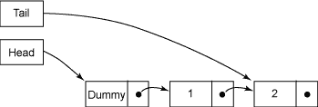

# 非阻塞算法简介

> 原文：[`developer.ibm.com/zh/articles/j-jtp04186/`](https://developer.ibm.com/zh/articles/j-jtp04186/)

在不只一个线程访问一个互斥的变量时，所有线程都必须使用同步，否则就可能会发生一些非常糟糕的事情。Java 语言中主要的同步手段就是 `synchronized` 关键字（也称为 *内在锁* ），它强制实行互斥，确保执行 `synchronized` 块的线程的动作，能够被后来执行受相同锁保护的 `synchronized` 块的其他线程看到。在使用得当的时候，内在锁可以让程序做到线程安全，但是在使用锁定保护短的代码路径，而且线程频繁地争用锁的时候，锁定可能成为相当繁重的操作。

在 [“流行的原子”](http://www.ibm.com/developerworks/cn/java/j-jtp11234/) 一文中，我们研究了 *原子变量* ，原子变量提供了原子性的读-写-修改操作，可以在不使用锁的情况下安全地更新共享变量。原子变量的内存语义与 volatile 变量类似，但是因为它们也可以被原子性地修改，所以可以把它们用作不使用锁的并发算法的基础。

## 非阻塞的计数器

清单 1 中的 `Counter` 是线程安全的，但是使用锁的需求带来的性能成本困扰了一些开发人员。但是锁是必需的，因为虽然增加看起来是单一操作，但实际是三个独立操作的简化：检索值，给值加 1，再写回值。（在 `getValue` 方法上也需要同步，以保证调用 `getValue` 的线程看到的是最新的值。虽然许多开发人员勉强地使自己相信忽略锁定需求是可以接受的，但忽略锁定需求并不是好策略。）

在多个线程同时请求同一个锁时，会有一个线程获胜并得到锁，而其他线程被阻塞。JVM 实现阻塞的方式通常是挂起阻塞的线程，过一会儿再重新调度它。由此造成的上下文切换相对于锁保护的少数几条指令来说，会造成相当大的延迟。

##### 清单 1\. 使用同步的线程安全的计数器

```
public final class Counter {
    private long value = 0;
    public synchronized long getValue() {
        return value;
    }
    public synchronized long increment() {
        return ++value;
    }
} 
```

清单 2 中的 `NonblockingCounter` 显示了一种最简单的非阻塞算法：使用 `AtomicInteger` 的 `compareAndSet()` （CAS）方法的计数器。 `compareAndSet()` 方法规定 “将这个变量更新为新值，但是如果从我上次看到这个变量之后其他线程修改了它的值，那么更新就失败”（请参阅 [“流行的原子”](http://www.ibm.com/developerworks/cn/java/j-jtp11234) 获得关于原子变量以及 “比较和设置” 的更多解释。）

##### 清单 2\. 使用 CAS 的非阻塞算法

```
public class NonblockingCounter {
    private AtomicInteger value;
    public int getValue() {
        return value.get();
    }
    public int increment() {
        int v;
        do {
            v = value.get();
        while (!value.compareAndSet(v, v + 1));
        return v + 1;
    }
} 
```

原子变量类之所以被称为 *原子的* ，是因为它们提供了对数字和对象引用的细粒度的原子更新，但是在作为非阻塞算法的基本构造块的意义上，它们也是原子的。非阻塞算法作为科研的主题，已经有 20 多年了，但是直到 Java 5.0 出现，在 Java 语言中才成为可能。

现代的处理器提供了特殊的指令，可以自动更新共享数据，而且能够检测到其他线程的干扰，而 `compareAndSet()` 就用这些代替了锁定。（如果要做的只是递增计数器，那么 `AtomicInteger` 提供了进行递增的方法，但是这些方法基于 `compareAndSet()` ，例如 `NonblockingCounter.increment()` ）。

非阻塞版本相对于基于锁的版本有几个性能优势。首先，它用硬件的原生形态代替 JVM 的锁定代码路径，从而在更细的粒度层次上（独立的内存位置）进行同步，失败的线程也可以立即重试，而不会被挂起后重新调度。更细的粒度降低了争用的机会，不用重新调度就能重试的能力也降低了争用的成本。即使有少量失败的 CAS 操作，这种方法仍然会比由于锁争用造成的重新调度快得多。

`NonblockingCounter` 这个示例可能简单了些，但是它演示了所有非阻塞算法的一个基本特征 —— 有些算法步骤的执行是要冒险的，因为知道如果 CAS 不成功可能不得不重做。非阻塞算法通常叫作 *乐观算法* ，因为它们继续操作的假设是不会有干扰。如果发现干扰，就会回退并重试。在计数器的示例中，冒险的步骤是递增 —— 它检索旧值并在旧值上加一，希望在计算更新期间值不会变化。如果它的希望落空，就会再次检索值，并重做递增计算。

## 非阻塞堆栈

非阻塞算法稍微复杂一些的示例是清单 3 中的 `ConcurrentStack` 。 `ConcurrentStack` 中的 `push()` 和 `pop()` 操作在结构上与 `NonblockingCounter` 上相似，只是做的工作有些冒险，希望在 “提交” 工作的时候，底层假设没有失效。 `push()` 方法观察当前最顶的节点，构建一个新节点放在堆栈上，然后，如果最顶端的节点在初始观察之后没有变化，那么就安装新节点。如果 CAS 失败，意味着另一个线程已经修改了堆栈，那么过程就会重新开始。

##### 清单 3\. 使用 Treiber 算法的非阻塞堆栈

```
public class ConcurrentStack<E> {
    AtomicReference<Node<E>> head = new AtomicReference<Node<E>>();
    public void push(E item) {
        Node<E> newHead = new Node<E>(item);
        Node<E> oldHead;
        do {
            oldHead = head.get();
            newHead.next = oldHead;
        } while (!head.compareAndSet(oldHead, newHead));
    }
    public E pop() {
        Node<E> oldHead;
        Node<E> newHead;
        do {
            oldHead = head.get();
            if (oldHead == null)
                return null;
            newHead = oldHead.next;
        } while (!head.compareAndSet(oldHead,newHead));
        return oldHead.item;
    }
    static class Node<E> {
        final E item;
        Node<E> next;
        public Node(E item) { this.item = item; }
    }
} 
```

### 性能考虑

在轻度到中度的争用情况下，非阻塞算法的性能会超越阻塞算法，因为 CAS 的多数时间都在第一次尝试时就成功，而发生争用时的开销也不涉及线程挂起和上下文切换，只多了几个循环迭代。没有争用的 CAS 要比没有争用的锁便宜得多（这句话肯定是真的，因为没有争用的锁涉及 CAS 加上额外的处理），而争用的 CAS 比争用的锁获取涉及更短的延迟。

在高度争用的情况下（即有多个线程不断争用一个内存位置的时候），基于锁的算法开始提供比非阻塞算法更好的吞吐率，因为当线程阻塞时，它就会停止争用，耐心地等候轮到自己，从而避免了进一步争用。但是，这么高的争用程度并不常见，因为多数时候，线程会把线程本地的计算与争用共享数据的操作分开，从而给其他线程使用共享数据的机会。（这么高的争用程度也表明需要重新检查算法，朝着更少共享数据的方向努力。） [“流行的原子”](http://www.ibm.com/developerworks/cn/java/j-jtp11234/) 中的图在这方面就有点儿让人困惑，因为被测量的程序中发生的争用极其密集，看起来即使对数量很少的线程，锁定也是更好的解决方案。

## 非阻塞的链表

目前为止的示例（计数器和堆栈）都是非常简单的非阻塞算法，一旦掌握了在循环中使用 CAS，就可以容易地模仿它们。对于更复杂的数据结构，非阻塞算法要比这些简单示例复杂得多，因为修改链表、树或哈希表可能涉及对多个指针的更新。CAS 支持对单一指针的原子性条件更新，但是不支持两个以上的指针。所以，要构建一个非阻塞的链表、树或哈希表，需要找到一种方式，可以用 CAS 更新多个指针，同时不会让数据结构处于不一致的状态。

在链表的尾部插入元素，通常涉及对两个指针的更新：”尾” 指针总是指向列表中的最后一个元素，”下一个” 指针从过去的最后一个元素指向新插入的元素。因为需要更新两个指针，所以需要两个 CAS。在独立的 CAS 中更新两个指针带来了两个需要考虑的潜在问题：如果第一个 CAS 成功，而第二个 CAS 失败，会发生什么？如果其他线程在第一个和第二个 CAS 之间企图访问链表，会发生什么？

对于非复杂数据结构，构建非阻塞算法的 “技巧” 是确保数据结构总处于一致的状态（甚至包括在线程开始修改数据结构和它完成修改之间），还要确保其他线程不仅能够判断出第一个线程已经完成了更新还是处在更新的中途，还能够判断出如果第一个线程走向 AWOL，完成更新还需要什么操作。如果线程发现了处在更新中途的数据结构，它就可以 “帮助” 正在执行更新的线程完成更新，然后再进行自己的操作。当第一个线程回来试图完成自己的更新时，会发现不再需要了，返回即可，因为 CAS 会检测到帮助线程的干预（在这种情况下，是建设性的干预）。

这种 “帮助邻居” 的要求，对于让数据结构免受单个线程失败的影响，是必需的。如果线程发现数据结构正处在被其他线程更新的中途，然后就等候其他线程完成更新，那么如果其他线程在操作中途失败，这个线程就可能永远等候下去。即使不出现故障，这种方式也会提供糟糕的性能，因为新到达的线程必须放弃处理器，导致上下文切换，或者等到自己的时间片过期（而这更糟）。

清单 4 的 `LinkedQueue` 显示了 Michael-Scott 非阻塞队列算法的插入操作，它是由 `ConcurrentLinkedQueue` 实现的：

##### 清单 4\. Michael-Scott 非阻塞队列算法中的插入

```
public class LinkedQueue <E> {
    private static class Node <E> {
        final E item;
        final AtomicReference<Node<E>> next;
        Node(E item, Node<E> next) {
            this.item = item;
            this.next = new AtomicReference<Node<E>>(next);
        }
    }
    private AtomicReference<Node<E>> head
        = new AtomicReference<Node<E>>(new Node<E>(null, null));
    private AtomicReference<Node<E>> tail = head;
    public boolean put(E item) {
        Node<E> newNode = new Node<E>(item, null);
        while (true) {
            Node<E> curTail = tail.get();
            Node<E> residue = curTail.next.get();
            if (curTail == tail.get()) {
                if (residue == null) /* A */ {
                    if (curTail.next.compareAndSet(null, newNode)) /* C */ {
                        tail.compareAndSet(curTail, newNode) /* D */ ;
                        return true;
                    }
                } else {
                    tail.compareAndSet(curTail, residue) /* B */;
                }
            }
        }
    }
} 
```

像许多队列算法一样，空队列只包含一个假节点。头指针总是指向假节点；尾指针总指向最后一个节点或倒数第二个节点。图 1 演示了正常情况下有两个元素的队列：

##### 图 1\. 有两个元素，处在静止状态的队列



如 清单 4\. Michael-Scott 非阻塞队列算法中的插入 所示，插入一个元素涉及两个指针更新，这两个更新都是通过 CAS 进行的：从队列当前的最后节点（C）链接到新节点，并把尾指针移动到新的最后一个节点（D）。如果第一步失败，那么队列的状态不变，插入线程会继续重试，直到成功。一旦操作成功，插入被当成生效，其他线程就可以看到修改。还需要把尾指针移动到新节点的位置上，但是这项工作可以看成是 “清理工作”，因为任何处在这种情况下的线程都可以判断出是否需要这种清理，也知道如何进行清理。

队列总是处于两种状态之一：正常状态（或称静止状态， 图 1\. 有两个元素，处在静止状态的队列 和 图 3\. 在尾指针更新后，队列重新处在静止状态 ）或中间状态（图 2）。在插入操作之前和第二个 CAS（D）成功之后，队列处在静止状态；在第一个 CAS（C）成功之后，队列处在中间状态。在静止状态时，尾指针指向的链接节点的 next 字段总为 null，而在中间状态时，这个字段为非 null。任何线程通过比较 `tail.next` 是否为 null，就可以判断出队列的状态，这是让线程可以帮助其他线程 “完成” 操作的关键。

##### 图 2\. 处在插入中间状态的队列，在新元素插入之后，尾指针更新之前


插入操作在插入新元素（A）之前，先检查队列是否处在中间状态，如 清单 4\. Michael-Scott 非阻塞队列算法中的插入 所示。如果是在中间状态，那么肯定有其他线程已经处在元素插入的中途，在步骤（C）和（D）之间。不必等候其他线程完成，当前线程就可以 “帮助” 它完成操作，把尾指针向前移动（B）。如果有必要，它还会继续检查尾指针并向前移动指针，直到队列处于静止状态，这时它就可以开始自己的插入了。

第一个 CAS（C）可能因为两个线程竞争访问队列当前的最后一个元素而失败；在这种情况下，没有发生修改，失去 CAS 的线程会重新装入尾指针并再次尝试。如果第二个 CAS（D）失败，插入线程不需要重试 —— 因为其他线程已经在步骤（B）中替它完成了这个操作！

##### 图 3\. 在尾指针更新后，队列重新处在静止状态


### 幕后的非阻塞算法

如果深入 JVM 和操作系统，会发现非阻塞算法无处不在。垃圾收集器使用非阻塞算法加快并发和平行的垃圾搜集；调度器使用非阻塞算法有效地调度线程和进程，实现内在锁。在 Mustang（Java 6.0）中，基于锁的 `SynchronousQueue` 算法被新的非阻塞版本代替。很少有开发人员会直接使用 `SynchronousQueue` ，但是通过 `Executors.newCachedThreadPool()` 工厂构建的线程池用它作为工作队列。比较缓存线程池性能的对比测试显示，新的非阻塞同步队列实现提供了几乎是当前实现 3 倍的速度。在 Mustang 的后续版本（代码名称为 Dolphin）中，已经规划了进一步的改进。

## 结束语

非阻塞算法要比基于锁的算法复杂得多。开发非阻塞算法是相当专业的训练，而且要证明算法的正确也极为困难。但是在 Java 版本之间并发性能上的众多改进来自对非阻塞算法的采用，而且随着并发性能变得越来越重要，可以预见在 Java 平台的未来发行版中，会使用更多的非阻塞算法。

本文翻译自：[Introduction to nonblocking algorithms](https://www.ibm.com/developerworks/java/library/j-jtp04186/)（2006-04-18）