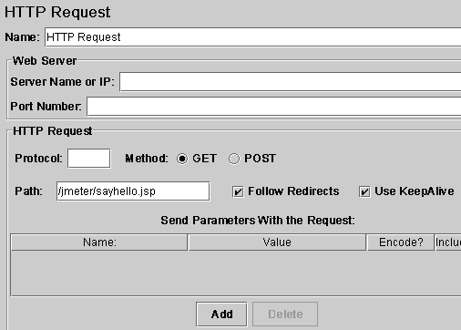
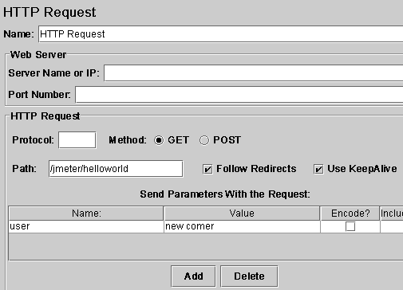
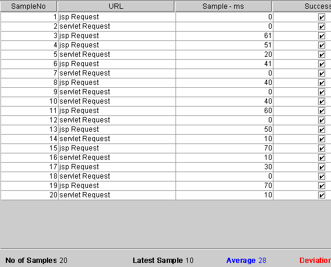

# 使用 JMeter 进行性能测试

> 原文：[`developer.ibm.com/zh/articles/l-jmeter/`](https://developer.ibm.com/zh/articles/l-jmeter/)

JMeter 是 Apache 组织的开放源代码项目，它是功能和性能测试的工具，100%的用 java 实现，最新的版本是 1.9.1，大家可以到 [`jakarta.apache.org/jmeter/index.html`](http://jakarta.apache.org/jmeter/index.html) 下载源代码和查看相关文档。

## JMeter 作用领域

JMeter 可以用于测试静态或者动态资源的性能（文件、Servlets、Perl 脚本、java 对象、数据库和查询、ftp 服务器或者其他的资源）。JMeter 用于模拟在服务器、网络或者其他对象上附加高负载以测试他们提供服务的受压能力，或者分析他们提供的服务在不同负载条件下的总性能情况。你可以用 JMeter 提供的图形化界面分析性能指标或者在高负载情况下测试服务器/脚本/对象的行为。

## 使用 JMeter 测试 Web 应用

接下来的章节里，作者将详细的演示如何使用 JMeter 来测试 Web 应用的完整过程。

### 测试环境

作者使用了 Tomcat 作为 Web 服务器进行测试，被测试的内容是一个 jsp 文件和一个 servlet，jsp 文件调用 JavaBean、打印相关信息，servlet 接受用户参数、调用 javabean、输出相关信息。详细的内容请参考作者提供的 JMeter.war 的内容。

### 安装启动 JMeter

大家可以到通过 `http://apache.linuxforum.net/dist/jakarta/jmeter/binaries/jakarta-jmeter-1.9.1.zip` 下载 JMeter 的 release 版本，然后将下载的.zip 文件解压缩到 C:/JMeter（后面的文章中将使用%JMeter%来引用这个目录）目录下。

现在，请使用%JMeter%/bin 下面的 jmeter.bat 批处理文件来启动 JMeter 的可视化界面，下面的工作都将在这个可视化界面界面上进行操作。下面的图片是 JMeter 的可视化界面的屏幕截图。

##### 图 1\. JMeter 打开时的屏幕截图

### 建立测试计划（Test Plan）

测试计划描述了执行测试过程中 JMeter 的执行过程和步骤，一个完整的测试计划包括一个或者多个线程组(Thread Groups)、逻辑控制（Logic Controller）、实例产生控制器（Sample Generating Controllers）、侦听器(Listener)、定时器（Timer）、比较（Assertions）、配置元素（Config Elements）。打开 JMeter 时，它已经建立一个默认的测试计划,一个 JMeter 应用的实例只能建立或者打开一个测试计划。

现在我们开始填充一个测试计划的内容，这个测试计划向一个 jsp 文件和一个 servlet 发出请求，我们需要 JMeter 模拟五个请求者（也就是五个线程），每个请求者连续请求两次，下面的章节介绍了详细的操作步骤。

### 增加负载信息设置

这一步，我们将向测试计划中增加相关负载设置,是 Jmeter 知道我们需要模拟五个请求者，每个请求者在测试过程中连续请求两次。详细步骤如下：

1.  选中可视化界面中左边树的 Test Plan 节点，单击右键，选择 Add’Thread Group，界面右边将会出现他的设置信息框。
2.  Thread Group 有三个和负载信息相关的参数：
    *   Number of Threads： 设置发送请求的用户数目
    *   Ramp-up period： 每个请求发生的总时间间隔，单位是秒。比如你的请求数目是 5，而这个参数是 10，那么每个请求之间的间隔就是 10／5，也就是 2 秒
    *   Loop Count： 请求发生的重复次数，如果选择后面的 forever（默认），那么 请求将一直继续，如果不选择 forever，而在输入框中输入数字，那么请求将重复 指定的次数，如果输入 0，那么请求将执行一次。

根据我们演示例子的设计，我们应该将 Number of Threads 设置为 5，Ramp-up period 设置为 0（也就是同时并发请求），不选中 forever，在 Loop Count 后面的输入框中输入 2，设置后的屏幕截图如下：

##### 图 2\. 设置好参数的 Thread Group

### 增加默认 Http 属性（可选）

实际的测试工作往往是针对同一个服务器上 Web 应用展开的,所以 Jmeter 提供了这样一种设置, 在默认 Http 属性设置需要被测试服务器的相关属性，以后的 http 请求设置中就可以忽略这些相同参数的设置,减少设置参数录入的时间。

我们这里将采用这种属性。你可以通过下面的步骤来设置默认 http 属性：

1.  选中可视化界面中左边树的 Test Plan 节点，单击右键，选择 Add’config element’http request defaults，界面右边将会出现他的设置信息框。
2.  默认 http 属性的主要参数说明如下：
    *   protocal：发送测试请求时使用的协议
    *   server name or ip：被测试服务器的 ip 地址或者名字
    *   path： 默认的起始位置。比如将 path 设置为／jmeter，那么所有的 http 请求的 url 中都将增加／jmeter 路径。
    *   port number： 服务器提供服务的端口号

我们的测试计划将针对本机的 Web 服务器上的 Web 应用进行测试，所以 protocal 应该是 http，ip 使用 localhost，因为这个 web 应用发布的 context 路径是／jmeter，所以这里的 path 设置为／jmeter，因为使用 Tomcat 服务器，所以 port number 是 8080。设置后的屏幕截图如下：

##### 图 3\. 测试计划中使用的默认 Http 参数

### 增加 Http 请求

现在我们需要增加 http 请求了，他也是我们测试的内容主体部分。你可以通过下面的步骤来增加性的 http 请求：

1.  选中可视化界面中左边树的 Thread Group 节点，单击右键，选择 Add’sampler’http request，界面右边将会出现他的设置信息框。
2.  他的参数和 2.5 中介绍的 http 属性差不多，增加的属性中有发送 http 时方法的选择，你可以选择为 get 或者 post。

我们现在增加两个 http 请求，因为我们设置了默认的 http 属性，所以和默认 http 属性中相同的属性不再重复设置。设置后的屏幕截图如下：

##### 图 4\. 设置好的 jsp 测试请求

##### 图 5\. 设置好的 Servlet 测试请求（带参数）

### 增加 Listener

增加 listener 是为了记录测试信息并且可以使用 Jmeter 提供的可视化界面查看测试结果，里面有好几种结果分析方式可供选择，你可以根据自己习惯的分析方式选择不同的结果显示方式，我们这里使用表格的形式来查看和分析测试结果。你可以通过下面的步骤来增加 listener：

1.  选中可视化界面中左边树的 Test Plan 节点，单击右键，选择 Add’listener’view result in table，界面右边将会出现他的设置信息和结果显示框。
2.  你可以设置界面上面的 filename 属性设置将测试结果保存到某个文件中 界面下面将使用表格显示测试结果，表格的第一列 sampleno 显示请求执行的顺序和编号，url 显示请求发送的目标，sample－ms 列显示这个请求完成耗费的时间，最后的 success 列显示改请求是否成功执行。

界面的最下面你还可以看到一些统计信息，最关心的应该是 Average 吧，也就是相应的平均时间。

### 开始执行测试计划

现在你可以通过单击菜单栏 run -> Start 开始执行测试计划了。下面这两个图是作者第一次、第二次执行该测试计划的结果图:

##### 图 6\. 第一次执行后的结果显示

##### 图 7\. 第二次执行的结果显示

大家可以看到第一次执行时的几个大时间值均来自于 jsp request，这可以通过下面的理由进行解释：jsp 执行前都需要被编译成.class 文件。所以第二次的结果才是正常的结果。

## 结束语

JMeter 用于进行供能或者性能测试，通过使用 JMeter 提供的供能，我们可以可视化的制定测试计划：包括规定使用什么样的负载、测试什么内容、传入的参数，同时，他提供了好多种图形化的测试结果显示方式，使我们能够简单的开始测试工作和分析测试结果。

本文中，作者根据自己的使用经验，详细演示了如何使用 JMeter 来进行 Web 测试的全部过程，简单的介绍了 JMeter 提供测试结果的图形化显示界面中相关参数的含义。希望能够帮助大家学会使用 JMeter 的基本知识，同时，大家可以参考这个过程和 JMeter 的帮助文档来实现对 java 对象、数据库等的测试过程。

## 工具下载：

1.  tomcat [`jakarta.apache.org/tomcat/index.html`](https://jakarta.apache.org/tomcat/index.html)
2.  JMeter [`jakarta.apache.org/jmeter/index.html`](https://jakarta.apache.org/jmeter/index.html)