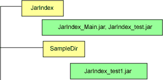

# JAR 文件揭密

> 原文：[`developer.ibm.com/zh/articles/j-jar/`](https://developer.ibm.com/zh/articles/j-jar/)

## JAR 文件是什么？

JAR 文件格式以流行的 ZIP 文件格式为基础，用于将许多个文件聚集为一个文件。与 ZIP 文件不同的是，JAR 文件不仅用于压缩和发布，而且还用于部署和封装库、组件和插件程序，并可被像编译器和 JVM 这样的工具直接使用。在 JAR 中包含特殊的文件，如 manifests 和部署描述符，用来指示工具如何处理特定的 JAR。

一个 JAR 文件可以用于：

*   用于发布和使用类库
*   作为应用程序和扩展的构建单元
*   作为组件、applet 或者插件程序的部署单位
*   用于打包与组件相关联的辅助资源

JAR 文件格式提供了许多优势和功能，其中很多是传统的压缩格式如 ZIP 或者 TAR 所没有提供的。它们包括：

*   **安全性。** 可以对 JAR 文件内容加上数字化签名。这样，能够识别签名的工具就可以有选择地为您授予软件安全特权，这是其他文件做不到的，它还可以检测代码是否被篡改过。
*   **减少下载时间。** 如果一个 applet 捆绑到一个 JAR 文件中，那么浏览器就可以在一个 HTTP 事务中下载这个 applet 的类文件和相关的资源，而不是对每一个文件打开一个新连接。
*   **压缩。** JAR 格式允许您压缩文件以提高存储效率。
*   **传输平台扩展。** Java 扩展框架 (Java Extensions Framework) 提供了向 Java 核心平台添加功能的方法，这些扩展是用 JAR 文件打包的 (Java 3D 和 JavaMail 就是由 Sun 开发的扩展例子 )。
*   **包密封。** 存储在 JAR 文件中的包可以选择进行 *密封* ，以增强版本一致性和安全性。密封一个包意味着包中的所有类都必须在同一 JAR 文件中找到。
*   **包版本控制。** 一个 JAR 文件可以包含有关它所包含的文件的数据，如厂商和版本信息。
*   **可移植性。** 处理 JAR 文件的机制是 Java 平台核心 API 的标准部分。

### 压缩的和未压缩的 JAR

`jar` 工具 ( 有关细节参阅 jar 工具) 在默认情况下压缩文件。未压缩的 JAR 文件一般可以比压缩过的 JAR 文件更快地装载，因为在装载过程中要解压缩文件，但是未压缩的文件在网络上的下载时间可能更长。

### META-INF 目录

大多数 JAR 文件包含一个 META-INF 目录，它用于存储包和扩展的配置数据，如安全性和版本信息。Java 2 平台识别并解释 META-INF 目录中的下述文件和目录，以便配置应用程序、扩展和类装载器：

*   **MANIFEST.MF。** 这个 *manifest 文件* 定义了与扩展和包相关的数据。
*   **INDEX.LIST。** 这个文件由 `jar` 工具的新选项 `-i` 生成，它包含在应用程序或者扩展中定义的包的位置信息。它是 JarIndex 实现的一部分，并由类装载器用于加速类装载过程。
*   ***xxx*.SF。** 这是 JAR 文件的签名文件。占位符 *xxx* 标识了签名者。
*   ***xxx*.DSA。** 与签名文件相关联的签名程序块文件，它存储了用于签名 JAR 文件的公共签名。

### jar 工具

为了用 JAR 文件执行基本的任务，要使用作为 Java Development Kit 的一部分提供的 Java Archive Tool (`jar` 工具 )。用 `jar` 命令调用 `jar` 工具。表 1 显示了一些常见的应用：

##### 表 1\. 常见的 `jar` 工具用法

| 功能 | 命令 |
| --- | --- |
| 用一个单独的文件创建一个 JAR 文件 | jar cf jar-file input-file… |
| 用一个目录创建一个 JAR 文件 | jar cf jar-file dir-name |
| 创建一个未压缩的 JAR 文件 | jar cf0 jar-file dir-name |
| 更新一个 JAR 文件 | jar uf jar-file input-file… |
| 查看一个 JAR 文件的内容 | jar tf jar-file |
| 提取一个 JAR 文件的内容 | jar xf jar-file |
| 从一个 JAR 文件中提取特定的文件 | jar xf jar-file archived-file… |
| 运行一个打包为可执行 JAR 文件的应用程序 | java -jar app.jar |

## 可执行的 JAR

一个 *可执行的 jar* 文件是一个自包含的 Java 应用程序，它存储在特别配置的 JAR 文件中，可以由 JVM 直接执行它而无需事先提取文件或者设置类路径。要运行存储在非可执行的 JAR 中的应用程序，必须将它加入到您的类路径中，并用名字调用应用程序的主类。但是使用可执行的 JAR 文件，我们可以不用提取它或者知道主要入口点就可以运行一个应用程序。可执行 JAR 有助于方便发布和执行 Java 应用程序。

### 创建可执行 JAR

创建一个可执行 JAR 很容易。首先将所有应用程序代码放到一个目录中。假设应用程序中的主类是 `com.mycompany.myapp.Sample` 。您要创建一个包含应用程序代码的 JAR 文件并标识出主类。为此，在某个位置 ( 不是在应用程序目录中 ) 创建一个名为 `manifest` 的文件，并在其中加入以下一行：

```
Main-Class: com.mycompany.myapp.Sample 
```

然后，像这样创建 JAR 文件：

```
jar cmf manifest ExecutableJar.jar application-dir 
```

所要做的就是这些了 — 现在可以用 `java -jar` 执行这个 JAR 文件 ExecutableJar.jar。

一个可执行的 JAR 必须通过 menifest 文件的头引用它所需要的所有其他从属 JAR。如果使用了 `-jar` 选项，那么环境变量 CLASSPATH 和在命令行中指定的所有类路径都被 JVM 所忽略。

### 启动可执行 JAR

既然我们已经将自己的应用程序打包到了一个名为 ExecutableJar.jar 的可执行 JAR 中了，那么我们就可以用下面的命令直接从文件启动这个应用程序：

```
java -jar ExecutableJar.jar 
```

## 包密封

密封 JAR 文件中的一个包意味着在这个包中定义的所有类都必须在同一个 JAR 文件中找到。这使包的作者可以增强打包类之间的版本一致性。密封还提供了防止代码篡改的手段。

要密封包，需要在 JAR 的 manifest 文件中为包添加一个 `Name` 头，然后加上值为”true”的 `Sealed` 头。与可执行的 JAR 一样，可以在创建 JAR 时，通过指定一个具有适当头元素的 manifest 文件密封一个 JAR，如下所示：

```
Name: com/samplePackage/
 Sealed: true 
```

`Name` 头标识出包的相对路径名。它以一个”/”结束以与文件名区别。在 `Name` 头后面第一个空行之前的所有头都作用于在 `Name` 头中指定的文件或者包。在上述例子中，因为 `Sealed` 头出现在 `Name` 头后并且中间没有空行，所以 `Sealed` 头将被解释为只应用到包 `com/samplePackage` 上。

如果试图从密封包所在的 JAR 文件以外的其他地方装载密封包中的一个类，那么 JVM 将抛出一个 `SecurityException` 。

扩展打包

扩展为 Java 平台增加了功能，在 JAR 文件格式中已经加入了扩展机制。扩展机制使得 JAR 文件可以通过 manifest 文件中的 `Class-Path` 头指定所需要的其他 JAR 文件。

假设 extension1.jar 和 extension2.jar 是同一个目录中的两个 JAR 文件，extension1.jar 的 manifest 文件包含以下头：

```
Class-Path: extension2.jar 
```

这个头表明 extension2.jar 中的类是 extension1.jar 中的类的 *扩展类* 。extension1.jar 中的类可以调用 extension2.jar 中的类，并且不要求 extension2.jar 处在类路径中。

在装载使用扩展机制的 JAR 时，JVM 会高效而自动地将在 `Class-Path` 头中引用的 JAR 添加到类路径中。不过，扩展 JAR 路径被解释为相对路径，所以一般来说，扩展 JAR 必须存储在引用它的 JAR 所在的同一目录中。

例如，假设类 `ExtensionClient` 引用了类 `ExtensionDemo`, 它捆绑在一个名为 ExtensionClient.jar 的 JAR 文件中，而类 `ExtensionDemo` 则捆绑在 ExtensionDemo.jar 中。为了使 ExtensionDemo.jar 可以成为扩展，必须将 ExtensionDemo.jar 列在 ExtensionClient.jar 的 manifest 的 `Class-Path` 头中，如下所示：

```
Manifest-Version: 1.0
 Class-Path: ExtensionDemo.jar 
```

在这个 manifest 中 `Class-Path` 头的值是没有指定路径的 ExtensionDemo.jar，表明 ExtensionDemo.jar 与 ExtensionClient JAR 文件处在同一目录中。

## JAR 文件中的安全性

JAR 文件可以用 `jarsigner` 工具或者直接通过 `java.security` API 签名。一个签名的 JAR 文件与原来的 JAR 文件完全相同，只是更新了它的 manifest，并在 META-INF 目录中增加了两个文件，一个签名文件和一个签名块文件。

JAR 文件是用一个存储在 *Keystore* 数据库中的证书签名的。存储在 keystore 中的证书有密码保护，必须向 `jarsigner` 工具提供这个密码才能对 JAR 文件签名。

##### 图 1\. Keystore 数据库


JAR 的每一位签名者都由在 JAR 文件的 META-INF 目录中的一个具有 .SF 扩展名的签名文件表示。这个文件的格式类似于 manifest 文件 — 一组 RFC-822 头。如下所示，它的组成包括一个主要部分，它包括了由签名者提供的信息、但是不特别针对任何特定的 JAR 文件项，还有一系列的单独的项，这些项也必须包含在 menifest 文件中。在验证一个签名的 JAR 时，将签名文件的摘要值与对 JAR 文件中的相应项计算的摘要值进行比较。

##### 清单 1\. 签名 JAR 中的 Manifest 和 signature 文件

```
Contents of signature file META-INF/MANIFEST.MF
 Manifest-Version: 1.0
 Created-By: 1.3.0 (Sun Microsystems Inc.)
 Name: Sample.java
 SHA1-Digest: 3+DdYW8INICtyG8ZarHlFxX0W6g=
 Name: Sample.class
 SHA1-Digest: YJ5yQHBZBJ3SsTNcHJFqUkfWEmI=
 Contents of signature file META-INF/JAMES.SF
 Signature-Version: 1.0
 SHA1-Digest-Manifest: HBstZOJBuuTJ6QMIdB90T8sjaOM=
 Created-By: 1.3.0 (Sun Microsystems Inc.)
 Name: Sample.java
 SHA1-Digest: qipMDrkurQcKwnyIlI3Jtrnia8Q=
 Name: Sample.class
 SHA1-Digest: pT2DYby8QXPcCzv2NwpLxd8p4G4= 
```

### 数字签名

一个数字签名是 .SF 签名文件的已签名版本。数字签名文件是二进制文件，并且与 .SF 文件有相同的文件名，但是扩展名不同。根据数字签名的类型 — RSA、DSA 或者 PGP — 以及用于签名 JAR 的证书类型而有不同的扩展名。

### Keystore

要签名一个 JAR 文件，必须首先有一个私钥。私钥及其相关的公钥证书存储在名为 `keystores` 的、有密码保护的数据库中。JDK 包含创建和修改 keystores 的工具。keystore 中的每一个密钥都可以用一个别名标识，它通常是拥有这个密钥的签名者的名字。

所有 keystore 项 ( 密钥和信任的证书项 ) 都是用唯一别名访问的。别名是在用 `keytool -genkey` 命令生成密钥对 ( 公钥和私钥 ) 并在 keystore 中添加项时指定的。之后的 `keytool` 命令必须使用同样的别名引用这一项。

例如，要用别名”james”生成一个新的公钥 / 私钥对并将公钥包装到自签名的证书中，要使用下述命令：

```
keytool -genkey -alias james -keypass jamespass
        -validity 80 -keystore jamesKeyStore
        -storepass jamesKeyStorePass 
```

这个命令序列指定了一个初始密码”jamespass”，后续的命令在访问 keystore “jamesKeyStore”中与别名”james”相关联的私钥时，就需要这个密码。如果 keystore”jamesKeyStore”不存在，则 `keytool` 会自动创建它。

### jarsigner 工具

`jarsigner` 工具使用 keystore 生成或者验证 JAR 文件的数字签名。

假设像上述例子那样创建了 keystore “jamesKeyStore”，并且它包含一个别名为”james”的密钥，可以用下面的命令签名一个 JAR 文件：

```
jarsigner -keystore jamesKeyStore -storepass jamesKeyStorePass
          -keypass jamespass -signedjar SSample.jar Sample.jar james 
```

这个命令用密码”jamesKeyStorePass”从名为”jamesKeyStore”的 keystore 中提出别名为”james”、密码为”jamespass”的密钥，并对 Sample.jar 文件签名、创建一个签名的 JAR — SSample.jar。

`jarsigner` 工具还可以验证一个签名的 JAR 文件，这种操作比签名 JAR 文件要简单得多，只需执行以下命令：

```
jarsigner -verify SSample.jar 
```

如果签名的 JAR 文件没有被篡改过，那么 `jarsigner` 工具就会告诉您 JAR 通过验证了。否则，它会抛出一个 `SecurityException` ， 表明哪些文件没有通过验证。

还可以用 `java.util.jar` 和 `java.security` API 以编程方式签名 JAR( 有关细节参阅 参考资料)。也可以使用像 Netscape Object Signing Tool 这样的工具。

## JAR 索引

如果一个应用程序或者 applet 捆绑到多个 JAR 文件中，那么类装载器就使用一个简单的线性搜索算法搜索类路径中的每一个元素，这使类装载器可能要下载并打开许多个 JAR 文件，直到找到所要的类或者资源。如果类装载器试图寻找一个不存在的资源，那么在应用程序或者 applet 中的所有 JAR 文件都会下载。对于大型的网络应用程序和 applet，这会导致启动缓慢、响应迟缓并浪费带宽。

从 JDK 1.3 以后，JAR 文件格式开始支持索引以优化网络应用程序中类的搜索过程，特别是 applet。JarIndex 机制收集在 applet 或者应用程序中定义的所有 JAR 文件的内容，并将这些信息存储到第一个 JAR 文件中的索引文件中。下载了第一个 JAR 文件后，applet 类装载器将使用收集的内容信息高效地装载 JAR 文件。这个目录信息存储在根 JAR 文件的 META-INF 目录中的一个名为 INDEX.LIST 的简单文本文件中。

创建一个 JarIndex

可以通过在 `jar` 命令中指定 `-i` 选项创建一个 JarIndex。假设我们的目录结构如下图所示：

##### 图 2\. JarIndex



您将使用下述命令为 JarIndex_Main.jar、JarIndex_test.jar 和 JarIndex_test1.jar 创建一个索引文件：

```
jar -i JarIndex_Main.jar JarIndex_test.jar SampleDir/JarIndex_test1.jar 
```

INDEX.LIST 文件的格式很简单，包含每个已索引的 JAR 文件中包含的包或者类的名字，如清单 2 所示：

##### 清单 2\. JarIndex INDEX.LIST 文件示例

```
JarIndex-Version: 1.0
 JarIndex_Main.jar
 sp
 JarIndex_test.jar
 Sample
 SampleDir/JarIndex_test1.jar
 org
 org/apache
 org/apache/xerces
 org/apache/xerces/framework
 org/apache/xerces/framework/xml4j 
```

## 结束语

JAR 格式远远超出了一种压缩格式，它有许多可以改进效率、安全性和组织 Java 应用程序的功能。因为这些功能已经建立在核心平台 — 包括编译器和类装载器 — 中了，所以开发人员可以利用 JAR 文件格式的能力简化和改进开发和部署过程。

本文翻译自：[JAR files revealed](https://www.ibm.com/developerworks/library/j-jar/index.html)（2003-10-09）