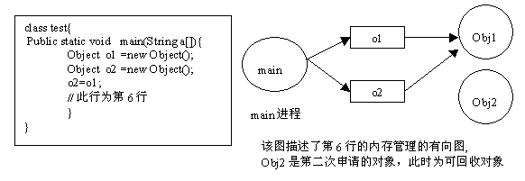
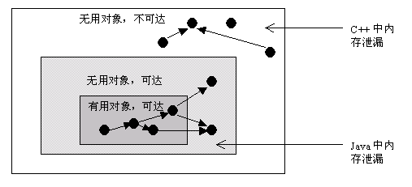

# Java 的内存泄漏

> 原文：[`developer.ibm.com/zh/articles/l-javamemoryleak/`](https://developer.ibm.com/zh/articles/l-javamemoryleak/)

## 问题的提出

Java 的一个重要优点就是通过垃圾收集器(Garbage Collection，GC)自动管理内存的回收，程序员不需要通过调用函数来释放内存。因此，很多程序员认为 Java 不存在内存泄漏问题，或者认为即使有内存泄漏也不是程序的责任，而是 GC 或 JVM 的问题。其实，这种想法是不正确的，因为 Java 也存在内存泄露，但它的表现与 C++不同。

随着越来越多的服务器程序采用 Java 技术，例如 JSP，Servlet， EJB 等，服务器程序往往长期运行。另外，在很多嵌入式系统中，内存的总量非常有限。内存泄露问题也就变得十分关键，即使每次运行少量泄漏，长期运行之后，系统也是面临崩溃的危险。

## Java 是如何管理内存

为了判断 Java 中是否有内存泄露，我们首先必须了解 Java 是如何管理内存的。Java 的内存管理就是对象的分配和释放问题。在 Java 中，程序员需要通过关键字 new 为每个对象申请内存空间 (基本类型除外)，所有的对象都在堆 (Heap)中分配空间。另外，对象的释放是由 GC 决定和执行的。在 Java 中，内存的分配是由程序完成的，而内存的释放是有 GC 完成的，这种收支两条线的方法确实简化了程序员的工作。但同时，它也加重了 JVM 的工作。这也是 Java 程序运行速度较慢的原因之一。因为，GC 为了能够正确释放对象，GC 必须监控每一个对象的运行状态，包括对象的申请、引用、被引用、赋值等，GC 都需要进行监控。

监视对象状态是为了更加准确地、及时地释放对象，而释放对象的根本原则就是该对象不再被引用。

为了更好理解 GC 的工作原理，我们可以将对象考虑为有向图的顶点，将引用关系考虑为图的有向边，有向边从引用者指向被引对象。另外，每个线程对象可以作为一个图的起始顶点，例如大多程序从 main 进程开始执行，那么该图就是以 main 进程顶点开始的一棵根树。在这个有向图中，根顶点可达的对象都是有效对象，GC 将不回收这些对象。如果某个对象 (连通子图)与这个根顶点不可达(注意，该图为有向图)，那么我们认为这个(这些)对象不再被引用，可以被 GC 回收。

以下，我们举一个例子说明如何用有向图表示内存管理。对于程序的每一个时刻，我们都有一个有向图表示 JVM 的内存分配情况。以下右图，就是左边程序运行到第 6 行的示意图。



Java 使用有向图的方式进行内存管理，可以消除引用循环的问题，例如有三个对象，相互引用，只要它们和根进程不可达的，那么 GC 也是可以回收它们的。这种方式的优点是管理内存的精度很高，但是效率较低。另外一种常用的内存管理技术是使用计数器，例如 COM 模型采用计数器方式管理构件，它与有向图相比，精度行低(很难处理循环引用的问题)，但执行效率很高。

## 什么是 Java 中的内存泄露

下面，我们就可以描述什么是内存泄漏。在 Java 中，内存泄漏就是存在一些被分配的对象，这些对象有下面两个特点，首先，这些对象是可达的，即在有向图中，存在通路可以与其相连；其次，这些对象是无用的，即程序以后不会再使用这些对象。如果对象满足这两个条件，这些对象就可以判定为 Java 中的内存泄漏，这些对象不会被 GC 所回收，然而它却占用内存。

在 C++中，内存泄漏的范围更大一些。有些对象被分配了内存空间，然后却不可达，由于 C++中没有 GC，这些内存将永远收不回来。在 Java 中，这些不可达的对象都由 GC 负责回收，因此程序员不需要考虑这部分的内存泄露。

通过分析，我们得知，对于 C++，程序员需要自己管理边和顶点，而对于 Java 程序员只需要管理边就可以了(不需要管理顶点的释放)。通过这种方式，Java 提高了编程的效率。



因此，通过以上分析，我们知道在 Java 中也有内存泄漏，但范围比 C++要小一些。因为 Java 从语言上保证，任何对象都是可达的，所有的不可达对象都由 GC 管理。

对于程序员来说，GC 基本是透明的，不可见的。虽然，我们只有几个函数可以访问 GC，例如运行 GC 的函数 System.gc()，但是根据 Java 语言规范定义， 该函数不保证 JVM 的垃圾收集器一定会执行。因为，不同的 JVM 实现者可能使用不同的算法管理 GC。通常，GC 的线程的优先级别较低。JVM 调用 GC 的策略也有很多种，有的是内存使用到达一定程度时，GC 才开始工作，也有定时执行的，有的是平缓执行 GC，有的是中断式执行 GC。但通常来说，我们不需要关心这些。除非在一些特定的场合，GC 的执行影响应用程序的性能，例如对于基于 Web 的实时系统，如网络游戏等，用户不希望 GC 突然中断应用程序执行而进行垃圾回收，那么我们需要调整 GC 的参数，让 GC 能够通过平缓的方式释放内存，例如将垃圾回收分解为一系列的小步骤执行，Sun 提供的 HotSpot JVM 就支持这一特性。

下面给出了一个简单的内存泄露的例子。在这个例子中，我们循环申请 Object 对象，并将所申请的对象放入一个 Vector 中，如果我们仅仅释放引用本身，那么 Vector 仍然引用该对象，所以这个对象对 GC 来说是不可回收的。因此，如果对象加入到 Vector 后，还必须从 Vector 中删除，最简单的方法就是将 Vector 对象设置为 null。

```
Vector v=new Vector(10);
for (int i=1;i<100; i++)
{
    Object o=new Object();
    v.add(o);
    o=null;
} 
```

//此时，所有的 Object 对象都没有被释放，因为变量 v 引用这些对象。

## 如何检测内存泄漏

最后一个重要的问题，就是如何检测 Java 的内存泄漏。目前，我们通常使用一些工具来检查 Java 程序的内存泄漏问题。市场上已有几种专业检查 Java 内存泄漏的工具，它们的基本工作原理大同小异，都是通过监测 Java 程序运行时，所有对象的申请、释放等动作，将内存管理的所有信息进行统计、分析、可视化。开发人员将根据这些信息判断程序是否有内存泄漏问题。这些工具包括 Optimizeit Profiler，JProbe Profiler，JinSight , Rational 公司的 Purify 等。

下面，我们将简单介绍 Optimizeit 的基本功能和工作原理。

Optimizeit Profiler 版本 4.11 支持 Application，Applet，Servlet 和 Romote Application 四类应用，并且可以支持大多数类型的 JVM，包括 SUN JDK 系列，IBM 的 JDK 系列，和 Jbuilder 的 JVM 等。并且，该软件是由 Java 编写，因此它支持多种操作系统。Optimizeit 系列还包括 Thread Debugger 和 Code Coverage 两个工具，分别用于监测运行时的线程状态和代码覆盖面。

当设置好所有的参数了，我们就可以在 OptimizeIt 环境下运行被测程序，在程序运行过程中，Optimizeit 可以监视内存的使用曲线(如下图)，包括 JVM 申请的堆(heap)的大小，和实际使用的内存大小。另外，在运行过程中，我们可以随时暂停程序的运行，甚至强行调用 GC，让 GC 进行内存回收。通过内存使用曲线，我们可以整体了解程序使用内存的情况。这种监测对于长期运行的应用程序非常有必要，也很容易发现内存泄露。


在运行过程中，我们还可以从不同视角观查内存的使用情况，Optimizeit 提供了四种方式：

*   堆视角。 这是一个全面的视角，我们可以了解堆中的所有的对象信息(数量和种类)，并进行统计、排序，过滤。了解相关对象的变化情况。
*   方法视角。通过方法视角，我们可以得知每一种类的对象，都分配在哪些方法中，以及它们的数量。
*   对象视角。给定一个对象，通过对象视角，我们可以显示它的所有出引用和入引用对象，我们可以了解这个对象的所有引用关系。
*   引用图。 给定一个根，通过引用图，我们可以显示从该顶点出发的所有出引用。

在运行过程中，我们可以随时观察内存的使用情况，通过这种方式，我们可以很快找到那些长期不被释放，并且不再使用的对象。我们通过检查这些对象的生存周期，确认其是否为内存泄露。在实践当中，寻找内存泄露是一件非常麻烦的事情，它需要程序员对整个程序的代码比较清楚，并且需要丰富的调试经验，但是这个过程对于很多关键的 Java 程序都是十分重要的。

综上所述，Java 也存在内存泄露问题，其原因主要是一些对象虽然不再被使用，但它们仍然被引用。为了解决这些问题，我们可以通过软件工具来检查内存泄露，检查的主要原理就是暴露出所有堆中的对象，让程序员寻找那些无用但仍被引用的对象。