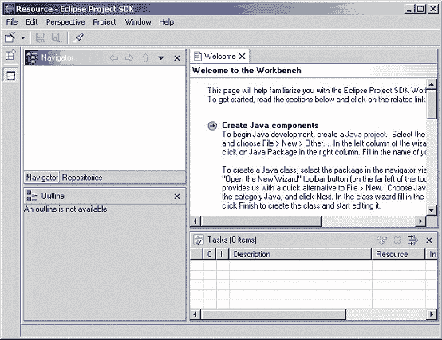
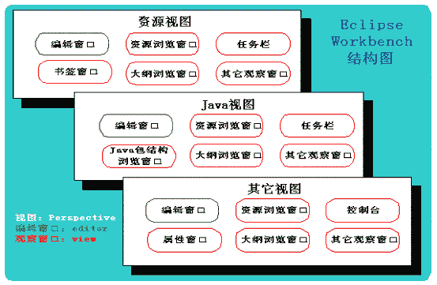
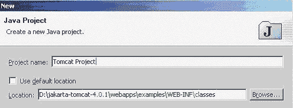
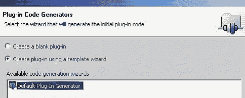

# Eclipse 的使用简介及插件开发

> 原文：[`developer.ibm.com/zh/articles/l-eclipse/`](https://developer.ibm.com/zh/articles/l-eclipse/)

Eclipse 是替代 IBM Visual Age for Java（以下简称 IVJ）的下一代 IDE 开发环境，但它未来的目标不仅仅是成为专门开发 Java 程序的 IDE 环境，根据 Eclipse 的体系结构，通过开发插件，它能扩展到任何语言的开发，甚至能成为图片绘制的工具。目前，Eclipse 已经开始提供 C 语言开发的功能插件。更难能可贵的是，Eclipse 是一个开放源代码的项目，任何人都可以下载 Eclipse 的源代码，并且在此基础上开发自己的功能插件。也就是说未来只要有人需要，就会有建立在 Eclipse 之上的 COBOL，Perl，Python 等语言的开发插件出现。同时可以通过开发新的插件扩展现有插件的功能，比如在现有的 Java 开发环境中加入 Tomcat 服务器插件。可以无限扩展，而且有着统一的外观，操作和系统资源管理，这也正是 Eclipse 的潜力所在。

虽然目前 Eclipse 项目还没有最后完成，但从已有的版本中已经能领略到 Eclipse 设计主导思想和主要功能特点。现在就了解 Eclipse 不但能使广大程序员对这款业界期望很高的 IDE 能一睹为快，更为重要的是如果能参加到 Eclipse 项目的开发中或是阅读它的开放源代码，这对广大程序员来说无疑是一个千载难逢的提高编程水平的好机会。Eclipse 计划提供多个平台的版本，象 Windows，Linux，Solaris，HP-UX 和 AIX，以下只介绍 Windows 版本。本文第一部分先介绍 Eclipse 的基本使用方法。第二部分介绍如何进行 Eclipse 的插件开发。

## Eclipse 简介

Eclipse 是开放源代码的项目，你可以到 [www.eclipse.org](http://www.eclipse.org) 去免费下载 Eclipse 的最新版本，一般 Eclipse 提供几个下载版本：Release，Stable Build，Integration Build 和 Nightly Build，建议下载 Release 或 Stable 版本，笔者用的是 Build20020125（Stable 版本）。Eclipse 本身是用 Java 语言编写，但下载的压缩包中并不包含 Java 运行环境，需要用户自己另行安装 JRE，并且要在操作系统的环境变量中指明 JRE 中 bin 的路径。安装 Eclipse 的步骤非常简单：只需将下载的压缩包按原路径直接解压既可。需注意如果有了更新的版本，要先删除老的版本重新安装，不能直接解压到原来的路径覆盖老版本。在解压缩之后可以到相应的安装路径去找 Eclipse.exe 运行。如果下载的是 Release 或 Stable 版本，并且 JRE 环境安装正确无误，一般来说不会有什么问题，在闪现一个很酷的月蚀图片后，Eclipse 会显示它的缺省界面：



图一

乍一看起来，Eclipse 的界面有点象 JBilder，但实际操作进程中会发现它更象 IVJ，毕竟开发 Eclipse 的主导用量是开发 IVJ 的原班人马（可参考 www.oti.com）。另外还值得一提的是 Eclipse 项目的参预者除了 IBM 以外，还有象 Borland，Rational Software，RedHat，Merant 等一大批业界的姣姣者，这也为 Eclipse 的未来奠定了良好的基础。

下面将分别对 Eclipse 的各种特性作简单介绍，包括：文件存放，开发环境，编译与运行，版本管理，使用插件。

### 文件存放

大多 IVJ 的初学者都对找不到 Java 源代码感到非常不适应，因为 IVJ 把所有的源代码都存储到一个 reponsitory 库文件中，想要得到文本格式的源代码必须用 Export 功能从 reponsitory 中导出源代码。使用了 reponsitory 的 IVJ 对源代码的管理功能几乎达到极致，正是这一点使得许多程序员对 IVJ 钟爱有加。而 Eclipse 将源代码以文本方式保存，却实现了 IVJ 对源代码管理的几乎全部功能，并且还增加了一些新的功能，能达到这一点，不能不惊叹于 Eclipse 开发者的高超技巧。

安装 Eclipse 之后，在安装路径的下一层路径中会有一个 workspace 文件夹。每当在 Eclipse 中新生成一个项目，缺省情况下都会在 workspace 中产生和项目同名的文件夹以存放该项目所用到的全部文件。你可以用 Windows 资源管理器直接访问或维护这些文件。

将已有的文件加入到一个项目中目前有三种方式：第一种是象在 IVJ 中的一样，用 IDE 的”File”菜单中的”Import”功能将文件导入到项目中。这也是推荐的方式。第二种是从 Windows 的资源管理器中直接拖动文件到项目中。第三种就是直接将文件拷贝到项目文件夹中，然后在 Eclipse 的资源浏览窗口中选择项目或文件夹并执行从本地刷新功能（Refresh from locate）。需要说明的一点是，项目文件夹可以放在计算机的任何位置，并且可以在 Eclipse 中用新建项目的方法将项目路径指定到已经存在的项目文件夹，然后在 Eclipse 中刷新即可。但要注意的是，任何项目文件夹建立或指定，目前都只能在 Eclipse 中用新建项目的方法来实现，即使是在缺省存储项目文件夹的 workspace 路径下新建立一个文件夹，在 Eclipse 环境中也是无法将它变成一个项目，也就是说，这个文件夹对 Eclipse 是不可视的。

### Eclipse 开发环境

和 IVJ 一样，Eclipse 开发环境被称为 Workbench，它主要由三个部分组成：视图（Perspective），编辑窗口（Editor）和观察窗口（View）。在下面的介绍中，希望读者能知道 Java 视图，Java 包浏览窗口，资源视图，资源浏览窗口等区别（其实最主要的也就是要区别视图和窗口），以免在进一步的阅读中产生混淆。图二是它们之间的关系结构略图：



图二

在图二中，可以看出 Workbench 包含多个视图，而每个视图又包含不同的窗口。由于每个编辑窗口有很大的共性，而且缺省情况它们都在同一区域中显示，因此我们只在每个视图中标出一个编辑窗口，以绿色表示。观察窗口则各不相同，这里以红色表示。

下面首先介绍编辑窗口。所有文件的显示和编辑都包含在编辑窗口里。缺省情况下打开的多个文件是以标签（TagTable）方式在同一个窗口中排列，可以用拖动方式将这些文件排列成各种布局。方法是拖动某一个文件的标签（tag）到编辑窗口的边框，当光标有相应的变化时再释放。

当文件被加入到项目中后，在资源浏览或 Java 包浏览窗口双击文件，Eclipse 会试图打开这个文件：其中 Eclipse 内嵌的编辑器能缺省打开一些文件，如*.java，*.txt，*.class 等等。如果是其它类型的文件，Eclipse 会调用操作系统相应的缺省编辑器打开，如 word 文档，PDF 文件等。同时 Eclipse 也可以象 IVJ 一样用指定的编辑器打开相应的文件。例如在 Eclipse 项目中双击 HTML 文件时，可能希望是用 Notepad 打开，而不是用系统缺省的 IE 浏览器打开。实现的方法是打开菜单栏中的 WorkBenchàPreferences 对话框，之后在对话框中选择 WorkBenchàFile Editors，然后添加文件类型，如*.html，再为其指定编辑器即可。

在编辑窗口，还值得注意的是，习惯了 IVJ 的程序员在编辑 Java 程序的时候，更愿意以方法为独立的编辑单位（即在编辑窗口中只显示单个的方法，而不是程序全部的源代码），这种方式也的确是非常合理的开发方式，不仅代码的显示更加简捷，还能辅助程序员编出封装性更好的类。在 Eclipse 在工具栏上提供了一个切换按钮，可以在”显示全部代码”和”只显示所选单元”（这里的单元指的是单个方法、变量、导入的包等）之间切换（可参考下面的图三）。建议没有使用过 IVJ 的程序员也尝试一下在”只显示所选单元”状态下进行代码开发。

其次要介绍的是观察窗口，它配合编辑窗口并提供了多种的相关信息和浏览方式。常用的观察窗口有资源浏览窗口（Navigator），Java 包浏览窗口(Packages)，控制台（Console），任务栏（Task）等等。

浏览窗口和 Java 浏览窗口是观察窗口核心部分。前者和 Windows 的浏览器差不多，能浏览项目文件夹中的所有文件，后者用来浏览项目中的 Java 包，包中的类，类中的变量和方法等信息。在 Java 浏览窗口中可以通过用鼠标右键的菜单中的 Open Type Hierarchy 打开层次浏览窗口（Hierarchy），这个窗口非常实用，它能非常清晰的查看类的层次结构。类中的编译出错信息可以在任务窗口中查到，同时它也可以成为名符其实的任务窗口：向其中添加新的任务描述信息，来跟踪项目的进度。控制台则主要用来显示程序的输出信息。在调试程序的时候，会有更丰富的观察窗口来帮助程序员进行调试，如变量值察看窗口，断点窗口等等。

观察窗口是任何 IDE 开发环境的核心，用好观察窗口是也就是用好 IDE 开发环境。Eclipse 提供了丰富的观察窗口，能真正用好这些窗口恐怕要得经过一段时间的磨练。

最后介绍视图。一个视图包括一个或多个编辑窗口和观察窗口。在开发环境的最左侧的快捷栏中的上部分显示的就是当前所打开的视图图标。视图是 Eclipse 的最灵活的部分，可以自定义每个视图中包含的观察窗口种类，也可以自定义一个新视图。这些功能都被包括在”Perspective” 菜单中。在 Eclipse 的 Java 开发环境中提供了几种缺省视图，如资源视图（Resource Perspective，它也是第一次启动 Eclipse 时的缺省视图），Java 视图（Java Perspective），调试视图（Debug Perspective），团队视图(Team Perspective)等等。每一种视图都对应不同种类的观察窗口。可以从菜单栏中的 PerspectiveàShow View 看到该视图对应的观察窗口。当然，每个视图的观察窗口都是可配置的，可以在菜单栏中的 PerspectiveàCustomize 进行配置。多样化的视图不但可以帮助程序员以不同角度观察代码，也可以满足不同的编程习惯。

### 编译与运行

在 IVJ 中调试功能非常强大，多种跟踪方式，断点设置，变量值察看窗口等等。这些在 Eclipse 中都也有提供。在本文下面介绍插件的时候，会结合例子更加详细的介绍如何使用配置项目环境，如何运行和调试程序。

在 Java 视图中，工具栏中有两个按钮，分别用来进行调试和运行。并且可能由于安装的插件不同 Eclipse 会存在多种运行/调试程序的方式，为了确定当前项目用那一种方式运行，需要在项目的属性选项中的设置 LauncheràRun/Debug 选项。通常我们需要用的是”Java　Applicantion”方式。在这种方式下，如果当前位置是包含 main()方法的 Java 程序，点击调试/运行按钮就会立即开始执行调试/运行功能。如果当前位置是在包或项目上，Eclipse 会搜索出当前位置所包含的所有可执行程序，然后由程序员自己选择运行那一个。

在目前的 Eclipse 的 Release 和 Stable 版本中缺省安装了插件开发环境（Plug-in Development Environment，即 PDE，它本身也是一个插件），此时系统除了”Java Applicantion” 运行方式，可能还有另外两种方式：”Run-time WorkBench”和”Run-time WorkBench with Tracing”，当用 PDE 开发插件的时候会用到这两种运行方式，在下面我们也有提到。

### 版本管理

可以把 Eclipse 的版本管理分为个人（或称为本地）和团队两种。

Eclipse 提供了强大的个人版本管理机制，每一次被保存的更改都可以得到恢复。而且可以精确到每一个方法的版本恢复。操作也十分方便，在任何一个能看到所要操作文件的观察窗口中，例如资源浏览窗口，选中该文件，点击右鼠标键，选择 Compare with 或 Replace with，如果是恢复已经被删除的方法则可以选择 Add from local history，之后相应的本地历史记录就会显示出来，按照你的需求找到相应的版本就可以了。强大的个人版本管理功能为程序员提供了更多的信心：只管编下去，任何不小心的错误都可以恢复，在 Eclipse 下开发，是有”后悔药”的！

Eclipse 缺省为版本管理工具 CVS 提供了接口，可以非常方便的连接到 CVS 服务器上。通过 CVS 版本管理，Eclipse 为团队开发提供良好的环境。要连接 CVS 服务器需要先打开团队视图（Team Perspective），然后在 Reponsitories 观察窗口中点击鼠标右键并选择新建（New），在打开的对话框中可以填入要连接的 CVS 库所需要的信息，如 CVS 服务器类型，目前 Eclipse 支持三种方式：pserver、extssh 和 ext，还要填入用户名，主机名，密码，reponsitory 地址等信息。

在 Eclipse 中使用 CVS 需要注意的是一些术语和功能的变化，CVS 中的 Branch 这里被称为 Stream，取消了 CVS 中 check out、import 和 commit 等功能，统统用鼠标右键菜单中的 Team->Synchronized with Stream 来替代。这些功能都通过图形界面完成，在每次操作中都会有当前文件和以前各个版本的比较窗口，操作非常直观，易于掌握，因此这里也就不再做进一步介绍了。

### 使用插件

使用插件可以丰富 Eclipse 的功能。下面将介绍如何应用插件来嵌入 Tomcat 服务器。这个插件并不是 Eclipse 项目组开发的，而是一家叫 sysdeo 的公司开发，非常小巧，只有 27.8K。另外，这个插件只支持 Tomat4.0 以上的版本，可以在 [www.apache.org](http://www.apache.org) 得到 Tomcat 的最新版本。

要安装插件只需将下载的 zip 文件按原路径解压到”你的 Eclipse 的安装路径\plugins”下面，然后重新启动 Eclipse。启动后在菜单栏上选择 PerspectiveàCustomize，在打开的对话框中选中 OtheràTomcat。之后马上会发现 Eclipse 有了两处变化：菜单栏中多了一个 Tomcat 选项，工具栏中多了两个按钮，上面是大家可能非常熟悉的 Tomcat 小猫，如下图三。除此之外，在菜单栏中选择：WorkbenchàPreferences，打开对话框后会发现这也多了一个 Tomcat 选项，在这里要求指定你的 Tomcat 安装根路径。之后还要检查一下在 Preferences 对话框中的 JavaàInstalled JRE 所指定的 JRE 和启动 Tomcat 的 JRE 是否为同一个 JRE，如果不是，可能会导致 Tomat 不能正常启动。如果以上检查没有问题，就可以用工具栏上的”小猫”直接起动 Tomcat 了。要注意的是，启动过程很慢，要耐心等到以下信息出现：

Starting service Tomcat-Standalone

Apache Tomcat/4.0.1

Starting service Tomcat-Apache

Apache Tomcat/4.0.1

之后就可以在外部浏览器（如 IE）中输入 [`localhost:8080`](http://localhost:8080) 来测试 Tomcat 是否正常。


图三

如果启动正常，可以进一步尝试在 Eclipse 中调试 Servlet 或 JSP 程序。下面我们将用 Tomcat 自带的 Servlet 例程 HelloWorldExample.java 来示范一下如何在 Eclipse 中调试 Sevlet 程序。

首先要在 Java 视图中新建一个 Java 项目，为了方便，可以直接将项目路径指定到 HelloWorldExmaple 程序所在路径，如图四：



图四

之后按”Next”，进入 Java Settings 对话框，选择 Libraries 标签，并用 Add External JARs 按钮来指定 Servlet.jar 包的位置。这里直接用了 Tomcat 中的 Servlet.jar 包。如图五：


图五

最后，点击”Finish”完成项目的生成。在新生成项目中的 default package 可以找到 HelloWorldExample.java，双击打开文件，并可尝试给 HelloWorldExample 加上一个断点（双击编辑窗口左侧边界）。之后在外部浏览器中输入 [`localhost:8080/examples/servlet/HelloWorldExample`](http://localhost:8080/examples/servlet/HelloWorldExample) ，再回过来看 Eclipse 发生了什么变化，是一个调试窗口呀！在 Eclipse 中进行的调试操作和绝大多数的 IDE 大同小异，如设置断点，单步跟踪，变量值察看等等，在这里也就不用再详述了。

## 开发 Eclipse 插件（Plug-ins）

Eclipse 最有魅力的地方就是它的插件体系结构。在这个体系中重要的概念是扩展点（extension points），也就是为插件提供的接口。每一个插件都是在现有的扩展点上开发，并可能还留有自己的扩展点，以便在这个插件上继续开发。

由于有了插件，Eclipse 系统的核心部分在启动的时候要完成的工作十分简单：启动平台的基础部分和查找系统的插件。在 Eclipse 中实现的绝大部分功能是由相应的插件完成的，比如 WrokBench UI 插件完成界面的外观显示，Resource Management 插件完成维护或生成项目或文件等资源管理工作（在下面的第二个例子就会用到这个插件），而 Version and Configuration Management (VCM)插件则负责完成版本控制功能，等等。虽然以上提到的每一个功能都是绝大多数 IDE 环境所必备的功能，Eclipse 却也把它们都做成了插件模式，甚至用来开发 Java 程序的开发环境（Java development tooling，JDT）也只不过是 Eclipse 系统中的一个普通插件而已。整个 Eclipse 体系结构就象一个大拼图，可以不断的向上加插件，同时，现有插件上还可以再加插件。下面的插件开发示例就是在 WorkBench UI 插件中的观察窗口扩展点上开发的。

本文第一部分介绍过 Eclipse 的开发界面其中之一就是观察窗口，它通常配合编辑窗口显示一些有用的信息，在这里我们只简单生成一个显示欢迎信息的观察窗口，假设新插件的名子叫 Welcome。

第一步，先用向导新建一个 Java 项目。我们可以在菜单栏选择 FileàNew，或用工具栏的向导按键，或是在资源窗口用鼠标右键菜单中的 New，打开向导对话框，然后用缺省方式创建项目。并在项目中建立一个 Welcome.java 文件，代码如下：

```
package com.nidapeng.eclipse.plugin;
import org.eclipse.swt.widgets.Composite;
import org.eclipse.swt.widgets.Label;
import org.eclipse.swt.SWT;
import org.eclipse.ui.part.ViewPart;
public class Welcome extends ViewPart {
    Label label;
    public Welcome() {
    }
    public void createPartControl(Composite parent) {
        label = new Label(parent, SWT.WRAP);
        label.setText("Welcome to Eclipse");
    }
    public void setFocus() {
    }
} 
```

为使这个程序能正常编译，要配置它的编译环境，即指定所需的 CLASSPATH。在 Eclipse 中可以用几种方法，常用的是两种：第一是在资源窗口或 Java 包窗口选中该项目，点击鼠标右键，在打开的菜单中选择属性（Properties），之后在属性对话框中选择 Java Build PathàLibraries，用 Add External JARs 功能添加三个包，它们都是 Eclipse 的现有插件的类包，可以在”你的 Eclipse 安装路径\plugins”下面的相应路径中找到。分别是 org.eclipse.core.runtime 插件中的 runtime.jar，org.eclipse.swt 中的 swt.jar 和 org.eclipse.ui 中的 workbench.jar。第二种指定 CLASSPATH 的方法是先将以上提到的三个包直接导入到 Eclipse 中的某下一个项目中。如果导入到和 Welcome.java 相同的项目中，则无需进一步指定 CLASSPATH，否则需要在项目的属性菜单中选择 Java Build PathàProjects，然后选中这三个包所在的项目。

在我们的项目中还要生成一个 XML 文件，它的名字必须 plugin.xml。代码如下：

```
<?xml version="1.0" encoding="UTF-8"?>
<plugin
   id="com.nidapeng.eclipse.plugin"
   name="Welcome to Eclipse"
   version="1.0"
   provider-name="Ni Dapeng">
<requires>
   <import plugin="org.eclipse.ui"/>
</requires>
<runtime>
   <library name="welcome.jar"/>
</runtime>
<extension
      point="org.eclipse.ui.views">
   <category
         name="Welcome"
         id="com.nidapeng.eclipse.plugin.category1">
  </category>
   <view
         name="Welcome to Eclipse"
         category="com.nidapeng.eclipse.plugin.category1"
         class="com.nidapeng.eclipse.plugin.Welcome"
         id="com.nidapeng.eclipse.plugin.view1">
  </view>
</extension>
</plugin> 
```

在 plugin.xml 中一共有四个主要的标签：plugin，requires，runtime，extension。其中 plugin 标签的属性提供的是我们要开发的 Welcome 插件的基本信息，除了 name，version，provider-name 等，最重要的是 id，它要求不能和现有的 Eclipse 插件 id 有冲突，因此我们用包名作为插件的 id。requires 标签中所列出的是需要的插件，这里我们要用到 Eclipse Workbench 和 SWT API，因此导入了 org.eclipse.ui 插件。runtime 标签指明的是我们开发的插件所在 JAR 包的文件名。extension 标签是插件扩展点的信息。org.eclipse.ui.views 是 Eclipse 系统提供的观察窗口扩展点，我们的例子是一个观察窗口（View），这表明我们是要在 org.eclipse.ui.views 扩展点上进一步开发。extension 中还包括 category 和 view 两个标签，在后续的启动 Welcome 插件步骤中，我们就会知道这两个标签的含义。要注意的是 category 和 view 标签的 id 的唯一性，并且在 view 的属性中声明了 Welcome 插件的类名。

在 Eclipse 中为 plugin.xml 提供了缺省可视化的编辑器，在编写 plugin.xml 过程中可以借助这个编辑器完成一些工作。如果你直接录入了 plugin.xml 文件源代码，还可以用这个编辑器校验你的代码：如果编辑器不能正确读入，就表明你的 plugin.xml 有一些问题。

在确认 Weclome.java 和 plugin.xml 都正确无误之后，可以用 Eclipse 菜单栏中的 Export 命令将 Weclome.java 导出为 JAR 文件，它的名子应该和 plugin.xml 中 runtime 声明的 JAR 相一致。同时导出 plugin.xml。安装 Welcome 插件的方法和本文第一部分介绍的安装 Tomcat 插件方法是一样的：首先在”Eclipse 的安装路径\plugins”路径下面建立一个 com.nidapeng.eclipse.plugin 路径，然后将 Weclome.jar 和 plugin.xml 拷到这个路径下。之后必需重新启动 Eclipse，在 Eclipse 启动的时候，它会搜索所有在插件路径下的插件并注册它们（仅仅是注册，只有在需要某个插件的时候，Eclipse 才会启动它）。在重新启动的 Eclipse 的菜单栏中选择 PerspectiveàShow ViewàOthers，在打开的对话框中我们会找到在 plugin.xml 中 extension 的 category 标签中声明的 name 属性：Welcome。在 Welcome 的支结点中包含了 view 标签 name 属性：Welcome to Eclipse。选中它并确认，Welcome 窗口就会显示在 Eclipse Workbench 上的某个位置 。如果在执行了以上操作，但没有显示新窗口，可以再次打开 Show View 菜单，此时在菜单中应该有新一顶选择：Welcome to Eclipse，然后选中它。

上面我们完成了一个观察窗口的插件，但这个操作过程对开发稍微复杂一些的插件就显得不太方便了：每次测试都要将代码打包，发布，再重新启动 Eclipse 系统！为此 Eclipse 提供了一个专门为开发插件而做插件（有点绕嘴）：Plug-in Development Environment（PDE）。本文前面曾提到，目前 Eclipse 的 Release 或 Stable 版本缺省提供了这个插件，因此如果安装的 Eclipse 是这两个版本中的一个就可以直接进行下面的步骤。下面我们再用 PDE 环境开发一个稍微复杂一些的插件。

第一步仍然要新建一个项目，只是在向导中不是用 Java 项目，而是 Plug-in Development 中的 Plug-in Project。在应用向导生成新项目的时候，要注意两点：第一是 PDE 的项目名称就是 plugin 的 id，因此要保证它的唯一性，这里我们的项目名是 com.nidapeng.eclipse.plugin.pde。其次为了进一步说明 Eclipse 插件的结构，在 Plug-in Code Generators 中，选择用向导模板生成一个缺省的插件，如图六：



图六

这个用缺省方式生成的插件类对于我们将要的代码并不是必需的，也可以用生成空插件的方式建立我们的项目，这样做只是为进一步说明 Eclipse 的插件结构。

项目生成之后，在我们的项目中会包含一个 PdePlugin.java 文件，它就是以缺省方式生成的插件类。注意到它继承了 AbstractUIPlugin 类，而 AbstractUIPlugin 类实现了 org.eclipse.ui.plugin 接口。事实上，所有的 Eclipse 插件都会有一个相应的实现 plugin 接口的类，这个类将是新插件的主类（类似于有 main()函数的 Java 类），它负责管理插件的生存期。在我们的 AbstractUIPlugin 继承子类中，可以用 singleton 模式来保存在 Eclipse 中的生成的该插件的第一个也是唯一实例，一般来说，在该继承子类中也要实现一个 getDefault()方法以返回当前插件的实例。而且，当 Eclipse 首次使用该插件的时候，这个主类将是第一个被调用的类，因此我们也可以在它的代码中执行一些初始化的工作。而且如果插件需要使用 Preferences，Dialogs 或 Images 资源，也可以通过这个类中的相应方法来得到它们的实例，如用其中的 getDialogSettings()，getPreferenceStore()，getImageRegistry()方法。

但是象前面提到的，PdePlugin.java 对下面的例子并不是必需的，我们不用对它进行任何修改。在我们第一个例子中的 Weclome 插件，根本就没有生成 AbstractUIPlugin 的继承子类，此时系统会自动为 Weclome 插件生成一个缺省的主类（类似于 Java 类构造函数，如果没有声明，系统会指定一个默认的构造函数）。

下面的代码是才真正实现了我们新插件的功能，假设这个插件名子是 NoticeView：

```
package com.nidapeng.eclipse.plugin.pde;
import org.eclipse.core.resources.*;
import org.eclipse.core.resources.IResourceChangeEvent;
import org.eclipse.core.runtime.CoreException;
import java.util.ResourceBundle;
import org.eclipse.swt.widgets.Label;
import org.eclipse.swt.widgets.Composite;
import org.eclipse.ui.part.ViewPart;
import org.eclipse.swt.SWT;
import org.eclipse.swt.widgets.Display;
public class NoticeView extends ViewPart implements
Runnable,IResourceChangeListener ,IResourceDeltaVisitor{
    private ResourceBundle resourceBundle;
    private Label label;
    private Display disp;
    private String dispTxt;
    public NoticeView() {
    ResourcesPlugin.getWorkspace().addResourceChangeListener(this,
      IResourceChangeEvent.PRE_CLOSE
      | IResourceChangeEvent.PRE_DELETE
      | IResourceChangeEvent.PRE_AUTO_BUILD
      | IResourceChangeEvent.POST_AUTO_BUILD
      | IResourceChangeEvent.POST_CHANGE);
    }
    public static IWorkspace getWorkspace() {
        //ResourcesPlugin 插件的主类！
         return ResourcesPlugin.getWorkspace();
     }
    public void createPartControl(Composite parent) {
           label = new Label(parent, SWT.WRAP);
        label.setText("change your project status...");
         disp = Display.getDefault();
     }
    public void setFocus() {
     }
    // 实现 IResourceChangeListener 接口中的 resourceChanged 方法
    public void resourceChanged(IResourceChangeEvent event) {
          IResource res = event.getResource();
          switch (event.getType()) {
               case IResourceChangeEvent.PRE_CLOSE :
                    dispTxt = res.getFullPath() + " is about to closed!";
                    break;
               case IResourceChangeEvent.PRE_DELETE :
                    dispTxt = res.getFullPath() + " is about to be deleted!";
                   break;
               case IResourceChangeEvent.POST_CHANGE :
                    try {
                     event.getDelta().accept(this);
                    } catch (CoreException e) {
                         e.printStackTrace();
                    }
                    break;
               case IResourceChangeEvent.PRE_AUTO_BUILD :
                    try {
                     event.getDelta().accept(this);
                    } catch (CoreException e) {
                     e.printStackTrace();
                    }
                    break;
               case IResourceChangeEvent.POST_AUTO_BUILD :
                    try {
                     event.getDelta().accept(this);
                    } catch (CoreException e) {
                         e.printStackTrace();
                    }
                    break;
          }
          disp.syncExec(this);
     }
     // 实现 IResourceDeltaVisitor 接口中的 visit 方法
     public boolean visit(IResourceDelta delta) {
          IResource res = delta.getResource();
          switch (delta.getKind()) {
           case IResourceDelta.ADDED :
                dispTxt = "Resource "+res.getFullPath()+" was added.";
                break;
           case IResourceDelta.REMOVED:
                dispTxt = "Resource "+res.getFullPath()+" was removed.";
               break;
           case IResourceDelta.CHANGED :
                dispTxt = "Resource "+res.getFullPath()+" has changed.";
               break;
          }
          return true; // visit the children
     }
    // 实现 Runnable 接口中的 run 方法
     public void run() {
          try {
               label.setText(dispTxt);
          } catch (Exception e) {
               e.printStackTrace();
          }
    }
} 
```

象上面的第一个 Welcome 插件，这个新插件同样继承了 ViewPart，不同的是实现了三个接口：Runnable,IResourceChangeListener ,IResourceDeltaVisitor。其中的 Runnable 大家应该很熟悉：多线程的接口。而 IResourceChangeListener 和 IResourceDeltaVisitor 是 Eclipse 系统中的资源接口，这里的资源是指 Eclipse 中的项目或文件等。在下面运行 NoticeView 插件的过程中你可以通过添加、打开、删除项目或文件来触发这两个接口中的事件，并在我们的观察窗口中显示相关信息。

在程序中比较奇怪部分的是在 resourceChanged()函数里面，并没有象大家想象的那样直接调用 label.setText()方法来显示信息，而是调用了 disp.syncExec(this)，其中的 disp 是 Display 类型的对象。这是因为 resourceChanged()方法运行的线程和 lable 所在插件运行的 Eclipse 主线程并不是同一个线程，如果直接调用 label.setText()方法，会抛出一个异常。

下面还需要对项目中的 plugin.xml 进行一些改动，主要就是加上扩展点声明：

```
<?xml version="1.0" encoding="UTF-8"?>
<plugin
   id="com.nidapeng.eclipse.plugin.pde"
   name="Pde Plugin"
   version="1.0.0"
   provider-name="NIDAPENG"
   class="com.nidapeng.eclipse.plugin.pde.PdePlugin">
<requires>
   <import plugin="org.eclipse.core.runtime"/>
   <import plugin="org.eclipse.core.resources"/>
   <import plugin="org.eclipse.ui"/>
</requires>
<runtime>
   <library name="pde.jar"/>
</runtime>
<extension
      id="NoticeView"
      name="Notice View"
      point="org.eclipse.ui.views">
   <category
         name="Notice"
         id="com.nidapeng.eclipse.plugin.pde.category1">
   </category>
   <view
         name="Notice Resource View"
         category="com.nidapeng.eclipse.plugin.pde.category1"
         class="com.nidapeng.eclipse.plugin.pde.NoticeView"
         id="com.nidapeng.eclipse.plugin.pde.view1">
  </view>
</extension>
</plugin> 
```

这个 xml 文件和 Welcome 插件的 plugin.xml 非常接近，这里就不做过多的说明了。

要运行这个插件，可以直接用 Eclipse 中的运行按钮，因为这个项目是一个 Plug-in Project，此时项目会自动以 Run-time Workbench 方式运行。运行后，会生成一个和当前 Eclipse 完全一致的平台，在这个平台上可以直接运行 NoticeView 插件，查看这个插件到底会执行什么功能，也可以用直接 Run-time Workbench 方式调试插件。这里省去了安装插件，重启动 Eclipse 等过程，可以看到用 PDE 开发插件的过程比直接用 Java 开发环境简洁了很多！

Eclipse 的开发不仅仅限于插件的开发，它还可以取代 Java 中的标准 Swing，进行基于 Java 的独立应用程序 GUI 开发。它带来的好处是显而易见的：高速，资源占用低，跨平台，代码开放，有大公司的支持等等。

由于 Eclipse 目前还在开发阶段，笔者在用它调试程序时发现有些性能还不是十分的稳定，一些地方会遇到奇怪的问题，要求使用者能想一些办法解决。不过，以现在 Eclipse 的开发速度，相信过不了多久，它的各种功能会逐步完善。目前 Eclipse 虽然有种种不足，但瑕不掩玉，笔者对 Eclipse 的总体印象还是非常不错的，运行速度，资源占用都要好于 IVJ，操作起来也大多顺手，而且即使在现阶段也很少有意外退出等重大的 Bug 发生，希望未来的 Eclipse 能真正达到 IVJ 的功能，VisualCafe 的速度，成为广大程序员开发软件的一大利器！