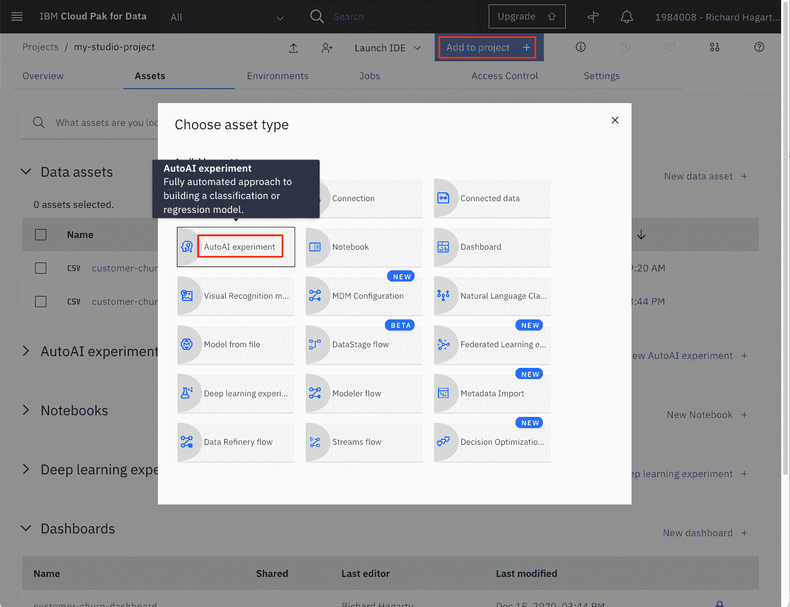

# 在 IBM Watson Studio 中自动运行模型构建

> 原文：[`developer.ibm.com/zh/tutorials/watson-studio-auto-ai/`](https://developer.ibm.com/zh/tutorials/watson-studio-auto-ai/)

本教程已纳入 [Watson Studio 入门](https://developer.ibm.com/zh/series/learning-path-watson-studio/)学习路径。

| 级别 | 主题 | 类型 |
| --- | --- | --- |
| 100 | [IBM Watson Studio 简介](https://developer.ibm.com/zh/articles/introduction-watson-studio/) | 文章 |
| 101 | [使用 IBM Watson Studio 实现数据可视化、准备和转换](https://developer.ibm.com/zh/tutorials/watson-studio-data-visualization-preparation-transformation/) | 教程 |
| **201** | **在 IBM Watson Studio 中自动运行模型构建** | **教程** |
| 301 | [在 IBM Watson Studio 中创建 SPSS Modeler 流程](https://developer.ibm.com/zh/tutorials/watson-studio-spss-modeler-flow/) | 教程 |
| 401 | [在 IBM Watson Studio 中使用 Jupyter Notebook 构建模型](https://developer.ibm.com/zh/tutorials/watson-studio-using-jupyter-notebook/) | 教程 |

本教程展示了如何利用 IBM® Watson™ Studio 中的 AutoAI 功能来构建和评估机器学习模型。在建模阶段，选择并应用各种建模技术，并对其参数进行校准以达到最佳预测。通常，可以应用多种技术，并且某些技术对数据的形式有特定要求。因此，通常有必要返回到数据准备阶段。但是，在模型评估阶段，目标是从数据分析的角度构建高质量的模型。在继续进行模型的最终部署之前，重要的是要彻底评估模型，并查看创建该模型所要执行的步骤，以确保该模型能够正确实现业务目标。

Watson Studio 中的 [AutoAI](https://dataplatform.cloud.ibm.com/docs/content/wsj/analyze-data/autoai-overview.html?audience=wdp&context=wdp) 图形化工具支持您快速构建模型并评估其准确性，而无需编写任何代码。AutoAI 会通过上载训练数据、选择机器学习技术和算法以及训练和评估模型来逐步指导您构建机器学习模型。

与该学习路径中的所有其他教程一样，我们使用 [Kaggle](https://www.kaggle.com/sandipdatta/customer-churn-analysis/notebook#Churn-Analysis) 上提供的客户流失数据集。

## 前提条件

要完成本学习路径中的教程，您需要一个 [IBM Cloud 帐户](https://cloud.ibm.com/registration?cm_sp=ibmdev-_-developer-tutorials-_-cloudreg)。您可以获取一个免费的试用帐户，该帐户使您可以访问 [IBM Cloud](https://cloud.ibm.com?cm_sp=ibmdev-_-developer-tutorials-_-cloudreg)、[IBM Watson Studio](https://www.ibm.com/cloud/watson-studio) 和 [IBM Watson Machine Learning 服务](https://www.ibm.com/cloud/machine-learning)。

## 预计花费时间

完成本教程大约需要 30 分钟。

## 步骤

[使用 IBM Watson Studio 进行数据可视化、准备和转换](https://developer.ibm.com/zh/tutorials/watson-studio-data-visualization-preparation-transformation/)教程中阐述了有关为学习路径设置环境的步骤。这些步骤将展示如何：

1.  创建 IBM Cloud Object Storage 服务。
2.  创建 Watson Studio 项目。
3.  配置 IBM Cloud 服务。
4.  上传数据集。

在继续学习路径之前必须先完成这些步骤。如果您已设置完环境，继续执行下一步，在 Watson Studio 中新建模型。

### 在 Watson Studio 中新建模型

1.  为您的 Watson Studio 项目选择 **Assets** 选项卡。

2.  在 Asset 选项卡中，单击 **Add to Project** 命令。

    

3.  选择 **AutoAI Experiment** 资产类型。

4.  在 **Create an AutoAI experiment** 窗口中：

    1.  选择 **From Blank** 作为试验类型。

    2.  输入 **Asset Name**，如“customer-churn-manual”。

    3.  对于 **Machine Learning Service**，选择您先前为项目创建的 Watson Machine Learning 服务。

        

    4.  单击 **Create**。

5.  在 **Add training data** 窗口中：

    1.  单击 **Select from project**。

    2.  选择先前添加到项目的 Kaggle 数据资产。

        

    3.  单击 **Select Asset**。

## 运行和训练模型

从 **Configure AutoAI experiment** 窗口：

1.  在 **Select column to predict** 框中，选择 **churn**。

    

2.  保留默认的预测类型 **Binary Classification**，以及优化指标 **ROC AUC**（接收器操作特性/曲线下面积）。

3.  单击 **Run experiment**。

在运行试验时，您会在页面顶部看到步骤管道。完成后，将在面板底部按准确性顺序列出已完成的模型。


AutoAI 过程使用以下顺序来构建候选管道：

*   数据预处理
*   自动化模型选择（管道 1）
*   超参数优化（管道 2）
*   自动化特征工程（管道 3）
*   超参数优化（管道 4）

对于我们的数据，根据“ROC 曲线下的面积”(ROC AUC) 指标，管道 3 排名最高。它使用了“超参数优化”和“特征工程”增强功能。

在 AutoAI 试验完成后，会将其保存在 Watson Studio 项目中。可从 **AutoAI experiments** 下的 **Assets** 选项卡中查看。


### 评估模型绩效

在 AutoAI Experiment 页面上，有许多选项可用于获取有关如何执行每个管道的更多详细信息。


Compare pipelines 命令可展开为每个管道显示的指标列表。


> 按钮将提供有关选定管道的更多详细信息。


单击管道名称将打开管道的 Model Evaluation 窗口。


左侧有一个菜单，可为管道提供更多指标，例如：

*   Confusion Matrix 表

    

*   Feature Importance 图

    

AutoAI 试验模型功能可能无法提供与通过 Jupyter Notebook 所获得的完全相同的一组分类方法和评估指标，但它可以更快速地得出结果，且无需编程。

Watson Studio 的这一模型构建器组件可用于创建经过测试的初始机器学习模型，并且可从预测性能角度对其进行评估，而无需花费大量时间进行编程。服务提供的预测指标还有助于初步了解数据集是否可用于达成您的预期目的。

### 使用 Watson Machine Learning 服务部署和测试模型

根据 IBM 数据科学流程，在开发出令人满意的模型并得到业务发起人批准后，该模型将部署到生产环境或类似的测试环境中。通常，它会以受限方式进行部署，直到全面评估其性能为止。

借助 Watson Studio 的 Machine Learning 服务，您可以通过三种不同的方式来部署模型：作为 Web Service、作为批处理程序或作为实时流预测。在本教程中，我们将其部署为 Web Service，然后以交互方式进行测试。

首先，必须保存模型。

1.  对于相关程度最高的管道，单击 **Save as model**。

    

2.  保留默认名称，然后单击 **Save**。

该模型现在应显示在项目 **Assets** 选项卡的 Models 部分中。


要部署模型，单击模型名称以将其打开。

1.  选择 **Deployments** 选项卡。

    

2.  单击 **Add Deployment**。

3.  在 **Create Deployment** 页面上：

    1.  输入部署的 **Name**（例如，“customer-churn-manual-web-deployment”）。

    2.  保留默认 Web service **Deployment type** 设置。

    3.  输入可选的 **Description**。

        

4.  单击 **Save** 以保存部署。

5.  一直等到 Watson Studio 将 **STATUS** 字段设置为“ready”或“DEPLOY_SUCCESS”。


现在该模型已部署并且可用于预测。但是，在用于生产环境之前，可能有必要使用实际数据对其进行测试。您可以使用 Machine Learning 服务的 API 以交互方式或编程方式执行此操作。我们将在此学习路径的另一篇教程中讨论如何使用 API，但现在我们将继续以交互方式进行测试。

有两种方法可以交互方式测试预测：通过在不同的字段（每个特征一个）中逐个输入值，或者使用 JSON 对象指定所有特征值。我们使用第二个选项，因为当多次执行测试（通常是这种情况）并且需要大量特征值时，这种方法最为便捷。

为了让您的测试更轻松，您可以剪切并粘贴以下样本 JSON 对象以在后续步骤中使用。

```
{"input_data":[{"fields": ["state", "account length", "area code", "phone number", "international plan", "voice mail plan", "number vmail messages", "total day minutes", "total day calls", "total day charge", "total eve minutes", "total eve calls", "total eve charge", "total night minutes", "total night calls", "total night charge", "total intl minutes", "total intl calls", "total intl charge", "customer service calls"], "values": [["NY",161,415,"351-7269","no","no",0,332.9,67,56.59,317.8,97,27.01,160.6,128,7.23,5.4,9,1.46,4]]}]} 
```

注意，JSON 对象先定义字段的名称，然后定义要预测的观察序列，均采用序列形式：

注意，某些特征（例如状态和电话号码）应采用字符串形式（应不足为奇），而真正的数字特征可以根据给定特征以整数或浮点数形式提供。

要在运行时测试模型：

1.  选择刚刚通过单击部署名称创建的部署（例如“customer-churn-manual-web-deployment”）。

    

2.  这将打开一个新页面，该页面显示部署属性的概述（例如，name、creation date 和 status）。

3.  选择 **Test** 选项卡。

4.  选择文件图标，这将允许您使用 JSON 输入值。

5.  将样本 JSON 对象粘贴到 **Enter input data** 字段中。

6.  单击 **Predict** 以查看结果。

    

预测结果是根据客户流失 (True) 或不流失 (False) 的可能性给出的。您可以尝试使用其他值，例如，用从“customer-churn-kaggle.csv”文件获取的值替换这些值。另一个测试是将电话号码更改为类似“XYZ”的内容，然后再次运行预测。预测结果应该是相同的，这表明此特征不是预测中的因素。

## 结束语

本教程介绍了在 Watson Studio 中使用 AutoAI 试验功能的基础知识，其中包括：

*   创建项目
*   为项目配置和分配服务
*   为项目添加资产，如数据集
*   运行 AutoAI 以根据数据集和特征工程生成估算器
*   创建和部署模型
*   训练、评估和测试模型

如[在 IBM Watson Studio 中运行 Jupyter Notebook](https://developer.ibm.com/zh/tutorials/watson-studio-using-jupyter-notebook/) 教程中所述，AutoAI 的使用提供了一种快速简便的方法来对客户流失预测进行建模，并且是使用 Jupyter Notebook 的完全编程风格的替代方法。想要了解有关 AutoAI 的更多信息？查看[使用 AutoAI 简化您的 AI 生命周期](https://developer.ibm.com/technologies/artificial-intelligence/series/explore-autoai/)。

此学习路径的下一教程[在 IBM Watson Studio 中创建 SPSS Modeler 流程](https://developer.ibm.com/zh/tutorials/watson-studio-spss-modeler-flow)中提供了另一种方法。

本文翻译自：[Automate model building in IBM Watson Studio](https://developer.ibm.com/tutorials/watson-studio-auto-ai/)（2020-12-17）