# 使用 IBM Watson Studio 来直观呈现、准备和转换数据

> 原文：[`developer.ibm.com/zh/tutorials/watson-studio-data-visualization-preparation-transformation/`](https://developer.ibm.com/zh/tutorials/watson-studio-data-visualization-preparation-transformation/)

本教程已纳入 [Watson Studio 入门](https://developer.ibm.com/zh/series/learning-path-watson-studio/)学习路径。

| 级别 | 主题 | 类型 |
| --- | --- | --- |
| 100 | [IBM Watson Studio 简介](https://developer.ibm.com/zh/articles/introduction-watson-studio/) | 文章 |
| **101** | **使用 IBM Watson Studio 来直观呈现、准备和转换数据** | 教程 |
| 201 | [在 IBM Watson Studio 中自动构建模型](https://developer.ibm.com/zh/tutorials/watson-studio-auto-ai/) | 教程 |
| 301 | [在 IBM Watson Studio 中创建 SPSS Modeler 流程](https://developer.ibm.com/zh/tutorials/watson-studio-spss-modeler-flow/) | 教程 |
| 401 | [在 IBM Watson Studio 中使用 Jupyter Notebook 构建模型](https://developer.ibm.com/zh/tutorials/watson-studio-using-jupyter-notebook/) | 教程 |

## 简介

本教程旨在演示 IBM® Watson™ Studio 中的一些功能，这些功能可帮助您直观呈现数据并获取有关数据的洞察，然后整理和转换数据以构建高质量的预测性模型。

## 前提条件

要完成此学习路径中的教程，您需要有一个 [IBM Cloud 帐户](https://cloud.ibm.com/registration?cm_sp=ibmdev-_-developer-tutorials-_-cloudreg)。您可以获取一个免费的试用帐户，以便能够访问 [IBM Cloud](https://cloud.ibm.com?cm_sp=ibmdev-_-developer-tutorials-_-cloudreg)、[IBM Watson Studio](https://www.ibm.com/cloud/watson-studio) 和 [IBM Watson Machine Learning Service](https://www.ibm.com/cloud/machine-learning)。

## 预估时间

完成本教程大约需要 30 分钟。

## 步骤

### 设置环境

必须完成以下步骤，才能完成此学习路径中的所有教程。

#### 创建 IBM Cloud Object Storage 服务

要在 Watson Studio 中创建项目，需要 Object Storage 服务。如果您尚未配置存储服务，可执行以下步骤：

1.  在您的 IBM Cloud 帐户中，在 [IBM Cloud Catalog](https://cloud.ibm.com/catalog?cm_sp=ibmdev-_-developer-tutorials-_-cloudreg) 中搜索“object storage”。然后单击 **Object Storage** 磁贴。

    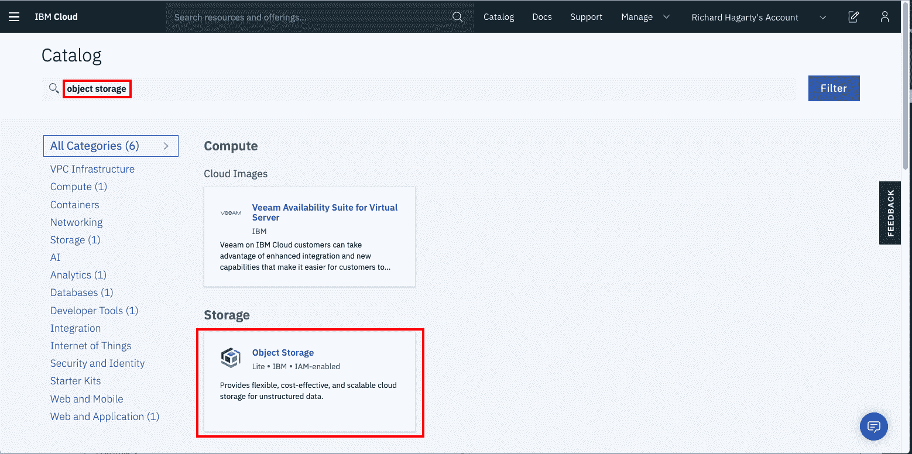

2.  输入名称，然后选择服务的 *Standard**（免费）版本。

    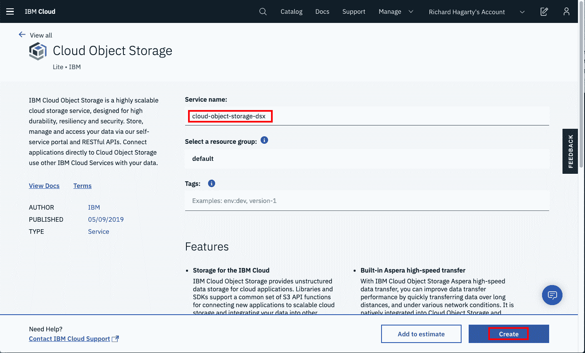

3.  对于 **Resource Group**，可以使用默认值，但最好是使用您在 IBM Cloud 中创建的专用组。您可以使用 **Manage > Account** 菜单选项并浏览至左侧工具栏中的 **Account resources > Resource groups**，以查找用于在 IBM Cloud 中新建资源组的命令。**Create** 按钮位于页面的右上角。

4.  单击 **Create**。

#### 创建 Watson Studio 项目

如果您还没有可用于此学习路径的项目，可创建一个新项目。

1.  使用您为 IBM Cloud 帐户创建的帐户登录到 [Watson Studio](https://dataplatform.cloud.ibm.com?cm_sp=ibmdev-_-developer-tutorials-_-cloudreg)

2.  单击 **Create a project** 或 **New project**。

3.  选择 **Create an empty project**。

    

4.  在 **New project** 窗口中，命名该项目（例如，“Watson Machine Learning”）。

    

5.  对于 **Storage**，您应选择在之前的步骤中创建的 IBM Cloud Object Storage 服务。如果该服务是您配置的唯一存储服务，那么将自动分配该服务。

6.  单击 **Create**。

#### 配置 IBM Cloud 服务

> 注意：本部分讨论如何为项目创建新服务。如果您先前已配置其中的任何服务，那么可以选择使用这些服务，而不是创建新服务。

##### Watson Machine Learning 服务

要配置 **Machine Learning** 服务并将其与当前**项目**相关联：

1.  选择项目的 **Settings** 选项卡。

2.  向下滚动至 **Associated services** 部分。

    

3.  单击 **Add Service**。

4.  从下拉菜单中选择 **Watson**。

5.  在下一页上，单击 **Machine Learning** 服务磁贴中的 **Add**。

6.  在下一页上，选择 **New** 选项卡以创建新的服务。

7.  暂时保留 **Lite plan**（稍后可在需要时进行更改）。

8.  向下滚动，然后单击 **Create** 来创建服务。

9.  将打开 **Confirm Creation** 窗口，您可以在其中指定服务的详细信息，例如区域、套餐、资源组和服务名称。

    

10.  输入服务实例的名称（可选，您可以在生成的名称前面添加“watson-machine-learning”）。

11.  对于 **Resource group**，可以选择使用默认值，但最好是使用您在 IBM Cloud 中创建的专用组。您可以使用 **Manage > Account** 菜单选项并浏览至左侧工具栏中的 **Account Resources > Resource Groups**，以查找用于在 IBM Cloud 中新建资源组的命令。**Create** 按钮位于页面的右上角。

12.  单击 **Confirm**。

##### IBM Cognos Dashboard Embedded 服务

要配置 **IBM Cognos Dashboard Embedded** 服务并将其与当前**项目**相关联：

1.  选择项目的 **Settings** 选项卡。

2.  滚动至 **Associated services** 部分。

3.  单击 **Add service**。

4.  从下拉菜单中选择 **Dashboard**。

    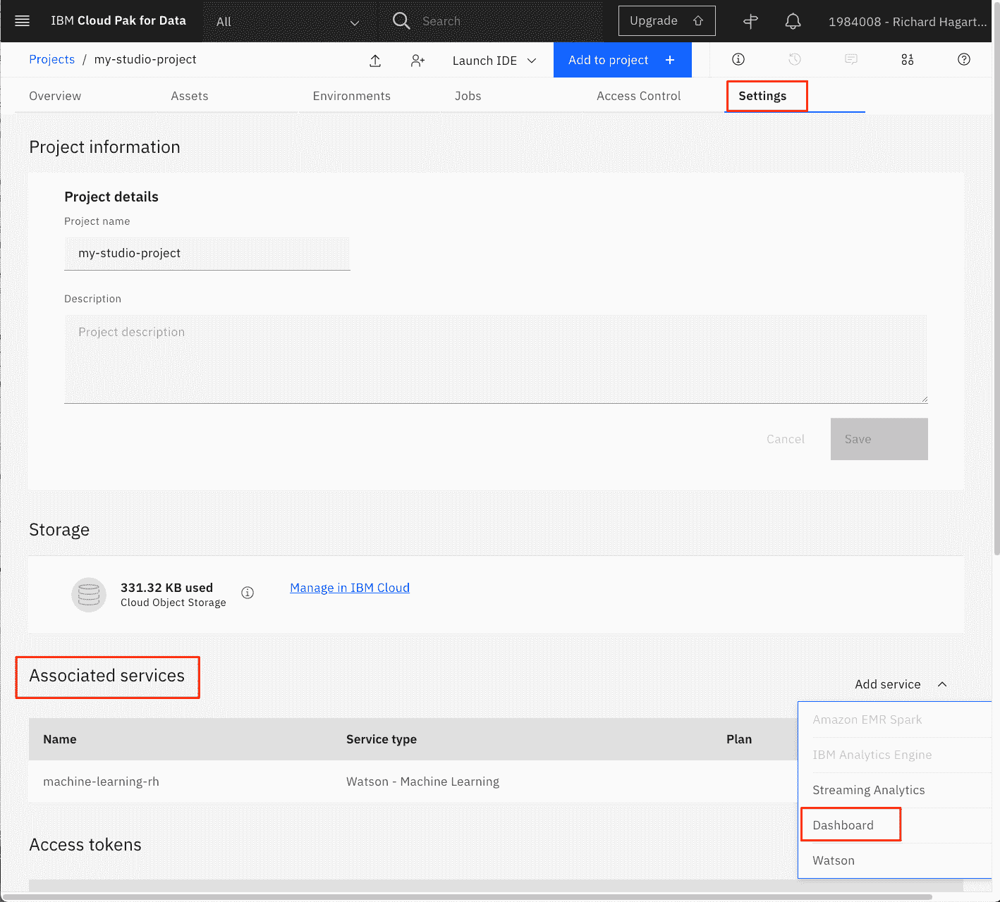

5.  在下一页上，选择 **New** 来创建新的服务。

6.  暂时保留 **Lite plan**（稍后可在需要时进行更改）。

7.  单击 **Create** 来创建服务。

    将显示 **Confirm Creation** 窗口，您可以在其中指定服务的详细信息，例如区域、套餐、资源组和服务名称。

    

8.  输入服务实例的名称（可选，您可以在生成的名称前面添加“watson-machine-learning”）。

9.  对于 **Resource group**，选择与配置其他 IBM Cloud 服务时相同的资源组。

10.  单击 **Confirm**。

#### 上传数据集

接下来，您将从 Kaggle 下载数据集并将其上传到 Watson Studio。

1.  浏览至 Kaggle ([`www.kaggle.com/sandipdatta/customer-churn-analysis`](https://www.kaggle.com/sandipdatta/customer-churn-analysis)) 上该数据集的 URL，然后将该文件下载到本地桌面。

2.  将该文件重命名为更有意义的名称（例如，“customer-churn-kaggle.csv”）。

3.  在 Watson Studio 中，选择 **Assets**。

4.  如果尚未打开，可单击面板右上角的 **1001** 数据图标以打开 **Files** 子面板。然后单击 **Load**。

    

5.  将该文件拖到放置区以将数据上传到 Watson Studio。

6.  等到该文件上传完毕。

### 背景

在完成环境设置步骤之后，您现在可以专注于本教程的主要主题（全都与数据有关）。您将学习如何直观呈现、准备和转换数据，以便将数据用于构建优化的高质量预测性模型。

执行这些活动的经典数据科学方法是使用在 Jupyter Notebook 中运行的 Python 编程语言。虽然我们稍后会在此学习路径的[在 IBM Watson Studio 中使用 Jupyter Notebook 构建模型](https://developer.ibm.com/zh/tutorials/watson-studio-using-jupyter-notebook/)教程中介绍此方法，但本教程会重点介绍一些替代方法，即，使用 Watson Studio 所提供的功能和工具在不编程的情况下实现相同的目标。

### Watson Studio 中的基本可视化

收集数据后，下一步是数据理解阶段。这包括可让您熟悉数据、识别数据质量问题以及发现对数据的初步洞察的活动。

您可以在 Watson Studio 中通过简单的用户交互来实现这一点，而无需编写任何代码。要在 Watson Studio 中查看数据集，可以先找到该数据资产，然后单击该数据集的名称以将其打开。

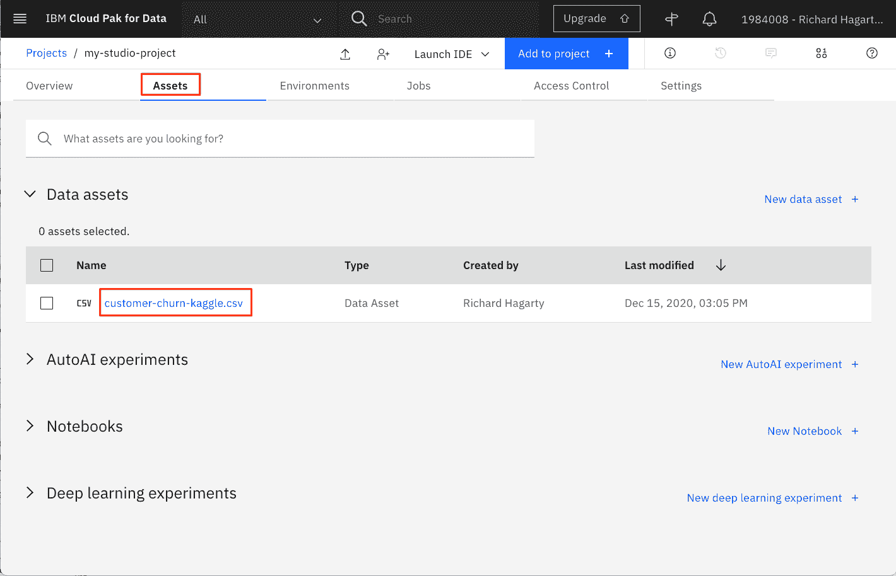

Watson Studio 将在 **Preview** 选项卡中显示数据预览。

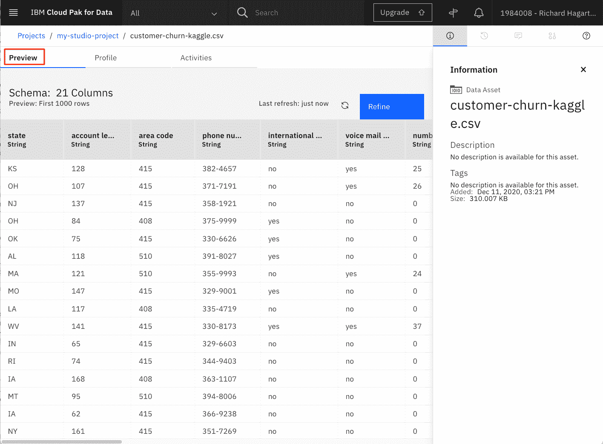

或者，**Profile** 选项卡提供概要分析信息以展示值的分布。对于数字特征，它还将展示该特征的最大值、最小值、均值和标准差：

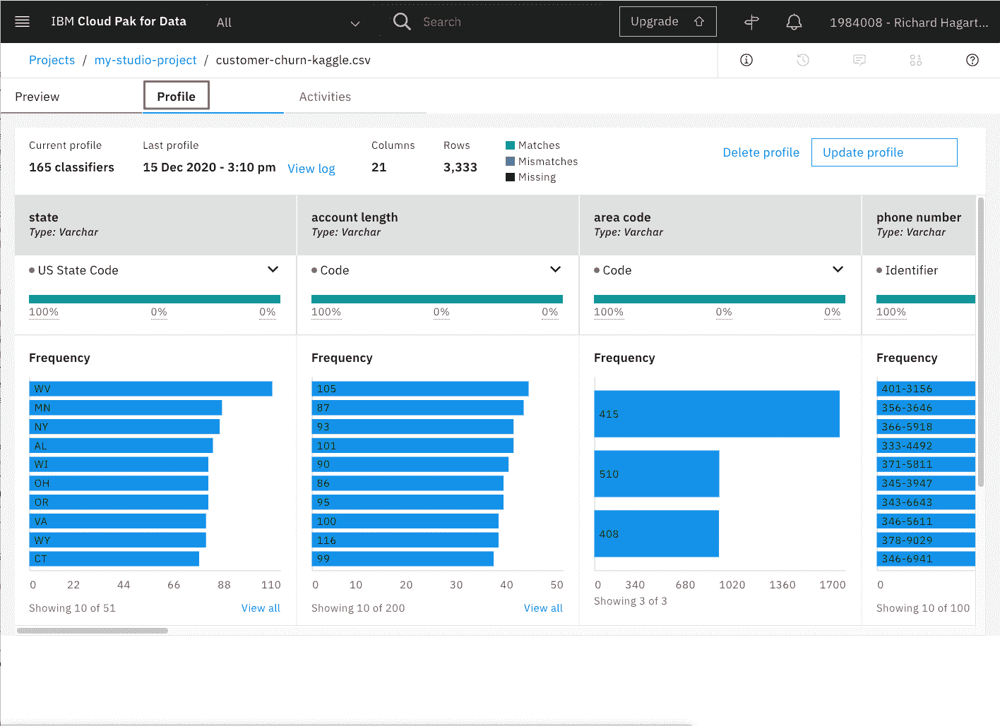

注意，尽管数字列被标识为 `varchar` 类型，但概要分析程序足够智能，可以将它们识别为数字列、对其进行隐式转换并计算均值和标准差。

要首次生成概要文件：

1.  选择 **Profile** 选项卡。

2.  调用 **Create Profile** 命令。

3.  稍等片刻，然后刷新该页面。

注意，churn 参数不提供流失和无流失观测值的均衡分布。这可能意味着，您应该在模型构建和评估阶段采用交叉验证策略。

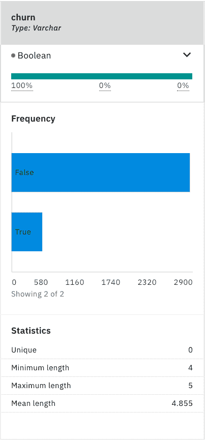

### 使用 Cognos Dashboard 服务创建更多可视化

您可以通过创建仪表板及关联可视化来进一步查看数据集。这基本上需要完成以下三个步骤：创建空仪表板、添加要用于可视化的数据源，以及向仪表板添加适当的可视化。

要创建仪表板：

1.  单击 **Add to project**。

2.  单击 **Dashboard** 来创建新的仪表板。

3.  在 **New Dashboard** 页面中执行以下步骤：

    1.  输入仪表板的 **Name**（例如，“customer-churn-dashboard”）。

    2.  提供仪表板的 **Description**（可选）。

    3.  对于 **Cognos Dashboard Embedded Service**，选择您先前创建的仪表板服务。

        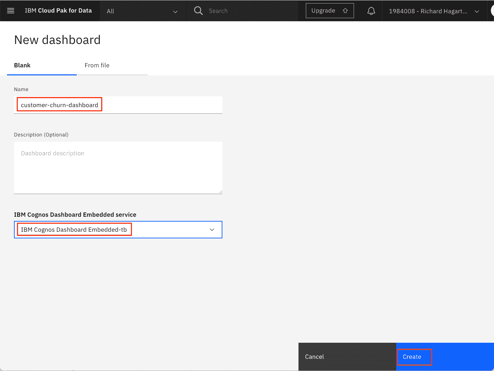

    4.  单击 **Save**。

4.  在下一页上，选择 **Freeform** 模板。

    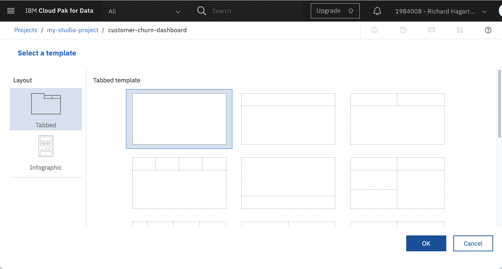

5.  保留用于创建选项卡式仪表板的默认设置。

6.  单击 **OK** 来创建带有单个选项卡的、自由格式的空仪表板。

要添加数据连接：

1.  单击页面左上部分中的 **Add a source** 按钮（+ 图标）：

    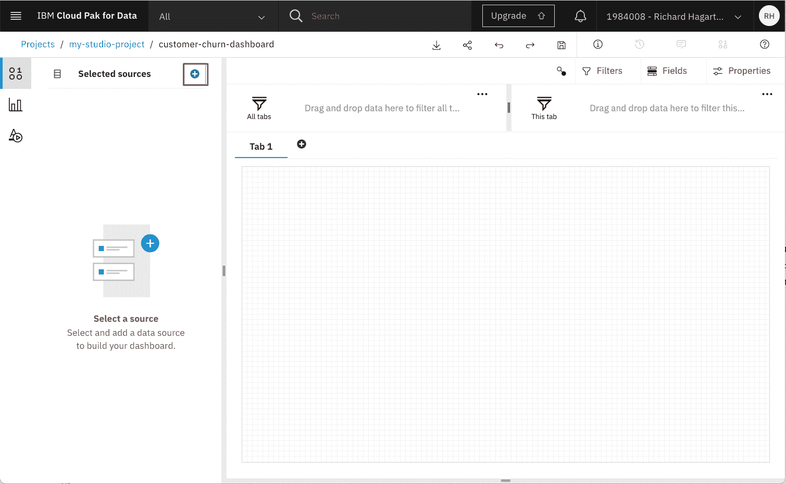

2.  单击 **Select** 来选择客户流失数据源。

3.  返回到仪表板，并选择新导入的数据源。

4.  通过单击面板右下角的表格图标来预览数据源。

    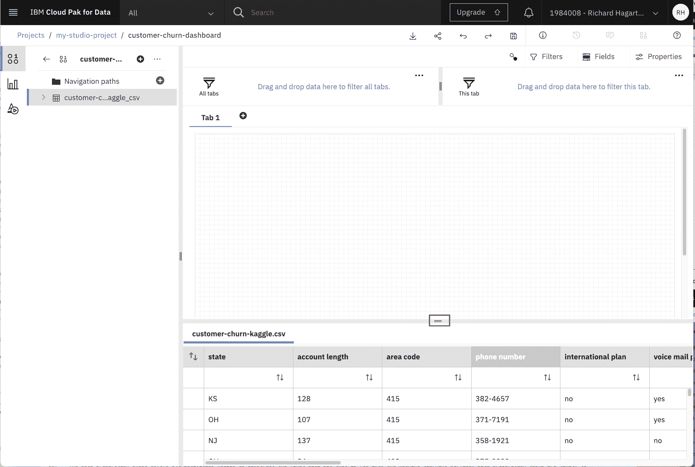

5.  通过单击 **>** 来展开数据源，以便您可以查看各个列。

    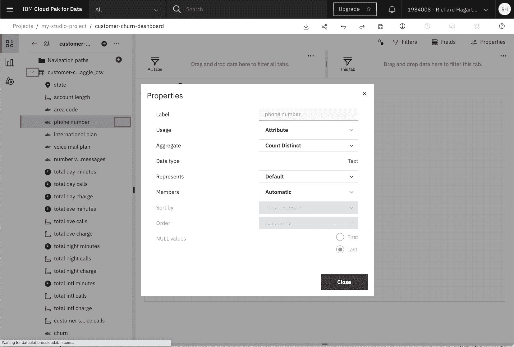

注意，您可以查看和更改列的属性。只需单击列名称右侧的 3 个点，然后在弹出菜单中选择 **Properties** 即可。这将显示如上所示的窗口，并允许您更改 Usage（Identifier、Attribute 和 Measure）以及 Aggregate Function（Count、Count Distinct、Maximum 和 Minimum）的默认设置。现在，您应该可以使用默认设置。

要创建可视化来以饼图形式显示流失和无流失观测值的分布：

1.  选择左侧工具栏中的 **Visualizations** 图标。

2.  选择 **Pie** 图表。

3.  这将创建一个表单来指定饼图的属性，例如，数据集的列。

    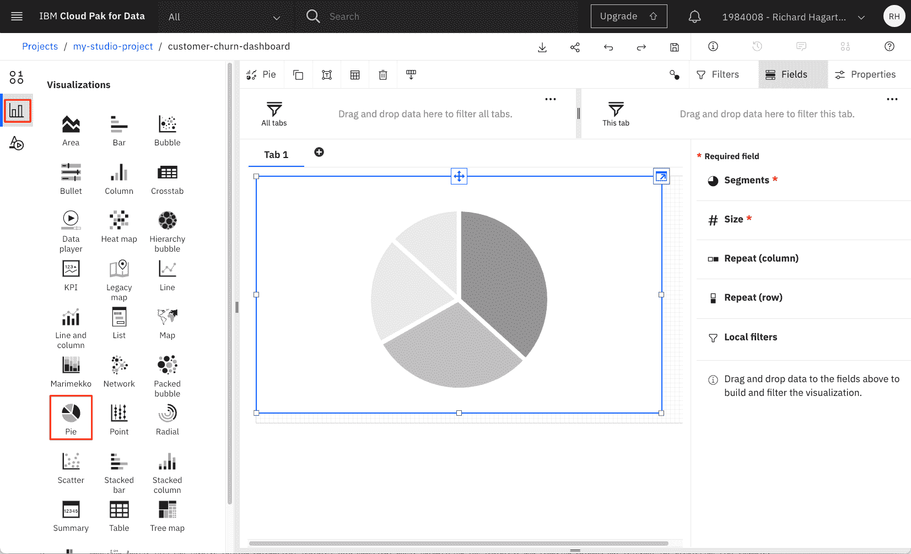

4.  选择左侧工具栏中的 **Sources** 图标（位于 Visualizations 图标上方）。

5.  将 churn 列拖到饼图的 Segments 属性上。

6.  将 churn 列拖到饼图的 Size 列上。

    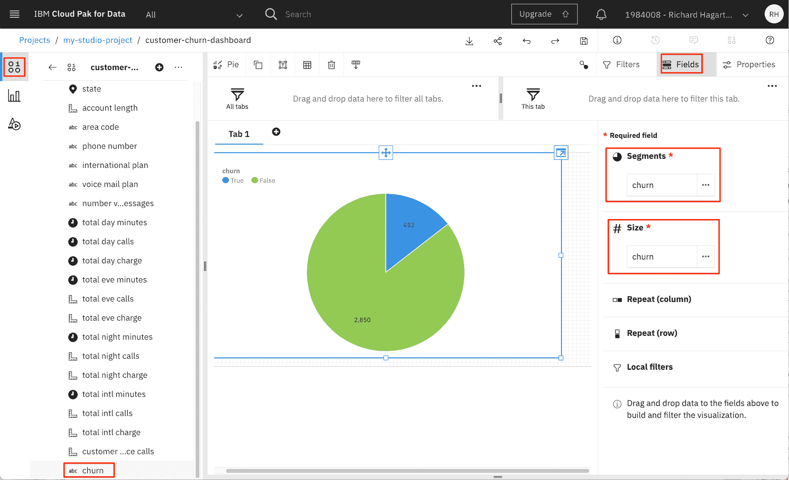

7.  单击表单右上角的折叠箭头（如上所示）。这将最大限度地缩小饼图并在仪表板上呈现该饼图。

8.  选择左上角的 **Tab**，然后单击 **Edit the title** 按钮。

    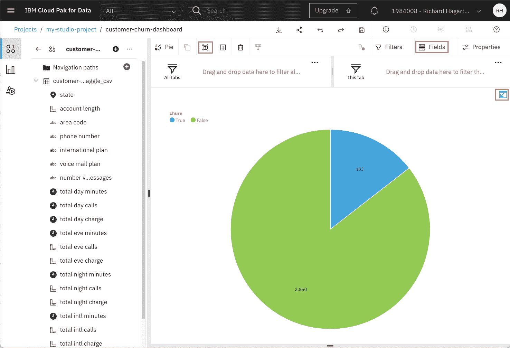

9.  提供选项卡的标题（例如，“Customer Churn”）。

执行以下步骤并再创建两个可视化：

*   堆栈式柱状图，分别在 X 轴和 Y 轴上显示 State（可视化属性 Bars）和 Churn（Length、Color）

*   饼图，显示 International Plan（Segments、Length）的分布

这应该会生成类似于下图的仪表板。注意，您可以使用每个可视化顶部的 **Move widget** 命令在仪表板上移动可视化。

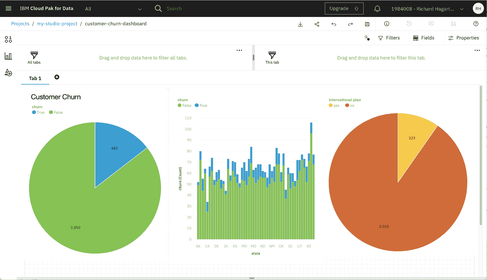

仪表板本质上是动态的，并支持使用过滤器进行数据探索。在显示“International Plan”的可视化中，单击与值“yes”关联的切片。这将创建一个过滤器，该过滤器将应用于当前仪表板上的所有其他（已连接的）可视化。

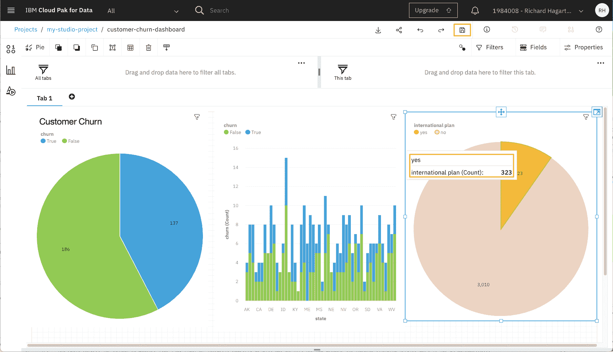

注意，左侧可视化中针对流失的切片已显着增加。这说明，使用国际套餐的客户比不使用国际套餐的客户更容易流失。要移除过滤器，可单击右上角可视化的过滤器图标，然后选择弹出的删除过滤器按钮（该图标是带叉叉的圆圈）。再次单击该切片可获得相同的效果。

### 使用 Refine 来准备和转换数据

数据准备阶段涵盖了构建最终数据集所需的所有活动，该最终数据集将提供给机器学习服务。数据准备任务可能会多次执行，而不是按任何规定的顺序执行。任务包括选择表格、记录和属性以及转换和整理用于建模工具的数据。这可能涉及将分类特征转换为数字特征，将特征规范化，并移除与预测无关的列（例如，客户电话号码）。

如果您只想使用 IBM Watson AutoAI 和 Watson Machine Learning 服务，以半自动或全自动方式创建模型，那么在数据准备（针对当前数据集）期间无需执行任何活动，因为 AutoAI 服务会在后台处理这些操作。我们将在此学习路径的[在 IBM Watson Studio 中自动构建模型](https://developer.ibm.com/zh/tutorials/watson-studio-auto-ai/)教程中展示如何完成此操作。

或者，Watson Studio 提供一项名为 **Data Refine** 的服务，您可以在不编程的情况下使用该服务来整理和转换数据。要运行此服务：

1.  单击项目概述页面顶部栏中的 **Add to project**。

2.  在 **Choose asset type** 窗口中，选择 **Data Refinery Flow** 来创建新的流程。

3.  在下一页上，选择 Customer Churn 数据集，然后单击 **Add**。

4.  这将打开该数据源，以供您进行转换和查看。

注意，您可以通过单击数据集的 **Preview** 面板中的 **Refine** 来启动 Data Refine 服务。

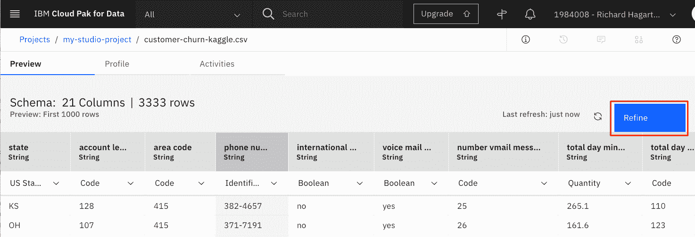

这将加载 Data Refine 服务并显示下表。

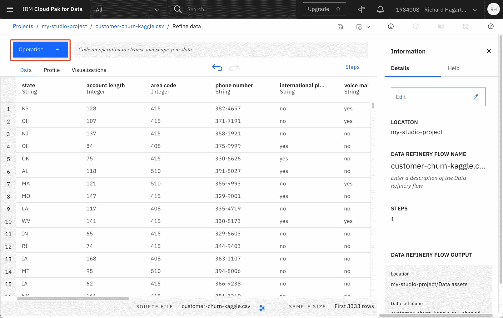

注意左上角的选项卡，您可以使用这些选项卡来以表格形式查看数据，以便对其进行概要分析（如上一部分所述）和创建数据的自定义可视化。

要转换数据：

1.  选择“phone number”列中的三个点，然后调用下拉菜单中的 **Remove** 命令。这将删除该列。

    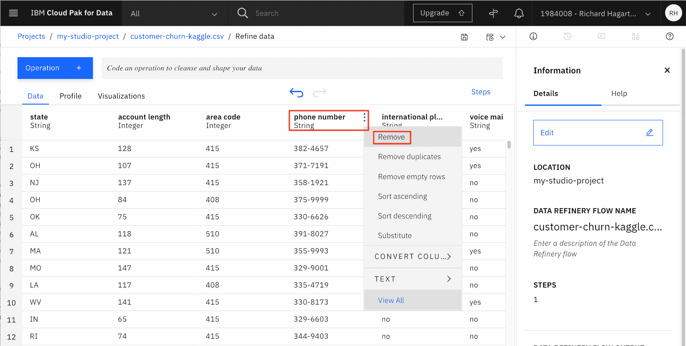

2.  选择 **total days minutes** 特征列。这实际上是 String 类型，但应该是数字。

3.  单击左上角的 **Operation** 按钮，此时会显示一些可用的转换。

    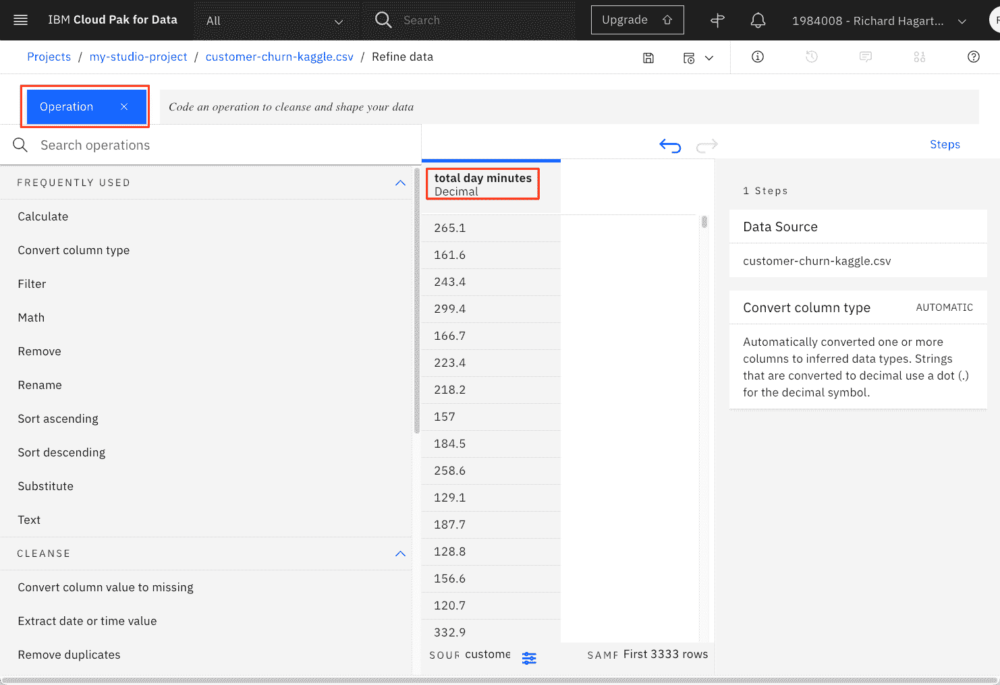

您可以将该列转换为另一种类型（例如 float 或 integer）。但是，我们暂时不会执行此操作，因为机器学习服务会在后台自动执行此操作。但是，在原则上，您可以决定将“total day minutes”列转换为 integer 列，并将其四舍五入以不显示小数部分。也可以将其转换为 float 类型。现在，我们来继续执行刚刚定义的流程并查看结果。

1.  单击工具栏中的 **Run Data Refinery flow** 按钮。其图标是一个箭头。

2.  选择 **Save and create a job** 选项。

    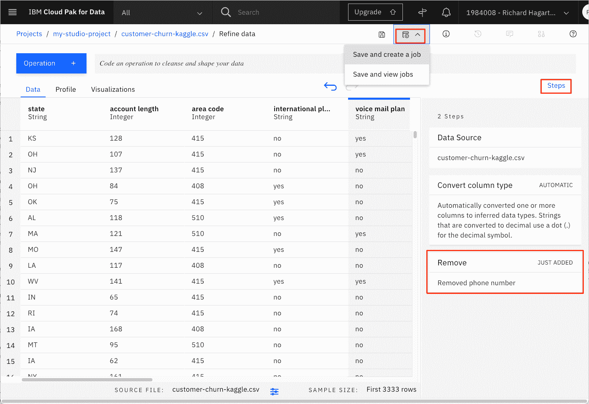

3.  在下一页上，您可以命名该流程并为其提供可选描述。注意，输出文件的名称与资产名称相同，但后缀为“shaped”。

4.  单击 **Create and run**。

生成的窗口将显示输入文件、输出文件和运行次数。注意，还有一个选项卡，您可以在其中调度流程，以便自动执行流程。

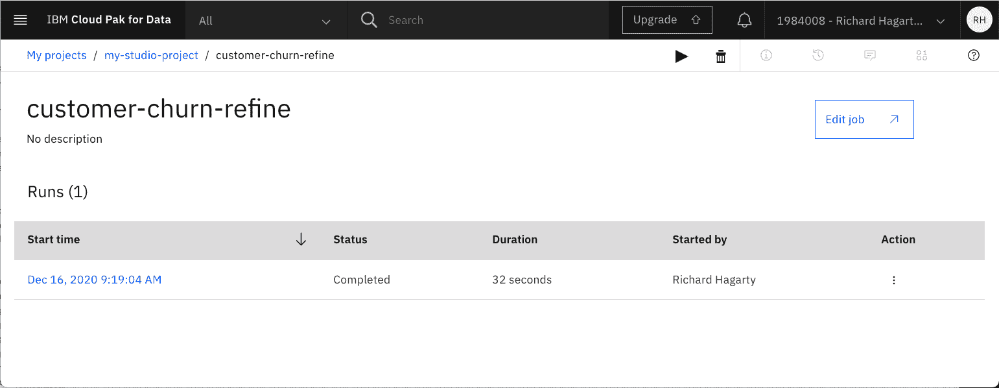

返回到您的项目，并检查输出文件和流程现在是否已成为项目资产的一部分。

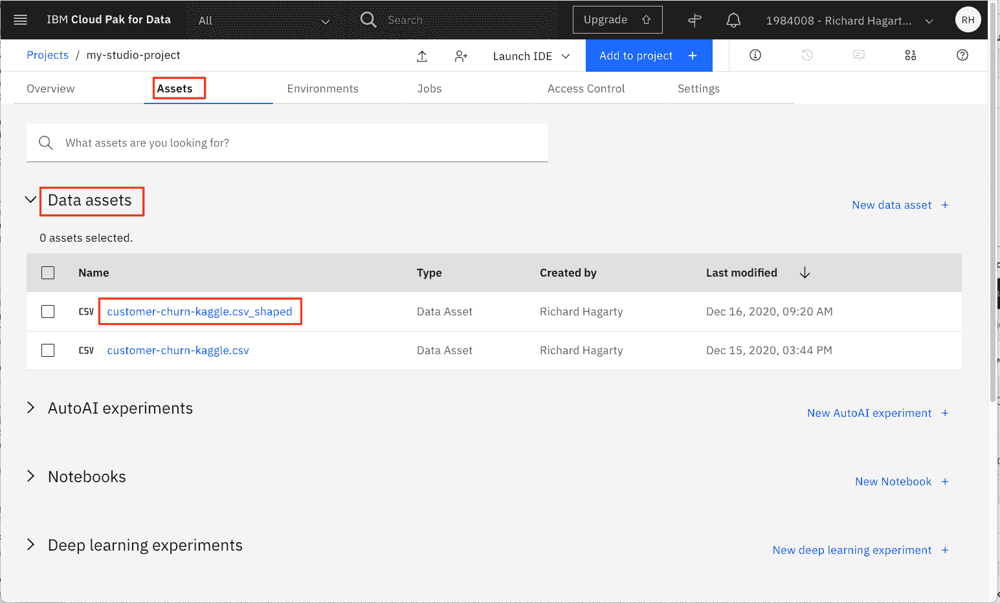

如果您单击新创建的流程资产，您会看到“phone number”列已被移除。

利用 Data Refinery Flow，您可以在不编程的情况下快速转换数据。虽然它不能取代 Jupyter Notebook 以及 numpy 和 pandas 的强大功能，但它可用于完成快速整理过程。对于更复杂的转换和计算，您应该恢复使用其他选项，例如 Jupyter Notebook 或 SPSS Modeler 流程（将在此学习路径的其他教程中介绍）。

## 结束语

本教程介绍了 Watson Studio 中提供的一些工具，这些工具可用于直观呈现、准备和转换数据。

主题包括预览和概要分析数据资产、构建 Cognos Dashboard 来构建更多可视化，以及使用 Data Refine Flow 工具来转换数据。

此[学习路径](https://developer.ibm.com/zh/series/learning-path-watson-studio/)的其余教程讨论了几种备用方法，可通过使用数据构建和部署预测性模型来完成这些任务并执行下一步。下一个教程将演示 [IBM Studio AutoAI 试验工具](https://developer.ibm.com/zh/tutorials/watson-studio-auto-ai/)，该工具是一种用于创建、评估、部署和测试机器学习模型的非编程方法。

本文翻译自：[Data visualization, preparation, and transformation using IBM Watson Studio](https://developer.ibm.com/tutorials/watson-studio-data-visualization-preparation-transformation/)（2020-12-16）