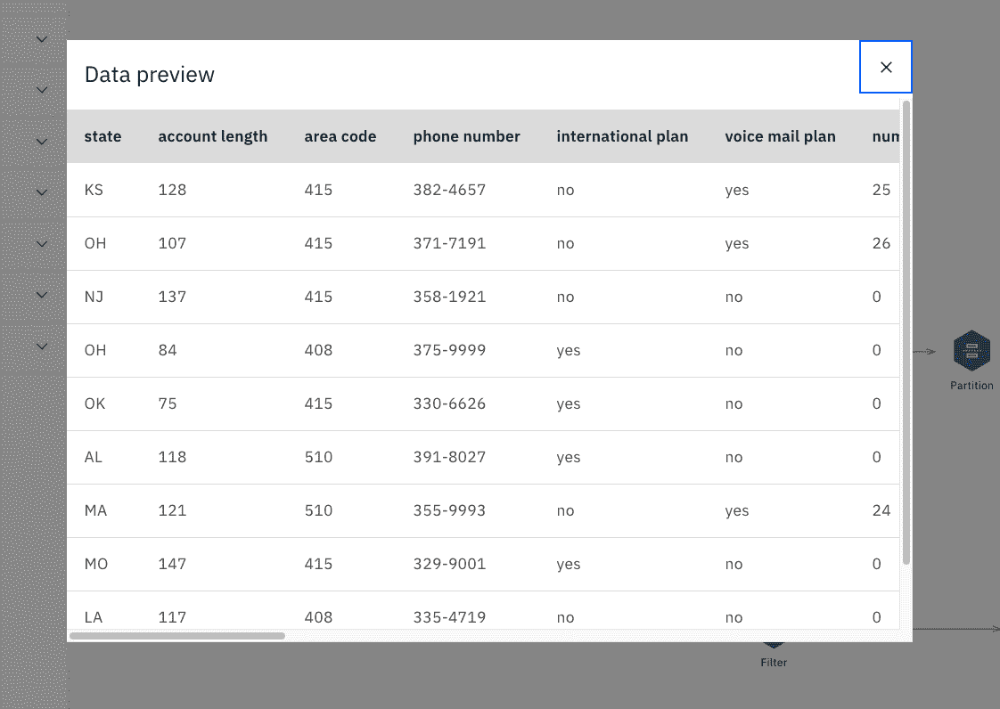
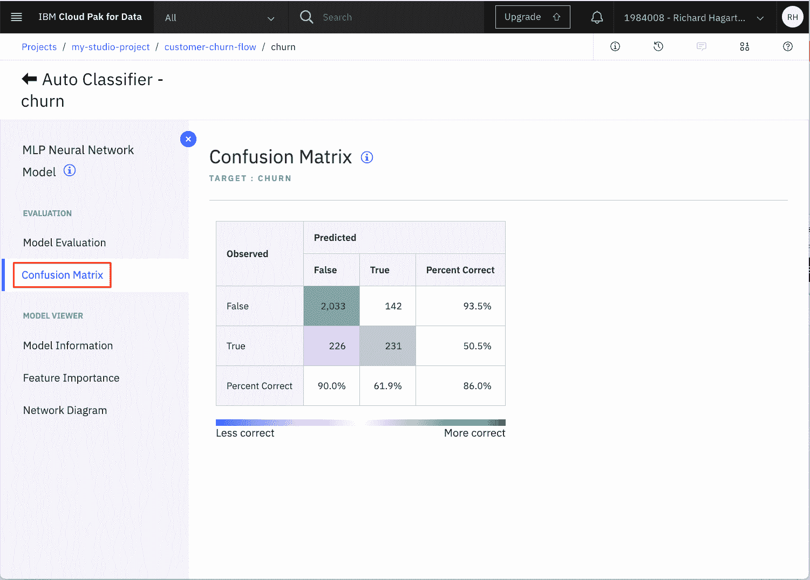
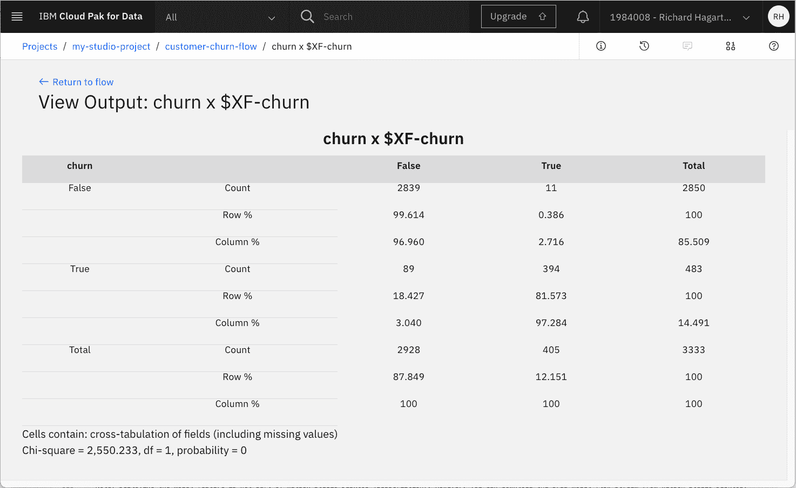
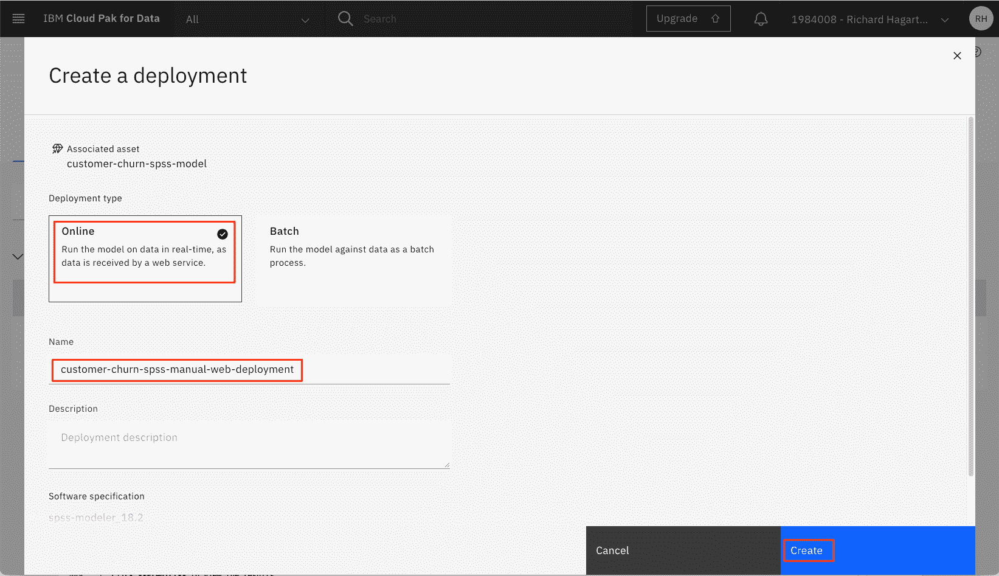

# 在 Watson Studio 中创建 SPSS Modeler 流程

> 原文：[`developer.ibm.com/zh/tutorials/watson-studio-spss-modeler-flow/`](https://developer.ibm.com/zh/tutorials/watson-studio-spss-modeler-flow/)

本教程已纳入 [IBM Watson Studio 简介](https://developer.ibm.com/zh/series/learning-path-watson-studio/)学习路径。

| 级别 | 主题 | 类型 |
| --- | --- | --- |
| 100 | [IBM Watson Studio 机器学习服务入门](https://developer.ibm.com/zh/articles/introduction-watson-studio/) | 文章 |
| 101 | [使用 IBM Watson Studio 实现数据可视化、准备和转换](https://developer.ibm.com/zh/tutorials/watson-studio-data-visualization-preparation-transformation/) | 教程 |
| 201 | [在 IBM Watson Studio 中自动运行模型构建](https://developer.ibm.com/zh/tutorials/watson-studio-auto-ai/) | 教程 |
| **301** | **在 IBM Watson Studio 中创建 SPSS Modeler 流程** | **教程** |
| 401 | [在 IBM Watson Studio 中使用 Jupyter Notebook 构建模型](https://developer.ibm.com/zh/tutorials/watson-studio-using-jupyter-notebook/) | 教程 |

## 简介

本教程介绍了如何通过使用 IBM® Watson™ Studio 中的 SPSS Modeler 流程功能以图形方式构建和评估机器学习模型。Watson Studio 中的 [IBM Watson SPSS Modeler](https://dataplatform.cloud.ibm.com/docs/content/wsd/spss-modeler.html) 流程提供了一个交互式环境，用于快速构建机器学习管道，这些管道可将数据在无需任何代码的前提下实现从摄取到转化再到模型构建和评估。本教程介绍了 SPSS Modeler 组件，并说明了如何使用这些组件来构建、测试、评估和部署模型。

与该学习路径中的其他教程一样，我们使用 [Kaggle](https://www.kaggle.com/sandipdatta/customer-churn-analysis/notebook#Churn-Analysis) 上可用的客户流失数据集。

## 前提条件

要完成本学习路径中的教程，您需要一个 [IBM Cloud 帐户](https://cloud.ibm.com/registration?cm_sp=ibmdev-_-developer-tutorials-_-cloudreg)。您可以获取一个免费的试用帐户，该帐户使您可以访问 [IBM Cloud](https://cloud.ibm.com?cm_sp=ibmdev-_-developer-tutorials-_-cloudreg)、[IBM Watson Studio](https://www.ibm.com/cloud/watson-studio) 和 [IBM Watson Machine Learning 服务](https://www.ibm.com/cloud/machine-learning)。

## 预估时间

完成本教程大约需要 60 分钟。

## 步骤

> SPSS Modeler 流程功能同时在 IBM Watson Studio Desktop 上提供。以下关于为 IBM Cloud 上的 Watson Studio 创建 SPSS Modeler 流程的相同步骤也适用于 Watson Studio Desktop。要跳至 Watson Studio Desktop，参阅使用 Watson Studio Desktop 的 SPSS Modeler 流程。

[使用 IBM Watson Studio 进行数据可视化、准备和转换](https://developer.ibm.com/zh/tutorials/watson-studio-data-visualization-preparation-transformation/)教程中介绍了有关为学习路径设置环境的步骤。这些步骤将展示如何：

1.  创建 IBM Cloud Object Storage 服务。
2.  创建 IBM Watson Studio 项目。
3.  配置 IBM Cloud 服务。
4.  上传数据集。

在继续学习路径之前必须先完成这些步骤。如果您已设置完环境，继续执行下一步“创建模型流程”。

### 在 Watson Studio 中创建模型流程

注意：您可能会注意到，在某些情况下，“IBM Watson Studio” 被替换为名称 “IBM Cloud Pak for Data”。使用的标题取决于您在 IBM Cloud 帐户上创建的服务的数量和类型。标题的更改不会影响服务的功能或导航方式。

要创建初始机器学习流程：

1.  从 **Assets** 页面中单击 **Add to project**。

2.  在 **Choose asset type** 页面中，选择 **Modeler Flow**。

    

3.  在 **Modeler** 页面上，选择“From File”选项卡。

4.  使用以下链接将 **Customer Churn Modeler Flow** 文件下载到本地系统。

    *   [customer-churn-flow.str](https://s3.us.cloud-object-storage.appdomain.cloud/developer/default/tutorials/watson-studio-spss-modeler-flow/static/customer-churn-flow.str)
5.  将下载的建模器流程文件拖动到上载区域。这也将为流程设置名称。

    

6.  更改机器学习流程的名称并提供描述（可选）。

7.  单击 **Create**。这将打开可用于创建机器学习流程的流程编辑器。

现在，您已经导入了初始流程，我们将在本教程的其余部分中探讨该流程。


在 **Modeling** 下拉菜单下，可以看到各种受支持的建模技术。第一个是自动分类器，它在尝试几种技术后了提供了最佳技术结果。

主流程自身定义了一个包含多个步骤的管道：

*   Data Asset 节点，用于导入数据集
*   Type 节点，用于定义特征的元数据，包括分类的一系列目标属性
*   Auto Data Prep 节点，用于准备要建模的数据
*   Partition 节点，用于将数据划分为训练集和测试集
*   名为 “churn” 的 Auto Classifier 节点，用于创建和评估模型

其他节点已与主管道关联，可查看输入和输出。其中包括：

*   名为 **Input Table** 的 Table output 节点，用于预览输入数据
*   名为 **21 fields**（默认名称）的 Data Audit 节点，用于审核输入数据集的质量（最小、最大、标准和偏差）
*   Evaluation 节点，用于评估生成的模型
*   名为 **Result Table** 的 Table output 节点，用于预览测试预测的结果

可以通过选择 **Outputs** 下拉菜单来查看其他输入和输出类型。

### 分配数据集和运行流程

要运行流程，您必须先将流程与项目中可用的相应的测试数据集连接起来。

1.  选择流程左侧 Data Asset 节点（输入节点）的三个点。

2.  从菜单中选择 **Open** 命令。这将在页面的右侧显示节点的属性。

    

3.  单击 **Change data asset** 以更改输入文件。

4.  在下一页面，选择包含客户流失数据的 .CSV 文件，然后单击 **OK**。

    > **注意**：作为前提条件步骤的一部分，应该将 Kaggle 数据集上传到您的项目资产中。 如果需要，可以在[此处](https://s3.us.cloud-object-storage.appdomain.cloud/developer/default/tutorials/watson-studio-spss-modeler-flow/static/customer-churn-kaggle.csv)下载文件的链接。

5.  单击 **Save**。

6.  单击工具栏中的 **Run**（箭头）以运行流程。

    

运行流程会创建许多输出或结果，可以对其进行更详细的检查。


### 理解数据

运行流程后，来详细看一看数据。

1.  选择流程图顶部的 **Input Table** 节点。

2.  选择右上角中的三个点，然后从弹出菜单中调用 **Preview** 命令。

    

注意，这再次运行一部分流程。



现在，我们来详细看看每个数据列，例如其最小值、最大值、均值和标准差值：

1.  从工具栏右上部分中选择 **View outputs and versions** 命令。

2.  选择 **Outputs** 选项卡。

    

3.  在输出列表中，找到名为 **21 Fields** 的**数据审核**节点，然后单击**眼睛**图标以将其打开。

    

这将为您提供类似下图的概述。


对于每个特征，概述以图形形式显示分布，以及该特征是分类的还是连续的。对于数字特征，还显示了计算出的最小值、最大值、均值、标准差和偏度。从名为 Valid 的列中，您可以看到有 3333 个有效值，这意味着所列出的特征不缺少任何值，并且您未来无需在此方面进行预处理即可过滤或转换缺少值的列。

### 数据准备

您可以使用 Type 节点（恰好是管道中的下一节点）来更改导入功能对特征进行的初始评估。要达到此目的：

1.  通过在工具栏中选择 **customer-churn-flow**，返回到流程编辑器。

2.  选择 **Type** 节点。

3.  从弹出菜单中选择 **Open** 命令。

这将提供一个表格，其中显示特征（如字段）、其种类（如连续或标志）、角色以及其他特征。


如果需要，可以使用此节点更改度量，也可以指定特征的角色。在此例中，churn 特征（具有 True 和 False 值的标志）的角色已更改为 Target。Check 列可让您更深入地了解该字段的值。

单击 **Cancel** 以关闭 Type 节点的属性编辑器。

管道中的下一个节点是 Auto Data Prep 节点。该节点将自动转换数据，例如将分类字段转换为数字字段。要查看其结果：

1.  在流程编辑器中选择 **Auto Data Prep** 节点。

2.  从弹出菜单中选择 **Open**。

该节点提供多种设置，例如，用于定义转换目标（针对速度或准确性进行优化）。


上一张图像显示该转换已配置为排除缺少太多值（阈值为 50）的字段，并排除具有太多唯一类别的字段。假设后者适用于电话号码，那么无需担心。

管道中的下一个节点是 Partition 节点，该节点会将数据集拆分为训练集和测试集。对于当前的 Partition 节点，已使用 80-20 拆分。


### 训练模型

SPSS Modeler 流程中的下一个节点是名为“churn”的 Auto Classifier 节点。该节点将基于各种构建选项来训练模型，例如如何对生成的模型进行排名和丢弃（使用阈值精确性）。


如果您通过 **Open** 打开节点并从下拉菜单中选择 **BUILD OPTIONS** 选项，那么可以看到属性“Number of models to use”设置为 3，这是默认值。随时可将其更改为更大的数字，然后单击 **Save** 以保存更改。

> **注意：**如果更改任何构建设置，记住要重新运行流程。

### 评估模型

要获取有关生成的模型的更多详细信息：

1.  选择 **churn** 模型图标。

2.  从下拉菜单中选择 **View Model**。

    

此概述部分为您提供了分类器模型及其精确性的列表。在本示例中，我将 **Number of models to use** 设置为了 8。


浏览此概述部分时，您会注意到与每个估算器关联的选项和视图的数量都有所不同。在某些情况下，提供超链接以深入了解更多细节。

例如，通过单击表中的名称，查看效果不佳的 **C&RT** 树模型。

在下一页面上，选择左侧的 **Tree Diagram** 链接以获取估算器的树形图。

现在，您可以将鼠标悬停在树中的一个节点或一个分支上，以获取有关在给定点所做出决策的更多详细信息。


单击页面左上角的左箭头以返回。然后选择 **MPL Neural Network** 链接以获取该估算器的详细信息。注意，它具有与树模型不同的选项。

单击 **Feature Importance** 选项卡。


这将绘制每个预测器在估算模型时的相对性能。

单击 **Confusion Matrix** 选项卡。



该表将比较预测结果和观察结果。正确预测的数量将显示在主对角线上的单元格中。

如果要获取完整数据集的混淆矩阵，可以将 **Matrix Output** 节点添加到画布。

1.  返回到流程。

2.  从“输出”菜单中选择“矩阵”节点，并将其拖到画布上。

    

3.  将 matrix 节点连接到指定的模型输出节点。

    

    > **注意：**要连接新节点，可单击现有“churn”模型输出节点的右侧箭头，然后将连接器拖动到新的 matrix 节点。

4.  通过 **Open** 打开 Matrix 节点。

5.  将目标属性 **churn** 放入行中，将二进制预测 **$XF-churn** 放入列中。

    

6.  对于单元格内容，选择 **Cross-tabulations**。

7.  单击 **Appearance** 并选择 **Counts**、**Percentage of Row**、**Percentage of Column** 和 **Include row and column totals**。

    

8.  单击 **Save**。注意，Matrix 节点的名称现在将更改为与分配的行和列名称匹配。

9.  通过单击节点操作菜单并选择“运行”按钮运行 **Matrix** 节点。

10.  选择右上角的 **View Output and Versions**。

    

11.  通过单击“研究”图标，打开 Matrix 节点（名为 “churn x $XF-churn”）的输出。

    

    主要的对角单元格百分比包含作为行百分比的召回值（通常所用比例度量的 100 倍）和作为列百分比的精度值。将需要手动计算这两个类别的 F1 统计信息以及精度和召回值的加权版本。显示的结果是应用所有三种算法的组合结果。如果只想查看 Random Forest 的结果，返回到 Auto Classifier 节点。将其打开并取消选中 Random Trees 以外所有模型的框。

    

12.  保存并运行流。

如果您只想获取混淆矩阵，打开 Matrix Output 节点，然后在外观部分中取消选择 **Percentage of Row** 和 **Percentage of Column**。然后，重复上述步骤 9-11。


可通过使用 **Graph** 可视化，以更加图形化的方式展示混淆矩阵。为此：

1.  选择并将**图表**对象拖到画布上，然后将其附加到模型输出节点。

    

2.  打开节点，然后单击**启动图表生成器**。

    

3.  点击**更多选项**（双箭头图标）以查看所有可用的图表类型。 选择“树形图”图表。

    

将 **Columns** 值设置为 **churn** 和 **$XF-churn**，将**叶数**设置为 2，然后在**详细信息**面板中选择**计数**。

```
 
```

注意，当前管道使用 Partition 节点执行测试和训练数据的简单拆分。也可以使用交叉验证和分层交叉验证来稍微提升模型性能，但代价是会使管道更复杂。参阅文章 [IBM SPSS Modeler 中的 k 折交叉验证](https://developer.ibm.com/predictiveanalytics/2016/03/02/k-fold-cross-validation-ibm-spss-modeler/)，获取有关如何实现此验证的详细信息。

还有两种查看评估结果的方法。

1.  返回至 Customer Churn Flow 的流程编辑器。

2.  从顶部工具栏中选择 **View outputs and version**。

3.  对于名为**Evaluation of [$XF-churn] : Gains**，单击“眼睛”图标将其打开。

    

将显示针对该模型生成的输出。


### 创建部署空间

IBM Watson Studio 使用“部署空间”的概念来配置和管理一组相关的可部署资产的部署。 这些资产可以是数据文件，机器学习模型等。

在此示例中，我们使用部署空间来保存 SPSS 模型。

如果尚未创建部署空间，请按照以下说明创建一个。

1.  转到（☰）主导航菜单，展开**部署空间**，然后选择**查看所有空间**。

    

2.  单击 **New deployment space +**.

    

3.  给您的部署空间一个唯一的名称和可选的描述。 提供您在先前步骤中创建的**云对象存储**和**机器学习**服务实例。 然后，点击**创建**按钮。

    

4.  创建部署空间后，单击**查看新空间**按钮。

    

下图显示了新的部署空间**资产**面板。


### 保存和部署模型

> 注意：部署模型功能并非 Watson Studio Desktop (Subscription) 的一部分。但是，您可以从 Watson Studio Desktop 下载 SPSS 模型流程流，然后将其导入 IBM Cloud 上的 Watson Studio。您可以再次运行该流程，并使用以下步骤创建可供部署的模型。

在创建、训练和评估模型后，您可以保存和部署模型。

要保存 SPSS 模型：

1.  返回至模型流程的流程编辑器。

2.  选择 **Predicted Output** 节点，并通过选择右上角的 3 个点来打开其弹出菜单。

3.  从弹出菜单中选择 **Save branch as model**。

    

    将打开一个新窗口。

    

4.  输入模型名称（例如，“customer-churn-spss-model”）。

5.  单击 **Save**。

    模型已保存到当前项目。

现在，该模型应显示在项目的 Assets 选项卡的 Models 部分中。


要部署 SPSS 模型：

1.  单击项目 **Models** 列表中的已保存模型打开模型详情页。

    

2.  单击 **Promote to deployment space**.

    

3.  对于**目标空间**，请选择上一步中创建的部署空间，然后单击**升级**。

4.  现在，该模型应在**部署空间**页面中列出。

    

5.  将鼠标悬停在模型名称上可以查看操作图标。单击**部署**图标。

    

6.  单击**在线**部署类型，输入唯一名称（例如 **customer-churn-spss-manual-web-deployment**），然后单击**创建**。

7.  选择**部署空间**面板的**部署**标签，然后等待 Watson Studio 将**状态**字段设置为**已部署**。

    

### 测试模型

现在，该模型已部署并且可用于预测。但是，在用于生产环境之前，可能有必要使用实际数据对其进行测试。您可以使用 IBM Machine Learning 服务的 API 以交互方式或以编程方式执行此操作。现在，我们以交互方式进行测试。

UI 提供了两个用于测试预测的选项：通过在不同的字段（每个特征一个）中逐个输入值，或者使用 JSON 对象指定特征值。我们使用第二个选项，因为当多次执行测试（通常是这种情况）并且需要大量特征值时，这种方法最为便捷。要获取预定义的测试数据集：

为了使您更轻松，您可以剪切并粘贴以下示例 JSON 对象，以在以下步骤中使用。

```
{"input_data":[{"fields": ["state", "account length", "area code", "phone number", "international plan", "voice mail plan", "number vmail messages", "total day minutes", "total day calls", "total day charge", "total eve minutes", "total eve calls", "total eve charge", "total night minutes", "total night calls", "total night charge", "total intl minutes", "total intl calls", "total intl charge", "customer service calls", "churn"], "values": [["NY",161,415,"351-7269","no","no",0,332.9,67,56.59,317.8,97,27.01,160.6,128,7.23,5.4,9,1.46,4,"false"]]}]} 
```

注意，JSON 对象首先定义字段的名称，然后定义要预测的观察序列，每个观察序列均采用序列的形式：

注意，某些特征（例如状态和电话号码）应采用字符串形式（应不足为奇），而真正的数字特征可以根据给定特征以整数或浮点数形式提供。

要在运行时测试模型：

1.  选择刚刚通过单击部署名称创建的部署（例如 “customer-churn-spss-model-web-service”）。

2.  这将打开一个新页面，该页面显示部署属性的概述（例如，name、creation date 或 status）。

3.  选择 **Test** 选项卡。

4.  选择文件图标，这将允许您使用 JSON 输入值。

5.  将 JSON 对象粘贴到 **Enter input data** 字段中。

6.  单击 **Predict** 以查看结果。


预测结果是根据客户流失 (True) 或不流失 (False) 的可能性给出的。您可以尝试使用其他值，例如，用从 customer-churn-kaggle.csv 文件获取的值替换这些值。另一个测试是将电话号码更改为类似“XYZ”的内容，然后再次运行预测。预测结果应该是相同的，这表明此特征不是预测中的因素。

如果有兴趣查看使用 SPSS Modeler 预测客户流失的其他示例，查看教程[通过使用 Watson Studio Flows 构建和部署模型来预测客户流失](https://medium.com/ibm-watson/predict-customer-churn-by-building-and-deploying-models-using-watson-studio-flows-7626b9fb5ada)。

### 使用 API 对机器学习模型评分

如前所述，您还可以使用 IBM Watson Machine Learning API 访问模型。一种实现方法是使用 Jupyter Notebook，在我们的下一个教程[在 IBM Watson Studio 中运行 Jupyter Notebook](https://developer.ibm.com/tutorials/watson-studio-using-jupyter-notebook/) 中对此进行了讨论。

在完成该教程并且可顺畅运行 Jupyter Notebook 后，您可以尝试一个样本 Notebook，它将对您刚创建的 SPSS 模型评分。

在创建 Notebook 时，使用 **From URL** 选项并输入：

```
https://github.com/IBM/watson-studio-learning-path-assets/blob/master/notebooks/spss-customer-churn.ipynb 
```

要运行 Notebook，您需要使用以下项对其进行更新：

*   Watson Machine Learning 凭证，位于 IBM Cloud 中您服务的 **Service Credentials** 选项卡中。

    

*   您的已部署模型的 **Scoring End Point** URL，位于所部署模型的 **Implementation** 选项卡中。

    

### 使用 Watson Studio Desktop 的 SPSS Modeler 流程

SPSS Modeler 流程功能也在 Watson Studio Desktop 中可用。Watson Studio Desktop 将 IBM 一流的数据科学和 AI 工具的强大功能引入 Windows 和 MacOS，为业务领导者和数据科学家赋能。有关更多信息，参阅 [IBM Watson Studio Desktop](https://www.ibm.com/products/watson-studio-desktop)。

#### 步骤

1.  下载并安装 [Watson Studio Desktop](https://www.ibm.com/account/reg/us-en/signup?formid=urx-19947)。您将获得 Watson Studio Desktop 的 30 天免费试用版，其中还包括 SPSS Modeler 的试用版。
2.  使用您的 IBM Cloud 凭证登录。如果您没有 IBM Cloud 帐户，那么可以[注册一个](https://cloud.ibm.com?cm_sp=ibmdev-_-developer-tutorials-_-cloudreg)。
3.  创建一个项目。
4.  要创建模型，使用前面针对 Watson Studio 所述的相同步骤。参阅创建模型流程。

## 结束语

本教程介绍了在 Watson Studio 中使用 SPSS Modeler 流程功能的基础知识，其中包括：

*   创建项目
*   为项目配置和分配服务
*   向项目添加资产，例如数据集
*   创建 Modeler 流程
*   使用 Modeler 流程编辑器运行和检查模型
*   训练和评估模型
*   作为 Web Service 部署模型
*   使用测试数据对机器学习模型评分

使用 Watson Studio 的 SPSS Modeler 流程功能可提供一种非编程方法来创建模型，以预测客户流失。它提供了使用 Jupyter Notebook 这种完全编程风格的替代方法，如下一个学习路径教程[在 IBM Watson Studio 中运行 Jupyter Notebook](https://developer.ibm.com/zh/tutorials/watson-studio-using-jupyter-notebook/) 中所述。

本文翻译自：[Creating SPSS Modeler flows in Watson Studio](https://developer.ibm.com/tutorials/watson-studio-spss-modeler-flow/)（2021-01-06）