# 在 IBM Watson Studio 中使用 Jupyter Notebook 构建模型

> 原文：[`developer.ibm.com/zh/tutorials/watson-studio-using-jupyter-notebook/`](https://developer.ibm.com/zh/tutorials/watson-studio-using-jupyter-notebook/)

本教程已纳入 [Watson Studio 入门](https://developer.ibm.com/zh/series/learning-path-watson-studio/)学习路径。

| 级别 | 主题 | 类型 |
| --- | --- | --- |
| 100 | [IBM Watson Studio 简介](https://developer.ibm.com/zh/articles/introduction-watson-studio/) | 文章 |
| 101 | [使用 IBM Watson Studio 来直观呈现、准备和转换数据](https://developer.ibm.com/zh/tutorials/watson-studio-data-visualization-preparation-transformation/) | 教程 |
| 201 | [在 IBM Watson Studio 中自动构建模型](https://developer.ibm.com/zh/tutorials/watson-studio-auto-ai/) | 教程 |
| 301 | [在 IBM Watson Studio 中创建 SPSS Modeler 流程](https://developer.ibm.com/zh/tutorials/watson-studio-spss-modeler-flow/) | 教程 |
| **401** | **在 IBM Watson Studio 中使用 Jupyter Notebook 构建模型** | **教程** |

## 简介

本教程介绍了如何在 IBM® Watson™ Studio 中设置和运行 Jupyter Notebook。我们从 [Kaggle](https://www.kaggle.com/) 上提供的客户流失数据集开始。此数据集具有一个对应的[客户流失率分析 Jupyter Notebook](https://www.kaggle.com/sandipdatta/customer-churn-analysis)（最初由 [Sandip Datta](https://www.kaggle.com/sandipdatta) 开发），此 Notebook 通过完成以下基本步骤来展示用于开发机器学习模型的典型步骤：

1.  导入数据集。

2.  通过创建可视化并检查基本统计参数（例如，均值或标准差）来分析数据。

3.  准备用于构建机器模型的数据（例如，通过将分类特征转换为数字特征，以及通过将数据规范化）。

4.  将数据拆分为训练数据和测试数据，以便进行模型训练和模型验证。

5.  通过使用各种机器学习算法进行二进制分类以训练模型。

6.  使用混淆矩阵来评估各种模型的准确性和精确度。

7.  选择最适合给定数据集的模型，然后分析哪些特征对预测结果有举足轻重的影响。

8.  使用 Watson Machine Learning 来保存和部署模型，以便可以从该 Notebook 外部 访问该模型。

该 Notebook 是根据 40 个 Python 单元定义的，要求您熟悉所使用的主要库：Python [scikit-learn](https://scikit-learn.org/stable/)（用于机器学习）、Python [numpy](http://www.numpy.org/)（用于科学计算）、Python [pandas](https://pandas.pydata.org/)（用于管理和分析数据结构），以及 [matplotlib](https://matplotlib.org/) 和 [seaborn](https://seaborn.pydata.org/)（用于直观呈现数据）。

## 前提条件

要完成此学习路径中的教程，您需要有一个 [IBM Cloud 帐户](https://cloud.ibm.com/registration?cm_sp=ibmdev-_-developer-tutorials-_-cloudreg)。您可以获取一个免费的试用帐户，以便能够访问 [IBM Cloud](https://cloud.ibm.com?cm_sp=ibmdev-_-developer-tutorials-_-cloudreg)、[IBM Watson Studio](https://www.ibm.com/cloud/watson-studio) 和 [IBM Watson Machine Learning Service](https://www.ibm.com/cloud/machine-learning)。

## 预估时间

完成本教程大约需要 30 分钟。

## 步骤

[使用 IBM Watson Studio 来直观呈现、准备和转换数据](https://developer.ibm.com/zh/tutorials/watson-studio-data-visualization-preparation-transformation/)教程中介绍了用于为此学习路径设置环境的步骤。这些步骤将展示如何：

1.  创建 IBM Cloud Object Storage 服务。
2.  创建 IBM Watson Studio 项目。
3.  配置 IBM Cloud 服务。
4.  上传数据集。

在继续完成此学习路径之前，您必须先完成这些步骤。如果已完成环境设置，可继续执行下一个步骤：创建 Notebook。

> **注意**：需要 Watson Machine Learning 服务才能运行 Notebook。

要运行以下 Jupyter Notebook，您必须先创建一个 API 密钥来用于访问 Watson Machine Learning 服务，然后创建一个部署空间来用于部署该模型。

### 创建 API 密钥

1.  要访问 Watson Machine Learning 服务，可从 IBM Cloud 控制台中创建 API 密钥。在主仪表板中，单击 **Manage** 菜单选项，然后选择 **Access (IAM)**。

    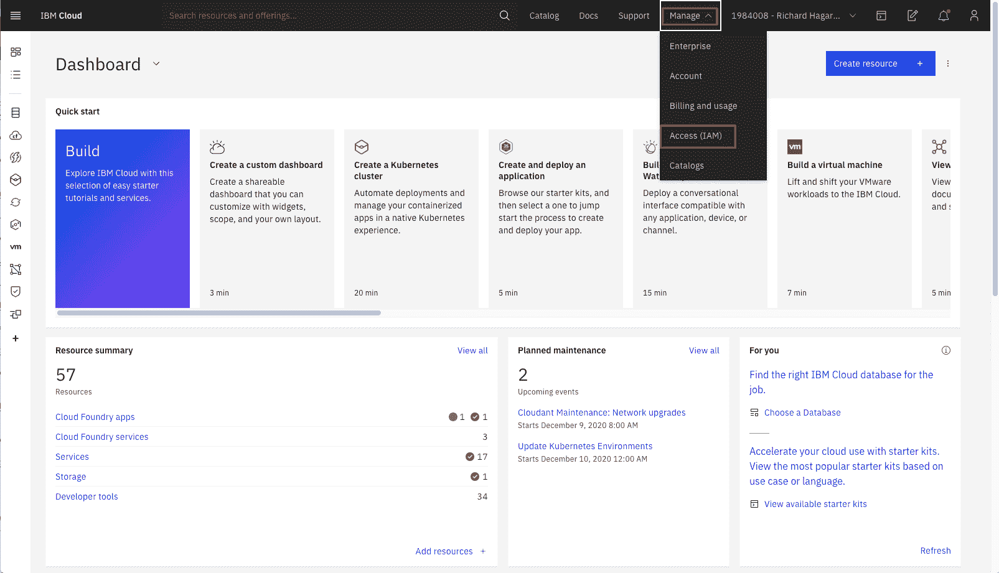

2.  单击 **Create an IBM Cloud API key**。输入密钥的名称，然后单击 **Create**。

    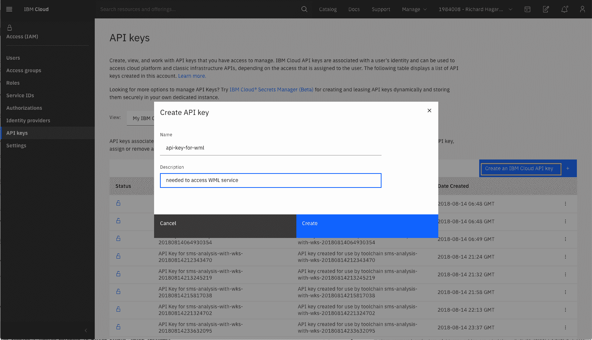

3.  复制该 API 密钥，因为在运行 Notebook 时需要使用此密钥。

> **重要事项**：生成的 API 密钥是临时的，将在几分钟后消失，因此在需要将其导入到 Notebook 中时，务必要复制并保存该密钥值。

您还必须确定 Watson Machine Learning 服务的位置。一种确定方法是从 IBM Cloud 仪表板的资源列表中单击该服务。从 **Manage** 中，单击 **Details**。

在此例中，该服务位于达拉斯（相当于 us-south 区域）。

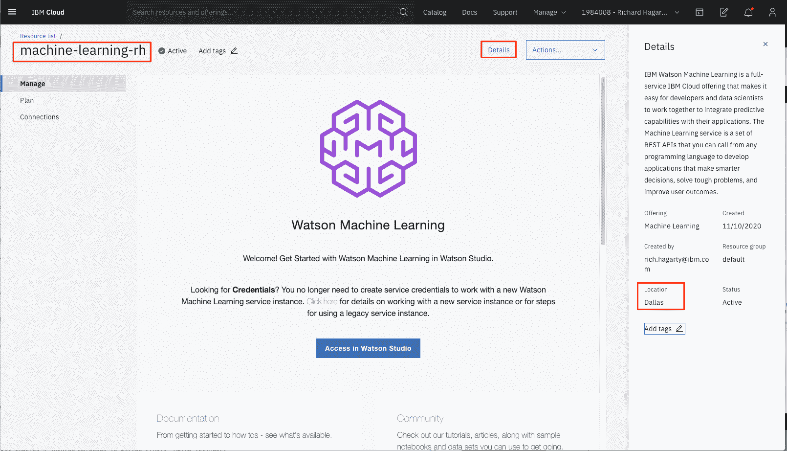

> **注意**：当前区域包括：au-syd、in-che、jp-osa、jp-tok、kr-seo、eu-de、eu-gb、ca-tor、us-south、us-east 和 br-sao。

### 创建部署空间

在 Notebook 中部署模型时，需要一个部署空间。要创建部署空间，可从 Watson Studio 菜单的 **Deployments** 菜单中选择 **View all spaces**。

> **注意**：您可能会注意到，以下截屏具有字段“IBM Cloud Pak for Data”，而不是“IBM Watson Studio”。此字段取决于您在 IBM Cloud 帐户中创建的服务数量。达到特定阈值后，字段将切换为“IBM Cloud Pak for Data”。

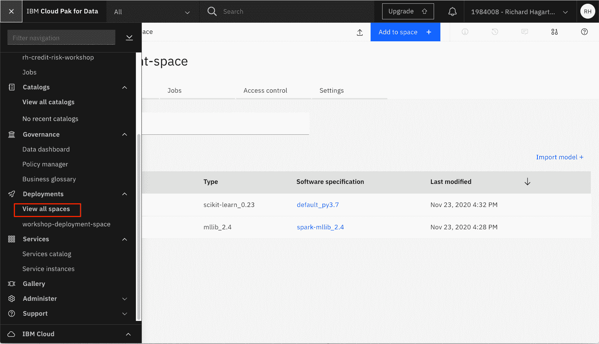

1.  单击 **New Deployment Space +** 来创建部署空间。

    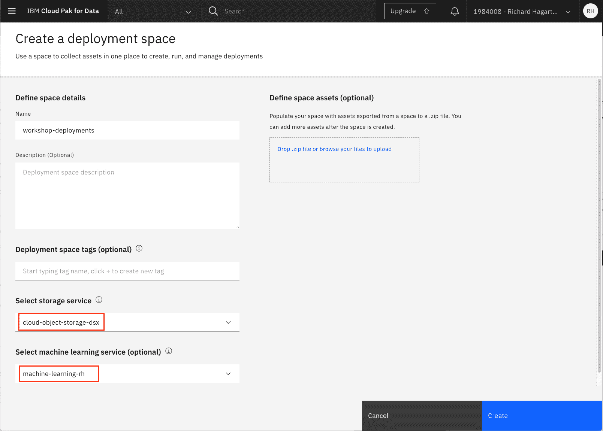

2.  确保向该空间分配了存储服务和机器学习服务。

3.  创建完毕后，单击 **Settings** 选项卡来查看 **Space ID**。必须将该值导入到 Notebook 中。

    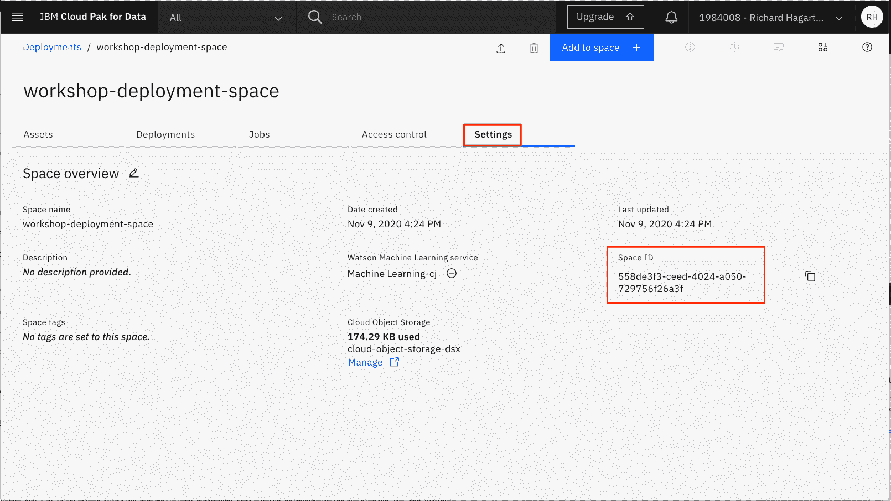

### 创建 Notebook

创建一个用于预测客户流失率的 Jupyter Notebook，并将其更改为使用已上传到项目中的数据集。

1.  在 **Asset** 选项卡中，单击 **Add to Project**。

    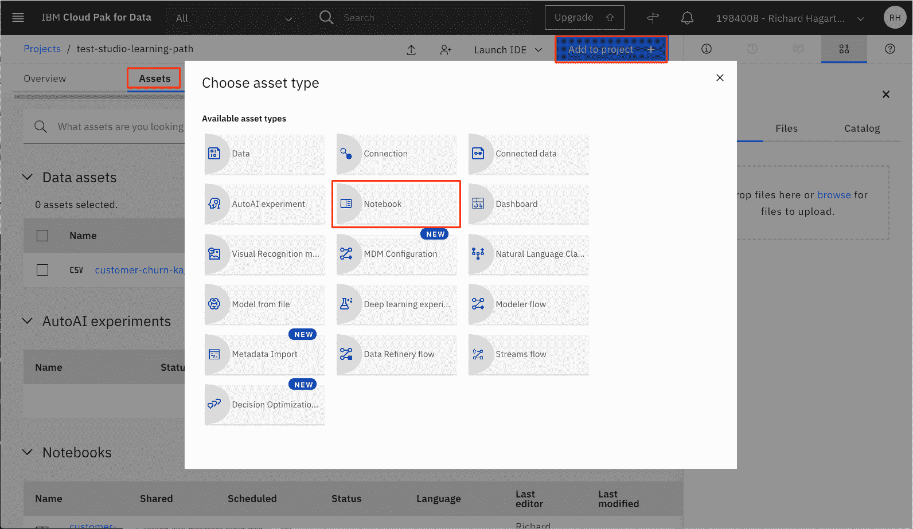

2.  选择 **Notebook** 资产类型。

3.  在 **New Notebook** 页面上，按如下方式配置 Notebook：

    1.  选择 **From URL** 选项卡：

        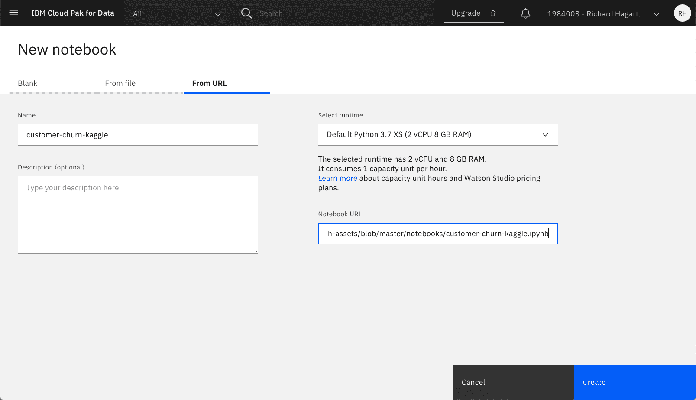

    2.  输入 Notebook 的名称（例如，“customer-churn-kaggle”）。

    3.  选择 **Python 3.7** 运行时系统

    4.  为 Notebook 输入以下 URL：

        ```
         https://github.com/IBM/watson-studio-learning-path-assets/blob/master/notebooks/customer-churn-kaggle.ipynb 
        ```

    5.  单击 **Create**。这将开始在 IBM Watson Studio 中加载和运行 Notebook。

### 运行 Notebook

应该会显示 Notebook 页面。

如果 Notebook 当前没有打开，您可通过单击项目 Asset 页面中 Notebook 旁边显示的 Edit 图标来将其启动：

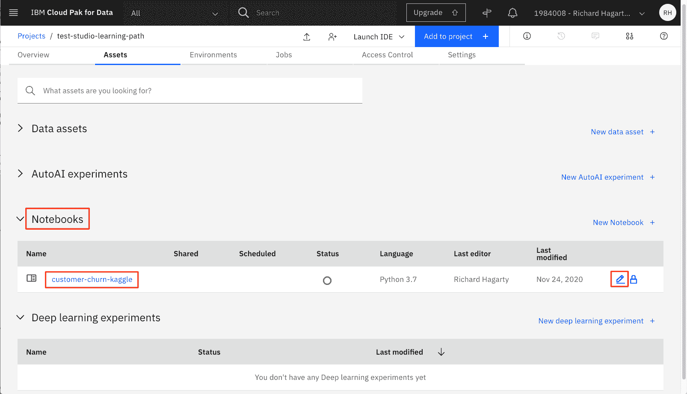

> **注意**：如果您在完成 Notebook 执行步骤时遇到任何问题，可以在以下 URL 中找到完整 Notebook 以供参考：[`github.com/IBM/watson-studio-learning-path-assets/blob/master/examples/customer-churn-kaggle-with-output.ipynb`](https://github.com/IBM/watson-studio-learning-path-assets/blob/master/examples/customer-churn-kaggle-with-output.ipynb)。

在 Notebook 页面中，执行以下更改：

1.  向下滚动到第三个单元格，然后选择该单元格中间的空行。如果尚未打开，可单击页面上方的 **1001** 数据图标以打开 Files 子面板。

    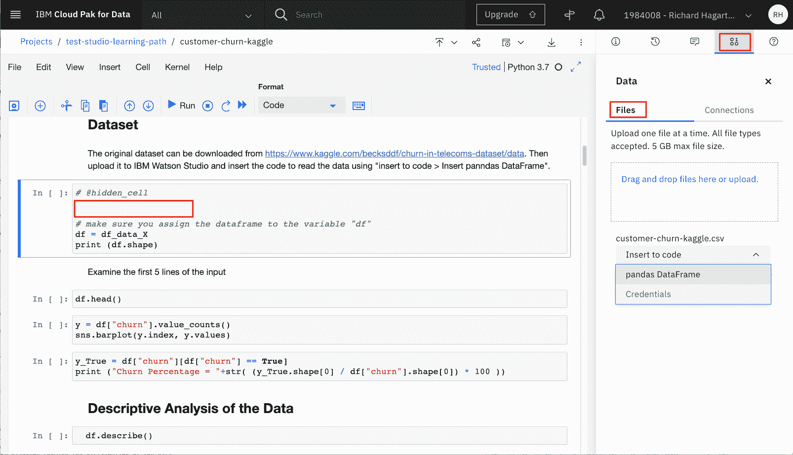

2.  在页面右侧，选择 **Customer Churn** 数据集。单击 **insert to code**，然后选择 **pandas DataFrame**。这会将代码添加到数据单元格中，以便将数据集读入 pandas 数据框中。

    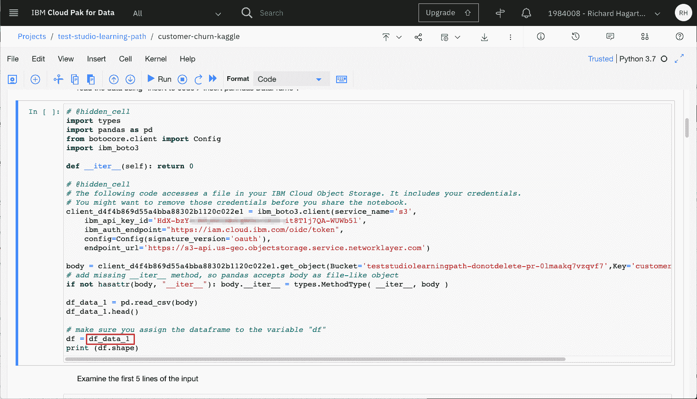

3.  将生成的数据框变量名称分配给 **df**（将在 Notebook 的其余部分中使用此变量）。Notebook 中显示的数据框如下所示：

    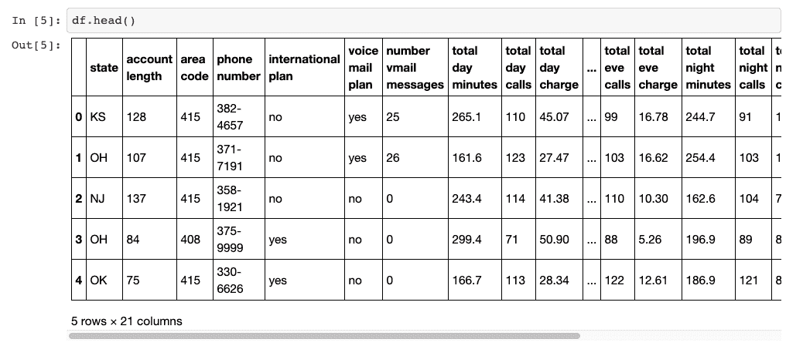

4.  选择 **File > Save** 来保存该 Notebook。

逐个运行该 Notebook 的各个单元，然后观察效果以及该 Notebook 的定义方式。

#### 运行 Notebook 的背景

运行 Notebook 时，该 Notebook 中的各个代码单元将按从上到下的顺序依次执行。

可以选择每个代码单元，并在代码单元前面的左侧空白处添加一个标记。标记格式为 `In [x]:`。根据 Notebook 的状态，`x` 可以为：

*   空白，表示该单元从未运行过
*   数字，表示运行此代码步骤的相对顺序
*   `*`，表示正在运行该单元

可通过多种方式来运行 Notebook 中的代码单元：

*   一次执行一个单元。选择单元，然后单击工具栏中的 **Play**。
*   批处理模式，按顺序执行。**Cell** 菜单中提供了多个选项。例如，您可以使用 `Run All` 选项来运行 Notebook 中的所有单元，也可以使用 `Run All Below` 选项，即从当前选定单元下的第一个单元开始运行，然后继续运行后面的所有单元。
*   按计划的时间执行。按下 Notebook 页面右上部分中的 **Schedule** 按钮。您可以在此处将 Notebook 安排在将来的某个时间运行一次，也可以按指定的时间间隔重复运行。

### 数据理解和可视化

在数据理解阶段，将收集初始数据集。该阶段将继续执行可让您熟悉数据、识别数据质量问题以及发现对数据的初步洞察的活动。在 Jupyter Notebook 中，使用 pandas 以及 pandas 的具体 `matplotlib` 函数来完成这些活动。pandas 的 `describe` 函数用于生成特征的描述性统计信息，而 `plot` 函数用于生成数据分布图。

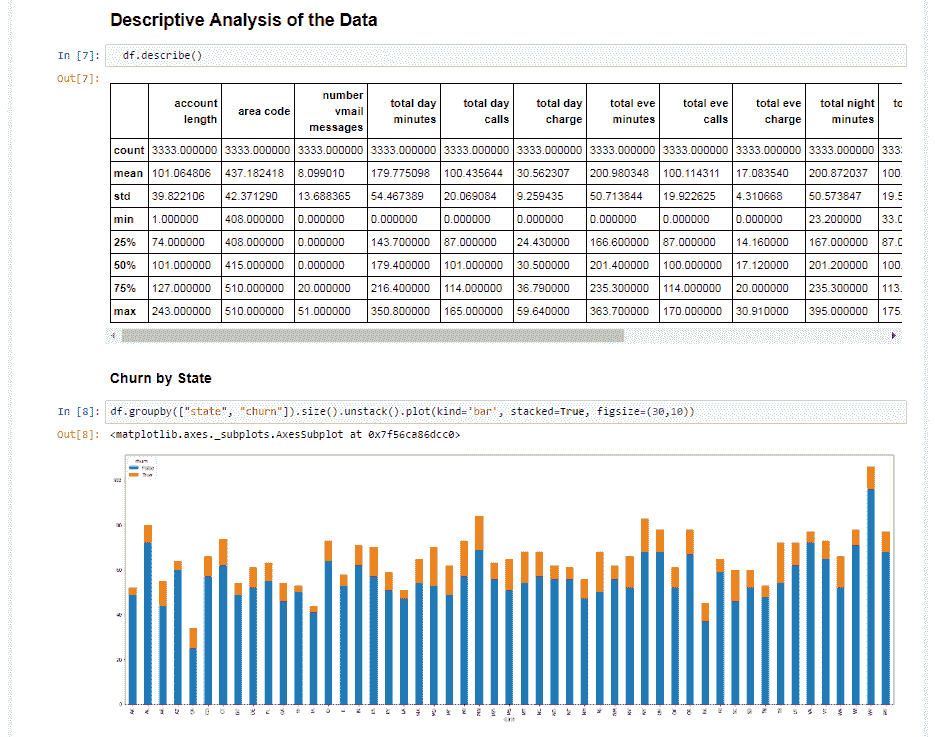

### 数据准备

数据准备阶段涵盖了构建最终数据集所需的所有活动，该最终数据集将提供给机器学习服务。数据准备任务可能会多次执行，而不是按任何规定的顺序执行。任务包括选择表格、记录和属性以及转换和整理用于建模工具的数据。在 Jupyter Notebook 中，这涉及将分类特征转换为数字特征，将特征规范化，并移除与预测无关的列（例如，客户电话号码）。下图显示了操作子集。

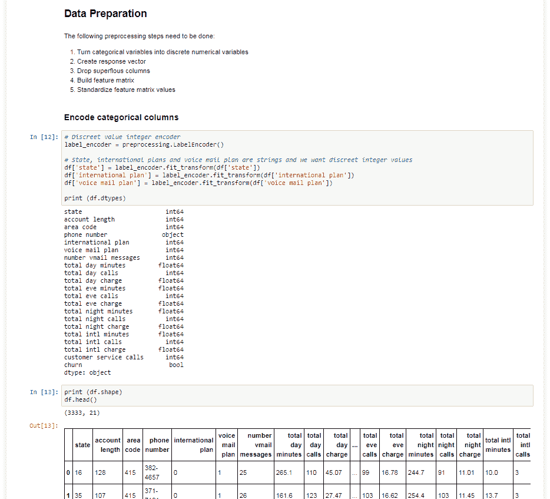

### 建模和评估

在建模阶段，选择并应用各种建模方法，然后对其参数进行校准以便实现最佳预测。通常可以应用多种方法，而且某些方法还对数据格式有特定的要求。因此，通常需要返回到数据准备阶段。但是，在模型评估阶段，目标是从数据分析角度构建高质量的模型。在继续进行模型的最终部署之前，重要的是要彻底评估它，并复查要执行的步骤，确保模型能够正确实现业务目标。

在 Jupyter Notebook 中，这涉及将数据集拆分为训练数据集和测试数据集（使用分层交叉验证），然后使用不同的分类算法（例如 `GradientBoostingClassifier`、支持向量机、随机森林和 K 近邻）来训练多个模型。

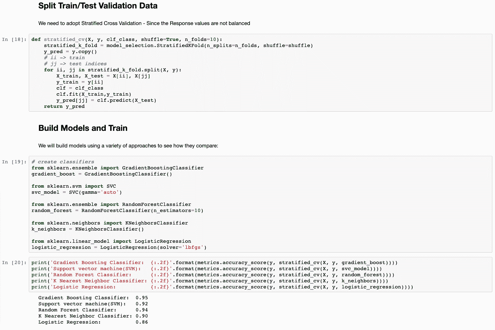

完成此步骤后，我们将继续显示每种算法的混淆矩阵，以更您深入了解模型的准确性和精确度。

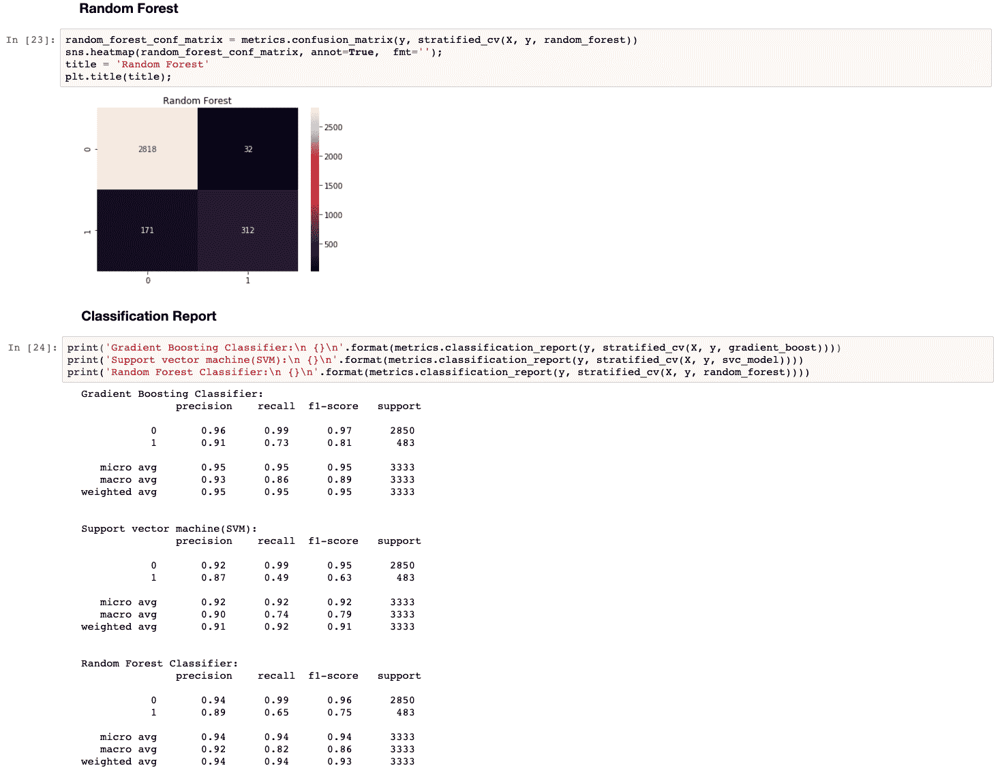

### 将模型部署到 Watson Machine Learning

在该 Notebook 的最后一部分中，我们将模型保存并部署到 Watson Machine Learning 服务中。

在先前的步骤中，您创建了一个 API 密钥，我们将使用该密钥来连接到 Watson Machine Learning 服务。复制该 API 密钥及其位置，以便授权使用 Watson Machine Learning 服务。

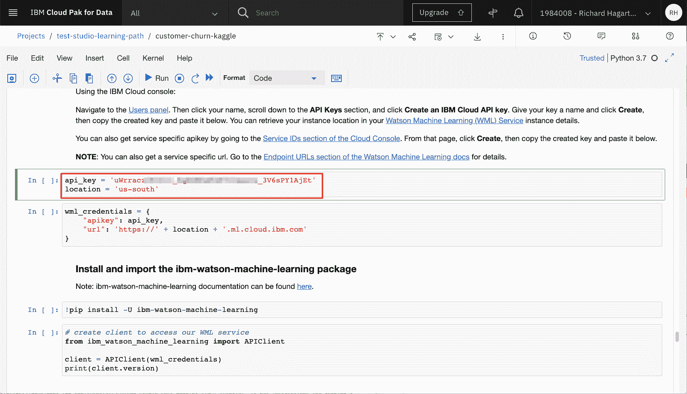

要部署模型，必须定义要使用的部署空间。复制您先前创建的 **Deployment Space ID**。

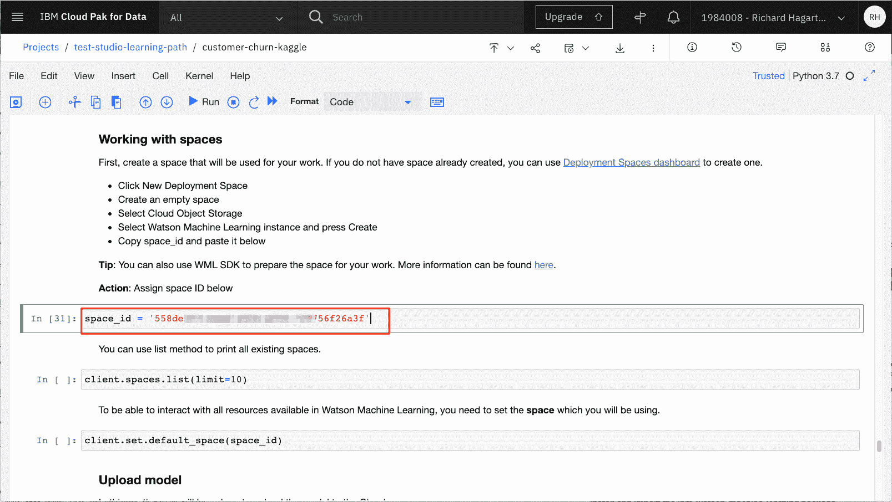

在将模型保存并部署到 Watson Machine Learning 后，可以使用多种方式来访问该模型。

在 Jupyter Notebook 中，可以将数据传递到模型评分端点，以便对其进行测试。

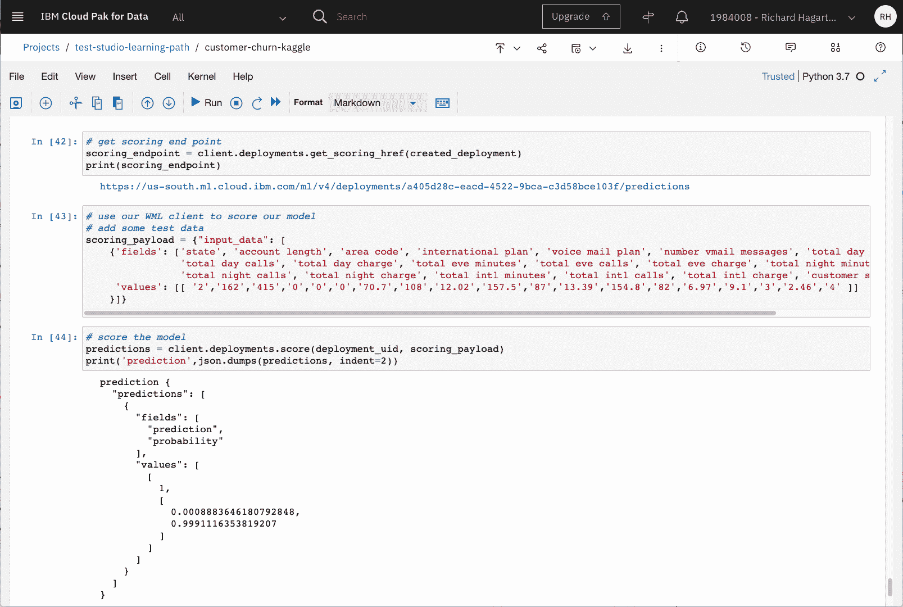

如果返回到 Watson Studio 控制台，那么可以在 **Deployment Space** 的 **Assets** 选项卡中看到新模型出现在 **Models** 部分中。

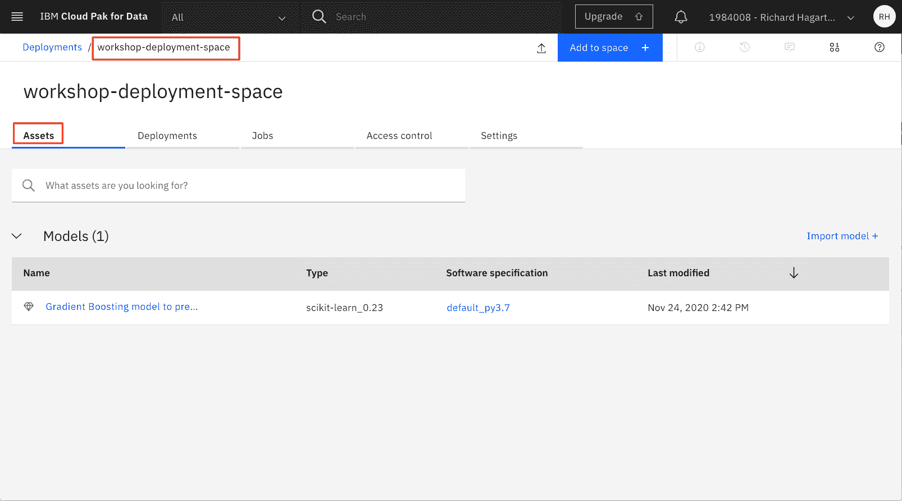

如果单击 **Deployments** 选项卡，那么可以看到该模型已成功部署。

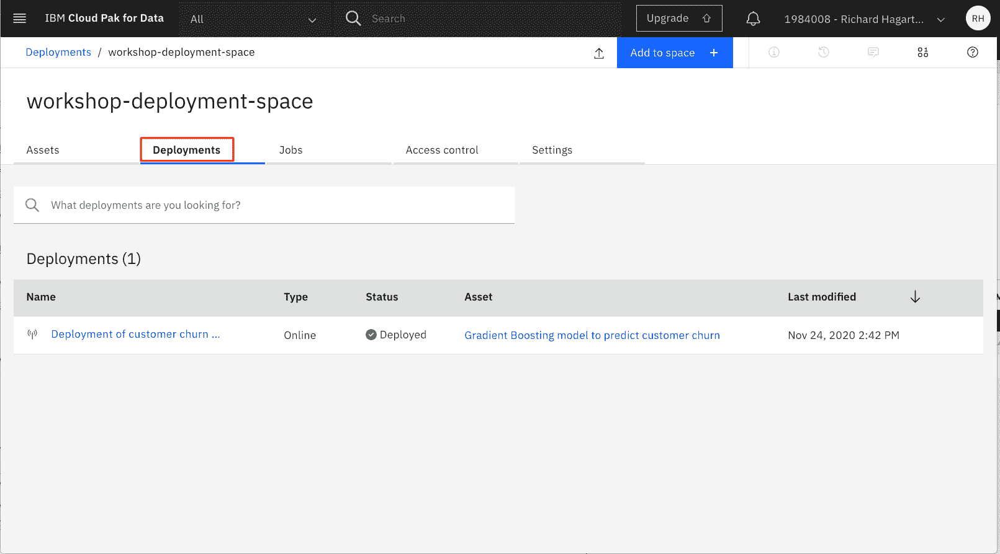

单击此部署以获取更多详细信息。如果单击 **API reference** 选项卡，那么您将会看到评分端点。在 **Code Snippets** 部分中，您可以看到有关如何以编程方式访问评分端点的示例。

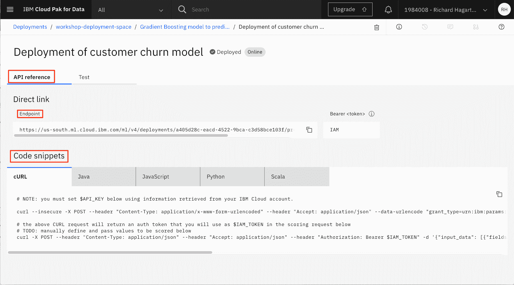

在 **Test** 选项卡上，可以传入一个评分有效负载 JSON 对象来对模型进行评分（类似于我们在 Notebook 中所做的那样）。在提供数据后，按下 **Predict** 来对模型进行评分。

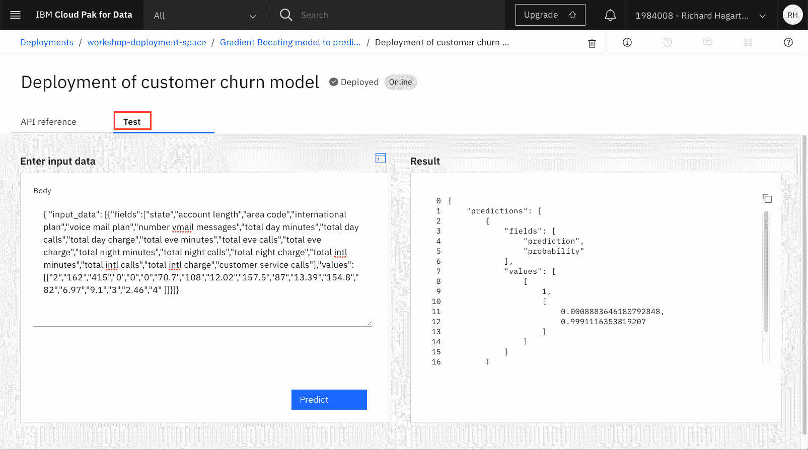

下面是您在 input data 主体中输入的值：

```
{ "input_data": [{"fields":["state","account length","area code","international plan","voice mail plan","number vmail messages","total day minutes","total day calls","total day charge","total eve minutes","total eve calls","total eve charge","total night minutes","total night calls","total night charge","total intl minutes","total intl calls","total intl charge","customer service calls"],"values":[["2","162","415","0","0","0","70.7","108","12.02","157.5","87","13.39","154.8","82","6.97","9.1","3","2.46","4" ]]}]} 
```

### **SPSS 模型 Notebook**

现在您已学会了如何在 Watson Studio 中创建和运行 Jupyter Notebook，此时可以重新访问 [SPSS Modeler Flow](https://developer.ibm.com/zh/tutorials/watson-studio-spss-modeler-flow) 教程中的 `Scoring machine learning models using the API` 部分。此部分中提供了有关运行 Notebook 的说明，该 Notebook 可以访问您在 Watson Studio 中部署的 SPSS 模型并对其进行评分。

## 结束语

本教程介绍了在 Watson Studio 中运行 Jupyter Notebook 的基础知识，其中包括：

*   创建项目
*   为项目配置和分配服务
*   向项目添加资产（如数据集）
*   将 Jupyter Notebook 导入到项目中
*   加载并运行 Notebook

此 Notebook 用于构建一个机器学习模型，以便使用 Jupyter Notebook 来预测客户流失率。此[学习路径](https://developer.ibm.com/series/learning-path-watson-studio/)中的其他教程将讨论几种备用的非编程方法，即，使用 Watson Studio 内置的工具和功能来实现相同目的。

本文翻译自：[Build models using Jupyter Notebooks in IBM Watson Studio](https://developer.ibm.com/tutorials/watson-studio-using-jupyter-notebook/)（2020-11-25）