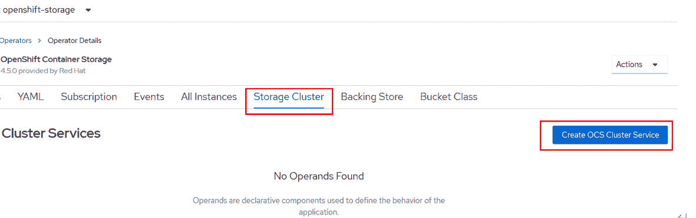
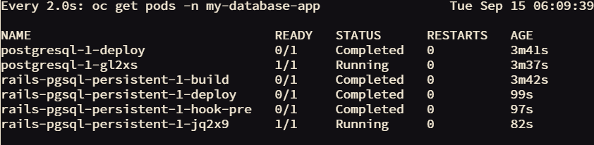

# 构建基于 Ceph 的容器原生存储

> 原文：[`developer.ibm.com/zh/tutorials/cl-lo-ceph-based-container-native-storage/`](https://developer.ibm.com/zh/tutorials/cl-lo-ceph-based-container-native-storage/)

## 前言

在容器云如 OpenShift 中，Pod 会被经常性的创建和销毁，也会在不同的主机之间快速的迁移。为了保证容器在重启或者迁移以后能够使用原来的数据，就必须使用持久化存储。因此，持久化存储的管理对于 PaaS 平台来说就显得非常重要。

Kubernetes/OpenShift 通过 PV/PVC 管理持久化存储。PV 分为动态 PV 和静态 PV。如果使用静态 PV，就需要手工创建 PV 或者预先创建大量的 PV 闲置。在生产中，这种方式会给运维带来极大的困扰，因此我们推荐使用动态 PV。接下来本文介绍如何基于 Ceph 实现容器原生存储，从而实现动态 PV。

为了实现容器存储接口标准化，开源界提出 Container Storage Interface（简称 CSI）。CSI 旨在提供一种标准，让块存储和文件系统在符合这种标准的情况下，可以为 Kubernetes 上的容器化提供持久存储。随着 CSI 的采用，Kubernetes 存储层变得真正可扩展。使用 CSI，第三方存储提供商可以编写和部署插件，发布支持 Kubernetes 的存储系统，而无需触及核心 Kubernetes 代码。CSI 为 Kubernetes 用户提供了更多存储选项，使容器中的应用系统更加安全可靠。

Ceph 从 v14 开始支持 CSI。也就是说，从 v14 版本开始，OpenShift 访问 Ceph 必须要通过 CSI Driver。我们在部署 Ceph 集群时，CSI Driver 是不会被自动部署的，需要手工安装 CSI Driver，步骤较为复杂、也不利于运维。出于便于 Kubernetes 纳管 Ceph 的目的，开源社区提出了 Rook 项目。

[Rook](https://rook.io/) 是一个开源项目，红帽是 Rook 项目的顶级代码贡献商之一。Rook 以 Operator 提供，它可以实现 Ceph 的部署、配置、供应、扩展、升级、迁移、灾难恢复、监视和资源管理自动化。红帽 OpenShift Container Storage 就是通过 Rook 纳管 Ceph 实现的。

## 前提条件

要完成本教程，您需要以下环境：

*   一套 Red Hat OpenShift4.5 集群
*   OpenShift 集群需要能够访问互联网；如果不能访问外网，就需要离线导入 OpenShift Container Storage Operator 及其相关的容器镜像。

## 预估时间

在满足前提条件后，完成本教程大约需要 30 分钟。

## 步骤

1.  OpenShift Container Storage 架构
2.  安装 OpenShift Container Storage Operator
3.  创建存储集群
4.  使用 OCS rbd 的持久化空间创建应用
5.  使用 CephFS 的持久化空间创建应用
6.  OCS Operator 对接外部存储

## OpenShift Container Storage 架构

基于 Ceph 和 Rook，红帽构建了 OpenShift Container Storage 方案（简称 OCS）。OCS 是 Rook 和 Ceph 的企业级解决方案，其架构如下图 1 所示：

##### 图 1\. OCS 架构图


从上图我们可以看出，OCS 的组件都是以 pod 方式运行在 OpenShift 中，pod 的具体作用后文会展开说明。

OCS 有两种工作模式：

*   内置模式：把 OCS 整体（OCS Operator 和 Ceph 集群）部署在 OpenShift 集群中，利用 OpenShift 的本地存储空间做 Ceph 存储空间。这种模式部署、使用方便，适合开发测试和 PoC 环境。
*   外置模式：在 OpenShift 上部署 OCS operator、对接在外部物理机上安装的 Ceph。然后 OpenShift 以 OCP 中的 Rook 方式，管理外部物理机上的 Ceph。外置模式的优势是实现了 OpenShift 和存储的解耦，而且存储性能也较高，适合生产环境。

在介绍了 OCS 的架构后，接下来我们介绍 OCS 的部署步骤。

### 安装 OpenShift Container Storage Operator

在 OpenShift 的 Operator Hub 中找到 OpenShift Container Storage Operator，如下图 2 所示：

##### 图 2\. 选择 OCS Operator


目前 OCS 的版本为 4.5.0，如下图 3 所示，我们点击“Install”进行安装：

##### 图 3\. 选择 OCS Operator


我们选择 OCS 的 4.5 的 Update Channel、选择将 OCS Operator 部署在 openshift-storage Namespace 中，如下图 4 所示：

##### 图 4\. 选择 OCS Operator 的安装参数


很快，OCS Operator 部署成功，该 Operator 会提供三个 API：Storage Cluster、Backing Store、Bucket Class，如下图 5 所示：

##### 图 5\. OCS Operator 安装成功


OCS Operator 安装成功后，会在 openshift-storage 项目中部署三个 Operator：

```
# oc get pods -n openshift-storage
NAME                                  READY   STATUS    RESTARTS   AGE
noobaa-operator-5c6dcb944b-8cds4      1/1     Running   0          42s
ocs-operator-56d4d7ddc7-4qfxq         1/1     Running   0          45s
rook-ceph-operator-7b46bff769-t9h8c   1/1     Running   0          45s 
```

### 创建存储集群

使用 OCS Operator 中的 Storage Cluster API 创建存储集群，如下图 6 所示：

##### 图 6\. 创建存储集群



如前文所述，OCS 有 Internal 和 External 两种模式。我们先选择 Internal 模式，如下图 7 所示：

##### 图 7\. 创建存储集群


选择 Internal 模式后，OCS 会列出 OpenShift 集群中可创建存储集群的节点。需要注意的是，OCS 要求加入存储集群的 OpenShift 节点，至少 16 CPUs 和 64 GiB 内存，节点至少选择三个，且不在一个故障域中。我们选择 3 个 OpenShift 节点，如下图 8 所示：

##### 图 8\. 选择节点


存储空间选择 2TB，这代表三个存储节点，每个 2TB，做三副本，如下图 9 所示：

##### 图 9\. 查看 OCS 相关 pod


存储集群创建后，会在 openshift-storage 项目中部署对应的 pod，以 CSI 开头的 pod 为 CSI Driver 相关的 Pod，因此使用 OCS 我们不必单独安装 CSI Driver；以 rook 开头的 pod 为被 Rook 纳管的、容器化 Ceph 组件，如下图 10 所示：

##### 图 10\. 查看 OCS 相关 pod


所有 pod 部署完毕后，在 OpenShift 中查看存储集群，已经部署成功：

```
# oc get storagecluster -n openshift-storage
NAME             AGE   PHASE        EXTERNAL   CREATED AT             VERSION
ocs-storagecluster   39m   Ready                          2020-10-11T14:20:27Z        4.5.0 
```

查看 storagecluster 对象中的内容，看到集群有 2T 空间（每个存储节点节点 2TB，三副本），如下图 11 所示：

##### 图 11\. 查看存储集群


查看 StorageClass，OCS 新创建了三个 StorageClass，分别为 ceph-rbd、cephfs、ceph-rgw，如下图 12 所示：

##### 图 12\. 查看新创建的 StorageClass


接下来，我们查看 ceph-rbd、cephfs 这两个 StorageClass 的相关内容：

查看 rbd 这个 StorageClass，我们看到其相关的参数和这个 StorageClass 对应的 pool，如下图 13 所示：

##### 图 13\. 查看新创建的 StorageClass 内容


查看 cephfs 的 StorageClass，这个 StorageClass 不对应 pool，而是对应 fs，可以看到 fsName，如下图 14 所示：

##### 图 14\. 查看新创建的 StorageClass 内容


如果我们想要从 Ceph 集群角度查看集群的状态和资源，我们使用 Rook-Ceph 工具检查 Ceph 集群。Rook-Ceph 工具需要手工部署：

```
#oc patch OCSInitialization ocsinit -n openshift-storage --type json --patch  '[{ "op": "replace", "path": "/spec/enableCephTools", "value": true }]' 
```

在 rook-ceph-tools Pod 运行之后，采用如下方法访问工具： 首先设置变量：

```
#TOOLS_POD=$(oc get pods -n openshift-storage -l app=rook-ceph-tools -o name) 
```

登录工具 pod：

```
#oc rsh -n openshift-storage $TOOLS_POD 
```

登录工具 pod 后，就可以使用 Ceph 命令行来检查存储集群。 我们可以看到集群的健康状态、monitor、manager、mds 的状态，如下图 15 所示：

##### 图 15\. 查看新创建的 StorageClass 内容


查看 Ceph 集群 osd 状态，我们看到 Ceph 集群中一共有三个 OSD 节点，每个节点提供 2T 存储空间，如下图 16 所示：

##### 图 16\. 查看 Ceph 集群存储节点


查看存储空间的使用情况，可以看到 rbd pool 和 CephFS 的使用情况，如下图 17 所示：

##### 图 17\. 查看 Ceph 集群空间使用情况


查看 Ceph 版本，为 v14.2.8，如下图 18 所示：

##### 图 18\. 查看 Ceph 版本


在成功部署了 OCS 以后，我们接下来介绍如何基于 OCS 的存储空间创建应用。

### 使用 OCS rbd 的持久化空间创建应用

接下来，我们在 OpenShift 中使用 `ocs-storagecluster-ceph-rbd` 存储类来创建 RWO（ReadWriteOnce）持久性存储，给新建的应用使用。

我们使用 `rails-pgsql-persistent` 模板在 OpenShift 上部署应用（包含前端应用和一个数据库）。该模板包含一个参数 `STORAGE_CLASS`，在部署应用时，我们通过这个参数指定 PVC 使用的 `STORAGE_CLASS`。

首先创建项目： `oc new-project my-database-app` 通过模板创建应用，指定使用名为 `cs-storagecluster-ceph-rbd 的 StorageClass`，所需空间大小为 5Gi。

```
#oc new-app -f /opt/app-root/src/support/ocslab_rails-app.yaml -p STORAGE_CLASS=ocs-storagecluster-ceph-rbd -p VOLUME_CAPACITY=5Gi 
```

查看应用的部署情况：前端应用和后端 postgres 数据库都已经部署成功，如下图 19 所示：

##### 图 19\. 查看成功部署的应用



我们查看 PVC，已经和 pv 自动完成 bound，如下图 20 所示。这个 PV 是 OCS 根据部署应用时指定的容量和读写模式最终在 Ceph 存储上自动创建的 rbd volume。

##### 图 20\. 查看 pvc


接下来，我们从 Ceph 存储集群角度，确认 OCS 自动创建的 rbd 卷。

再次登录到 ceph 工具。

```
#TOOLS_POD=$(oc get pods -n openshift-storage -l app=rook-ceph-tools -o name)
#oc rsh -n openshift-storage $TOOLS_POD 
```

我们先获取 rbd storage pool 的名称。如下图 21 所示，为 `ocs-storagecluster-cephblockpool`。

##### 图 21\. 查看 rbd storage pool


查看 storage pool 中 volume，如下图 22 所示：

##### 图 22\. 查看 rbd volume


如果想确认我们刚部署的应用具体使用哪个 volume，使用如下脚本：

```
#CSIVOL=$(oc get pv $(oc get pv | grep my-database-app | awk '{ print $1 }') -o jsonpath='{.spec.csi.volumeHandle}' | cut -d '-' -f 6- | awk '{print "csi-vol-"$1}')
#echo $CSIVOL 
```

从下图 23 输出中，我们可以看到，postgres 数据库使用的 PV 对应的 rbd volume 为：csi-vol-85766b1b-f719-11ea-b9a2-0a580a830405，如上图 24 所示的第一个 volume。

##### 图 23\. 查看数据库使用的 rbd volume


我们可以使用如下脚本查看 rbd volume 的具体信息，可以看到卷的大小，如下图 24 所示：

```
TOOLS_POD=$(oc get pods -n openshift-storage -l app=rook-ceph-tools -o name)
oc rsh -n openshift-storage $TOOLS_POD rbd -p ocs-storagecluster-cephblockpool info $CSIVOL 
```

##### 图 24\. 查看 rbd volume 的信息


### 使用 CephFS 的持久化空间创建应用

使用 RBD 创建的 PV，只能被一个 pod 读写。但有些时候，我们需要存储提供可被多个 pod 共享的持久化存储，这就需要使用 RWX（ReadWriteMany）模式的 PVC。接下来我们通过使用 `ocs-storagecluster-cephfs StorageClass`，创建可同时由多个 Pod 使用的存储空间。

首先部署示例 PHP 应用程序，称为 file uploader：

```
#oc new-app openshift/php:7.2~https://github.com/christianh814/openshift-php-upload-demo --name=file-upload 
```

应用部署成功后，如下图 25 所示。我们此时部署的应用，是没有持久化存储的。

##### 图 25\. 查看部署成功的 pod


为应用创建路由，并将应用的副本数增加到 3：

```
#oc expose svc/file-uploader -n my-shared-storage
#oc scale --replicas=3 dc/file-uploader 
```

接下来，我们指定使用 ocs-storagecluster-cephfs 存储类创建一个 PersistentVolumeClaim，并使用 `oc set volume` 命令将其附加到应用程序中，并制定 PVC 需要的存储空间大小、读写模式：

```
#oc set volume dc/file-uploader --add --name=my-shared-storage \
-t pvc --claim-mode=ReadWriteMany --claim-size=1Gi \
--claim-name=my-shared-storage --claim-class=ocs-storagecluster-cephfs \
--mount-path=/opt/app-root/src/uploaded \ 
```

获取应用的路由：

```
#oc get route file-uploader -n my-shared-storage -o jsonpath --template="{.spec.host}" 
```

通过浏览器访问应用，如下图 26 所示，可以上传文件，将应用 pod 重启后，上传的文件仍在，证明文件被存入到持久化存储中。由于篇幅有限，具体步骤不展开说明。

##### 图 26\. 浏览器访问应用


### OCS Operator 对接外部存储

在创建存储集群时，选择外部存储，界面会提示下载一个 Python 脚本，如下图 27 所示：

##### 图 27\. OCS Operator 对接外部存储


我们将这个脚本在外置的 ceph 的 mon 的节点上执行：

首先查看脚本的使用帮助：

```
#python ceph-external-cluster-details-exporter.py --help 
```

在下面的命令中，rbd-data-pool-name 指定要创建的 pool 的名称；rgw-endpoint 指定 Ceph 集群对象网关地址：

```
#python ceph-external-cluster-details-exporter.py --rbd-data-pool-name abc --rgw-endpoint 192.168.18.203:8080 
```

命令执行后，会以 json 格式返回一大串输出结果，我们将结果粘贴到上图的所示的空白处，即可完成添加。后续的操作步骤与内置模式类似，因此不再展开说明。

## 结束语

通过本文，相信您对容器原生存储有了一定的了解。通过 OCS OpenShift 可以方便地使用持久化存储，解决了容器云使用持久化存储在运维方面的困扰。随着容器云的普及，相信 OCS 的应用场景将会越来越广。