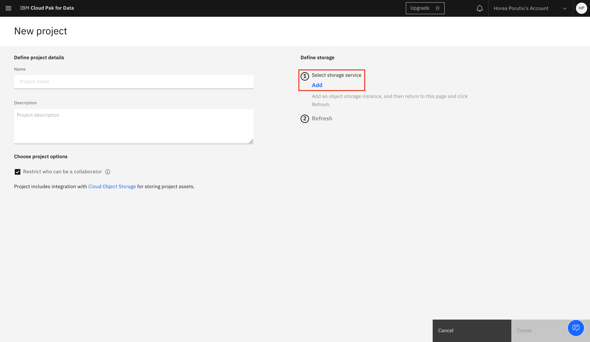

# 通过决策优化基于成本和产能优化工厂选择

> 原文：[`developer.ibm.com/zh/tutorials/optimize-inventory-based-on-demand-with-decision-optimization/`](https://developer.ibm.com/zh/tutorials/optimize-inventory-based-on-demand-with-decision-optimization/)

该用例是基于门店经理角色创建的。该经理拥有需求方面的信息，希望通过最小化配送成本来优化库存。有许多子工厂可供选择，每个工厂都有各自的产能和成本。目标是在确保满足需求的同时最大限度地降低总成本。

在先前教程中，您已使用 [IBM SPSS® Modeler 构建一个可预测需求的模型](https://developer.ibm.com/zh/tutorials/predict-future-demand-using-spss-modeler)。在本教程中，您将根据需求，并参考有关子工厂的其他信息（例如生产成本和产能），实现将总成本降至最低的目标。

## 学习目标

在本教程中，您将探索以下关键功能：

*   如何构建优化模型
*   模型构建器，指导您完成典型的优化开发步骤
*   用于传达优化模型结果的仪表板

## 前提条件

要学习本教程，必须满足以下先决条件：

*   一个 [IBM® Cloud 帐户](https://cloud.ibm.com/registration?cm_sp=ibmdev-_-developer-tutorials-_-cloudreg)
*   [IBM Cloud Pak® for Data](https://www.ibm.com/cn-zh/products/cloud-pak-for-data) or [IBM Watson Studio](https://www.ibm.com/cloud/watson-studio)
*   [IBM Watson® Machine Learning Service](https://www.ibm.com/cn-zh/cloud/machine-learning)

## 预估时间

完成本教程大约需要 35 – 45 分钟。

## 决策优化简介

本部分介绍了决策优化，它使您能够从许多输入变量及其对输出的影响中选择最佳的操作过程。如果您熟悉决策优化和优化问题，那么可以跳至步骤。决策优化功能作为 IBM Cloud 上的 IBM Watson Studio 和 IBM Cloud Pak for Data 的 IBM Watson Studio Premium 的一部分提供，支持多数据流环境。


### 如何使用决策优化来获得最佳解决方案

获得最佳决策有五个主要步骤。但是，通过使用决策优化，您只需关心前两个步骤。您希望将业务问题表述为优化问题。这意味着您必须创建数据表来表示您的业务问题。

### 什么是优化问题？

优化问题是指从所有可能的解决方案中找到最佳解决方案的问题。您可以通过定义目标、约束和决策变量来做到这一点。


### 什么是优化模型？

您必须创建一个优化模型，确保您的 CPLEX 优化引擎知道如何解决您想要解决的问题。根据以下方面定义优化模型：

*   目标、决策变量和约束
*   用于解决模型实例的优化引擎
*   用于创建模型实例的数据

### 什么是目标？

目标就是您要尝试解决的问题。例如，最大限度地提高利润或最大限度地降低成本，就像本例中的案例一样。

### 什么是约束？

约束是指为获得最佳解决方案，问题必须满足的条件。在本例中，您受子工厂产能的限制。产能（或工厂可生产的最大单位数）在这里就是约束。

### 什么是决策变量？

决策变量就是决策者控制的数量。在这种情况下，决策者是 CPLEX 优化引擎，它控制的数量就是特定工厂要生产的每种产品的数量。

### 优化用例

优化的一些主要用例是：基于风险回报的投资组合分配、人力资源分配以及确定哪个工厂应该生产哪种产品（这是本教程的重点）。


## 步骤

1.  创建 Watson Studio 服务
2.  创建项目
3.  创建决策优化试验
4.  创建部署空间
5.  克隆存储库
6.  准备数据
7.  准备模型
8.  添加目标
9.  添加约束
10.  探索解决方案
11.  部署模型
12.  导入中间方案

### 创建 Watson Studio 服务

1.  登录到您的 IBM Cloud 帐户。以下演示了如何创建 IBM Watson Studio 服务。

    

2.  登录至 IBM Cloud，然后单击 **Proceed** 以显示您已阅读数据权限。

3.  单击左上角的 **IBM Cloud**，确保您位于主页上。

4.  在您的 IBM Cloud 帐户中，单击搜索栏以搜索 IBM Cloud 服务和产品。输入 `Watson Studio`，然后单击 Catalog Results 下的 **Watson Studio**。

    这将转至 Watson Studio 服务页面。您可以在此处命名服务。例如，您可以将其命名为 Watson-Studio-trial。您还可以选择要在其中创建实例的数据中心。该演示展示了在达拉斯市创建的此用例的一个服务。

5.  选择 **Lite** 服务，该服务是免费的。虽然计算能力有限，但足以理解服务的主要功能。

6.  如果您不想对服务名称、位置和套餐进行修改，则单击 **Create**。这将创建您的 Watson Studio 实例。

7.  转至 [`cloud.ibm.com/resources`](https://cloud.ibm.com/resources?cm_sp=ibmdev-_-developer-tutorials-_-cloudreg)，然后单击您最近创建的 Watson Studio 服务。

    

8.  单击 **Get Started**。

    

### 创建项目

1.  在您单击 Watson Studio 服务之后，会转至 IBM Cloud Pak for Data 概述页面。在此处单击 **Projects**。

    

2.  您将转至一个展示了项目的页面。单击 **New project**。

    

3.  接下来，您可以选择通过文件或者空白项目来创建项目。单击 **Create an empty project**。

    

4.  单击 **Add** 添加存储服务。

    

5.  命名您的资源，然后单击 **Create** 创建 IBM Cloud Object Storage。

    

6.  在您返回至新项目之后，应该会自动检测到新创建的 IBM Cloud Object Storage。为该项目命名，然后单击 **Create**。

    

### 创建决策优化试验

1.  从新创建的项目单击 **Add to project**。

    

2.  选择 **Decision Optimization experiment**。

    

3.  这将打开 Decision Optimization 页面。您将需要 Watson Machine Learning 服务以使用决策优化，因此单击 **Add service**。

    

4.  这将打开 Associate service 页面。如果您尚没有 Watson Machine Learning 服务，单击 **New service**。

    

5.  单击 **Machine Learning**。

    

6.  这将打开 Machine Learning 服务页面。命名该服务，然后单击 **Create**。

    

7.  您将返回至 Associate service 页面。现在，应该会显示新创建的 Machine Learning 服务。单击它旁边的框，然后单击 **Associate service**。

    

### 创建部署空间

在关联服务后，应返回到 New Decision Optimization experiment 页面。接下来，您需要添加部署空间。

1.  单击 **Create a deployment space**（如果您没有部署空间）。

    

2.  命名该部署空间，然后单击 **Create**。

    

3.  在您的 New Decision Optimization experiment 页面上，应该会填充新创建的部署空间。单击 **Create**。

    

### 克隆存储库

在终端窗口中，输入以下命令以克隆此解决方案的存储库，以便您拥有试验所需的所有 数据文件。

```
git clone https://github.ibm.com/Horea-Porutiu/decision-optimization-case-study.git 
```

### 准备数据

1.  从项目概述页面，单击顶部选项卡中的 **Assets**，然后找到新创建的决策优化试验并单击。

    

2.  您将转至试验的 Prepare data 页面。单击右上角的 **browse** 以添加数据。

    

3.  浏览至克隆存储库的位置，然后导航至 **decision-optimization-case-study/tutorials/decision-optimization-tutorial/intro-scenario/data**。选择 **plants.csv** 和 **customerDemand.csv**，然后单击 **Open**。

    

4.  单击 **Import**。

    

### 准备模型

1.  从 Prepare data 页面，单击 **Run model**。

    

2.  单击 **Use modeling assistant**。

    

3.  选择 **Selection & Allocation** 以选择问题领域。

    

4.  接下来，您将选择决策变量。这由模型决定。在本例中，这是在特定工厂生产的最佳商品数量。选择 **plants** 表，然后单击 **Continue**。

      

### 添加目标

在准备问题语句后，您必须做的第一件事就是添加目标。

1.  删除默认目标。

2.  在 Suggestions 框中输入 `maximize total plants allocations`。单击加号 (+) 以将其添加到您的模型。

3.  在 Suggestions 框中输入 `minimize total cost of plants over all allocations`。将此内容添加到您的模型。


### 添加约束

您的问题的默认约束是将选择与工厂分配同步。扩展此语句以定义最大值和最小值。

1.  确保通过 Capacity 定义工厂的最大分配值。

2.  工厂的最小分配值应该为 0。

3.  将最大化总工厂分配旁边的滑块移至 10 以优先实现此目标。

4.  在 Suggestions 框中输入 `All plant allocations must be integer`。将此内容添加到您的模型。

5.  在 Suggestions 框中输入 `for each plant, allocation is less than or equal to Capacity`。将此内容添加到您的模型。

6.  在 Suggestions 中输入 `for each customerDemand, total allocation of plants (such that plants Product is customerDemand) is less than or equal to Demand`。将此内容添加到您的模型。

    

### 探索解决方案

确保目标和约束与下图相同，然后单击 **Run model**。


让我们来看看数据。优化的主要目标是满足需求，因为您通过将滑块移至 10 来优先实现该目标。

您知道洗手液的需求量为 100，口罩的需求量为 120。您还知道有两家工厂的成本很高 (3)。您希望尽可能地限制从这些工厂获得口罩和洗手液。


要检查解决方案，可单击放大镜旁边的按钮以全屏显示表格。


您会看到：

*   从具有最高成本 3 的口罩生产工厂分配了 0。

*   从具有最高成本 3 的的洗手液生产工厂，分配了 70 个单位，这低于该工厂的产能。

*   除工厂 2 以外，其他所有工厂均分配了全部产能，工厂 2 将 15 个单位分配给口罩，因为您已经生产了足以满足需求的产品。

    

总而言之，CPLEX 向成本最低的工厂分配了 100 个单位，用于生产洗手液，同时分配了 120 个单位，用于生产口罩。因此，以尽可能最低的成本满足了需求。

### 部署模型

此步骤是可选步骤。只有 Web 应用程序连接需要执行此步骤。执行以下操作来部署模型：

1.  单击页面顶部的方案，返回至您的介绍方案。单击三点图标，然后单击 **Save for deployment**。

    

2.  为模型命名，然后单击 **Save**。

    

    您应该会看到模型已成功保存的通知。

3.  单击 **View in project**。如果您错过了通知，那么单击 **Projects/demo-sept29**。

    

4.  从您的项目转至 **Models**。您应该会看到新保存的模型。单击三点图标，然后单击 **Promote**。

    

5.  您可以在下一个页面中选取要部署到的空间。选取您在步骤 4 中创建的一个空间，然后单击 **Promote**。

    

6.  您应该看到一条已将模型成功同步到部署空间的通知。单击通知中的 **deployment space**，使您的模型准备好进行部署。

    

7.  在您的部署空间中，您应该会看到已同步的模型。单击 **Deploy**。

    

8.  这将创建部署。为其提供名称，选择所需的硬件定义，然后单击 **Create**。

    

#### 保存您的 Deployment ID（进行 API 访问时需要该 ID）

在创建部署后，您应该会看到屏幕右侧的 Deployment ID。复制该 ID。您需要将该 ID 用于 Web 应用程序环境变量。在保存 Deployment ID 后，单击您的部署空间。在本例中为 `horea-deploy-demo`。


#### 保存您的 Space ID（进行 API 访问时需要该 ID）

当您位于部署空间中后，单击页面顶部的 **Settings**。您会在此看到自己的 `Space ID`。Web 应用程序需要使用该 ID。


### 导入中间方案

1.  接下来，让我们导入一个更复杂的方案。单击顶部选项卡中的 **Scenarios**。

    

2.  在 Scenarios 选项卡中，单击 **Create scenario** 和 **From file**。

    

3.  导航到克隆此存储库的位置，然后转至 decision-optimization-tutorial/data 文件夹，并选择 intermediateScenario.zip 文件。单击 **Open**。

    

4.  单击左侧的 **Prepare data** 以查看要用于此方案的数据。您可以看到 customerDemand 表具有 29 行，而 plants 表具有 90 行。customerDemand 表取自 [SPSS Modeler 教程](https://developer.ibm.com/zh/tutorials/predict-future-demand-using-spss-modeler)中的最后一个月预估需求，并四舍五入为最接近的整数值。

    它还有一个额外列，即 Profit 列。Profit 列使您能够确定哪些分配将带来最大利润。

    

5.  单击左侧的 **Run model**。您可以在此处看到新目标：Maximize total Profit of plants over all allocations。单击 **Run model**。

    

6.  在模型运行完后，单击左侧的 **Explore solution**，然后单击 **Solution tables**。单击放大镜旁边的图标以全屏模式查看解决方案表。

    

7.  您可以在此处查看最终解决方案。您会看到，对于成本最高的工厂，您仍在限制分配。您还将优先考虑那些利润较高的工厂而不是利润较低的工厂。

很棒！您现在知道了如何将方案导入到决策优化中。


有关更复杂的方案，可查看 GitHub 上的 [DO-samples](https://github.com/IBMDecisionOptimization/DO-Samples)。

### 结束语

您刚刚已运行完自己的第一个决策优化试验。您现在已了解如何设置决策优化问题、导入数据、设置目标和约束，然后运行模型。

您还学习了如何部署模型以及在何处找到重要的模型信息，例如，通过 API 连接到已部署模型所需的 Deployment ID 和 Space ID。

在解决方案的下一部分中，您将了解如何使用 Web 应用程序与模型进行交互。

本文翻译自：[Optimize plant selection based on cost and capacity with Decision Optimization](https://developer.ibm.com/tutorials/optimize-inventory-based-on-demand-with-decision-optimization/)（2020-11-30）