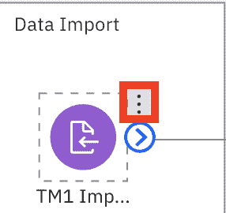

# 使用 SPSS Modeler 预测未来产品需求

> 原文：[`developer.ibm.com/zh/tutorials/predict-future-demand-using-spss-modeler/`](https://developer.ibm.com/zh/tutorials/predict-future-demand-using-spss-modeler/)

如[使用 AI 制定明智的库存和采购战略](https://developer.ibm.com/zh/articles/develop-an-intelligent-inventory-and-distribution-strategy-using-ai)一文所述，该用例的目标是使用人工智能 (AI) 构建智能库存和分销战略。在解决方案的这一部分中，您将预测产品的未来需求，帮助您使用 IBM Cloud® 上的 IBM® SPSS Modeler for IBM Watson® Studio 确定最佳库存水平。SPSS Modeler 是用于构建预测模型的数据挖掘和分析软件。通过使用 SPSS Modeler for Watson Studio，数据科学家和数据分析师可以在基于云的协作环境中工作，并与利益相关者快速共享其模型和结果。

## 学习目标

完成本教程后，您将掌握：

*   如何将数据上传到 Watson Studio
*   如何创建 SPSS Modeler 流程
*   如何使用 SPSS 工具来浏览和分析数据
*   如何修改、过滤和准备数据以创建 AI 模型
*   如何使用 SPSS 训练机器学习模型，并对结果进行评估

## 前提条件

要学习本教程，必须满足以下先决条件：

*   一个 [IBM Cloud 帐户](https://cloud.ibm.com/registration?cm_sp=ibmdev-_-developer-tutorials-_-cloudreg)

## 预估时间

完成本教程大约需要 30 分钟。

## 步骤

1.  在 IBM Cloud 上创建 Watson Studio 服务
2.  在 Watson Studio 中创建项目并上传数据
3.  将 Modeler Flow 添加到 Watson Studio 项目
4.  导入数据
5.  探索数据
6.  数据准备
7.  训练机器学习模型
8.  评估结果

### 在 IBM Cloud 上创建 Watson Studio 服务

本教程中的第一步是设置您的 IBM Cloud [Watson Studio 服务](https://cloud.ibm.com/catalog/services/watson-studio?cm_sp=ibmdev-_-developer-tutorials-_-cloudreg)实例。执行以下操作来设置免费的 Watson Studio 实例：

1.  登录至 IBM Cloud，然后单击 **Proceed** 以显示您已阅读数据权限。

2.  单击左上角的 **IBM Cloud**，确保您位于主页上。

3.  在您的 IBM Cloud 帐户中，单击搜索栏以搜索 IBM Cloud 服务和产品。输入 `Watson Studio`，然后单击 Catalog Results 下的 **Watson Studio**。

    这将转至 Watson Studio 服务页面。您可以在此处命名服务。例如，您可以将其命名为 Watson-Studio-trial。您还可以选择要在其中创建实例的数据中心。该演示展示了在达拉斯市创建的此用例的一个服务。

4.  选择 **Lite** 服务，该服务是免费的。虽然计算能力有限，但足以理解服务的主要功能。

5.  如果您不想对服务名称、位置和套餐进行修改，则单击 **Create**。这将创建您的 Watson Studio 实例。

    

### 在 Watson Studio 中创建项目并上传数据

1.  要启动 Watson Studio 服务，单击左上角的 **IBM Cloud** 以返回至主页。您应该会看到自己的服务以及服务名称。可能需要花几分钟时间进行更新。

2.  单击您的服务名称，这样会转至 Watson Studio 实例页面。单击 **Get Started**。

3.  单击 Watson Studio 页面上的 **Create a project**，然后单击 **Create an empty project**。

4.  命名您的项目，例如 insurance-demo。

5.  关联 IBM Cloud Object Storage 实例，以便存储数据集。在 **Select Storage service** 下，单击 **Add**。这样会转至 IBM Cloud Object Storage service 页面。

6.  保留服务处于 Lite 层，然后单击 **Create**。将提示您命名服务并选择资源组。

7.  选择名称，然后单击资源组所对应的 **Confirm**。

8.  刷新项目名称。您应该会在 Storage 下看到新创建的 IBM Cloud Object Store 实例。

9.  单击 **Create**，您已创建了自己的第一个 Watson Studio 项目。

    

10.  在创建 Watson Studio 项目后，单击 **Add to Project**。

    

11.  选择 **Data**。

12.  单击 **Browse**，然后转至克隆存储库的位置，并选择 **TM1 Import.csv**。

    

上传完毕后，您应该会看到 Upload successful，如下图所示。

### 将 Modeler Flow 添加到 Watson Studio 项目

1.  单击新创建的项目。

2.  单击右上角的 **Add to project**。

    

3.  选择 **Modeler flow**。

    

4.  选择 **From File**，浏览至克隆此存储库的位置，选择 **Demand Forecast.str** 文件，然后单击 **Create**。

    

### 导入数据

您应该会看到自己的流程，如下所示。

1.  在流程的左侧，在 Data Import 下，将鼠标悬停在 `TM1 Import` 节点上。您应该会看到显示三点图标。单击该图标。

    

2.  单击 **Open**。

    

3.  这将打开右侧面板，其中包含 TM1 Import 节点详细信息。单击 **Change data asset**。

    

4.  从左侧单击 **Data assets**，然后单击 **TM1 Import.csv**。单击 **OK**。

    

5.  单击右侧面板上的 **Save**。

    

在更新流程之后，即可开始探索数据。

### 探索数据

在对数据执行任何分析和预测之前，最好先探索数据集。

1.  从 **Data Import** 部分，将鼠标悬停在绿色的 6 Fields 节点上，再单击节点右侧的三点符号。然后单击 **Run**。

    

2.  在节点运行后，单击时钟图标。在 **Outputs** 部分中， 应该存在 **Data Audit of [6 Fields]** 部分。双击该部分。

    

您可以在此处获得数据集的可视化表示，并查看列的一些样本图。您可以看到一些统计度量，例如最大值、平均值、标准差以及有效字段数。您会看到 Actuals 字段的最大值（这是我们产品的需求）为 331，但平均值非常低，为 44。最后，您可以看到每列有多少条有效记录。

探索完数据集后，可以单击左上方面包屑中的流程名称返回到该流程。

### 数据准备

接下来，我们关注数据准备节点。这些是可修改数据集以预测您所需值的节点。*预览*节点是了解每个节点功能的一种不错的方法。可执行如下操作来预览节点，如 `TM1 Import` 节点：

1.  将鼠标悬停在节点上，然后单击三点符号。

    

2.  单击 **Preview**。

    

    这是查看流程中当前节点的数据外观的快速且简便的方法。下图显示了预览节点后应看到的内容。

    

3.  将鼠标悬停在 **Date** 节点上，单击三点符号，然后单击 **Preview**。

在预览节点后，您应该会看到 Date 节点将另一列添加到数据集 Date，并从 Period 列派生该值。

Filter 节点将移除 Statistical Base Forecast 列，而其他列保留原样。

Select 节点非常重要。它将获取数据子集，并使用表达式来执行此操作。您可以在表达式中看到，我只接受了美国市场 2019 年 1 月之前的日期。这让我能够做出更具体的预测，但仅针对美国市场，因为这是我们要关注的零售门店经理所在的位置。如果预览此节点，您会看到 Markets 列没有除美国以外的任何值。

最后一个数据准备节点是 Type 节点。这支持您对数据集中的字段进行特定的操作。在此节点中，将 Products 列划分为各个值，以便以后可以预测该列中每个产品的需求。

接下来，restructure 节点会为数据集创建新列。它从 Products 列中获取值，并在单独的列中添加该产品的 Actuals 需求值，以便可以轻松地区分对特定产品的需求。

如果将鼠标悬停在 Restructure 节点上，单击三点符号，然后单击 **Preview**，您可以看到添加到数据集的新列。

您还可以打开节点，这会向您展示如何通过合并 Products 和 Actuals 列生成多个字段。

要查看我们如何从之前创建的 Products_mask_Actuals 等字段中获取最大值，可将鼠标悬停在 Aggregate 上，然后单击 **Open**。这可确保库存中有足够的产品来满足最大需求。

同样地，将鼠标悬停在 Aggregate 节点上，单击三点符号，然后单击 **Preview**，可看到新列添加了后缀 `_Max`。

将鼠标悬停在 Type 上，然后单击 **Open**。您会看到我们已经将在先前步骤中创建的新字段指定为目标变量，因为我们要预测美国市场中 Products 列中每个产品的最大需求。

### 训练机器学习模型

将鼠标悬停在 29 fields 图标上，然后单击 **Run**。这会使用我们在先前步骤中准备的数据来运行时间预测模型。

在模型运行完后，您会看到 Outputs 选项卡 已更新。

### 评估结果

双击 Outputs 选项卡中的 **Analysis of [29 fields]**。您可以在此处看到对平均误差、最大误差以及与 $TS-Products_Actuals_Max 比较的其他值的评估情况。即，模型针对特定产品预测的最大需求与 Products_Actuals_Max 的比较，后者是训练期间（2016-2018 年）记录的最大需求。

双击 Outputs 选项卡中的 **Analysis of [10 fields]**。您可以在此处看到一些有趣产品的直观展示，这些产品在过去三个月的训练数据中展现出旺盛的需求。在 2018 年 10 月、11 月和 12 月，这些特定产品（口罩、洗手液和喷雾清洁剂）的需求都在飙升，远高于之前记录的水平，鉴于这三个月的训练数据，我们预测 2019 年的需求还会更高。您可以通过 $TS-Products_Actuals_Max 图表相对于 Products_Actuals_Max 图表直线斜率的急剧增加看出这一点。

## 结束语

本教程演示了在 IBM SPSS Modeler on Watson Studio 和 IBM SPSS Modeler 软件上创建预测性机器学习模型的一个小示例。本教程先介绍了如何将数据导入项目和建模器流程中，并为建模准备好数据。然后介绍了针对数据的运行时间序列算法和训练预测模型。最后介绍了如何直观呈现和评估经过训练模型的结果。

本文翻译自：[Predict future product demand using SPSS Modeler](https://developer.ibm.com/tutorials/predict-future-demand-using-spss-modeler/)（2020-11-30）