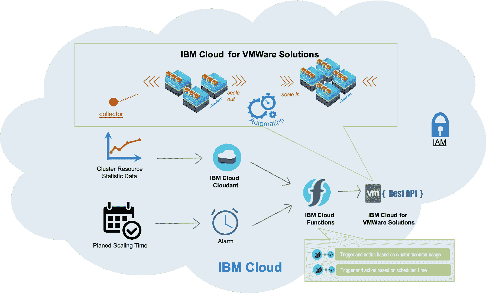
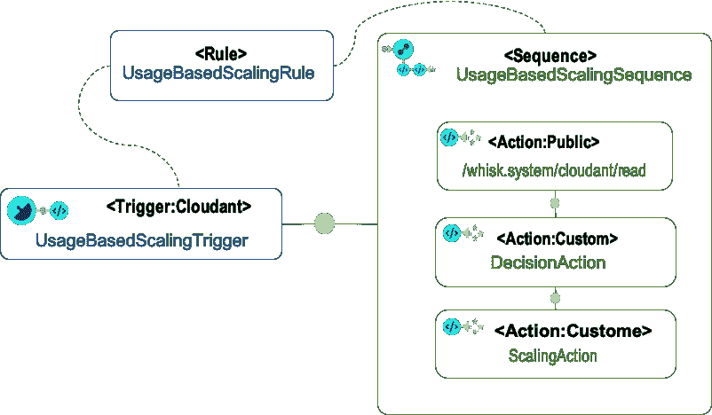
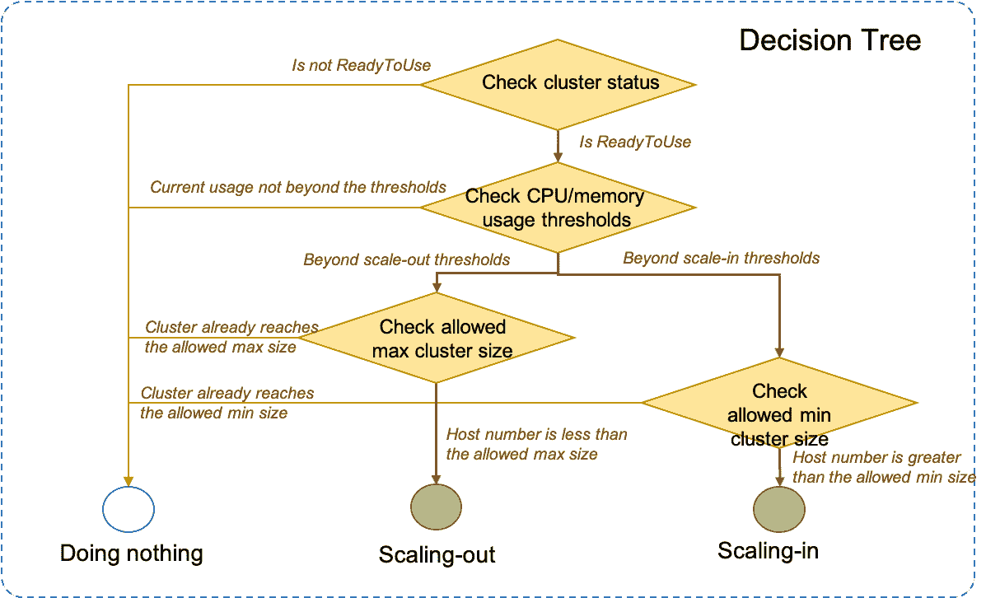
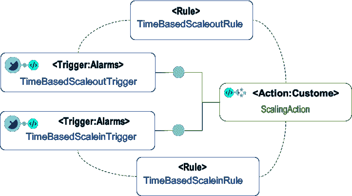
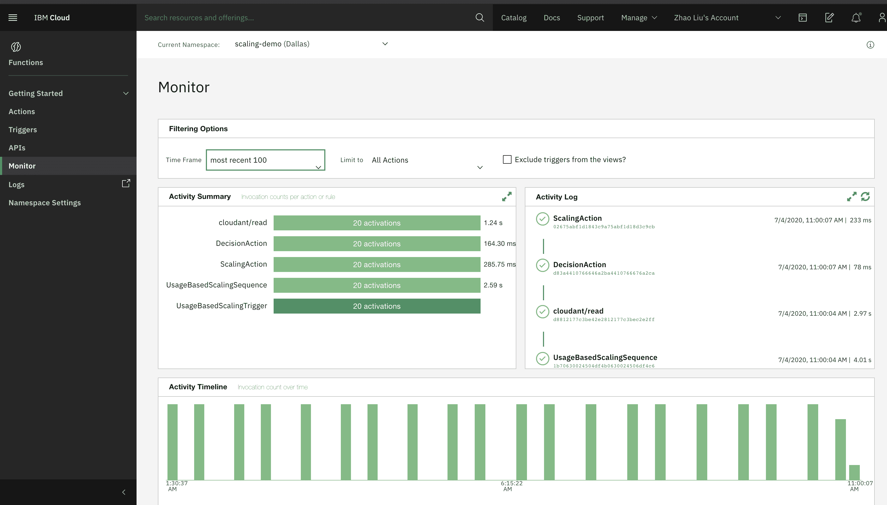

# 在 IBM Cloud 上自动缩放 VMware 集群

> 原文：[`developer.ibm.com/zh/tutorials/autoscaling-your-vmware-clusters-on-ibm-cloud/`](https://developer.ibm.com/zh/tutorials/autoscaling-your-vmware-clusters-on-ibm-cloud/)

## 简介

当集群上的工作负载增加并导致集群面临用尽 CPU 和内存等计算资源的风险时，您就需要扩展集群。向集群中添加更多主机是被称为*向外扩展*的缩放策略之一。新主机将额外的 CPU 和内存量引入集群级别的总体 CPU 和内存中。当工作负载减少并且资源处于空闲状态或不再使用时，可以从集群中删除一些主机，以节省所租用或所购买主机的费用。这称为*向内缩减*。

自动缩放的一个重要方面是自动执行在集群中添加和删除主机的过程。[IBM Cloud for VMware Solutions](https://www.ibm.com/cn-zh/cloud/vmware) 是一个自动化平台，用于 vCenter Server 和集群的部署以及后期的运营，支持添加和删除主机。IBM Cloud for VMware Solutions 还提供 [REST API](https://cloud.ibm.com/apidocs/vmware-solutions)，可自动执行与其他服务的集成过程。使用 IBM Cloud for VMware Solutions API 的优势在于，由于以下原因，缩放过程变得既简单又灵活：

*   IBM Cloud for VMware Solutions 自动化涵盖了添加主机的完整过程，包括配置裸机主机、配置主机、将主机迁移到集群中以及删除主机过程中的集群清理。
*   IBM Cloud for VMware Solutions 自动化在集群配置中使用最佳实践。例如，默认情况下，所有集群都启用了分布式资源调度程序 (DRS)；因此，将主机添加到集群中或从集群中删除主机时，集群上的工作负载会自动分布到集群上的所有现有主机，实现资源再均衡。
*   IBM Cloud for VMware Solutions REST API 支持自定义添加主机。例如，您不仅可以指定要添加的主机数量，还可以指定与集群中现有主机相同或不同的主机。

在某些情况下，可以预测集群缩放请求。例如，考虑集群级别的 CPU 和内存使用情况，是确定是否要向外扩展或向内缩减的关键因素之一。设置适当的阈值并使用相应的规则后，无需人工干预，即可触发缩放操作。再比如，假期期间，某些特殊应用程序（例如电子商务）的工作负载会出现大起大落；因此，提前计划和安排缩放操作是合理的。

[IBM Cloud Functions](https://cloud.ibm.com/functions) 是一个功能即服务 (FaaS) 平台，它提供了一组无服务器应用，您可以将它们绑定在一起，并与自定义代码相集成，以构建事件驱动的应用程序。您可以利用 IBM Cloud Functions 来定义上述缩放方案的触发器，并将调用 IBM Cloud for VMware Solutions REST API 的代码绑定到触发器。借助 REST API 背后的自动化功能，可构建从触发器到操作再到流程的端到端自动缩放解决方案。

本教程展示如何使用所有这些 IBM 服务来实现两种集群自动缩放方案：基于集群资源使用情况的缩放和基于时间的缩放。以下图表描述 IBM Cloud for VMware Solutions、IBM Cloud Functions 和其他 IBM 服务如何一起工作：



通过 [IBM Cloud Identity and Access Management (IAM)](https://cloud.ibm.com/docs/iam)，此处使用的所有 IBM 服务都可以在一个 IBM Cloud 帐户下共享一个 IAM 密钥。这有助于精简不同服务访问的管理工作。

## 学习目标

*   了解 IBM Cloud for VMware Solutions REST API 和用法
*   使用 VMware PowerCLI 收集 vCenter 集群的统计数据
*   使用 IBM Cloud Functions 集成 IBM Cloud for VMware Solutions REST API

## 前提条件

*   [IBM Cloud 帐户](https://cloud.ibm.com/login?cm_sp=ibmdev-_-developer-tutorials-_-cloudreg)和有效的 IAM 密钥
*   IBM Cloud for VMware Solutions 上的专用 vCenter Server 实例，以及安装了 [VMware PowerCLI](https://www.vmware.com/support/developer/PowerCLI) 且连接到 vCenter Server 的机器
*   IBM Cloud 上启用了 IAM 的 Cloudant 实例和启用了 IAM 的 Functions 名称空间
*   IBM Cloud CLI

## 预估时间

完成本教程大约需要 1 小时。

## 实施基于集群资源使用情况的缩放

本部分围绕基于集群资源使用情况的缩放提供了相关说明。

### 创建集群资源使用情况收集程序

收集程序是使用 PowerShell 编写的，并使用 VMware PowerCLI 连接到 vCenter Server。VMware PowerCLI 提供了 cmdlets，可从 vCenter 的各个组件中检索统计数据。[Get-Stat](https://code.vmware.com/docs/11794/cmdlet-reference/doc/Get-Stat.html?h=Get-Stat) 可以在给定的时间内从 vCenter Server 上的主机、集群或虚拟机返回 CPU、内存、磁盘、网络带宽等方面的最大、最小或平均使用率。收集程序使用 `Get-Stat` 获取最近 12 小时内集群 CPU 和内存的平均使用率。您可以根据集群上的工作负载活动模式来选择不同的时间段。

收集程序使用 IBM Cloud for VMware Solution Rest API 来获取 vCenter 凭证。在[为虚拟机和模板构建继承树](https://developer.ibm.com/components/cloud-pak-for-applications/tutorials/build-inheritance-trees-of-virtual-machines-and-templates/#2-use-ibm-cloud-for-vmware-solutions-rest-api-to-get-the-credential-of-your-vcenter-server-instances)教程的第 2 步中介绍了用法，其中包括用 Python 语言编写的代码。

收集程序将收集的数据写入 IBM Cloud 上 Cloudant 实例内的数据库中。如果您还没有 IBM Cloudant 实例，可转至 [IBM Cloud 目录](https://cloud.ibm.com/catalog/services/cloudant?cm_sp=ibmdev-_-developer-tutorials-_-cloudreg)创建一个实例。本教程使用名为 `my_cloudant` 的 Cloudant 实例以及 `my_cloudant` 中名为 monitoring 的数据库。实例 `my_cloudant` 具有名为 `cloudant-cred` 的凭证。

每个集群都有一个文档，集群名称将用作 monitoring 数据库中的文档 ID。它会存储收集的 CPU 和内存使用率以及 vCenter 实例的 ID。以下是集群 `workload-cluster` 的文档示例：

```
{
    "_id": "workload-cluster",
    "_rev": "76-3f4c7a4df17797ad5467de53d0ce879c",
    "instanceID": "82a265da-3949-49f5-8bb1-c5a199462156",
    "cpuUsagePercentage": 1.40
    "memoryUsagePercentage": 41.97
} 
```

**`收集程序脚本`**使用 [**`Cloudant REST API`**](https://cloud.ibm.com/docs/Cloudant?topic=Cloudant-documents) 来执行 Cloudant 操作，如 `read` 和 `update`。

下面展示了脚本的完整内容：

```
# file name: collector.ps1

param(
    [string]$ic4vURI,
    [string]$iamApiKey,
    [string]$cloudantURI,
    [string]$vCenterInstanceID
)

function authenticate([String] $apiKey){
    $body = @{
        "grant_type"="urn:ibm:params:oauth:grant-type:apikey"
        "apikey"=$apiKey
    }
    $header = @{
        "Accept"="application/json"
    }
    $params = @{
        Uri         = 'https://iam.cloud.ibm.com/identity/token'
        Headers     = $header
        Method      = 'POST'
        Body        = $body
        ContentType = 'application/x-www-form-urlencoded'
    }
    $response = Invoke-RestMethod @params
    return $response.access_token
}

function GetVcenterCredentials([String] $instanceID){

    $accessToken = authenticate $iamApiKey
    $vcenterInstanceURI = $ic4vURI + "/v1/vcenters/" + $instanceID
    $header = @{
        "Content-type"="application/json"
        "Authorization"="Bearer " + $accessToken
    }
    $vcenter = Invoke-RestMethod -Uri $vcenterInstanceURI -Method "GET" -Headers $header
    $return = @()
    foreach ($endpoint in $vcenter.endpoints) {
        if ($endpoint.type -eq "vCenter/PSC") {
            foreach( $credential in $endpoint.credentials){
                if ($credential.user -eq "Administrator@vsphere.local"){
                    $return += @{
                        "ipAddress"=[String]$endpoint.ip_address.Trim()
                        "user"=[String]$credential.user.Trim()
                        "password"=[String]$credential.password.Trim()
                    }
                    return $return
                }
            }
        }
    }
}

function CollectClusterResourceUsage([Int] $hours) {
    $start = (Get-Date).AddHours(- $hours)
    $stat = "cpu.usage.average","mem.usage.average"
    $clusterResourceUsage = foreach ($cluster in Get-Cluster) {
        Get-Stat -Entity $cluster -Start $start -Stat $stat | Group-Object -Property {$_.Entity.Name} |
        select  @{N="Name";E={$cluster.Name}},
                @{N="MEMAvg";E={$_.Group | Where {$_.MetricId -eq "mem.usage.average"} |
                    Measure-Object -Property Value -Average | Select -ExpandProperty Average}},
                @{N="CPUAvg";E={$_.Group | Where {$_.MetricId -eq "cpu.usage.average" -and $_.Instance -eq ""} |
                    Measure-Object -Property Value -Average | Select -ExpandProperty Average}}
    }
    return $clusterResourceUsage
}

function updateDatabase([String] $clusterName, [double] $cpuUsagePercentage, [double] $memoryUsagePercentage){
    $accessToken = authenticate $iamApiKey
    $cloudantDocURI = $cloudantURI + "/monitoring/" + $clusterName
    $header = @{
        "Content-type"="application/json"
        "Authorization"="Bearer " + $accessToken
    }

    $data = Invoke-RestMethod -Uri $cloudantDocURI -Method "GET" -Headers $header
    $newData = @{
        "_id" = $data._id
        "_rev" = $data._rev
        "instanceID" = $vCenterInstanceID
        "cpuUsagePercentage" = $cpuUsagePercentage
        "memoryUsagePercentage" = $memoryUsagePercentage
    }
    $newDataJson = $newData|ConvertTo-Json
    Invoke-RestMethod -Uri $cloudantDocURI -Method "PUT" -Headers $header -Body $newDataJson
}

$vcenter = GetVcenterCredentials  $vCenterInstanceID

Connect-VIServer -Server $vcenter.ipAddress  -Protocol https -User $vcenter.user -Password $vcenter.password

$usageClusters = CollectClusterResourceUsage 12

ForEach ($c in $usageClusters) {
    updateDatabase $c.Name $c.CPUAvg $c.MEMAvg
} 
```

脚本 **`collector.ps1`** 在连接到 vCenter Server 的机器上运行，您需要定期执行该脚本，以在 Cloudant 数据库中不断更新收集的数据。为此，您可以使用 Cron 作业或计划任务，具体取决于机器的操作系统。本教程使用 Linux 机器来运行收集程序；因此，将通过 `crontab` 中此处定义的 Cron 作业来执行脚本：

```
crontab -l
*/30 * * * * pwsh /root/collector.ps1 <Your IAM API KEY> <Your Cloudant instance URI> <Your vCenter instance ID> 
```

使用此 Cron 作业，每 30 分钟执行一次 **`collector.ps1`**。

其余步骤展示如何使用 IBM Cloud Functions 根据 Cloudant 数据库中集群 CPU 和内存使用情况的变化来触发缩放操作。该图表描述了组件及其与 IBM Cloud Functions 概念的关系。



使用名为 `UsageBasedScalingSequence` 的序列中的三个操作来执行缩放任务。`read` 操作设法连接到 Cloudant 实例，并从 Cloudant 数据库检索所有集群文档的内容，其中包含 CPU 和内存使用情况的统计数据。`read` 操作会将数据传递到下一个操作 `DecisionAction`。`DecisionAction` 具有预定义的逻辑，可以通过检查当前统计数据来确定集群是否需要缩放操作；它会做出决策，并将决策传递给最后一个操作 `ScalingAction`。`ScalingAction` 会根据决策添加主机、删除主机或不执行任何操作。

一个公共操作用于 `read` 操作，因为它已经包含从指定的 Cloudant 数据库中访存文档的代码片段。`DecisionAction` 和 `ScalingAction` 是客户操作，为它们提供了决策逻辑代码和调用 IBM Cloud for VMware Solutions REST API 的代码。

`UsageBasedScalingTrigger` 是绑定到 Cloudant 数据库 monitoring 的触发器。数据库的每次更改都会触发该触发器。规则 `UsageBasedScalingRule` 将 `UsageBasedScalingTrigger` 与序列 `UsageBasedScalingSequence` 关联，以便在触发该触发器时调用序列中的操作。

在本教程中，使用带有 [Cloud Functions CLI 插件](https://cloud.ibm.com/docs/openwhisk?topic=openwhisk-cli_install)的 IBM Cloud CLI（例如，命令 **`ibmcloud fn`**）来创建 IBM Cloud Functions 触发器、操作和规则，以及将它们聚合到先前图表所示的结构中。

以下代码片段中使用的所有 **`ibmcloud fn`** 命令都将在启用 IAM 的 Function 名称空间中运行。如果您还没有 Function 名称空间，可转至[管理名称空间](https://cloud.ibm.com/docs/openwhisk?topic=openwhisk-namespaces)页面，了解如何创建一个名称空间。运行命令 **`ibmcloud fn property set --namespace <namespace id>`**，切换到您在运行其他 **`ibmcloud fn`** 命令之前创建的名称空间。

### 创建绑定到 IBM Cloudant 数据库的软件包

您需要使用绑定到 IBM Cloudant 数据库的 Cloudant 软件包的订阅源来创建 Cloudant 类型触发器。

运行以下命令，创建名为 `scaling-cloudant-binding` 的 `/whisk.system/cloudant` 软件包绑定。

```
$ ibmcloud fn package bind /whisk.system/cloudant scaling-cloudant-binding 
```

运行以下命令，使用所提供的 Cloudant 实例名称和凭证名称将服务 `cloudantnosqldb` 绑定到绑定软件包 `scaling-cloudant-binding`。

```
$ ibmcloud fn service bind cloudantnosqldb scaling-cloudant-binding --instance my-cloudant --keyname 'cloudant-cred' 
```

如果您不知道 Cloudant 凭证的名称，可运行命令 **`ibmcloud resource service-keys --instance-name <cloudant instance name>`** 进行查找。

### 创建 Cloudant 触发器

运行以下命令，使用先前步骤中所创建软件包绑定的 `changes` 订阅源创建名为 `UsageBasedScalingTrigger` 的触发器，并将 Cloudant 数据库 monitoring 作为 **`dbname**` 参数提供。

```
$ ibmcloud fn trigger create UsageBasedScalingTrigger --feed /_/scaling-cloudant-binding/changes --param dbname monitoring 
```

### 创建自定义操作

在决定缩放时，应考虑以下信息：

*   CPU 和内存使用率阈值：这是基于集群资源使用情况的缩放方案中的基本缩放条件。通过将当前 CPU 和内存使用率与预定义的 CPU 和内存使用率向外扩展阈值和向内缩减阈值进行比较，可以决定是否该向外扩展或向内缩减集群，以获得更多的 CPU 和内存资源或撤回一些资源。

*   集群状态：在调用添加或删除主机的 IBM Cloud for VMware Solutions API 时，将请求启动自动化过程，而不是实际运行自动化过程。此过程可能需要长达一个小时才能完成主机的添加操作，而删除主机则可能需要半个小时。在运行此过程中，您不应做出其他缩放决定，因为在添加或删除主机过程中，该决定并不准确。需要通过集群状态来确定缩放过程是否完成。在 IBM Cloud for VMware Solutions 中，当开始添加主机或删除主机的自动化过程时，集群状态将从 ReadyToUse 更改为 Modifying，并且直到该过程完成，状态才会更改回 ReadyToUse。这可以帮助确定当前是否应再进行缩放。特别是，如果集群未处于 ReadyToUse 状态，即使当前 CPU 和内存使用率已超过阈值，也不会执行任何缩放操作。

*   集群的最大和最小大小：这考虑了 VMware 集群中可支持的主机数的限制，以及工作负载集群上计划的预算。如果集群继续向外扩展或向内缩减，它将达到主机数量限制，并导致添加或删除主机失败，或者将使集群超出计划的预算。您可以通过在缩放决策中检查集群允许的最大或最小主机数来避免这两种情况。

考虑到以上所有情况，将以下决策树放入 DecisionAction 中。



运行以下命令，创建一个名为 `DecisionAction` 的操作，提供了名为 `scaling_decision.py` 的 Python 脚本，并带有一组参数，包括 CPU 和内存使用率阈值以及集群中允许的最大和最小主机数。

```
$ ibmcloud fn action create DecisionAction scaling_decision.py --param scaleout_threshold_cpu 80 --param scaleout_threshold_memory 80 --param scalein_threshold_cpu 10 --param scalein_threshold_memory 10 --param max_allowed_host_num 32 --param min_allowed_host_num 2 
```

用于添加主机的 CPU 和内存使用率的初始阈值设置为 80%，而用于删除主机的阈值设置为 10%。允许的集群大小设置为 2 到 32 个主机。您可以稍后通过运行 `fn action update` 命令来调整所有这些参数，如下所示。

```
$ ibmcloud fn action update ResourceUsageBasedAction --param scaleout_threshold_cpu <new value> --param scaleout_threshold_memory <new value> --param scalein_threshold_cpu <new value> --param scalein_threshold_memory <new value> 
```

```
$ ibmcloud fn action update ResourceUsageBasedAction --param max_allowed_host_num <new value> --param min_allowed_host_num <new value> 
```

Python 脚本 **`scaling_decision.py`** 会实现决策树。入口函数 `main` 接受 JSON 格式的参数，包括 Cloudant 数据库中集群资源使用情况文档的内容，以及阈值和允许的最大和最小集群大小。它以 JSON 格式返回决策结果，供下一个缩放操作使用。此处使用 IBM Cloud for VMware Solutions API 获取集群状态和集群中的主机数。

```
# file name: scaling_decision.py

import os
import requests

ic4v_base_uri = 'https://api.vmware-solutions.cloud.ibm.com'
auth_uri = 'https://iam.cloud.ibm.com/identity/token'

def authenticate():
    api_key = os.environ['__OW_IAM_NAMESPACE_API_KEY']
    headers = {'Accept': 'application/json'}
    params = {
        'grant_type': 'urn:ibm:params:oauth:grant-type:apikey',
        'apikey': api_key
    }
    resp = requests.post(auth_uri, data=params, headers=headers)
    if resp.status_code == 200:
        json = resp.json()
        headers['Authorization'] = 'Bearer %s' % json['access_token']
        headers['X-Auth-Refresh-Token'] = json['refresh_token']
        return headers
    else:
        raise Exception('Failed to get token')

def get_cluster_info(instance_id, cluster_name):
    uri = '%s/v1/vcenters/%s/clusters' % (ic4v_base_uri, instance_id)
    headers = authenticate()
    resp = requests.get(uri, headers=headers)
    clusters = resp.json() if resp.status_code == 200 else []
    for cluster in clusters:
        if cluster['name'] == cluster_name:
            uri = '%s/v1/vcenters/%s/clusters/%s' % (ic4v_base_uri, instance_id, cluster['id'])
            cluster_resp = requests.get(uri, headers=headers)
            return cluster_resp.json() if resp.status_code == 200 else {}

def main(params):
    cluster_name = params['_id']
    instance_id = params['instanceID']
    cluster_info = get_cluster_info(instance_id, cluster_name)

    decision = {
        "cluster_name": cluster_name,
        "instance_id": instance_id,
        "host_num": 1,
        "scaling_type": None
    }

    if cluster_info['status'] == 'ReadyToUse':
        hosts = cluster_info.get('hosts', [])

        if params['cpuUsagePercentage'] > params['scaleout_threshold_cpu']\
                or params['memoryUsagePercentage'] > params['scaleout_threshold_memory']:
            if len(hosts) < params['max_allowed_host_num']:
                decision['scaling_type'] = 'scale-out'
            else:
                print('The current hosts already reaches the allowed maximum number')

        if params['cpuUsagePercentage'] < params['scalein_threshold_cpu']\
                and params['memoryUsagePercentage'] < params['scalein_threshold_memory']:
            if len(hosts) > params['min_allowed_host_num']:
                decision['scaling_type'] = 'scale-in'
            else:
                print('The current hosts already reaches the allowed minimum number')
    else:
        print('Scaling is not allowed under current cluster status: %s' % cluster_info['status'])

    print('Scaling decision is %s' % decision['scaling_type'])
    return decision 
```

### 创建自定义操作

运行以下命令，创建名为 `ScalingAction` 的操作，并提供 Python 脚本 **`scaling.py`**。

```
$ ibmcloud fn action create ScalingAction scaling.py 
```

脚本 **`scaling.py`** 实现调用 IBM Cloud for VMware Solutions API，以在给定集群中添加主机或删除主机。

入口函数 `main` 接受 JSON 格式的参数，包括 vCenter 实例的 ID、要缩放的集群名称以及缩放类型。缩放类型决定为添加主机而调用 API 或为删除主机而调用 API 的不同代码路径。该参数还提供要添加或删除的主机数。对于“添加主机”API 调用，将创建有效负载以包含主机号；对于“删除主机”API 调用，将创建有效负载以包含要删除的主机的 ID 列表，这些主机是从最近添加的主机中选择的。

```
# file name: scaling.py

import os
import requests
import json

ic4v_base_uri = 'https://api.vmware-solutions.cloud.ibm.com'
auth_uri = 'https://iam.cloud.ibm.com/identity/token'

def authenticate():
    api_key = os.environ['__OW_IAM_NAMESPACE_API_KEY']
    headers = {'Accept': 'application/json'}
    params = {
        'grant_type': 'urn:ibm:params:oauth:grant-type:apikey',
        'apikey': api_key
    }
    resp = requests.post(auth_uri, data=params, headers=headers)
    if resp.status_code == 200:
        json = resp.json()
        headers['Authorization'] = 'Bearer %s' % json['access_token']
        headers['X-Auth-Refresh-Token'] = json['refresh_token']
        return headers
    else:
        raise Exception('Failed to get token')

def get_cluster_info(instance_id, cluster_name):
    uri = '%s/v1/vcenters/%s/clusters' % (ic4v_base_uri, instance_id)
    headers = authenticate()
    resp = requests.get(uri, headers=headers)
    clusters = resp.json() if resp.status_code == 200 else []
    for cluster in clusters:
        if cluster['name'] == cluster_name:
            uri = '%s/v1/vcenters/%s/clusters/%s' % (ic4v_base_uri, instance_id, cluster['id'])
            cluster_resp = requests.get(uri, headers=headers)
            return cluster_resp.json() if resp.status_code == 200 else {}
    return {}

def add_host(instance_id, cluster_name, host_num):
    cluster_info = get_cluster_info(instance_id, cluster_name)

    header = authenticate()
    header['Content-Type'] = 'application/json'
    payload = {
        "quantity": host_num
    }
    uri = '%s/v1/vcenters/%s/clusters/%s/hosts' % (ic4v_base_uri, instance_id, cluster_info['id'])
    resp = requests.post(uri, headers=header, data=json.dumps(payload))
    return resp.status_code == 202, resp.content

def remove_host(instance_id, cluster_name, host_num):
    cluster_info = get_cluster_info(instance_id, cluster_name)
    hosts = cluster_info.get('hosts', [])
    hosts = sorted(hosts, key=lambda i: i['provision_date'])

    header = authenticate()
    header['Content-Type'] = 'application/json'
    playload = {
        "action": "delete",
        "hosts": [h['id'] for h in hosts[:host_num]]
    }
    uri = '%s/v1/vcenters/%s/clusters/%s/hosts' % (ic4v_base_uri, instance_id, cluster_info['id'])
    resp = requests.patch(uri, headers=header, data=playload)
    return resp.status_code == 202, resp.json()

def main(param):
    if param['scaling_type'] == 'scale-out':
        result, msg = add_host(param['instance_id'], param['cluster_name'], param['host_num'])
    elif param['scaling_type'] == 'scale-in':
        result, msg = remove_host(param['instance_id'], param['cluster_name'], param['host_num'])
    else:
        result = False
        msg = 'The scaling action is not supported'

    if result:
        return {"message": "succeeded"}
    else:
        return {"message": msg} 
```

### 创建操作序列

要在此处创建的序列包含来自 `/whisk.system/cloudant` 软件包的公共 `read` 操作，以及您创建的两个自定义操作 `DecisionAction` 和 `ScalingAction`。

运行以下命令以创建名为 `UsageBasedScalingSequence` 的序列，并添加 `read`、`DecisionAction` 和 `ScalingAction` 操作。

```
$ ibmcloud fn action create ResourceBasedScalingActionSequence --sequence <full path of read action in scaling-cloudant-binding package>, <full path of DecisionAction>, <full path of ScalingAction> 
```

运行以下命令以从绑定软件包 `scaling-cloudant-binding` 中获取 `read` 操作的完整路径。

```
$ ibmcloud fn package get <full path of scaling-cloudant-binding> 
```

如果您不知道绑定软件包的完整路径，可运行 `ibmcloud fn package list` 先进行查询。

运行 `ibmcloud fn action list` 以获取 `DecisionAction` 和 `ScalingAction` 操作的完整路径。

### 创建规则

运行以下命令以创建名为 `UsageBasedScalingRule` 的规则，以将触发器 `UsageBasedScalingTrigger` 与序列 `UsageBasedScalingSequence` 关联。

```
$ ibmcloud fn rule create UsageBasedScalingRule UsageBasedScalingTrigger UsageBasedScalingSequence 
```

此部分中使用的 IBM Cloud for VMware Solutions API 包括：

*   POST /v1/vcenters/{instance_id}/clusters/{cluster_id}/hosts：将主机添加到特定集群。
*   POST /v1/vcenters/{instance_id}/clusters/{cluster_id}/hosts：从特定集群中删除主机。
*   GET /v1/vcenters/{instance_id}/clusters/{cluster_id}：获取集群详细信息，包括其主机。
*   GET /v2/vcenters/{instance_id}/clusters：列出包含该集群名称和集群 ID 的所有集群。

## 实现基于时间的缩放

本部分围绕基于集群时间的缩放提供了相关说明。

在基于时间的缩放方案中，会在指定日期执行缩放操作。此图表描述了方案中使用的触发器和操作。



两个触发器 `TimeBasedScaleoutTrigger` 和 `TimeBasedScaleinTrigger` 绑定到 `Alarms` 服务，具有用于预期向外扩展和向内缩减的不同日期。在计划的日期，将触发触发器以调用 `ScalingAction` 操作，该操作通过规则 `TimeBasedScaleoutRule` 和 `TimeBasedScaleinRule` 与触发器关联。

### 创建警报触发器

本教程中使用的 `Alarms` 类型触发器仅在计划的时间触发一次；因此，这些触发器是使用 `/whisk.system/alarms/once` 的订阅源创建的。

运行以下两个命令以创建两个类型为 `Alarm` 且具有不同日期和缩放类型的触发器（`TimeBasedScaleoutTrigger` 和 `TimeBasedScaleinTrigger`）。

```
$ ibmcloud fn trigger create TimeBasedScaleoutTrigger --feed /whisk.system/alarms/once --param trigger_payload "{\"scaling_type\":\"scale-out\", \"host_num\": 2, \"cluster_name\":\"workload-cluster\"}" --param date "2020-12-24T00:00:00.000Z" 
```

```
$ ibmcloud fn trigger create TimeBasedScaleinTrigger --feed /whisk.system/alarms/once --param trigger_payload "{\"scaling_type\":\"scale-in\", \"host_num\": 2, \"cluster_name\":\"workload-cluster\"}" --param date "2021-1-2T00:00:00.000Z" 
```

`TimeBasedScaleoutTrigger` 用于添加 2 个主机，并于 2020 年 12 月 24 日这天到来时触发；`TimeBasedcaleinTrigger` 则用于删除 2 个主机，并于 2021 年 1 月 1 日这天结束时触发。

### 创建规则

`TimeBasedScaleoutTrigger` 和 `TimeBasedScaleinTrigger` 共享在实施基于集群资源使用情况的缩放方案步骤中创建的相同 `ScalingAction`。根据触发器中定义的 `trigger_payload` 中的 `scaling_type`，`ScalingAction` 中的脚本会转至用于添加主机和删除主机的不同路径。

运行以下两个命令以创建名为 `TimeBasedScaleoutRule` 和 `TimeBasedScaleinRule` 的规则，并将 `TimeBasedScaleoutTrigger` 和 `TimeBasedScaleinRule` 触发器与 `ScalingAction` 关联。

```
$ ibmcloud fn rule create TimeBasedScaleoutRule TimeBasedScaleoutTrigger ScalingAction 
```

```
$ ibmcloud fn rule create TimeBasedScaleinRule TimeBasedScaleinRule ScalingAction 
```

## 监视缩放活动

您可以使用 [IBM Cloud Functions 仪表板](https://cloud.ibm.com/functions/dashboard?cm_sp=ibmdev-_-developer-tutorials-_-cloudreg)监视所创建触发器和操作的活动，并跟踪对集群执行的缩放操作。



您可以在 `Activity Log` 中显示的每个操作中找到脚本的输出，了解缩放决策和缩放操作的结果。

以下是对 `DecisionAction` 操作的一次调用的示例。

```
{
    "activationId": "7d920648ba904f30920648ba902f30b4",
    "annotations": [{
        "key": "causedBy",
        "value": "sequence"
    }, {
        "key": "path",
        "value": "7c3ffaa6-e6b2-45ea-8337-9ba8ee90aeb0/DecisionAction"
    }, {
        "key": "kind",
        "value": "python:3.7"
    }, {
        "key": "timeout",
        "value": false
    }, {
        "key": "limits",
        "value": {
            "concurrency": 1,
            "logs": 10,
            "memory": 256,
            "timeout": 60000
        }
    }],
    "cause": "b0bace6795384378bace67953883788b",
    "duration": 232,
    "end": 1593918009531,
    "logs": ["2020-07-04T11:30:03.467102Z    stdout: Scaling decision is scale-out"],
    "name": "DecisionAction",
    "namespace": "7c3ffaa6-e6b2-45ea-8337-9ba8ee90aeb0",
    "publish": false,
    "response": {
        "result": {
            "instance_id": "82a265da-3949-49f5-8bb1-c5a199462156",
            "scaling_type": "scale-out",
            "host_num": 1
        },
        "status": "success",
        "success": true
    },
    "start": 1593918009299,
    "subject": "ServiceId-ef2edd10-c0d5-415c-a01c-2bac16832d61",
    "version": "0.0.1"
} 
```

## 结束语

在完成本教程后，您应该了解了在 IBM Cloud for VMware Solutions 平台上的 vCenter 实例上用于在集群中添加主机和删除主机的 IBM Cloud for VMware Solutions REST API。您还应该能够使用 IBM Cloud Functions 为以下两种集群自动缩放方案创建触发器和操作，即基于集群资源使用情况的缩放和基于时间的缩放。

本文翻译自：[Autoscale your VMware clusters on IBM Cloud](https://developer.ibm.com/tutorials/autoscaling-your-vmware-clusters-on-ibm-cloud/)（2020-11-19）