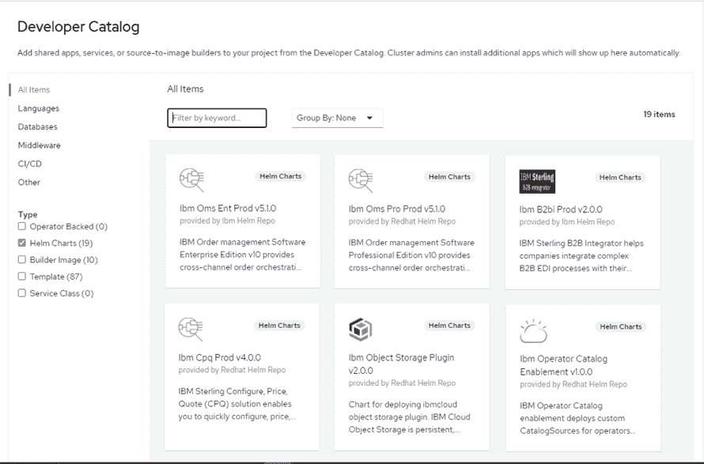
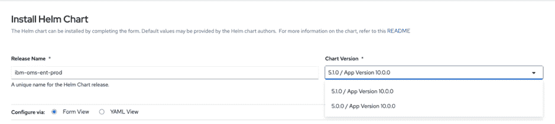
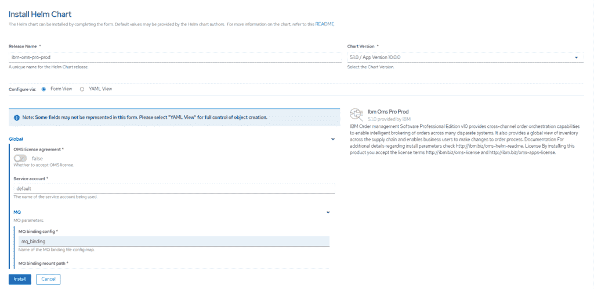

# 使用 Red Hat OpenShift 4.6 实施 IBM Sterling Order Management Helm Chart

> 原文：[`developer.ibm.com/zh/tutorials/use-openshift-helm-ui-to-deploy-ibm-sterling-order-management/`](https://developer.ibm.com/zh/tutorials/use-openshift-helm-ui-to-deploy-ibm-sterling-order-management/)

## 结合使用 Red Hat OpenShift Container Platform 4.6 和 Sterling Order Management Helm Chart

一年多来，IBM Sterling™ Order Management 容器一直在 Red Hat® OpenShift® Container Platform 上可用。除了增强的功能外，每个季度的 Order Management 发行版还使用最新的 Red Hat OpenShift 容器化和部署策略。

Red Hat OpenShift 4.4 在 Developer Catalog 中使用 Helm Chart 引入了容器部署。默认情况下在 Red Hat OpenShift Helm Chart Catalog 中提供了 IBM Sterling Order Management（字幕产品）。Red Hat OpenShift Helm Catalog 和 IBM Sterling Order Management 都支持 Helm 3 及更高版本。

Red Hat OpenShift Container Platform v4.6 基于 4.4 中的 Helm Chart 功能构建。在此发行版中，您可以：

*   将 Helm 存储库添加到 Developer Catalog。您可以通过添加 ibm-helm 存储库和自定义存储库位置，在整个开发、测试和生产实例中部署图表。
*   通过使用 Form View 选项，以更简单、更直观的方式部署 Order Management Helm Chart。当图表中包含 Helm 3 values.schema.json 值时，此方法可用。
*   将不同版本的 Helm Chart 部署到不同的名称空间。

## 学习目标

在本教程中，您将学习如何：

*   在 Red Hat OpenShift 4.6 上配置您自己的 Helm Chart 存储库
*   使用 Developer Catalog Form View 实施 Sterling Order Management 图表

## 前提条件

确保安装 Red Hat OpenShift Container Platfom 4.6 并满足所有 IBM Sterling Order Management 部署先决条件。

*   [Red Hat OpenShift Container Platform 4.6 文档](https://docs.openshift.com/container-platform/4.6/welcome/index.html)
*   [IBM Sterling Order Management 部署先决条件](https://www.ibm.com/support/knowledgecenter/zh/SS6PEW_10.0.0/installation/c_OMRHOC_deploy_preprequisites.html)

## 预估时间

完成本教程大约需要 30 分钟。

## 步骤

### 配置 Helm 存储库

在 Red Hat OpenShift Container Platform 4.4x 集群中，默认预先配置了 Red Hat Helm 存储库。在 OpenShift Container Platform 4.6 中，您可以使用 OpenShift 控制台配置其他图表存储库。来自所有已配置的 Helm 存储库的 Chart 都将合并到 Developer Catalog 内的单个视图中。如果一个 chart 在多个存储库中重复，那么图表图块将显示源存储库的名称。

您可以使用用户界面或命令行来配置 Helm Chart。

### 用户界面

1.  登录到 Red Hat OpenShift Container Platform。
2.  从左侧导航窗格中，选择 **Developer dashboard**。
3.  单击 **Search**，然后单击 **Resources** 菜单。从列表中选择 **HelmChartRepository**。
4.  单击 **Create HelmChartRepository**，然后输入 YAML 定义。

### 命令行

1.  使用 `oc` 命令行界面登录到 Red Hat OpenShift Container Platform。
2.  将 `HelmChartRepository` 自定义资源应用于目标 Helm 存储库。
    `kubectl apply -f <helmchartrepository.yaml>`
3.  输入 YAML 定义。

```
$ cat <<EOF | kubectl apply -f -
apiVersion: helm.openshift.io/v1beta1
kind: HelmChartRepository
metadata:
  name: ibm-helm-repo
spec:
  connectionConfig:
    url: https://raw.githubusercontent.com/IBM/charts/master/repo/ibm-helm
EOF 
```

Developer Catalog 显示配置的 Helm Chart 存储库中的 chart。



## 安装 chart

Form View 是 Red Hat OpenShift Container Platform 4.6 中的新功能。当 Helm 3 `values.schema.json` 存在于 chart 中时，默认将显示随 Sterling Order Management Helm Chart 5.1.0 启用的 Form View。您可以轻松浏览 Helm Chart 中可用的各种配置选项：

1.  在左侧导航窗格中，单击 **+Add**，然后选择 **From Catalog** 选项。将显示 Developer Catalog 页面。
2.  选择要安装的 Order Management chart，阅读 chart 的信息，然后单击 **Install Helm Chart**。将显示 Install Helm Chart 页面。
3.  **Configure via** 字段，确保选择 **Form View**。
4.  **Chart Version** 字段，选择相应的 Helm Chart 版本。列表将显示符合 `Chart.yaml` 文件中所定义条件的 Helm Chart。
    
5.  遵循[“*安装经过专业版或企业版认证的容器镜像*”](https://www.ibm.com/support/knowledgecenter/en/SS6PEW_10.0.0/installation/c_OMRHOC_installing.html)主题中的指示来配置 Helm Chart、提取镜像并将镜像部署到 Red Hat OpenShift 集群中。 

### 结束语

在本教程中，您学习了如何使用 OpenShift Container Platform 4.6 中引入的新用户界面来完成 chart 存储库配置和 IBM Sterling Order Management 安装。

本文翻译自：[Implement IBM Sterling Order Management Helm Chart using Red Hat OpenShift 4.6](https://developer.ibm.com/tutorials/use-openshift-helm-ui-to-deploy-ibm-sterling-order-management/)（2020-11-06）